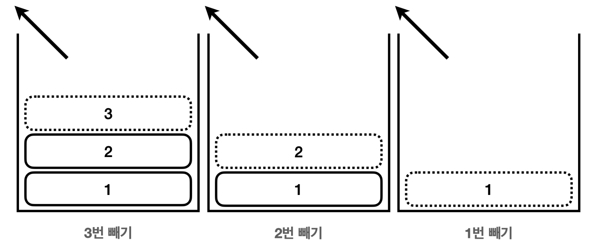

## 자바 메모리 구조

### 자바의 메모리 구조는 크게 메서드 영여그 스택 영역, 힙 영역 3개로 나눌  수 있다. 

    

**메서드 영역** 
- 메서드 영역은 프로그램을 실행하는데 필요한 공통 데이터를 관리한다.
- 이 영역은 프로그램의 모든 영역에서 공유한다.
  - 클래스 정보: 클래스의 실행 코드(바이트 코드), 필드, 메서드와 생성자 코드등 모든 실행 코드가 존재한다. 
  - static 영역: `static` 변수들을 보관한다. 
  - 런타임 상수 풀: 프로그램을 실행하는데 필요한 공통 리터럴 상수를 보관한다.
  - 예를 들어서 프로그램에 `"hello"` 라는 리터럴 문자가 있으면 이런 문자를 공통으로 묶어서 관리한다. 
  - 이 외에도 프로그램을 효율 적으로 관리하기 위한 상수들을 관리한다. (참고로 문자열을 다루는 문자열 풀은 자바 7부터 힙 영역으로 이 동했다.)

    

- 메서드는 공통적으로 사용되어 공유 되고, 필드는 메모리에 각각 저장되고, 다르게 사용이 된다.
- 즉, 인스턴스의 메서드를 호출하면 실제로는 메서드 영역에 있는 코드를 불러서 수행한다.

**스택 영역** 
- 자바 실행 시, 하나의 실행 스택이 생성된다.
- 각 스택 프레임은 **지역 변수, 중간 연산 결과, 메서드 호출 정보** 등을 포함한다.
    - 스택 프레임: 스택 영역에 쌓이는 네모 박스가 하나의 스택 프레임이다. 메서드를 호출할 때 마다 하나의 스택 프레임이 쌓이고, 메서드가 종료되면 해당 스택 프레임이 제거된다.

**힙 영역** 
- 객체(인스턴스)와 배열이 생성되는 영역이다.
- 가비지 컬렉션(GC)이 이루어지는 주요 영역이며, 더 이상 참조되지 않는 객체는 GC에 의해 제거된다.

> 참고 : 스택 영역은, 각 쓰레드 별로 하나의 실해 스택이 생성된다. 따라서 쓰레드 수 만큼 쓰레드 수 만큼 스택 영역이 생성된다. 지금은 쓰레드를 1개만 사용하므로 스택 영역도 하나이다.

---

## 스택과 큐 자료 구조 

### 스택 구조

    

#### 스택 넣기

    

#### 스택 빼기

    

> 후입 선출 : 여기서 가장 마지막에 넣은 3버이 가자 먼저 나온다. 이렇게 나중에 넣은 것이 가장 먼저 나오는 것을 후입 선출이라 하고, 이런 자료구조를 스택이라 한다. 

 
 
 
 

### 큐구조

    

### 정리
> 프로그램 실행과 메서드 호출에는 스택 구조가 적합하다. ㅅ하지만, 선착순 이벤트 같은 경우는 큐구조가 적합하다.

