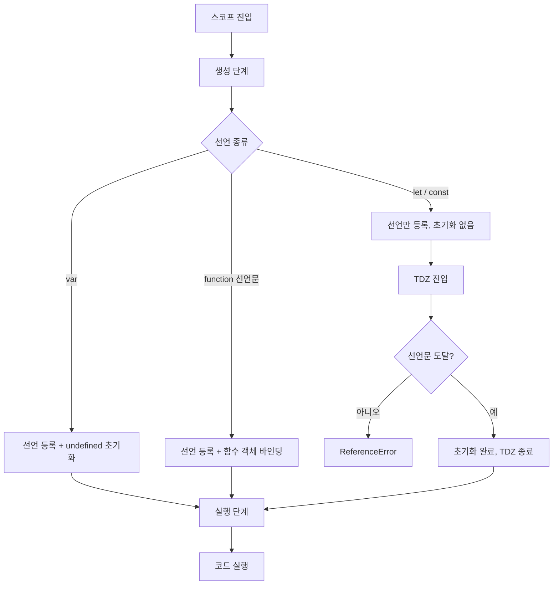

# JavaScript 호이스팅(Hoisting)

호이스팅은 자바스크립트 엔진이 코드를 실행하기 전에 선언부를 스코프의 최상단으로 끌어올린 것처럼 동작하는 현상을 말한다. 단어만 보면 "끌어올린다"는 의미지만 실제로 코드가 물리적으로 이동하는 건 아니다. 엔진이 실행 컨텍스트를 만드는 시점에 변수·함수 선언을 먼저 메모리에 등록하고, 그다음에 코드를 한 줄씩 실행하기 때문에 결과적으로 위로 올라간 것처럼 보일 뿐이다.

이 동작은 `var`가 지배하던 시절에는 버그의 원인이 되었고, `let`·`const`가 들어오면서 TDZ(Temporal Dead Zone)라는 새로운 개념이 생기는 배경이 됐다. 백엔드에서 Node.js로 서비스를 운영하다 보면 의외로 호이스팅 때문에 디버깅에 한참을 쓰는 경우가 있다. 특히 거대한 라우터 파일이나 설정 모듈에서 변수 순서 하나 때문에 문제가 터진다.

## 실행 컨텍스트와 호이스팅의 실체

자바스크립트 엔진이 함수나 스크립트를 실행할 때는 두 단계를 거친다. 첫 번째는 생성(creation) 단계, 두 번째는 실행(execution) 단계다. 생성 단계에서 엔진은 현재 스코프를 훑어보면서 어떤 변수와 함수가 선언되어 있는지 파악하고, 환경 레코드(Environment Record)에 그 이름들을 등록한다. 이때 선언의 종류에 따라 초기화 방식이 달라진다.

```javascript
console.log(x); // undefined
var x = 10;
console.log(x); // 10
```

위 코드를 엔진이 실제로 실행하는 흐름은 아래와 같다고 보면 된다.

```javascript
// 생성 단계에서 엔진이 처리하는 모습 (개념적 표현)
var x; // 선언이 먼저 등록되고 undefined로 초기화

// 실행 단계
console.log(x); // undefined (이미 선언은 됐지만 할당 전)
x = 10;         // 할당
console.log(x); // 10
```

`var`는 선언과 동시에 `undefined`로 초기화되기 때문에 선언 이전 줄에서 접근해도 에러가 나지 않는다. 반면 `let`과 `const`는 선언만 등록되고 초기화는 실제 코드 줄에 도달했을 때 이루어진다. 이 "등록은 됐지만 초기화는 안 된" 구간이 바로 TDZ다.

## var의 호이스팅 동작

`var`는 함수 스코프(function scope)다. 블록(`{}`) 안에서 선언해도 함수 전체 스코프로 호이스팅된다.

```javascript
function getUser() {
  if (true) {
    var name = 'Alice';
  }
  console.log(name); // 'Alice' — if 블록 밖에서도 접근 가능
}
```

`var`의 호이스팅이 골치 아픈 이유는 단순히 스코프 문제 때문만이 아니다. 재선언이 허용된다는 점도 크다. 같은 이름을 여러 번 선언해도 에러가 나지 않기 때문에, 긴 파일을 유지보수하다 보면 같은 변수명이 여러 군데에서 쓰이고 마지막 할당이 덮어쓰는 식의 버그가 자주 나온다.

```javascript
var config = loadConfig();
// ... 500줄 아래 ...
var config = { mode: 'dev' }; // 의도치 않은 재선언, 에러 없음
```

이런 코드가 섞이면 `config`를 참조하는 중간 코드가 어떤 값을 보게 되는지 추적하기가 매우 힘들어진다. 10년 전쯤 운영하던 Node.js 코드베이스에서 이런 문제가 실제로 있었고, 팀 전체가 `let`/`const`로 넘어가는 결정적인 계기가 됐다.

## 함수 선언문과 함수 표현식의 호이스팅 차이

호이스팅을 이야기할 때 가장 헷갈리는 부분이 함수다. 함수 선언문(function declaration)과 함수 표현식(function expression)은 호이스팅 방식이 다르다.

```javascript
// 함수 선언문 — 함수 전체가 호이스팅된다
sayHello(); // 'Hello' — 선언 전에 호출해도 동작

function sayHello() {
  console.log('Hello');
}
```

함수 선언문은 이름과 함수 본문까지 통째로 호이스팅된다. 엔진이 생성 단계에서 함수 객체를 만들어 바인딩까지 완료하기 때문에, 어디서 호출하든 동작한다.

```javascript
// 함수 표현식 — 변수 호이스팅만 일어남
sayHello(); // TypeError: sayHello is not a function

var sayHello = function () {
  console.log('Hello');
};
```

함수 표현식은 변수 `sayHello`가 `var`로 호이스팅되어 `undefined` 상태가 되고, 할당은 실제 그 줄에 도달해야 일어난다. 그래서 선언 전에 호출하면 `undefined()`를 호출하는 꼴이 되어 `TypeError`가 난다.

`let`으로 선언한 함수 표현식은 상황이 또 다르다.

```javascript
sayHello(); // ReferenceError: Cannot access 'sayHello' before initialization

let sayHello = function () {
  console.log('Hello');
};
```

이 경우 TDZ에 걸려서 `ReferenceError`가 난다. 실무에서는 이 에러가 `TypeError`보다 훨씬 추적하기 쉽다. 에러 메시지에 "initialization" 얘기가 나오면 바로 호이스팅·TDZ 문제라는 걸 알 수 있기 때문이다.

## TDZ (Temporal Dead Zone)

TDZ는 ES6에서 `let`·`const`가 도입되면서 생긴 개념이다. 변수는 선언 자체는 호이스팅되어 스코프 최상단에 등록되지만, 실제로 코드가 선언문에 도달해서 초기화가 일어나기 전까지는 접근할 수 없는 구간을 말한다.

```javascript
{
  // 여기부터 TDZ 시작
  console.log(count); // ReferenceError
  console.log(typeof count); // ReferenceError — var였다면 'undefined'
  let count = 5; // TDZ 끝, 초기화 완료
  console.log(count); // 5
}
```

흥미로운 건 `typeof`조차 TDZ 안에서는 에러를 던진다는 점이다. `var` 시절에는 `typeof undeclaredVar`이 `'undefined'`를 반환해서 "선언됐는지 확인"하는 용도로 쓰는 패턴이 있었는데, `let`·`const`에는 그게 통하지 않는다.

### 기본 매개변수에서의 TDZ

함수 기본 매개변수에서도 TDZ가 발생한다.

```javascript
function calc(a = b, b = 1) {
  return a + b;
}
calc(); // ReferenceError: Cannot access 'b' before initialization
```

매개변수는 왼쪽부터 순서대로 초기화되는데, `a`의 기본값에서 아직 초기화되지 않은 `b`를 참조하려 하니 TDZ에 걸린다. 순서만 바꾸면 정상 동작한다.

```javascript
function calc(b = 1, a = b) {
  return a + b;
}
calc(); // 2
```

### const도 호이스팅된다

흔히들 "`const`는 호이스팅되지 않는다"고 설명하는 글이 있는데 정확하지 않다. `const`도 선언 자체는 호이스팅되고, 단지 TDZ 때문에 선언 이전에 접근할 수 없을 뿐이다.

```javascript
console.log(PI); // ReferenceError (TDZ)
const PI = 3.14;
```

이 구분이 왜 중요하냐면, 같은 스코프 안에서 이름이 중복될 때 어떤 선언이 바인딩되는지를 이해해야 디버깅이 되기 때문이다.

```javascript
var x = 1;
{
  // 이 블록 안에서 아래 let x 때문에 TDZ가 형성된다
  console.log(x); // ReferenceError — 바깥 x가 아니라 블록 안의 let x를 본다
  let x = 2;
}
```

블록 스코프 안의 `let x`가 호이스팅되어 블록 전체에 TDZ를 만들기 때문에, 바깥 `var x`를 참조할 거라고 기대했던 코드가 에러를 뱉는다. 이 동작을 모르면 "왜 바깥 변수가 안 보이지?"하고 한참을 헤맨다.

## 호이스팅 처리 흐름



## 실무에서 자주 만나는 호이스팅 버그

### 반복문 안의 var 클로저 문제

10년 전 jQuery 코드베이스에서 가장 많이 보던 버그다. 지금도 레거시 코드를 만지면 종종 나온다.

```javascript
var handlers = [];
for (var i = 0; i < 3; i++) {
  handlers.push(function () {
    console.log(i);
  });
}
handlers[0](); // 3
handlers[1](); // 3
handlers[2](); // 3
```

`var i`는 함수 스코프라 반복문이 끝난 시점의 `i = 3`을 모든 클로저가 공유한다. `let`으로 바꾸면 반복마다 새로운 바인딩이 생겨서 예상대로 동작한다.

```javascript
const handlers = [];
for (let i = 0; i < 3; i++) {
  handlers.push(function () {
    console.log(i);
  });
}
handlers[0](); // 0
handlers[1](); // 1
handlers[2](); // 2
```

### 조건부 함수 선언

함수 선언문을 블록 안에서 하면 환경에 따라 동작이 달라진다. ES5 엄격 모드, ES6, 브라우저·Node.js 구현이 각각 다르다.

```javascript
if (true) {
  function greet() {
    console.log('hi');
  }
}
greet(); // 환경에 따라 동작하거나 ReferenceError
```

이 코드는 쓰지 말아야 한다. 조건부로 함수를 정의하려면 함수 표현식으로 변수에 할당하는 방식이 명확하다.

```javascript
let greet;
if (condition) {
  greet = function () { console.log('hi'); };
} else {
  greet = function () { console.log('bye'); };
}
```

### 모듈 초기화 순서 문제

Node.js에서 모듈 간 순환 의존성이 있을 때 호이스팅과 결합되면 진단이 까다롭다.

```javascript
// a.js
const b = require('./b');
console.log(b.value); // undefined — b가 아직 초기화 중

// b.js
const a = require('./a');
exports.value = 42;
```

`b.js`가 `a.js`를 `require`하는 순간 `a.js`는 아직 실행 중이라 `module.exports`가 비어 있는 상태다. 이 상태에서 `b.js`가 실행되고 `exports.value = 42`를 하기 전에 `a.js`에서 `b.value`를 찍으면 `undefined`가 나온다. 호이스팅 자체의 문제는 아니지만, "변수는 선언돼 있는데 값이 이상하다"는 증상이 비슷해서 같이 언급한다.

### 라우터 파일에서의 순서 버그

Express 같은 프레임워크에서 라우터를 모아놓는 파일이 길어지면 이런 실수가 잘 나온다.

```javascript
router.get('/user', getUserHandler);

const getUserHandler = (req, res) => {
  res.json({ user: 'Alice' });
};
// ReferenceError: Cannot access 'getUserHandler' before initialization
```

`const`로 선언된 핸들러를 선언 이전에 참조했기 때문에 서버 부팅 자체가 실패한다. `function` 선언문으로 바꾸면 호이스팅 덕에 동작한다.

```javascript
router.get('/user', getUserHandler);

function getUserHandler(req, res) {
  res.json({ user: 'Alice' });
}
```

운영 환경에서 겪기 전에 `eslint-plugin-import`의 `no-use-before-define` 규칙을 켜두면 빌드 단계에서 잡힌다.

### 클래스 호이스팅

클래스도 `let`·`const`처럼 호이스팅되지만 TDZ에 갇힌다.

```javascript
const user = new User(); // ReferenceError
class User {}
```

클래스 내부 메서드에서 다른 클래스를 참조할 때 순서 때문에 문제가 되는 경우가 있다. 팩토리 함수로 감싸거나, 파일 분리로 해결하는 게 낫다.

## 쓸 때 주의할 점

`var`는 새로 작성하는 코드에 쓰지 않는다. 이건 스타일 문제가 아니라 버그를 예방하는 문제다. 기본은 `const`, 재할당이 필요할 때만 `let`을 쓴다.

함수 선언문의 호이스팅을 일부러 활용해서 "하단에 헬퍼 함수를 모아두고 상단에서 호출하는" 스타일은 가독성 측면에서 호불호가 갈린다. 팀 컨벤션으로 통일하는 게 좋다. 호출하는 쪽이 위에 있으면 의도 읽기가 쉽다는 장점은 분명히 있다.

TDZ 에러 메시지(`Cannot access 'X' before initialization`)를 만나면 99% 확률로 선언 순서 문제다. 에러가 난 줄 위쪽에서 같은 이름의 `let`·`const`·`class` 선언을 찾으면 된다.

`typeof`로 변수 존재를 확인하는 오래된 패턴은 `let`·`const`에서 통하지 않는다. 선언 여부를 확인하려면 `try/catch`로 감싸거나, 모듈 시스템을 쓰는 경우에는 `import`/`require`로 명시적 의존성을 표현한다.
