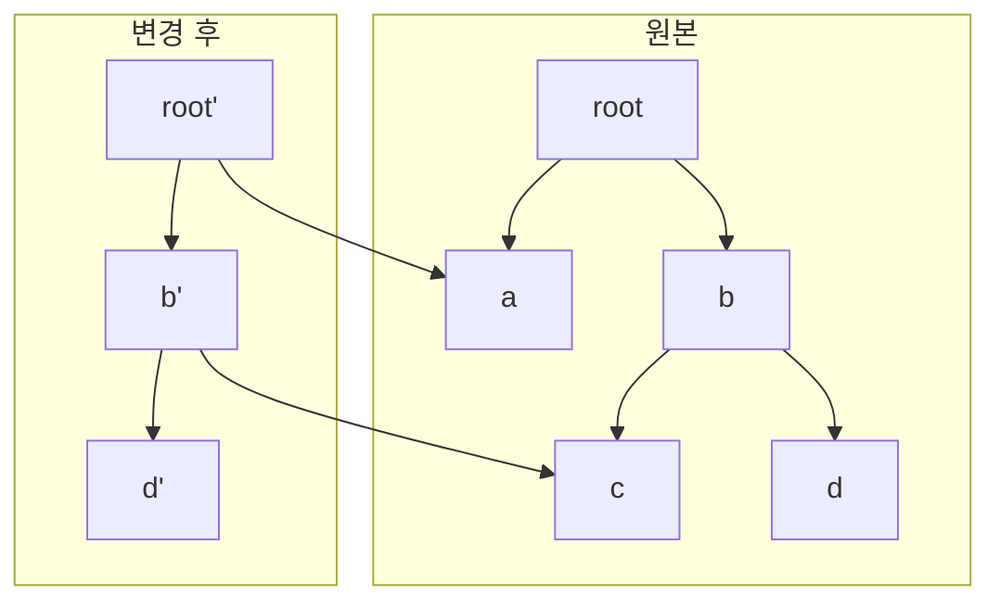

# JavaScript 얕은 복사/깊은 복사 심화

## 들어가기 전에

복사 문제는 입사 1~2년차에 한 번 호되게 당하고 그 다음부터 평생 의식하면서 코드를 짜게 되는 주제다. `setState`로 객체를 업데이트했는데 React가 리렌더링을 안 하는 일, Redux store를 직접 수정해서 디버깅 도구가 변경 이력을 못 잡는 일, `JSON.parse(JSON.stringify(...))`로 복사한 객체에서 `Date`가 문자열로 바뀌어 있는 일, lodash 없이 `cloneDeep`을 만들었는데 순환 참조 때문에 스택 오버플로가 나는 일—전부 같은 뿌리에서 나오는 문제다.

기본 개념(얕은 복사 vs 깊은 복사)은 [Copy_개념.md](Copy_개념.md)에서 다뤘으니 여기서는 V8 내부 동작, `structuredClone`의 알고리즘, 특수 객체별 복사 차이, 실무 트러블슈팅 위주로 정리한다.

---

## 1. V8 힙/스택과 객체 참조

### 원시값과 객체의 메모리 배치 차이

V8은 실행 시점에 값을 두 영역에 나눠 저장한다. 원시값(`number`, `boolean`, 작은 정수 등)은 SMI(Small Integer) 태깅이나 인라인 슬롯으로 들어가서 사실상 변수 슬롯 자체에 박혀 있다. 객체는 힙(heap)에 별도로 할당되고, 변수 슬롯에는 그 객체를 가리키는 포인터(태깅된 주소)가 들어간다.

```javascript
const a = 42;          // 변수 슬롯에 SMI(42)가 박힘
const b = a;           // 슬롯 값 자체를 복사 → 완전히 독립

const obj = { x: 1 };  // 힙에 객체 생성, obj 슬롯에 포인터 저장
const ref = obj;       // obj의 포인터를 ref 슬롯에 복사 → 같은 힙 객체 가리킴
```

`b = a`는 정수 `42`를 슬롯 단위로 통째로 복사한다. 반면 `ref = obj`는 포인터(보통 64비트 머신에서 8바이트)만 복사한다. "참조형은 주소를 복사한다"는 표현은 이 동작을 뭉뚱그린 것이다. 정확히는 V8이 SMI/HeapObject를 구분하기 위해 하위 1비트를 태그로 쓰고, 객체일 때만 그 포인터가 힙의 객체 헤더(Map 포인터 + 프로퍼티/엘리먼트 슬롯)를 가리키는 구조다.

### Hidden Class와 복사의 비용

V8은 같은 형태(같은 키 순서로 같은 키들이 정의된)의 객체에 대해 동일한 Hidden Class를 공유한다. 객체를 복사하면 새 객체가 만들어지는데, 키 추가 순서가 원본과 같다면 같은 Hidden Class를 그대로 쓸 수 있어 비교적 싸다. 하지만 `Object.assign({}, src)`처럼 빈 객체에 키를 하나씩 붙이는 방식은 Hidden Class 전이(transition)를 거치고, 복사 대상이 많은 키를 가진 객체라면 인라인 캐시 미스로 의외로 느리다.

실무에서 이 차이를 의식해야 하는 케이스는 두 가지다. 핫 패스에서 매 호출마다 큰 객체를 spread로 복사하는 코드, 그리고 키가 동적으로 추가되는 객체를 lodash로 cloneDeep 하는 코드다. 전자는 구조적 공유(아래 Immer 절)로, 후자는 가능하면 키 형태를 미리 고정해두는 방식으로 푼다.

### 참조 비교가 일어나는 지점

React의 `useMemo`/`useCallback`/`memo`, Redux의 `===` selector, RxJS의 `distinctUntilChanged`—전부 참조 동등성으로 변경 여부를 판단한다. 얕은 복사를 한 새 객체는 내부 키들이 같아도 참조가 다르므로 무조건 "변경됨"으로 잡힌다. 반대로 안에 있는 객체를 mutate하고 spread만 한 단계 한 객체는 그 안쪽 객체 참조는 그대로라서 "변경되지 않음"으로 잡혀 리렌더가 안 된다. 복사를 어디까지 깊게 할지 결정할 때 항상 "어떤 라이브러리가 어디서 참조 비교를 하는가"를 같이 봐야 한다.

---

## 2. structuredClone 내부 동작

### HTML 명세 기반의 복제 알고리즘

`structuredClone`은 ECMAScript가 아니라 HTML 명세(Web Platform)에 정의된 Structured Clone Algorithm을 노출한 함수다. Node.js 17부터, 모든 모던 브라우저에서 지원된다. 동작은 대략 이렇다.

1. 입력 값의 타입을 검사한다.
2. 원시값이거나 복제 가능한 객체면 같은 타입의 새 인스턴스를 만든다.
3. 내부적으로 메모리 맵(JavaScript의 Map과 유사)을 들고 다니면서 이미 본 객체는 같은 새 인스턴스를 재사용한다 → 순환 참조와 공유 참조가 자연스럽게 보존된다.
4. 복제 불가능한 타입이 발견되면 `DataCloneError`를 던진다.

```javascript
const a = { x: 1 };
const b = { ref1: a, ref2: a };
const cloned = structuredClone(b);
console.log(cloned.ref1 === cloned.ref2); // true → 같은 객체로 복제됨

const cyclic = {};
cyclic.self = cyclic;
const c = structuredClone(cyclic);
console.log(c.self === c); // true → 순환도 살아남음
```

`JSON.parse(JSON.stringify(...))`는 둘 다 무너진다. JSON 직렬화는 동일 객체가 두 번 등장하면 두 번 다 따로 직렬화하고, 순환 참조면 `TypeError: Converting circular structure to JSON`이 난다. 깊은 복사가 정말 필요한 자리에서는 `structuredClone`이 사실상 표준 답이다.

### DataCloneError가 나는 케이스

함수, Symbol(전역 Symbol 제외), DOM 노드 일부, 클래스 인스턴스의 메서드, getter/setter 등은 복제 대상이 아니다. 아래는 실무에서 자주 부딪히는 케이스다.

```javascript
// 1. 함수
structuredClone({ fn: () => 1 });
// DataCloneError: () => 1 could not be cloned.

// 2. Symbol 키 (값이 아니라 키로 쓴 경우는 무시되며, 값은 일부만 가능)
structuredClone({ [Symbol('k')]: 1 });
// 에러는 안 나지만 Symbol 키는 사라짐 → Object.keys(cloned).length === 0

// 3. 클래스 인스턴스의 prototype
class User { greet() { return 'hi'; } }
const u = new User();
const c = structuredClone(u);
console.log(c instanceof User);  // false → 일반 Object로 복제됨
console.log(c.greet);            // undefined
```

세 번째가 특히 까다롭다. ORM이나 도메인 모델 객체를 그대로 `structuredClone` 하면 prototype chain이 끊어진 plain object가 나온다. 메서드는 사라지고 `instanceof` 체크는 깨진다. 이런 도메인 객체는 직렬화 가능한 DTO와 분리해서 다루는 게 안전하다.

### Transferable 객체

`structuredClone`의 두 번째 인자로 `transfer` 옵션을 주면 `ArrayBuffer`, `MessagePort`, `ReadableStream` 같은 Transferable 객체의 소유권을 옮길 수 있다. 이 경우 원본은 detached 상태가 되어 더 이상 사용할 수 없게 되고, 새 인스턴스만 메모리를 가진다. 큰 바이너리 데이터를 워커로 보낼 때 메모리 복사 비용을 0에 가깝게 줄이는 트릭이다.

```javascript
const buf = new ArrayBuffer(1024 * 1024 * 100); // 100MB
const cloned = structuredClone(buf, { transfer: [buf] });
console.log(buf.byteLength);    // 0 → detached
console.log(cloned.byteLength); // 104857600
```

`postMessage`와 동일한 메커니즘이다. 메인 스레드와 워커가 큰 데이터를 주고받을 때는 항상 transfer를 의식해야 한다. 안 그러면 복사 비용 때문에 워커로 옮긴 의미가 사라진다.

---

## 3. 순환 참조 처리: WeakMap 기반 깊은 복사

`structuredClone`이 없던 시절에는 cloneDeep을 직접 만들어야 했다. 단순 재귀로 짜면 순환 참조에서 무한 루프에 빠지므로 본 객체를 추적하는 캐시가 필요한데, 일반 `Map`을 쓰면 복사 작업이 끝난 뒤에도 원본 객체가 GC 대상이 되지 못한다. 그래서 `WeakMap`을 쓴다.

```javascript
function deepClone(value, seen = new WeakMap()) {
    if (value === null || typeof value !== 'object') return value;

    if (seen.has(value)) return seen.get(value);

    let copy;
    if (value instanceof Date) {
        copy = new Date(value.getTime());
    } else if (value instanceof RegExp) {
        copy = new RegExp(value.source, value.flags);
        copy.lastIndex = value.lastIndex;
    } else if (value instanceof Map) {
        copy = new Map();
        seen.set(value, copy);
        for (const [k, v] of value) copy.set(deepClone(k, seen), deepClone(v, seen));
        return copy;
    } else if (value instanceof Set) {
        copy = new Set();
        seen.set(value, copy);
        for (const v of value) copy.add(deepClone(v, seen));
        return copy;
    } else if (Array.isArray(value)) {
        copy = [];
    } else {
        copy = Object.create(Object.getPrototypeOf(value));
    }

    seen.set(value, copy);

    for (const key of Reflect.ownKeys(value)) {
        const desc = Object.getOwnPropertyDescriptor(value, key);
        if (desc.get || desc.set) {
            Object.defineProperty(copy, key, desc);
        } else {
            copy[key] = deepClone(value[key], seen);
        }
    }
    return copy;
}
```

핵심은 네 가지다. 첫째, `seen.set(value, copy)`를 재귀 호출 전에 해야 한다. Map/Set의 빈 컨테이너를 먼저 캐시에 넣어야 그 안의 자식이 부모를 참조할 때 무한 루프가 안 난다. 둘째, `Reflect.ownKeys`는 string 키 + Symbol 키를 모두 가져온다. `for...in`은 prototype chain까지 훑고 enumerable만 보고, `Object.keys`는 Symbol을 빼먹는다. 셋째, getter/setter는 `Object.defineProperty`로 정의 자체를 복사해야 호출되지 않는다(`copy[key] = ...`로 넣으면 그 자리에서 getter가 실행되어 결과값이 들어간다). 넷째, prototype은 `Object.getPrototypeOf`로 가져와서 `Object.create`로 복원해야 클래스 인스턴스 형태가 유지된다.

이 정도까지 하면 lodash `cloneDeep`이 하는 일의 대부분을 커버한다. 하지만 실제 lodash는 50줄이 아니라 600줄이다. WeakRef, Buffer, 호스트 객체, DOM 노드, 사용자 정의 toJSON 등 수십 개의 엣지 케이스를 처리한다. 직접 짜야 한다면 여기까지 하고, 그 이상은 표준 라이브러리에 맡기는 게 낫다.

---

## 4. 특수 객체별 복사 동작

### Date / RegExp

```javascript
const d = new Date('2026-01-01');
JSON.parse(JSON.stringify({ d })).d;        // "2026-01-01T00:00:00.000Z" (string)
structuredClone({ d }).d instanceof Date;   // true
{...{ d }}.d instanceof Date;               // true (참조 그대로)
```

JSON 변환은 `Date.prototype.toJSON`이 호출되면서 ISO 문자열이 된다. spread는 한 단계만 복사하니 같은 Date 인스턴스를 가리킨다. `structuredClone`은 새 Date를 만들어준다. `RegExp`는 JSON 변환 시 `{}`(빈 객체)가 되는 점이 더 위험한데, 디버깅 중 사라진 정규식 패턴을 추적하느라 시간을 버리는 일이 의외로 흔하다.

### Map / Set

```javascript
const m = new Map([['k', 1]]);
JSON.stringify(m);                  // "{}" → 키 사라짐
structuredClone(m).get('k');        // 1 → 정상 복제
{...m};                             // {} → spread는 iterable의 entry를 키로 못 씀
new Map(m);                         // 같은 키/값으로 새 Map (1단계 복사)
```

Map/Set을 JSON으로 직렬화하는 순간 데이터가 사라지므로 API 응답에 Map을 그대로 넣어 보내는 코드를 써본 적 있다면 이 트랩을 한 번은 만나봤을 것이다. 직렬화가 필요한 자리에서는 `Array.from(map.entries())`로 미리 풀거나, `MessagePack`/`CBOR` 같은 바이너리 포맷을 쓴다.

### TypedArray / ArrayBuffer

```javascript
const buf = new ArrayBuffer(8);
const view = new Uint8Array(buf);
view[0] = 42;

const cloned = structuredClone(view);
cloned[0] = 99;
console.log(view[0]);  // 42 → 독립된 ArrayBuffer
```

`structuredClone`은 underlying ArrayBuffer를 통째로 복제한다. spread로 `[...view]`를 하면 일반 배열이 되어 TypedArray 특성이 사라지고, `new Uint8Array(view)`는 새 ArrayBuffer를 만들어 같은 데이터를 복사한다. `Uint8Array.from(view)`도 동일하다. 큰 바이너리는 위에서 본 transfer 옵션을 고려해야 한다.

### Blob / File

`Blob`과 `File`은 `structuredClone`이 정상 처리한다. 다만 Blob 내부 데이터는 즉시 복사되지 않고 같은 데이터를 가리키는 새 핸들이 만들어지는 식으로 동작한다(브라우저 구현 의존). 실용적으로는 "복사 후 한쪽을 수정해도 다른 쪽에 영향 없다"는 보장만 받으면 된다.

---

## 5. 키와 프로퍼티 디스크립터: 사라지는 것들

### Symbol 키

```javascript
const k = Symbol('id');
const obj = { [k]: 1, name: 'a' };

JSON.stringify(obj);             // '{"name":"a"}' → Symbol 키 사라짐
{...obj}[k];                     // 1 → spread는 Symbol 키도 복사
Object.assign({}, obj)[k];       // 1 → assign도 Symbol 키 복사
structuredClone(obj)[k];         // undefined → structuredClone은 Symbol 키 무시
```

Symbol 키는 직렬화에는 약하고 메모리 복사에는 부분적으로 강하다. spread/`Object.assign`은 own enumerable + Symbol을 복사하지만 `JSON.stringify`와 `structuredClone`은 빠뜨린다. 라이브러리가 Symbol 키로 메타데이터를 박아두는 경우(예: `react`의 `$$typeof`, `redux`의 일부 마커) cloneDeep 후 라이브러리 동작이 깨지면 Symbol 키 누락을 의심해야 한다.

### non-enumerable 프로퍼티

```javascript
const obj = {};
Object.defineProperty(obj, 'hidden', { value: 1, enumerable: false });

{...obj};                  // {}
Object.assign({}, obj);    // {}
JSON.stringify(obj);       // "{}"
structuredClone(obj);      // {}
```

전부 빠진다. non-enumerable로 박은 메타데이터는 cloneDeep을 거치면 사라진다고 가정해야 한다. `Object.getOwnPropertyDescriptors` + `Object.defineProperties` 조합으로 직접 복사해야 보존된다.

### getter / setter

```javascript
const obj = {
    _count: 0,
    get count() { console.log('getter called'); return this._count; }
};

const a = { ...obj };           // "getter called" 출력 → 호출 시점에 평가된 값이 들어감
console.log(a.count);           // getter 없음, 그냥 0
const b = Object.assign({}, obj);  // 동일하게 호출
```

spread와 `Object.assign`은 둘 다 getter를 호출한다. 데이터베이스 쿼리를 트리거하는 getter, 비싼 계산을 하는 lazy getter가 있다면 cloneDeep이 의도치 않게 모든 getter를 발화시킨다. 이런 객체는 `Object.getOwnPropertyDescriptors`로 디스크립터를 그대로 복사해야 안전하다.

```javascript
const safeCopy = Object.create(
    Object.getPrototypeOf(obj),
    Object.getOwnPropertyDescriptors(obj)
);
// getter는 호출되지 않음, 디스크립터 자체가 복사됨
```

### prototype chain

```javascript
class User {
    constructor(name) { this.name = name; }
    greet() { return `hi ${this.name}`; }
}
const u = new User('a');

const a = { ...u };                  // {name: 'a'}, prototype은 Object.prototype
const b = Object.assign({}, u);      // 동일
const c = JSON.parse(JSON.stringify(u));  // 동일
const d = structuredClone(u);        // 동일

a instanceof User;  // false
a.greet;            // undefined
```

어느 방법으로 복사하든 prototype은 끊어진다. 클래스 인스턴스의 정체성을 유지하려면 직접 짠 deepClone에서 `Object.create(Object.getPrototypeOf(value))`로 복원하거나, 클래스에 `clone()` 메서드를 따로 두는 게 정석이다. ORM, 상태 머신, 도메인 객체에서 이 함정을 자주 본다.

---

## 6. spread vs Object.assign: 사소해 보이는 차이들

표면적으로 `{...obj}`와 `Object.assign({}, obj)`는 같은 일을 하는 것처럼 보이지만 차이가 있다.

```javascript
// 1. setter 동작
class Foo {
    set x(v) { console.log('setter on Foo:', v); }
}
const target = new Foo();

Object.assign(target, { x: 1 });  // setter on Foo: 1 → setter 호출
({ ...target, x: 1 });            // setter 호출되지 않고, 단순히 데이터 프로퍼티 x=1 생성

// 2. getter 호출
const src = { get a() { return Date.now(); } };
const a1 = Object.assign({}, src);  // getter 호출, 값으로 박힘
const a2 = { ...src };              // getter 호출, 값으로 박힘 (둘 다 호출)

// 3. prototype 무시
const proto = { inherited: 1 };
const obj = Object.create(proto);
obj.own = 2;

({ ...obj });               // { own: 2 } → prototype의 inherited 무시
Object.assign({}, obj);     // { own: 2 } → 동일
```

핵심 차이는 setter다. `Object.assign`은 target의 setter를 호출하지만, spread는 새 객체를 만들면서 데이터 프로퍼티만 정의하므로 target의 setter는 무시된다. 이미 setter가 정의된 인스턴스를 업데이트할 때 `Object.assign(this, patch)`와 `Object.assign(this, {...this, ...patch})`가 다르게 동작하는 이유다.

prototype은 둘 다 무시한다. spread/`Object.assign`이 own enumerable만 복사한다는 것을 잊으면, 클래스의 인스턴스 메서드가 사라진 객체를 다른 함수에 넘기고 거기서 메서드 호출 에러가 나는 식으로 디버깅이 길어진다.

---

## 7. frozen / sealed 객체 복사

`Object.freeze`와 `Object.seal`은 복사된 객체에 그대로 따라가지 않는다.

```javascript
const frozen = Object.freeze({ a: 1, nested: { b: 2 } });

const c1 = { ...frozen };
Object.isFrozen(c1);          // false → 복사본은 frozen 아님
c1.a = 99;                    // 정상 동작

c1.nested === frozen.nested;  // true → 안쪽은 같은 객체
c1.nested.b = 99;             // 동작 (안쪽은 frozen이 아니었음)
```

`Object.freeze`는 얕게 동작한다. nested 객체는 frozen이 아니었으니 자식까지 변경 가능하다. spread/`Object.assign`/`structuredClone` 모두 복사본의 frozen 상태를 풀어준다. Redux 같은 곳에서 dev 모드에서만 freeze를 걸어 mutation 감지를 하는 경우, 복사 직후 mutation은 잡히지 않으니 주의한다.

진짜로 깊이 freeze 하려면 재귀해야 한다.

```javascript
function deepFreeze(obj) {
    Object.freeze(obj);
    for (const key of Reflect.ownKeys(obj)) {
        const val = obj[key];
        if (val !== null && (typeof val === 'object' || typeof val === 'function') && !Object.isFrozen(val)) {
            deepFreeze(val);
        }
    }
    return obj;
}
```

---

## 8. 복사 방식 벤치마크: 언제 무엇을 쓸 것인가

10000개의 키를 가진 객체를 1000번 복사한 대략적인 상대 비용(Node 22, M1 기준 경험치). 측정값은 환경에 따라 크게 달라지므로 절대치가 아니라 대소 관계만 본다.

| 방식 | 상대 비용 | 비고 |
|------|----------|------|
| spread `{...obj}` | 1x | 1단계만, 가장 빠름 |
| `Object.assign({}, obj)` | 1.0~1.2x | spread와 거의 동일 |
| `JSON.parse(JSON.stringify(obj))` | 8~12x | Date/RegExp/함수/Symbol 손실 |
| `structuredClone(obj)` | 6~10x | C++ 구현이라 의외로 빠름 |
| `lodash.cloneDeep(obj)` | 15~25x | 가장 호환성 높지만 가장 느림 |
| 직접 짠 재귀 deepClone | 20~40x | 구현에 따라 다름 |

JSON 방식이 의외로 빠른 건 V8이 JSON 직렬화를 C++로 최적화해뒀기 때문이다. 함수/Date를 안 쓰는 단순 데이터라면 `JSON.parse(JSON.stringify(...))`가 lodash보다 빠르다. 다만 `structuredClone`이 등장한 이상 깊은 복사의 기본값은 이쪽으로 가는 게 맞다고 본다. 빠르고, 호환성이 높고, 안전하다.

복사가 핫 패스에 있다면 그냥 복사 안 하는 방향(Immer의 구조적 공유, 인덱스 기반 업데이트)을 우선 검토한다. 복사 자체를 빠르게 하는 것보다 복사 횟수를 줄이는 게 효과가 크다.

---

## 9. 구조적 공유와 Immer

### 왜 구조적 공유인가

복사가 비싼 이유는 변경되지 않는 부분까지 매번 새로 만들기 때문이다. 깊이 5짜리 트리에서 잎 노드 하나를 바꾸려고 트리 전체를 복사하는 건 낭비다. 구조적 공유(structural sharing)는 변경 경로상에 있는 노드만 새로 만들고, 나머지는 원본의 참조를 그대로 재사용한다.



`b.d`만 바꾸면 root, b는 새로 만들어야 하지만(자식이 바뀌었으니) a, c는 원본 참조를 그대로 쓴다. 메모리 사용량이 깊이에 비례(O(log n))하고, 참조 비교로 변경 여부를 빠르게 판단할 수 있다.

### Immer 사용 시 주의점

```javascript
import { produce } from 'immer';

const next = produce(state, draft => {
    draft.users[0].profile.theme = 'dark';
});
```

`draft`는 Proxy로 감싼 원본이고, `produce`는 실제로 변경된 부분만 복사한 새 객체를 반환한다. React/Redux에서 깊은 중첩 상태를 다룰 때 거의 표준이 됐다.

다만 몇 가지 함정이 있다. 첫째, `draft`를 외부로 빼서 비동기 컨텍스트에서 수정하면 안 된다. `produce` 콜백이 끝나면 draft는 revoke된 Proxy가 되어 접근하면 에러가 난다. 둘째, Map/Set을 다루려면 `enableMapSet()`을 활성화해야 한다. 셋째, 클래스 인스턴스를 draft로 다루려면 해당 클래스에 `[immerable] = true`를 박아둬야 한다(이게 없으면 Immer가 자기가 모르는 객체로 판단하고 그대로 통과시킨다).

### React 상태 업데이트의 실무 패턴

가장 흔한 버그는 중첩 상태를 수정하면서 한 단계만 spread 하는 것이다.

```javascript
// 버그
setState({
    ...state,
    user: { ...state.user, profile: { theme: 'dark' } }  // address가 사라짐
});

// 정석
setState(prev => ({
    ...prev,
    user: {
        ...prev.user,
        profile: { ...prev.user.profile, theme: 'dark' }
    }
}));

// Immer
setState(produce(prev => {
    prev.user.profile.theme = 'dark';
}));
```

두 번째와 세 번째는 결과는 같지만 가독성과 유지보수성에서 차이가 크다. 중첩이 3단계를 넘어가면 spread는 사실상 읽기 어려운 코드가 되니 Immer로 갈아탈 시점이다.

업데이트 함수를 쓸 때 한 가지 더—`setState(prev => ...)` 형태로 함수형 업데이트를 쓰는 이유는 클로저에 캡처된 `state`가 stale일 수 있기 때문이다. 비동기 콜백, 이벤트 핸들러 안에서 여러 번 setState를 부른다면 함수형 업데이트가 안전하다. 이건 복사와 직접 관련은 없지만, 복사 패턴을 익히면서 같이 들이는 습관으로 둘 만하다.

---

## 10. 실무 트러블슈팅 체크포인트

복사 관련 버그를 만났을 때 의심해볼 지점들을 시나리오별로 정리한다.

### "분명 복사했는데 원본이 같이 바뀐다"

얕은 복사를 한 뒤 안쪽 객체를 수정하는 케이스가 99%다. spread/`Object.assign`/`Array.prototype.slice`/`Array.from`은 전부 1단계 복사다. 안쪽 객체가 더 있다면 그 단계까지 따로 복사해야 한다. 반대로 React/Redux에서 안쪽까지 손대지 않을 거면 1단계 복사로 충분하다. 어디까지 복사해야 하는지는 "어디서 변경이 일어나는가"로 결정한다.

### "JSON으로 복사했는데 Date가 문자열이다"

이건 항상 그렇게 동작한다. `toJSON`이 정의된 객체는 JSON 직렬화 단계에서 자기만의 표현으로 바뀐다. `Date`, `URL`, 일부 ORM의 모델 객체가 그렇다. `structuredClone`으로 바꾸거나, 직렬화 후 따로 reviver로 되돌리거나, 애초에 Date를 timestamp(number)로 들고 다니는 식으로 푼다.

### "함수/RegExp가 사라졌다"

JSON 직렬화 단계에서 함수, undefined, Symbol 값은 사라지고, RegExp는 빈 객체가 된다. `structuredClone`으로 가면 함수와 Symbol에서 에러가 나니, 이런 값을 다른 채널로 분리하거나 직렬화 가능한 형태로 정규화한다.

### "이상하게 느리다"

cloneDeep을 핫 패스(렌더링 루프, 이벤트 핸들러, 매 프레임 업데이트)에서 부르고 있다면 거의 확실히 그게 원인이다. 프로파일러로 잡으면 `cloneDeep` 또는 `structuredClone` 콜이 위에 보인다. 해결은 두 방향 중 하나—구조적 공유로 복사 자체를 줄이거나, 변경되지 않는 부분을 캐싱한다.

### "structuredClone에서 DataCloneError가 난다"

복제 불가능한 값이 객체 어디엔가 들어있다. 가장 흔한 건 함수, 클래스 인스턴스의 메서드, DOM 노드, React Fiber 노드, 라이브러리가 박은 Proxy다. 객체 트리를 Walk해서 어떤 키가 문제인지 찾는 디버그 함수를 한 번 만들어 두면 같은 일이 반복될 때 시간을 아낄 수 있다.

```javascript
function findUncloneable(obj, path = '$') {
    try {
        structuredClone(obj);
        return null;
    } catch {
        if (obj === null || typeof obj !== 'object') return path;
        for (const key of Reflect.ownKeys(obj)) {
            const result = findUncloneable(obj[key], `${path}.${String(key)}`);
            if (result) return result;
        }
        return path;
    }
}
```

### "cloneDeep 후 라이브러리가 동작이 이상하다"

라이브러리가 Symbol 키, non-enumerable 프로퍼티, 또는 prototype에 의존하는 경우다. React 엘리먼트의 `$$typeof`, immer의 `[immerable]`, 일부 ORM의 hidden field가 대표적이다. 이런 객체는 cloneDeep 대신 라이브러리가 제공하는 복제 API(`React.cloneElement`, ORM의 `.clone()`)를 쓴다.

---

## 정리

복사 문제는 결국 두 가지 질문으로 귀결된다. "어디까지 깊게 복사할 것인가"와 "복사 결과가 원본과 어떤 점에서 다를 수 있는가". 전자는 변경이 일어나는 경로와 참조 비교가 일어나는 경로를 따라가며 결정한다. 후자는 사용 중인 복사 메커니즘이 어떤 것을 빠뜨리는지(prototype, Symbol, getter, frozen 상태 등)를 알고 있어야 답할 수 있다.

기본값으로는 단순 1단계 복사면 spread, 깊은 복사면 `structuredClone`을 쓴다. prototype/메서드/Symbol을 보존해야 하면 직접 짠 deepClone이나 lodash로 간다. 핫 패스에 cloneDeep이 들어간다면 Immer 또는 구조적 공유 패턴으로 우회한다. 이 정도 의사결정 트리를 머릿속에 넣고 있으면 대부분의 복사 문제는 5분 안에 정리된다.
