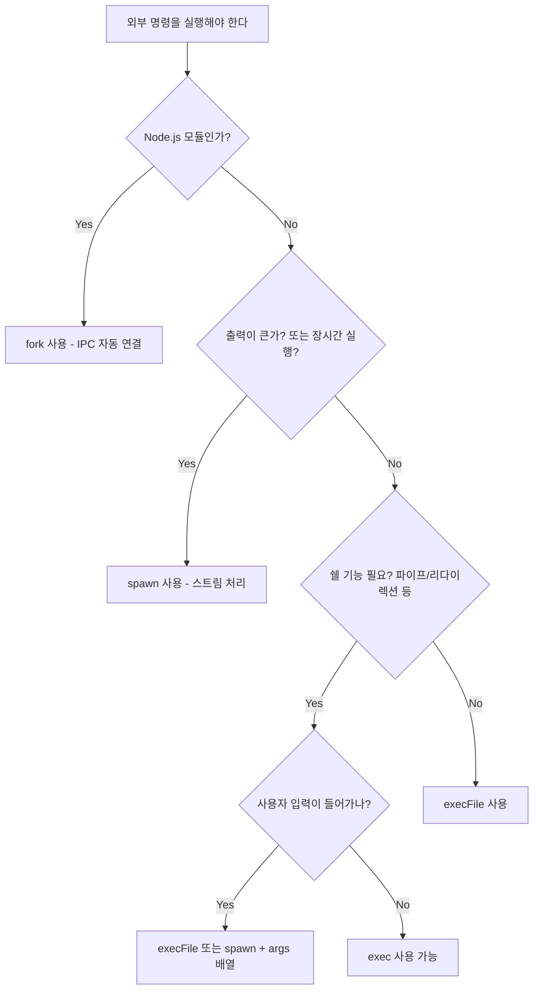

# child_process.spawn

## 배경

Node.js는 단일 스레드 이벤트 루프 위에서 동작한다. 그래서 외부 프로그램을 호출해야 할 때는 별도의 OS 프로세스를 띄워서 입출력을 스트림으로 주고받는 방식을 쓴다. 그 중심에 있는 게 `child_process.spawn()`이다. `exec`, `fork`, `execFile`도 결국 내부적으로는 `spawn`을 감싸는 형태다.

처음 Node에서 외부 명령을 부를 때 가장 많이 쓰는 게 `exec`인데, 출력을 통째로 버퍼에 모아서 콜백으로 넘기는 구조라 출력이 조금만 커져도 `maxBuffer exceeded` 에러로 죽는다. 로그 수십 메가만 흘러도 터진다. 이런 경우 `spawn`으로 바꿔야 한다. 스트림 기반이라 메모리가 일정하게 유지된다.

## spawn vs exec vs execFile vs fork

이 네 개 함수는 비슷해 보이지만 사용 목적이 다르다. 잘못 고르면 보안 사고나 성능 문제로 이어진다.

```javascript
const { spawn, exec, execFile, fork } = require('child_process');
```

`spawn(command, args, options)`은 가장 저수준이다. 쉘을 거치지 않고 바로 프로세스를 띄우고, stdout/stderr/stdin을 스트림으로 노출한다. 출력량이 크거나 장시간 실행되는 프로세스를 띄울 때 쓴다.

`exec(cmd, options, callback)`은 쉘을 거쳐서 명령을 실행한다. `bash -c "cmd"` 형태가 된다. 파이프(`|`), 리다이렉션(`>`), 환경변수 확장 같은 쉘 기능을 그대로 쓸 수 있는 대신, 사용자 입력을 그대로 넘기면 쉘 인젝션이 그대로 터진다. 출력은 콜백에 모아서 한 번에 받기 때문에 큰 출력에 부적합하다.

`execFile(file, args, options, callback)`은 `exec`처럼 콜백을 받지만 쉘을 거치지 않는다. 단일 실행 파일을 안전하게 실행하면서 출력은 한 번에 받고 싶을 때 적합하다. 다만 마찬가지로 `maxBuffer` 제약이 있다.

`fork(modulePath, args, options)`는 또 다른 Node.js 프로세스를 띄우면서 IPC 채널을 자동으로 열어준다. `process.send()`로 부모-자식이 메시지를 주고받을 수 있다. 워커 프로세스를 만들 때 쓴다.

5년쯤 Node 백엔드를 만지다 보면 결국 `spawn`을 쓰는 비중이 가장 커진다. ffmpeg, ImageMagick, git, kubectl 같은 외부 바이너리를 호출하면서 출력을 실시간으로 스트리밍 받아야 하는 경우가 많기 때문이다.

### 의사결정 흐름



## spawn의 기본 구조

```javascript
const { spawn } = require('child_process');

const child = spawn('ls', ['-lh', '/usr']);

child.stdout.on('data', (chunk) => {
  console.log(`stdout: ${chunk}`);
});

child.stderr.on('data', (chunk) => {
  console.error(`stderr: ${chunk}`);
});

child.on('close', (code, signal) => {
  console.log(`종료 코드: ${code}, 시그널: ${signal}`);
});

child.on('error', (err) => {
  console.error('프로세스 시작 실패:', err);
});
```

여기서 주의할 점이 몇 개 있다.

`error` 이벤트와 `close` 이벤트는 다르다. `error`는 프로세스를 띄우는 것 자체가 실패했을 때 발생한다. 예를 들어 실행 파일이 PATH에 없거나, 실행 권한이 없을 때다. 반면 `close`는 자식 프로세스가 시작은 됐지만 종료될 때 호출된다. 둘 다 처리하지 않으면 어디서 죽었는지 디버깅이 어렵다.

`exit`와 `close`도 헷갈리는데, `exit`은 자식 프로세스가 종료된 직후에 발생하고, `close`는 자식 프로세스의 stdio 스트림까지 모두 닫혔을 때 발생한다. stdio를 다른 프로세스와 공유하는 경우(`stdio: 'inherit'` 등) 두 시점이 달라질 수 있다. 출력을 모두 받았는지 확인하려면 `close`를 써야 한다.

## 스트림 기반 입출력과 백프레셔

`spawn`이 반환하는 `child.stdout`, `child.stderr`는 `Readable` 스트림, `child.stdin`은 `Writable` 스트림이다. 그래서 Node 스트림 API를 그대로 쓸 수 있다.

```javascript
const { spawn } = require('child_process');
const fs = require('fs');

// gzip 압축을 외부 프로세스로 처리
const gzip = spawn('gzip');

fs.createReadStream('input.log')
  .pipe(gzip.stdin);

gzip.stdout.pipe(fs.createWriteStream('input.log.gz'));

gzip.on('close', (code) => {
  if (code !== 0) {
    console.error('gzip 실패');
  }
});
```

`pipe()`를 쓰면 백프레셔가 자동으로 처리된다. 자식 프로세스가 데이터를 빨리 못 받으면 부모 쪽 읽기가 일시 중단된다. 반대로 자식 프로세스의 stdout 출력을 부모가 빨리 처리 못 하면 자식 쪽이 멈춘다. 이걸 직접 다루려면 `on('data')`로 받으면서 `pause()`/`resume()`을 호출해야 하는데 실수하기 쉽다. 가능하면 `pipe()`를 쓰는 게 안전하다.

문자열로 모으는 흔한 패턴은 다음과 같다.

```javascript
function runCommand(cmd, args) {
  return new Promise((resolve, reject) => {
    const child = spawn(cmd, args);
    const stdoutChunks = [];
    const stderrChunks = [];

    child.stdout.on('data', (chunk) => stdoutChunks.push(chunk));
    child.stderr.on('data', (chunk) => stderrChunks.push(chunk));

    child.on('error', reject);
    child.on('close', (code) => {
      const stdout = Buffer.concat(stdoutChunks).toString('utf8');
      const stderr = Buffer.concat(stderrChunks).toString('utf8');
      if (code === 0) {
        resolve({ stdout, stderr });
      } else {
        reject(new Error(`exit ${code}: ${stderr}`));
      }
    });
  });
}
```

`Buffer`로 모은 다음 마지막에 한 번 `toString()` 하는 게 중요하다. 청크 단위로 `toString()`을 하면 멀티바이트 문자가 청크 경계에서 잘려서 깨진 문자가 생긴다. 한글이나 이모지를 다룰 때 자주 겪는 문제다. 청크 단위로 디코딩이 꼭 필요하면 `string_decoder`의 `StringDecoder`를 써야 한다.

## EPIPE 대응

자식 프로세스가 일찍 죽었는데 부모가 stdin에 계속 쓰면 `EPIPE` 에러가 발생한다. 예를 들어 `head -n 10`처럼 입력 일부만 읽고 종료하는 명령에 대용량 데이터를 흘려보내면 거의 항상 마주친다.

```javascript
const { spawn } = require('child_process');

const head = spawn('head', ['-n', '10']);

head.stdin.on('error', (err) => {
  if (err.code === 'EPIPE') {
    // head가 일찍 닫혔다. 정상 케이스로 간주
    return;
  }
  throw err;
});

// 큰 입력 흘려보내기
for (let i = 0; i < 1_000_000; i++) {
  head.stdin.write(`line ${i}\n`);
}
head.stdin.end();
```

`stdin`에 `error` 핸들러를 안 달면 unhandled error로 프로세스가 죽는다. 이걸 모르고 프로덕션에 올렸다가 batch job이 무작위로 터지는 사고를 본 적이 있다. `pipe()`를 쓰면 내부적으로 어느 정도 처리해주지만, 직접 `write()`로 데이터를 넣을 때는 항상 `error` 핸들러를 달아야 한다.

## shell 옵션과 쉘 인젝션

`spawn`에 `shell: true` 옵션을 주면 쉘을 거쳐서 실행한다. 편리하지만 보안상 위험하다.

```javascript
// 위험한 코드
const userInput = req.query.filename;
spawn('cat', [userInput], { shell: true });
// userInput이 "foo; rm -rf /"이면 그대로 실행됨
```

`shell: true`일 때는 `args`를 배열로 줘도 결국 모든 인자가 하나의 쉘 명령 문자열로 합쳐진다. 그래서 인자 안에 세미콜론이나 백틱, `$()`가 들어가면 쉘이 그걸 해석해 버린다.

안전하게 쓰려면 두 가지 원칙이 있다.

첫째, 사용자 입력을 인자로 넘길 때는 `shell` 옵션을 쓰지 말고 `args` 배열로만 넘긴다. `shell: false`(기본값)에서는 인자에 어떤 메타문자가 있어도 쉘이 해석하지 않는다.

```javascript
// 안전
spawn('cat', [userInput]);  // shell 옵션 없음
```

둘째, 정말 쉘 기능이 필요하면 사용자 입력은 환경변수로 넘기고 명령에서는 그 환경변수를 참조한다. 이러면 쉘 메타문자도 변수 값으로만 취급된다.

```javascript
spawn('sh', ['-c', 'cat "$FILENAME"'], {
  shell: false,
  env: { ...process.env, FILENAME: userInput }
});
```

## Windows에서 .cmd 실행 문제

Windows에서 `npm`, `yarn`, `tsc` 같은 명령을 `spawn`으로 실행하면 `ENOENT`가 난다. 이게 한참 헤매게 만드는 이슈다.

원인은 Windows에서 이 명령들이 실제로는 `.cmd` 또는 `.bat` 파일이고, 이런 배치 파일은 `cmd.exe`를 거쳐야만 실행되기 때문이다. Node.js의 `spawn`은 기본적으로 OS의 `CreateProcess`를 직접 호출하는데, `CreateProcess`는 `.exe`만 직접 실행할 수 있다.

해결책은 `shell: true`를 주는 것이다.

```javascript
// Windows에서 npm 실행
spawn('npm', ['install'], { shell: true });
```

크로스 플랫폼 코드에서는 항상 `shell: process.platform === 'win32'` 같은 패턴을 쓰는 경우가 많다. 다만 이러면 위에서 말한 쉘 인젝션 위험이 따라붙으니 인자 검증을 같이 해야 한다.

Node.js 21부터는 Windows에서 보안 이슈(`CVE-2024-27980`)로 인해 `.bat`, `.cmd` 실행 시 자동으로 추가적인 quote 처리가 들어갔다. 그래서 옛날 코드가 갑자기 동작 방식이 달라지기도 한다. Windows 지원이 필요하면 Node 버전별 동작을 따로 테스트해야 한다.

## stdio 옵션

`stdio` 옵션으로 자식 프로세스의 stdin, stdout, stderr를 어떻게 연결할지 정한다.

```javascript
spawn('cmd', args, { stdio: 'pipe' });    // 기본값
spawn('cmd', args, { stdio: 'inherit' }); // 부모와 공유
spawn('cmd', args, { stdio: 'ignore' });  // /dev/null로 보냄
spawn('cmd', args, { stdio: ['pipe', 'inherit', 'pipe'] }); // 개별 지정
```

`'pipe'`는 부모와 파이프로 연결한다. `child.stdout` 같은 스트림으로 접근할 수 있다.

`'inherit'`은 부모 프로세스의 stdio를 그대로 물려준다. 자식 프로세스 출력이 부모 콘솔에 바로 찍힌다. 빌드 도구나 스크립트 러너를 만들 때 자주 쓴다. 이 경우 부모는 자식 출력을 가로채지 못한다.

`'ignore'`는 출력을 버린다. 출력을 안 받으면서도 자식이 EPIPE로 죽지 않게 할 때 쓴다.

`'ipc'`를 stdio 배열에 추가하면 부모-자식 간 IPC 채널이 열린다. `fork`가 내부적으로 하는 게 이거다.

```javascript
const child = spawn('node', ['worker.js'], {
  stdio: ['pipe', 'pipe', 'pipe', 'ipc']
});

child.send({ task: 'process' });
child.on('message', (msg) => {
  console.log('자식이 보낸 메시지:', msg);
});
```

## 종료 코드와 시그널 처리

`close` 이벤트의 콜백은 `(code, signal)` 두 인자를 받는다.

```javascript
child.on('close', (code, signal) => {
  if (signal) {
    console.log(`시그널 ${signal}로 종료됨`);
  } else {
    console.log(`종료 코드 ${code}`);
  }
});
```

자식이 정상 종료하면 `code`에 종료 코드(0이 성공)가 들어오고 `signal`은 `null`이다. 외부에서 시그널을 받아 죽었으면 `code`가 `null`이고 `signal`에 시그널 이름이 들어온다.

자식 프로세스에 시그널을 보내려면 `child.kill()`을 쓴다.

```javascript
child.kill();           // 기본값 SIGTERM
child.kill('SIGINT');   // 명시적 시그널
child.kill('SIGKILL');  // 강제 종료, 정리 불가능
```

`SIGTERM`은 자식이 정리 작업을 할 기회를 준다. `SIGKILL`은 OS가 강제로 죽이기 때문에 자식이 임시 파일이나 락 파일을 남길 수 있다. 가능하면 `SIGTERM` 먼저 보내고 일정 시간 후에도 살아있으면 `SIGKILL`로 내려보내는 패턴을 쓴다.

```javascript
function killGracefully(child, timeoutMs = 5000) {
  child.kill('SIGTERM');
  const timer = setTimeout(() => {
    if (!child.killed) {
      child.kill('SIGKILL');
    }
  }, timeoutMs);
  child.on('close', () => clearTimeout(timer));
}
```

## detached와 unref로 데몬화

기본적으로 자식 프로세스는 부모와 같은 프로세스 그룹에 속한다. 부모가 죽으면 자식도 같이 죽는 경우가 많다. 부모가 죽어도 자식이 살아남게 하려면 `detached: true`로 띄우고 부모에서 `unref()`를 호출해야 한다.

```javascript
const { spawn } = require('child_process');
const fs = require('fs');

const out = fs.openSync('./out.log', 'a');
const err = fs.openSync('./err.log', 'a');

const child = spawn('long-running-task', [], {
  detached: true,
  stdio: ['ignore', out, err]
});

child.unref();
```

여기서 중요한 건 stdio다. `stdio: 'pipe'`인 채로 detached하면 부모 프로세스가 끝나도 자식 stdio 파이프가 부모를 기다리느라 부모가 종료되지 않는다. 그래서 `'ignore'`나 파일 디스크립터로 리다이렉션해야 한다.

`unref()`는 이벤트 루프에서 자식 프로세스 핸들의 참조를 빼는 동작이다. 이걸 안 하면 부모가 자식이 끝나길 기다린다.

리눅스에서는 `detached: true`를 주면 자식이 새 세션의 리더가 된다(`setsid`). Windows에서는 자식이 새 콘솔 창을 가진다.

## 큰 출력과 maxBuffer 함정

`exec`나 `execFile`은 출력을 메모리에 모아서 콜백에 한 번에 넘긴다. 기본 `maxBuffer`는 1MB(과거에는 200KB였다). 이걸 넘으면 자식 프로세스가 강제 종료되고 에러가 발생한다.

`spawn`은 스트림 기반이라 `maxBuffer` 제약이 없다. 다만 위에서 본 패턴처럼 부모에서 `Buffer.concat`으로 모으는 경우 메모리는 동일하게 쓰인다. 진짜 큰 출력을 다룰 때는 모으지 말고 라인 단위로 처리해야 한다.

```javascript
const { spawn } = require('child_process');
const readline = require('readline');

const child = spawn('tail', ['-F', '/var/log/big.log']);

const rl = readline.createInterface({ input: child.stdout });
rl.on('line', (line) => {
  // 라인 단위로 처리
  process(line);
});
```

`exec`로 만든 코드를 `spawn` + 스트림으로 바꿨더니 메모리 사용량이 1/100로 줄어든 경험이 여러 번 있다. 출력이 큰 명령(`find /`, `git log`, DB dump)을 다룰 때는 처음부터 `spawn`을 쓰는 게 낫다.

## posix_spawn과의 관계

Node.js 내부에서는 가능하면 `posix_spawn` 시스템 콜을 사용한다. 전통적으로 유닉스에서 자식 프로세스를 만드는 방법은 `fork()` + `exec()`인데, `fork()`는 부모 프로세스의 메모리를 복사한다(copy-on-write라 실제 복사는 적지만, 가상 메모리 매핑은 다 만들어야 한다). Node 프로세스가 메모리를 많이 쓰는 상태에서 `fork`를 부르면 그 자체로 비용이 크다.

`posix_spawn`은 fork+exec를 한 번에 처리하면서 메모리 매핑을 새로 만들어준다. 큰 메모리를 쓰는 Node 서버에서 자식 프로세스를 자주 띄울 때 성능 차이가 크게 난다. Node 18 이후로 리눅스에서 `posix_spawn`을 적극적으로 활용하는 방향으로 바뀌고 있다.

옵션에 따라 `posix_spawn`이 사용되지 못하고 fork+exec로 폴백되는 경우가 있다. `cwd`, 일부 `stdio` 조합, `uid`/`gid` 같은 옵션이 그렇다. 자식을 자주 띄우는 부분이 느리면 어떤 시스템 콜이 호출되는지 `strace`로 한번 확인해 볼 만하다.

## 좀비 프로세스 방지

좀비 프로세스(zombie)는 자식 프로세스가 종료됐는데 부모가 종료 상태를 회수(`wait`)하지 않아서 프로세스 테이블에 남아있는 상태다. PID만 점유하고 메모리는 거의 안 쓰지만, 누적되면 PID 고갈로 새 프로세스를 못 만들게 된다.

Node.js에서는 자식 프로세스의 `exit` 이벤트가 발생하는 시점에 내부적으로 `wait`을 호출한다. 그래서 `exit` 이벤트를 받기만 하면 좀비는 안 생긴다.

문제가 되는 경우는 두 가지다.

첫째, 자식 프로세스를 띄우고 핸들에 대한 참조를 잃어버리는 경우. 자식 핸들이 GC되면 이벤트 리스너도 같이 사라진다. 다만 V8의 GC는 핸들에 등록된 리스너 때문에 핸들 자체를 쉽게 회수하지 않으니 실제로는 잘 발생하지 않는다.

둘째, 자식이 또 다른 손자 프로세스를 만들고 자식만 죽는 경우. 손자가 고아가 되어 init(PID 1)로 reparent되는데, 컨테이너 환경에서 init이 제대로 동작하지 않으면 손자가 좀비가 될 수 있다. Docker에서 `--init` 옵션이나 `tini`를 쓰는 이유가 이거다.

```bash
# Docker에서 init 활성화
docker run --init my-node-app
```

Node 프로세스가 컨테이너 PID 1로 떠 있으면 좀비 회수를 직접 처리해야 하는데, Node는 이걸 잘 못 한다. 따라서 컨테이너에서는 항상 `tini`나 `--init`으로 init 프로세스를 띄우는 게 안전하다.

## 트러블슈팅 체크 포인트

자식 프로세스 관련 버그를 잡을 때 우선 확인할 것들.

자식이 시작이 되는지, 시작은 됐는데 비정상 종료한 건지부터 구분한다. `error` 이벤트와 `close` 이벤트를 둘 다 로깅한다. `close`의 `code`와 `signal`을 같이 봐야 원인을 좁힐 수 있다.

stdout/stderr를 받고 있는지 확인한다. `stdio: 'pipe'`로 띄워놓고 `data` 리스너를 안 달면 자식 프로세스가 어느 순간 멈춘다. OS의 파이프 버퍼(보통 64KB)가 가득 차면 자식의 write가 블록되기 때문이다. 안 쓸 거면 `stdio: 'ignore'`로 띄워야 한다.

타임아웃을 직접 구현해야 한다. `spawn`에는 `timeout` 옵션이 있긴 한데(Node 15.13부터), 동작이 미묘하다. 직접 `setTimeout`으로 `kill`을 보내는 게 명확하다.

부모 프로세스가 종료될 때 자식을 정리하는 코드를 넣는다. 안 그러면 부모가 죽었는데 자식이 살아남아 리소스를 점유하는 일이 생긴다.

```javascript
process.on('exit', () => {
  if (child && !child.killed) {
    child.kill('SIGTERM');
  }
});
```

다만 `process.on('exit')` 안에서는 비동기 작업이 안 되니 동기적으로 `kill`만 보낼 수 있다. 정리 작업이 필요하면 `SIGTERM`/`SIGINT` 핸들러에서 처리한다.
