# PWA (Progressive Web App)

PWA는 브라우저에서 도는 웹앱을 설치 가능한 앱처럼 동작하게 만드는 기술 묶음이다. 핵심은 두 개다. Service Worker(네트워크 요청을 가로채는 프록시)와 Web App Manifest(설치 메타데이터). 여기에 오프라인 캐싱, Push API, 백그라운드 동기화가 붙는다.

실무에서 PWA를 붙일 때 코드 작성보다 더 오래 잡아먹는 게 캐시 디버깅이다. "배포했는데 사용자 화면이 안 바뀐다"는 문의가 90%고, 원인은 거의 항상 Service Worker가 잡고 있는 오래된 캐시다. 이 문서는 그 함정들을 중심으로 정리한다.

## Service Worker 등록과 생명주기

Service Worker는 메인 스레드와 분리된 별도 워커 스레드에서 돈다. DOM 접근이 안 되고, `window`도 없다. 대신 네트워크 요청을 가로챌 수 있다.

등록은 메인 스크립트에서 한다.

```javascript
if ('serviceWorker' in navigator) {
  window.addEventListener('load', () => {
    navigator.serviceWorker.register('/sw.js', { scope: '/' })
      .then((registration) => {
        console.log('SW 등록됨, scope:', registration.scope);
      })
      .catch((err) => {
        console.error('SW 등록 실패:', err);
      });
  });
}
```

`load` 이벤트 후에 등록하는 이유는 초기 페이지 로딩과 SW 설치가 네트워크 대역을 두고 경쟁하지 않게 하려는 것이다. 첫 방문 성능이 중요하면 이 패턴을 지킨다.

### install · activate · fetch

Service Worker는 세 개의 핵심 이벤트로 돌아간다.

```
sequenceDiagram
    participant B as 브라우저
    participant SW as Service Worker
    B->>SW: install 이벤트
    SW->>SW: 캐시 미리 채우기 (precache)
    SW-->>B: 설치 완료, waiting 상태로
    B->>SW: activate 이벤트
    SW->>SW: 오래된 캐시 정리
    SW-->>B: 활성화 완료, 제어 시작
    B->>SW: fetch 이벤트 (페이지 요청마다)
    SW-->>B: 캐시 또는 네트워크 응답
```

`install`은 SW가 처음 등록되거나 파일 내용이 바뀌었을 때 한 번 발생한다. 보통 여기서 정적 자원을 미리 캐싱한다.

```javascript
const CACHE_NAME = 'app-v1';
const PRECACHE_URLS = [
  '/',
  '/index.html',
  '/styles/main.css',
  '/scripts/app.js',
  '/offline.html',
];

self.addEventListener('install', (event) => {
  event.waitUntil(
    caches.open(CACHE_NAME).then((cache) => cache.addAll(PRECACHE_URLS))
  );
});
```

`event.waitUntil()`로 감싸지 않으면 캐싱이 끝나기 전에 install이 완료 처리되어 캐시가 비는 경우가 생긴다. Promise를 넘겨서 작업이 끝날 때까지 install 상태를 붙잡는다.

`activate`는 새 SW가 페이지 제어권을 가져갈 때 발생한다. 여기서 이전 버전 캐시를 지운다.

```javascript
self.addEventListener('activate', (event) => {
  event.waitUntil(
    caches.keys().then((keys) =>
      Promise.all(
        keys
          .filter((key) => key !== CACHE_NAME)
          .map((key) => caches.delete(key))
      )
    )
  );
});
```

`fetch`는 페이지에서 나가는 모든 네트워크 요청마다 발생한다. 여기서 응답을 가로채서 캐시를 줄지 네트워크를 줄지 결정한다.

```javascript
self.addEventListener('fetch', (event) => {
  event.respondWith(
    caches.match(event.request).then((cached) => {
      return cached || fetch(event.request);
    })
  );
});
```

### waiting 상태가 만드는 배포 지연

여기가 PWA에서 제일 많이 막히는 지점이다. 새 SW 파일을 배포해도 사용자는 한동안 옛날 화면을 본다.

이유: SW가 업데이트되면 브라우저는 새 SW를 install까지는 하지만 바로 activate하지 않는다. 기존 SW가 제어하는 탭이 하나라도 열려 있으면 새 SW는 `waiting` 상태로 대기한다. 사용자가 모든 탭을 완전히 닫았다가 다시 열어야 새 SW가 활성화된다. SPA는 사용자가 탭을 며칠씩 안 닫기 때문에 새로고침만으로는 업데이트가 안 된다.

```mermaid
flowchart TD
    A[새 sw.js 배포] --> B[브라우저가 변경 감지]
    B --> C[새 SW install]
    C --> D{기존 탭 열려있나}
    D -->|예| E[waiting 상태로 대기]
    D -->|아니오| F[즉시 activate]
    E --> G[모든 탭 닫힘]
    G --> F
```



해결책은 두 가지를 같이 쓴다. `skipWaiting()`과 `clients.claim()`이다.

```javascript
self.addEventListener('install', (event) => {
  self.skipWaiting(); // waiting 건너뛰고 바로 활성화 대기
  event.waitUntil(
    caches.open(CACHE_NAME).then((cache) => cache.addAll(PRECACHE_URLS))
  );
});

self.addEventListener('activate', (event) => {
  event.waitUntil(
    caches.keys()
      .then((keys) => Promise.all(
        keys.filter((k) => k !== CACHE_NAME).map((k) => caches.delete(k))
      ))
      .then(() => self.clients.claim()) // 열려있는 모든 탭 즉시 제어
  );
});
```

`skipWaiting()`은 새 SW가 waiting을 건너뛰고 곧바로 activate되게 한다. `clients.claim()`은 새로 활성화된 SW가 새로고침 없이 현재 열린 탭들의 제어권을 가져온다. 둘을 같이 써야 배포 즉시 반영된다.

주의할 점이 있다. `skipWaiting()`을 무조건 쓰면 한 탭은 구버전 JS, 다른 탭은 신버전 JS를 받는 상황이 생긴다. 페이지가 청크를 lazy-load 하는 구조라면 구버전 페이지가 더 이상 존재하지 않는 신버전 청크를 요청해서 깨진다. 그래서 실무에서는 `skipWaiting()`을 자동으로 실행하지 않고, "새 버전이 있습니다. 새로고침하세요" 배너를 띄워 사용자가 누르면 그때 실행하는 방식을 더 많이 쓴다.

```javascript
// 메인 스크립트 쪽
let newWorker;

navigator.serviceWorker.register('/sw.js').then((reg) => {
  reg.addEventListener('updatefound', () => {
    newWorker = reg.installing;
    newWorker.addEventListener('statechange', () => {
      if (newWorker.state === 'installed' && navigator.serviceWorker.controller) {
        // 새 SW가 waiting 중. 사용자에게 배너 노출
        showUpdateBanner();
      }
    });
  });
});

function onUpdateClick() {
  newWorker.postMessage({ type: 'SKIP_WAITING' });
}

// SW 쪽
self.addEventListener('message', (event) => {
  if (event.data.type === 'SKIP_WAITING') {
    self.skipWaiting();
  }
});

// controllerchange가 발생하면 새 SW가 제어를 잡은 것이므로 새로고침
navigator.serviceWorker.addEventListener('controllerchange', () => {
  window.location.reload();
});
```

## 캐시 전략

`fetch` 핸들러에서 어떤 순서로 캐시와 네트워크를 쓰느냐가 캐시 전략이다. 자원 성격에 따라 다르게 적용한다.

### cache-first

캐시에 있으면 캐시를 주고, 없을 때만 네트워크로 간다. 버전이 박힌 정적 자원(해시가 파일명에 들어간 JS·CSS, 폰트, 이미지)에 쓴다. 바뀌지 않는 파일이라 네트워크를 안 타는 게 가장 빠르다.

```javascript
function cacheFirst(request) {
  return caches.match(request).then((cached) => {
    if (cached) return cached;
    return fetch(request).then((response) => {
      const copy = response.clone();
      caches.open(CACHE_NAME).then((cache) => cache.put(request, copy));
      return response;
    });
  });
}
```

`response.clone()`이 핵심이다. Response 본문은 스트림이라 한 번만 읽힌다. 캐시에 넣을 때 한 번, 브라우저에 돌려줄 때 한 번 읽어야 하므로 복제해서 하나는 캐시에, 원본은 반환에 쓴다. 이걸 빼먹으면 `body already used` 에러가 난다.

### network-first

네트워크를 먼저 시도하고, 실패하면 캐시로 폴백한다. API 응답이나 자주 바뀌는 HTML에 쓴다. 최신 데이터를 우선하되 오프라인일 때 마지막 캐시라도 보여준다.

```javascript
function networkFirst(request) {
  return fetch(request)
    .then((response) => {
      const copy = response.clone();
      caches.open(CACHE_NAME).then((cache) => cache.put(request, copy));
      return response;
    })
    .catch(() => caches.match(request));
}
```

network-first는 네트워크가 느릴 때 타임아웃 없이 무한정 기다리는 문제가 있다. 지하철처럼 연결이 끊긴 듯 살아있는 환경에서는 사용자가 빈 화면을 한참 본다. 타임아웃을 걸어서 일정 시간 안에 응답이 없으면 캐시로 넘기는 방식을 쓴다.

```javascript
function networkFirstWithTimeout(request, timeoutMs = 3000) {
  return new Promise((resolve) => {
    const timer = setTimeout(() => {
      caches.match(request).then((cached) => {
        if (cached) resolve(cached);
      });
    }, timeoutMs);

    fetch(request).then((response) => {
      clearTimeout(timer);
      const copy = response.clone();
      caches.open(CACHE_NAME).then((cache) => cache.put(request, copy));
      resolve(response);
    }).catch(() => {
      clearTimeout(timer);
      caches.match(request).then(resolve);
    });
  });
}
```

### stale-while-revalidate

캐시를 즉시 돌려주면서 백그라운드로 네트워크 요청을 보내 캐시를 갱신한다. 다음 요청 때 갱신된 캐시가 나간다. 속도와 최신성을 절충하는 방식이다. 아바타 이미지, 자주 보지만 약간 오래돼도 괜찮은 데이터에 적합하다.

```javascript
function staleWhileRevalidate(request) {
  return caches.open(CACHE_NAME).then((cache) =>
    cache.match(request).then((cached) => {
      const networkFetch = fetch(request).then((response) => {
        cache.put(request, response.clone());
        return response;
      });
      // 캐시가 있으면 즉시 반환, 없으면 네트워크 대기
      return cached || networkFetch;
    })
  );
}
```

캐시를 바로 주기 때문에 체감 속도가 빠르지만, 사용자가 보는 데이터가 항상 한 박자 늦다. 결제 금액처럼 정확성이 중요한 화면에는 쓰면 안 된다.

전략을 요청 종류에 따라 라우팅하면 이렇게 된다.

```javascript
self.addEventListener('fetch', (event) => {
  const url = new URL(event.request.url);

  if (event.request.method !== 'GET') return; // POST 등은 가로채지 않음

  if (url.pathname.startsWith('/api/')) {
    event.respondWith(networkFirstWithTimeout(event.request));
  } else if (/\.(js|css|woff2|png|jpg|svg)$/.test(url.pathname)) {
    event.respondWith(cacheFirst(event.request));
  } else {
    // HTML 문서
    event.respondWith(
      networkFirst(event.request).then(
        (res) => res || caches.match('/offline.html')
      )
    );
  }
});
```

POST 요청은 가로채지 않는다. 캐시 API는 GET만 저장할 수 있고, POST를 cache.put 하려 하면 에러가 난다.

## 오프라인 동작

오프라인에서 뭘 보여줄지는 미리 캐싱해 둔 자원으로 결정된다. 최소한 `offline.html` 하나는 precache 해두고, 네트워크 실패 시 폴백한다. 위 라우팅 코드의 마지막 `caches.match('/offline.html')`가 그 역할이다.

오프라인 폼 제출 같은 건 캐시만으로 안 된다. 사용자가 오프라인에서 입력한 데이터를 IndexedDB에 저장해두고, 온라인 복귀 시 백그라운드 동기화로 서버에 보낸다. 이건 아래 백그라운드 동기화에서 다룬다.

## Web App Manifest

Manifest는 설치 가능 여부와 설치된 앱의 외형을 정하는 JSON 파일이다. HTML head에 링크한다.

```html
<link rel="manifest" href="/manifest.webmanifest">
```

```json
{
  "name": "내 작업 관리 앱",
  "short_name": "작업관리",
  "start_url": "/?source=pwa",
  "display": "standalone",
  "background_color": "#ffffff",
  "theme_color": "#1a73e8",
  "icons": [
    {
      "src": "/icons/icon-192.png",
      "sizes": "192x192",
      "type": "image/png"
    },
    {
      "src": "/icons/icon-512.png",
      "sizes": "512x512",
      "type": "image/png"
    },
    {
      "src": "/icons/icon-512-maskable.png",
      "sizes": "512x512",
      "type": "image/png",
      "purpose": "maskable"
    }
  ]
}
```

각 필드가 실제로 하는 일.

- `name` / `short_name`: 설치 다이얼로그와 홈 화면 아이콘 라벨. `short_name`은 아이콘 아래 짧게 표시되므로 12자 안쪽으로 잡는다.
- `start_url`: 아이콘으로 앱을 열 때 로딩되는 URL. 쿼리 파라미터(`?source=pwa`)를 붙여두면 애널리틱스에서 설치 사용자 유입을 분리해 볼 수 있다.
- `display`: 앱 외형을 정한다. `standalone`이 가장 흔하고, 주소창 없는 네이티브 앱처럼 보인다. `fullscreen`은 상태바까지 가린다. `minimal-ui`는 최소한의 네비게이션을 남긴다. `browser`는 그냥 탭으로 연다.
- `theme_color`: 상태바·작업 표시줄 색.
- `icons`: 설치 조건을 만족하려면 최소 192x192와 512x512가 필요하다.

### maskable 아이콘

`purpose: "maskable"` 아이콘을 빼먹으면 안드로이드에서 아이콘 둘레에 흰 배경이 깔리거나 잘려 보인다. 안드로이드는 기기마다 아이콘을 원형·둥근사각형 등 다른 모양으로 마스킹하는데, 일반 아이콘은 그 마스크 영역을 고려하지 않은 디자인이라 가장자리가 잘린다. maskable 아이콘은 중앙 80% 안에 핵심 그래픽을 넣고 바깥쪽은 여백(safe zone)으로 둔 버전이다. 일반용과 maskable용을 따로 만들어 둘 다 등록한다.

### 설치 동작 제어

브라우저가 설치 조건(HTTPS, manifest, SW 등록 등)을 만족했다고 판단하면 `beforeinstallprompt` 이벤트를 던진다. 이걸 잡아두면 설치 버튼을 직접 만들 수 있다.

```javascript
let deferredPrompt;

window.addEventListener('beforeinstallprompt', (e) => {
  e.preventDefault(); // 브라우저 기본 배너 막기
  deferredPrompt = e;
  showInstallButton();
});

installButton.addEventListener('click', async () => {
  if (!deferredPrompt) return;
  deferredPrompt.prompt();
  const { outcome } = await deferredPrompt.userChoice;
  console.log('설치 결과:', outcome); // 'accepted' 또는 'dismissed'
  deferredPrompt = null;
  hideInstallButton();
});

window.addEventListener('appinstalled', () => {
  console.log('앱 설치됨');
});
```

`deferredPrompt`는 한 번 `prompt()`를 호출하면 재사용할 수 없다. 다시 띄우려면 다음 `beforeinstallprompt` 이벤트를 기다려야 한다.

## Workbox

캐시 전략을 매번 직접 짜면 엣지 케이스(Range 요청, 캐시 만료, opaque 응답 처리)에서 버그가 나기 쉽다. Workbox는 구글이 만든 라이브러리로, 위 전략들을 검증된 구현으로 제공한다.

```javascript
import { precacheAndRoute } from 'workbox-precaching';
import { registerRoute } from 'workbox-routing';
import { CacheFirst, NetworkFirst, StaleWhileRevalidate } from 'workbox-strategies';
import { ExpirationPlugin } from 'workbox-expiration';

// 빌드 도구가 self.__WB_MANIFEST에 precache 목록을 주입한다
precacheAndRoute(self.__WB_MANIFEST);

registerRoute(
  ({ url }) => url.pathname.startsWith('/api/'),
  new NetworkFirst({ cacheName: 'api-cache', networkTimeoutSeconds: 3 })
);

registerRoute(
  ({ request }) => request.destination === 'image',
  new CacheFirst({
    cacheName: 'image-cache',
    plugins: [
      new ExpirationPlugin({ maxEntries: 60, maxAgeSeconds: 30 * 24 * 60 * 60 }),
    ],
  })
);

registerRoute(
  ({ request }) => request.destination === 'style' || request.destination === 'script',
  new StaleWhileRevalidate({ cacheName: 'static-resources' })
);
```

`precacheAndRoute(self.__WB_MANIFEST)`의 `__WB_MANIFEST`는 빌드 시점에 `workbox-build`나 `workbox-webpack-plugin`이 채워주는 자리다. 빌드된 파일 목록과 각 파일의 해시(revision)가 들어간다. 파일 내용이 바뀌면 해시가 바뀌어 precache가 자동으로 갱신된다. 이게 직접 짠 SW 대비 가장 큰 이점이다. 캐시 버전 관리를 손으로 안 해도 된다.

### Workbox 쓸 때 주의점

직접 짠 SW에서 Workbox로 옮길 때 자주 막히는 것들이 있다.

precache 목록을 손으로 적으면 안 된다. 반드시 빌드 도구가 `__WB_MANIFEST`를 주입하게 한다. 손으로 적으면 해시가 없어서 캐시 갱신이 안 된다.

`skipWaiting`은 Workbox에서도 기본이 아니다. 옛 SW 캐시와 신 SW 코드가 섞이는 문제는 그대로 있다. 자동 갱신을 원하면 명시적으로 켜야 한다.

```javascript
import { clientsClaim } from 'workbox-core';

self.skipWaiting();
clientsClaim();
```

개발 모드에서 Workbox를 켜두면 캐시 때문에 코드 수정이 반영 안 되는 걸로 시간을 날린다. 개발 중에는 SW를 등록하지 않거나, DevTools의 Application 탭에서 "Bypass for network"를 켜둔다.

## Push API와 백그라운드 동기화

### Push 알림

서버가 앱이 닫혀 있어도 알림을 보내려면 Push API를 쓴다. 흐름은 이렇다. 클라이언트가 푸시 구독을 만들어 서버에 보내고, 서버가 그 구독 정보로 푸시 서비스에 메시지를 보내면, 푸시 서비스가 SW의 `push` 이벤트를 깨운다.

```javascript
// 클라이언트: 구독 생성
async function subscribePush(registration) {
  const subscription = await registration.pushManager.subscribe({
    userVisibleOnly: true, // 보이는 알림만 허용 (조용한 푸시 금지)
    applicationServerKey: urlBase64ToUint8Array(VAPID_PUBLIC_KEY),
  });
  await fetch('/api/push/subscribe', {
    method: 'POST',
    headers: { 'Content-Type': 'application/json' },
    body: JSON.stringify(subscription),
  });
}
```

```javascript
// SW: 푸시 수신
self.addEventListener('push', (event) => {
  const data = event.data ? event.data.json() : {};
  event.waitUntil(
    self.registration.showNotification(data.title || '알림', {
      body: data.body,
      icon: '/icons/icon-192.png',
      data: { url: data.url },
    })
  );
});

// 알림 클릭 처리
self.addEventListener('notificationclick', (event) => {
  event.notification.close();
  event.waitUntil(
    clients.openWindow(event.notification.data.url || '/')
  );
});
```

`userVisibleOnly: true`는 크롬에서 필수다. 알림을 띄우지 않는 조용한 푸시(추적용)를 막으려는 제약이다. 푸시를 받으면 반드시 사용자에게 보이는 알림을 띄워야 한다.

### 백그라운드 동기화

오프라인에서 사용자가 한 작업(폼 제출 등)을 온라인 복귀 시 자동으로 보내는 기능이다. 요청을 IndexedDB에 쌓아두고 `sync` 이벤트에서 처리한다.

```javascript
// 클라이언트: 오프라인이면 큐에 저장하고 sync 등록
async function submitForm(data) {
  try {
    await fetch('/api/submit', { method: 'POST', body: JSON.stringify(data) });
  } catch (err) {
    await saveToIndexedDB('pending-submits', data);
    const reg = await navigator.serviceWorker.ready;
    await reg.sync.register('submit-forms');
  }
}
```

```javascript
// SW: 온라인 복귀 시 sync 이벤트 발생
self.addEventListener('sync', (event) => {
  if (event.tag === 'submit-forms') {
    event.waitUntil(flushPendingSubmits());
  }
});

async function flushPendingSubmits() {
  const items = await readAllFromIndexedDB('pending-submits');
  for (const item of items) {
    await fetch('/api/submit', { method: 'POST', body: JSON.stringify(item) });
    await deleteFromIndexedDB('pending-submits', item.id);
  }
}
```

Background Sync API는 지원 범위가 좁다. 크롬 계열만 지원하고 iOS Safari·파이어폭스는 안 된다. 지원 안 되는 브라우저에서는 앱이 포그라운드로 돌아왔을 때 `online` 이벤트로 직접 큐를 비우는 폴백을 둬야 한다.

## 실무에서 겪는 문제와 해결

### HTTPS 필수

Service Worker는 HTTPS에서만 동작한다. `localhost`는 예외로 HTTP에서도 된다. 개발은 localhost로 하면 되지만, 스테이징을 사설 IP(`192.168.x.x`)나 HTTP 도메인에 올리면 SW가 등록조차 안 된다. 스테이징도 HTTPS를 붙이거나, 정 안 되면 ngrok 같은 터널로 HTTPS를 만들어 테스트한다.

### scope 문제

SW의 `scope`는 그 SW가 가로챌 수 있는 경로 범위다. 기본값은 SW 파일이 놓인 경로다. `/js/sw.js`에 두면 scope가 `/js/`로 잡혀서 `/`나 `/about` 요청을 못 가로챈다. 그래서 SW 파일은 보통 루트(`/sw.js`)에 둔다.

루트에 못 두는 상황(빌드 산출물이 `/dist/`에 모이는 경우 등)이면, 서버에서 `Service-Worker-Allowed` 응답 헤더를 줘서 scope를 넓힐 수 있다.

```
Service-Worker-Allowed: /
```

이 헤더가 있으면 `/dist/sw.js`를 등록하면서 `scope: '/'`를 지정할 수 있다.

### 캐시 버전 관리와 배포 반영 지연

가장 많이 겪는 문제다. 코드를 배포했는데 사용자가 옛날 화면을 본다. 원인은 세 군데서 겹친다.

첫째, `sw.js` 자체가 브라우저 HTTP 캐시에 잡히는 경우다. 브라우저는 SW 파일을 주기적으로 다시 확인하지만, CDN이나 서버가 `sw.js`에 긴 `Cache-Control`을 걸어두면 변경을 감지 못 한다. `sw.js`는 `Cache-Control: no-cache`로 내려야 한다.

둘째, 캐시 이름(`CACHE_NAME`)을 안 올린 경우다. cache-first 자원은 캐시 이름이 같으면 계속 옛 캐시를 쓴다. 배포마다 캐시 이름에 버전이나 빌드 해시를 박는다. Workbox는 `__WB_MANIFEST`가 이걸 자동으로 처리한다.

셋째, 위에서 다룬 waiting 상태다. 새 SW가 install됐지만 activate를 안 해서 기다리는 경우. `skipWaiting()` + `clients.claim()` 또는 사용자에게 새로고침을 유도하는 배너로 해결한다.

세 개를 정리하면, 배포 반영이 안 될 때 확인 순서는 이렇다. `sw.js`의 Cache-Control 헤더 확인 → DevTools Application 탭에서 새 SW가 waiting인지 확인 → 캐시 이름이 바뀌었는지 확인.

### iOS Safari 제약

iOS Safari의 PWA 지원은 안드로이드 크롬보다 한참 뒤처진다. 같은 코드를 짜도 iOS에서만 안 되는 게 많다.

- 설치는 사용자가 공유 메뉴에서 "홈 화면에 추가"를 직접 눌러야 한다. `beforeinstallprompt` 이벤트가 없어서 설치 버튼을 코드로 띄울 수 없다. iOS 사용자에게는 별도 안내 문구를 보여줘야 한다.
- Push API는 iOS 16.4부터 지원되지만, 홈 화면에 설치된 PWA에서만 동작한다. Safari 탭에서는 안 된다.
- Background Sync API는 지원하지 않는다. `online` 이벤트 폴백이 필수다.
- 캐시 용량 제한이 빡빡하고, 앱을 며칠 안 쓰면 SW와 캐시를 통째로 비우는 경우가 있다. iOS에서는 오프라인 캐시를 너무 믿으면 안 된다.
- `display: standalone`으로 설치해도 사파리 특유의 동작(상단 노치 영역 처리, 스크롤 바운스)이 남아서 `viewport-fit=cover`와 safe-area CSS를 따로 잡아줘야 한다.

iOS를 지원 대상에 넣는다면, 안드로이드에서 테스트 끝났다고 끝난 게 아니다. 실제 아이폰에서 설치부터 푸시까지 별도로 돌려봐야 한다. 시뮬레이터는 PWA 설치·푸시 동작이 실기와 다르게 나오는 경우가 있어서 실기 확인이 안전하다.
