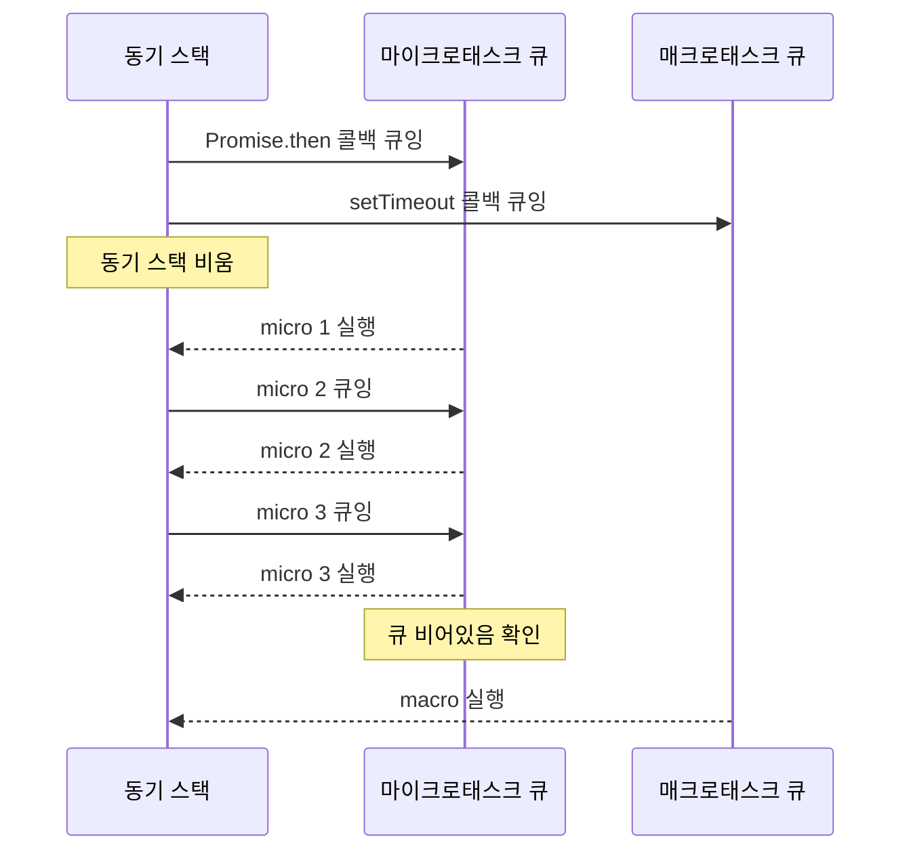

# Promise 내부 동작 과정

Promise는 겉으로 보면 `.then()` 체이닝이지만, 안에서는 상태 머신, 내부 슬롯, 마이크로태스크 큐, 잡(Job) 큐가 맞물려 돌아간다. 실무에서 만나는 대부분의 비동기 버그는 "Promise가 언제 resolved 되는가"가 아니라 "그 다음 then 콜백이 정확히 어느 tick에 실행되는가"에서 갈린다. 이 문서는 ECMA-262 명세 수준에서 Promise가 어떤 슬롯을 갖고 어떤 잡을 큐에 밀어 넣는지를 정리한 것이다.

## Promise 내부 상태 머신

Promise 객체는 사용자가 볼 수 있는 메서드(`then`, `catch`, `finally`) 외에 명세에 정의된 내부 슬롯을 갖는다. 이 슬롯들은 일반 프로퍼티가 아니라 엔진이 직접 다루는 숨겨진 필드다.

| 슬롯 | 역할 |
|------|------|
| `[[PromiseState]]` | `pending`, `fulfilled`, `rejected` 셋 중 하나 |
| `[[PromiseResult]]` | settled 된 값 또는 에러. pending 동안에는 정의되지 않음 |
| `[[PromiseFulfillReactions]]` | resolve 시 실행될 reaction 객체 리스트 |
| `[[PromiseRejectReactions]]` | reject 시 실행될 reaction 객체 리스트 |
| `[[PromiseIsHandled]]` | 한 번이라도 reject 핸들러가 등록되었는지 추적. unhandledRejection 판정에 쓰인다 |

`[[PromiseState]]`의 전이는 단방향이다. `pending`에서 `fulfilled` 또는 `rejected`로 한 번만 갈 수 있고, 일단 settled 되면 두 번째 resolve나 reject 호출은 조용히 무시된다. 이게 중요한 이유는 하나의 Promise를 여러 군데서 resolve 시도해도 안전하다는 보장을 주기 때문이다. 다만 안전하다고 해서 의도한 동작이 보장되는 것은 아니다. 두 번째 resolve가 무시된 줄 모르고 디버깅하다 시간을 날리는 경우가 의외로 많다.

```javascript
const p = new Promise((resolve, reject) => {
    resolve(1);
    resolve(2);   // 무시됨
    reject(new Error('boom'));  // 무시됨
});

p.then(v => console.log(v));  // 1
```

reaction 리스트는 `then`을 호출할 때마다 한 항목씩 늘어난다. 같은 Promise에 `.then`을 여러 번 걸면 fulfill 시 등록된 순서대로 reaction이 큐잉된다. settled 이후에 등록한 핸들러는 리스트에 추가되는 대신 곧바로 마이크로태스크 큐로 밀려 들어간다. "이미 끝난 Promise에 then 걸어도 다음 tick에 실행된다"는 규칙이 여기서 나온다.

## Promise 생성자 실행 흐름

`new Promise(executor)`를 만나면 엔진은 다음 순서를 밟는다.

1. 새 Promise 객체를 만들고 슬롯을 초기화한다. `[[PromiseState]]`는 `pending`.
2. 그 Promise에 바인딩된 `resolve`, `reject` 함수 쌍을 만든다.
3. **executor를 즉시 동기 실행한다.** 별도 큐에 넣지 않는다.
4. executor가 던진 예외는 잡아서 `reject`로 전달한다.

executor가 동기 실행이라는 점이 첫 번째 함정이다. 다음 코드는 직관과 다르게 동작한다.

```javascript
console.log('A');
new Promise((resolve) => {
    console.log('B');   // 이건 동기 실행
    resolve();
}).then(() => {
    console.log('D');   // 마이크로태스크
});
console.log('C');
// A → B → C → D
```

`B`가 `C`보다 먼저 찍힌다. Promise는 비동기라는 말은 then 핸들러에 한정된 표현이고 executor 자체는 그냥 동기 함수다.

`resolve(value)`가 호출되면 곧장 상태를 바꾸지 않는다. 명세상 `resolve(value)`는 `value`가 thenable인지 검사한 뒤 PromiseResolveThenableJob을 마이크로태스크 큐에 넣고 끝난다. value가 평범한 값이면 그 자리에서 fulfill하고 reaction을 큐잉한다. 이 분기 때문에 thenable로 resolve할 때 한 tick이 더 걸린다.

```javascript
// 동기 흐름 안에서
const p = new Promise((resolve) => resolve(42));
// 여기서 p는 이미 fulfilled
console.log(p);  // Promise { 42 }

const q = new Promise((resolve) => resolve(Promise.resolve(42)));
// q는 아직 fulfilled 아님 — PromiseResolveThenableJob이 큐에 들어가 있다
console.log(q);  // Promise { <pending> } 또는 엔진에 따라
```

## then 체이닝 내부 동작

`p.then(onFulfilled, onRejected)`는 항상 **새로운 Promise를 만들어 반환한다**. 이 새 Promise를 편의상 `q`라고 하면 다음과 같이 묶인다.

- `q`는 새로 만든 빈 pending Promise
- `p`의 reaction 리스트에 `{ handler: onFulfilled, capability: q }` 형태의 reaction 객체가 추가됨
- `p`가 settled 되는 시점에 PromiseReactionJob이 마이크로태스크 큐에 들어감

PromiseReactionJob이 실제로 실행되는 시점이 then 콜백이 호출되는 순간이다. 즉 `p.then(fn)`을 한다고 해서 `fn`이 곧바로 어딘가에 등록되어 fire 되는 게 아니라, `p`가 settled 되는 시점에 잡이 큐잉되고, 큐가 처리될 차례가 와야 비로소 실행된다.

reaction job이 실행될 때의 흐름은 이렇다.

1. `onFulfilled(value)`를 호출한다. 콜백이 없으면 값을 그대로 통과시킨다.
2. 핸들러가 던진 예외가 있으면 `q`를 reject한다.
3. 핸들러의 반환값을 `q`의 resolve 함수에 넘긴다.

문제는 3번에서 반환값이 thenable인 경우다. 이때 `q`는 곧바로 fulfilled 되지 않고 또 다른 PromiseResolveThenableJob이 큐잉된다. 그 잡이 thenable의 `then`을 호출해서 `q`를 풀어주는데, 이 `then` 호출 결과 resolve가 또 한 tick 걸린다. 결과적으로 then 콜백에서 Promise를 반환하면 **연결되는 데 마이크로태스크 2개가 소비된다**. V8 기준으로는 한때 3-tick이었다가 ECMAScript 2019에서 2-tick으로 줄었다.

```javascript
Promise.resolve()
    .then(() => Promise.resolve(1))   // thenable 반환 → 2-tick
    .then(v => console.log(v));       // 따라서 이 콜백은 4-tick 후

Promise.resolve()
    .then(() => 1)                    // 일반값 → 1-tick
    .then(v => console.log(v));       // 이 콜백은 2-tick 후
```

이 차이는 마이크로벤치마크가 아니라 실제 코드에서 나타난다. async 함수 안에서 `await someAsyncFn()`을 길게 체이닝하면 tick이 누적된다.

## resolve(promise) vs resolve(value) — thenable assimilation

`Promise.resolve(x)`의 동작은 `x`가 무엇이냐에 따라 갈린다.

- `x`가 같은 realm의 native Promise면 그 객체를 그대로 돌려준다. 새 Promise를 만들지 않는다.
- `x`가 thenable(즉 `then` 메서드를 가진 객체)이면 새 Promise를 만들고 `x`를 따라가도록 묶는다. 이 과정이 **thenable assimilation**이다.
- `x`가 일반 값이면 그 값으로 즉시 fulfilled된 새 Promise를 만든다.

```javascript
const real = Promise.resolve(1);
console.log(Promise.resolve(real) === real);  // true

const fakeThenable = {
    then(resolve) { resolve('faked'); }
};
const wrapped = Promise.resolve(fakeThenable);
// wrapped는 native Promise. 'faked'로 fulfilled되지만 한 tick 걸린다
wrapped.then(v => console.log(v));  // 'faked'
```

assimilation의 실제 동작을 보면 엔진은 thenable의 `then`을 PromiseResolveThenableJob 안에서 호출한다. 이 호출이 동기적으로 resolve를 부르더라도 그 시점은 이미 다음 tick이다. 그래서 다음 두 코드의 출력 순서가 다르다.

```javascript
Promise.resolve(1).then(() => console.log('A'));
Promise.resolve({ then(r) { r(2); } }).then(() => console.log('B'));
console.log('sync');
// sync → A → B
```

`A`는 1-tick, `B`는 thenable assimilation을 거치므로 2-tick 후에 실행된다.

## 마이크로태스크 큐 고갈 규칙

이벤트 루프 한 사이클의 흐름은 대략 다음과 같다.

1. 동기 실행 스택이 빌 때까지 동기 코드를 돌린다.
2. 마이크로태스크 큐가 빌 때까지 모든 마이크로태스크를 처리한다.
3. 매크로태스크(setTimeout, I/O, setImmediate 등) 하나를 꺼내 실행한다.
4. 다시 2번으로 돌아간다.

핵심은 2번이다. 마이크로태스크 처리 중에 새 마이크로태스크가 추가되면 같은 사이클 안에서 계속 처리한다. 이 규칙 때문에 then 안에서 다른 Promise를 resolve하고 then을 걸어도 setTimeout보다 먼저 모두 실행된다.

```javascript
setTimeout(() => console.log('macro'), 0);

Promise.resolve().then(() => {
    console.log('micro 1');
    Promise.resolve().then(() => {
        console.log('micro 2');
        Promise.resolve().then(() => console.log('micro 3'));
    });
});

// micro 1 → micro 2 → micro 3 → macro
```

마이크로태스크 안에서 또 마이크로태스크를 끝없이 큐잉하면 매크로태스크는 영영 실행되지 못한다. 이걸 마이크로태스크 starvation이라 부른다. 실무에서 재귀적인 `Promise.resolve().then(...)` 루프로 동기 작업을 잘게 쪼개려다 UI 이벤트가 멈추는 사례가 있다. 잘게 쪼개려는 의도였다면 `setTimeout(..., 0)`이나 `MessageChannel`을 써야 한다.


```mermaid
sequenceDiagram
    participant Sync as 동기 스택
    participant Micro as 마이크로태스크 큐
    participant Macro as 매크로태스크 큐

    Sync->>Micro: Promise.then 콜백 큐잉
    Sync->>Macro: setTimeout 콜백 큐잉
    Note over Sync: 동기 스택 비움
    Micro-->>Sync: micro 1 실행
    Sync->>Micro: micro 2 큐잉
    Micro-->>Sync: micro 2 실행
    Sync->>Micro: micro 3 큐잉
    Micro-->>Sync: micro 3 실행
    Note over Micro: 큐 비어있음 확인
    Macro-->>Sync: macro 실행
```

## Promise.all / race / allSettled / any 내부 카운터

네 함수는 비슷해 보이지만 내부 상태 변수가 다르다.

`Promise.all`은 입력 개수와 같은 길이의 결과 배열, 그리고 남은 카운트 변수를 가진다. 각 입력에 대해 then을 걸고, 콜백에서 자기 인덱스 자리에 결과를 넣은 뒤 카운트를 줄인다. 카운트가 0이 되면 결과 배열로 fulfill한다. 하나라도 reject되면 즉시 reject 하고 끝낸다. 단, 나머지 Promise들은 **취소되지 않는다.** Promise는 명세상 취소 개념이 없다. 이미 시작된 fetch나 setTimeout은 그대로 끝까지 진행되고, 그저 결과가 버려질 뿐이다. 메모리나 네트워크 비용이 새는 함정이 여기서 자주 생긴다.

`Promise.race`는 카운터가 없다. 가장 먼저 settled 되는 입력의 상태를 그대로 따라간다. 첫 settle이 fulfill이면 fulfill, reject면 reject. 빈 배열을 넘기면 영원히 pending인 Promise가 나온다.

`Promise.allSettled`는 reject로 끝내지 않는다. 각 입력의 결과를 `{ status: 'fulfilled', value }` 또는 `{ status: 'rejected', reason }` 객체로 감싸 배열에 채운다. 카운터가 0이 되면 항상 fulfill로 끝난다.

`Promise.any`는 `all`의 반대다. fulfilled를 기다린다. 첫 fulfill이 발생하면 그 값으로 fulfill, 모두 reject되면 `AggregateError`로 reject 한다. 빈 배열을 넘기면 즉시 `AggregateError`로 reject된다.

```javascript
const slow = new Promise(r => setTimeout(() => r('slow'), 1000));
const fast = Promise.reject('fast-fail');

Promise.all([slow, fast])
    .then(v => console.log('all ok', v))
    .catch(e => console.log('all fail', e));   // 즉시 'all fail fast-fail'
// 이 시점에 slow는 여전히 1초 동안 살아있다.
// 만약 slow가 DB 커넥션을 잡고 있었다면 1초 후 풀려난다.
```

## unhandledRejection

reject된 Promise에 reject 핸들러를 끝내 등록하지 않으면 호스트 환경이 unhandledRejection 이벤트를 발생시킨다. 판정 시점이 좀 미묘하다.

명세는 마이크로태스크 처리가 한 차례 끝난 시점에 `[[PromiseIsHandled]]`가 false인 rejected Promise를 모아 호스트에 알린다. 즉 reject된 같은 tick 안에 catch나 then의 두 번째 인자가 등록되면 unhandledRejection은 발생하지 않는다. 다음 tick으로 넘어간 후에 catch를 등록해도 너무 늦다.

```javascript
const p = Promise.reject(new Error('late'));

setTimeout(() => {
    p.catch(e => console.log('caught', e.message));
    // 이 시점에 unhandledRejection이 이미 발화한 뒤다
}, 0);
```

브라우저는 `window.addEventListener('unhandledrejection', ...)`로 잡고 `event.preventDefault()`로 콘솔 경고를 막을 수 있다. Node.js는 `process.on('unhandledRejection', ...)`이지만 동작이 버전마다 달랐다. Node 14까지는 경고만 찍고 넘어갔지만 Node 15부터는 기본값이 throw로 바뀌어 프로세스가 죽는다. 운영 중인 서버를 Node 14에서 16으로 올렸다가 그동안 묻혀 있던 reject 누락이 한꺼번에 터지는 경우가 흔하다. 마이그레이션 전에 `--unhandled-rejections=warn`으로 일단 경고로 받아두고 천천히 잡는 방식이 안전하다.

`rejectionhandled` 이벤트도 있다. unhandledRejection이 발화한 뒤 뒤늦게 catch가 붙으면 이 이벤트가 발생한다. 모니터링 도구에서 거짓 양성을 줄일 때 쓴다.

## async/await가 Promise로 desugar되는 방식

`async function`은 항상 Promise를 반환한다. 함수 본문에서 명시적으로 Promise가 아닌 값을 return해도 `Promise.resolve(value)`로 감싸진다. throw하면 reject된 Promise가 나온다.

`await expr`은 대략 다음 의사 코드와 동등하다.

```javascript
// async function 안에서
// const x = await expr;
// 위 한 줄이 desugar되면

const __tmp = expr;
const __wrapped = Promise.resolve(__tmp);     // (1) 한 번 감싸고
__wrapped.then(__resumeWith);                 // (2) then으로 재개
// 함수의 나머지는 __resumeWith 안에서 이어진다
```

여기서 `expr`이 이미 Promise라도 (1)에서 한 번 더 처리하는 비용이 있었다. ES2019 이전에는 (1)에서 새 Promise를 또 만들고, (2)에서 then 핸들러를 거는 두 단계 때문에 await 한 번에 마이크로태스크가 3개씩 큐잉됐다. ES2019 명세 개정과 V8의 `--harmony-await-optimization`(이후 기본값) 이후로는 expr이 native Promise면 래핑을 생략해서 마이크로태스크 2개로 줄었다. 이 차이는 다음 코드의 출력 순서로 드러난다.

```javascript
async function f() {
    await Promise.resolve();
    console.log('after await');
}
f();
Promise.resolve()
    .then(() => console.log('p1'))
    .then(() => console.log('p2'))
    .then(() => console.log('p3'));
// V8 최신: after await가 p1과 p2 사이쯤
// 구버전 V8: after await가 p3 뒤
```

벤치마크 외에는 거의 신경 쓸 일 없지만, 깊은 await 체이닝이 누적되어 인지 가능한 지연을 만드는 경우가 가끔 있다. 마이크로서비스에서 await로 점철된 라우팅 핸들러를 분석할 때 한 번씩 떠오르는 이슈다.

## 실무에서 자주 만나는 함정

### Promise.resolve(thenable)의 비동기성

가장 자주 헷갈리는 부분이다. `Promise.resolve(value)`는 value가 평범한 값이면 동기적으로 fulfilled된 Promise를 반환하지만, value가 thenable이면 한 tick을 더 쓴다. 라이브러리 호환성을 맞추려고 자체 thenable을 만들어 쓰던 프로젝트에서 "왜 이 then 콜백이 한 tick 늦지?"로 시간을 흘려보내는 경우가 있다. 라이브러리 thenable이라도 가능하면 native Promise로 바로 변환해 두는 게 디버깅에 유리하다.

### forEach 안에서 await가 안 먹는 이유

```javascript
async function bad() {
    [1, 2, 3].forEach(async (n) => {
        await delay(1000);
        console.log(n);
    });
    console.log('done');
}
// done → (1초 후) 1, 2, 3 거의 동시에
```

`forEach`는 콜백 반환값을 무시한다. 콜백이 async 함수라 Promise를 돌려줘도 forEach는 그걸 받아서 await 하지 않는다. 결과적으로 `done`이 먼저 찍히고 1초 후에 셋이 한꺼번에 찍힌다. 순차 실행이 필요하면 `for ... of`나 `for` 루프를 써야 한다. 병렬이라면 `Promise.all(arr.map(...))`이 명시적이다.

```javascript
async function sequential(arr) {
    for (const n of arr) {
        await process(n);   // 정확히 하나씩
    }
}

async function parallel(arr) {
    await Promise.all(arr.map(process));   // 동시 진행
}
```

### return await 패턴

`return await expr`은 마이크로태스크가 한 번 더 들어간다. 그래서 비용 관점에서 의미 없는 두 단계라는 이유로 ESLint의 `no-return-await` 규칙이 한때 권장됐다. 하지만 try/catch 안에서는 의미가 다르다.

```javascript
async function withReturnAwait() {
    try {
        return await mayReject();  // catch 가 잡는다
    } catch (e) {
        return fallback();
    }
}

async function withoutAwait() {
    try {
        return mayReject();  // Promise가 그대로 빠져나가서 catch가 못 잡는다
    } catch (e) {
        return fallback();
    }
}
```

`return mayReject()`는 reject된 Promise가 호출자에게 그대로 흘러간다. 자기 함수의 catch는 동기 throw만 잡고 끝나기 때문이다. 이런 이유로 `no-return-await`는 `return-await: in-try-catch` 모드로 완화되는 추세다. try/catch 안에서는 항상 await을 붙이는 편이 안전하다.

### Promise 생성자 안에서 await 쓰지 않기

```javascript
// 안티패턴
new Promise(async (resolve) => {
    const v = await fetchData();
    resolve(v);
});
```

executor 자체가 async가 되면 그 안에서 throw된 예외가 reject로 변환되지 않는다. async 함수는 자신의 Promise를 reject하지만 그 Promise는 외부 Promise와 무관하다. 결국 unhandledRejection이 뜬다. 답은 단순하다. 이미 fetchData가 Promise를 돌려준다면 `new Promise`로 한 번 더 감쌀 이유가 없다. 그냥 `fetchData()`를 반환하면 된다.

## 정리

Promise는 사용자에게 보여지는 then 인터페이스 뒤로 슬롯, reaction 리스트, 잡 큐를 두고 굴러간다. 단방향 상태 전이, executor의 동기 실행, then이 새 Promise를 반환한다는 사실, thenable assimilation의 한 tick 비용, 마이크로태스크 큐 고갈 규칙, async/await의 desugar 형태까지 한 번 정리해 두면 비동기 디버깅에서 "왜 이 순서로 실행되는가"라는 질문이 거의 사라진다. 남는 함정은 forEach + await, Promise 생성자 안의 async, return await 정도인데 이건 코드 리뷰 단계에서 잡으면 된다.
