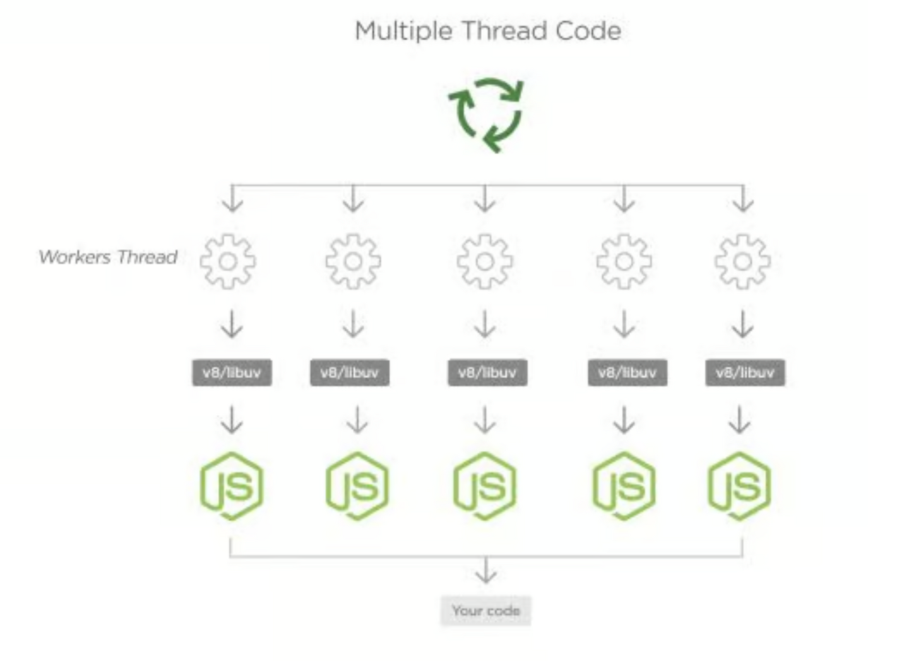

# Promise 내부 동작 과정

## 📋 목차
- [기본 개념](#기본-개념)
- [Task Queue와 Microtask Queue](#task-queue와-microtask-queue)
- [실행 순서 이해하기](#실행-순서-이해하기)
- [실제 예제로 살펴보기](#실제-예제로-살펴보기)
- [상세한 실행 과정](#상세한-실행-과정)

---

## 기본 개념

### 비동기 처리란?
JavaScript에서 비동기 처리는 코드가 순차적으로 실행되지 않고, 특정 작업이 완료될 때까지 기다리지 않고 다음 작업을 진행하는 방식을 의미합니다.

### Queue(큐)란?
큐는 데이터가 들어온 순서대로 처리되는 자료구조입니다. 먼저 들어온 데이터가 먼저 나가는 FIFO(First In, First Out) 방식입니다.

---

## Task Queue와 Microtask Queue

### Callback Queue (콜백 큐)
- **정의**: Web API가 수행한 비동기 함수의 콜백을 임시로 저장하는 대기열
- **역할**: Event Loop가 Call Stack이 비어있을 때 이 큐에서 콜백을 가져와 실행

### Task Queue (태스크 큐)
- **정의**: 일반적인 비동기 콜백들이 저장되는 큐
- **포함되는 것들**: `setTimeout`, `setInterval`, `setImmediate` 등의 콜백

### Microtask Queue (마이크로태스크 큐)
- **정의**: Promise의 콜백들이 저장되는 특별한 큐
- **특징**: Task Queue보다 **우선순위가 높음**
- **포함되는 것들**: 
  - Promise의 `.then()`, `.catch()`, `.finally()` 콜백
  - `queueMicrotask()` 함수
  - `process.nextTick()` (Node.js)

---

## 실행 순서 이해하기

### 우선순위 규칙
1. **동기 코드** (Call Stack에서 즉시 실행)
2. **Microtask Queue** (Promise 콜백들)
3. **Task Queue** (setTimeout, setInterval 등)

### 핵심 포인트
- Microtask Queue는 Task Queue보다 **항상 먼저** 처리됩니다
- Microtask Queue가 비어있어야 Task Queue의 콜백이 실행됩니다

---

## 실제 예제로 살펴보기

```javascript
console.log('Start!');

setTimeout(() => {
	console.log('Timeout!');
}, 0);

Promise.resolve('Promise!').then(res => console.log(res));

console.log('End!');
```

### 예상 출력 결과
```
Start!
End!
Promise!
Timeout!
```

### 왜 이런 순서로 출력될까?

1. **동기 코드 실행**
   - `console.log('Start!')` → 즉시 실행
   - `setTimeout()` → Web API로 전달 (0초 대기)
   - `Promise.resolve()` → 즉시 resolved 상태가 됨
   - `console.log('End!')` → 즉시 실행

2. **비동기 콜백 처리**
   - Promise의 `.then()` 콜백이 Microtask Queue에 추가
   - setTimeout의 콜백이 Task Queue에 추가
   - **Microtask Queue가 먼저 처리**되어 "Promise!" 출력
   - 그 다음 Task Queue 처리되어 "Timeout!" 출력

---

## 상세한 실행 과정

### 1단계: 초기 실행
```javascript
// Call Stack에 순서대로 쌓임
console.log('Start!');           // 즉시 실행
setTimeout(callback, 0);         // Web API로 전달
Promise.resolve('Promise!');     // 즉시 resolved
.then(callback);                 // Microtask Queue에 추가
console.log('End!');             // 즉시 실행
```

### 2단계: 큐 상태
```
Microtask Queue: [Promise.then 콜백]
Task Queue: [setTimeout 콜백]
```

### 3단계: 콜백 실행
```
1. Microtask Queue 처리 → "Promise!" 출력
2. Task Queue 처리 → "Timeout!" 출력
```

---

## 추가 예제로 이해하기

### 예제 1: 중첩된 Promise
```javascript
console.log('1');

setTimeout(() => {
	console.log('2');
}, 0);

Promise.resolve().then(() => {
	console.log('3');
	Promise.resolve().then(() => {
		console.log('4');
	});
});

console.log('5');
```

**출력 결과:**
```
1
5
3
4
2
```

### 예제 2: Promise와 setTimeout 혼합
```javascript
console.log('시작');

setTimeout(() => {
	console.log('타임아웃 1');
	Promise.resolve().then(() => {
		console.log('프로미스 1');
	});
}, 0);

Promise.resolve().then(() => {
	console.log('프로미스 2');
	setTimeout(() => {
		console.log('타임아웃 2');
	}, 0);
});

console.log('끝');
```

**출력 결과:**
```
시작
끝
프로미스 2
타임아웃 1
프로미스 1
타임아웃 2
```

---

## 정리

- **Microtask Queue**는 Promise 콜백들이 저장되는 특별한 큐
- **Task Queue**보다 우선순위가 높아서 항상 먼저 처리됨
- 동기 코드 → Microtask Queue → Task Queue 순서로 실행
- Promise의 `.then()`, `.catch()`, `.finally()`는 모두 Microtask Queue에 추가됨

```javascript
console.log('Start!');

setTimeout(() => {
	console.log('Timeout!');
}, 0);

Promise.resolve('Promise!').then(res => console.log(res));

console.log('End!');
```

---

### 자세한 실행 과정

<div align="center">
    
</div>


