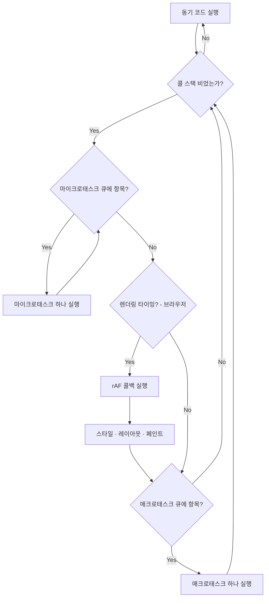

# 이벤트 루프

JavaScript는 단일 스레드다. 한 번에 하나의 작업만 실행할 수 있다. 그런데도 네트워크 요청, 타이머, 이벤트 핸들러가 멈추지 않고 처리되는 것은 이벤트 루프 덕분이다.

이벤트 루프는 JavaScript 언어 명세(ECMA-262)가 아니라, 브라우저의 HTML 명세와 Node.js 런타임에 정의되어 있다. V8 엔진은 콜 스택을 관리할 뿐, 이벤트 루프 자체는 런타임이 돌린다. 이 구분이 중요한 이유는 동일한 JavaScript 코드가 브라우저와 Node.js에서 다르게 동작하는 경우가 있기 때문이다.

## Call Stack

콜 스택은 V8이 현재 실행 중인 함수들을 추적하는 LIFO 자료구조다. 함수를 호출하면 실행 컨텍스트가 스택에 쌓이고, 함수가 반환되면 빠진다. 이벤트 루프는 콜 스택이 완전히 빌 때만 큐에서 다음 작업을 꺼낸다.

```javascript
function a() {
    b();
    console.log('a');
}
function b() {
    console.log('b');
}
a();
// 스택 흐름: [a] → [a, b] → [a] → []
// 출력: b → a
```

콜 스택이 너무 깊어지면 `RangeError: Maximum call stack size exceeded`가 난다. 브라우저마다 한계가 다르지만 대략 10,000~15,000 프레임 수준이다. 깊은 재귀가 필요한 경우 `setTimeout(fn, 0)`으로 스택을 끊어 다음 매크로태스크로 분산시킨다.

## Macrotask Queue

매크로태스크 큐(Task Queue라고도 부른다)는 런타임이 관리한다. 여기 들어가는 작업들이다.

- `setTimeout`, `setInterval` 콜백
- DOM 이벤트 핸들러 (click, keydown, resize 등)
- `fetch`, `XMLHttpRequest`, 파일 I/O 콜백
- 브라우저의 `MessageChannel`, Node.js의 `setImmediate`

이벤트 루프는 한 사이클에 매크로태스크를 **하나만** 꺼낸다. 꺼내서 콜 스택에 올리고, 그 작업이 끝나면 다시 마이크로태스크 큐를 먼저 확인한다.

```javascript
setTimeout(() => console.log('T1'), 0);
setTimeout(() => console.log('T2'), 0);
// T1 꺼내 실행 → 마이크로태스크 확인 → T2 꺼내 실행
```

`setTimeout(fn, 0)`의 `0`은 즉시가 아니다. HTML 명세는 중첩 깊이 5 이상의 타이머에 최소 지연 4ms를 강제한다. 타이머를 빽빽하게 중첩하면 예상보다 늦게 실행된다.

## Microtask Queue

마이크로태스크 큐는 매크로태스크보다 항상 먼저 처리된다. 콜 스택이 빌 때마다, 그리고 매크로태스크 하나를 끝낼 때마다 이벤트 루프는 마이크로태스크 큐를 **빌 때까지 전부** 소진한다. 여기 들어가는 작업들이다.

- `Promise.then` / `.catch` / `.finally` 콜백
- `queueMicrotask(fn)`
- `MutationObserver` 콜백
- Node.js의 `process.nextTick` (마이크로태스크 큐보다도 먼저 처리되는 별도 큐)

```javascript
Promise.resolve().then(() => console.log('M1'));
queueMicrotask(() => console.log('M2'));
setTimeout(() => console.log('T'), 0);
// 출력: M1 → M2 → T
```

`queueMicrotask`는 Promise 없이 직접 마이크로태스크를 등록하는 방법이다. `Promise.resolve().then(fn)`과 처리 시점은 같지만 Promise 객체를 생성하지 않는다. "다음 마이크로태스크 체크포인트에서 실행하되 Promise 체인을 만들기엔 과한 경우"에 쓴다.

마이크로태스크 안에서 새 마이크로태스크를 계속 등록하면 큐가 영원히 비워지지 않아 매크로태스크와 렌더링이 멈춘다. 아래 코드를 실행하면 그 이후 어떤 작업도 처리되지 않는다.

```javascript
function deadlock() {
    return Promise.resolve().then(deadlock);
}
deadlock();  // UI 동결, 타이머 멈춤, I/O 중단
```

## requestAnimationFrame 큐

`requestAnimationFrame`(rAF)은 브라우저 전용이다. 매크로태스크도 마이크로태스크도 아니다. 브라우저의 렌더링 파이프라인에 묶여 있다. 모니터 주사율(60Hz면 약 16.6ms마다)에 맞춰 다음 프레임을 그리기 직전에 rAF 콜백들을 실행한다.

한 프레임 안에서의 순서는 이렇다.

```
매크로태스크 실행
  → 마이크로태스크 전부 소진
  → [렌더링 타이밍인 경우]
      → rAF 콜백 실행
      → 스타일 계산 (Recalculate Style)
      → 레이아웃 (Layout / Reflow)
      → 페인트 (Paint / Composite)
```

이 순서 때문에 `setTimeout(fn, 0)`으로 DOM을 바꾸면 렌더 타이밍과 어긋날 수 있다. 이미 그 프레임이 지나간 뒤 반영되어 불필요한 프레임 드롭이 생긴다.

```javascript
// 렌더 타이밍 보장 안 됨
setTimeout(() => {
    element.style.transform = 'translateX(100px)';
}, 0);

// 해당 프레임에 정확히 반영됨
requestAnimationFrame(() => {
    element.style.transform = 'translateX(100px)';
});
```

rAF 안에서 무거운 계산을 실행하면 프레임 예산(16.6ms)을 초과해 프레임 드롭이 난다. 계산이 길면 Web Worker로 분리하고 결과만 rAF에서 DOM에 반영한다.

## 큐 처리 순서



Node.js는 이벤트 루프를 여섯 단계(timers → I/O callbacks → idle/prepare → poll → check → close callbacks)로 나눠 돌고, 각 단계 전후에 마이크로태스크 큐를 비운다. `process.nextTick`은 일반 마이크로태스크보다도 먼저 처리되는 별도 큐다.

```javascript
// Node.js에서의 처리 순서
process.nextTick(() => console.log('nextTick'));
Promise.resolve().then(() => console.log('promise'));
setImmediate(() => console.log('setImmediate'));
setTimeout(() => console.log('setTimeout'), 0);

// 출력: nextTick → promise → (setImmediate 또는 setTimeout, 메인 모듈에선 순서 비보장)
```

## 실행 순서 추적

네 종류의 태스크가 섞인 코드를 단계별로 따라간다.

```javascript
console.log('1. 동기 시작');

setTimeout(() => {
    console.log('6. 매크로태스크');
    Promise.resolve().then(() => {
        console.log('7. 매크로 안 마이크로');
    });
}, 0);

Promise.resolve()
    .then(() => {
        console.log('3. then 첫 번째');
    })
    .then(() => {
        console.log('5. then 두 번째');
    });

queueMicrotask(() => {
    console.log('4. queueMicrotask');
});

console.log('2. 동기 끝');

// 출력: 1 → 2 → 3 → 4 → 5 → 6 → 7
```

단계별 추적이다.

**동기 구간**: `1` 출력. `setTimeout` 콜백이 매크로 큐에 등록된다 (매크로: `[T]`). `Promise.resolve().then(M1)` — 이미 fulfilled인 Promise이므로 M1이 즉시 마이크로 큐에 등록된다 (마이크로: `[M1]`). `queueMicrotask(QM)` — 마이크로 큐에 등록된다 (마이크로: `[M1, QM]`). `2` 출력. 콜 스택이 빈다.

**마이크로태스크 소진**: M1 실행 → `3` 출력. M1이 끝나면서 두 번째 `.then(M2)`이 마이크로 큐에 추가된다 (마이크로: `[QM, M2]`). QM 실행 → `4` 출력. M2 실행 → `5` 출력. 마이크로 큐가 비었다.

**매크로태스크**: T를 꺼내 실행 → `6` 출력. T 안에서 `Promise.then(M3)`이 마이크로 큐에 등록된다. T가 끝나 콜 스택이 빈다. 마이크로 큐 소진 → `7` 출력.

`4`(queueMicrotask)가 `5`(then 두 번째)보다 먼저 나오는 이유: M1이 끝날 때 M2가 마이크로 큐에 추가되는데, 그 시점에 QM이 이미 큐에 들어와 있었다. FIFO이므로 QM → M2 순으로 처리된다.

## 실무에서 자주 겪는 문제

### 렌더링 블로킹

마이크로태스크 체크포인트마다 콜 스택이 비워지지만, 마이크로태스크 콜백 자체가 무거우면 렌더링이 막힌다.

```javascript
async function processLargeList(items) {
    for (const item of items) {
        await heavyCompute(item);  // 매 await마다 마이크로태스크 체크포인트
    }
}
```

`heavyCompute`가 50ms씩 걸리면 50 아이템 처리에 2.5초 동안 화면이 멈춘다. 렌더링 영향을 줄이려면 작업을 `setTimeout`으로 매크로태스크에 분산하거나 Web Worker로 옮긴다.

```javascript
// 매크로태스크로 분산해 렌더링 숨구멍 확보
async function processWithYield(items) {
    for (let i = 0; i < items.length; i++) {
        await new Promise(resolve => setTimeout(resolve, 0));  // 렌더링 기회 제공
        processItem(items[i]);
    }
}
```

### 타이머 누적 지연

```javascript
// 100ms 간격을 의도했지만 doWork 시간만큼 밀린다
function poll() {
    doWork();
    setTimeout(poll, 100);
}
```

`doWork()`가 30ms 걸리면 실제 간격은 130ms가 된다. `setTimeout`의 지연은 콜백이 끝나는 시점부터 카운트되기 때문이다. 정밀한 주기가 필요하면 시작 시간을 기준으로 보정한다.

```javascript
function poll() {
    const start = Date.now();
    doWork();
    const elapsed = Date.now() - start;
    setTimeout(poll, Math.max(0, 100 - elapsed));
}
```

### `setImmediate` vs `setTimeout(fn, 0)` (Node.js)

메인 모듈에서 실행하면 순서가 불안정하다. I/O 콜백 안에서 호출할 때만 순서가 확정된다.

```javascript
const fs = require('fs');

fs.readFile(__filename, () => {
    setTimeout(() => console.log('setTimeout'), 0);
    setImmediate(() => console.log('setImmediate'));
    // 항상: setImmediate → setTimeout
});
```

I/O 콜백은 poll 단계에서 실행되고 그 직후가 check 단계(`setImmediate`)다. `setTimeout`의 timers 단계는 다음 루프를 돌아야 온다. "I/O 완료 직후 확실히 실행하고 싶다"면 `setImmediate`를 쓴다.

---

실행 순서 추적 예제를 더 보려면 [실행 순서 이해](실행%20순서%20이해.md)를 참고한다.
Promise 상태 전이와 마이크로태스크 등록 메커니즘은 [Promise 내부 동작 과정](../04_심화_JavaScript/Promise%20내부%20동작%20과정.md)에서 다룬다.
