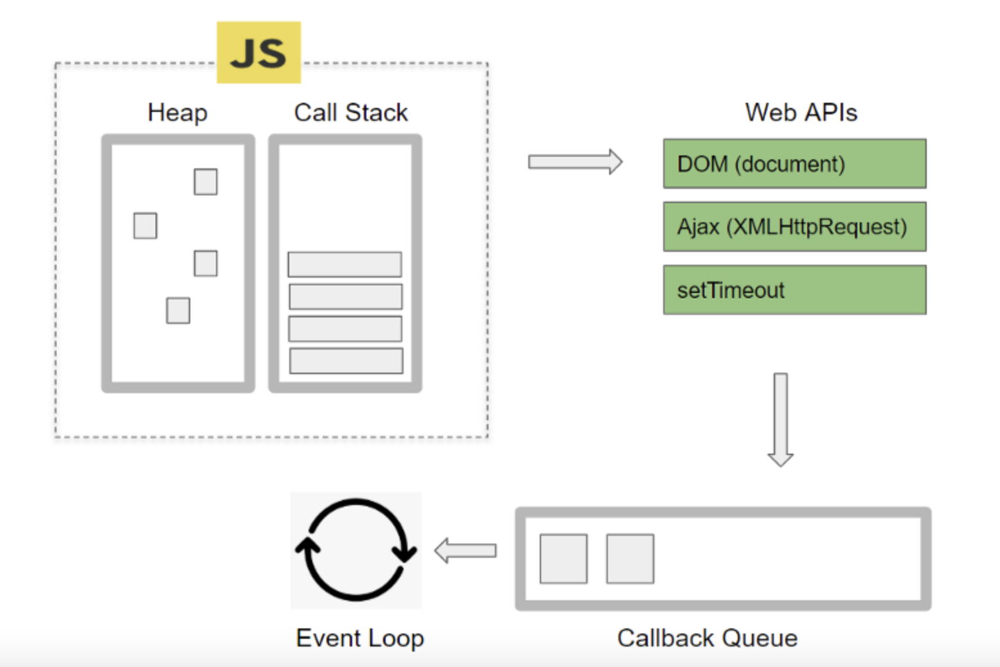
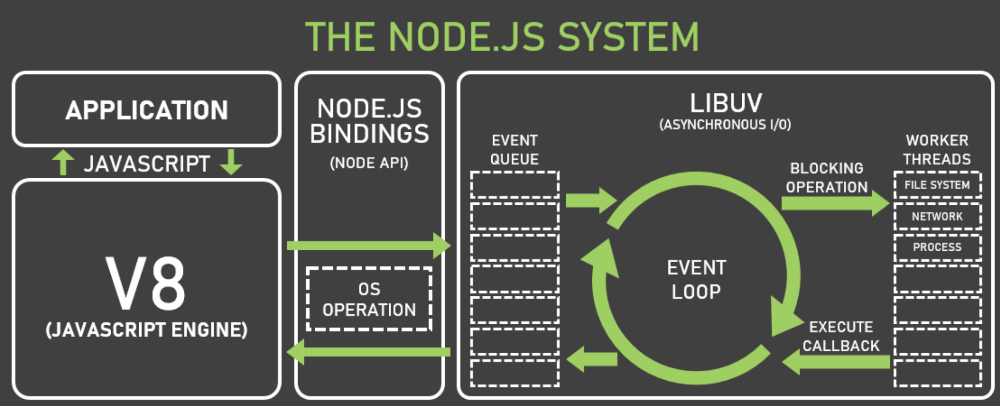

# 자바스크립트 비동기와 이벤트 루프
 
## 브라우저의 멀티 스레드로 작업을 동시에
- Javascript는 싱글 스레드 언어라고 들어본 적이 있을 것이다. '싱글'스레드라 한 번에 하나의 작업만 수행이 가능하다. 
- 하지만, 웹 애플리케이션에서는 네트워크 요청이나 이벤트 처리, 타이머와 같은 작업을 멀티로 처리해야 하는 경우가 많다. 
- 만일 싱글 스레드로 브라우저 동작이 한번에 하나씩 수행하게 되면, 우리가 파일을 다운로드 받을 동안 브라우저는 파일을 다 받을 때까지 웹서핑도 못하고 멈춰 대기해야 할 것이다.
- 따라서 파일 다운, 네트워크 요청, 타이머, 애니메이션 이러한 오래 걸리고 반복적인 작업들은 자바스크립트 엔진이 아닌 브라우저 내부의 멀티 스레드인 Web APIs에서 비동기 + 논블로킹으로 처리된다.

### 비동기 + 논블로킹(Async + Nonblocking)
- 메인 스레드가 작업을 다른 곳에 요청아형 대신 실행하고, 그 작업이 완료되면 이벤트나 콜백 함수를 받아 결과를 실행하는 방식을 말한다.
- 즉, 파일 다운로드 요청 작업을 백그라운드 작업으로 전이하여 동시에 처리가 가능하도록 한 것이다. 

> 즉, 비동기로 동작하는 핵심요소는 자바스크립트 언어가 아니라 브라우저라는 소프트웨어가 가지고 있다고 보면 된다.   - Node.js 에서는 libuv 내장 라이브러리가 처리한다.

## 이벤트 루프는 브라우저 동작을 제어하는 관리자
- 싱글 스레드인, 자바스크립트의 작업을 멀티 스레드로 돌려 작업을 동시에 처리시키게 하더나, 여러 작업 중 어떤 작업을 우선으로 동작시킬 것인지 결정하는 세심한 컨트롤을 하기 위해 존재하는 것이 바로 **Event Loop**이다.

    

- 이러한 이벤트 루프를 이용한, 프로그램 방식을 이벤트 기반(Event Driven) 프로그래밍이라 한다.
- 사용자의 클릭이나 키보드 입력과 같은 이벤트가 발생하면, 그에 맞는 콜백 함수가 실행한다. 대표적으로 JavaScript의 addEventListenr(이벤트명, 콜백함수)가 있겠다. 

---

# 자바스크립트 엔진 구동 환경
- 자바스크립트를 실행하는 소프트웨어로는 우리가 잘 알고 있는 **웹브라우저**와 런타임인 **Node.js**가 있다
  
## 브라우저의 내부 구성도
- 브라우저는 웹 사이트를 화면에 보여주기 위해 **Web APIs**, **Event Table**, **Callback Queue**, **Event Loop**등으로 이루어져 있다.

    

#### Call Stack 
- 자바스크립트엔진이 코드실행을 위해 사용하는 메모리구조
#### Heap 
- 동적으로 생성된 자바스크립트 객체가 저장되는 공간
#### Web APIs
- 브라우저에서 제공하는 API 모음으로, 비동기적으로 실행되는 작업들을 전담하여 처리한다. (AJAX 호출, 타이머 함수, DOM 조작 등)
#### Callback Queue 
- 비동기적 작업이 완료되면 실행되는 함수들이 대기하는 공간
#### Event Loop 
- 비동기 함수들을 적절한 시점에 실행시키는 관리자
#### Event Table
- 특정 이벤트(timeout, click, mouse 등)가 발생했을 때 어떤 callback 함수가 호출되야 하는지를 알고 있는 자료구조 (위 그림에는 없음)

## Web APIs의 종류
- 타이머, 네트워크 요청, 파일 입출력, 이벤트 처리 등 브라우저에서 제공하는 다양한 API를 포괄하는 총칭
- Web API는 브라우저(Chrome)에서 멀티 스레드로 구현되어 있다. 
- 그래서 브라우저는 비동기 작업에 대해 메인 스레드를 차단하지 않고 다른 스레드를 사용하여 동시에 처리할수 있는 것이다.

    

### Web APIs의 대표적인 종류
 

#### 1. DOM 
- HTML 문서의 구조와 내용을 표현하고 조작할 수 있는 객체 
#### 2. XMLHttpRequest
- 서버와 비동기적으로 데이터를 교환할 수 있는 객체. AJAX기술의 핵심. 
#### 3. Timer API
- 일정한 시간 간격으로 함수를 실행하거나 지연시키는 메소드들을 제공 
#### 4. Console API 
- 개발자 도구에서 콘솔 기능을 제공
#### 5. Canvas API
- 요소를 통해 그래픽을 그리거나 애니메이션을 만들 수 있는 메소드들을 제공
#### 6. Geolocation API
- 웹 브라우저에서 사용자의 현재 위치 정보를 얻을 수 있는 메소드들을 제공

### Callback Queue의 종류
- 여러가지 종류의 Queue를 묶어 총칭하는 개념이다.
- Callback Queue에는 (macro)task queue와 microtask queue 두 가지 종류가 있다.

    

#### 1. Task Queue 
- setTimeout, setInterval, fetch, addEventListener와 같이 비동기로 처리되는 함수들의 콜백 함수가 들어가는 큐(macrotask queue 는 보통 task queue 라고 부른다)

#### 2. Microtask Queue 
- promise.then, process.nextTick, MutationObserver 와 같이 우선적으로 비동기로 처리되는 함수들의 콜백 함수가 들어가는 큐 (처리 우선순위가 높음)

---

## Node.js의 내부 구성도 
- NodeJS환경에서도 브라우저와 거의 비슷한 구조를 볼 수 있는데, 차이점이 있다면 내장된 libuv 라이브러리를 사용하여 비동기 IO를 지원한다는 점이다.
- Node.js에서는 Web API가 아닌 Node.js API를 사용하여 파일 시스템 액세스, 네트워크 액세스, 암호화, 압축 및 해제 등과 같은 다양한 작업을 처리한다.
- 예를 들어, Node.js에서 HTTP 요청을 수행하려면 http 모듈을 사용한다. 단, Node.js에서도 일부 Web API를 사용할 수 있는데, setTimeout, setInterval 등이 그렇다.

    

> 이처럼 Node.js에서 자바스크립트 엔진은 비동기 작업을 위해서 Node.js의 API를 호출하며, 이때 넘겨진 콜백은 libuv의 이벤트 루프를 통해 스케쥴되고 실행된다. 
>   Node.js의 내부 구성으로는 다음과 같다.
> 
 
 

#### 용어설명
**V8 (JavaScript 엔진)** : Node.js에서 사용하는 JavaScript 엔진으로 코드를 컴파일하고 실행한다
 **Bindings (Node API)** : Node.js 시스템과 V8 엔진 간의 상호작용을 가능하게 하는 C++ 라이브러리
 **Libuv 라이브러리** : Node.js에서 비동기 I/O 작업을 처리하기 위한 C 라이브러리
 **Event Queue** : 비동기 I/O 작업 결과를 저장하고 처리하기 위한 자료구조 (웹브라우저의 Task Queue와 비슷하다)
 **Event Loop** : Event Queue에 저장된 I/O 작업 결과를 처리하고, 다음 작업을 수행하도록 하는 관리자
 **Worker Threads** : CPU 집약적인 작업을 처리하기 위해 Node.js 10 버전부터 추가된 멀티 스레드. worker threads는 메인 스레드와 독립적인 V8 엔진 인스턴스를 가진다.

--- 

## 자바스크립트 이벤트 루프 동작 과정 
- 싱글 스레드인 자바스크립트에서도 작업의 동시 처리을 지원할 수 있는 비결에는 이벤트 루프가 자바스크립트 엔진과 브라우저의 웹 API를 연결하여 비동기적인 일 처리를 가능케 하기 때문이다.
- 다만 모든 자바스크립트 코드를 비동기로 처리할 수 있는 것은 아니다. 
- 자바스크립트에는 비동기로 동작하는 비동기 전용 함수가 있는데 대표적으로 setTimeout 이나 fetch, addEventListener 가 있다.

    

- 브라우저의 Web APIs는 위 그림과 같이 각각 전용 작업을 처리하는 API 스레드들로 구성된 집합을 말한다. 
- 따라서 setTimeout 이 호출되면 Timer API 라는 별도의 스레드에서 타이머 동작이 별도로 실행되는 것이며, fetch 가 호출되면 Ajax API 스레드에서 네트워크 통신이 이루어 지는 것이다.
- 이벤트 루프(Event Loop)는 이 비동기 함수 작업을 Web API에 옮기는 역할을 하고 작업이 완료되면 콜백을 큐(Queue)에 적재했다가 다시 자바스크립트 엔진에 적재해 수행시키는 일종의 '작업을 옮기는 역할' 만을 한다.
- 작업을 처리하는 주체는 자바스크립트 엔진과 웹 API 이다. 
- 그래서 이벤트 루프는 Call Stack에 현재 실행 중인 작업이 있는지 그리고 Task Queue에 대기 중인 작업이 있는지 반복적으로 확인하는 일종의 무한 루프만을 돌고, 대기 작업이 있다면 작업을 옮겨주는 형태로 동작한다고 보면 된다. 

> 출처
> 1. https://inpa.tistory.com/entry/🔄-자바스크립트-이벤트-루프-구조-동작-원리 [Inpa Dev 👨‍💻:티스토리]