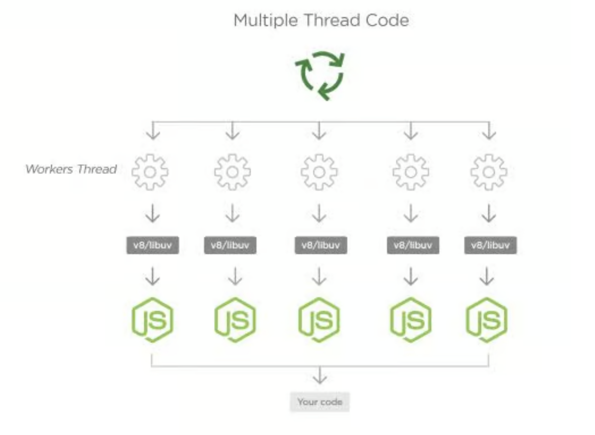

# Promise 내부 동작 과정 

## Task Queue 와 Microtask Queue
- Callback Queue는 Web API가 수행한 비동기 함수를 넘겨받아 Event Loop가 해당 함수를 Call Stack에 넘겨줄 때까지 비동기 함수들을 쌓아놓는 곳이다.
- 그중 자바스크립트 Promise 객체의 콜백이 쌓이는 곳이 바로 MicroTask Queue이다. 그리고 MicroTask Queue는 그 어떤 곳보다 가장 먼저 우선으로 콜백이 처리되게 된다.
   

## MicroTask Queue 처리 과정
- 코드 내용을 살펴보면 먼저 setTimeout을 통해서 0초동안 대기 하였다가 "Timeout!"을 출력하는 콜백 함수를 실행한다. 
- 그다음 Promise 객체에 의해 "Promise!"라는 텍스트를 출력하는 then 핸들러의 콜백 함수를 실행한다.

```javascript
console.log('Start!');

setTimeout(() => {
	console.log('Timeout!');
}, 0);

Promise.resolve('Promise!').then(res => console.log(res));

console.log('End!');
```

---

### 자세한 실행 과정

<div align="center">
    
</div>


