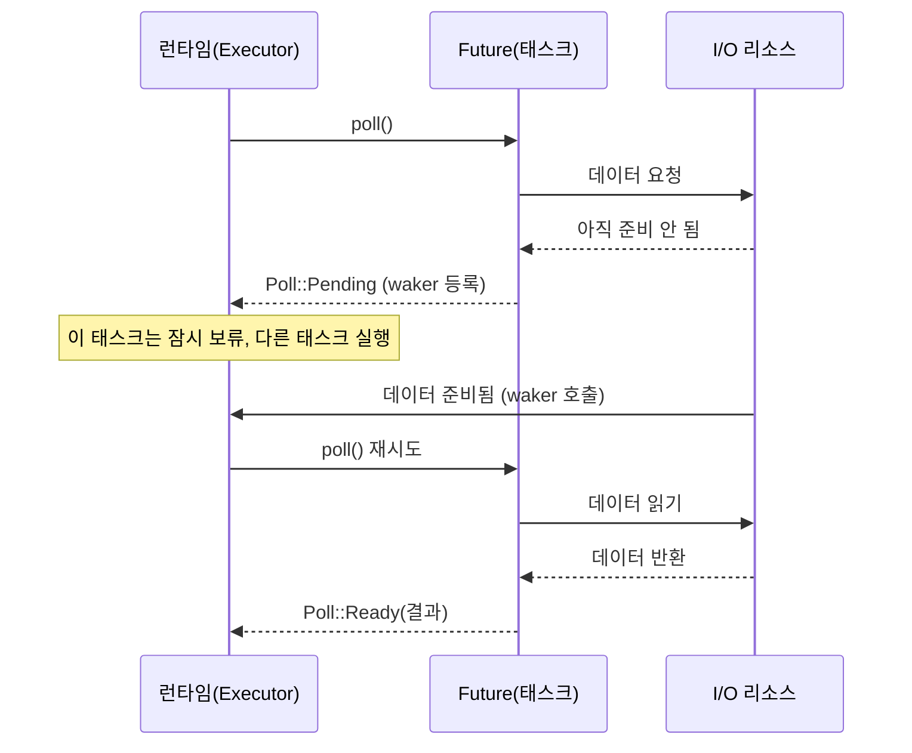

# Rust async/await와 Tokio

Rust의 async는 다른 언어의 async와 생김새는 비슷한데 동작 모델이 꽤 다르다. JavaScript나 Python에서 넘어오면 `async fn`을 호출하면 바로 실행되는 줄 알고 코드를 짰다가 아무것도 안 일어나서 한참 헤맨다. Rust에서 `async fn`을 호출하면 `Future`라는 값 하나가 만들어질 뿐 실행은 시작도 안 한다. 누군가 `.await`로 폴링하거나 런타임에 던져줘야 그제야 돈다. 여기서는 그 실행 모델, Tokio 런타임 선택, async에서 거의 무조건 한 번은 만나는 `future is not Send` 에러, blocking 코드가 런타임을 멈추는 문제를 실제로 겪는 순서대로 정리한다.

## async fn은 Future를 만들 뿐 실행하지 않는다

`async fn`은 호출하는 순간 함수 본문을 실행하는 게 아니라 그 본문을 담은 상태 기계(state machine)를 하나 반환한다. 이 상태 기계가 `Future` 트레이트를 구현한 값이다.

```rust
async fn say_hello() {
    println!("hello");
}

fn main() {
    let fut = say_hello(); // 여기서는 아무것도 출력되지 않는다
    // fut을 .await 하거나 런타임에 넘기지 않으면 hello는 영원히 안 찍힌다
}
```

이걸 처음 보면 당황한다. 함수를 호출했는데 본문이 안 돈다. Rust 컴파일러도 이걸 알아서 경고를 준다.

```
warning: unused implementation of `Future` that must be used
  = note: futures do nothing unless you `.await` or poll them
```

"futures do nothing unless you await or poll them" — 이 문장이 Rust async의 핵심이다. Future는 게으르다(lazy). 폴링당하기 전까지는 한 줄도 실행하지 않는다. C#이나 JS의 Promise/Task는 만드는 순간 백그라운드에서 진행되기 시작하는데(eager), Rust는 정반대다.

그래서 `async fn`을 실제로 돌리려면 두 가지 중 하나가 필요하다. 다른 async 함수 안에서 `.await` 하거나, 런타임의 진입점(`#[tokio::main]` 같은)에서 시작하거나.

```rust
#[tokio::main]
async fn main() {
    say_hello().await; // 이제 hello가 출력된다
}
```

`#[tokio::main]`은 매크로다. 펼쳐보면 평범한 `fn main()` 안에서 Tokio 런타임을 만들고 `block_on`으로 async 본문을 실행하는 코드로 바뀐다. 실제로 어떻게 펼쳐지는지 보면 이해가 빠르다.

```rust
fn main() {
    tokio::runtime::Runtime::new()
        .unwrap()
        .block_on(async {
            say_hello().await;
        });
}
```

`block_on`이 Future를 받아 완료될 때까지 현재 스레드를 붙잡고 폴링을 돌리는 함수다. 런타임 없이는 async 코드가 시작될 방법이 없다.

## .await 시점에 무슨 일이 일어나는가

`.await`는 단순히 "결과를 기다린다"가 아니라 "지금 당장 끝낼 수 없으면 제어권을 런타임에 양보한다"는 지점이다. 이 양보(yield) 지점이 어디 있느냐가 async 코드의 동작을 좌우한다.

```rust
async fn fetch_two() {
    let a = fetch("a").await; // 여기서 a 응답이 올 때까지 이 태스크는 멈춘다
    let b = fetch("b").await; // a가 끝난 뒤에야 b 시작
}
```

위 코드는 `a`를 받고 나서 `b`를 받는다. 순차적이다. `.await`가 한 줄씩 막기 때문이다. 두 요청을 동시에 보내고 싶으면 Future를 먼저 만들어두고 나중에 합쳐서 기다려야 한다.

```rust
async fn fetch_two() {
    let fa = fetch("a"); // Future만 생성, 아직 실행 안 됨
    let fb = fetch("b");
    let (a, b) = tokio::join!(fa, fb); // 둘을 동시에 폴링
}
```

`join!`은 여러 Future를 한 태스크 안에서 번갈아 폴링한다. `a`가 네트워크 대기로 양보하면 `b`를 폴링하고, `b`가 양보하면 다시 `a`로 돌아온다. 둘 다 끝나면 결과를 묶어 반환한다. 여기서 중요한 건 이게 멀티스레드가 아니라는 점이다. 한 스레드에서 두 작업을 잘게 쪼개 번갈아 돌리는 협력적 멀티태스킹(cooperative multitasking)이다.

이 협력적이라는 단어가 함정의 출발점이다. 각 태스크는 `.await`를 만났을 때만 제어권을 내놓는다. `.await`가 없는 구간에서는 그 태스크가 스레드를 독점한다. 뒤에서 다룰 blocking 문제가 전부 여기서 나온다.

### Future가 폴링되는 흐름

런타임이 Future를 어떻게 굴리는지 한 번 보면 `.await`의 양보가 와닿는다.



런타임은 Future의 `poll`을 호출한다. Future는 진행할 수 있으면 끝까지 가서 `Poll::Ready`를 돌려주고, 외부 자원(네트워크, 타이머)을 기다려야 하면 `Poll::Pending`을 돌려주면서 waker를 등록한다. 런타임은 `Pending`을 받으면 그 태스크를 내려놓고 다른 태스크를 돌린다. 나중에 자원이 준비되면 waker가 런타임을 깨우고, 런타임이 그 태스크를 다시 폴링한다. `.await`는 이 `poll` 호출이 일어나는 지점을 컴파일러가 자동으로 만들어주는 문법 설탕이다.

## Tokio 런타임: multi-thread vs current-thread

Tokio 런타임은 두 종류다. 어느 걸 쓰느냐에 따라 코드 제약과 성능이 달라진다.

multi-thread 런타임은 워커 스레드를 여러 개(기본은 CPU 코어 수) 두고 태스크를 work-stealing 방식으로 분산한다. 한 스레드가 놀고 있으면 다른 스레드의 큐에서 태스크를 훔쳐와 돌린다. 서버처럼 동시 요청이 많은 환경의 기본 선택이다.

```rust
#[tokio::main] // 기본값이 multi-thread
async fn main() {
    // 워커 스레드 여러 개에서 태스크가 돈다
}

// 워커 스레드 수를 직접 지정
#[tokio::main(worker_threads = 4)]
async fn main() {}
```

current-thread 런타임은 스레드 하나에서 모든 태스크를 돌린다. 스레드를 안 만드니 가볍고, 태스크가 스레드 사이를 넘나들지 않는다. CLI 도구, 테스트, 또는 단일 스레드만 허용되는 환경에서 쓴다.

```rust
#[tokio::main(flavor = "current_thread")]
async fn main() {}

// 매크로 없이 직접 빌드
fn main() {
    let rt = tokio::runtime::Builder::new_current_thread()
        .enable_all()
        .build()
        .unwrap();
    rt.block_on(async {
        // ...
    });
}
```

둘의 실질적 차이는 `Send` 제약에서 갈린다. multi-thread 런타임은 태스크가 워커 스레드 사이를 옮겨 다닐 수 있어야 하므로, `tokio::spawn`에 넘기는 Future가 `Send`여야 한다. current-thread는 태스크가 한 스레드에 머무니 `Send`가 필요 없다. 다음 절의 에러가 multi-thread에서만 터지는 이유가 이것이다.

## future is not Send 에러

async를 좀 쓰다 보면 거의 무조건 한 번은 만나는 에러다. 메시지가 길고 어디가 문제인지 한눈에 안 들어와서 처음엔 막막하다.

```rust
use std::rc::Rc;

#[tokio::main]
async fn main() {
    tokio::spawn(async {
        let data = Rc::new(5);   // Rc는 Send가 아니다
        some_async_fn().await;   // .await를 가로질러 data가 살아있음
        println!("{}", data);
    });
}
```

에러는 이렇게 나온다.

```
error: future cannot be sent between threads safely
   |
   = help: within `...`, the trait `Send` is not implemented for `Rc<i32>`
note: future is not `Send` as this value is used across an await
   |
   |         let data = Rc::new(5);
   |             ---- has type `Rc<i32>` which is not `Send`
   |         some_async_fn().await;
   |                         ^^^^^^ await occurs here, with `data` maybe used later
```

핵심은 "this value is used across an await"다. `.await` 지점을 가로질러(across) 살아있는 변수가 `Send`가 아니면 그 Future 전체가 `Send`가 안 된다. 왜 이런 규칙인가.

`async fn`이 컴파일되면 상태 기계가 된다. `.await`에서 멈췄다가 나중에 재개될 때, `.await` 이후에도 쓰이는 지역 변수들은 그 상태 기계 구조체 안에 필드로 저장된다. 멈춘 동안 변수를 어딘가 보관해야 하니까. multi-thread 런타임은 이 상태 기계를 다른 스레드로 옮겨 재개할 수 있다. 그러려면 안에 저장된 모든 변수가 스레드 간 이동이 안전(`Send`)해야 한다. `Rc`는 참조 카운트를 원자적이지 않게 올리고 내려서 스레드 안전하지 않다. 그래서 거부된다.

해결책은 상황에 따라 다르다.

스레드 안전한 타입으로 교체한다. `Rc` 대신 `Arc`를 쓴다.

```rust
use std::sync::Arc;

tokio::spawn(async {
    let data = Arc::new(5); // Arc는 원자적 참조 카운트라 Send
    some_async_fn().await;
    println!("{}", data);
});
```

또는 non-Send 값을 `.await` 전에 스코프에서 떨어뜨린다. `.await`를 가로지르지만 않으면 상태 기계에 저장되지 않으니 문제가 안 된다.

```rust
tokio::spawn(async {
    {
        let data = Rc::new(5);
        println!("{}", data); // .await 전에 다 쓰고
    } // 여기서 data가 drop되어 .await를 넘기지 않음
    some_async_fn().await;
});
```

`MutexGuard`를 `.await` 너머로 들고 있을 때도 같은 에러가 난다. `std::sync::MutexGuard`는 `Send`가 아니다.

```rust
// 이렇게 쓰면 future is not Send
async fn bad(m: &std::sync::Mutex<i32>) {
    let guard = m.lock().unwrap();
    some_async_fn().await; // guard가 .await를 가로지름 → not Send
    *guard;
}

// lock을 짧게 잡고 .await 전에 풀어준다
async fn good(m: &std::sync::Mutex<i32>) {
    let value = {
        let guard = m.lock().unwrap();
        *guard
    }; // 블록 끝에서 guard drop
    some_async_fn().await; // 이제 가로지르는 non-Send 값이 없음
}
```

이건 `Send` 문제이기도 하지만 잠금을 들고 `.await` 하는 건 그 자체로 위험하다. 락을 쥔 채 양보하면 그 태스크가 재개될 때까지 다른 태스크가 같은 락을 못 잡아 데드락 비슷한 정체가 생긴다. 락은 짧게 잡고 빨리 풀어야 한다.

## spawn, join, select

### tokio::spawn — 태스크를 백그라운드로 던진다

`tokio::spawn`은 Future를 런타임에 독립 태스크로 등록한다. `.await` 없이 호출하면 그 태스크는 백그라운드에서 돌고 호출한 쪽은 바로 다음 줄로 넘어간다. 반환값은 `JoinHandle`인데, 이걸 `.await` 하면 태스크 결과를 받을 수 있다.

```rust
let handle = tokio::spawn(async {
    // 시간이 걸리는 작업
    expensive_work().await
});

// 다른 일을 하다가
do_other_stuff().await;

// 결과가 필요할 때 받는다
let result = handle.await.unwrap(); // JoinHandle은 Result로 감싸서 반환
```

`handle.await`가 `Result`를 돌려주는 이유는 태스크가 panic으로 죽었을 수도 있어서다. spawn한 태스크 안에서 panic이 나면 그 태스크만 죽고 전체 프로그램은 안 죽는다. `JoinHandle`을 `.await` 하면 그 panic이 `JoinError`로 잡힌다. spawn하고 핸들을 버리면(`let _ = tokio::spawn(...)`) 태스크가 조용히 패닉해도 모르고 지나간다. 백그라운드 태스크의 에러를 놓치는 흔한 원인이다.

### join — 여러 태스크를 모두 기다린다

여러 Future를 동시에 돌리고 전부 끝날 때까지 기다린다. 앞서 본 `join!` 매크로는 한 태스크 안에서 여러 Future를 합치고, `spawn` 여러 개를 모으려면 핸들을 각각 `.await` 하거나 `JoinSet`을 쓴다.

```rust
// 매크로: 한 태스크 안에서 동시 폴링
let (a, b, c) = tokio::join!(fetch("a"), fetch("b"), fetch("c"));

// JoinSet: 동적으로 태스크를 모아서 spawn
let mut set = tokio::task::JoinSet::new();
for url in urls {
    set.spawn(async move { fetch(&url).await });
}
while let Some(res) = set.join_next().await {
    let body = res.unwrap();
    // 끝나는 순서대로 결과 처리
}
```

`join!`은 넘긴 Future 중 하나라도 안 끝나면 계속 기다린다. 하나가 에러를 반환해도 나머지가 끝날 때까지 안 멈춘다. 하나라도 실패하면 즉시 중단하고 싶으면 `try_join!`을 쓴다. 첫 `Err`가 나오면 나머지를 버리고 바로 그 에러를 반환한다.

### select — 가장 먼저 끝나는 것 하나만

`select!`는 여러 Future 중 먼저 완료되는 하나를 기다리고 나머지는 버린다. 타임아웃, 취소 신호, 여러 이벤트 소스 중 먼저 오는 것 처리에 쓴다.

```rust
tokio::select! {
    result = fetch("slow") => {
        println!("응답: {:?}", result);
    }
    _ = tokio::time::sleep(Duration::from_secs(3)) => {
        println!("3초 타임아웃");
    }
}
```

`fetch`가 3초 안에 끝나면 첫 번째 가지가, 아니면 sleep 가지가 실행된다. 중요한 함정이 있다. select에서 선택받지 못한 가지의 Future는 그 자리에서 drop된다. 위 예시에서 fetch가 먼저 끝나면 진행 중이던 sleep은 버려진다. 만약 fetch 안에서 절반쯤 진행된 작업이 있었다면 그 중간 상태도 같이 사라진다. 이걸 cancellation safety라고 부르는데, 루프 안에서 `select!`를 돌릴 때 특히 조심해야 한다. 매 반복마다 선택 안 된 가지가 처음부터 다시 시작하면서 진행한 작업이 날아갈 수 있다.

```rust
// 위험한 패턴: 루프 안 select에서 매번 새 Future를 만들면
// 선택 안 될 때마다 진행분이 버려진다
loop {
    tokio::select! {
        msg = rx.recv() => { /* 처리 */ }
        _ = some_long_task() => { /* 매 반복 처음부터 다시 시작 */ }
    }
}
```

이런 경우 오래 걸리는 Future는 루프 밖에서 한 번 만들고 `&mut`로 빌려 select에 넘겨, 선택 안 돼도 상태가 유지되게 해야 한다.

## blocking 코드가 런타임을 막는다

async에서 가장 디버깅하기 까다로운 문제다. 증상은 "왜 동시 요청을 처리하는데 응답이 줄줄이 늦어지지?" 또는 "서버가 통째로 멈춘 것 같다"로 나타난다. 원인은 async 태스크 안에서 blocking 호출을 한 것이다.

앞서 말했듯 Tokio는 협력적 스케줄링이다. 각 태스크는 `.await`에서만 제어권을 양보한다. 그런데 async 함수 안에서 동기 blocking 작업을 하면 — 무거운 계산, `std::thread::sleep`, 동기 파일 I/O, blocking 네트워크 호출 — 그 작업이 끝날 때까지 `.await`를 안 만나니 워커 스레드를 통째로 점유한다. 그 스레드에 배정된 다른 태스크들은 전부 멈춘다.

```rust
async fn handler() {
    // 이게 들어가면 이 워커 스레드의 다른 태스크가 전부 멈춘다
    std::thread::sleep(Duration::from_secs(5)); // 동기 sleep
    // CPU를 5초 갈아넣는 무거운 계산도 마찬가지
    let hash = expensive_hash(&data); // 동기 계산
}
```

current-thread 런타임이면 스레드가 하나뿐이라 서버 전체가 5초 멈춘다. multi-thread여도 워커 스레드 수만큼만 동시 blocking을 버티고, 그걸 넘으면 새 요청이 처리될 스레드가 없어 응답이 밀린다. 워커 4개짜리 런타임에 blocking 핸들러 5개가 동시에 들어오면 5번째부터는 앞 작업이 끝날 때까지 시작도 못 한다.

비동기 버전이 있는 작업은 비동기로 바꾼다. `std::thread::sleep` 대신 `tokio::time::sleep`, 동기 파일 I/O 대신 `tokio::fs`를 쓴다. 이들은 `.await`에서 제대로 양보한다.

```rust
async fn handler() {
    tokio::time::sleep(Duration::from_secs(5)).await; // 양보함, 다른 태스크 안 막음
    let contents = tokio::fs::read_to_string("file.txt").await.unwrap();
}
```

### spawn_blocking — CPU 작업과 동기 라이브러리

비동기 버전이 없는 작업도 있다. 무거운 CPU 계산, 동기 인터페이스만 제공하는 라이브러리(일부 DB 드라이버, 이미지 처리, 암호화 등). 이런 건 `spawn_blocking`으로 별도 스레드 풀에 떠넘긴다.

```rust
async fn handler(data: Vec<u8>) -> String {
    let hash = tokio::task::spawn_blocking(move || {
        // 이 클로저는 blocking 전용 스레드 풀에서 돈다
        // 여기서 CPU를 오래 써도 async 워커 스레드는 안 막힌다
        expensive_hash(&data)
    })
    .await
    .unwrap();
    hash
}
```

`spawn_blocking`은 Tokio가 따로 관리하는 blocking 스레드 풀(기본 최대 512개)에서 클로저를 실행한다. async 워커 스레드와 분리돼 있어서, 여기서 아무리 CPU를 갈아넣거나 동기 I/O로 막혀도 async 태스크 스케줄링에 영향을 안 준다. 반환된 핸들을 `.await` 하면 결과를 async 쪽에서 받는다.

주의할 점은 `spawn_blocking`이 만능은 아니라는 것이다. blocking 스레드 풀도 크기 한계가 있어서, 끝없이 막히는 작업(예: 영원히 안 끝나는 동기 루프)을 계속 던지면 풀이 고갈된다. 그리고 클로저 안에서는 async 코드를 `.await` 할 수 없다. 정말 무거운 CPU 작업이 코어를 오래 점유한다면 `spawn_blocking`보다 별도 스레드 풀(rayon 같은)로 분리하는 게 나은 경우도 있다.

판단 기준은 단순하다. `.await`가 없고 시간이 걸리는 모든 작업은 async 워커 스레드를 막는다고 봐야 한다. 수 밀리초를 넘기는 동기 작업이면 `spawn_blocking`을 의심한다.

## Arc<Mutex> 공유 상태

여러 태스크가 같은 데이터를 읽고 쓰려면 공유해야 한다. 그런데 Rust의 빌림 규칙은 가변 참조를 동시에 여럿 허용하지 않는다. 멀티스레드 환경이면 더하다. 그래서 공유 가변 상태는 `Arc<Mutex<T>>` 조합으로 감싼다.

`Arc`는 원자적 참조 카운트 포인터로, 여러 소유자가 같은 데이터를 가리키게 해준다. `Mutex`는 한 번에 하나만 데이터에 접근하도록 잠금을 건다. 둘을 합치면 "여러 태스크가 공유하되, 접근은 한 번에 하나씩"이 된다.

```rust
use std::sync::Arc;
use tokio::sync::Mutex;

#[tokio::main]
async fn main() {
    let counter = Arc::new(Mutex::new(0));

    let mut handles = vec![];
    for _ in 0..10 {
        let c = Arc::clone(&counter); // 참조 카운트만 증가, 데이터는 공유
        let h = tokio::spawn(async move {
            let mut num = c.lock().await; // 잠금 획득
            *num += 1;
        }); // 스코프 끝에서 잠금 자동 해제
        handles.push(h);
    }

    for h in handles {
        h.await.unwrap();
    }

    println!("{}", *counter.lock().await); // 10
}
```

`Arc::clone`은 데이터를 복사하는 게 아니라 참조 카운트만 1 올린다. 각 태스크는 같은 `Mutex`를 가리키는 자기 `Arc`를 들고 들어가고, `move`로 클로저에 소유권을 넘긴다. `lock().await`로 잠금을 잡고, `MutexGuard`가 스코프를 벗어나면 자동으로 풀린다.

### std Mutex vs tokio Mutex

여기서 자주 헷갈리는 게 어느 `Mutex`를 쓰느냐다. `std::sync::Mutex`와 `tokio::sync::Mutex` 둘 다 있는데, 기본은 `std::sync::Mutex`다.

`tokio::sync::Mutex`는 `lock().await`로 잠금을 잡는 동안 양보한다. 즉 잠금을 기다리는 동안 스레드가 안 막힌다. 대신 매번 `.await`를 거치니 약간 느리다. 잠금을 쥔 채로 `.await` 해야 하는 경우(잠금 안에서 비동기 작업을 해야 할 때)에만 쓴다.

`std::sync::Mutex`는 동기 잠금이라 더 빠르다. 잠금을 잡고 데이터를 잠깐 건드리고 바로 푸는, `.await`가 끼지 않는 짧은 임계 구역이면 이게 정답이다. 실무에서는 이 경우가 훨씬 많다.

```rust
use std::sync::Mutex; // tokio 말고 std

let counter = Arc::new(Mutex::new(0));
let c = Arc::clone(&counter);
tokio::spawn(async move {
    let mut num = c.lock().unwrap(); // 동기 잠금, .await 없음
    *num += 1;
    // 잠금 안에서 .await 하지 않으면 std Mutex가 더 적합
});
```

판단 기준은 "잠금을 쥔 채로 `.await` 할 일이 있는가"다. 없으면 `std::sync::Mutex`. 잠금 안에서 비동기 호출이 필요하면 `tokio::sync::Mutex`. 앞서 본 `future is not Send` 에러를 떠올리면, `std::sync::MutexGuard`를 `.await` 너머로 들고 가면 컴파일이 막힌다. 그게 막힌다는 건 애초에 std Mutex로는 잠금을 쥔 채 양보할 수 없다는 뜻이고, 그러면 안 되는 게 맞다. 컴파일러가 설계 실수를 미리 잡아주는 셈이다.

읽기가 압도적으로 많고 쓰기가 드물면 `RwLock`을 쓴다. 여러 태스크가 동시에 읽기 잠금을 잡을 수 있어 읽기 경합이 줄어든다. 다만 쓰기 잠금은 여전히 배타적이고, 읽기가 잠금을 오래 쥐고 있으면 쓰기가 굶을 수 있다.

```rust
use tokio::sync::RwLock;

let cache = Arc::new(RwLock::new(HashMap::new()));

// 읽기: 여러 태스크 동시 가능
let r = cache.read().await;
let value = r.get("key").cloned();
drop(r); // 읽기 잠금 빨리 해제

// 쓰기: 한 번에 하나만, 다른 모든 접근 차단
let mut w = cache.write().await;
w.insert("key".to_string(), "value".to_string());
```

공유 상태에서 마지막으로 챙길 것은 잠금 범위를 최대한 좁히는 것이다. 잠금을 잡은 채 무거운 작업을 하거나 `.await`로 오래 양보하면 다른 태스크가 그 잠금을 기다리며 줄을 선다. 데이터를 꺼내거나 갱신하는 그 순간만 잠그고 빨리 풀어야 한다. 위 `RwLock` 예시에서 `value`를 복사(`cloned`)하고 바로 `drop(r)` 하는 것도 잠금을 오래 안 쥐려는 것이다.
