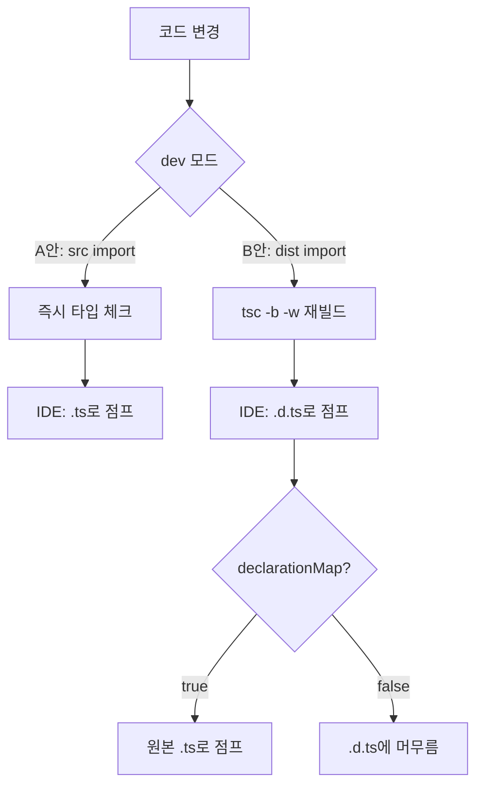

# TypeScript Workspace와 ts-paths

## 시작하기 전에

TypeScript 모노레포에서 가장 자주 만나는 두 가지 도구가 패키지 매니저의 workspace와 tsconfig의 `paths`다. 둘은 비슷해 보이지만 동작 계층이 완전히 다르다. workspace는 **패키지 매니저 레벨**에서 심볼릭 링크와 의존성 그래프를 관리하고, `paths`는 **TypeScript 컴파일러 레벨**에서 import 식별자를 어떻게 해석할지 알려주는 메타데이터다.

이 둘의 경계를 모호하게 두면 "타입 체크는 통과하는데 `node dist/index.js`만 실행하면 `Cannot find module '@app/utils'` 에러가 난다" 같은 일이 생긴다. 실제로 ts-paths를 처음 도입한 팀에서 가장 많이 겪는 문제다. 아래에서는 이 함정을 중심으로 두 기능의 동작과 실무 설정을 정리한다.

## paths의 가장 큰 함정: tsc는 import 경로를 변환하지 않는다

`tsconfig.json`에 다음과 같이 적었다고 하자.

```json
{
  "compilerOptions": {
    "baseUrl": "./src",
    "paths": {
      "@utils/*": ["utils/*"]
    },
    "outDir": "./dist"
  }
}
```

소스 코드는 이렇게 쓴다.

```typescript
// src/index.ts
import { formatDate } from "@utils/date";
```

`tsc`로 컴파일하면 `dist/index.js`에는 다음이 그대로 남는다.

```javascript
// dist/index.js
const date_1 = require("@utils/date");
```

문자열이 변환되지 않는다. 노드는 `@utils/date`를 `node_modules/@utils/date`에서 찾으므로 런타임에 `MODULE_NOT_FOUND`가 터진다. 이게 ts-paths의 가장 흔한 함정이다. `paths`는 **타입 체커가 import 식별자를 해석할 때만 참조**하는 정보고, 코드 생성 단계는 건드리지 않는다. TypeScript 공식 문서에도 명시되어 있고, 메인테이너들이 의도적으로 그렇게 설계했다.

해결책은 두 갈래다. 빌드 후 정적 변환을 거치거나, 런타임에 모듈 해석 훅을 끼워 넣거나.

### 빌드 후 변환: tsc-alias

`tsc`가 만든 출력에서 alias를 실제 상대 경로로 치환하는 후처리 도구다.

```bash
npm i -D tsc-alias
```

```json
// package.json
{
  "scripts": {
    "build": "tsc && tsc-alias"
  }
}
```

```json
// tsconfig.json — paths만 정상적으로 정의되어 있으면 된다
{
  "compilerOptions": {
    "baseUrl": "./src",
    "paths": { "@utils/*": ["utils/*"] },
    "outDir": "./dist"
  }
}
```

`tsc-alias`는 `outDir` 안의 `.js`/`.d.ts` 파일을 모두 훑으면서 `@utils/date`를 `./utils/date` 같은 상대 경로로 바꿔 쓴다. 결과물이 alias-free라서 노드, 번들러, 어떤 런타임에도 그대로 들어간다. 단점은 매번 빌드 단계가 한 번 더 끼는 것과, dynamic import의 문자열 템플릿(`` import(`@utils/${name}`) ``)은 정적 분석이 안 돼서 변환되지 않는다는 점이다.

### 런타임 해석: tsconfig-paths/register (ts-node)

`ts-node`로 직접 실행할 때는 `tsconfig-paths/register`를 미리 로드해 노드의 모듈 해석 함수를 가로챈다.

```json
// tsconfig.json
{
  "ts-node": {
    "require": ["tsconfig-paths/register"]
  }
}
```

또는 명령행에서.

```bash
node -r ts-node/register -r tsconfig-paths/register src/index.ts
```

이 방법은 빌드 결과물이 아닌 소스 실행 시점에만 동작한다. `node dist/index.js`로는 동작하지 않으므로 프로덕션 실행 경로에는 쓰지 않는다. 또 ESM 환경에서는 `--experimental-loader`로 따로 등록해야 하고, 로더 체이닝이 까다롭다.

### 테스트: jest moduleNameMapper

Jest는 자체 모듈 해석을 쓰기 때문에 `paths`를 알아서 읽어주지 않는다.

```javascript
// jest.config.js
module.exports = {
  preset: "ts-jest",
  moduleNameMapper: {
    "^@utils/(.*)$": "<rootDir>/src/utils/$1"
  }
};
```

`paths`가 늘어날 때마다 두 군데를 동기화해야 하는 게 번거로워서 `ts-jest`의 `pathsToModuleNameMapper` 헬퍼를 쓰기도 한다.

```javascript
const { pathsToModuleNameMapper } = require("ts-jest");
const { compilerOptions } = require("./tsconfig.json");

module.exports = {
  preset: "ts-jest",
  moduleNameMapper: pathsToModuleNameMapper(compilerOptions.paths, {
    prefix: "<rootDir>/"
  })
};
```

### 번들러: Vite, webpack, esbuild

번들러는 자체적으로 alias를 처리하지만 tsconfig의 `paths`를 무조건 따라가지는 않는다.

Vite는 `vite-tsconfig-paths` 플러그인이 사실상 표준이다.

```typescript
// vite.config.ts
import { defineConfig } from "vite";
import tsconfigPaths from "vite-tsconfig-paths";

export default defineConfig({
  plugins: [tsconfigPaths()]
});
```

webpack은 보통 `tsconfig-paths-webpack-plugin`을 쓴다.

```javascript
// webpack.config.js
const TsconfigPathsPlugin = require("tsconfig-paths-webpack-plugin");

module.exports = {
  resolve: {
    plugins: [new TsconfigPathsPlugin({ configFile: "./tsconfig.json" })]
  }
};
```

### swc

`@swc/core`를 컴파일러로 쓰는 경우 `.swcrc`에 `paths`를 다시 적어야 한다. swc는 tsconfig를 읽지 않는다.

```json
// .swcrc
{
  "jsc": {
    "baseUrl": "./src",
    "paths": {
      "@utils/*": ["utils/*"]
    }
  }
}
```

swc 역시 paths를 정적 변환해서 출력한다. tsc보다 훨씬 빠르지만 데코레이터 메타데이터처럼 일부 동작이 미묘하게 다르다는 점은 별도 이슈다.

### 도구별 특성 정리

| 도구 | 시점 | 변환 방식 | 주의점 |
|------|------|-----------|--------|
| tsc | 컴파일 | 변환 안 함 | paths는 타입 체크 전용 |
| tsc-alias | 빌드 후처리 | 정적 치환 | dynamic import 템플릿 미지원 |
| tsconfig-paths/register | 런타임 | 모듈 해석 훅 | ESM은 별도 로더 필요 |
| swc | 컴파일 | 정적 치환 | tsconfig를 읽지 않음 |
| Vite/webpack | 번들 시점 | 정적 치환 | 별도 플러그인 필요 |
| jest moduleNameMapper | 테스트 런타임 | 정규식 매핑 | tsconfig와 동기화 필요 |

같은 alias를 쓰는데도 빌드, 테스트, 개발, 프로덕션 각각에서 다른 도구가 끼는 구조라 한쪽만 바꾸면 다른 쪽이 깨진다. 새 alias를 추가할 때 체크해야 할 곳이 어디어디인지 README에 적어두는 게 실무적으로 도움이 된다.

## Project References와 paths를 함께 쓸 때

`composite: true`로 설정한 프로젝트는 `tsc -b`로 의존 그래프를 따라 증분 빌드를 한다. 여기에 `paths`를 끼워 넣으면 미묘한 동작이 몇 가지 있다.

```json
// packages/utils/tsconfig.json
{
  "compilerOptions": {
    "composite": true,
    "declaration": true,
    "declarationMap": true,
    "outDir": "./dist",
    "rootDir": "./src"
  },
  "include": ["src/**/*"]
}
```

```json
// apps/web/tsconfig.json
{
  "compilerOptions": {
    "composite": true,
    "baseUrl": ".",
    "paths": {
      "@acme/utils": ["../../packages/utils/src/index.ts"]
    }
  },
  "references": [
    { "path": "../../packages/utils" }
  ],
  "include": ["src/**/*"]
}
```

`paths`가 utils의 **소스 파일**을 가리키도록 매핑하면 IDE에서 go-to-definition이 `.d.ts`가 아니라 실제 `.ts`로 점프한다. 디버깅이 훨씬 편해진다. 다만 `tsc -b`는 references를 통해 utils가 먼저 빌드돼 `.d.ts`를 생성하는 흐름을 가정하므로, paths가 src를 가리켜도 별 문제는 없지만 utils의 `outDir/dist`와 paths가 가리키는 `src`가 동시에 존재한다는 점은 의식해야 한다.

`declarationMap: true`는 IDE에서 점프할 때 컴파일된 `.d.ts`가 아니라 원본 `.ts`로 가게 해주는 옵션이다. paths로 src를 직접 가리키면 어차피 src로 점프하지만, paths 없이 references만 쓰는 환경에서는 declarationMap이 사실상 필수다.

`.tsbuildinfo`는 increment 빌드의 핵심 캐시인데, 다음 경우에 통째로 무효화된다.

- tsconfig 파일이 변경됐을 때 (옵션 하나만 바꿔도)
- 의존하는 패키지의 `.d.ts` 시그니처가 바뀌었을 때
- TypeScript 버전이 달라졌을 때
- `extends` 체인의 상위 tsconfig가 바뀌었을 때

paths만 추가하거나 수정해도 `.tsbuildinfo`가 무효화돼 전체가 다시 빌드된다. CI에서 `tsc -b` 캐시를 살리려고 `node_modules/.cache` 같은 데 `.tsbuildinfo`를 모아놨는데 paths 변경 한 줄로 캐시가 다 날아가서 빌드 시간이 늘어나는 사례가 흔하다. 캐시 키에 tsconfig 해시를 포함시키는 게 정석이다.

## pnpm의 workspace:* 프로토콜

pnpm은 workspace 의존성을 표현할 때 `workspace:*`, `workspace:^`, `workspace:~` 같은 프로토콜을 쓴다.

```json
{
  "dependencies": {
    "@acme/utils": "workspace:*",
    "@acme/api": "workspace:^1.2.0"
  }
}
```

로컬 개발 시에는 심볼릭 링크로 연결되지만, `pnpm publish`를 하는 순간 이 표현이 실제 버전으로 치환된 `package.json`이 npm 레지스트리에 올라간다. `workspace:*`는 publish 시점의 정확한 버전(`1.2.3`)으로, `workspace:^`는 `^1.2.3`으로 변환된다. 사용자가 npm에서 받을 때는 일반 버전 의존성처럼 보인다.

이 동작은 yarn berry(v2+)도 비슷하지만, **yarn classic(v1)과 npm workspaces는 `workspace:` 프로토콜 자체를 모른다**. yarn classic으로 모노레포를 운영하다 pnpm으로 바꾸려고 `workspace:*`를 적으면 yarn은 그대로 npm 레지스트리에서 `workspace:*` 버전을 찾으려고 시도하다 실패한다. 패키지 매니저 변경이 이만큼 침습적이다.

npm v7 이후 workspaces도 호환은 되지만 `workspace:` 프로토콜 자체를 인식하는 건 npm v8.3 이후이고, publish 시 자동 치환은 npm v9에서야 들어왔다. 회사 사내 레지스트리에서 publish하는 라이브러리라면 npm/yarn/pnpm 어떤 도구로 publish되는지 한 번 확인해보는 게 안전하다.

## 호이스팅: phantom dependency

npm과 yarn classic은 모든 의존성을 루트 `node_modules`로 끌어올린다(호이스팅). 그래서 `package.json`에 명시하지 않은 패키지도 `import lodash from "lodash"`가 우연히 동작하는 경우가 생긴다. 이게 phantom dependency다.

```json
// packages/web/package.json
{
  "dependencies": {
    "react": "^18.0.0"
  }
}
```

```typescript
// packages/web/src/util.ts
import _ from "lodash"; // package.json엔 없는데 동작함
```

루트 어딘가에 `lodash`가 깔려 있어 호이스팅으로 끌려 올라왔기 때문이다. pnpm의 strict 모드(기본값)는 호이스팅을 하지 않고 각 패키지의 `node_modules`에 명시된 의존성만 심볼릭 링크해주므로 위 import가 즉시 깨진다.

```
Error: Cannot find module 'lodash'
```

이 에러를 처음 보면 "왜 갑자기 안 되지?"가 되는데, 사실 npm/yarn에서 우연히 동작하던 게 잘못이었던 거다. pnpm으로 갈아탔을 때 가장 많이 보이는 에러가 이거다. 해결은 단순히 빠진 의존성을 `package.json`에 추가하는 것이다.

반대로 일부 라이브러리(특히 오래된 React Native 관련 도구들)는 phantom dependency를 전제로 만들어져서 pnpm에서 깨진다. 이때는 `.npmrc`에 `shamefully-hoist=true` 또는 `public-hoist-pattern[]`을 적어 임시로 호이스팅을 켤 수 있다. 이름에서 알 수 있듯 권장되는 탈출구는 아니다.

## 순환 의존성과 tsc -b 디버깅

`tsc -b`는 references 그래프에 순환이 있으면 다음과 같은 에러를 낸다.

```
error TS6202: Project references may not form a circular graph. 
Cycle detected: /repo/packages/a/tsconfig.json -> /repo/packages/b/tsconfig.json -> /repo/packages/a/tsconfig.json
```

해결의 시작은 `tsc -b --listFiles`로 어떤 파일이 어디에서 import됐는지 추적하는 것이다. references 자체가 순환이라기보다 그 안에서 실제 파일 import가 순환을 만든 경우가 대부분이다. `madge` 같은 도구로 의존성 그래프를 시각화하면 빠르다.

```bash
npx madge --circular --extensions ts packages/
```

순환을 끊는 방법은 보통 셋 중 하나다.

- 두 패키지에서 같이 쓰는 코드를 별도의 leaf 패키지로 추출
- 인터페이스만 한쪽에 두고 구현은 반대쪽에 두는 의존성 역전
- 단순한 타입 공유라면 `import type`만 쓰고 런타임 의존성은 끊기

`import type`은 emit 단계에서 완전히 제거되므로 런타임 순환은 만들지 않지만, references 그래프 입장에서는 여전히 의존성으로 잡힌다. 이걸 회피하려면 타입 전용 패키지를 따로 두는 패턴이 자주 쓰인다.

## IDE에서 paths가 인식되지 않을 때

VSCode에서 `@utils/date`가 빨간 줄로 뜨고 자동완성이 안 될 때 점검 순서.

1. `baseUrl`이 빠지지 않았는지 확인. `paths`만 있고 `baseUrl`이 없으면 TypeScript 5.0 이전 버전에서는 동작하지 않는다(5.0부터는 paths 단독 사용 허용).
2. tsconfig.json이 여러 개일 때 어느 것이 활성인지 확인. VSCode는 워크스페이스 루트의 tsconfig를 우선하지만, `"typescript.tsconfig"` 설정으로 바꿀 수 있다.
3. `extends` 체인이 길 때 paths가 상위에서 정의되고 하위에서 빈 객체로 덮였는지 확인. paths는 **머지되지 않고 통째로 덮인다**.
4. VSCode 우하단의 TypeScript 버전 표시를 클릭해 워크스페이스의 TypeScript를 쓰는지 확인. 글로벌 TypeScript와 버전이 다르면 동작이 미묘하게 달라진다.
5. `Developer: Reload Window`로 TypeScript 서버를 재시작. 캐시가 꼬여 있는 경우가 의외로 많다.
6. 마지막으로 `tsc --traceResolution | grep "@utils"`로 실제 모듈 해석 로그를 본다. 어느 candidate 경로에서 실패하는지 그대로 찍힌다.

WebStorm은 자체 인덱서를 쓰기 때문에 `.idea` 캐시(`Invalidate Caches / Restart`)가 자주 답이 된다. 그리고 WebStorm은 monorepo에서 각 패키지의 tsconfig를 자동으로 인식하는 게 VSCode보다 약해서, 명시적으로 `Settings > Languages & Frameworks > TypeScript`에서 옵션을 손봐야 할 때가 있다.

paths는 **컴파일러에게 주는 힌트일 뿐 실제 모듈 해석을 보장하지 않는다**는 사실을 IDE 동작에서도 항상 의식해야 한다. IDE에서 자동완성이 되더라도 런타임에서 깨지는 경우는 위에서 다룬 그대로다.

## main, types, exports 필드

monorepo에서 패키지 간 import가 어떻게 해석되는지는 의외로 `package.json`의 진입점 필드가 결정한다.

```json
{
  "name": "@acme/utils",
  "main": "dist/index.js",
  "types": "dist/index.d.ts",
  "exports": {
    ".": {
      "types": "./dist/index.d.ts",
      "import": "./dist/index.mjs",
      "require": "./dist/index.cjs"
    }
  }
}
```

`exports` 필드가 정의되어 있으면 노드는 `main`을 무시한다. TypeScript는 `moduleResolution: "bundler"` 또는 `"node16"`/`"nodenext"`일 때 `exports`를 본다. 이때 **`exports`에 `types` 조건이 빠져 있으면 최상위 `types` 필드가 무시되고 타입을 못 찾는 사고가 난다**. 자주 보는 에러다.

```
error TS7016: Could not find a declaration file for module '@acme/utils'.
```

해결은 `exports` 안에 `types` 조건을 명시적으로 넣는 것이다. 그리고 `types` 조건은 반드시 `import`/`require`보다 **먼저** 적어야 한다. 조건은 순서대로 매칭되기 때문이다.

```json
{
  "exports": {
    ".": {
      "types": "./dist/index.d.ts",
      "import": "./dist/index.mjs",
      "require": "./dist/index.cjs"
    }
  }
}
```

서브 경로 export(`@acme/utils/date` 같은 형태)도 같은 규칙이다. tsconfig에서 `moduleResolution: "node"`(legacy)를 쓰면 `exports`를 무시하고 `main`/`types`만 보므로 에러가 안 나는데, 모던한 노드 버전에서 실행하면 깨진다. `node16` 이상으로 올리는 게 정답이지만, `paths`로 dist의 `.d.ts`를 직접 가리키는 우회를 쓰는 팀도 있다.

## dev: 소스 직접 import vs build 후 dist import

모노레포에서 패키지 간 import를 어떻게 풀지는 두 갈래다.

**A안: paths로 src를 직접 가리킨다**

```json
// apps/web/tsconfig.json
{
  "compilerOptions": {
    "paths": {
      "@acme/utils": ["../../packages/utils/src/index.ts"]
    }
  }
}
```

장점은 빌드 없이 즉시 반영되어 dev 서버가 빠르고, IDE go-to-definition이 실제 `.ts` 파일로 점프해서 디버깅이 쉽다는 것. 단점은 패키지의 `package.json` `main`/`exports`와 다른 진입점을 사용하므로 외부에 publish할 때와 동작이 달라질 수 있고, 타입 체크 범위에 모든 패키지의 src가 들어가서 큰 모노레포에서는 IDE가 무거워진다.

**B안: build 후 dist를 import한다**

각 패키지를 `tsc -b`로 미리 빌드하고 `package.json`의 `main`/`types`/`exports`가 가리키는 `dist`를 import한다. paths는 굳이 정의하지 않는다.

장점은 외부 publish 환경과 dev 환경이 같아서 "로컬에선 되는데 배포하니까 안 된다" 류 사고가 줄고, 각 패키지가 격리되어 IDE 부담이 적다. 단점은 변경할 때마다 빌드 watch를 돌려야 하고(`tsc -b -w`), go-to-definition이 `.d.ts`로 가서 declarationMap을 켜지 않으면 디버깅이 불편하다.

큰 모노레포에서는 보통 B안 + `declarationMap: true`로 가고, 작은 팀이거나 패키지가 publish되지 않는 사내 모노레포는 A안이 빠르다. 둘을 섞어서 dev에서는 src import, 프로덕션 빌드에서는 dist import로 분기하는 패턴(`tsconfig.json`과 `tsconfig.build.json`을 분리)도 있는데, 환경별 paths가 늘어나서 관리 비용이 커진다.



## 마지막으로 점검할 것

paths 한 줄을 추가하는 일은 IDE에선 즉시 동작하지만 그 변경이 실제로 정상 동작하려면 다음 환경이 모두 같이 알아야 한다.

- tsc 빌드 출력 (tsc-alias 또는 빌드 후 dist 사용)
- ts-node 직접 실행 (tsconfig-paths/register)
- jest 테스트 (moduleNameMapper)
- vite/webpack 번들링 (각자 플러그인)
- swc 컴파일 (.swcrc paths 별도 정의)
- IDE (tsconfig를 활성 프로젝트로 인식하는지)

이 중 한 곳이라도 빠지면 그 환경에서만 깨진다. paths는 편하지만 동기화 비용을 늘리는 도구라는 점을 인정하고 도입하는 게 맞다. 작은 프로젝트에서는 차라리 짧은 상대 경로(`../utils`)가 정답일 때도 많다.
