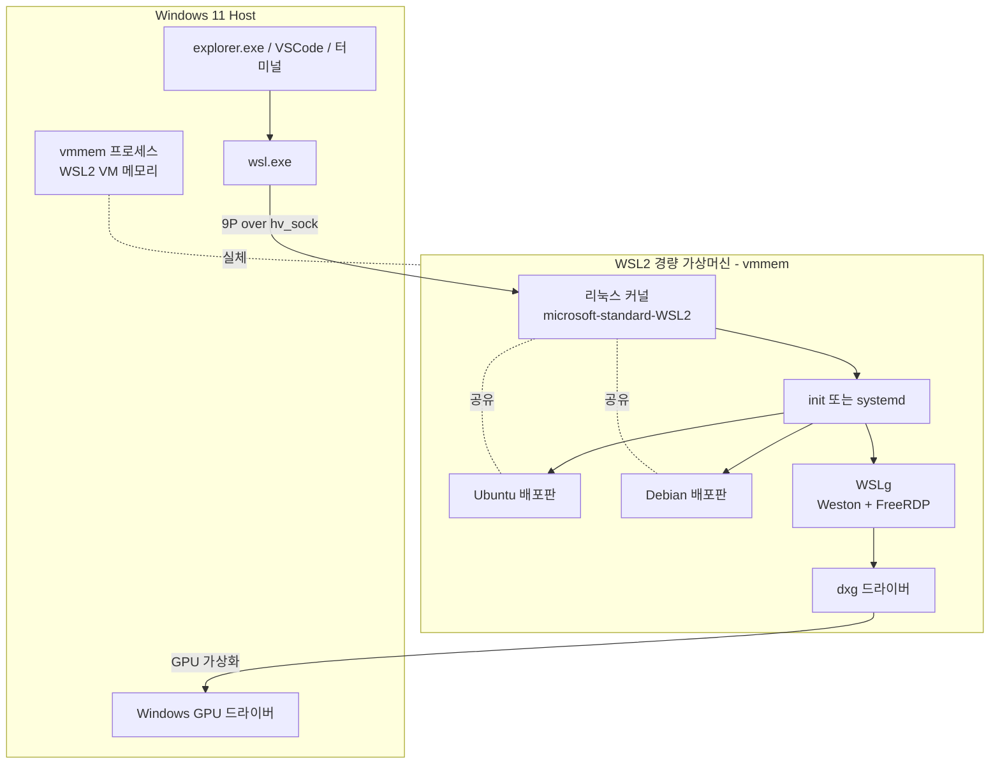

# WSL2 (Windows Subsystem for Linux)

## 개요

WSL은 Windows에서 리눅스 바이너리를 그대로 실행하기 위한 호환 계층이다. 1세대(WSL1)는 NT 커널 위에 리눅스 시스템 콜을 매핑하는 방식이라 ext4 파일시스템도, 진짜 리눅스 커널도 없었다. 그래서 ptrace, fanotify, eBPF 같은 기능이 빠져 있었고 Docker가 동작하지 않았다. WSL2부터는 경량 Hyper-V 가상머신 안에서 진짜 리눅스 커널이 돈다. 따라서 WSL2의 정체는 "최적화된 가상머신"에 가깝다.

이 문서는 WSL2를 기준으로 한다. 실무에서 Windows 워크스테이션을 개발 환경으로 쓸 때 가장 많이 부딪히는 항목들 — 파일시스템 성능, 네트워킹, 메모리 미반환, 디스크 비대화 — 를 실제 트러블슈팅 경험과 함께 정리했다.

## WSL2 아키텍처

### 경량 가상머신과 Hyper-V

WSL2는 윈도우의 가상화 플랫폼(Virtual Machine Platform) 기능과 Hyper-V의 일부를 사용한다. 정확히는 Hyper-V Manager에 노출되는 "전체" Hyper-V가 아니라 "Hyper-V 하이퍼바이저 플랫폼(HvPlatform)"이라는 부분 집합을 쓴다. 그래서 Windows 11 Home에서도 WSL2가 동작한다. 다만 VirtualBox나 VMware Workstation 같은 다른 하이퍼바이저와 충돌하던 시기가 길었다. VMware 16 이상, VirtualBox 6.1 이상에서는 Hyper-V Platform API를 사용해 같이 돌릴 수 있게 되었지만 성능은 네이티브보다 떨어진다.

WSL2 가상머신은 부팅 시 자동으로 켜지지 않고, `wsl.exe`로 첫 명령을 실행하거나 배포판 셸을 열 때 시작된다. 모든 WSL2 배포판은 단일 가상머신 안에 PID 1을 공유한다. 배포판마다 별도 VM이 뜨는 게 아니라 하나의 커널 위에서 chroot 비슷한 격리로 분리된다고 이해하면 맞다. 이 점 때문에 한 배포판에서 `sysctl`로 커널 파라미터를 바꾸면 다른 배포판에도 영향이 간다.

### WSL 커널

WSL2 커널은 마이크로소프트가 별도로 빌드해 배포한다. `uname -r`을 찍으면 `5.15.146.1-microsoft-standard-WSL2` 같은 식으로 나온다. 일반 우분투 커널과 달리 시스템콜 번역, Hyper-V 통합 서비스, 9P 클라이언트, hv_sock 같은 모듈이 사전에 들어가 있다. 커널 소스는 GitHub의 WSL2-Linux-Kernel 저장소에 공개되어 있고, 직접 빌드해 `.wslconfig`의 `kernel=` 옵션으로 지정해 쓸 수도 있다. eBPF가 필요한 작업(예: cilium, bcc-tools)을 할 때 기본 커널의 CONFIG 옵션이 부족하면 직접 빌드해야 한다.

### WSLg (GUI)

WSLg는 리눅스 GUI 앱을 윈도우에서 네이티브 창처럼 띄워주는 컴포넌트다. 내부적으로는 Weston(Wayland 컴포지터)과 FreeRDP 클라이언트, PulseAudio가 결합된 구조다. 사용자가 GUI 앱을 실행하면 Weston이 창을 그리고, RDP 프로토콜을 통해 윈도우의 RDP 클라이언트(mstsc 동일 라이브러리)가 그 창을 받아서 데스크톱에 띄운다. 그래서 WSLg는 별도 X 서버를 설치할 필요 없이 그냥 동작한다. 다만 `WAYLAND_DISPLAY`, `DISPLAY` 환경변수가 자동으로 잡히므로 X11 앱과 Wayland 앱 모두 가능하다.

GPU 가속이 필요한 GUI(전자, IDE 등)는 dxg(DirectX Graphics Kernel) 드라이버를 통해 윈도우 측 GPU에 접근한다. 이게 후술할 GPU 패스스루의 동일한 경로다.

### 전체 구조



배포판이 여러 개여도 가상머신과 커널은 하나라는 점, vmmem이라는 단일 윈도우 프로세스가 가상머신의 메모리를 점유한다는 점이 실무에서 자주 헷갈리는 부분이다.

## 설치와 배포판 관리

### 설치

Windows 10 21H1 이상, Windows 11에서는 한 줄로 끝난다.

```powershell
# 관리자 PowerShell
wsl --install
```

이 명령은 가상화 기능 활성화, WSL 컴포넌트 설치, 기본 우분투 배포판 다운로드까지 자동으로 한다. 재부팅 후 우분투 셸이 한 번 뜨고 사용자 계정 생성 프롬프트가 나온다. 회사 PC에서 BIOS의 가상화(Intel VT-x, AMD-V)가 꺼져 있으면 여기서 막힌다. 부팅 시 BIOS에 들어가 Virtualization Technology와 (있다면) IOMMU/VT-d를 켜야 한다.

### 배포판 목록과 설치

```powershell
# 설치 가능 배포판 조회
wsl --list --online

# 특정 배포판 설치
wsl --install -d Ubuntu-22.04

# 설치된 배포판과 상태
wsl --list --verbose
# NAME              STATE           VERSION
# * Ubuntu-22.04    Running         2
#   Debian          Stopped         2
```

별표는 기본 배포판이다. `wsl` 명령에 `-d` 옵션 없이 들어가면 기본 배포판으로 진입한다. 기본 배포판 변경은 `wsl --set-default Debian`.

### WSL1 → WSL2 변환

```powershell
wsl --set-version Ubuntu-22.04 2
```

이 명령은 WSL1의 ext4-on-NTFS 형식을 WSL2의 vhdx 가상 디스크로 변환한다. 데이터가 많으면 수십 분 걸린다. 그리고 새로 설치되는 배포판이 기본 WSL2가 되도록 다음을 한 번만 해두면 된다.

```powershell
wsl --set-default-version 2
```

### 백업과 복제 (export/import)

배포판 자체를 tar로 떠서 다른 PC로 옮기거나 같은 배포판을 여러 개로 복제할 수 있다. 실무에서는 깨끗한 우분투 한 벌을 떠 두고 프로젝트마다 별도 인스턴스로 import하는 패턴이 유용하다. 컨테이너처럼 환경을 격리할 수 있다.

```powershell
# 내보내기
wsl --export Ubuntu-22.04 D:\backup\ubuntu-clean.tar

# 다른 이름으로 가져오기
wsl --import Ubuntu-Project-A D:\wsl\project-a D:\backup\ubuntu-clean.tar --version 2

# 진입
wsl -d Ubuntu-Project-A
```

import 직후에는 root로 들어간다. 일반 사용자로 들어가려면 `/etc/wsl.conf`에 다음을 추가하고 `wsl --terminate Ubuntu-Project-A`로 재시작한다.

```ini
[user]
default=myname
```

### 제거와 셧다운

```powershell
# 특정 배포판만 종료
wsl --terminate Ubuntu-22.04

# WSL2 가상머신 자체 종료 (vmmem 메모리 회수)
wsl --shutdown

# 배포판 영구 삭제 (vhdx까지 제거)
wsl --unregister Ubuntu-Project-A
```

`--shutdown`은 메모리 회수가 안 될 때 가장 먼저 시도하는 명령이다.

## 파일시스템 통합과 성능

### vhdx와 9P 프로토콜

WSL2는 배포판마다 ext4 파일시스템이 들어간 가상 디스크 파일(`ext4.vhdx`)을 가진다. 위치는 보통 `%LOCALAPPDATA%\Packages\CanonicalGroupLimited.Ubuntu...\LocalState\` 아래다. 이 vhdx는 가상머신에서 블록 디바이스로 마운트되어 ext4로 읽힌다. 그래서 WSL2 안의 `~`(홈 디렉토리)는 진짜 ext4 위에 있다.

윈도우 쪽 드라이브는 가상머신 안에서 `/mnt/c`, `/mnt/d`로 보인다. 이 마운트는 9P(Plan 9 Filesystem) 프로토콜을 hv_sock 위에서 돌리는 방식이다. 즉 윈도우의 NTFS 파일을 9P 서버가 노출하고, 리눅스 쪽이 9P 클라이언트로 마운트한다. 반대로 윈도우에서 `\\wsl$\Ubuntu\home\me`로 접근할 때도 같은 9P가 반대 방향으로 돈다.

### 성능 차이

여기서 실무적으로 중요한 결론이 나온다. WSL2 안에서 작업할 파일은 반드시 리눅스 파일시스템(`~`, `/home`) 안에 두어야 한다. `/mnt/c` 안에서 `git status`, `npm install`, `pip install`을 돌리면 10배에서 100배까지 느려진다. 9P는 RPC 형태로 메타데이터를 주고받기 때문에 작은 파일이 많은 워크로드에서 특히 느리다. node_modules처럼 파일 수만 수만 개인 디렉토리를 9P 위에 두면 `npm ci`가 30분이 걸리는 일을 흔히 본다. 같은 작업을 `~/projects` 안에서 하면 30초로 끝난다.

반대 방향도 마찬가지다. VSCode를 윈도우에서 열고 `\\wsl$\Ubuntu\...`의 프로젝트를 작업하면 파일 인덱싱이 느려지고 핫 리로드가 깨진다. VSCode Remote-WSL 확장을 써서 VSCode 자체를 WSL 측에서 띄워야 한다(후술).

| 위치 | 실체 | 권장 용도 |
|------|------|----------|
| `~`, `/home`, `/opt` 등 | ext4 on vhdx | 소스 코드, node_modules, venv, Docker 볼륨 |
| `/mnt/c/Users/...` | 9P over NTFS | 윈도우와 공유해야 하는 파일만 (다운로드, 문서 등) |
| `\\wsl$\Distro\path` | 9P (반대 방향) | 윈도우 GUI 도구로 가끔 들여다볼 때만 |

### metadata 옵션과 파일 권한

`/mnt/c`는 NTFS 위에 9P를 얹은 거라 리눅스 권한 비트가 원래는 보존되지 않는다. 모든 파일이 0777로 보이는 게 기본이다. 그래서 SSH 키를 `/mnt/c` 아래에 두면 ssh가 권한이 너무 느슨하다며 거부한다. `metadata` 마운트 옵션을 켜면 NTFS의 확장 속성에 리눅스 uid/gid/모드를 저장해 권한을 보존할 수 있다.

`/etc/wsl.conf`에 다음을 추가한다.

```ini
[automount]
enabled=true
options="metadata,umask=22,fmask=11"
```

`wsl --shutdown` 후 다시 들어가면 `/mnt/c` 파일들이 chmod에 반응한다. 다만 metadata 옵션은 NTFS 확장 속성을 쓰는 거라 디스크를 윈도우 다른 사용자가 읽을 때 권한 정보가 무의미하고, 윈도우 측에서 권한이 바뀌면 동기화가 깨질 수 있다. 어쨌든 가능하면 작업 파일을 `/mnt/c` 밖으로 옮기는 게 정석이다.

## 네트워킹

### 기본 (NAT) 모드

WSL2의 네트워킹은 윈도우 11 22H2 이전까지 NAT 모드 한 종류였다. 가상머신에 가상 NIC이 붙고, 윈도우 호스트가 NAT 게이트웨이 역할을 한다. 결과적으로 다음과 같은 특성이 나온다.

- WSL2 가상머신은 매번 부팅마다 IP가 바뀐다. 보통 `172.x.x.x` 대역.
- 윈도우 → WSL2: `localhost`로 접근하면 자동 포워딩이 동작해서 잘 된다.
- WSL2 → 윈도우: `localhost`는 WSL2 자기 자신이라 안 된다. `/etc/resolv.conf`에 잡힌 호스트 IP나 `host.docker.internal`로 접근해야 한다.
- 회사 LAN의 다른 PC → WSL2: 직접 못 본다. 윈도우에서 `netsh interface portproxy`로 포트 포워딩을 만들어줘야 한다.

WSL2 IP가 매번 바뀌는 게 가장 자주 부딪히는 문제다. 부팅할 때마다 `ip addr show eth0`로 IP를 확인하거나, `cat /etc/resolv.conf`로 호스트 IP(WSL2 입장의 게이트웨이)를 확인해 hosts 파일에 박는 식으로 우회한다. 자동으로 포트포워딩을 만드는 PowerShell 스크립트를 부팅 작업으로 등록해두는 패턴도 흔하다.

```powershell
# 예: WSL2의 8080을 윈도우 0.0.0.0:8080으로 포워딩
$wslIp = (wsl hostname -I).Trim().Split(' ')[0]
netsh interface portproxy add v4tov4 listenaddress=0.0.0.0 listenport=8080 connectaddress=$wslIp connectport=8080
```

### localhostForwarding

`.wslconfig`의 `localhostForwarding=true`(기본값)는 윈도우에서 `localhost:포트`로 접근하면 자동으로 WSL2의 같은 포트로 연결해주는 기능이다. WSL2 안에서 `python -m http.server 8000`을 띄우고 윈도우 브라우저에서 `http://localhost:8000`로 들어가면 그냥 된다. 가끔 동작이 깨지는데, 거의 다 윈도우의 `Hyper-V Host Compute Service` 또는 `WSL` 서비스가 멈춰서 그렇다. `wsl --shutdown` 한 번이면 회복된다.

### Mirrored 모드 (Windows 11 22H2+)

윈도우 11 22H2부터 도입된 mirrored 모드는 NAT 대신 윈도우 호스트의 네트워크 인터페이스를 그대로 가상머신에 노출한다. WSL2가 호스트와 같은 네트워크에 있는 것처럼 보인다. 활성화는 `.wslconfig`에서 한다.

```ini
[wsl2]
networkingMode=mirrored
```

장점은 다음과 같다.

- WSL2와 윈도우가 IP를 공유한다. WSL2 안에서 `localhost:8080`으로 윈도우 서비스에 접근할 수 있다.
- 회사 VPN, mDNS, IPv6가 자연스럽게 동작한다. NAT 모드에서 VPN 연결 시 라우팅이 깨지던 문제가 사라진다.
- WSL2 IP 변동 문제가 없다. 호스트와 같은 IP를 쓴다.

다만 mirrored 모드는 도입 초기엔 버그가 많아서 필자는 한동안 NAT 모드로 돌렸다. 23H2 빌드 이후로는 충분히 안정적이다. mirrored 모드와 같이 쓸 만한 옵션이 몇 개 더 있다.

```ini
[wsl2]
networkingMode=mirrored
firewall=true
dnsTunneling=true
autoProxy=true
```

`dnsTunneling`은 WSL2의 DNS 질의를 윈도우의 DNS 클라이언트로 위임하는 기능이다. 회사 VPN 환경에서 split DNS가 동작하지 않던 문제(WSL2가 회사 내부 도메인을 못 풀던 문제)를 해결한다. `autoProxy`는 윈도우의 시스템 프록시를 WSL2가 자동으로 사용하게 한다.

## .wslconfig와 wsl.conf

설정 파일은 두 군데에 산다. 적용 범위와 위치가 다르므로 헷갈리지 말아야 한다.

| 파일 | 위치 | 적용 범위 |
|------|------|-----------|
| `.wslconfig` | `%USERPROFILE%\.wslconfig` (윈도우 측) | WSL2 가상머신 전체 (모든 배포판 공유) |
| `wsl.conf` | `/etc/wsl.conf` (각 배포판 안) | 해당 배포판만 |

`.wslconfig`는 가상머신 자원, 커널, 네트워킹 같은 VM 단의 설정이고, `wsl.conf`는 배포판 단의 init 동작, 마운트 옵션, 사용자 같은 OS 단의 설정이다.

### .wslconfig 예시

```ini
[wsl2]
memory=8GB
processors=4
swap=2GB
swapFile=D:\\wsl\\swap.vhdx
localhostForwarding=true
networkingMode=mirrored
firewall=true
dnsTunneling=true
autoProxy=true
nestedVirtualization=true

[experimental]
autoMemoryReclaim=gradual
sparseVhd=true
```

`memory`를 명시하지 않으면 기본값은 호스트 메모리의 50%까지(최대 8GB, 윈도우 11에서는 호스트 메모리 그대로) 자동 확장한다. 메모리 한도를 두지 않으면 vmmem이 호스트 메모리를 다 빨아먹고 윈도우 자체가 느려진다. 16GB 머신이라면 `memory=8GB` 정도로 잘라두는 게 안전하다.

`autoMemoryReclaim=gradual`은 후술할 메모리 미반환 문제를 완화한다. `sparseVhd=true`는 vhdx를 sparse로 만들어 디스크가 자동으로 줄어들게 한다(이전에는 한번 커진 vhdx가 안에서 파일을 지워도 안 줄었다).

`nestedVirtualization=true`는 WSL2 안에서 또 KVM이나 Docker-in-Docker 같은 중첩 가상화를 쓸 때 필요하다.

### wsl.conf 예시

```ini
[boot]
systemd=true
command="service ssh start"

[automount]
enabled=true
options="metadata,umask=22,fmask=11,uid=1000,gid=1000"
mountFsTab=true

[network]
generateHosts=true
generateResolvConf=true
hostname=devbox

[user]
default=me

[interop]
enabled=true
appendWindowsPath=false
```

`appendWindowsPath=false`는 윈도우의 PATH를 리눅스 PATH에 자동으로 추가하지 않게 한다. 기본은 true인데, 그러면 `node`, `python` 같은 명령이 윈도우 쪽 실행 파일과 충돌해서 이상하게 동작한다. 리눅스 개발 환경으로만 쓸 거면 false가 정신 건강에 좋다.

`generateResolvConf=true`(기본)이면 WSL이 부팅할 때마다 `/etc/resolv.conf`를 덮어쓴다. 사내 DNS를 직접 박아넣고 싶다면 false로 끄고 `chattr +i /etc/resolv.conf`로 잠가둔다. 다만 mirrored 모드에서 `dnsTunneling`을 쓰면 이 작업이 필요 없다.

## systemd 활성화

WSL2 초기에는 init이 `/init`(MS가 만든 자체 init)이라 systemd가 동작하지 않았다. 그래서 `systemctl`이 안 먹고, `service` 명령이나 직접 데몬을 띄우는 식으로 우회해야 했다. 2022년 가을부터 systemd 공식 지원이 들어왔다.

활성화는 `wsl.conf`에 한 줄.

```ini
[boot]
systemd=true
```

`wsl --shutdown` 후 다시 들어가면 `pidof systemd`가 PID 1을 가리킨다. 이제 docker, ssh, postgresql 같은 서비스를 `systemctl enable --now` 형태로 관리할 수 있다.

systemd가 켜지면 부팅이 약간 느려진다(2~3초). 그리고 `systemd-resolved`가 `/etc/resolv.conf`를 가져갈 수 있어서 위에서 본 DNS 동작이 또 한번 꼬인다. 회사 VPN에서 사내 도메인이 안 풀리면 systemd-resolved와 generateResolvConf의 상호작용을 의심해야 한다.

## Docker / Podman 연동

### Docker Desktop과 WSL2

Docker Desktop on Windows의 동작 모델은 두 가지다. 옛날 Hyper-V 백엔드, 그리고 현재 기본인 WSL2 백엔드. WSL2 백엔드는 사실 Docker Desktop이 자체 배포판(`docker-desktop`)을 WSL2에 등록하고 거기서 dockerd를 띄우는 방식이다. `wsl -l -v`를 찍으면 `docker-desktop` 배포판이 보인다.

사용자 배포판(우분투 등)에서 `docker` 명령을 쓸 수 있는 건 Docker Desktop이 통합 옵션으로 docker CLI를 사용자 배포판에 노출해주기 때문이다. Settings > Resources > WSL Integration에서 어느 배포판에 노출할지 고른다. 실제 docker 데몬은 사용자 배포판이 아니라 `docker-desktop` 안에서 돌고, CLI는 `/var/run/docker.sock`을 통해 9P 비슷한 통로로 그 데몬에 붙는다.

라이선스가 신경 쓰인다면(Docker Desktop은 일정 규모 이상 회사에서 유료다) 대안이 두 개다.

### Docker를 WSL2에 직접 설치

Docker Desktop 없이 그냥 우분투 안에 docker-ce를 설치해도 된다. systemd가 켜져 있으면 `systemctl start docker`로 데몬이 뜬다. systemd가 꺼져 있다면 `dockerd`를 직접 띄워야 한다. WSL이 깔끔하지 않은 부팅 모델이라 `~/.bashrc`에 `sudo service docker start`를 박아두는 식의 흔한 우회가 쓰인다.

```bash
curl -fsSL https://get.docker.com | sh
sudo usermod -aG docker $USER
# systemd 켜져 있으면
sudo systemctl enable --now docker
```

이렇게 직접 설치한 docker는 윈도우 쪽에서 `docker` CLI로 바로 못 쓴다. 윈도우 측에서 쓰려면 별도로 docker CLI를 깔고 `DOCKER_HOST=tcp://...` 또는 npiperelay/socat으로 소켓을 노출해야 한다.

### Podman

Podman은 데몬리스라 systemd 없이도 잘 돌고 라이선스 이슈가 없다. `apt install podman` 한 줄로 끝나고 `docker` alias만 만들어두면 거의 호환된다. rootless 모드를 쓰면 사용자 namespace에서 컨테이너가 뜬다. 단점은 docker-compose 호환이 podman-compose나 quadlet으로 가야 해서 기존 docker-compose.yml이 가끔 엇나간다.

## GPU / CUDA 패스스루

WSL2는 윈도우의 GPU를 가상화해서 리눅스 측에 노출한다. NVIDIA 카드라면 윈도우 측에 NVIDIA 그래픽 드라이버(CUDA on WSL을 지원하는 버전)만 깔면 끝이다. 리눅스 측에 NVIDIA 드라이버를 따로 설치하면 안 된다. CUDA 툴킷(`cuda-toolkit-12-x` 같은 메타패키지)만 우분투에 설치하고, 드라이버 자체는 건드리지 않는다.

확인은 다음과 같이 한다.

```bash
nvidia-smi
# +-----------------------------------------------------------------------------+
# | NVIDIA-SMI 535.xxx     Driver Version: 535.xxx       CUDA Version: 12.x    |
# +-----------------------------------------------------------------------------+
```

`nvidia-smi`가 윈도우 측 드라이버 버전을 보여준다는 점이 진짜 리눅스와 다른 부분이다. 리눅스 커널 모듈(`nvidia.ko`)이 아니라 `dxgkrnl`이 GPU 인터페이스를 잡고 있다. PyTorch, TensorFlow 같은 프레임워크는 cuDNN을 통해 dxgkrnl 위의 CUDA를 그대로 쓴다. 다만 일부 저수준 도구(`nvidia-bug-report.sh`, NCCL의 일부 기능)는 동작하지 않는다. 멀티 GPU 트레이닝을 본격적으로 할 거면 WSL2가 아니라 네이티브 리눅스를 권한다.

Docker 컨테이너에서 GPU를 쓰려면 nvidia-container-toolkit을 설치하고 `--gpus all` 플래그를 준다. WSL2 환경에서도 똑같이 동작한다.

## VSCode Remote-WSL

VSCode + WSL은 윈도우 개발 환경의 거의 정답이다. 핵심은 "VSCode UI는 윈도우, 작업 본체는 WSL"이다. Remote-WSL 확장이 깔리면 WSL 셸 안에서 `code .`을 치는 순간 다음이 일어난다.

1. WSL 안에 VSCode Server(`~/.vscode-server`)가 자동 설치된다.
2. 윈도우의 VSCode UI가 WSL Server에 hv_sock 기반 터널로 붙는다.
3. 익스텐션은 "UI 측"과 "워크스페이스 측"으로 갈려서, 워크스페이스 익스텐션(언어 서버, ESLint, Pylance 등)은 WSL 안에서 돈다.

이 구조 덕분에 파일시스템 접근, 빌드, 디버깅이 전부 리눅스에서 돈다. `\\wsl$\` 경유로 윈도우에서 직접 파일을 여는 것과 비교하면 체감 속도가 압도적으로 다르다. 단축은 `code .`을 WSL 안에서 실행하거나, 윈도우 VSCode 좌하단의 원격 표시기에서 "Reopen in WSL"을 누른다.

자주 깨지는 부분은 VSCode Server가 업데이트 중 손상되는 경우다. 증상은 "Could not establish connection". 해결은 보통 `~/.vscode-server`를 통째로 지우고 재연결하면 된다.

```bash
rm -rf ~/.vscode-server ~/.vscode-server-insiders
```

## 자주 겪는 트러블슈팅

### 메모리 미반환 (vmmem이 8GB를 잡고 안 놔준다)

가장 자주 나오는 이슈다. 컨테이너 빌드, 대용량 빌드, 머신러닝 학습 같은 작업으로 vmmem 메모리가 한번 부풀어 오르면 작업이 끝나도 메모리가 잘 안 줄어든다. 리눅스 측에서는 page cache로 잡고 있는 메모리인데, 윈도우 호스트 입장에서는 그게 vmmem 프로세스의 working set이라 회수가 안 되는 것처럼 보인다.

대응은 세 단계다.

1. `.wslconfig`에서 `memory=` 제한을 둔다. 그러면 위로 올라가는 천장이 생긴다.
2. `[experimental] autoMemoryReclaim=gradual` 또는 `dropcache`를 켠다. WSL2가 주기적으로 page cache를 비워서 호스트로 메모리를 돌려준다.
3. 그래도 안 되면 `wsl --shutdown`으로 가상머신을 통째로 내린다. 가장 확실한 방법.

리눅스 안에서 `echo 3 > /proc/sys/vm/drop_caches`를 직접 때려도 vmmem의 외부 메모리는 잘 안 줄어드는 경우가 있다. WSL2 메모리 회수의 동작 방식이 일반 KVM과 좀 다르다.

### DNS 해석 실패

회사 VPN을 켜면 WSL2 안에서 `apt update`가 막히거나 사내 도메인이 안 풀린다. 원인은 거의 다음 셋 중 하나다.

- VPN이 윈도우의 라우팅 테이블을 바꾸면서 WSL2 가상 NIC의 라우팅이 깨졌다 → `wsl --shutdown` 후 VPN 연결한 상태로 다시 진입한다.
- `/etc/resolv.conf`가 WSL이 자동 생성한 윈도우 호스트 DNS를 가리키는데 그게 사내 DNS가 아니다 → `wsl.conf`에서 `generateResolvConf=false` 후 사내 DNS를 직접 박는다.
- `systemd-resolved`가 끼어들어서 split DNS가 깨졌다 → mirrored 모드 + `dnsTunneling=true`로 바꾼다.

mirrored 모드 + dnsTunneling은 위 세 케이스를 거의 다 자동으로 처리해주기 때문에 22H2 이후라면 그냥 켜는 걸 권한다.

### 파일 권한이 0777로만 보인다

`/mnt/c` 아래에서 `ls -la`를 찍으면 모든 파일이 `-rwxrwxrwx`로 보이는 현상. `metadata` 마운트 옵션이 꺼져 있어서다. 위 `wsl.conf` 예시처럼 `options="metadata,..."`를 넣고 `wsl --shutdown` 후 재진입한다. 다만 이미 강조했듯이 작업 파일은 `/mnt/c`가 아니라 `~` 아래에 두는 게 정석이다.

### 시계 드리프트

이전에는 노트북을 절전했다 깨우면 WSL2 시계가 윈도우와 어긋나서 `git pull`이 "clock skew detected"를 띄우거나 JWT 검증이 실패하는 일이 잦았다. 최신 WSL은 호스트 시계와 자동 동기화가 들어가 거의 사라졌지만 가끔 발생한다. 임시 해결은 `sudo hwclock -s` 또는 `sudo ntpdate pool.ntp.org`. 영구 해결은 `chrony` 설치.

```bash
sudo apt install chrony
sudo systemctl enable --now chrony
```

systemd가 활성화되어 있어야 한다.

### vhdx 비대화 / compact

WSL2 vhdx는 한 번 커지면 안에서 파일을 지워도 자동으로 줄지 않았다. 100GB까지 부풀어 오른 vhdx를 정리하려면 수동으로 compact를 돌려야 했다. Windows 11 22H2 이후 `sparseVhd=true`를 켜면 sparse 디스크가 되어 자동으로 줄지만, 이미 비대화된 기존 vhdx는 한 번은 수동으로 줄여야 한다.

```powershell
# 1. 해당 배포판 종료
wsl --shutdown

# 2. diskpart로 compact (관리자 PowerShell)
diskpart
DISKPART> select vdisk file="C:\Users\me\AppData\Local\Packages\CanonicalGroupLimited.Ubuntu...\LocalState\ext4.vhdx"
DISKPART> attach vdisk readonly
DISKPART> compact vdisk
DISKPART> detach vdisk
DISKPART> exit
```

또는 `Optimize-VHD` cmdlet(Hyper-V 모듈 필요).

```powershell
Optimize-VHD -Path "C:\...\ext4.vhdx" -Mode Full
```

리눅스 안에서 미리 빈 공간을 0으로 채워두면 compact 효율이 올라간다.

```bash
sudo fstrim -av
# 또는
sudo dd if=/dev/zero of=/zero.fill bs=1M; sudo rm /zero.fill
```

신규 환경이라면 처음부터 `.wslconfig`에 다음을 넣어 두는 게 좋다.

```ini
[experimental]
sparseVhd=true
```

이미 만들어진 배포판은 이 옵션이 자동 적용되지 않는다. `wsl --manage <Distro> --set-sparse true`로 켜야 한다.

```powershell
wsl --manage Ubuntu-22.04 --set-sparse true
```

## 마치며

WSL2는 가상머신이라는 점, vmmem이라는 단일 프로세스가 모든 배포판의 메모리를 잡고 있다는 점, 파일시스템 경계(/mnt/c vs ~)가 성능에 결정적이라는 점, 이 세 가지만 머리에 박혀 있어도 대부분의 트러블슈팅이 풀린다. 윈도우 11 22H2 이후의 mirrored 네트워킹과 sparse vhdx, autoMemoryReclaim은 그동안 WSL2의 골치 아픈 부분을 거의 잡아주는 변경이라 가능하면 최신 빌드를 따라가는 게 낫다.
