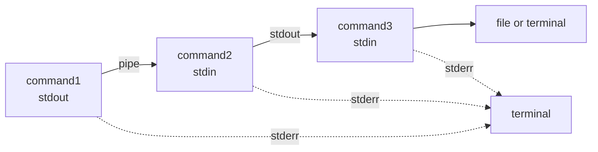

# 파이프 및 리다이렉션

## 개요

리눅스에서 파이프와 리다이렉션은 모든 셸 작업의 근간이다. 명령어 하나가 작업의 일부만 처리하고 출력을 다음 명령어로 넘기는 방식으로 동작하는데, 실무에서 로그 처리, 백업 스크립트, 배포 파이프라인 어디서든 마주친다. 그런데 단순히 `|`와 `>`만 알고 있다가 실무에서 막히는 경우가 많다. 예를 들어 `2>&1`을 어디에 두느냐에 따라 결과가 달라지고, `set -o pipefail`을 빼먹어서 실패한 백업이 성공으로 기록되는 사고가 흔하다.

## 파일 디스크립터의 본질

리눅스의 모든 프로세스는 시작할 때 세 개의 파일 디스크립터(FD)를 가진다.

- 0: stdin (표준 입력)
- 1: stdout (표준 출력)
- 2: stderr (표준 에러)

`/proc/<pid>/fd/` 디렉토리를 보면 실제로 어떤 파일을 가리키고 있는지 확인할 수 있다. 셸에서 명령어를 실행하면 부모 셸의 FD를 그대로 상속받는다. 리다이렉션은 이 FD가 가리키는 대상을 바꾸는 작업이다. 즉, `command > file.txt`는 FD 1번을 `file.txt`로 교체한 뒤 명령어를 실행한다는 뜻이다.

```bash
# 현재 셸의 FD 확인
ls -la /proc/$$/fd/
# 0 -> /dev/pts/0
# 1 -> /dev/pts/0
# 2 -> /dev/pts/0
```

이 개념을 이해하지 못하면 `2>&1`이 왜 순서가 중요한지 헷갈린다. `2>&1`은 "FD 2번을 현재 FD 1번이 가리키는 곳과 같은 곳으로 복사"한다는 의미다. 따라서 FD 1번이 어디를 가리키는지에 따라 결과가 달라진다.

## 리다이렉션 순서 문제

가장 자주 실수하는 부분이다.

```bash
# 올바른 순서: stdout과 stderr 모두 file.txt로
command > file.txt 2>&1

# 잘못된 순서: stderr는 터미널, stdout만 file.txt로
command 2>&1 > file.txt
```

두 번째 줄을 풀어서 보면 이렇다. 셸은 왼쪽에서 오른쪽으로 처리한다.

1. `2>&1`: FD 2번을 현재 FD 1번(터미널)과 같은 곳으로 복사. 결과적으로 FD 2번도 터미널을 가리킴.
2. `> file.txt`: FD 1번만 file.txt로 변경. FD 2번은 여전히 터미널을 가리킴.

따라서 stderr는 터미널에 그대로 출력된다. 디버깅할 때 "에러는 분명히 발생했는데 로그 파일에 안 쌓이는" 상황의 거의 대부분이 이 순서 실수다.

### `&>` vs `> file 2>&1`

bash 4 이후로는 `&>` 단축 표기가 있다.

```bash
command &> file.txt        # bash 전용, stdout+stderr 둘 다 file.txt로
command > file.txt 2>&1    # POSIX 호환, 어느 셸에서도 동작
```

스크립트가 `/bin/sh`로 실행될 가능성이 있거나 dash, ash 환경(예: 알파인 컨테이너의 기본 셸)에서 돌아갈 수 있다면 `&>`는 쓰지 않는 게 안전하다. 컨테이너 빌드 스크립트에서 `&>`를 썼다가 알파인에서 syntax error로 깨진 경험이 있다.

## /dev/null, /dev/zero, /dev/random

특수 디바이스 파일은 파이프와 리다이렉션에서 자주 등장한다.

`/dev/null`은 블랙홀이다. 쓰면 사라지고, 읽으면 즉시 EOF다. 출력이 필요 없는 명령어의 출력을 버릴 때 쓴다. cron 스크립트에서 stdout과 stderr를 다 버리면 안 되지만(에러를 알 길이 없으므로), 정상 동작 시 너무 시끄러운 명령어의 stdout 정도는 버린다.

```bash
# 명령어 출력 버리기
command > /dev/null 2>&1

# 파일을 비우기 (truncate)
> /dev/null > /var/log/myapp.log
# 또는 cat /dev/null > file.log

# 명령어가 존재하는지만 확인
command -v jq > /dev/null && echo "installed"
```

`/dev/zero`는 읽으면 무한히 0바이트(NUL 문자)를 내놓는다. 디스크 채우기 테스트, 더미 파일 생성, 메모리 영역 초기화에 쓴다.

```bash
# 1GB 더미 파일
dd if=/dev/zero of=test.img bs=1M count=1024

# 스왑 파일 생성
dd if=/dev/zero of=/swapfile bs=1M count=2048
mkswap /swapfile
swapon /swapfile
```

`/dev/random`과 `/dev/urandom`은 난수를 내놓는다. 차이는 엔트로피 풀이 부족할 때 동작이다. `/dev/random`은 엔트로피가 모일 때까지 블록되고, `/dev/urandom`은 의사 난수로 계속 내놓는다. 실무에서는 거의 `/dev/urandom`을 쓴다. 컨테이너 환경에서 `/dev/random`을 쓰다가 부팅 직후 엔트로피 부족으로 멈춰버리는 사고가 있었다.

```bash
# 32바이트 랜덤 키 (base64 인코딩)
head -c 32 /dev/urandom | base64

# 디스크 와이프 (랜덤 데이터로 덮어쓰기)
dd if=/dev/urandom of=/dev/sdX bs=1M
```

## 파이프의 동작 원리

`command1 | command2`를 실행하면 셸은 다음 작업을 한다.

1. `pipe()` 시스템 콜로 한 쌍의 FD를 만든다 (읽기용, 쓰기용).
2. fork로 두 프로세스를 만든다.
3. command1은 stdout(FD 1)을 파이프의 쓰기 끝으로 복사.
4. command2는 stdin(FD 0)을 파이프의 읽기 끝으로 복사.
5. 두 프로세스가 동시에 실행된다.

여기서 두 가지가 중요하다. 첫째, 파이프는 **stdout만** 전달한다. stderr는 그대로 터미널로 나간다. 둘째, 두 명령어는 **병렬로** 실행된다. command1이 끝난 다음 command2가 시작하는 게 아니다. 파이프 버퍼(보통 64KB)가 차면 command1이 잠시 멈추고, command2가 읽어가면 다시 진행하는 식이다.

```bash
# stderr는 파이프로 전달 안 됨 → grep이 받지 못함
command_with_error 2>&1 | grep "error"

# stderr만 파이프로 전달하고 stdout은 무시
command 2>&1 1>/dev/null | grep "error"
```

두 번째 패턴은 살짝 까다롭다. `2>&1 1>/dev/null`을 순서대로 보면, FD 2를 현재 FD 1(터미널)으로 복사 → FD 1을 /dev/null로 변경. 결과적으로 stdout은 /dev/null로, stderr는 터미널 → 파이프로 흐른다. 컴파일 경고만 grep으로 잡고 싶을 때 쓴다.

## PIPESTATUS와 pipefail

파이프라인의 종료 코드는 기본적으로 마지막 명령어의 종료 코드다. 여기서 무수한 운영 사고가 발생한다.

```bash
# 백업이 실패해도 grep이 성공하면 0 반환
tar czf - /important-data | ssh remote "cat > backup.tar.gz"
echo $?  # tar가 실패해도 0이 나올 수 있음
```

ssh가 정상적으로 종료되면 셸은 "성공했다"고 판단한다. 그런데 정작 tar는 권한 문제로 빈 파일을 만들었을 수 있다. 백업 스크립트가 cron에서 매일 돌고 있는데 한 달 동안 빈 파일을 백업해온 사례가 실제로 있다.

해결책은 두 가지다.

### `set -o pipefail`

파이프라인 중 하나라도 실패하면 전체를 실패로 처리한다. 마지막으로 실패한 명령어의 종료 코드를 반환한다.

```bash
set -o pipefail
tar czf - /important-data | ssh remote "cat > backup.tar.gz"
if [ $? -ne 0 ]; then
    echo "백업 실패"
    exit 1
fi
```

스크립트 상단에 `set -euo pipefail`을 거의 관용적으로 쓴다. `-e`는 명령어 실패 시 종료, `-u`는 미정의 변수 사용 시 에러, `-o pipefail`은 파이프 실패 감지.

### PIPESTATUS 배열

bash는 파이프의 각 명령어 종료 코드를 `PIPESTATUS` 배열에 저장한다. 어느 단계가 실패했는지 정확히 알아야 할 때 쓴다.

```bash
command1 | command2 | command3
echo "${PIPESTATUS[@]}"   # 예: 0 1 0 → command2가 실패

# 각 단계 검증
if [ "${PIPESTATUS[0]}" -ne 0 ]; then
    echo "command1 실패"
fi
```

주의할 점은 `PIPESTATUS`는 파이프라인 직후에만 유효하다는 것이다. 한 번 다른 명령어를 실행하면 덮어쓰여진다. 그래서 보통 변수에 즉시 복사한다.

```bash
command1 | command2 | command3
status=("${PIPESTATUS[@]}")
# 이후 status 배열로 검증
```

## 프로세스 치환

`<(...)`와 `>(...)`는 명령어의 출력/입력을 임시 파일처럼 다룰 수 있게 해준다. 내부적으로는 `/dev/fd/63` 같은 가상 파일 디스크립터를 만든다.

가장 흔한 패턴은 두 명령어 출력 비교다.

```bash
# 두 디렉토리의 파일 목록 비교
diff <(ls /etc/old) <(ls /etc/new)

# 두 데이터베이스의 테이블 목록 비교
diff <(mysql -e "SHOW TABLES" db1) <(mysql -e "SHOW TABLES" db2)

# 정렬해서 공통/차이 추출
comm -12 <(sort file1) <(sort file2)   # 공통 라인
comm -23 <(sort file1) <(sort file2)   # file1에만 있는 라인
```

`>(...)`는 반대 방향이다. 명령어의 출력을 여러 곳에 동시에 보낼 때 쓴다.

```bash
# stdout을 파일과 명령어에 동시에 전달
command | tee >(grep ERROR > errors.log) >(grep WARN > warns.log) > all.log

# 압축과 체크섬을 동시에
tar cf - /data | tee >(sha256sum > backup.sha256) | gzip > backup.tar.gz
```

마지막 패턴은 백업할 때 자주 쓴다. 압축본 만들면서 동시에 무결성 체크용 해시를 계산한다. 압축 후에 다시 sha256을 돌리는 것보다 디스크 I/O가 절반이다.

프로세스 치환의 함정 하나. 파이프라인 안에 있을 때 종료 코드가 안 잡힌다.

```bash
# 이런 식으로 쓰면 some_command가 실패해도 알 수 없음
diff <(some_command) <(other_command)
```

이때는 임시 파일을 쓰거나 명시적으로 종료 코드를 체크해야 한다.

## tee의 실전 활용

`tee`는 단순히 "화면과 파일에 동시 출력"이 아니다. 표준 입력을 받아서 여러 출력 대상에 분기하는 도구다.

```bash
# 기본: 파일 + stdout
command | tee output.log

# 추가 모드 (덮어쓰기 안 함)
command | tee -a output.log

# 여러 파일에 동시 출력
command | tee file1.log file2.log

# sudo가 필요한 파일에 쓰기 (가장 흔한 용도)
echo "127.0.0.1 myserver" | sudo tee -a /etc/hosts
```

마지막 패턴이 중요하다. `sudo echo "..." >> /etc/hosts`는 동작하지 않는다. 리다이렉션은 셸이 처리하는데, 셸은 root가 아니라 현재 사용자다. 그래서 `>>`로 파일 열기 권한이 없어서 실패한다. `tee`는 sudo로 실행되니까 권한이 있다.

`tee`로 파이프라인 중간에 로그를 떨어뜨리는 패턴도 자주 쓴다. 디버깅용이다.

```bash
# 각 단계의 출력을 파일로 저장하면서 다음 단계로 전달
generate_data | tee step1.log | transform | tee step2.log | upload
```

## 명명 파이프 (FIFO)

`|`는 익명 파이프다. 명령어가 끝나면 사라진다. 명명 파이프(named pipe, FIFO)는 파일 시스템에 실체를 가지는 파이프다. `mkfifo`로 만든다.

```bash
mkfifo /tmp/mypipe
ls -la /tmp/mypipe
# prw-r--r-- ...   ← p가 FIFO 표시
```

다른 프로세스끼리 파이프로 통신할 때 쓴다. 익명 파이프는 부모-자식 관계여야 하는데, FIFO는 무관한 프로세스끼리도 가능하다.

```bash
# 터미널 A
mkfifo /tmp/mypipe
cat < /tmp/mypipe   # 읽기 대기

# 터미널 B
echo "Hello" > /tmp/mypipe
# 터미널 A에 "Hello"가 출력됨
```

실무 활용 예시 하나. 큰 파일을 압축하면서 동시에 다른 처리를 해야 할 때.

```bash
mkfifo /tmp/raw
mkfifo /tmp/compressed

# 백그라운드로 압축
gzip < /tmp/raw > /tmp/compressed &

# 동시에 데이터 생성
mysqldump --all-databases > /tmp/raw

# /tmp/compressed에서 읽어가는 다른 프로세스
```

FIFO는 한쪽이 열리면 다른 쪽이 열릴 때까지 블록된다. 이 특성을 이용한 프로세스 동기화에도 쓴다. 다만 디스크에 파일이 남아있어서 사용 후 삭제 처리를 해야 하는데, `trap "rm -f /tmp/mypipe" EXIT` 같은 패턴을 쓴다.

## here-document와 here-string

여러 줄 입력을 명령어에 전달할 때 쓴다. `<<` 뒤에 종료 마커를 지정한다.

```bash
mysql -u root << EOF
USE mydb;
SELECT * FROM users WHERE active = 1;
EOF
```

종료 마커를 따옴표로 감싸면 변수 치환을 하지 않는다.

```bash
# 변수 치환 됨
cat << EOF
User: $USER
Date: $(date)
EOF

# 변수 치환 안 됨 - 셸 스크립트 코드를 그대로 출력할 때
cat << 'EOF' > script.sh
#!/bin/bash
echo "Path: $PATH"
EOF
```

스크립트 안에서 다른 스크립트를 생성할 때 이 차이를 모르면 변수가 의도치 않게 치환된다. 설정 파일이나 코드 템플릿을 생성할 때는 따옴표를 거의 항상 쓴다.

`<<-`는 들여쓰기 처리용이다. 라인 시작의 탭을 제거한다. 스페이스는 제거하지 않으니 주의.

```bash
if [ condition ]; then
    cat <<- EOF
	    Line 1
	    Line 2
	EOF
fi
```

here-string `<<<`는 한 줄 문자열을 stdin으로 전달한다.

```bash
# 변수를 명령어 입력으로
grep "pattern" <<< "$variable"

# 간단한 계산
bc <<< "5 * 3"

# JSON 한 줄 파싱
jq '.name' <<< '{"name":"alice","age":30}'
```

here-string은 임시 파일이나 echo 파이프 대신 쓴다. `echo "$var" | grep ...`보다 `grep ... <<< "$var"`가 서브셸을 안 거쳐서 빠르다.

## exec를 통한 리다이렉션

`exec`로 리다이렉션을 하면 현재 셸 자체의 FD를 영구적으로 바꾼다. 이후 모든 명령어가 그 영향을 받는다.

```bash
# 스크립트 시작부에서 모든 출력을 로그 파일로
exec > /var/log/myscript.log 2>&1
echo "이 줄은 로그 파일로 간다"
date
ls -la /tmp
```

이 패턴은 cron 스크립트에서 자주 쓴다. 매번 명령어마다 `>> log` 붙이지 않아도 자동으로 로그가 쌓인다.

특정 FD를 파일에 연결해서 활용할 수도 있다.

```bash
# FD 3에 로그 파일 연결
exec 3> /tmp/debug.log

# 일반 명령어는 터미널로, 디버그 메시지만 FD 3로
echo "사용자에게 보이는 메시지"
echo "디버그 메시지" >&3

# 사용 끝나면 닫기
exec 3>&-
```

스크립트에서 일반 출력과 진단 출력을 분리하고 싶을 때 유용하다. 마치 별도의 로거를 만든 것처럼 동작한다.

읽기용도 가능하다.

```bash
# FD 4로 파일 열고 한 줄씩 읽기
exec 4< input.txt
read -u 4 line1
read -u 4 line2
exec 4<&-
```

stdin을 이미 다른 용도로 쓰고 있을 때 추가 입력 소스가 필요하면 이렇게 한다.

## 버퍼링 문제와 stdbuf

파이프로 명령어를 연결했을 때 출력이 즉시 안 나오고 한참 모였다가 나오는 경우가 있다. 이게 버퍼링 문제다.

C 표준 라이브러리는 stdout이 터미널에 연결되면 line buffered (한 줄씩 flush), 파일이나 파이프에 연결되면 fully buffered (보통 4KB 모아서 flush)로 자동 전환한다. 실시간 처리가 필요한 파이프라인에서 문제가 된다.

```bash
# tail로 로그 보면서 실시간 grep - 안 보일 수 있음
tail -f app.log | grep ERROR

# 나오긴 나오는데 4KB 모일 때까지 안 보임
some_long_running | grep "pattern"
```

`stdbuf`로 강제로 버퍼링 모드를 바꾼다.

```bash
# stdout을 line buffered로 강제
stdbuf -oL tail -f app.log | grep ERROR

# 모든 버퍼 비활성화 (unbuffered)
stdbuf -i0 -o0 -e0 command | other_command

# grep도 line buffered 옵션이 있음
tail -f app.log | grep --line-buffered ERROR
```

명령어 자체가 `--line-buffered` 같은 옵션을 가진 경우(grep, sed, awk 일부 버전)는 그쪽이 깔끔하다. 옵션이 없는 명령어는 `stdbuf`를 앞에 붙인다. 다만 `stdbuf`는 LD_PRELOAD 트릭이라 정적 링크된 바이너리에는 안 먹는다.

`expect` 패키지의 `unbuffer`도 비슷한 역할을 한다. 가짜 PTY를 붙여서 명령어가 자기를 터미널이라고 착각하게 만든다. 컬러 출력을 파이프로 흘려보내고 싶을 때(`ls --color=auto`처럼 터미널일 때만 컬러를 켜는 명령어) 쓴다.

```bash
unbuffer ls --color=auto | less -R
```

## 실무에서 자주 마주치는 패턴

### 로그 분석

```bash
# IP별 접속 횟수 상위 10개
awk '{print $1}' access.log | sort | uniq -c | sort -rn | head -10

# 시간대별 에러 빈도
grep ERROR app.log | awk '{print $1, $2}' | cut -c1-13 | uniq -c

# 특정 패턴 카운트 (NUL 안전)
grep -c "pattern" file.log
```

### 디스크 사용량 추적

```bash
# 큰 디렉토리 상위 20개
du -h --max-depth=1 /var | sort -h | tail -20

# 100MB 이상 파일 찾기
find /var -type f -size +100M -exec ls -lh {} \; | awk '{print $5, $9}'
```

### 에러만 따로 저장하면서 정상 동작 유지

```bash
# stdout은 그대로, stderr만 파일로
command 2> errors.log

# 정상 출력은 파이프로, 에러는 파일로 분리
command 2> errors.log | process_output

# stderr를 파일에도 쓰면서 동시에 파이프로 흘리기
command 2> >(tee errors.log >&2) | process_output
```

마지막 패턴은 자주 쓰진 않지만 한번 알아두면 유용하다. 프로세스 치환으로 stderr를 tee에 보내고, tee가 errors.log와 stderr 자체에 쓴다. 결과적으로 에러는 화면에도 보이고 파일에도 저장된다.

### 원격 백업

```bash
# 로컬 → 원격
tar czf - /data | ssh user@remote "cat > /backup/data.tar.gz"

# 원격 → 로컬
ssh user@remote "tar czf - /data" > local-data.tar.gz

# 원격 → 원격 (중간 경유 없이)
ssh user@src "tar czf - /data" | ssh user@dst "tar xzf - -C /restore"
```

이런 패턴이 동작하는 이유는 ssh의 stdin/stdout이 그대로 파이프와 연결되기 때문이다. 중간에 임시 파일을 만들지 않고 바로 흐른다. 다만 `set -o pipefail` 없이 쓰면 한쪽이 죽었을 때 알 수가 없으니 항상 같이 쓴다.

## 명령어 그룹화

여러 명령어의 출력을 한꺼번에 리다이렉션할 때 쓴다.

```bash
# 중괄호: 현재 셸에서 실행
{ echo "header"; date; ls; echo "footer"; } > report.txt

# 괄호: 서브셸에서 실행
( cd /tmp && ls -la ) > tmp-listing.txt
```

차이는 변수 스코프다. 중괄호는 현재 셸이라 변수 변경이 유지되고, 괄호는 서브셸이라 변경이 사라진다. 디렉토리 이동을 일시적으로만 하고 싶을 때 괄호를 쓴다.

```bash
# 괄호 안의 cd는 외부에 영향 없음
pwd                            # /home/user
( cd /tmp && pwd )             # /tmp
pwd                            # /home/user (그대로)
```

배포 스크립트에서 작업 디렉토리를 임시로 바꿀 때 자주 쓴다.

## 주의사항

### noclobber와 강제 덮어쓰기

`set -o noclobber`를 켜면 `>`로 기존 파일을 덮어쓰지 못한다. 실수 방지용이다.

```bash
set -o noclobber
echo "test" > existing_file.txt   # 에러
echo "test" >| existing_file.txt  # 강제 덮어쓰기
```

대화형 셸의 `.bashrc`에 켜두면 `>` 실수로 중요한 파일을 날리는 사고를 방지할 수 있다. 다만 스크립트에서는 명시적으로 덮어쓰는 경우가 많아서 보통 끄고 쓴다.

### 파일 디스크립터 누수

`exec 3> file`로 열어놓고 닫지 않으면 그 셸 세션이 끝날 때까지 파일이 열려있다. 로그 파일 같은 경우 디스크 공간을 차지하지 않더라도 inode 점유, 다른 프로세스의 rotate 방해 등의 문제가 생긴다. 스크립트 끝에 `exec 3>&-`로 닫거나 `trap`을 걸어두자.

### 파이프 버퍼 크기

리눅스 파이프 버퍼는 보통 64KB(`/proc/sys/fs/pipe-max-size`로 확인). 한쪽이 빠르게 쓰고 다른 쪽이 느리게 읽으면 버퍼가 차서 쓰는 쪽이 블록된다. 대용량 데이터 파이프라인에서 한 단계가 병목이 되면 전체 파이프가 그 속도로 떨어진다. 병목 단계를 분석하려면 `pv`(pipe viewer)를 중간에 끼워서 처리량을 모니터링한다.

```bash
generate_data | pv | process_data > output
# pv가 처리 속도와 누적량을 실시간 표시
```

## Mermaid: 파이프라인 데이터 흐름



위 그림처럼 stderr는 파이프와 무관하게 터미널로 흘러나간다. 파이프 체인이 길어질수록 어떤 명령어에서 에러가 났는지 알기 어려워지므로 `2>` 또는 `2>&1`로 명시적으로 처리해야 한다.
