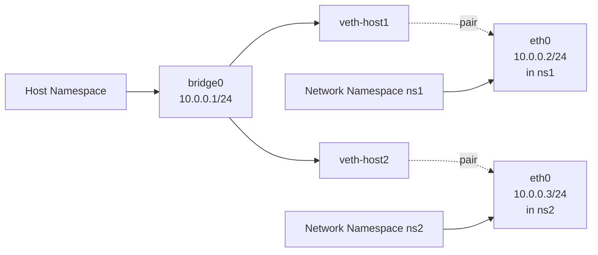

# Linux 네트워크 관리 심화

## 개요

운영 환경에서 네트워크 문제는 거의 매주 한 번씩은 마주친다. 패킷이 사라지고, TIME_WAIT가 폭증하고, conntrack 테이블이 가득 차서 새 연결이 거부되는 일이 반복된다. 기본 명령어만으로는 원인을 찾기 어렵고, 커널 내부에서 무엇이 일어나는지 알아야 진짜 해결이 가능하다.

이 문서는 `ip a`로 IP 확인하는 수준을 넘어선 부분을 다룬다. namespace로 격리된 네트워크를 만들고, conntrack의 한계를 이해하고, sysctl로 커널 파라미터를 만지고, tcpdump의 BPF 필터로 의심스러운 패킷만 골라내는 식이다. 컨테이너가 일반화된 지금은 namespace와 veth만 알아도 디버깅 시간이 절반으로 줄어든다.

## Network Namespace

### 개념

network namespace는 커널이 제공하는 네트워크 자원의 격리 단위다. 각 namespace는 자신만의 네트워크 인터페이스, 라우팅 테이블, ARP 테이블, iptables 규칙, `/proc/net` 항목을 가진다. Docker, Kubernetes, systemd-nspawn 모두 이 위에서 동작한다.

```bash
# namespace 생성
ip netns add ns1
ip netns add ns2

# namespace 목록
ip netns list

# namespace 내부에서 명령 실행
ip netns exec ns1 ip addr
ip netns exec ns1 bash    # 셸 진입
```

`ip netns add`는 내부적으로 `unshare(CLONE_NEWNET)`을 호출하고 `/var/run/netns/<name>`에 파일 디스크립터를 bind mount한다. 이 파일을 통해 다른 프로세스가 같은 namespace에 join할 수 있다.

### namespace 진입의 함정

`ip netns exec` 없이 `nsenter`로도 진입 가능한데, 컨테이너 디버깅에서 자주 쓴다.

```bash
# 컨테이너의 PID 알아내기
docker inspect -f '{{.State.Pid}}' mycontainer

# 해당 컨테이너의 net namespace로 진입
nsenter -t 12345 -n ip addr
nsenter -t 12345 -n ss -tnp
```

운영하다 보면 컨테이너 안에 `ip`, `ss`, `tcpdump`가 없어서 디버깅을 못하는 경우가 많다. 이때 호스트에서 `nsenter`로 컨테이너의 net namespace에만 들어가면 호스트 도구를 그대로 쓸 수 있다. 이게 가능한 이유는 net namespace만 바꾸고 mount/pid namespace는 호스트를 그대로 유지하기 때문이다.



## veth, bridge, macvlan

### veth pair

veth는 항상 쌍으로 생성되는 가상 인터페이스다. 한쪽으로 들어간 패킷은 다른 쪽으로 나온다. namespace 간 연결의 가장 기본 단위다.

```bash
# veth 쌍 생성
ip link add veth0 type veth peer name veth1

# 한쪽을 namespace로 이동
ip link set veth1 netns ns1

# 양쪽에 IP 부여
ip addr add 10.0.0.1/24 dev veth0
ip netns exec ns1 ip addr add 10.0.0.2/24 dev veth1

# 활성화
ip link set veth0 up
ip netns exec ns1 ip link set veth1 up
ip netns exec ns1 ip link set lo up
```

veth는 단독으로 잘 안 쓰고, 보통 bridge에 붙여 여러 namespace를 한 네트워크로 묶는다.

### bridge

Linux bridge는 L2 스위치 역할을 한다. 같은 bridge에 붙은 인터페이스끼리는 MAC 학습을 통해 자동으로 통신한다.

```bash
# bridge 생성
ip link add br0 type bridge
ip link set br0 up
ip addr add 10.0.0.1/24 dev br0

# veth의 호스트 쪽을 bridge에 연결
ip link set veth0 master br0
ip link set veth0 up

# bridge 상태 확인
bridge link show
bridge fdb show         # forwarding database (MAC 테이블)
```

Docker의 기본 네트워크 모델이 정확히 이거다. `docker0` bridge에 컨테이너마다 veth pair를 만들어 한쪽은 bridge에, 다른 쪽은 컨테이너 namespace에 넣는다.

bridge에 여러 인터페이스를 붙일 때 `net.bridge.bridge-nf-call-iptables` 설정을 항상 확인해야 한다. 이게 1이면 bridge를 지나는 패킷도 iptables/nftables 규칙을 거친다. Kubernetes에서는 1로 설정해야 하지만, 일반 가상화 환경에서는 의도하지 않은 패킷 차단이 발생할 수 있다.

### macvlan

macvlan은 하나의 물리 NIC에 여러 MAC 주소를 부여하는 방식이다. bridge보다 가볍고 성능이 좋지만, 호스트와 macvlan 인터페이스 간 통신이 기본적으로 안 된다.

```bash
ip link add mac0 link eth0 type macvlan mode bridge
ip addr add 192.168.1.100/24 dev mac0
ip link set mac0 up
```

mode에 따라 동작이 다르다.

- `bridge`: macvlan 인터페이스끼리는 호스트 NIC를 거치지 않고 직접 통신
- `private`: 같은 호스트의 macvlan끼리도 통신 불가 (외부로만)
- `vepa`: 모든 트래픽을 외부 스위치로 보내고 다시 받음 (VEPA 표준)
- `passthru`: NIC 하나를 통째로 macvlan에 할당

macvlan을 쓸 때 가장 많이 만나는 문제: 컨테이너에서 호스트로 ping이 안 된다. 이건 버그가 아니라 의도된 동작이다. 우회하려면 호스트에 별도 macvlan 인터페이스를 추가해야 한다.

## iproute2 고급 사용

### 멀티 라우팅 테이블

리눅스는 기본적으로 256개의 라우팅 테이블을 지원한다. `/etc/iproute2/rt_tables`에 이름을 등록할 수 있다.

```bash
# 테이블 정의 추가
echo "100 vpn" >> /etc/iproute2/rt_tables

# 특정 테이블에 라우트 추가
ip route add default via 10.0.0.1 table vpn

# 룰 추가: 출발지 IP에 따라 테이블 선택
ip rule add from 192.168.10.0/24 table vpn
ip rule add fwmark 0x100 table vpn

# 룰 확인
ip rule show
ip route show table vpn
```

이게 source-based routing의 핵심이다. 같은 목적지라도 출발지 IP나 firewall mark에 따라 다른 게이트웨이로 보낼 수 있다.

### policy routing 실전 예시

VPN 트래픽만 별도 인터페이스로 보내야 하는 경우를 자주 본다.

```bash
# tun0 (VPN) 통한 라우트를 vpn 테이블에 등록
ip route add default dev tun0 table vpn
ip route add 10.0.0.0/24 dev tun0 table vpn

# 특정 사용자(uid 1001) 트래픽만 VPN으로
iptables -t mangle -A OUTPUT -m owner --uid-owner 1001 -j MARK --set-mark 0x100
ip rule add fwmark 0x100 table vpn
```

이 방식이면 시스템 전체 라우팅을 건드리지 않고 특정 프로세스만 VPN을 타게 만들 수 있다.

### multipath routing

여러 게이트웨이로 부하를 분산할 때 쓴다.

```bash
ip route add default \
    nexthop via 10.0.0.1 dev eth0 weight 1 \
    nexthop via 10.0.0.2 dev eth1 weight 1
```

커널 4.4 이전에는 캐시 기반이라 같은 connection이 두 경로로 나뉘는 일이 있었지만, 지금은 hash 기반으로 5-tuple이 같으면 같은 경로를 탄다. `net.ipv4.fib_multipath_hash_policy`로 hash 정책을 조정한다 (0: L3, 1: L4 포함).

## TCP 커널 튜닝

### 소켓 버퍼

TCP 처리량은 BDP (Bandwidth-Delay Product)에 비례한다. 10Gbps 회선에 RTT 1ms면 BDP는 약 1.25MB. 기본값으로는 절대 회선을 다 못 쓴다.

```bash
# 현재 값 확인
sysctl net.core.rmem_max net.core.wmem_max
sysctl net.ipv4.tcp_rmem net.ipv4.tcp_wmem

# 일반적인 데이터센터 서버 설정
net.core.rmem_max = 134217728           # 128MB
net.core.wmem_max = 134217728
net.ipv4.tcp_rmem = 4096 87380 67108864  # min default max
net.ipv4.tcp_wmem = 4096 65536 67108864
```

`tcp_rmem`의 세 값은 각각 최소, 기본, 최대 자동 튜닝 한계다. autotuning이 켜져 있으면 (`tcp_moderate_rcvbuf=1`) 커널이 RTT와 손실률을 보고 적절한 값으로 조정한다. 보통은 max만 키우고 default는 건드리지 않는다.

애플리케이션이 `setsockopt(SO_RCVBUF)`로 명시 설정하면 autotuning이 꺼진다. 이게 함정이라 nginx 같은 경우 따로 설정 안 하는 게 보통은 더 빠르다.

### 혼잡 제어

기본은 `cubic`이지만, 데이터센터나 장거리 회선에서는 `bbr`이 훨씬 잘 동작한다.

```bash
# 사용 가능한 알고리즘 확인
sysctl net.ipv4.tcp_available_congestion_control

# bbr 활성화
modprobe tcp_bbr
sysctl -w net.ipv4.tcp_congestion_control=bbr
sysctl -w net.core.default_qdisc=fq      # bbr은 fq qdisc와 함께 써야 한다
```

bbr은 손실 기반이 아닌 모델 기반 혼잡 제어라 wifi나 모바일 환경에서 cubic보다 30% 이상 throughput이 늘어나는 경우가 흔하다. 다만 공정성 측면에서 cubic 흐름과 같이 있을 때 bbr이 대역폭을 더 가져가는 경향이 있어, 공유 네트워크에서는 주의가 필요하다.

### 연결 큐와 백로그

```bash
# listen() 큐의 최대 길이
net.core.somaxconn = 65535

# SYN 큐 (3-way handshake 진행 중인 연결)
net.ipv4.tcp_max_syn_backlog = 65535

# SYN cookie - SYN flood 방어
net.ipv4.tcp_syncookies = 1
```

`somaxconn`은 nginx, redis 같은 서버의 listen backlog 상한이다. 애플리케이션에서 `listen(fd, 511)` 처럼 호출해도 커널이 `min(backlog, somaxconn)`으로 자른다. 기본 128은 너무 작다. 부하 테스트에서 `connection refused`가 간헐적으로 나면 이 값부터 의심한다.

### TIME_WAIT 처리

```bash
net.ipv4.tcp_tw_reuse = 1            # 클라이언트 측에서 안전하게 재사용
net.ipv4.tcp_fin_timeout = 30
net.ipv4.ip_local_port_range = 10000 65535
```

`tcp_tw_recycle`은 4.12 커널에서 제거되었다. NAT 뒤의 클라이언트 연결이 끊기는 심각한 부작용 때문이다. 아직도 인터넷 자료에서 보이지만 절대 켜면 안 된다.

`tcp_tw_reuse`는 RFC 6191의 timestamp 옵션을 이용해 안전하게 TIME_WAIT 소켓을 재사용한다. 클라이언트(connect 측)에서만 적용된다. 서버 측 TIME_WAIT는 이 옵션으로 해결되지 않는다.

## conntrack의 동작과 한계

### 기본 동작

conntrack은 stateful firewall과 NAT의 핵심이다. 모든 연결을 해시 테이블에 추적하고, 각 연결의 상태(NEW, ESTABLISHED, RELATED 등)를 관리한다.

```bash
# conntrack 상태 확인
cat /proc/sys/net/netfilter/nf_conntrack_count    # 현재 추적 중인 연결 수
cat /proc/sys/net/netfilter/nf_conntrack_max      # 최대 추적 가능 연결 수

# 실시간으로 conntrack 항목 보기
conntrack -L
conntrack -E             # 이벤트 스트림
```

테이블이 가득 차면 `nf_conntrack: table full, dropping packet` 메시지가 dmesg에 찍힌다. 이때 새 연결은 DROP된다. 기존 연결도 영향을 받을 수 있다.

### 운영 사례: conntrack 가득 참

운영 중인 NAT 게이트웨이에서 갑자기 외부 통신이 안 되는 장애를 만난 적이 있다. dmesg에 `nf_conntrack: table full` 폭주. 평소 연결 수는 20만인데 그날 따라 급증해 256k 한계를 넘었다.

해결 순서:

```bash
# 1. 즉시 한계 늘리기 (재부팅 후에도 유지하려면 sysctl.conf에)
sysctl -w net.netfilter.nf_conntrack_max=1048576
sysctl -w net.netfilter.nf_conntrack_buckets=262144   # max/4 권장

# 2. TIME_WAIT 추적 시간 단축
sysctl -w net.netfilter.nf_conntrack_tcp_timeout_time_wait=30

# 3. UDP 타임아웃도 점검 (DNS 같은 경우)
sysctl -w net.netfilter.nf_conntrack_udp_timeout=30
sysctl -w net.netfilter.nf_conntrack_udp_timeout_stream=120
```

`nf_conntrack_buckets`는 해시 버킷 수다. 이게 작으면 충돌이 많아져 lookup이 느려진다. 부팅 시점에만 설정 가능한 부분이 있어, 영구 적용은 `/etc/modprobe.d/`에 옵션을 추가해야 한다.

### conntrack 우회

특정 트래픽을 추적하지 않게 하려면 raw 테이블에서 NOTRACK을 건다. 고성능 로드밸런서에서 자주 쓴다.

```bash
# nftables
nft add rule ip raw prerouting ip daddr 10.0.0.100 notrack

# iptables (legacy)
iptables -t raw -A PREROUTING -d 10.0.0.100 -j NOTRACK
```

NOTRACK된 연결은 conntrack 테이블을 차지하지 않지만, stateful 규칙(`-m state --state ESTABLISHED`)도 적용되지 않는다.

## nftables

### iptables에서 nftables로

iptables는 사실상 deprecated 상태다. RHEL 8, Debian 10부터 기본은 nftables이고, `iptables` 명령은 nftables 백엔드로 변환되어 동작한다. 신규 설정은 처음부터 nftables로 작성하는 게 맞다.

```bash
# 테이블/체인 생성
nft add table inet filter
nft add chain inet filter input { type filter hook input priority 0 \; policy drop \; }
nft add chain inet filter forward { type filter hook forward priority 0 \; policy drop \; }
nft add chain inet filter output { type filter hook output priority 0 \; policy accept \; }

# 규칙 추가
nft add rule inet filter input ct state established,related accept
nft add rule inet filter input iif lo accept
nft add rule inet filter input tcp dport 22 accept
nft add rule inet filter input tcp dport { 80, 443 } accept
nft add rule inet filter input ip protocol icmp accept

# 규칙 확인
nft list ruleset
```

iptables 대비 장점:
- IPv4/IPv6 통합 처리 (`inet` 패밀리)
- 집합(set)과 맵(map) 지원으로 규칙 수가 줄어듦
- atomic update (전체 규칙을 트랜잭션으로 적용)

### set과 map

수천 개의 IP를 차단할 때 iptables는 규칙을 하나씩 추가해야 했지만, nftables는 set으로 처리한다.

```bash
# set 생성
nft add set inet filter blacklist { type ipv4_addr \; flags interval \; }

# set에 IP 추가
nft add element inet filter blacklist { 1.2.3.4, 5.6.7.0/24 }

# set 참조
nft add rule inet filter input ip saddr @blacklist drop
```

set은 내부적으로 red-black tree나 hash를 쓰기 때문에 항목이 수만 개여도 lookup이 O(log n) 또는 O(1)이다. iptables의 `ipset`이 nftables에서는 기본 기능이다.

### 영구 저장

```bash
# 현재 규칙을 파일로
nft list ruleset > /etc/nftables.conf

# 부팅 시 자동 로드
systemctl enable nftables
```

## tc qdisc - 트래픽 제어

### qdisc 개념

qdisc(queueing discipline)는 NIC로 나가는 패킷이 거쳐가는 큐다. 기본은 `pfifo_fast` 또는 `fq_codel`이고, 이걸 바꿔서 대역폭 제한, 우선순위, 지연 추가 같은 작업을 한다.

```bash
# 현재 qdisc 확인
tc qdisc show
tc -s qdisc show dev eth0   # 통계 포함
```

### HTB - 계층적 대역폭 분배

HTB(Hierarchical Token Bucket)는 클래스별로 대역폭을 나누는 데 쓴다. 한 서버에서 여러 서비스가 NIC를 공유할 때 유용하다.

```bash
# 루트 qdisc를 HTB로 설정 (기본 클래스 30)
tc qdisc add dev eth0 root handle 1: htb default 30

# 부모 클래스: 전체 대역폭 1Gbps
tc class add dev eth0 parent 1: classid 1:1 htb rate 1000mbit

# 자식 클래스
tc class add dev eth0 parent 1:1 classid 1:10 htb rate 600mbit ceil 1000mbit
tc class add dev eth0 parent 1:1 classid 1:20 htb rate 300mbit ceil 500mbit
tc class add dev eth0 parent 1:1 classid 1:30 htb rate 100mbit ceil 200mbit

# 트래픽 분류 - 80포트는 1:10으로
tc filter add dev eth0 protocol ip parent 1:0 prio 1 \
    u32 match ip dport 80 0xffff flowid 1:10
```

`rate`는 보장 대역폭, `ceil`은 최대 대역폭. 다른 클래스가 놀고 있으면 ceil까지 쓸 수 있다.

### fq_codel - bufferbloat 해결

`fq_codel`은 fair queueing과 CoDel 알고리즘을 결합한 qdisc다. 큐가 너무 길어져 latency가 폭증하는 bufferbloat 문제를 해결한다. 최신 커널의 권장 기본값이다.

```bash
tc qdisc replace dev eth0 root fq_codel
```

이 한 줄로 전반적인 latency가 좋아지는 경우가 많다. 특히 업로드 중 ping이 튀는 가정용 환경에서 차이가 크다.

### 지연/손실 시뮬레이션 (netem)

장애 상황 재현이나 글로벌 서비스 테스트에 쓴다.

```bash
# 100ms 지연 추가
tc qdisc add dev eth0 root netem delay 100ms

# 50ms ± 10ms 지터
tc qdisc add dev eth0 root netem delay 50ms 10ms distribution normal

# 1% 패킷 손실
tc qdisc add dev eth0 root netem loss 1%

# 복합: 지연 + 손실 + 중복
tc qdisc add dev eth0 root netem delay 50ms loss 0.5% duplicate 0.1%

# 제거
tc qdisc del dev eth0 root
```

운영 서버에 netem 걸어두고 잊어버리면 사고로 직결되니 작업 후 반드시 제거 확인.

## bonding, teaming, VLAN

### bonding (link aggregation)

여러 NIC를 하나처럼 묶어 대역폭을 늘리거나 이중화한다.

```bash
# 모듈 로드
modprobe bonding mode=4 miimon=100 lacp_rate=fast

# bond 인터페이스 생성
ip link add bond0 type bond mode 802.3ad
ip link set eth0 master bond0
ip link set eth1 master bond0
ip link set bond0 up
ip addr add 192.168.1.10/24 dev bond0

# 상태 확인
cat /proc/net/bonding/bond0
```

mode 종류 (자주 쓰이는 것만):
- `0` (balance-rr): round-robin. 패킷 reordering 발생 가능
- `1` (active-backup): 한 쪽만 활성, 장애 시 전환. 스위치 무관
- `4` (802.3ad/LACP): 표준 LACP. 스위치도 LACP 지원해야 함
- `6` (balance-alb): 송수신 모두 부하분산. ARP 트릭 사용

LACP가 가장 일반적이지만 스위치 설정이 필요하다. 스위치 권한이 없으면 active-backup이 안전한 선택이다.

### teaming

teaming은 bonding의 사용자 공간 구현이다. `teamd`가 정책을 처리하고 커널은 패킷 전달만 한다. JSON 설정 파일로 더 유연하지만, 최근에는 다시 bonding 쪽으로 회귀하는 분위기다. RHEL 9에서 teaming은 deprecated 되었다.

### VLAN

```bash
# eth0 위에 VLAN 100 생성
ip link add link eth0 name eth0.100 type vlan id 100
ip addr add 192.168.100.1/24 dev eth0.100
ip link set eth0.100 up
```

스위치 포트가 trunk로 설정되어 있어야 VLAN 태그가 통과한다. access 포트라면 태그가 벗겨져서 안 보인다.

bonding과 VLAN을 같이 쓸 때 순서: bond0 만들고 → bond0.100 같은 VLAN 인터페이스 만들기. 반대로 하면 link aggregation이 의도대로 안 된다.

## tcpdump 고급 필터 (BPF)

### BPF 표현식

tcpdump의 필터는 BPF(Berkeley Packet Filter) 문법이다. 익숙해지면 패킷 디버깅 시간이 크게 줄어든다.

```bash
# 호스트 + 포트
tcpdump -i eth0 'host 1.2.3.4 and port 443'

# SYN 패킷만 (TCP flags 비트)
tcpdump -i eth0 'tcp[tcpflags] & tcp-syn != 0 and tcp[tcpflags] & tcp-ack = 0'

# RST 패킷
tcpdump -i eth0 'tcp[tcpflags] & tcp-rst != 0'

# 특정 TCP 옵션 (예: timestamp 옵션 8)
tcpdump -i eth0 'tcp[20:1] = 8'

# HTTP GET 요청 (페이로드 시작 4바이트 == "GET ")
tcpdump -i eth0 -A 'tcp port 80 and (tcp[((tcp[12] & 0xf0) >> 2):4] = 0x47455420)'

# 특정 ICMP 타입 (echo request)
tcpdump -i eth0 'icmp[icmptype] = icmp-echo'

# VLAN 태그 통과
tcpdump -i eth0 -e 'vlan 100'
```

`tcp[12] & 0xf0) >> 2`는 TCP 헤더 길이를 바이트 단위로 계산하는 관용구다. 이렇게 하면 페이로드 오프셋을 정확히 잡을 수 있다.

### 운영에서 자주 쓰는 패턴

```bash
# 특정 TCP 연결의 retransmission만 보기
tcpdump -i eth0 -nn 'tcp and (tcp[tcpflags] & tcp-syn != 0 or tcp[tcpflags] & tcp-rst != 0)' \
    and host 1.2.3.4

# 큰 패킷만 (MTU 이슈 디버깅)
tcpdump -i eth0 'greater 1400'

# 파일로 저장 후 wireshark에서 분석
tcpdump -i eth0 -w capture.pcap -C 100 -W 10 'host 1.2.3.4'
# -C 100: 100MB마다 회전, -W 10: 10개까지 보관
```

캡처 시 `-s 0`은 deprecated이고 기본이 65535다. 대용량 트래픽을 캡처할 때는 `-s 96` 정도로 헤더만 잡는 게 디스크 사용량 측면에서 안전하다.

## ss 깊이 있는 사용

`ss`는 `netstat`의 후속이지만 단순 대체가 아니라 훨씬 풍부한 정보를 보여준다. netlink로 직접 커널과 통신해서 빠르다.

```bash
# 모든 TCP 연결 (l: listen, n: numeric, p: process)
ss -tnp

# 상세 socket 정보 (혼잡 윈도우, RTT, retransmits 등)
ss -tin

# 출력 예시 일부
# cubic wscale:7,7 rto:204 rtt:3.5/1.2 mss:1448 cwnd:10 bytes_sent:1000 retrans:0/0
```

`ss -tin`이 운영에서 가장 강력하다. 커널이 보는 각 연결의 RTT, 혼잡 윈도우, 재전송 횟수가 한눈에 들어온다. 애플리케이션 응답이 느릴 때 retrans 값이 누적되고 있으면 네트워크 손실을 의심할 수 있다.

```bash
# 특정 상태의 소켓
ss -tn state time-wait | wc -l
ss -tn state syn-recv         # SYN flood 의심 시
ss -tn state close-wait       # close-wait 누적은 애플리케이션 버그 신호

# 포트별 연결 수 집계
ss -tn '( sport = :80 or sport = :443 )' | awk 'NR>1 {print $5}' | cut -d: -f1 | sort | uniq -c | sort -rn

# 특정 cgroup의 연결
ss -tn cgroup /sys/fs/cgroup/system.slice/nginx.service
```

CLOSE_WAIT가 많이 보이면 거의 항상 애플리케이션 버그다. 상대가 FIN을 보냈는데 우리 쪽이 close()를 안 한 상태. 이건 sysctl로 풀 문제가 아니라 코드를 고쳐야 한다.

## ethtool - NIC 튜닝

### 기본 정보

```bash
ethtool eth0                  # 링크 상태, 속도, duplex
ethtool -i eth0               # 드라이버 정보
ethtool -S eth0               # 상세 통계 (rx_dropped, tx_errors 등)
ethtool -g eth0               # ring buffer 크기
ethtool -k eth0               # offload 기능 상태
ethtool -c eth0               # interrupt coalescing
ethtool -l eth0               # 채널(큐) 수
```

`-S`로 보는 통계는 드라이버마다 이름이 다르지만 `rx_dropped`, `rx_no_buffer_count` 같은 항목은 NIC 레벨에서 패킷이 버려진 카운터다. 이게 증가하면 ring buffer 부족이나 인터럽트 처리 지연을 의심한다.

### Ring Buffer

NIC가 패킷을 잠시 보관하는 메모리. 가득 차면 drop한다.

```bash
# 현재 크기 (Pre-set maximums가 하드웨어 한계)
ethtool -g eth0

# 최대로 늘리기
ethtool -G eth0 rx 4096 tx 4096
```

10Gbps 이상 NIC에서 기본값(보통 256~512)으로는 burst 트래픽에 drop이 생긴다. 4096이 흔한 운영 값이다.

### Offload

NIC가 CPU 대신 처리하는 기능들.

```bash
# 비활성화 예시
ethtool -K eth0 tso off gso off gro off lro off
```

평소엔 모두 켜두는 게 성능에 유리하다. 하지만 가상화 환경이나 특정 라우터/방화벽 역할을 하는 서버에서는 LRO/GRO를 끄는 게 맞다. 패킷이 합쳐진 채 forward되면 다른 쪽 NIC의 MTU를 넘는 경우가 생긴다.

tcpdump를 켜면 패킷 크기가 실제 네트워크와 다르게 보일 수 있다. GRO가 켜진 NIC에서 캡처한 패킷은 이미 커널 레벨에서 합쳐진 상태다. 와이어 레벨로 보려면 GRO를 끄거나 `-i any --immediate-mode`로 캡처 위치를 조정한다.

### IRQ Affinity

멀티큐 NIC는 큐별로 다른 CPU에 인터럽트를 분배할 수 있다. 부하가 한 CPU에 쏠리면 NIC drop이 생긴다.

```bash
# 현재 IRQ 매핑
cat /proc/interrupts | grep eth0

# 특정 IRQ를 CPU 0,1에 바인딩
echo 3 > /proc/irq/120/smp_affinity     # 0011 = CPU 0,1

# RPS (Receive Packet Steering): 단일 큐 NIC를 여러 CPU에 분산
echo ff > /sys/class/net/eth0/queues/rx-0/rps_cpus
```

`irqbalance` 데몬이 이걸 자동으로 해주지만, 데이터 패스가 중요한 서비스에서는 수동으로 고정하는 게 일관된 성능을 준다. `tuned-adm profile network-throughput` 또는 `network-latency`로 묶음 적용도 가능하다.

## MTU와 Path MTU Discovery

### MTU 기본

이더넷의 표준 MTU는 1500이다. VPN, GRE, VXLAN을 거치면 헤더가 추가되어 실제 사용 가능한 크기가 줄어든다. VXLAN이면 50바이트, IPsec이면 50~80바이트가 더 필요하다.

```bash
ip link set eth0 mtu 9000     # jumbo frame
```

데이터센터 내부망은 jumbo frame(9000)이 표준이다. throughput이 5~15% 늘어난다. 단, 경로 상의 모든 장비가 같은 MTU를 지원해야 한다.

### Path MTU Discovery

송신자가 DF(Don't Fragment) 비트를 켜고 보내면, 중간 라우터에서 MTU가 작을 때 ICMP "Fragmentation Needed"를 돌려보낸다. 송신자는 이걸 보고 패킷을 줄인다.

문제는 많은 방화벽이 ICMP를 차단해서 PMTU가 작동하지 않는다는 것. 그러면 큰 패킷이 silently drop되고, 작은 패킷은 잘 가는 이상한 증상이 생긴다. SSH 접속은 되는데 큰 파일 전송만 멈추는 경우가 전형적이다.

```bash
# 강제로 MSS 클램핑 (TCP만 가능)
nft add rule inet filter forward tcp flags syn tcp option maxseg size set rt mtu

# iptables 버전
iptables -t mangle -A FORWARD -p tcp --tcp-flags SYN,RST SYN \
    -j TCPMSS --clamp-mss-to-pmtu
```

VPN 게이트웨이에서는 MSS 클램핑을 거의 항상 적용한다.

```bash
# PMTU 캐시 확인
ip route get 8.8.8.8         # mtu 표시됨
ip route show cache          # 4.2 미만 커널만
```

## ARP / Neighbor 캐시

```bash
# 캐시 확인
ip neighbor show
arp -n                       # 구버전

# 항목 추가/삭제
ip neighbor add 10.0.0.1 lladdr aa:bb:cc:dd:ee:ff dev eth0
ip neighbor flush dev eth0

# garbage collection 임계값 (대규모 환경)
sysctl -w net.ipv4.neigh.default.gc_thresh1=2048
sysctl -w net.ipv4.neigh.default.gc_thresh2=4096
sysctl -w net.ipv4.neigh.default.gc_thresh3=8192
```

`gc_thresh3`을 넘으면 새 ARP 엔트리를 만들지 못해 통신이 끊긴다. dmesg에 `neighbour table overflow`가 찍힌다. Kubernetes 노드가 수천 개 파드와 통신할 때 자주 만나는 문제다.

ARP는 broadcast라 같은 L2에 호스트가 많으면 트래픽이 늘어난다. 1024개 이상 호스트가 같은 VLAN에 있으면 ARP만으로 미세한 부하가 보인다. 이때는 서브넷을 잘게 쪼개거나 proxy ARP를 검토한다.

## 운영 트러블슈팅 사례

### 사례 1: SYN flood

증상: `ss -tn state syn-recv | wc -l`이 수만 단위. 정상 사용자가 timeout. 로그에는 `TCP: drop open request`.

```bash
# 진단
ss -tn state syn-recv | head
nstat | grep -i syn
cat /proc/net/netstat | grep -i synflood
```

대응:

```bash
# SYN cookie 활성화 (켜져 있어야 정상)
sysctl -w net.ipv4.tcp_syncookies = 1

# SYN backlog 증가
sysctl -w net.ipv4.tcp_max_syn_backlog = 65535

# SYN/ACK 재전송 횟수 줄이기 (기본 5, 약 180초)
sysctl -w net.ipv4.tcp_synack_retries = 2

# 출처 IP rate limit (nftables)
nft add rule inet filter input tcp flags syn limit rate 100/second accept
nft add rule inet filter input tcp flags syn drop
```

근본 해결은 CDN/WAF 앞단에서 차단하는 것. 호스트 단에서는 시간 벌기 정도다.

### 사례 2: TIME_WAIT 폭증

증상: 클라이언트 측 ephemeral port 고갈로 connect 실패. `ss -tn state time-wait | wc -l`이 3만 이상.

```bash
# 클라이언트 측 (외부로 다량 연결하는 서버)
sysctl -w net.ipv4.tcp_tw_reuse=1
sysctl -w net.ipv4.ip_local_port_range="10000 65535"
sysctl -w net.ipv4.tcp_fin_timeout=15
```

서버 측 TIME_WAIT는 정상이다. 클라이언트가 close()하지 않는 한 서버가 능동 close해서 TIME_WAIT를 떠안는다. 이걸 줄이려면 keep-alive를 길게 쓰거나, 서버 대신 클라이언트가 먼저 close하도록 프로토콜을 바꾸는 수밖에 없다.

HTTP라면 connection pool 크기와 TTL을 조정한다. 백엔드 서비스 호출에서 매번 새 connection을 만들면 TIME_WAIT가 무조건 쌓인다.

### 사례 3: conntrack table full

증상: dmesg에 `nf_conntrack: table full`. 새 연결만 끊기는 게 아니라 기존 connection도 packet loss.

```bash
# 즉시 대응
sysctl -w net.netfilter.nf_conntrack_max=2097152
sysctl -w net.netfilter.nf_conntrack_buckets=524288

# 장기 대응: 추적 안 해도 되는 트래픽은 NOTRACK
nft add rule ip raw prerouting ip daddr 10.0.0.0/8 notrack
nft add rule ip raw output ip saddr 10.0.0.0/8 notrack
```

LVS DR 모드, BGP 라우팅 같은 stateless 트래픽은 NOTRACK으로 conntrack을 우회한다. 이게 맞는지 신중히 판단해야 한다 - NAT나 stateful firewall 규칙을 같이 쓴다면 NOTRACK이 의도와 다르게 동작한다.

### 사례 4: NIC drop (rx_dropped 증가)

증상: 응답 latency가 가끔 튄다. `ifconfig eth0`에 RX dropped 카운터 누적.

```bash
# 어디서 drop되는지 확인
ethtool -S eth0 | grep -E 'rx_drop|rx_no_buffer|rx_missed'
cat /proc/net/softnet_stat   # 컬럼: total dropped time_squeeze ...
```

원인별 대응:

- ring buffer 부족: `ethtool -G eth0 rx 4096`
- NAPI 처리량 부족: `sysctl -w net.core.netdev_budget=600` (기본 300)
- IRQ가 한 CPU에 몰림: IRQ affinity 분산, RPS 활성화
- softirq 부족: `cat /proc/net/softnet_stat`의 두 번째 컬럼이 0이 아니면 drop 발생

```bash
# softirq 처리량 늘리기
sysctl -w net.core.netdev_max_backlog=300000
sysctl -w net.core.netdev_budget=600
sysctl -w net.core.netdev_budget_usecs=8000
```

CPU usage가 낮아 보여도 softirq에 묶인 코어 하나가 100%면 drop이 난다. `mpstat -P ALL 1`로 코어별 %soft를 확인한다.

## 마무리

네트워크 디버깅의 핵심은 단계별로 좁혀가는 것이다. 애플리케이션 → socket → conntrack → routing → bridge/veth → NIC ring → 물리 NIC → 스위치. 각 계층마다 카운터와 도구가 있다.

`ss -tin`, `ethtool -S`, `nstat`, `ip -s link`, `conntrack -S`, `nft list ruleset` - 이 정도가 일상 디버깅 도구다. 처음에는 출력이 압도적으로 보여도 익숙해지면 한눈에 비정상 카운터가 들어온다.

sysctl 값을 바꿀 때는 항상 변경 전 값을 기록하고, `/etc/sysctl.d/`에 별도 파일로 적용한다. 부팅 후 의도치 않게 사라지거나, 다른 사람이 변경 내역을 추적하지 못해 장애가 길어지는 일이 자주 있다.
