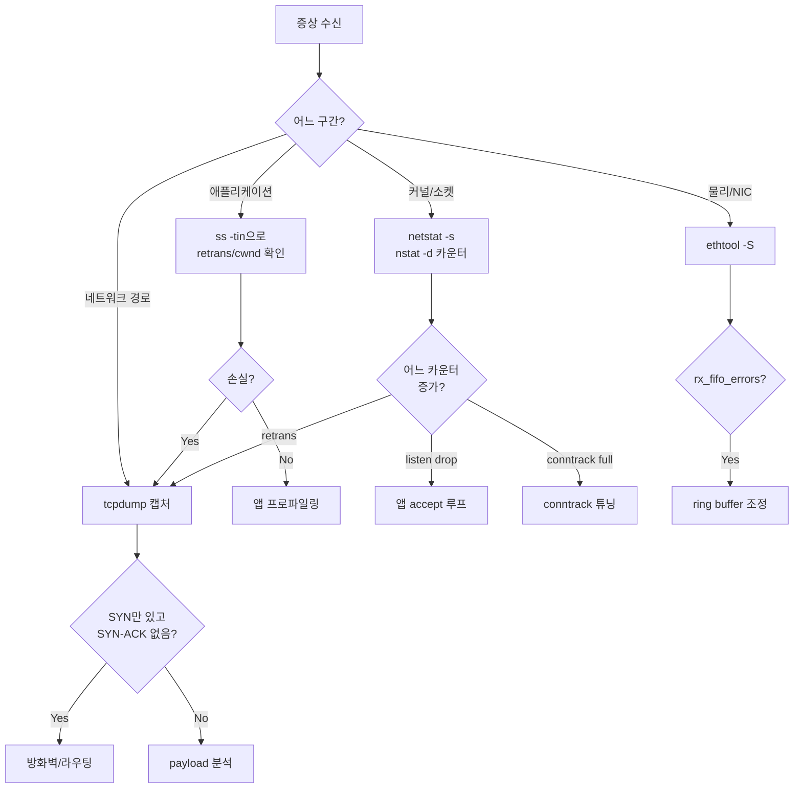

# Linux 네트워크 트러블슈팅

## 개요

운영 중인 서비스에서 네트워크 문제가 터지면 보통 증상이 모호하다. "가끔 느리다", "특정 시간대에 끊긴다", "한 리전에서만 안 된다" 같은 보고가 올라온다. 이런 상황에서 로그만 봐서는 원인을 찾기 어렵고, 결국 커널이 카운팅한 TCP 통계와 실제 패킷 캡처로 내려가야 한다.

이 문서는 실제 서비스 장애 상황에서 어떤 명령을 어떤 순서로 쓰는지, 각 도구가 보여주는 숫자가 무엇을 의미하는지 중심으로 정리한다. 개별 명령어 레퍼런스는 다른 문서에서 다루고, 여기서는 "이 증상이 나오면 이 카운터를 본다"에 집중한다.

## 도구 선택 기준: ss vs netstat

둘 다 소켓 정보를 보여주지만 내부 구현이 완전히 다르다. `netstat`은 `/proc/net/tcp`, `/proc/net/tcp6`을 한 줄씩 읽어서 파싱한다. 소켓이 수만 개면 이 파일 크기가 MB 단위가 되고, 한 번 읽을 때마다 커널이 전체 해시 테이블을 락 걸고 직렬화한다. 반면 `ss`는 netlink의 `sock_diag` 인터페이스로 필요한 소켓만 조건부로 받아온다.

웹서버에서 소켓이 10만 개쯤 쌓인 상황에서 `netstat -anp` 한 번 돌리면 수 초씩 걸리고 그 사이에 다른 모니터링이 영향을 받는다. 실제로 `netstat`이 느려서 모니터링 에이전트가 타임아웃 나고, 그게 헬스체크 실패로 이어져서 엉뚱하게 인스턴스가 교체되는 사례를 본 적이 있다. 그래서 최신 배포판에서는 `netstat`을 기본 설치하지 않고 `iproute2` 패키지의 `ss`를 쓰도록 바뀌었다.

다만 `netstat -s`의 출력은 여전히 유용하다. TCP MIB 카운터를 한꺼번에 덤프해주는데, `ss`로는 이만큼 깔끔하게 안 나온다. 카운터만 볼 때는 `netstat -s`, 실시간 소켓 상태 확인은 `ss`로 역할을 나눠서 쓴다.

```bash
# 소켓 목록: ss 사용
ss -tan state established '( dport = :443 or sport = :443 )'

# TCP 전체 카운터: netstat -s 사용 (또는 nstat)
netstat -s | grep -i retrans
nstat -a | grep -i retrans
```

`nstat`도 같은 MIB를 보여주는데, 호출 사이의 델타를 보여주는 모드(`nstat -d`)가 있어서 주기적 샘플링에 더 편하다.

## ss 고급 활용

### 소켓 상태별 필터링

특정 상태의 소켓만 보려면 `state` 표현식을 쓴다. 상태 이름은 TCP 상태 머신 그대로다.

```bash
ss -tan state time-wait                 # TIME_WAIT만
ss -tan state close-wait                # CLOSE_WAIT만
ss -tan state syn-recv                  # SYN_RECV만
ss -tan state established '( dport = :3306 )'   # MySQL 연결만
```

`-t`는 TCP, `-a`는 모든 상태, `-n`은 숫자 포트. IPv6까지 보려면 생략하지 말고 `-46` 명시하거나 그냥 아무것도 안 주면 된다. `dst`, `src`, `dport`, `sport` 조건을 괄호와 `and/or`로 조합할 수 있다.

### TCP 내부 정보: -i 옵션

`-i` (또는 `--info`)를 붙이면 커널이 소켓마다 기록하는 혼잡 제어 상태를 볼 수 있다. 이게 네트워크 성능 이슈 디버깅의 핵심이다.

```bash
ss -tin
```

출력 예시:

```
ESTAB  0  0   10.0.1.20:443  10.0.5.33:54321
     cubic wscale:7,7 rto:204 rtt:3.521/1.089 ato:40 mss:1448
     cwnd:10 ssthresh:32 bytes_sent:1250 bytes_acked:1251
     segs_out:5 segs_in:4 data_segs_out:2
     send 32.9Mbps lastsnd:2 lastrcv:2 lastack:2
     pacing_rate 65.7Mbps delivery_rate 25.4Mbps
     app_limited busy:4ms rcv_space:14480 rcv_ssthresh:64076
     minrtt:3.215
```

각 필드가 의미하는 것:

- `cubic`: 혼잡 제어 알고리즘. BBR을 켰다면 `bbr`로 표시된다.
- `rtt:3.521/1.089`: 평균 RTT 3.521ms, 편차 1.089ms. 앱단 지연 측정값이 이상할 때 여기가 진짜 네트워크 지연인지 확인한다.
- `cwnd:10`: 혼잡 윈도우. 초기값은 보통 10 MSS. 이 값이 계속 작게 유지되면 손실이 발생하고 있다는 뜻이다.
- `ssthresh`: slow start 임계치. 이 값이 급감했다면 직전에 혼잡 이벤트가 있었다.
- `retrans:N/M`: 현재 미확인 재전송 N개, 누적 재전송 M개. 누적값이 지속 증가하면 경로 어딘가에서 패킷 손실이 난다.
- `minrtt`: 지금까지 관측한 최소 RTT. BBR은 이걸로 BDP를 계산한다.
- `pacing_rate`, `delivery_rate`: 페이싱 속도와 실제 전달 속도. 두 값 차이가 크면 송신측이 ACK를 못 받아서 패킷을 못 내보내고 있다.

실무에서는 특정 커넥션이 느릴 때 `ss -tin dst <IP>:<port>`로 해당 소켓만 집어서 `retrans`와 `cwnd` 변화를 본다. cwnd가 2~3에 머물면서 retrans가 계속 올라가면 네트워크 손실, cwnd는 크지만 `send` 속도가 안 나오면 앱단에서 write 호출이 느린 경우다.

### 혼잡 제어 알고리즘 확인과 변경

```bash
sysctl net.ipv4.tcp_congestion_control   # 현재 기본값
sysctl net.ipv4.tcp_available_congestion_control   # 사용 가능한 알고리즘
```

BBR을 기본으로 바꾸려면 `tcp_bbr` 모듈이 로드되어 있어야 하고, qdisc도 `fq`로 바꿔야 제대로 동작한다.

```bash
modprobe tcp_bbr
sysctl -w net.core.default_qdisc=fq
sysctl -w net.ipv4.tcp_congestion_control=bbr
```

운영 환경에서 한꺼번에 BBR로 전환하면 기존 스택에 맞춰진 동작이 바뀔 수 있으니 일부 인스턴스부터 롤아웃하는 게 안전하다. 특히 장거리 해외 구간에서는 BBR이 Cubic 대비 처리량이 크게 늘어나는 경우가 많지만, 동일 링크를 공유하는 Cubic 플로우와의 공정성 이슈가 있다.

## netstat -s: TCP 카운터 해석

`netstat -s`나 `nstat -a`는 커널 부팅 이후 누적된 TCP 이벤트 카운터를 보여준다. 절대값 자체는 의미가 약하고, 시간 차이로 증가율을 봐야 한다. 샘플링해서 델타를 보는 게 기본이다.

### 재전송 관련

```
segments retransmitted: 123456
```

전체 재전송 세그먼트 수다. 시스템 전체 합계라 트래픽 규모에 비례한다. 재전송률은 `RetransSegs / OutSegs` 비율로 보는데, 1% 넘으면 경로에 뭔가 문제가 있다. 0.1% 이하가 정상적인 데이터센터 내부 통신 수준이다.

공인망 너머 구간은 0.5%까지도 정상 범위로 보지만, 갑자기 튄다면 라우팅 변경이나 중간 장비 이슈를 의심한다.

### listen drop과 SYN flood

```
N times the listen queue of a socket overflowed
N SYNs to LISTEN sockets dropped
TCPBacklogDrop: N
TCPSynRetrans: N
```

`listen queue overflowed`는 `accept()` 호출이 느려서 백로그 큐가 꽉 찼다는 뜻이다. 이게 쌓인다는 건 애플리케이션이 연결을 빨리 못 받아들이고 있다는 신호다. `net.core.somaxconn`을 올려도 근본 원인은 앱단 accept 루프가 느리거나 워커가 부족한 것이다.

`SYNs dropped`는 SYN 큐가 가득 찼을 때 나온다. `net.ipv4.tcp_max_syn_backlog`를 크게 잡고 `net.ipv4.tcp_syncookies=1`을 켜두면 SYN flood 상황에서도 일부는 처리된다. 평상시에는 0이어야 정상이고, 이 값이 증가한다면 누가 대량 연결을 만들고 있거나 SYN flood 공격이거나 정상 트래픽이 용량을 초과한 것이다.

SYN_RECV 상태가 평소보다 수백 배 많이 잡힌다면 공격 가능성이 높다.

```bash
ss -tan state syn-recv | wc -l
```

정상 서비스라면 보통 한 자릿수~수십 개다. 수천 개 이상이면 SYN flood를 의심한다.

### TimeWait과 포트 고갈

```
TCPTimeWaitOverflow: N
```

`net.ipv4.tcp_max_tw_buckets`를 초과한 TIME_WAIT 소켓 수다. 이게 증가하면 연결을 많이 맺고 끊는 클라이언트 측에서 ephemeral port 고갈 직전이라는 뜻이다.

TIME_WAIT 자체는 정상이다. 오히려 없애려고 `tcp_tw_recycle`을 켜면 NAT 환경에서 SYN이 drop되는 고전적인 문제가 생긴다. `tcp_tw_reuse`는 상대적으로 안전해서 outgoing 연결 많은 클라이언트 머신에 쓸 만하다.

### 전체 카운터 샘플링

```bash
# 1초 간격으로 델타만 보기
nstat -d -t 1
```

`nstat -d`는 호출 사이의 델타만 출력한다. 장애가 진행 중일 때 재전송, SYN drop, connection reset이 초당 얼마나 발생하는지 바로 보인다.

## tcpdump 실전

### BPF 필터 기본

tcpdump의 필터는 BPF 문법이다. 커널단에서 매칭되므로 필터를 잘 짜면 전체 트래픽이 많아도 부담이 적다. 반대로 필터 없이 `tcpdump -i any`를 돌리면 프로덕션에서 시스템이 휘청인다.

자주 쓰는 필터 조합:

```bash
# 특정 호스트의 특정 포트
tcpdump -nn -i eth0 'host 10.0.5.33 and port 443'

# 양방향 필터, ICMP 제외
tcpdump -nn -i eth0 'host 10.0.5.33 and not icmp'

# SYN만 (연결 시도 추적)
tcpdump -nn -i eth0 'tcp[tcpflags] & tcp-syn != 0 and tcp[tcpflags] & tcp-ack == 0'

# RST만 (비정상 종료 추적)
tcpdump -nn -i eth0 'tcp[tcpflags] & tcp-rst != 0'

# 특정 서브넷 드나드는 트래픽
tcpdump -nn -i eth0 'net 10.0.0.0/16 and port 3306'

# DNS 쿼리만
tcpdump -nn -i eth0 'udp port 53'

# HTTP GET 페이로드 포함한 패킷만 (느림, 디버깅용)
tcpdump -nn -i eth0 -A 'tcp port 80 and tcp[((tcp[12:1] & 0xf0) >> 2):4] = 0x47455420'
```

마지막 예제는 TCP 페이로드 시작 위치(`tcp[12:1] & 0xf0) >> 2`가 TCP 헤더 길이)에서 4바이트가 "GET "의 ASCII(0x47455420)인지 검사한다. BPF 오프셋 계산은 헤더 옵션 때문에 이렇게 복잡하다.

### 캡처 저장과 Wireshark 연동

운영 서버에서는 거의 대부분 `-w`로 파일에 저장하고, 분석은 로컬에서 한다. 서버에 Wireshark를 깔 일은 없다.

```bash
# 100MB 단위로 회전, 최대 10개 파일
tcpdump -nn -i eth0 -s 0 -w capture.pcap -C 100 -W 10 'port 443'

# 시간 단위 회전
tcpdump -nn -i eth0 -G 60 -w 'capture-%Y%m%d-%H%M%S.pcap' 'port 443'
```

`-s 0`은 패킷 전체 캡처(기본은 262144 바이트로 잘림). 서비스 장애 원인을 페이로드까지 봐야 할 때 필수다. 다만 대역폭과 디스크 I/O 부담이 커지므로 평상시에는 `-s 96` 정도로 헤더만 뜨는 게 낫다.

링 버퍼 모드(`-C`, `-W`)를 쓰면 오래된 파일을 자동으로 덮어쓴다. "며칠째 간헐적으로 나는 문제"를 잡을 때 서버에 상시 실행해두고, 이슈 발생하면 그 시점의 파일만 가져와서 분석한다.

Wireshark에서 열 때는 `.pcap` 파일을 그대로 읽으면 되고, 필터는 Wireshark의 display filter 문법(`tcp.stream eq 5`, `http.request.method == "POST"` 등)을 쓴다. BPF 필터와 문법이 다르다는 점에 주의한다.

### tshark로 파싱

터미널에서 바로 통계를 뽑으려면 `tshark`를 쓴다.

```bash
# 스트림별 바이트 수
tshark -r capture.pcap -q -z conv,tcp

# RTT 분포
tshark -r capture.pcap -q -z io,stat,1,"AVG(tcp.analysis.ack_rtt)tcp.analysis.ack_rtt"

# HTTP 요청만 추출
tshark -r capture.pcap -Y 'http.request' -T fields -e ip.src -e http.host -e http.request.uri
```

`tshark -z conv,tcp`는 스트림 단위로 패킷 수, 바이트, 지속 시간을 요약해준다. "어느 클라이언트가 재전송을 많이 유발하는가"를 찾을 때 유용하다.

## ethtool: NIC 레이어

애플리케이션과 TCP 스택 위에서 아무리 디버깅해도 답이 안 나올 때가 있다. 그럴 때는 NIC 레이어로 내려간다.

### 링크 상태와 드라이버

```bash
ethtool eth0                    # 링크 속도, duplex, 협상 상태
ethtool -i eth0                 # 드라이버, 펌웨어 버전
ethtool -S eth0                 # NIC 통계 (rx/tx packets, errors, drops)
```

`ethtool eth0`에서 `Speed: 1000Mb/s`인데 10Gbps 링크여야 한다면 케이블이나 스위치 포트 문제다. 자동 협상 실패다. `Link detected: no`면 물리 링크가 안 붙어 있다.

`ethtool -S`의 `rx_missed_errors`, `rx_fifo_errors`가 증가하면 NIC가 패킷을 받았는데 커널에 넘기지 못했다는 뜻이다. ring buffer가 부족하거나 인터럽트 처리가 느려서다.

### Ring buffer 확인과 조정

```bash
ethtool -g eth0
# Ring parameters for eth0:
# Pre-set maximums:
# RX:     4096
# RX Mini: 0
# RX Jumbo: 0
# TX:     4096
# Current hardware settings:
# RX:     512
# RX Mini: 0
# RX Jumbo: 0
# TX:     512

ethtool -G eth0 rx 4096 tx 4096
```

기본값이 512인 경우가 많은데, 10Gbps 이상 링크에서 burst 트래픽이 들어오면 모자란다. `rx_fifo_errors`가 계속 증가하면 여기를 먼저 키운다. 최대값을 넘겨서 설정하려 하면 에러 나므로 `-g`로 최대값 확인부터 한다.

### Offload 기능

```bash
ethtool -k eth0                 # 현재 offload 설정
ethtool -K eth0 gro off         # GRO 끄기
ethtool -K eth0 tso off gso off # 송신 offload 끄기
```

TSO/GSO/GRO는 큰 세그먼트를 NIC이나 커널이 잘게 쪼개거나 합쳐서 CPU 부담을 줄이는 기능이다. 평상시에는 켜두는 게 성능에 좋다. 다만 tcpdump로 캡처하면 세그먼트 크기가 실제와 다르게 보인다. 캡처가 ip_summed 상태라 `length`가 MTU를 훌쩍 넘는 값으로 찍힌다. 이걸 보고 MTU 문제로 오인하는 경우가 잦은데, 실제 와이어에서는 정상 MSS로 쪼개져서 나간다.

가상화 환경이나 컨테이너에서 간혹 GRO가 특정 흐름에서 문제를 일으키는 버그가 있어서 임시로 끄는 경우가 있다. 성능은 떨어지지만 증상이 바로 사라진다면 드라이버 버전 업이나 워크어라운드 대상이다.

## conntrack: NAT와 상태 추적

iptables/nftables의 상태 추적 연결(stateful connection)은 `nf_conntrack` 모듈이 관리한다. 도커 호스트, NAT 게이트웨이, 방화벽 역할 서버에서 반드시 체크해야 한다.

### 한도 확인

```bash
sysctl net.netfilter.nf_conntrack_max
sysctl net.netfilter.nf_conntrack_count    # 커널에 따라 없을 수 있음
cat /proc/sys/net/netfilter/nf_conntrack_count
cat /proc/sys/net/netfilter/nf_conntrack_max
```

`count`가 `max`에 근접하면 새 연결이 drop되기 시작한다. dmesg에 다음 로그가 찍힌다:

```
nf_conntrack: table full, dropping packet
```

이 로그가 보이면 무조건 conntrack 테이블이 가득 찬 상태다. 증상은 "새 연결만 안 되고 기존 연결은 멀쩡함"이다. 서비스가 완전히 죽지 않아서 모니터링이 놓치기 쉬운 패턴이다.

### 튜닝

```bash
# 테이블 크기
sysctl -w net.netfilter.nf_conntrack_max=1048576
sysctl -w net.netfilter.nf_conntrack_buckets=262144

# TIME_WAIT 유사 상태 타임아웃 축소
sysctl -w net.netfilter.nf_conntrack_tcp_timeout_time_wait=30
sysctl -w net.netfilter.nf_conntrack_tcp_timeout_established=3600
```

`nf_conntrack_buckets`는 해시 테이블 크기로, 보통 `max`의 1/4 정도로 잡는다. 너무 작으면 해시 충돌이 심해져서 조회 성능이 떨어진다.

### 실시간 엔트리 조회

```bash
conntrack -L                           # 전체 엔트리
conntrack -L -p tcp --dport 443        # 443 포트 연결만
conntrack -L --src 10.0.5.33           # 특정 출발지만
conntrack -S                           # 통계
conntrack -E                           # 이벤트 실시간 스트림
```

`conntrack -E`는 연결 생성/삭제를 실시간으로 보여주는데, 이상한 패턴의 연결(같은 소스에서 초당 수백 건)이 들어오는지 잡을 때 쓴다.

NAT 환경에서 "왜 이 연결이 외부로 나간 후 돌아오면 매핑이 안 되지" 같은 상황에서는 `conntrack -L`로 튜플(source, dest, sport, dport, protocol)을 직접 조회해서 어떻게 번역되는지 확인한다.

## MTU 문제

### PMTUD blackhole

경로상의 어떤 라우터나 방화벽이 ICMP "Fragmentation needed"를 차단하면 PMTUD(Path MTU Discovery)가 동작하지 않는다. 결과는 "작은 요청은 되는데 큰 응답에서 멈춘다"는 증상이다. TLS handshake는 되는데 실제 데이터 전송에서 행이 걸린다거나, HTTP GET은 되는데 POST는 안 되는 경우가 대표적이다.

VPN이나 IPIP 터널, GRE 터널을 거치는 경로에서 자주 생긴다. 일반 이더넷 MTU 1500에서 VPN 헤더가 붙으면 실제 가능한 MSS가 줄어드는데, 이걸 ICMP로 알려줘야 송신측이 세그먼트를 작게 쪼갠다. ICMP가 막혀 있으면 송신측은 계속 1500짜리 패킷을 보내고, 중간에서 조용히 drop된다.

### ping으로 MTU 탐지

```bash
# DF 비트 세우고 다양한 크기로 테스트
ping -M do -s 1472 8.8.8.8      # IP 20 + ICMP 8 + 페이로드 1472 = 1500
ping -M do -s 1473 8.8.8.8      # 1501이면 실패해야 함
```

`-M do`는 "Do Not Fragment" 비트를 세운다. 패킷이 경로 MTU를 초과하면 drop되고 ICMP 에러가 돌아온다. 적절한 페이로드 크기를 이분 탐색해서 실제 경로 MTU를 알아낸다.

페이로드 크기가 1472를 넘어가는 순간 ping이 타임아웃이면 MTU는 1500 미만이다. 1400까지 떨어뜨려야 통한다면 어딘가에 MTU 1428(1400+28) 구간이 있다는 뜻이다.

### MSS clamping

해결책은 송신측에서 MSS를 낮추거나, 라우터/방화벽에서 MSS clamping을 거는 것이다.

```bash
# iptables로 MSS clamping
iptables -t mangle -A POSTROUTING -o ppp0 -p tcp --tcp-flags SYN,RST SYN \
    -j TCPMSS --clamp-mss-to-pmtu
```

`--clamp-mss-to-pmtu`는 송신되는 SYN 패킷의 MSS 옵션을 인터페이스 MTU - 40으로 강제 조정한다. 송신측이 처음부터 작은 MSS로 합의하게 된다.

컨테이너 환경에서 overlay 네트워크(VXLAN)를 쓰면 실제 MTU가 1450 근처로 떨어지는데, 호스트 NIC MTU는 그대로 1500이라 문제가 생긴다. Kubernetes CNI 설정에서 MTU를 명시해주지 않으면 기본값을 잘못 잡는 경우가 있다.

## ARP 문제

같은 L2 세그먼트에서 통신이 안 될 때는 대개 ARP 문제다.

```bash
ip neigh show                   # ARP 테이블
ip neigh show dev eth0
ip neigh flush all              # ARP 캐시 비우기 (디버깅용)
```

`ip neigh`에서 상대 IP가 `FAILED` 상태면 ARP 요청에 응답이 안 왔다는 뜻이다. `INCOMPLETE`는 요청은 보냈는데 아직 응답 대기 중.

```bash
arping -c 3 10.0.5.33           # 직접 ARP 요청 보내기
arping -I eth0 -c 3 10.0.5.33   # 특정 인터페이스로
```

`arping`은 ping과 다르게 ICMP가 아니라 ARP를 직접 보낸다. 방화벽에서 ICMP를 막아도 ARP는 막기 어려우므로 L2 연결 자체를 확인할 때 유용하다.

같은 IP가 두 호스트에 설정된 IP 중복 상황에서는 `arping -D -I eth0 10.0.5.33`로 DAD(Duplicate Address Detection)를 돌린다. 두 MAC이 응답하면 중복이다.

VRRP(keepalived) 환경에서 failover가 됐는데 일부 클라이언트만 연결이 끊긴다면 gratuitous ARP가 제대로 안 퍼진 경우다. 새 master가 gratuitous ARP를 보내서 스위치의 MAC 테이블을 갱신해야 하는데, 이게 누락되면 ARP 캐시가 만료될 때까지 기존 master로 패킷이 간다.

## iperf3: 대역폭 측정

"네트워크가 느리다"는 보고를 받으면 먼저 이게 실제로 네트워크 처리량 문제인지 확인해야 한다. 애플리케이션 지연과 네트워크 대역폭은 완전히 다른 문제다.

```bash
# 서버
iperf3 -s

# 클라이언트 (기본 TCP 10초)
iperf3 -c <서버IP>

# UDP 테스트 (100Mbps 요청)
iperf3 -c <서버IP> -u -b 100M

# 병렬 스트림 (멀티코어 대역폭)
iperf3 -c <서버IP> -P 8

# 역방향 (서버 → 클라이언트)
iperf3 -c <서버IP> -R

# 장시간 측정 (분당 평균 변동 확인)
iperf3 -c <서버IP> -t 300 -i 10
```

단일 스트림에서 대역폭이 안 나오는 이유는 BDP(Bandwidth-Delay Product) 제한일 수 있다. RTT가 100ms이고 대역폭 10Gbps면 BDP가 125MB인데, 기본 TCP 수신 윈도우가 이보다 작으면 병목이 생긴다. `-P 8`로 병렬 스트림 띄우면 전체 대역폭이 나오는 경우가 많다.

UDP 테스트는 순수 네트워크 경로 용량 확인에 좋다. 패킷 loss와 jitter까지 보여준다.

## 연결 상태 이상 진단

### TIME_WAIT 누적

```bash
ss -tan state time-wait | wc -l
```

수만 개 쌓여 있어도 메모리만 먹을 뿐 즉시 장애는 아니다. 문제는 ephemeral port 고갈이다. Linux 기본 ephemeral port 범위는 32768~60999 정도라 약 2.8만 개다. outbound 연결이 많은 클라이언트 머신에서 이게 꽉 차면 새 연결을 못 맺는다.

해결책은 `tcp_tw_reuse=1`을 켜는 것. 타임스탬프 옵션이 활성화된 경우에만 동작하고, 같은 튜플에 대해 유일성이 보장되므로 안전하다. `tcp_tw_recycle`은 NAT 환경에서 문제를 일으키므로 쓰지 않는다 (4.12 커널에서 제거됨).

```bash
sysctl -w net.ipv4.tcp_tw_reuse=1
sysctl -w net.ipv4.ip_local_port_range="10000 65535"
```

서버 쪽에서 TIME_WAIT가 쌓이는 것은 서버가 먼저 connection close를 했다는 뜻이다. HTTP keep-alive가 꺼져 있거나, 로드밸런서가 요청마다 새 연결을 맺는 상황이다. 서버에서는 TIME_WAIT보다 CLOSE_WAIT를 더 경계해야 한다.

### CLOSE_WAIT 누적: 애플리케이션 버그 신호

TCP 상태 머신에서 CLOSE_WAIT는 "상대가 FIN을 보냈는데 우리 쪽 애플리케이션이 아직 close()를 호출하지 않은 상태"다. 커널은 상대의 FIN을 받고 ACK까지 보낸 뒤, 애플리케이션이 close()를 부르길 기다린다.

즉 CLOSE_WAIT가 쌓인다는 건 거의 100% 애플리케이션 버그다. 연결 풀에서 FIN을 받은 소켓을 제대로 닫지 않거나, 예외 처리 경로에서 close를 누락한 것이다. 시간이 지나도 커널은 절대 혼자서 청소하지 않는다. `tcp_fin_timeout`은 FIN_WAIT2에만 적용되고 CLOSE_WAIT에는 안 먹는다.

```bash
ss -tan state close-wait
# 피어 주소별로 어느 서비스와의 연결이 누수되는지 확인
ss -tan state close-wait | awk '{print $4}' | sort | uniq -c | sort -rn
```

해결은 순전히 애플리케이션 코드 수정이다. JVM이면 `jstack`으로 스레드 덤프 보면서 해당 소켓을 잡고 있는 코드 경로를 찾는다. Node.js면 `lsof -p <pid>`로 fd를 뒤진 다음 heap snapshot으로 참조를 역추적한다.

### SYN_RECV 폭주

```bash
ss -tan state syn-recv | wc -l
```

정상 서비스에서 SYN_RECV는 아주 짧게 스쳐 지나간다. 이게 수천 개 쌓이면 두 가지다.

하나는 SYN flood 공격. 공격자가 SYN만 보내고 ACK를 안 보내서 서버가 handshake를 완료 못 하는 상태가 쌓인다. `net.ipv4.tcp_syncookies=1`이 켜져 있으면 큐가 가득 차도 cookies로 처리해서 실제 사용자는 영향받지 않는다.

다른 하나는 정상 트래픽이지만 서버가 SYN-ACK에 대한 ACK를 못 받는 상황. 비대칭 라우팅이나 방화벽 문제일 수 있다. tcpdump로 해당 출발지 IP의 흐름을 잡아서 SYN → SYN-ACK → ACK 시퀀스를 확인한다.

## 장애 분류: 에러 메시지로 원인 좁히기

### "Connection refused"

TCP RST를 즉시 받았다는 뜻. L3(라우팅)와 L2(ARP)는 정상이고 패킷이 목적지까지 도착했지만, 해당 포트에 LISTEN 중인 프로세스가 없다는 응답이다.

원인은 대부분:

- 서비스가 죽어 있음 (`systemctl status`, `ss -tln sport = :포트`)
- 서비스가 다른 인터페이스에만 bind됨 (`127.0.0.1`만 listen 중인데 외부에서 접근)
- 포트는 맞지만 iptables에서 REJECT(--reject-with tcp-reset) 설정

확인:

```bash
ss -tlnp sport = :8080
```

listen 하고 있는 프로세스와 bind된 주소를 본다. `127.0.0.1:8080`으로만 떠 있으면 외부 IP로는 connection refused가 난다.

### "Connection timeout"

SYN을 보냈는데 아무 응답이 없어서 클라이언트가 재시도하다 포기한 상태. 중간에서 패킷이 drop되고 RST도 안 온다.

- 방화벽에서 DROP (REJECT와 다르게 응답 없이 버림)
- 서버 conntrack table full
- 서버 listen queue overflow (SYN drop)
- 라우팅은 되는데 목적지 서버가 꺼져 있음 (ARP 응답도 없음)

클라이언트에서 tcpdump로 SYN 재전송을 확인하고, 서버 쪽에서도 tcpdump를 돌려서 SYN이 도착하는지 본다. 도착하는데 응답이 없으면 서버 문제, 아예 도착 안 하면 경로 문제다.

### "No route to host"

로컬 라우팅 테이블에서 목적지로 가는 경로를 못 찾았거나(`Network is unreachable`), 같은 L2 세그먼트인데 ARP 응답이 없는 경우(`No route to host`).

```bash
ip route get 10.0.5.33
ip neigh show
```

`ip route get`이 어떤 게이트웨이와 인터페이스로 보내려 하는지 보여준다. 예상과 다르면 라우팅 테이블 문제다. `ip neigh`에서 해당 IP가 FAILED면 ARP 문제다.

### 502 Bad Gateway의 네트워크 레벨 원인

Nginx나 ALB 뒤에서 502가 나는 경우, 상류 서버와의 TCP 레벨 문제인지 HTTP 레벨 문제인지 구분해야 한다.

- Nginx 로그의 `upstream prematurely closed connection`: 상류 서버가 연결 중간에 FIN/RST를 보냄. 워커 재시작, OOM kill, crash 의심.
- `upstream timed out`: 상류로 보낸 요청이 지정 시간 내 응답 없음. `proxy_read_timeout`보다 느린 쿼리거나, 상류 서버가 hang.
- `connect() failed`: 상류 서버로 TCP 연결 자체가 안 됨. 이건 connection refused/timeout 계열로 다시 본다.
- `no live upstreams`: 모든 백엔드가 fail 판정됨. 헬스체크 로그를 봐야 한다.

tcpdump로 nginx ↔ 상류 구간을 캡처해서 실제 TCP 흐름을 보는 게 가장 확실하다. keep-alive 재사용 중인 연결에서 상류가 먼저 FIN을 보냈는데 nginx가 그 연결로 새 요청을 보낸 경우, 502가 나올 수 있다. `proxy_http_version 1.1`과 `Connection ""` 헤더 설정, upstream keepalive 값 확인 필요.

## 트러블슈팅 흐름

실무에서 네트워크 장애 진단은 아래 순서로 내려간다.



위에서 아래로(애플리케이션 → 커널 → 네트워크 → 물리) 내려가면서, 한 레이어에서 이상이 없다고 확인되면 아래 레이어로 넘어간다. 역방향으로 올라가지 말고 레이어별로 끊어서 보는 게 중요하다. 한꺼번에 모든 레이어를 뒤지면 어디가 원인인지 모르게 된다.

## 실제 사례

데이터베이스 연결이 가끔 끊긴다는 보고로 시작한 사건이 있었다. 앱 로그는 "connection reset by peer"만 찍히고 주기가 들쑥날쑥했다.

먼저 `ss -tin dst <DB_IP>`로 현재 연결을 보니 retrans가 대부분 0이고 RTT도 정상이었다. 커널 카운터도 깨끗했다. 애플리케이션 레이어에서 특이점이 안 보였다.

tcpdump로 DB 서버와 앱 서버 양쪽에서 동시에 캡처를 시작했다. 한참 뒤 이슈 재현되면서 잡힌 캡처를 Wireshark로 열어보니, 앱에서는 정상적으로 데이터를 보내고 있는데 DB 서버 쪽 캡처에는 해당 패킷이 아예 안 도착하고 있었다. 그러다 앱 쪽이 타임아웃 걸려 RST를 보내고, DB 서버는 이유 없이 RST를 받는 형태였다.

경로 중간의 NAT 게이트웨이가 범인이었다. `conntrack -S`를 보니 `insert_failed`가 분당 수백 건씩 증가하고 있었고, `dmesg`에는 `nf_conntrack: table full` 로그가 있었다. 테이블이 가득 차서 새 패킷에 대한 엔트리 생성이 실패하고 있었지만, 기존 연결은 동작해서 전체 서비스가 죽진 않았다. 특히 idle 시간이 긴 DB 연결이 타임아웃으로 conntrack에서 제거된 뒤 다시 사용될 때 문제가 집중됐다.

`nf_conntrack_max`를 4배로 올리고 `tcp_timeout_established`를 줄여서 해결됐다. 표면적 증상은 DB 연결 reset이었지만 원인은 전혀 다른 계층에 있었다. 애플리케이션 로그, DB 로그, 네트워크 캡처를 모두 대조하지 않았으면 이틀은 더 헤맸을 사건이다.

## 참고

- 실시간 카운터 변화 샘플링: `nstat -d -t 1`
- 패킷 한 줄 요약: `tcpdump -nn -q -i any`
- 소켓 상태 count: `ss -tan | awk '{print $1}' | sort | uniq -c`
- conntrack 이벤트 스트림: `conntrack -E`
- NIC 인터럽트 분포: `cat /proc/interrupts | grep eth`
- softirq 부하: `cat /proc/softirqs`, `mpstat -P ALL 1`
