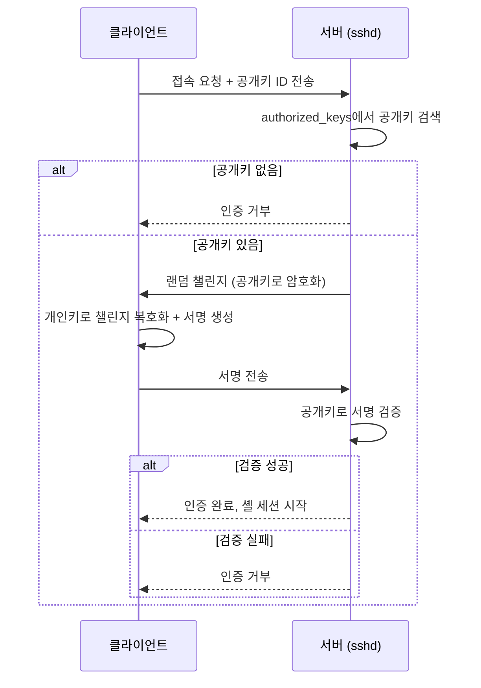
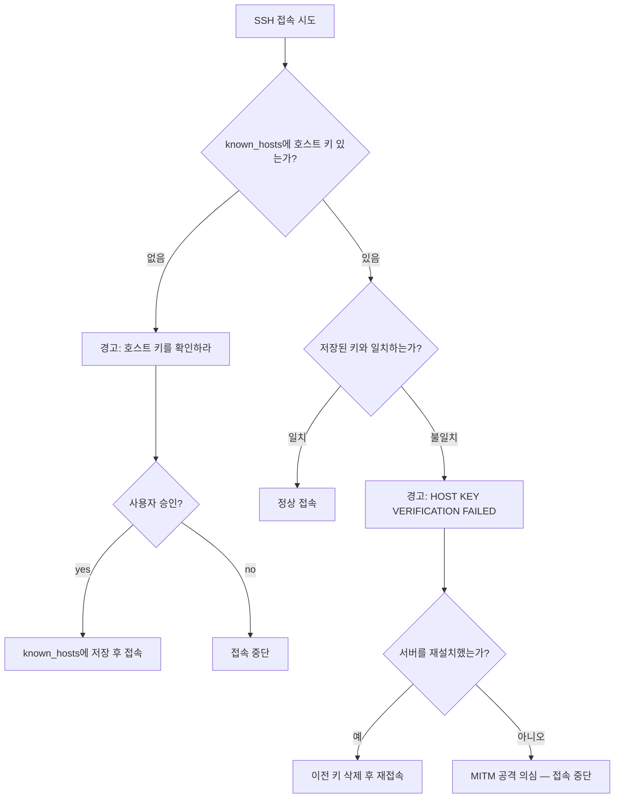
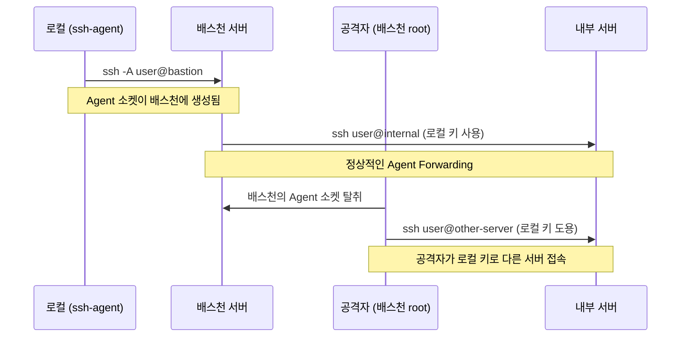
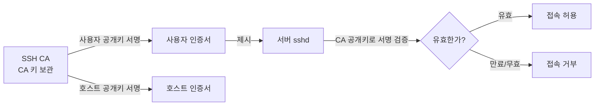

# SSH 보안

## SSH란

SSH(Secure Shell)는 네트워크를 통해 원격 서버에 접속하는 프로토콜이다. 암호화된 통신으로 비밀번호, 명령어, 파일 전송 등 모든 데이터를 보호한다. 기본 포트는 22번이다.

## SSH 키 인증

비밀번호 대신 공개키/개인키 쌍으로 인증한다. 비밀번호 인증은 무차별 대입(Brute Force) 공격에 취약하기 때문에, 운영 서버에서는 키 인증만 허용하는 것이 기본이다.

### 키 생성

```bash
# ED25519 권장 — RSA보다 키가 짧고 서명 속도가 빠르다
ssh-keygen -t ed25519 -C "user@example.com"

# RSA를 써야 하는 경우 (레거시 서버, FIPS 환경)
ssh-keygen -t rsa -b 4096 -C "user@example.com"

# 결과:
#   ~/.ssh/id_ed25519       ← 개인키 (절대 공유 금지)
#   ~/.ssh/id_ed25519.pub   ← 공개키 (서버에 등록)
```

개인키에 passphrase를 설정하지 않으면, 키 파일이 유출되는 순간 인증이 뚫린다. 반드시 passphrase를 설정해야 한다. ssh-agent를 쓰면 매번 입력할 필요 없다.

### 공개키 등록

```bash
# ssh-copy-id가 가장 간편하다
ssh-copy-id -i ~/.ssh/id_ed25519.pub user@server

# ssh-copy-id가 없는 환경에서 수동 등록
cat ~/.ssh/id_ed25519.pub | ssh user@server "mkdir -p ~/.ssh && chmod 700 ~/.ssh && cat >> ~/.ssh/authorized_keys && chmod 600 ~/.ssh/authorized_keys"
```

권한이 잘못되면 SSH가 키 인증을 거부한다. `.ssh` 디렉토리는 700, `authorized_keys`는 600이어야 한다. 이걸 놓치고 "키 인증이 안 된다"고 한참 삽질하는 경우가 많다.

### 인증 과정



핵심은 개인키가 네트워크를 타지 않는다는 점이다. 서버가 보낸 챌린지에 대해 클라이언트가 개인키로 서명만 만들어 보내고, 서버는 이미 등록된 공개키로 서명을 검증한다.

## sshd_config 하드닝

`/etc/ssh/sshd_config`는 SSH 서버의 보안을 결정하는 핵심 파일이다. 기본값 그대로 쓰면 안 된다.

### 필수 설정

```bash
# /etc/ssh/sshd_config

# 비밀번호 인증 비활성화 — 키 인증만 허용
PasswordAuthentication no
ChallengeResponseAuthentication no

# root 직접 로그인 차단
PermitRootLogin no

# 빈 비밀번호 차단
PermitEmptyPasswords no

# 키 인증 활성화
PubkeyAuthentication yes

# 인증 시도 횟수 제한
MaxAuthTries 3

# 로그인 유예 시간 — 이 시간 안에 인증 못하면 연결 끊음
LoginGraceTime 30

# 동시 인증 세션 제한
MaxStartups 10:30:60
# 10개까지 허용, 이후 30% 확률로 거부, 60개부터 전부 거부

# X11 포워딩 비활성화 (서버에서 GUI 쓸 일 없으면)
X11Forwarding no
```

### 접근 제어

```bash
# 특정 사용자만 SSH 접속 허용
AllowUsers deploy admin

# 또는 그룹 단위 제어
AllowGroups ssh-users

# 특정 사용자 차단
DenyUsers testuser guest
```

`AllowUsers`와 `AllowGroups`를 동시에 쓰면 두 조건을 모두 만족해야 접속 가능하다. 보통 둘 중 하나만 쓴다.

### 포트 변경

```bash
# 기본 포트 22 대신 다른 포트 사용
Port 2222
```

포트 변경은 자동화된 스캔을 줄여주지만 보안 대책은 아니다. nmap으로 금방 찾는다. 키 인증 + fail2ban이 실질적인 방어다.

### 설정 적용

```bash
# 문법 검사 — 실수로 sshd가 죽으면 서버에 접속할 수 없다
sudo sshd -t

# 문법 검사 통과 후 재시작
sudo systemctl restart sshd
```

원격 서버에서 sshd_config를 수정할 때는 **현재 세션을 유지한 채로** 새 터미널에서 접속 테스트를 해야 한다. 설정이 잘못되면 재시작 후 접속이 불가능해진다. 이걸 한 번이라도 겪으면 절대 잊지 못한다.

## known_hosts 검증

SSH는 처음 접속하는 서버의 호스트 키를 `~/.ssh/known_hosts`에 저장한다. 다음 접속 시 저장된 키와 서버가 보내는 키를 비교해서 중간자 공격(MITM)을 탐지한다.

### 호스트 키 검증 흐름



### HOST KEY VERIFICATION FAILED

이 경고가 뜨면 두 가지 경우다:

1. 서버를 재설치했거나 IP가 바뀐 경우 — 정상
2. 누군가 같은 IP로 가짜 서버를 띄운 경우 — 공격

```bash
# 원인이 확실하면 이전 키 삭제
ssh-keygen -R server.example.com

# 해싱된 known_hosts에서 특정 호스트 삭제
ssh-keygen -R 192.168.1.100
```

**StrictHostKeyChecking을 no로 설정하면 이 검증을 건너뛴다.** 개발 환경에서 편하다고 쓰는 경우가 많은데, 프로덕션에서 이렇게 하면 MITM 공격을 탐지할 수 없다.

```bash
# 잘못된 예 — 프로덕션에서 절대 쓰면 안 된다
Host *
    StrictHostKeyChecking no
    UserKnownHostsFile /dev/null

# 개발 환경에서만 제한적으로 사용
Host dev-*
    StrictHostKeyChecking no
```

### known_hosts 해싱

```bash
# known_hosts를 해싱해서 호스트 목록 노출 방지
ssh-keygen -H -f ~/.ssh/known_hosts

# /etc/ssh/ssh_config에서 기본 활성화
HashKnownHosts yes
```

known_hosts가 평문이면 서버 목록이 그대로 노출된다. 공격자가 이 파일을 얻으면 내부 서버 구조를 파악할 수 있다. 해싱하면 호스트명을 숨길 수 있다.

## Agent Forwarding 보안 위험

`ssh -A`로 Agent Forwarding을 쓰면, 중간 서버(배스천)에서 로컬의 ssh-agent에 있는 키를 사용할 수 있다. 편리하지만 보안 위험이 있다.

### 위험한 시나리오



배스천 서버에 root 권한을 가진 공격자가 있으면, forwarding된 agent 소켓을 통해 로컬의 키를 도용할 수 있다. 키 자체가 유출되는 것은 아니지만, 세션이 살아있는 동안 다른 서버에 접속할 수 있다.

### 대안: ProxyJump

Agent Forwarding 대신 ProxyJump를 쓰면 배스천에 agent 소켓이 생기지 않는다.

```bash
# Agent Forwarding 대신 ProxyJump 사용
ssh -J user@bastion user@internal-server

# ~/.ssh/config에 설정
Host internal
    HostName 10.0.1.50
    User deploy
    ProxyJump bastion
```

ProxyJump는 배스천을 TCP 프록시로만 사용한다. SSH 인증은 로컬에서 직접 내부 서버와 수행하므로, 배스천에 키가 노출되지 않는다.

Agent Forwarding이 꼭 필요하면 `ForwardAgent`를 특정 호스트에만 제한해야 한다.

```bash
# 전체 허용 — 위험
Host *
    ForwardAgent yes

# 특정 배스천에만 허용
Host trusted-bastion
    ForwardAgent yes

Host *
    ForwardAgent no
```

## 인증서 기반 인증

authorized_keys 방식은 서버가 많아지면 공개키 배포가 관리 부담이 된다. 서버 100대에 새 사용자를 추가하려면 100대 모두에 키를 등록해야 한다.

SSH 인증서(Certificate)를 쓰면 CA(Certificate Authority)가 서명한 인증서 하나로 모든 서버에 접속할 수 있다.

### 동작 방식



### CA 키 생성과 인증서 발급

```bash
# 1. CA 키 생성 (이 키는 안전하게 보관해야 한다)
ssh-keygen -t ed25519 -f /etc/ssh/ca_key -C "SSH CA"

# 2. 사용자 인증서 발급
ssh-keygen -s /etc/ssh/ca_key \
    -I "deploy-user-cert" \        # 인증서 식별자
    -n deploy,admin \              # 허용할 사용자명 (principals)
    -V +52w \                      # 유효기간: 52주
    ~/.ssh/id_ed25519.pub
# 결과: ~/.ssh/id_ed25519-cert.pub 생성

# 3. 호스트 인증서 발급 (known_hosts 대체)
ssh-keygen -s /etc/ssh/ca_key \
    -I "web-server-cert" \
    -h \                           # 호스트 인증서 표시
    -n web01.example.com \         # 호스트명
    -V +52w \
    /etc/ssh/ssh_host_ed25519_key.pub
```

### 서버 설정

```bash
# /etc/ssh/sshd_config

# CA 공개키 등록 — 이 CA가 서명한 인증서를 가진 사용자를 신뢰
TrustedUserCAKeys /etc/ssh/ca_key.pub

# 호스트 인증서 설정 — 클라이언트가 서버를 검증
HostCertificate /etc/ssh/ssh_host_ed25519_key-cert.pub
```

### 클라이언트 설정

```bash
# ~/.ssh/known_hosts 또는 /etc/ssh/ssh_known_hosts
# CA가 서명한 호스트 인증서를 가진 서버를 신뢰
@cert-authority *.example.com ssh-ed25519 AAAA... (CA 공개키)
```

이렇게 하면 서버를 새로 만들어도 CA가 서명한 호스트 인증서만 넣으면 된다. 클라이언트에서 "HOST KEY VERIFICATION FAILED" 경고가 뜨지 않는다.

인증서에는 유효기간이 있어서, 키가 유출되어도 만료 후에는 사용할 수 없다. authorized_keys 방식은 키를 명시적으로 삭제하기 전까지 영원히 유효하다.

## SSH Config

서버별 접속 설정을 파일로 관리한다.

```
# ~/.ssh/config

# 개발 서버
Host dev
    HostName 192.168.1.100
    User deploy
    Port 2222
    IdentityFile ~/.ssh/dev_key

# 프로덕션 서버 — ProxyJump로 배스천 경유
Host prod
    HostName 10.0.1.50
    User admin
    IdentityFile ~/.ssh/prod_key
    ProxyJump bastion

# 배스천 서버
Host bastion
    HostName bastion.example.com
    User ec2-user
    IdentityFile ~/.ssh/bastion_key

# 모든 호스트 공통
Host *
    ServerAliveInterval 60
    ServerAliveCountMax 3
    AddKeysToAgent yes
    HashKnownHosts yes
    ForwardAgent no
```

```bash
# config 설정 후 간단하게 접속
ssh dev          # ssh -p 2222 -i ~/.ssh/dev_key deploy@192.168.1.100 과 동일
ssh prod         # bastion 경유하여 자동 접속
```

## 포트 포워딩 (SSH 터널링)

SSH 연결을 통해 다른 포트의 트래픽을 암호화해서 전달한다.

### 로컬 포트 포워딩

```bash
# 로컬 8080 → 서버의 localhost:3000으로 포워딩
ssh -L 8080:localhost:3000 user@server

# 사용: 브라우저에서 http://localhost:8080 접속하면
# 서버의 3000번 포트로 전달된다
```

### 원격 포트 포워딩

```bash
# 서버의 9090 포트 → 로컬의 3000으로 포워딩
ssh -R 9090:localhost:3000 user@server

# 용도: 로컬 개발 서버를 외부에서 접근할 때
```

### 실전 예시

```bash
# 서버 DB에 로컬에서 접속 (DB 포트가 외부에 닫혀 있을 때)
ssh -L 5433:localhost:5432 user@server
# → psql -h localhost -p 5433 testdb

# 프라이빗 서브넷 DB에 접속 (배스천 경유)
ssh -L 3307:private-db.internal:3306 user@bastion
# → mysql -h 127.0.0.1 -P 3307

# 백그라운드 터널
ssh -f -N -L 5433:localhost:5432 user@server
# -f: 백그라운드, -N: 명령 실행 안 함 (터널만)
```

포트 포워딩으로 내부 DB를 로컬에서 접근할 수 있게 하면, 로컬에서 DB 클라이언트를 편하게 쓸 수 있다. 다만 이 터널을 열어놓고 방치하면 보안 구멍이 된다. 필요할 때만 열고, 작업이 끝나면 반드시 종료해야 한다.

```bash
# 열려있는 SSH 터널 확인
ps aux | grep "ssh -[fNL]"

# sshd에서 포트 포워딩 제한
# /etc/ssh/sshd_config
AllowTcpForwarding local          # 로컬 포워딩만 허용
GatewayPorts no                   # 외부에서 포워딩 포트 접근 차단
```

## 파일 전송

### SCP

```bash
# 로컬 → 서버
scp file.txt user@server:/home/user/

# 서버 → 로컬
scp user@server:/var/log/app.log ./

# 디렉토리 전송
scp -r ./dist/ user@server:/var/www/html/
```

### Rsync

변경된 파일만 전송하므로 반복 동기화에 적합하다.

```bash
# 기본 동기화
rsync -avz ./dist/ user@server:/var/www/html/

# 배포 예시 (삭제 포함, 불필요 파일 제외)
rsync -avz --delete \
  --exclude 'node_modules' \
  --exclude '.env' \
  --exclude '.git' \
  ./dist/ user@server:/var/www/html/

# 드라이런 (실제 전송 없이 확인)
rsync -avzn --delete ./dist/ user@server:/var/www/html/
```

`.env` 파일이 rsync로 서버에 올라가는 사고가 종종 있다. `--exclude`를 빼먹으면 로컬의 개발용 환경변수가 프로덕션에 덮어써진다. `.rsync-filter` 파일을 프로젝트 루트에 만들어두면 실수를 줄일 수 있다.

## 실무 트러블슈팅

### "Permission denied (publickey)" 원인 순서

이 에러가 나면 아래 순서로 확인한다:

```bash
# 1. 클라이언트에서 키 파일 권한 확인
ls -la ~/.ssh/
# id_ed25519는 600, .ssh 디렉토리는 700이어야 한다
chmod 600 ~/.ssh/id_ed25519
chmod 700 ~/.ssh

# 2. 서버에서 authorized_keys 권한 확인
ls -la ~/.ssh/authorized_keys
# 600이어야 한다. 홈 디렉토리도 755 이하여야 한다

# 3. verbose 모드로 어디서 실패하는지 확인
ssh -vvv user@server

# 4. sshd 로그 확인 (서버에서)
sudo journalctl -u sshd -f
# 또는
sudo tail -f /var/log/auth.log
```

SELinux가 켜져 있으면 `.ssh` 디렉토리의 SELinux 컨텍스트도 확인해야 한다.

```bash
# SELinux 컨텍스트 복원
restorecon -Rv ~/.ssh
```

### SSH 접속이 느린 경우

```bash
# DNS 역방향 조회가 원인인 경우가 많다
# /etc/ssh/sshd_config
UseDNS no

# GSSAPI 인증이 타임아웃을 유발하는 경우
GSSAPIAuthentication no
```

### SSH 세션이 끊기는 경우

```bash
# 클라이언트 설정 (~/.ssh/config)
Host *
    ServerAliveInterval 60      # 60초마다 keepalive 패킷
    ServerAliveCountMax 3       # 3회 실패 시 연결 종료

# 서버 설정 (/etc/ssh/sshd_config)
ClientAliveInterval 60
ClientAliveCountMax 3
```

NAT나 방화벽이 유휴 연결을 끊는 경우가 있다. keepalive 설정으로 연결을 유지한다.

### SSH 보안 감사

```bash
# 현재 sshd 설정 확인
sudo sshd -T | grep -E "(password|permit|allow|deny|port|forwarding)"

# 비밀번호 인증이 열려있는지 확인
sudo sshd -T | grep passwordauthentication

# 열려있는 SSH 세션 확인
who
ss -tnp | grep :22

# 실패한 로그인 시도 확인
sudo journalctl -u sshd | grep "Failed password" | tail -20

# fail2ban 상태 확인
sudo fail2ban-client status sshd
```

## 참고

- [OpenSSH 공식 문서](https://www.openssh.com/manual.html)
- [Linux 보안 하드닝](Security_Hardening.md) — SSH 외 전반적인 보안 설정
- [네트워크 관리](../네트워크/네트워크_관리.md) — 네트워크 기본
