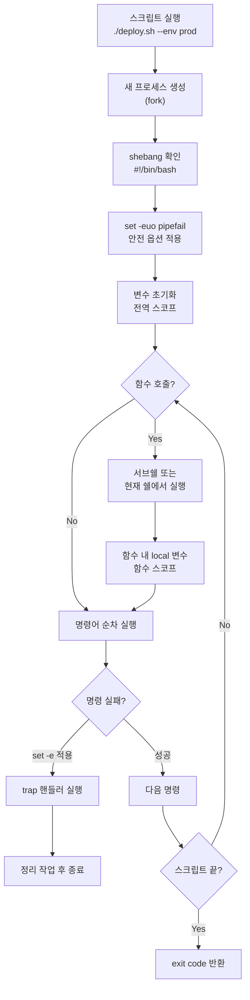
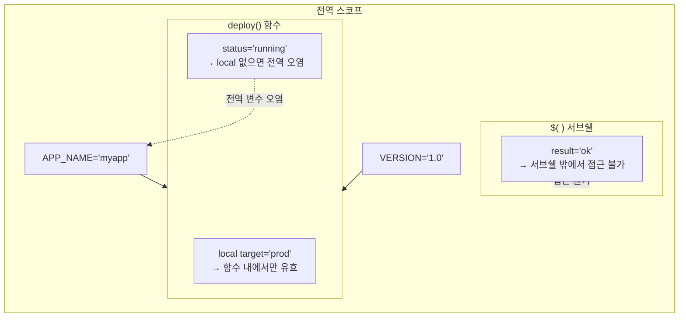
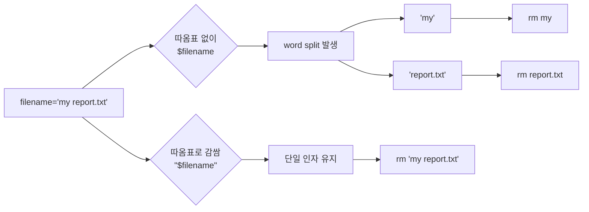

# 쉘 스크립팅

Bash 쉘 스크립트 작성 방법. 반복 작업을 자동화하고 실수를 줄인다.

## 스크립트 기본 구조

모든 스크립트는 이 형태로 시작한다.

```bash
#!/bin/bash
set -euo pipefail

# 여기부터 로직
```

`set -euo pipefail`은 거의 필수다. 빠뜨리면 에러가 발생해도 스크립트가 계속 실행되면서 데이터를 날리는 사고가 생긴다.

| 옵션 | 동작 |
|------|------|
| `-e` | 명령이 실패하면 즉시 종료 |
| `-u` | 정의되지 않은 변수 사용 시 에러 |
| `-o pipefail` | 파이프 중간에 실패한 명령이 있으면 전체 실패 처리 |

```bash
chmod +x script.sh
./script.sh          # shebang 기반 실행
bash script.sh       # bash로 직접 실행
```

shebang(`#!/bin/bash`)이 없으면 `./script.sh` 실행 시 현재 쉘 설정에 따라 다른 인터프리터로 실행될 수 있다. `#!/usr/bin/env bash`를 쓰면 시스템마다 bash 경로가 달라도 동작한다.

## 스크립트 실행 흐름

스크립트가 실행될 때 내부적으로 어떤 순서로 처리되는지 이해해야 디버깅이 가능하다.



## 변수와 스코프

### 기본 변수

```bash
name="value"           # 등호 양쪽에 공백이 있으면 에러
name='value'           # 작은따옴표: 변수 치환 안 됨
name="Hello $USER"     # 큰따옴표: 변수 치환됨
```

변수를 사용할 때는 항상 `${variable}` 형식에 큰따옴표를 씌운다. 이유는 뒤에 나오는 word splitting 절에서 설명한다.

```bash
echo "${name}"          # 권장
echo "${name}_suffix"   # 변수명 경계를 명확히
```

### 특수 변수

```bash
$0       # 스크립트 이름
$1, $2   # 위치 매개변수
$#       # 매개변수 개수
$@       # 모든 매개변수 (개별 단어로 분리)
$*       # 모든 매개변수 (하나의 문자열)
$?       # 마지막 명령어 종료 코드
$$       # 현재 프로세스 PID
$!       # 마지막 백그라운드 프로세스 PID
```

`"$@"`와 `"$*"`의 차이가 중요하다. `"$@"`는 각 인자를 개별 단어로 유지하고, `"$*"`는 하나의 문자열로 합친다. 대부분의 경우 `"$@"`를 써야 한다.

```bash
# 인자: "hello world" "foo bar"
for arg in "$@"; do
    echo "$arg"
done
# 출력:
# hello world
# foo bar

for arg in "$*"; do
    echo "$arg"
done
# 출력:
# hello world foo bar
```

### 변수 스코프

Bash에서 변수 스코프는 다른 언어와 많이 다르다. 함수 안에서 선언한 변수도 기본적으로 전역이다.



```bash
#!/bin/bash

global_var="전역"

my_func() {
    local local_var="로컬"    # 함수 안에서만 유효
    leaked_var="전역 오염"     # local 없으면 전역으로 새어나감
    echo "${local_var}"
}

my_func
echo "${leaked_var}"    # "전역 오염" 출력 — 의도하지 않은 동작
echo "${local_var}"     # 빈 문자열 — local이라 접근 불가
```

함수 안에서 변수를 선언할 때 `local`을 빠뜨리면 다른 함수의 동명 변수를 덮어쓰는 버그가 생긴다. 서브쉘(`$()`)에서 할당한 변수는 밖에서 접근할 수 없다.

```bash
# 서브쉘 함정
value=$(echo "hello")    # value에 "hello" 할당
echo "${value}"          # 정상 출력

(
    inner="서브쉘 내부"
)
echo "${inner}"          # 빈 문자열 — 서브쉘 안에서 할당한 변수
```

### 환경 변수

`export`한 변수만 자식 프로세스에 전달된다.

```bash
MY_VAR="local"
export EXPORTED_VAR="exported"

./child_script.sh
# child_script.sh에서 MY_VAR은 접근 불가
# EXPORTED_VAR은 접근 가능
```

## 조건문

### if 문과 테스트

```bash
if [ "$count" -gt 10 ]; then
    echo "10 초과"
elif [ "$count" -eq 10 ]; then
    echo "정확히 10"
else
    echo "10 미만"
fi
```

`[`은 실제로 `test` 명령이다. `[[`는 Bash 내장 키워드로, 더 많은 기능을 지원한다.

```bash
# [[ ]]에서만 가능한 것들
if [[ "$str" =~ ^[0-9]+$ ]]; then    # 정규표현식
    echo "숫자"
fi

if [[ "$str" == *.log ]]; then       # 패턴 매칭
    echo "로그 파일"
fi
```

| 비교 | 숫자 | 문자열 |
|------|------|--------|
| 같음 | `-eq` | `=` or `==` |
| 다름 | `-ne` | `!=` |
| 큼 | `-gt` | `>` (정렬 순서) |
| 작음 | `-lt` | `<` (정렬 순서) |

파일 테스트:

| 플래그 | 확인 내용 |
|--------|----------|
| `-f` | 일반 파일 존재 |
| `-d` | 디렉토리 존재 |
| `-e` | 파일/디렉토리 존재 |
| `-r` | 읽기 권한 |
| `-w` | 쓰기 권한 |
| `-x` | 실행 권한 |
| `-s` | 파일 크기가 0보다 큼 |

### case 문

```bash
case "${action}" in
    start)
        start_service
        ;;
    stop|kill)       # 여러 패턴을 |로 연결
        stop_service
        ;;
    restart)
        stop_service
        start_service
        ;;
    *)
        echo "Usage: $0 {start|stop|restart}" >&2
        exit 1
        ;;
esac
```

## 반복문

```bash
# 파일 목록 순회
for file in /var/log/*.log; do
    [ -f "$file" ] || continue    # glob 결과가 없으면 패턴 자체가 들어옴
    echo "${file}"
done

# C 스타일
for ((i = 0; i < 10; i++)); do
    echo "${i}"
done

# while + read로 파일 읽기 (가장 자주 쓰는 패턴)
while IFS= read -r line; do
    echo "${line}"
done < input.txt
```

`while read`에서 `IFS=`는 앞뒤 공백을 보존하고, `-r`은 백슬래시를 이스케이프 문자로 해석하지 않게 한다. 둘 다 빠뜨리면 데이터가 깨진다.

파이프와 while을 같이 쓰면 서브쉘 문제가 생긴다:

```bash
# 잘못된 방식 — while이 서브쉘에서 실행됨
count=0
cat file.txt | while IFS= read -r line; do
    count=$((count + 1))
done
echo "${count}"    # 0 출력 — 서브쉘에서 증가한 값은 사라짐

# 올바른 방식 — 리다이렉션 사용
count=0
while IFS= read -r line; do
    count=$((count + 1))
done < file.txt
echo "${count}"    # 정상 출력
```

## 함수

```bash
log_message() {
    local level="$1"
    local message="$2"
    local timestamp
    timestamp=$(date '+%Y-%m-%d %H:%M:%S')
    echo "[${timestamp}] [${level}] ${message}"
}

log_message "INFO" "서비스 시작"
log_message "ERROR" "연결 실패"
```

함수의 return 값은 0~255 사이 정수만 가능하다. 문자열을 반환하려면 `echo`로 출력하고 `$()`로 캡처한다.

```bash
get_hostname() {
    local host
    host=$(hostname -f 2>/dev/null || hostname)
    echo "${host}"
}

current_host=$(get_hostname)
```

## 배열

### 인덱스 배열

```bash
servers=("web01" "web02" "web03")

echo "${servers[0]}"       # web01
echo "${servers[@]}"       # 모든 요소
echo "${#servers[@]}"      # 배열 길이: 3

servers+=("web04")         # 요소 추가

for server in "${servers[@]}"; do
    echo "${server}"
done
```

### 연관 배열 (Bash 4+)

연관 배열은 key-value 구조가 필요할 때 쓴다. 설정값 관리, 카운터 집계 같은 상황에서 유용하다.

```bash
declare -A config

config[db_host]="db.prod.internal"
config[db_port]="5432"
config[db_name]="myapp"
config[max_conn]="100"

echo "DB: ${config[db_host]}:${config[db_port]}/${config[db_name]}"
```

키 순회와 값 접근:

```bash
declare -A error_count

# 로그에서 에러 타입별 집계
while IFS= read -r line; do
    if [[ "${line}" =~ ERROR:\ ([A-Z_]+) ]]; then
        error_type="${BASH_REMATCH[1]}"
        error_count[${error_type}]=$(( ${error_count[${error_type}]:-0} + 1 ))
    fi
done < /var/log/app.log

# 결과 출력
for error_type in "${!error_count[@]}"; do
    echo "${error_type}: ${error_count[${error_type}]}건"
done
```

연관 배열 선언 시 반드시 `declare -A`를 써야 한다. 빠뜨리면 일반 배열로 처리되어 키가 0으로 변환된다.

```bash
# 환경별 설정 매핑
declare -A env_config
env_config[prod]="https://api.prod.example.com"
env_config[staging]="https://api.staging.example.com"
env_config[dev]="http://localhost:8080"

target="${1:-dev}"
api_url="${env_config[${target}]}"

if [ -z "${api_url}" ]; then
    echo "알 수 없는 환경: ${target}" >&2
    exit 1
fi
```

## 문자열 처리

```bash
str="Hello World"

# 길이
echo "${#str}"                 # 11

# 슬라이싱
echo "${str:0:5}"              # Hello
echo "${str:6}"                # World

# 치환
echo "${str/World/Linux}"      # 첫 번째만
echo "${str//o/O}"             # 전체

# 제거 (파일 경로 조작에 자주 사용)
filepath="/var/log/app/error.log"
echo "${filepath%/*}"          # /var/log/app  (디렉토리)
echo "${filepath##*/}"         # error.log     (파일명)
echo "${filepath%.log}"        # /var/log/app/error  (확장자 제거)
```

`%`는 뒤에서부터, `#`는 앞에서부터 제거한다. `%%`와 `##`는 가장 길게 매칭한다. 파일 경로를 분리할 때 `dirname`/`basename` 대신 이 패턴을 쓰면 외부 명령 호출 없이 처리할 수 있다.

### 기본값 설정

```bash
# 변수가 비어있으면 기본값 사용
db_host="${DB_HOST:-localhost}"
db_port="${DB_PORT:-5432}"

# 변수가 비어있으면 기본값 할당
: "${LOG_DIR:=/var/log/myapp}"
```

## getopts를 이용한 인자 파싱

스크립트에 옵션을 추가할 때 `$1`, `$2`를 직접 파싱하면 순서가 바뀌거나 옵션이 추가될 때마다 코드가 복잡해진다. `getopts`를 쓰면 `-h`, `-v`, `-f filename` 같은 표준적인 CLI 인터페이스를 만들 수 있다.

```bash
#!/bin/bash
set -euo pipefail

usage() {
    cat <<EOF
Usage: $(basename "$0") [OPTIONS] <target>

OPTIONS:
    -e ENV      환경 지정 (prod|staging|dev) [기본: dev]
    -p PORT     포트 번호 [기본: 8080]
    -d          dry-run 모드
    -v          상세 출력
    -h          이 도움말 출력
EOF
    exit "${1:-0}"
}

# 기본값
env="dev"
port="8080"
dry_run=false
verbose=false

while getopts ":e:p:dvh" opt; do
    case "${opt}" in
        e) env="${OPTARG}" ;;
        p) port="${OPTARG}" ;;
        d) dry_run=true ;;
        v) verbose=true ;;
        h) usage 0 ;;
        :)
            echo "옵션 -${OPTARG}에 인자가 필요합니다" >&2
            usage 1
            ;;
        \?)
            echo "알 수 없는 옵션: -${OPTARG}" >&2
            usage 1
            ;;
    esac
done
shift $((OPTIND - 1))

# 필수 인자 확인
if [ $# -lt 1 ]; then
    echo "target을 지정해야 합니다" >&2
    usage 1
fi

target="$1"

if "${verbose}"; then
    echo "환경: ${env}, 포트: ${port}, 대상: ${target}"
fi

if "${dry_run}"; then
    echo "[DRY-RUN] 배포하지 않음"
    exit 0
fi
```

`getopts` 사용 시 주의할 점:

- 옵션 문자열 앞에 `:`을 붙이면 에러를 직접 처리할 수 있다 (silent mode)
- `e:` — 콜론이 뒤에 붙으면 해당 옵션은 인자를 받는다
- `shift $((OPTIND - 1))` — 파싱이 끝난 후 위치 매개변수를 밀어서 나머지 인자에 접근한다
- getopts는 long option(`--env`)을 지원하지 않는다. 필요하면 `getopt`(외부 명령)을 쓰거나 직접 파싱한다

### 실제 CLI 도구 작성 패턴

운영 환경에서 쓸 스크립트를 만들 때는 이런 구조를 따른다:

```bash
#!/bin/bash
set -euo pipefail

readonly SCRIPT_DIR="$(cd "$(dirname "$0")" && pwd)"
readonly SCRIPT_NAME="$(basename "$0")"

# 색상 (터미널 출력용)
if [ -t 1 ]; then
    RED='\033[0;31m'
    GREEN='\033[0;32m'
    YELLOW='\033[0;33m'
    NC='\033[0m'
else
    RED='' GREEN='' YELLOW='' NC=''
fi

log_info()  { echo -e "${GREEN}[INFO]${NC} $*"; }
log_warn()  { echo -e "${YELLOW}[WARN]${NC} $*" >&2; }
log_error() { echo -e "${RED}[ERROR]${NC} $*" >&2; }
die()       { log_error "$@"; exit 1; }

# 의존성 확인
require_cmd() {
    command -v "$1" >/dev/null 2>&1 || die "'$1' 명령이 필요합니다"
}

require_cmd curl
require_cmd jq
```

`command -v`로 명령 존재 여부를 확인한다. `which`는 쉘에 따라 동작이 다르므로 `command -v`가 더 안정적이다.

## trap과 시그널 핸들링

### 임시 파일 정리 패턴

스크립트가 중간에 실패하거나 Ctrl+C로 중단되면 임시 파일이 남는다. `trap`으로 반드시 정리한다.

```bash
#!/bin/bash
set -euo pipefail

TMPDIR=""

cleanup() {
    local exit_code=$?
    if [ -n "${TMPDIR}" ] && [ -d "${TMPDIR}" ]; then
        rm -rf "${TMPDIR}"
    fi
    exit "${exit_code}"
}

trap cleanup EXIT    # 정상 종료, 에러, 시그널 모두 포함

TMPDIR=$(mktemp -d)

# 이후 임시 파일은 모두 TMPDIR 안에 생성
curl -sS "https://api.example.com/data" > "${TMPDIR}/response.json"
jq '.results[]' "${TMPDIR}/response.json" > "${TMPDIR}/parsed.json"
# ...
```

`trap ... EXIT`은 정상 종료, 에러 종료, 시그널 종료 모든 경우에 실행된다. `INT`나 `TERM`을 따로 잡을 필요가 없다 — `EXIT` 하나면 충분하다.

`mktemp -d`로 임시 디렉토리를 만들고, 모든 임시 파일을 그 안에 넣으면 정리가 간단하다. `/tmp/myapp_XXXX` 같은 이름을 직접 만들면 경쟁 조건(race condition)이 생길 수 있다.

### 시그널별 처리가 필요한 경우

graceful shutdown이 필요한 데몬 스크립트에서는 시그널을 구분해서 처리한다:

```bash
#!/bin/bash
set -euo pipefail

PID_FILE="/var/run/myworker.pid"
RUNNING=true

shutdown() {
    log_info "종료 시그널 수신, 현재 작업 완료 후 종료"
    RUNNING=false
}

trap shutdown SIGTERM SIGINT
trap 'rm -f "${PID_FILE}"' EXIT

echo $$ > "${PID_FILE}"

while "${RUNNING}"; do
    # 작업 처리
    process_next_job || true
    sleep 5
done

log_info "정상 종료"
```

### lock 파일로 중복 실행 방지

cron으로 스크립트를 실행할 때 이전 실행이 아직 끝나지 않은 상태에서 다시 실행되는 문제가 자주 발생한다.

```bash
#!/bin/bash
set -euo pipefail

LOCK_FILE="/var/lock/myapp_deploy.lock"

acquire_lock() {
    if ! mkdir "${LOCK_FILE}" 2>/dev/null; then
        # lock 디렉토리의 PID 파일 확인
        if [ -f "${LOCK_FILE}/pid" ]; then
            local old_pid
            old_pid=$(cat "${LOCK_FILE}/pid")
            if kill -0 "${old_pid}" 2>/dev/null; then
                die "이미 실행 중 (PID: ${old_pid})"
            fi
            # 프로세스가 죽었으면 stale lock — 제거 후 재시도
            rm -rf "${LOCK_FILE}"
            mkdir "${LOCK_FILE}"
        fi
    fi
    echo $$ > "${LOCK_FILE}/pid"
}

release_lock() {
    rm -rf "${LOCK_FILE}"
}

trap release_lock EXIT
acquire_lock
```

`mkdir`은 원자적(atomic) 연산이라 두 프로세스가 동시에 실행되어도 하나만 성공한다. `flock`을 쓸 수 있는 환경이라면 더 간단하다:

```bash
exec 9>"${LOCK_FILE}"
flock -n 9 || die "이미 실행 중"
```

## ShellCheck와 흔한 함정

### ShellCheck 사용

ShellCheck는 쉘 스크립트의 정적 분석 도구다. 설치하고 반드시 사용한다.

```bash
# 설치
apt install shellcheck    # Debian/Ubuntu
brew install shellcheck   # macOS

# 실행
shellcheck script.sh
shellcheck -s bash script.sh    # Bash 문법 기준으로 검사
```

CI에 넣어두면 리뷰 전에 기본적인 문제를 잡을 수 있다:

```yaml
# .github/workflows/lint.yml
- name: ShellCheck
  run: find scripts/ -name '*.sh' -exec shellcheck {} +
```

### Word Splitting

Bash에서 가장 많은 버그를 만드는 원인이다. 변수에 공백이 포함되면 여러 단어로 분리된다.

```bash
filename="my document.txt"

# 잘못된 예 — word splitting 발생
rm $filename
# 실제 실행: rm my document.txt → 파일 두 개를 삭제하려고 시도

# 올바른 예
rm "${filename}"
# 실제 실행: rm "my document.txt"
```



배열을 사용할 때도 마찬가지다:

```bash
files=("file one.txt" "file two.txt")

# 잘못된 예
for f in ${files[@]}; do    # 공백에서 쪼개짐
    echo "$f"
done
# 출력: file / one.txt / file / two.txt

# 올바른 예
for f in "${files[@]}"; do
    echo "$f"
done
# 출력: file one.txt / file two.txt
```

### Glob 확장

인용 부호 없는 변수는 glob 패턴으로도 확장된다.

```bash
message="파일이 * 개 있습니다"

echo $message
# "파일이 file1.txt file2.txt ... 개 있습니다" — 현재 디렉토리 파일 목록으로 확장됨

echo "${message}"
# "파일이 * 개 있습니다" — 의도한 대로 출력
```

### 자주 걸리는 함정들

**변수 할당 시 공백:**

```bash
name = "value"    # 에러! name이라는 명령을 =, "value" 인자로 실행
name="value"      # 정상
```

**[[ ]] 안에서 변수 인용:**

```bash
# [ ]에서는 반드시 인용 필요
if [ -z $var ]; then     # var가 비어있으면 문법 에러
if [ -z "$var" ]; then   # 정상

# [[ ]]에서는 word splitting이 일어나지 않아서 인용 없이도 동작하지만
# 습관적으로 인용하는 게 안전하다
```

**명령 치환에서 줄바꿈 소실:**

```bash
# 마지막 줄바꿈이 제거됨
output=$(printf "hello\n\n\n")
echo "${output}"    # "hello" — 뒤의 줄바꿈 전부 사라짐
```

**산술 확장에서 앞에 0이 붙은 숫자:**

```bash
num="08"
echo $((num))    # 에러! 0으로 시작하면 8진수로 해석하는데 08은 8진수가 아님
echo $((10#num)) # 10진수로 강제 해석
```

## 입출력과 리다이렉션

```bash
# 표준 출력과 표준 에러를 분리
command > stdout.log 2> stderr.log

# 표준 에러를 표준 출력으로 합침
command > all.log 2>&1

# /dev/null로 출력 버림
command > /dev/null 2>&1

# Here Document
cat <<EOF
Hello ${USER}
현재 시각: $(date)
EOF

# Here String
grep "error" <<< "${log_content}"
```

### read로 사용자 입력 받기

```bash
read -p "계속하시겠습니까? (y/N) " -r answer
if [[ "${answer}" =~ ^[Yy]$ ]]; then
    echo "진행"
else
    echo "취소"
    exit 0
fi

read -s -p "비밀번호: " password    # 화면에 안 보임
echo                                 # 줄바꿈 추가
read -t 10 -p "입력 (10초): " input  # 타임아웃
```

## 산술 연산

```bash
result=$((10 + 5))
result=$((a * b))          # 이스케이프 불필요
result=$((a > b ? a : b))  # 삼항 연산자도 가능

# 증감
((count++))
((total += amount))
```

`$(( ))`를 쓴다. `expr`은 느리고 구문이 불편하므로 쓸 이유가 없다.

소수점 계산은 Bash가 지원하지 않는다. `bc`나 `awk`를 사용한다:

```bash
result=$(echo "scale=2; 10 / 3" | bc)    # 3.33
```

## 디버깅

```bash
bash -n script.sh     # 문법 검사만 (실행 안 함)
bash -x script.sh     # 각 명령을 실행 전에 출력

# 스크립트 내부에서 구간 디버깅
set -x
# 디버깅 대상 구간
set +x
```

`PS4` 변수를 설정하면 `-x` 출력에 파일명과 줄 번호가 나온다:

```bash
export PS4='+${BASH_SOURCE}:${LINENO}: '
bash -x script.sh
# 출력: +script.sh:15: echo hello
```

## 실무 스크립트 예제

### 배포 스크립트

```bash
#!/bin/bash
set -euo pipefail

readonly SCRIPT_DIR="$(cd "$(dirname "$0")" && pwd)"
readonly APP_NAME="myapp"
readonly DEPLOY_USER="deploy"

TMPDIR=""

cleanup() {
    local exit_code=$?
    [ -n "${TMPDIR}" ] && rm -rf "${TMPDIR}"
    exit "${exit_code}"
}
trap cleanup EXIT

usage() {
    echo "Usage: $(basename "$0") -e <env> -t <tag> [-d]"
    exit 1
}

env=""
tag=""
dry_run=false

while getopts ":e:t:dh" opt; do
    case "${opt}" in
        e) env="${OPTARG}" ;;
        t) tag="${OPTARG}" ;;
        d) dry_run=true ;;
        h) usage ;;
        *) usage ;;
    esac
done

[ -z "${env}" ] || [ -z "${tag}" ] && usage

declare -A DEPLOY_HOSTS
DEPLOY_HOSTS[prod]="prod01.internal prod02.internal"
DEPLOY_HOSTS[staging]="staging01.internal"

hosts="${DEPLOY_HOSTS[${env}]:-}"
[ -z "${hosts}" ] && { echo "알 수 없는 환경: ${env}" >&2; exit 1; }

TMPDIR=$(mktemp -d)
artifact="${TMPDIR}/${APP_NAME}-${tag}.tar.gz"

echo "아티팩트 다운로드: ${tag}"
if ! "${dry_run}"; then
    curl -sS -o "${artifact}" \
        "https://artifacts.internal/${APP_NAME}/${tag}.tar.gz"
fi

for host in ${hosts}; do
    echo "배포: ${host}"
    if "${dry_run}"; then
        echo "  [DRY-RUN] skip"
        continue
    fi

    scp "${artifact}" "${DEPLOY_USER}@${host}:/opt/${APP_NAME}/releases/"
    # shellcheck disable=SC2029
    ssh "${DEPLOY_USER}@${host}" \
        "cd /opt/${APP_NAME} && \
         tar xzf releases/${APP_NAME}-${tag}.tar.gz -C current/ && \
         sudo systemctl restart ${APP_NAME}"

    echo "  완료"
done
```

### 헬스체크 스크립트

```bash
#!/bin/bash
set -euo pipefail

declare -A SERVICES
SERVICES[api]="http://localhost:8080/health"
SERVICES[admin]="http://localhost:8081/health"
SERVICES[worker]="http://localhost:9090/health"

MAX_RETRIES=3
RETRY_INTERVAL=5
ALERT_WEBHOOK="${ALERT_WEBHOOK:-}"

check_service() {
    local name="$1"
    local url="$2"
    local attempt

    for ((attempt = 1; attempt <= MAX_RETRIES; attempt++)); do
        local http_code
        http_code=$(curl -s -o /dev/null -w '%{http_code}' \
            --max-time 5 "${url}" 2>/dev/null) || true

        if [ "${http_code}" = "200" ]; then
            return 0
        fi

        if [ "${attempt}" -lt "${MAX_RETRIES}" ]; then
            sleep "${RETRY_INTERVAL}"
        fi
    done

    return 1
}

send_alert() {
    local message="$1"
    if [ -n "${ALERT_WEBHOOK}" ]; then
        curl -sS -X POST "${ALERT_WEBHOOK}" \
            -H "Content-Type: application/json" \
            -d "{\"text\": \"${message}\"}" > /dev/null
    fi
    echo "[ALERT] ${message}" >&2
}

failed=()

for service in "${!SERVICES[@]}"; do
    url="${SERVICES[${service}]}"
    if check_service "${service}" "${url}"; then
        echo "[OK] ${service}"
    else
        echo "[FAIL] ${service} — ${url}"
        failed+=("${service}")
    fi
done

if [ ${#failed[@]} -gt 0 ]; then
    hostname=$(hostname -f 2>/dev/null || hostname)
    send_alert "[${hostname}] 서비스 다운: ${failed[*]}"
    exit 1
fi
```

cron에 등록해서 주기적으로 실행한다:

```bash
# /etc/cron.d/healthcheck
*/2 * * * * deploy /opt/scripts/healthcheck.sh >> /var/log/healthcheck.log 2>&1
```

### 로그 로테이션 스크립트

logrotate를 쓸 수 없는 환경(컨테이너, 임베디드)에서 직접 로테이션을 구현하는 경우:

```bash
#!/bin/bash
set -euo pipefail

LOG_DIR="/var/log/myapp"
MAX_SIZE=$((100 * 1024 * 1024))    # 100MB
KEEP_COUNT=5

rotate_log() {
    local log_file="$1"
    local size

    if [ ! -f "${log_file}" ]; then
        return
    fi

    size=$(stat -f%z "${log_file}" 2>/dev/null || stat -c%s "${log_file}")

    if [ "${size}" -lt "${MAX_SIZE}" ]; then
        return
    fi

    # 오래된 파일부터 밀기
    local i
    for ((i = KEEP_COUNT - 1; i >= 1; i--)); do
        local prev=$((i - 1))
        local src="${log_file}.${prev}.gz"
        local dst="${log_file}.${i}.gz"
        [ -f "${src}" ] && mv "${src}" "${dst}"
    done

    # 현재 로그를 .0으로 이동하고 압축
    mv "${log_file}" "${log_file}.0"
    gzip "${log_file}.0"

    # 애플리케이션에 로그 파일 재오픈 시그널
    local pid_file="${LOG_DIR}/app.pid"
    if [ -f "${pid_file}" ]; then
        local pid
        pid=$(cat "${pid_file}")
        kill -USR1 "${pid}" 2>/dev/null || true
    fi

    # 빈 로그 파일 생성
    touch "${log_file}"
}

for log_file in "${LOG_DIR}"/*.log; do
    [ -f "${log_file}" ] || continue
    rotate_log "${log_file}"
done
```

`stat` 명령의 옵션이 macOS(`-f%z`)와 Linux(`-c%s`)에서 다르다. 두 환경을 모두 지원하려면 위처럼 fallback을 넣는다.

## 정리

| 습관 | 이유 |
|------|------|
| `set -euo pipefail` 필수 | 에러를 무시하고 넘어가는 사고 방지 |
| 변수는 항상 `"${var}"` | word splitting, glob 확장 방지 |
| 함수 내 `local` 사용 | 전역 변수 오염 방지 |
| `trap cleanup EXIT` | 임시 파일 잔류 방지 |
| `mktemp`으로 임시 파일 생성 | 경쟁 조건 방지 |
| ShellCheck 적용 | 코드 리뷰 전에 기본 실수 제거 |
| `command -v`로 의존성 확인 | 명령이 없을 때 의미 없는 에러 메시지 대신 명확한 안내 |
