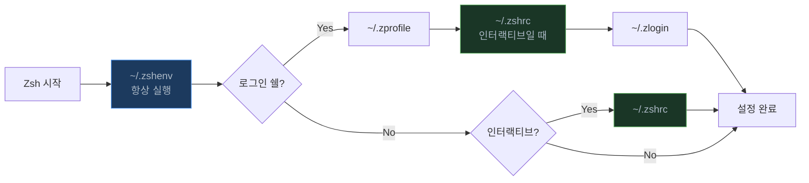

# 환경 변수 및 PATH

## 개요

환경 변수는 프로세스가 실행될 때 상속받는 key-value 쌍이다. 서버 설정, 애플리케이션 동작, 명령어 탐색 경로 등을 제어한다. 환경 변수 하나 잘못 설정해서 배포가 터지는 경우가 생각보다 많다.

## 환경 변수 확인

### env

모든 환경 변수를 확인한다.

```bash
env
env | grep PATH
```

### printenv

특정 환경 변수를 출력한다.

```bash
printenv
printenv PATH
printenv HOME
```

`env`와 `printenv`의 차이점은 `printenv`는 인자를 받아 특정 변수만 출력할 수 있다는 것이다. `env`는 단독으로 쓰거나 명령어 실행 시 환경을 바꾸는 용도로 쓴다.

### echo

```bash
echo $PATH
echo ${PATH}                     # 명시적 형식 (권장)
echo $HOME
```

변수명 뒤에 문자열이 붙는 경우 `${VARIABLE}` 형식을 써야 한다. `echo $VARname`은 `VARname`이라는 변수를 찾기 때문이다.

## 환경 변수 설정

### 임시 설정

```bash
export VAR="value"               # 현재 세션 + 자식 프로세스
VAR="value"                      # 현재 쉘에서만 (자식 프로세스에 전달 안 됨)
```

`export` 없이 변수를 선언하면 쉘 변수이지 환경 변수가 아니다. 스크립트나 자식 프로세스에서 접근이 안 되므로 주의한다.

```bash
# export 없이 선언
DB_HOST="localhost"
bash -c 'echo $DB_HOST'          # 출력 없음

# export로 선언
export DB_HOST="localhost"
bash -c 'echo $DB_HOST'          # localhost
```

### 영구 설정

```bash
# ~/.bashrc에 추가
export VAR="value"

# 적용
source ~/.bashrc
# 또는
. ~/.bashrc
```

`source`를 빼먹고 "왜 적용 안 되지?" 하는 경우가 많다. 터미널을 새로 열거나 `source`를 실행해야 반영된다.

## 주요 환경 변수

### PATH

명령어 실행 파일을 찾는 디렉토리 목록이다. 콜론(`:`)으로 구분한다.

```bash
echo $PATH
# /usr/local/bin:/usr/bin:/bin:/usr/local/sbin:/usr/sbin:/sbin
```

**PATH 추가:**

```bash
export PATH=$PATH:/new/path       # 뒤에 추가 (우선순위 낮음)
export PATH=/new/path:$PATH       # 앞에 추가 (우선순위 높음)
```

PATH는 왼쪽부터 탐색한다. 같은 이름의 바이너리가 여러 경로에 있으면 먼저 발견된 것이 실행된다.

### HOME

사용자의 홈 디렉토리.

```bash
echo $HOME
# /home/username
```

### USER

현재 사용자 이름.

```bash
echo $USER
```

### SHELL

현재 기본 쉘 경로. 실행 중인 쉘이 아니라 `/etc/passwd`에 설정된 기본 쉘이다.

```bash
echo $SHELL
# /bin/bash

# 실제 실행 중인 쉘 확인
echo $0
ps -p $$
```

### LANG / LC_ALL

로케일 설정. 서버에서 한글이 깨지면 이 값부터 확인한다.

```bash
export LANG=ko_KR.UTF-8
export LC_ALL=ko_KR.UTF-8
```

`LC_ALL`은 모든 `LC_*` 변수를 덮어쓴다. 개별 설정이 필요하면 `LC_ALL`은 건드리지 않는다.

## 쉘 설정 파일 로딩 순서

쉘이 시작될 때 어떤 설정 파일을 읽는지는 두 가지 조건에 따라 달라진다: **로그인 쉘인지**, **인터랙티브 쉘인지**.

### 플로우차트

```mermaid
flowchart TD
    A[쉘 시작] --> B{로그인 쉘?}
    B -- Yes --> C[/etc/profile 실행]
    C --> D{~/.bash_profile 존재?}
    D -- Yes --> E[~/.bash_profile 실행]
    D -- No --> F{~/.bash_login 존재?}
    F -- Yes --> G[~/.bash_login 실행]
    F -- No --> H{~/.profile 존재?}
    H -- Yes --> I[~/.profile 실행]
    H -- No --> J[설정 없이 시작]
    E --> K[쉘 준비 완료]
    G --> K
    I --> K
    J --> K

    B -- No --> L{인터랙티브 쉘?}
    L -- Yes --> M[~/.bashrc 실행]
    L -- No --> N{BASH_ENV 설정?}
    N -- Yes --> O["$BASH_ENV 파일 실행"]
    N -- No --> P[설정 없이 시작]
    M --> K
    O --> K
    P --> K

    style A fill:#2d333b,stroke:#768390,color:#adbac7
    style B fill:#1c3a5e,stroke:#539bf5,color:#adbac7
    style L fill:#1c3a5e,stroke:#539bf5,color:#adbac7
    style K fill:#1a3626,stroke:#57ab5a,color:#adbac7
```

핵심 포인트:

- **로그인 쉘**: SSH 접속, `su -`, 콘솔 로그인 시 실행된다. `~/.bash_profile`, `~/.bash_login`, `~/.profile` 중 **먼저 발견된 하나만** 읽는다. 세 개 다 있어도 하나만 실행된다.
- **비로그인 인터랙티브 쉘**: 터미널 에뮬레이터에서 새 탭을 열 때 실행된다. `~/.bashrc`만 읽는다.
- **비인터랙티브 쉘**: 스크립트 실행 시. `BASH_ENV`가 설정되어 있으면 해당 파일을 읽는다.

현재 쉘이 로그인 쉘인지 확인하는 방법:

```bash
shopt -q login_shell && echo "login shell" || echo "non-login shell"
# 또는
echo $0
# -bash 면 로그인 쉘 (앞에 - 붙음)
```

### 설정 파일 간 관계

실무에서는 `~/.bash_profile`에서 `~/.bashrc`를 source하는 패턴을 쓴다. 이렇게 하면 로그인 쉘이든 아니든 `~/.bashrc` 설정이 항상 적용된다.

```bash
# ~/.bash_profile
if [ -f ~/.bashrc ]; then
    . ~/.bashrc
fi

# 로그인 쉘에서만 필요한 설정
export PATH=$PATH:$HOME/bin
```

```bash
# ~/.bashrc
# PATH 추가
export PATH=$PATH:/usr/local/bin

# 환경 변수
export EDITOR=vim
export LANG=ko_KR.UTF-8

# 별칭
alias ll='ls -lh'
alias la='ls -lah'
```

### Zsh의 경우

Zsh는 Bash와 로딩 순서가 다르다. macOS 기본 쉘이 Zsh로 바뀐 뒤로 이 차이를 모르면 혼란스러운 경우가 있다.



Bash와의 차이: `~/.zshenv`는 **항상** 실행된다. 스크립트 실행 시에도 읽히므로 여기에 무거운 초기화를 넣으면 모든 쉘 명령이 느려진다. `~/.zshenv`에는 꼭 필요한 변수만 넣는다.

## 시스템 전체 설정

### /etc/profile

모든 사용자의 로그인 쉘에서 읽는다.

```bash
# /etc/profile
export PATH=$PATH:/usr/local/bin
```

### /etc/environment

시스템 전체 환경 변수. Debian/Ubuntu 계열에서 사용한다. 쉘 문법이 아니라 `KEY=VALUE` 형식이다.

```bash
# /etc/environment
PATH="/usr/local/sbin:/usr/local/bin:/usr/sbin:/usr/bin:/sbin:/bin"
JAVA_HOME="/usr/lib/jvm/java-11-openjdk"
```

`export`를 쓰면 안 된다. PAM이 읽는 파일이라 쉘 문법을 지원하지 않는다.

### /etc/profile.d/

디렉토리에 `.sh` 파일을 넣으면 `/etc/profile` 실행 시 자동으로 source된다. 시스템 전체 설정을 관리할 때 `/etc/profile`을 직접 수정하는 것보다 이 방식이 낫다.

```bash
# /etc/profile.d/custom-path.sh
export PATH=$PATH:/opt/myapp/bin
```

## PATH 충돌 디버깅

여러 버전의 같은 도구가 설치되어 있거나, PATH 순서가 꼬여서 엉뚱한 바이너리가 실행되는 경우가 자주 발생한다.

### 어떤 바이너리가 실행되는지 확인

```bash
# 가장 먼저 발견되는 실행 파일
which python
# /usr/bin/python

# 같은 이름의 모든 실행 파일
which -a python
# /usr/local/bin/python
# /usr/bin/python

# 더 상세한 정보 (파일 타입, 경로)
type python
# python is /usr/bin/python

type -a python
# python is /usr/local/bin/python
# python is /usr/bin/python
```

### PATH를 보기 좋게 출력

```bash
echo $PATH | tr ':' '\n'
# /usr/local/bin
# /usr/bin
# /bin
# /usr/local/sbin
# ...
```

### 흔한 PATH 충돌 시나리오

**1. pyenv/rbenv/nvm 설치 후 시스템 버전이 실행되는 경우**

버전 관리 도구는 PATH 앞에 shim 디렉토리를 추가해서 동작한다. 설정 파일에서 `eval` 초기화가 PATH 추가보다 뒤에 있으면 제대로 작동하지 않는다.

```bash
# 잘못된 순서
export PATH=$PATH:$HOME/.local/bin
eval "$(pyenv init -)"            # pyenv shim이 PATH 앞에 추가됨 - OK

# 확인
which python
# ~/.pyenv/shims/python 이면 정상
# /usr/bin/python 이면 pyenv init이 실행 안 된 것
```

**2. Homebrew와 시스템 바이너리 충돌 (macOS)**

macOS에서 Homebrew로 설치한 도구와 시스템 기본 도구가 겹치는 경우가 많다.

```bash
which git
# /usr/bin/git  <- 시스템 기본 (오래된 버전)

# Homebrew 경로가 PATH 앞에 있는지 확인
echo $PATH | tr ':' '\n' | head -5

# Apple Silicon Mac
export PATH="/opt/homebrew/bin:$PATH"

# Intel Mac
export PATH="/usr/local/bin:$PATH"
```

**3. 같은 변수를 여러 설정 파일에서 설정하는 경우**

`~/.bashrc`, `~/.bash_profile`, `/etc/profile` 등에서 같은 PATH를 중복 추가하면 PATH가 점점 길어진다. 디버깅이 어려워지고, 드물지만 PATH 길이 제한에 걸리는 경우도 있다.

```bash
# PATH 중복 제거 (현재 세션)
PATH=$(echo $PATH | tr ':' '\n' | awk '!seen[$0]++' | tr '\n' ':' | sed 's/:$//')
export PATH
```

### PATH 디버깅 순서

문제가 생겼을 때 확인하는 순서:

```bash
# 1. 어떤 바이너리가 실행되는지
which -a <command>
type -a <command>

# 2. 현재 PATH 확인
echo $PATH | tr ':' '\n' | nl

# 3. 설정 파일에서 PATH를 건드리는 부분 찾기
grep -n 'PATH' ~/.bashrc ~/.bash_profile ~/.zshrc ~/.zprofile 2>/dev/null

# 4. 로그인 쉘로 새로 시작해서 비교
bash --login
echo $PATH | tr ':' '\n' | nl
```

## 환경 변수 파라미터 확장

쉘 스크립트에서 환경 변수의 기본값 처리, 존재 여부 확인 등에 쓴다.

```bash
# 기본값 (변수가 없거나 빈 문자열일 때)
${VAR:-default}                   # default를 반환하지만 VAR는 안 바뀜
${VAR:=default}                   # default를 반환하고 VAR에 대입

# 변수가 있을 때만
${VAR:+value}                     # VAR가 있으면 value, 없으면 빈 문자열

# 변수가 없으면 에러
${VAR:?error message}             # VAR가 없으면 에러 메시지 출력 후 종료
```

실무에서 많이 쓰는 패턴:

```bash
# 설정 파일에서 기본값 지정
DB_HOST=${DB_HOST:-localhost}
DB_PORT=${DB_PORT:-5432}

# 필수 환경 변수 검증 (없으면 스크립트 종료)
: ${DATABASE_URL:?"DATABASE_URL이 설정되지 않았습니다"}
: ${API_KEY:?"API_KEY가 설정되지 않았습니다"}
```

## 환경 변수 보안

### 민감한 정보 관리

```bash
# 하면 안 되는 것 (히스토리에 남음)
export PASSWORD="secret"

# 파일로 관리
# ~/.env.local
export DB_PASSWORD="secret"
export API_KEY="sk-xxx"

# 로드
source ~/.env.local
```

파일 권한을 반드시 제한한다:

```bash
chmod 600 ~/.env.local            # 소유자만 읽기/쓰기
```

### 주의사항

- `env`나 `printenv` 명령으로 누구나 환경 변수를 볼 수 있다. `/proc/<pid>/environ`에서도 확인 가능하다.
- Docker에서 `-e` 플래그로 전달한 환경 변수는 `docker inspect`로 노출된다.
- CI/CD 로그에 환경 변수가 찍히지 않도록 주의한다.

## 애플리케이션별 환경 변수

### Java

```bash
export JAVA_HOME=/usr/lib/jvm/java-17-openjdk
export PATH=$PATH:$JAVA_HOME/bin

# 여러 버전 관리 시
# update-alternatives --config java
```

### Node.js

```bash
export NODE_ENV=production
export NODE_OPTIONS="--max-old-space-size=4096"
```

### Python

```bash
export PYTHONPATH=/app/lib
export PYTHONUNBUFFERED=1          # 컨테이너에서 로그 즉시 출력
export PYTHONDONTWRITEBYTECODE=1   # .pyc 파일 생성 방지
```

## Dotfiles 관리

서버를 여러 대 관리하거나, 새 장비를 셋업할 때마다 설정 파일을 하나씩 복사하는 건 시간 낭비다. Git으로 dotfiles를 관리하면 어디서든 동일한 환경을 만들 수 있다.

### Git bare repository 방식

가장 많이 쓰이는 방법이다. 홈 디렉토리 전체를 작업 디렉토리로 쓰되, `.git` 디렉토리를 별도 위치에 둔다.

```bash
# 초기 설정
git init --bare $HOME/.dotfiles

# alias 등록 (~/.bashrc에 추가)
alias dotfiles='git --git-dir=$HOME/.dotfiles --work-tree=$HOME'

# 추적하지 않는 파일 숨기기
dotfiles config --local status.showUntrackedFiles no

# 사용
dotfiles add ~/.bashrc ~/.vimrc
dotfiles commit -m "bashrc, vimrc 추가"
dotfiles push origin main
```

다른 서버에서 복원:

```bash
git clone --bare <repo-url> $HOME/.dotfiles
alias dotfiles='git --git-dir=$HOME/.dotfiles --work-tree=$HOME'
dotfiles checkout
```

### 심볼릭 링크 방식

dotfiles 디렉토리를 따로 두고, 홈 디렉토리에 심볼릭 링크를 거는 방법이다. GNU Stow를 쓰면 편하다.

```bash
# 디렉토리 구조
~/dotfiles/
  bash/
    .bashrc
    .bash_profile
  vim/
    .vimrc
  git/
    .gitconfig

# stow로 심볼릭 링크 생성
cd ~/dotfiles
stow bash                         # ~/dotfiles/bash/.bashrc -> ~/.bashrc
stow vim
stow git
```

### dotfiles에 넣으면 안 되는 것

- 비밀번호, API 키, 토큰이 포함된 파일
- `.env`, `.env.local` 같은 환경별 설정
- SSH 개인키 (`~/.ssh/id_rsa`)

`.gitignore`에 반드시 추가한다.

## 프로젝트별 환경 변수: direnv

프로젝트마다 다른 환경 변수가 필요한 경우가 있다. 프로젝트 A는 Python 3.9, 프로젝트 B는 Python 3.11을 쓴다거나, 각 프로젝트마다 다른 AWS 프로파일을 쓰는 경우다.

`direnv`는 디렉토리에 진입하면 자동으로 환경 변수를 로드하고, 나가면 원래대로 복원하는 도구다.

### 설치 및 설정

```bash
# Ubuntu/Debian
sudo apt install direnv

# macOS
brew install direnv

# 쉘 훅 등록 (~/.bashrc에 추가)
eval "$(direnv hook bash)"

# Zsh는 ~/.zshrc에
eval "$(direnv hook zsh)"
```

### 사용법

```bash
# 프로젝트 디렉토리에 .envrc 파일 생성
cd ~/projects/my-api
cat > .envrc << 'EOF'
export DATABASE_URL="postgres://localhost:5432/myapi_dev"
export AWS_PROFILE=myapi-dev
export FLASK_ENV=development
EOF

# 허용 (보안상 최초 1회 필요)
direnv allow

# 이제 디렉토리에 들어가면 자동 로드
cd ~/projects/my-api
# direnv: loading .envrc
echo $DATABASE_URL
# postgres://localhost:5432/myapi_dev

# 나가면 자동 해제
cd ~
# direnv: unloading
echo $DATABASE_URL
# (빈 값)
```

### .envrc 활용 패턴

```bash
# Python 가상환경 자동 활성화
layout python3

# Node.js 버전 자동 전환 (nvm 연동)
use node 18

# .env 파일 로드
dotenv

# 조건부 설정
if [ -f .env.local ]; then
    dotenv .env.local
fi

# PATH에 프로젝트 bin 추가
PATH_add bin
PATH_add scripts
```

### 팀에서 사용할 때

`.envrc`는 Git에 커밋해도 된다(민감한 값이 없다면). 실제 비밀값은 `.env.local`에 넣고 `.gitignore`에 추가한다.

```bash
# .envrc (Git에 커밋)
dotenv_if_exists .env.local
export APP_ENV=development
PATH_add bin

# .env.local (Git에서 제외)
export DATABASE_URL="postgres://..."
export SECRET_KEY="..."
```

```bash
# .gitignore
.env.local
.env.*.local
```

## 문제 해결

### 환경 변수가 적용되지 않을 때

```bash
# 1. 설정 파일 확인
grep -n 'export' ~/.bashrc ~/.bash_profile 2>/dev/null

# 2. source 했는지 확인
source ~/.bashrc

# 3. 쉘 재시작
exec bash

# 4. 로그인 쉘 vs 비로그인 쉘 확인
shopt -q login_shell && echo "login" || echo "non-login"
```

### `command not found` 에러

```bash
# 바이너리가 존재하는지 확인
ls -la /path/to/binary

# 실행 권한 확인
file /path/to/binary
chmod +x /path/to/binary

# PATH에 해당 경로가 있는지 확인
echo $PATH | tr ':' '\n' | grep '/path/to'
```

### 서브쉘에서 변수가 안 보일 때

`export`를 빼먹은 경우다.

```bash
VAR="hello"
bash -c 'echo $VAR'              # 출력 없음

export VAR="hello"
bash -c 'echo $VAR'              # hello
```

### cron에서 환경 변수가 안 먹힐 때

cron은 로그인 쉘이 아니라서 `~/.bashrc`나 `~/.bash_profile`을 읽지 않는다.

```bash
# 방법 1: crontab에 직접 변수 설정
JAVA_HOME=/usr/lib/jvm/java-17-openjdk
PATH=/usr/local/bin:/usr/bin:/bin

* * * * * /path/to/script.sh

# 방법 2: 스크립트에서 source
#!/bin/bash
source /home/user/.bashrc
# 이후 작업
```
