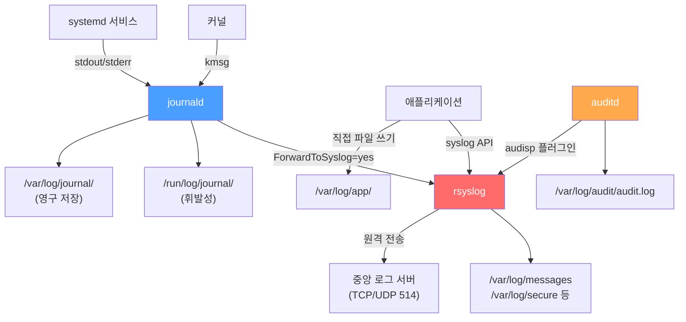

# 로그 관리

## 개요

시스템과 애플리케이션의 로그 확인 및 관리 방법. 문제 진단과 모니터링에 필수다.

리눅스 로그 시스템은 크게 세 갈래로 나뉜다.

- **journald**: systemd가 관리하는 바이너리 로그. `journalctl`로 조회한다.
- **rsyslog/syslog-ng**: 텍스트 기반 로그 데몬. `/var/log/` 아래에 파일로 저장한다.
- **auditd**: 커널 레벨 보안 감사 로그. 파일 접근, 시스템 콜 추적에 사용한다.

## 로그 흐름 구조

리눅스 시스템에서 로그가 생성되어 저장·전송되는 과정이다.



journald와 rsyslog는 별개 시스템이지만 서로 연동된다. journald가 수집한 로그를 rsyslog로 포워딩할 수 있고, 반대로 rsyslog가 받은 로그를 journald로 넘길 수도 있다. 대부분의 배포판에서 두 시스템이 동시에 동작한다.

## 주요 로그 파일 위치

### 시스템 로그

```bash
/var/log/messages               # 일반 시스템 메시지 (RHEL/CentOS)
/var/log/syslog                 # 시스템 로그 (Debian/Ubuntu)
/var/log/auth.log               # 인증 로그 (Debian/Ubuntu)
/var/log/secure                 # 보안 로그 (RHEL/CentOS)
/var/log/kern.log               # 커널 로그
/var/log/boot.log               # 부팅 로그
/var/log/audit/audit.log        # 보안 감사 로그 (auditd)
```

### 서비스 로그

```bash
/var/log/nginx/
/var/log/apache2/
/var/log/mysql/
/var/log/postgresql/
```

### 애플리케이션 로그

```bash
/var/log/app/
/opt/app/logs/
```

애플리케이션 로그 위치는 설정에 따라 다르다. 설정 파일을 확인한다.

## journald (systemd)

systemd 기반 시스템의 로그를 확인한다.

### 기본 사용

```bash
journalctl
journalctl -n 50
journalctl -f                     # 실시간 모니터링
journalctl --since today
journalctl --since "1 hour ago"
journalctl --since "2025-01-01 10:00:00"
journalctl --until "2025-01-01 12:00:00"
```

### 서비스별 로그

```bash
journalctl -u nginx
journalctl -u nginx -f
journalctl -u nginx --since today
```

### 우선순위별 필터링

```bash
journalctl -p err                 # 에러만
journalctl -p warning
journalctl -p info
```

**우선순위:**
- 0: emerg (긴급)
- 1: alert (경보)
- 2: crit (치명적)
- 3: err (에러)
- 4: warning (경고)
- 5: notice (알림)
- 6: info (정보)
- 7: debug (디버그)

### 로그 검색

```bash
journalctl -g "error"
journalctl _PID=1234
journalctl _UID=1000
journalctl _COMM=nginx
```

### 로그 출력 형식

```bash
journalctl -o json
journalctl -o json-pretty
journalctl -o short-iso           # ISO 8601 타임스탬프
journalctl > log.txt
```

`journalctl -xe`는 최근 에러와 상세 정보를 보여준다. 문제 진단에 유용하다.

### journald 영구 저장소 구성

journald는 기본적으로 `/run/log/journal/`에 로그를 저장한다. 이 경로는 tmpfs이므로 재부팅하면 로그가 사라진다. 영구 저장이 필요하면 별도 설정이 필요하다.

```bash
# 영구 저장 디렉토리 생성
sudo mkdir -p /var/log/journal
sudo systemd-tmpfiles --create --prefix /var/log/journal
```

`/etc/systemd/journald.conf`를 수정한다.

```ini
[Journal]
# auto: /var/log/journal/ 디렉토리가 있으면 영구, 없으면 휘발
# persistent: 항상 영구 저장
# volatile: 항상 메모리에만 저장
Storage=persistent

# 디스크 사용량 제한
SystemMaxUse=2G
SystemKeepFree=1G
SystemMaxFileSize=100M

# 오래된 로그 자동 삭제
MaxRetentionSec=3month
```

설정 변경 후 반영한다.

```bash
sudo systemctl restart systemd-journald
```

운영 서버에서 `Storage=volatile` 상태로 두면 장애 발생 후 재부팅 시 로그를 볼 수 없다. 이런 상황에서 원인을 못 찾는 경우가 생긴다. 반드시 `persistent`로 변경한다.

journald 로그 디스크 사용량 확인은 다음과 같다.

```bash
journalctl --disk-usage
# Archived and active journals take up 1.2G in the file system.

# 오래된 로그 수동 정리
journalctl --vacuum-size=500M    # 500MB까지 줄이기
journalctl --vacuum-time=2weeks  # 2주 이전 로그 삭제
```

## 로그 파일 확인

### tail

로그 파일의 마지막 부분을 확인한다.

```bash
tail /var/log/messages
tail -n 100 /var/log/messages
tail -f /var/log/messages         # 실시간 모니터링
tail -F /var/log/messages         # 파일 재생성 시에도 모니터링
```

`tail -f`와 `tail -F`의 차이가 중요하다. `-f`는 파일 디스크립터를 추적하고, `-F`는 파일 이름을 추적한다. logrotate로 파일이 교체될 때 `-f`는 이전 파일을 계속 보지만, `-F`는 새 파일로 전환된다. 운영 환경에서는 `-F`를 사용한다.

### grep

로그에서 특정 패턴을 검색한다.

```bash
grep "error" /var/log/messages
grep -i "error" /var/log/messages
grep -v "info" /var/log/messages
grep -A 5 "error" /var/log/messages  # 에러 후 5줄
grep -B 5 "error" /var/log/messages  # 에러 전 5줄
grep -C 5 "error" /var/log/messages  # 에러 전후 5줄
```

### less

페이지 단위로 로그를 확인한다.

```bash
less /var/log/messages
less +F /var/log/messages         # tail -f처럼 동작 (Ctrl+C로 탈출)
```

`less` 내에서 `/검색어`로 검색, `n`으로 다음 결과, `q`로 종료한다.

## rsyslog

대부분의 리눅스 배포판에서 기본 syslog 데몬이다. 텍스트 파일 기반으로 로그를 저장하고, 원격 서버로 포워딩하는 기능을 제공한다.

### rsyslog 구성 개요


### 설정 파일 구조

```bash
/etc/rsyslog.conf               # 메인 설정 파일
/etc/rsyslog.d/*.conf           # 추가 설정 (이 디렉토리에 파일 추가하는 게 관리하기 편하다)
```

### 기본 규칙 문법

rsyslog 규칙은 `facility.severity action` 형식이다.

```bash
# /etc/rsyslog.conf 기본 규칙 예시

# 모든 인증 관련 로그를 /var/log/secure에 저장
authpriv.*                          /var/log/secure

# 메일 로그
mail.*                              -/var/log/maillog

# 에러 이상 심각도만 /var/log/errors에 저장
*.err                               /var/log/errors

# 커널 로그
kern.*                              /var/log/kern.log

# emergency는 모든 터미널에 출력
*.emerg                             :omusrmsg:*
```

파일 경로 앞의 `-`는 비동기 쓰기를 의미한다. 메일처럼 로그가 많이 쌓이는 경우 디스크 I/O 부하를 줄인다. 다만 비정상 종료 시 마지막 몇 줄이 유실될 수 있다.

**facility 목록:** auth, authpriv, cron, daemon, kern, lpr, mail, news, syslog, user, uucp, local0~local7

**severity 레벨 (높은 순):** emerg > alert > crit > err > warning > notice > info > debug

### rsyslog 중앙 집중 로그 서버 구성

여러 서버의 로그를 한 곳에서 수집하려면 중앙 로그 서버를 구성한다.

**서버 측 설정** (`/etc/rsyslog.d/central-server.conf`):

```bash
# TCP 514 포트로 로그 수신 (UDP보다 TCP 권장 - 유실 방지)
module(load="imtcp")
input(type="imtcp" port="514")

# 호스트별로 디렉토리 분리하여 저장
# %HOSTNAME%은 발신 서버의 호스트명으로 치환된다
template(name="RemoteLog" type="string"
    string="/var/log/remote/%HOSTNAME%/%PROGRAMNAME%.log")

# 원격에서 받은 로그만 위 템플릿으로 저장
if $fromhost-ip != '127.0.0.1' then {
    action(type="omfile" dynaFile="RemoteLog")
    stop
}
```

**클라이언트 측 설정** (`/etc/rsyslog.d/forward.conf`):

```bash
# 모든 로그를 중앙 서버로 TCP 전송
# @@는 TCP, @는 UDP
*.* @@log-server.example.com:514

# 전송 실패 시 디스크 큐에 버퍼링 (네트워크 끊김 대비)
action(type="omfwd"
    target="log-server.example.com"
    port="514"
    protocol="tcp"
    queue.type="LinkedList"
    queue.filename="fwd_to_central"
    queue.maxdiskspace="1g"
    queue.saveonshutdown="on"
    action.resumeRetryCount="-1"
    action.resumeInterval="30")
```

```bash
# 설정 문법 검사
rsyslogd -N1

# 서비스 재시작
sudo systemctl restart rsyslog
```

`queue.saveonshutdown="on"`을 설정하지 않으면 rsyslog가 종료될 때 큐에 남은 로그가 사라진다. 반드시 켜둔다.

방화벽에서 514 포트를 열어야 한다.

```bash
sudo firewall-cmd --permanent --add-port=514/tcp
sudo firewall-cmd --reload
```

### syslog-ng와의 차이

syslog-ng도 같은 역할을 하는 로그 데몬이다. RHEL/CentOS/Ubuntu 기본은 rsyslog이고, 일부 배포판에서 syslog-ng를 사용한다. rsyslog는 RainerScript 문법을 사용하고, syslog-ng는 C 스타일 설정 문법을 사용한다. 기능 차이는 거의 없으니 배포판 기본을 따른다.

## auditd (보안 감사 로그)

auditd는 커널 레벨에서 시스템 콜을 감시한다. 파일 접근, 권한 변경, 사용자 행위 추적이 필요할 때 사용한다. syslog 계열과는 별개의 시스템이다.

### auditd 설치와 시작

```bash
# RHEL/CentOS
sudo yum install audit

# Debian/Ubuntu
sudo apt install auditd

sudo systemctl enable --now auditd
```

### 로그 위치와 구조

```bash
# 로그 파일
/var/log/audit/audit.log

# 설정 파일
/etc/audit/auditd.conf           # auditd 데몬 설정
/etc/audit/rules.d/*.rules       # 감사 규칙
```

audit.log의 한 줄은 다음과 같은 구조다.

```
type=SYSCALL msg=audit(1712345678.123:456): arch=c000003e syscall=2 success=yes exit=3 ... uid=0 comm="cat" exe="/usr/bin/cat"
```

timestamp은 epoch 형식이다. `ausearch`나 `aureport`로 사람이 읽기 편한 형식으로 변환한다.

### 감사 규칙 설정

```bash
# 규칙 파일: /etc/audit/rules.d/custom.rules

# /etc/passwd 파일 변경 감시
-w /etc/passwd -p wa -k passwd_changes

# /etc/shadow 파일 읽기/쓰기 감시
-w /etc/shadow -p rwa -k shadow_access

# /etc/sudoers 변경 감시
-w /etc/sudoers -p wa -k sudoers_changes

# 특정 디렉토리 하위 전체 감시
-w /etc/ssh/ -p wa -k ssh_config

# 시스템 콜 감시: root가 아닌 사용자의 파일 삭제 추적
-a always,exit -F arch=b64 -S unlink -S unlinkat -S rename -S renameat -F auid>=1000 -F auid!=4294967295 -k file_deletion
```

`-p` 옵션의 의미: `r`(읽기), `w`(쓰기), `x`(실행), `a`(속성 변경)

`-k`는 태그다. 나중에 `ausearch -k passwd_changes`처럼 태그로 검색한다.

```bash
# 규칙 로드
sudo augenrules --load

# 현재 적용된 규칙 확인
sudo auditctl -l
```

### 감사 로그 조회

```bash
# 특정 키로 검색
sudo ausearch -k passwd_changes

# 특정 시간 범위
sudo ausearch -k file_deletion --start today
sudo ausearch -k ssh_config --start "03/15/2025" --end "03/16/2025"

# 특정 사용자의 행위
sudo ausearch -ua 1000

# 실패한 시스템 콜만
sudo ausearch --success no
```

### 감사 보고서

```bash
# 인증 관련 요약
sudo aureport --auth

# 파일 관련 이벤트 요약
sudo aureport --file

# 실행된 명령어 요약
sudo aureport --comm

# 실패한 이벤트만
sudo aureport --failed
```

### auditd 설정 주의사항

auditd 규칙이 너무 많거나 범위가 넓으면 시스템 성능에 영향을 준다. `/` 전체를 감시하는 규칙은 절대 넣지 않는다. 필요한 파일과 디렉토리만 정확히 지정한다.

`/etc/audit/auditd.conf`에서 로그 파일 크기와 로테이션을 설정한다.

```ini
# /etc/audit/auditd.conf
log_file = /var/log/audit/audit.log
max_log_file = 50
num_logs = 10
max_log_file_action = ROTATE
space_left_action = SYSLOG
admin_space_left_action = SINGLE
```

`max_log_file_action`을 `IGNORE`로 두면 로그 파일이 끝없이 커진다. 디스크가 가득 차서 시스템이 멈추는 사고가 난다.

## 로그 로테이션

### logrotate

로그 파일을 자동으로 로테이션한다.

### 설정 파일

```bash
# /etc/logrotate.d/myapp
/var/log/myapp/*.log {
    daily
    rotate 7
    compress
    delaycompress
    missingok
    notifempty
    create 0644 app app
    postrotate
        systemctl reload myapp
    endscript
}
```

각 옵션의 의미:

- `daily`: 매일 로테이션 (`weekly`, `monthly`도 가능)
- `rotate 7`: 최근 7개 파일 유지
- `compress`: gzip으로 압축
- `delaycompress`: 직전 파일은 압축하지 않음 (아직 쓰는 프로세스가 있을 수 있다)
- `missingok`: 로그 파일이 없어도 에러 안 냄
- `notifempty`: 빈 파일은 로테이션 안 함
- `create 0644 app app`: 새 로그 파일 생성 시 권한과 소유자 지정
- `postrotate/endscript`: 로테이션 후 실행할 명령

### 수동 실행

```bash
logrotate -d /etc/logrotate.conf  # 테스트 (dry-run)
logrotate -f /etc/logrotate.conf  # 강제 실행
logrotate -v /etc/logrotate.conf  # 상세 출력
```

`-d` 옵션으로 설정을 테스트한다. 실제 로테이션 전에 반드시 확인한다.

`copytruncate` 옵션을 아는 게 중요하다. 일반 로테이션은 파일을 rename하고 새 파일을 생성하는데, 로그 파일을 직접 열어서 쓰는 프로세스는 이전 파일 디스크립터를 계속 사용한다. `copytruncate`는 파일을 복사한 뒤 원본을 잘라내서 이 문제를 우회한다. 다만 복사와 truncate 사이에 유실이 생길 수 있다.

```bash
/var/log/myapp/*.log {
    daily
    rotate 7
    compress
    copytruncate              # 파일 디스크립터를 유지해야 하는 경우
}
```

## 원격 로그 전송 (Log Forwarding)

로그를 원격 서버로 보내는 전체 구성을 정리한다.

### 전송 방식 비교

| 방식 | 프로토콜 | 특징 |
|------|---------|------|
| rsyslog UDP | UDP 514 | 빠르지만 유실 가능 |
| rsyslog TCP | TCP 514 | 유실 방지, 기본 권장 |
| rsyslog RELP | TCP 2514 | 전송 보장, rsyslog 간 전용 |
| rsyslog + TLS | TCP 6514 | 암호화 전송, 외부 네트워크 필수 |
| journald 원격 전송 | HTTPS | systemd-journal-upload 사용 |

### TLS 암호화 전송

외부 네트워크를 통해 로그를 전송할 때는 반드시 TLS를 사용한다. 로그에 IP, 사용자명, 명령어 등 민감 정보가 포함되기 때문이다.

**서버 측** (`/etc/rsyslog.d/tls-server.conf`):

```bash
# TLS 모듈 로드
module(load="imtcp"
    StreamDriver.Name="gtls"
    StreamDriver.Mode="1"
    StreamDriver.Authmode="x509/name")

# 인증서 설정
global(
    DefaultNetstreamDriver="gtls"
    DefaultNetstreamDriverCAFile="/etc/pki/tls/certs/ca.pem"
    DefaultNetstreamDriverCertFile="/etc/pki/tls/certs/server-cert.pem"
    DefaultNetstreamDriverKeyFile="/etc/pki/tls/private/server-key.pem")

input(type="imtcp" port="6514")
```

**클라이언트 측** (`/etc/rsyslog.d/tls-client.conf`):

```bash
global(
    DefaultNetstreamDriver="gtls"
    DefaultNetstreamDriverCAFile="/etc/pki/tls/certs/ca.pem"
    DefaultNetstreamDriverCertFile="/etc/pki/tls/certs/client-cert.pem"
    DefaultNetstreamDriverKeyFile="/etc/pki/tls/private/client-key.pem")

action(type="omfwd"
    target="log-server.example.com"
    port="6514"
    protocol="tcp"
    StreamDriver="gtls"
    StreamDriverMode="1"
    StreamDriverAuthMode="x509/name"
    StreamDriverPermittedPeers="log-server.example.com")
```

### systemd-journal-upload

journald 로그를 직접 원격 서버로 보낼 수도 있다. rsyslog 없이 systemd만으로 구성할 때 사용한다.

```bash
# 전송 측 설정: /etc/systemd/journal-upload.conf
[Upload]
URL=https://log-server.example.com:19532
ServerKeyFile=/etc/ssl/private/journal-upload.pem
ServerCertificateFile=/etc/ssl/certs/journal-upload.pem
TrustedCertificateFile=/etc/ssl/ca/trusted.pem

# 서비스 시작
sudo systemctl enable --now systemd-journal-upload
```

수신 측에서는 `systemd-journal-remote`을 설치하고 실행한다.

```bash
sudo systemctl enable --now systemd-journal-remote.socket
```

## 로그 분석

### 특정 시간대 로그

```bash
# journalctl
journalctl --since "2025-01-01 10:00:00" --until "2025-01-01 11:00:00"

# grep
grep "2025-01-01 10:" /var/log/messages
```

### 에러 통계

```bash
# 에러 개수
grep -c "ERROR" /var/log/app.log

# 에러 종류별 개수
grep "ERROR" /var/log/app.log | awk '{print $5}' | sort | uniq -c | sort -rn

# 시간대별 에러
grep "ERROR" /var/log/app.log | awk '{print $1, $2}' | cut -d: -f1 | uniq -c
```

### IP 주소 분석

```bash
# 접근 IP 상위 10개
awk '{print $1}' access.log | sort | uniq -c | sort -rn | head -10

# 특정 IP의 접근
grep "192.168.1.1" access.log
```

### 응답 시간 분석

```bash
# 평균 응답 시간
awk '{sum+=$NF; count++} END {print sum/count}' access.log

# 1초 이상 응답
awk '$NF > 1.0 {print}' access.log
```

## 로그 모니터링

### 실시간 모니터링

```bash
# 단일 파일
tail -f /var/log/app.log

# 여러 파일
tail -f /var/log/app.log /var/log/error.log

# 특정 패턴만 실시간 모니터링
tail -f /var/log/app.log | grep --line-buffered "ERROR"

# journalctl
journalctl -u nginx -f
```

### 로그 알림

```bash
#!/bin/bash
ERROR_COUNT=$(grep -c "ERROR" /var/log/app.log)

if [ $ERROR_COUNT -gt 100 ]; then
    echo "High error count: $ERROR_COUNT" | mail -s "Alert" admin@example.com
fi
```

Prometheus + Loki, ELK 같은 모니터링 스택과 연동하면 대시보드와 자동 알림을 구성할 수 있다.

## 로그 로테이션과 정리

### 오래된 로그 삭제

```bash
# 30일 이상 된 로그 삭제
find /var/log -type f -name "*.log" -mtime +30 -delete

# 특정 크기 이상 로그 삭제
find /var/log -type f -size +100M -delete
```

### 로그 압축

```bash
# 오래된 로그 압축
find /var/log -type f -name "*.log" -mtime +7 -exec gzip {} \;
```

로그는 정기적으로 정리한다. `df -h`로 디스크 공간을 수시로 확인한다.

## 로그 보안

### 로그 권한

```bash
# 로그 파일 권한 설정
chmod 640 /var/log/app.log
chown app:adm /var/log/app.log
```

### 로그 무결성

```bash
# 로그 무결성 검증 (AIDE 사용)
aide --check
```

로그 파일은 변조되지 않도록 권한을 제한한다. 보안이 중요한 환경에서는 원격 로그 서버에 별도로 저장해서 공격자가 로컬 로그를 삭제해도 원본이 남도록 한다.

## 애플리케이션 로그 설정

### 로그 레벨

```bash
# 애플리케이션 설정 예시
LOG_LEVEL=INFO                    # DEBUG, INFO, WARN, ERROR
LOG_FILE=/var/log/app.log
LOG_MAX_SIZE=100M
LOG_BACKUP_COUNT=10
```

### 로그 포맷

구조화된 로그(JSON)를 사용하면 로그 수집 도구에서 파싱이 쉽다.

```bash
# 전통적인 포맷
[2025-01-01 10:00:00] [INFO] [module] Message

# JSON 포맷 (ELK, Loki 등에서 파싱 없이 바로 사용 가능)
{"timestamp":"2025-01-01T10:00:00Z","level":"INFO","module":"auth","msg":"login success","user":"admin"}
```

JSON 포맷은 사람이 읽기는 불편하지만, 중앙 로그 시스템에서 필드 기반 검색이 가능하다. 운영 환경에서는 JSON 포맷을 권장한다.

## 일반적인 문제 해결

### 로그가 너무 많을 때

```bash
# 특정 시간대만
grep "2025-01-01 10:" /var/log/app.log

# 에러만
grep "ERROR" /var/log/app.log

# 최근 로그만
tail -n 1000 /var/log/app.log
```

### 로그 파일이 없을 때

```bash
# 로그 디렉토리 확인
ls -la /var/log/

# 서비스 상태 확인
systemctl status service

# 로그 설정 확인
journalctl -u service
```

### 로그가 쌓이지 않을 때

```bash
# 디스크 공간 확인
df -h

# inode 확인
df -i

# 로그 권한 확인
ls -l /var/log/app.log

# rsyslog 상태 확인
systemctl status rsyslog
```

로그 문제는 디스크 공간, 권한, 서비스 상태를 순서대로 확인한다.

### /var/log/audit/audit.log에서 denied 찾기

SELinux가 켜져 있는 환경에서 서비스가 동작하지 않으면 audit.log를 확인한다.

```bash
# SELinux 차단 로그 확인
sudo ausearch -m avc --start today

# 읽기 쉬운 형식으로 변환
sudo ausearch -m avc --start today | audit2why
```
