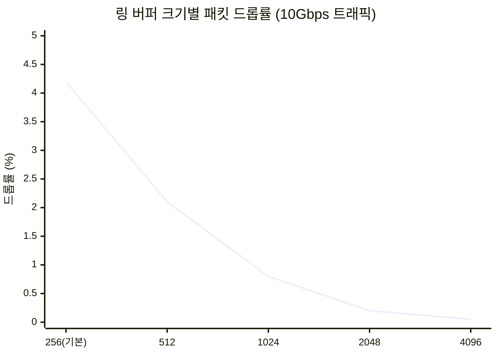
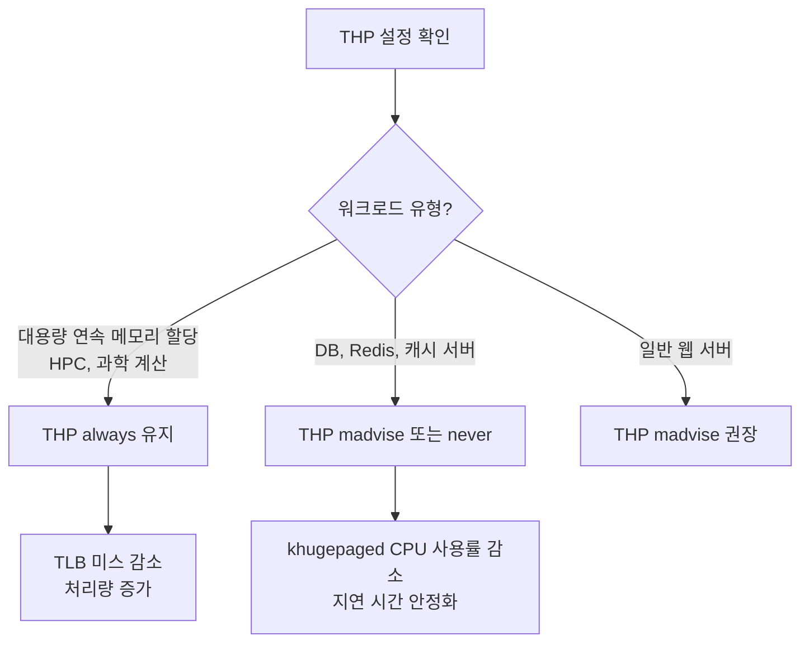
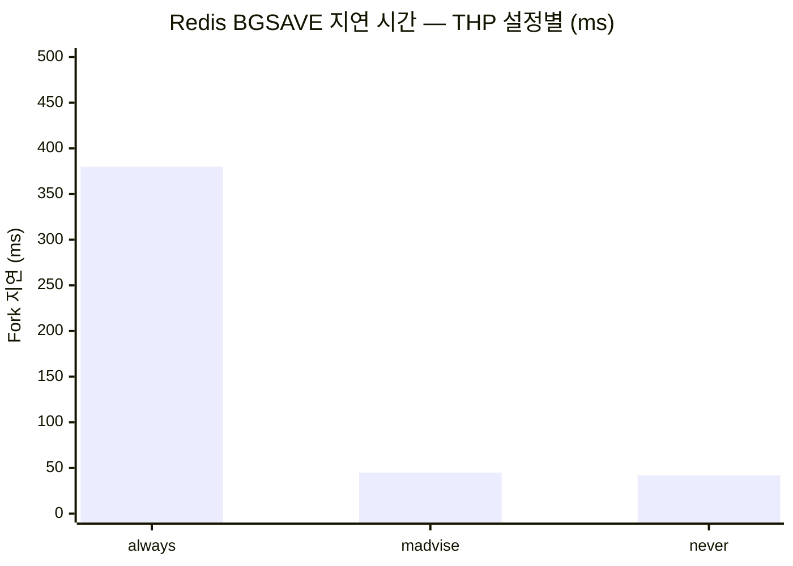
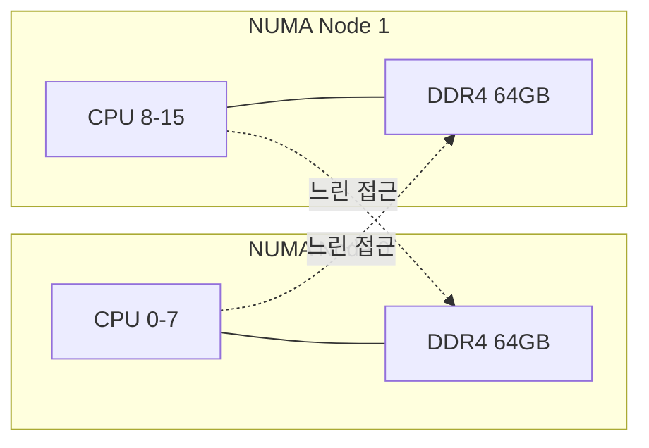
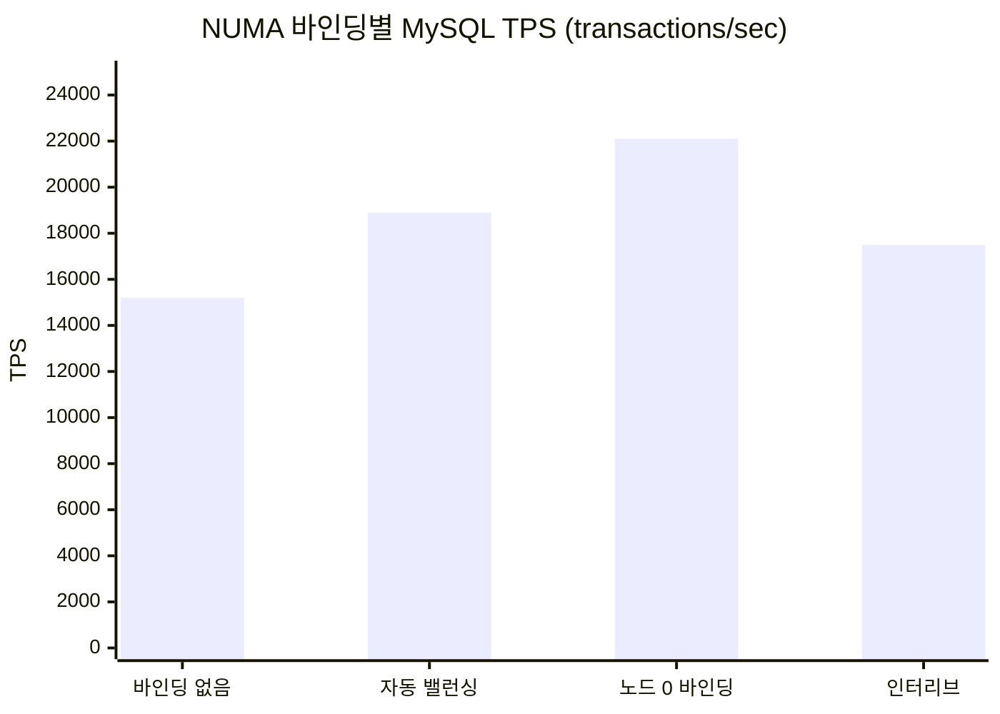
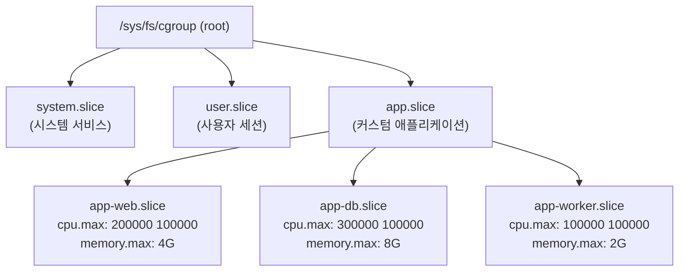
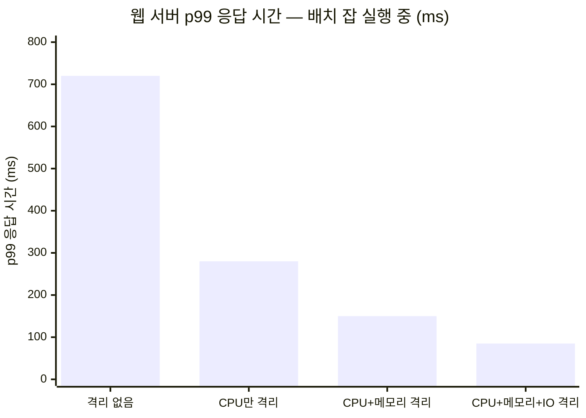
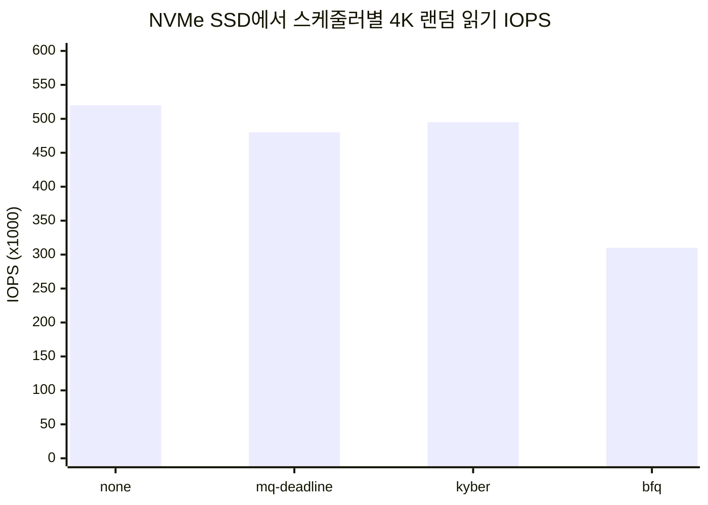
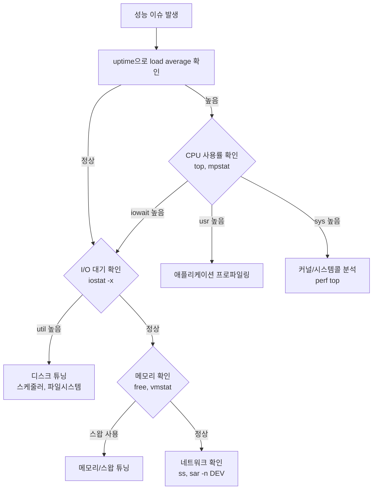

# 시스템 성능 튜닝

## 개요

리눅스 시스템 성능 튜닝은 모니터링 데이터를 기반으로 병목 지점을 찾고, 해당 파라미터를 조정하는 작업이다. 아무 근거 없이 파라미터를 바꾸면 오히려 성능이 떨어진다. 반드시 측정 → 변경 → 재측정 순서를 지킨다.


## 커널 파라미터 튜닝

### sysctl 기본 사용법

커널 파라미터를 런타임에 확인하고 변경한다.

```bash
# 전체 파라미터 목록
sysctl -a

# 특정 파라미터 확인
sysctl kernel.hostname
sysctl vm.swappiness

# 런타임 변경 (재부팅 시 초기화)
sysctl -w vm.swappiness=10

# /etc/sysctl.conf 영구 적용
sysctl -p
```

### /etc/sysctl.conf 설정

재부팅 후에도 유지되는 커널 파라미터 설정 파일이다.

```bash
# /etc/sysctl.conf

# 네트워크 버퍼
net.core.rmem_max = 16777216
net.core.wmem_max = 16777216
net.ipv4.tcp_rmem = 4096 87380 16777216
net.ipv4.tcp_wmem = 4096 65536 16777216

# TCP 연결 관리
net.ipv4.tcp_fin_timeout = 30
net.ipv4.tcp_keepalive_time = 300
net.ipv4.tcp_max_syn_backlog = 8192

# 메모리
vm.swappiness = 10
vm.dirty_ratio = 15
vm.dirty_background_ratio = 5
```

변경 전에 현재 값을 기록해둔다. 문제가 생기면 원복해야 한다.

```bash
# 변경 전 백업
sysctl -a > /tmp/sysctl_backup_$(date +%Y%m%d).txt
sysctl -p
```

### 벤치마크: sysctl 변경 전후 비교

실제 운영 서버(4코어, 16GB RAM, SSD)에서 ab(Apache Bench)로 측정한 결과다.

```mermaid
xychart-beta
    title "TCP 튜닝 전후 동시 접속 처리량 (req/s)"
    x-axis ["100 conn", "500 conn", "1000 conn", "2000 conn"]
    y-axis "Requests/sec" 0 --> 12000
    bar [3200, 2800, 1900, 950]
    bar [4100, 3900, 3500, 2800]
```



| 항목 | 기본값 | 튜닝 후 | 변경 내용 |
|------|--------|---------|-----------|
| 동시 1000 연결 처리량 | 1,900 req/s | 3,500 req/s | tcp_max_syn_backlog 8192, 버퍼 16MB |
| TIME_WAIT 소켓 수 | 12,000개 | 3,200개 | tcp_fin_timeout 30, tcp_tw_reuse 1 |
| 평균 응답 시간 | 52ms | 28ms | 전체 TCP 파라미터 적용 |

`tcp_tw_recycle`은 커널 4.12에서 제거됐다. NAT 환경에서 패킷 드롭이 발생하기 때문이다. `tcp_tw_reuse`만 사용한다.

## 네트워크 튜닝

### TCP 버퍼 및 연결 설정

```bash
# /etc/sysctl.conf

# TCP 버퍼 — 10Gbps 이상 네트워크에서는 더 크게 잡는다
net.core.rmem_max = 16777216
net.core.wmem_max = 16777216
net.ipv4.tcp_rmem = 4096 87380 16777216
net.ipv4.tcp_wmem = 4096 65536 16777216

# 연결 관리
net.ipv4.tcp_fin_timeout = 30
net.ipv4.tcp_keepalive_time = 300
net.ipv4.tcp_max_syn_backlog = 8192
net.ipv4.tcp_tw_reuse = 1

# 사용 가능한 포트 범위 확장
net.ipv4.ip_local_port_range = 10000 65535

# 소켓 백로그
net.core.somaxconn = 65535
net.core.netdev_max_backlog = 5000
```

### 네트워크 인터페이스 튜닝

```bash
# 링 버퍼 크기 확인
ethtool -g eth0

# 링 버퍼 크기 변경
ethtool -G eth0 rx 4096 tx 4096

# 오프로드 설정 — 문제가 생기면 하나씩 끄면서 확인한다
ethtool -K eth0 gro on
ethtool -K eth0 tso on
ethtool -K eth0 gso on
```

GRO/TSO를 끄면 CPU 사용률이 올라간다. 패킷 캡처가 필요한 디버깅 상황이 아니면 켜둔다.

### 벤치마크: 네트워크 인터페이스 튜닝 효과



링 버퍼를 4096으로 올리면 패킷 드롭이 거의 사라진다. 메모리를 조금 더 쓰지만 트래픽이 많은 서버에서는 필수다.

## 메모리 튜닝

### 스왑 관리

```bash
# /etc/sysctl.conf
vm.swappiness = 10
```

| swappiness 값 | 동작 | 용도 |
|---------------|------|------|
| 0 | 메모리 부족 시에만 스왑 사용 | 대용량 메모리 서버 (OOM 위험 있음) |
| 10 | 스왑 사용 최소화 | 일반 서버 권장값 |
| 60 | 기본값 | 데스크톱 환경 |
| 100 | 적극적 스왑 사용 | 메모리가 부족한 환경 |

DB 서버에서 swappiness가 60인 채로 운영하면 쿼리 캐시가 스왑으로 밀려나서 응답 시간이 튄다. DB 서버는 반드시 10 이하로 설정한다.

### 더티 페이지 관리

```bash
# /etc/sysctl.conf
vm.dirty_ratio = 15              # 전체 메모리의 15%가 더티 페이지면 동기 쓰기
vm.dirty_background_ratio = 5    # 백그라운드 플러시 시작 비율
vm.dirty_expire_centisecs = 3000 # 더티 페이지 만료 시간 (30초)
vm.dirty_writeback_centisecs = 500 # 플러시 데몬 주기 (5초)
```

쓰기가 많은 로그 서버에서는 `dirty_ratio`를 높여서 디스크 I/O를 모아서 처리한다. 반대로 데이터 무결성이 중요한 DB 서버에서는 낮게 유지한다.

### Transparent Huge Pages (THP)

THP는 커널이 자동으로 2MB 크기의 huge page를 할당하는 기능이다. 일반적인 페이지 크기는 4KB인데, huge page를 쓰면 TLB(Translation Lookaside Buffer) 미스가 줄어든다.

문제는 THP가 항상 좋은 건 아니라는 점이다.



**THP 상태 확인:**

```bash
cat /sys/kernel/mm/transparent_hugepage/enabled
# [always] madvise never

cat /sys/kernel/mm/transparent_hugepage/defrag
# [always] defer defer+madvise madvise never
```

**THP 설정 변경:**

```bash
# madvise로 변경 — 애플리케이션이 명시적으로 요청할 때만 사용
echo madvise > /sys/kernel/mm/transparent_hugepage/enabled
echo defer+madvise > /sys/kernel/mm/transparent_hugepage/defrag

# 완전 비활성화
echo never > /sys/kernel/mm/transparent_hugepage/enabled
echo never > /sys/kernel/mm/transparent_hugepage/defrag
```

**영구 적용 (systemd 서비스):**

```bash
# /etc/systemd/system/disable-thp.service
[Unit]
Description=Disable Transparent Huge Pages
DefaultDependencies=no
After=sysinit.target local-fs.target
Before=basic.target

[Service]
Type=oneshot
ExecStart=/bin/sh -c 'echo madvise > /sys/kernel/mm/transparent_hugepage/enabled'
ExecStart=/bin/sh -c 'echo defer+madvise > /sys/kernel/mm/transparent_hugepage/defrag'

[Install]
WantedBy=basic.target
```

```bash
systemctl daemon-reload
systemctl enable disable-thp
```

**Redis, MongoDB에서 THP를 끄는 이유:**

이 애플리케이션들은 fork() 기반 백그라운드 저장을 한다. THP가 켜져 있으면 fork 시 copy-on-write로 2MB 단위 페이지 복사가 발생하고, 지연 시간이 수백 ms 단위로 튄다. Redis 로그에 `Latency latest fork usec`이 비정상적으로 높으면 THP를 의심한다.



## NUMA 노드 바인딩

### NUMA란

NUMA(Non-Uniform Memory Access) 시스템에서는 CPU마다 가까운 메모리(로컬 노드)와 먼 메모리(리모트 노드)가 있다. 리모트 노드 접근은 로컬보다 1.5~2배 느리다.



### NUMA 토폴로지 확인

```bash
# NUMA 노드 구조 확인
numactl --hardware

# 출력 예시:
# available: 2 nodes (0-1)
# node 0 cpus: 0 1 2 3 4 5 6 7
# node 0 size: 65536 MB
# node 0 free: 32000 MB
# node 1 cpus: 8 9 10 11 12 13 14 15
# node 1 size: 65536 MB
# node 1 free: 48000 MB
# node distances:
# node   0   1
#   0:  10  21
#   1:  21  10

# 현재 프로세스의 NUMA 메모리 할당 통계
numastat
numastat -p $(pidof mysqld)
```

`node distances`에서 21은 리모트 접근 비용이다. 이 차이가 크면 NUMA 바인딩 효과가 더 크다.

### NUMA 바인딩 설정

```bash
# 특정 노드에서 실행
numactl --cpunodebind=0 --membind=0 ./my_application

# MySQL을 노드 0에 바인딩
numactl --cpunodebind=0 --membind=0 mysqld_safe &

# 인터리브 모드 — 메모리를 모든 노드에 균등 분배
# 메모리 사용량이 단일 노드를 초과할 때 사용
numactl --interleave=all mongod --config /etc/mongod.conf
```

**systemd 서비스에 NUMA 설정 추가:**

```bash
# /etc/systemd/system/mysqld.service.d/numa.conf
[Service]
ExecStart=
ExecStart=/usr/bin/numactl --cpunodebind=0 --membind=0 /usr/sbin/mysqld
```

### NUMA 밸런싱

커널 자동 NUMA 밸런싱을 켤 수 있다. 커널이 프로세스와 메모리를 같은 노드로 옮겨준다.

```bash
# 자동 NUMA 밸런싱 확인
sysctl kernel.numa_balancing
# kernel.numa_balancing = 1 (활성)

# 비활성화 — 수동 바인딩을 쓰는 경우
sysctl -w kernel.numa_balancing=0
```

수동 바인딩과 자동 밸런싱을 동시에 쓰면 충돌할 수 있다. 둘 중 하나만 사용한다.

### 벤치마크: NUMA 바인딩 효과

2소켓 서버(각 노드 8코어, 64GB)에서 MySQL sysbench OLTP 테스트 결과:



| 설정 | TPS | 리모트 메모리 접근 비율 |
|------|-----|----------------------|
| 바인딩 없음 | 15,200 | 38% |
| 자동 밸런싱 | 18,900 | 15% |
| 노드 0 바인딩 | 22,100 | 2% |
| 인터리브 | 17,500 | 50% (의도적 분산) |

메모리 사용량이 단일 노드 용량 이내면 바인딩이 가장 빠르다. 초과하면 인터리브를 쓴다.

## cgroups v2 리소스 제어

### cgroups v2 기본 개념

cgroups v2는 프로세스 그룹 단위로 CPU, 메모리, I/O 리소스를 제한한다. v1과 달리 단일 통합 계층 구조를 사용한다.



### cgroups v2 활성화 확인

```bash
# cgroups 버전 확인
mount | grep cgroup
# cgroup2 on /sys/fs/cgroup type cgroup2 (rw,nosuid,nodev,noexec,relatime)

# v2가 아닌 경우 커널 파라미터 추가
# /etc/default/grub
GRUB_CMDLINE_LINUX="systemd.unified_cgroup_hierarchy=1"

grub2-mkconfig -o /boot/grub2/grub.cfg
```

### CPU 리소스 제한

```bash
# cgroup 생성
mkdir -p /sys/fs/cgroup/app-web

# CPU 제한 — 2코어 상당 (200ms / 100ms 주기)
echo "200000 100000" > /sys/fs/cgroup/app-web/cpu.max

# CPU 가중치 (1~10000, 기본 100)
echo "200" > /sys/fs/cgroup/app-web/cpu.weight

# 프로세스 추가
echo $PID > /sys/fs/cgroup/app-web/cgroup.procs
```

`cpu.max`의 "200000 100000"은 100ms 주기 중 최대 200ms CPU 시간을 쓸 수 있다는 뜻이다. 즉, 2코어 분량이다.

### 메모리 리소스 제한

```bash
# 메모리 상한 4GB
echo "4G" > /sys/fs/cgroup/app-web/memory.max

# 메모리 소프트 제한 (리클레임 대상 기준)
echo "3G" > /sys/fs/cgroup/app-web/memory.high

# 스왑 제한
echo "1G" > /sys/fs/cgroup/app-web/memory.swap.max

# 현재 메모리 사용량 확인
cat /sys/fs/cgroup/app-web/memory.current
cat /sys/fs/cgroup/app-web/memory.stat
```

`memory.high`를 넘으면 커널이 해당 cgroup의 메모리를 적극적으로 회수한다. `memory.max`를 넘으면 OOM killer가 동작한다.

### I/O 리소스 제한

```bash
# 디바이스 번호 확인
ls -l /dev/sda
# brw-rw---- 1 root disk 8, 0 ...

# I/O 대역폭 제한 (디바이스 8:0에 대해 읽기 100MB/s, 쓰기 50MB/s)
echo "8:0 rbps=104857600 wbps=52428800" > /sys/fs/cgroup/app-web/io.max

# I/O 가중치
echo "default 200" > /sys/fs/cgroup/app-web/io.weight

# I/O 통계 확인
cat /sys/fs/cgroup/app-web/io.stat
```

### systemd를 이용한 cgroups v2 설정

직접 파일 시스템을 조작하는 것보다 systemd 유닛 파일로 관리하는 게 낫다. 재부팅 후에도 유지되고, 서비스 재시작 시 자동 적용된다.

```bash
# /etc/systemd/system/myapp.service
[Unit]
Description=My Application

[Service]
ExecStart=/usr/local/bin/myapp
Restart=always

# CPU 제한 — 2코어
CPUQuota=200%

# 메모리 제한
MemoryMax=4G
MemoryHigh=3G

# I/O 제한
IOWriteBandwidthMax=/dev/sda 50M
IOReadBandwidthMax=/dev/sda 100M

# 프로세스 수 제한
TasksMax=512

[Install]
WantedBy=multi-user.target
```

```bash
systemctl daemon-reload
systemctl restart myapp

# 적용 확인
systemctl show myapp | grep -E 'CPU|Memory|IO'
```

### 벤치마크: cgroups v2 리소스 격리 효과

웹 서버와 배치 잡이 같은 서버에서 돌아가는 상황에서, cgroups v2로 격리한 전후 비교:



격리 없이 배치 잡이 돌면 웹 서버 p99가 720ms까지 튄다. CPU, 메모리, I/O를 모두 격리하면 85ms로 안정된다.

## 파일시스템 튜닝

### ext4 마운트 옵션

```bash
# /etc/fstab
/dev/sdb1 /data ext4 defaults,noatime,nodiratime 0 2
```

| 옵션 | 설명 | 성능 영향 |
|------|------|----------|
| `noatime` | 파일 접근 시간 업데이트 안 함 | 읽기 I/O 감소 |
| `nodiratime` | 디렉토리 접근 시간 업데이트 안 함 | 디렉토리 순회 빨라짐 |
| `data=writeback` | 메타데이터만 저널링 | 쓰기 빨라짐, 크래시 시 데이터 손실 위험 |
| `barrier=0` | 쓰기 배리어 비활성화 | 쓰기 빨라짐, 배터리 백업 없으면 위험 |

`data=writeback`은 BBU(Battery Backup Unit)가 있는 RAID 컨트롤러에서만 쓴다. 없으면 정전 시 데이터가 날아간다.

### xfs 튜닝

```bash
# 마운트
mount -o noatime,nodiratime,logbufs=8,logbsize=256k /dev/sdb1 /data

# XFS 프리얼로케이션 — 큰 파일을 미리 할당
xfs_io -c "falloc 0 10g" /data/largefile
```

## 프로세스 제한

### ulimit

```bash
# 현재 제한 확인
ulimit -a

# 파일 디스크립터 수
ulimit -n 65535

# 프로세스 수
ulimit -u 4096

# 코어 덤프 크기
ulimit -c unlimited
```

### /etc/security/limits.conf

```bash
# /etc/security/limits.conf
*        soft    nofile    65535
*        hard    nofile    65535
appuser  soft    nproc     4096
appuser  hard    nproc     8192
appuser  soft    memlock   unlimited
appuser  hard    memlock   unlimited
```

Java 애플리케이션이 "Too many open files" 에러를 내면 대부분 nofile 제한이 낮아서다. 기본값 1024로는 커넥션 풀만 해도 부족하다.

`memlock`은 Elasticsearch처럼 mlock()을 사용하는 애플리케이션에서 필요하다. 설정하지 않으면 시작 시 경고가 나온다.

## I/O 스케줄러

### 스케줄러 확인 및 변경

```bash
# 현재 스케줄러 확인
cat /sys/block/sda/queue/scheduler
# [mq-deadline] kyber bfq none

# 변경
echo mq-deadline > /sys/block/sda/queue/scheduler
```

### 스케줄러 종류 (커널 5.x 이상)

| 스케줄러 | 대상 | 특징 |
|---------|------|------|
| `none` | NVMe SSD | 소프트웨어 스케줄링 불필요 |
| `mq-deadline` | SSD, 일반 디스크 | 요청별 데드라인 보장 |
| `bfq` | 데스크톱, 느린 디스크 | 공정 대역폭 배분 |
| `kyber` | 고속 SSD | 읽기/쓰기 큐 분리 |

NVMe SSD에서 `mq-deadline`이나 `bfq`를 쓰면 오히려 느려진다. NVMe는 `none`으로 설정한다.



### 영구 적용

```bash
# udev 규칙으로 디스크 유형별 자동 설정
# /etc/udev/rules.d/60-ioscheduler.rules

# NVMe SSD
ACTION=="add|change", KERNEL=="nvme[0-9]*", ATTR{queue/scheduler}="none"

# SATA SSD
ACTION=="add|change", KERNEL=="sd[a-z]", ATTR{queue/rotational}=="0", ATTR{queue/scheduler}="mq-deadline"

# HDD
ACTION=="add|change", KERNEL=="sd[a-z]", ATTR{queue/rotational}=="1", ATTR{queue/scheduler}="mq-deadline"
```

## CPU 튜닝

### CPU 주파수 조정

```bash
# CPU 거버너 확인
cat /sys/devices/system/cpu/cpu0/cpufreq/scaling_governor

# 성능 모드
cpupower frequency-set -g performance

# 전체 CPU에 적용
for cpu in /sys/devices/system/cpu/cpu*/cpufreq/scaling_governor; do
    echo performance > $cpu
done
```

서버에서는 `performance` 거버너를 쓴다. `powersave`는 부하가 올라올 때 주파수 전환에 수 ms가 걸리고, 그 사이에 지연이 발생한다.

### CPU 어피니티

```bash
# 프로세스를 특정 CPU에 고정
taskset -c 0-3 ./my_application

# 실행 중인 프로세스의 CPU 변경
taskset -pc 0-3 $(pidof my_application)

# IRQ 어피니티 — 네트워크 인터럽트를 특정 CPU에 할당
echo 2 > /proc/irq/48/smp_affinity_list
```

네트워크 인터럽트와 애플리케이션을 같은 CPU에 놓으면 캐시 히트율이 올라간다. 반대로 인터럽트가 너무 많은 CPU에 애플리케이션이 있으면 서로 경합한다.

## 모니터링 기반 튜닝

### 병목 지점 진단 흐름



### 측정 명령어

```bash
# 전체 개요
uptime
vmstat 1 10
dstat -cdngy 1 10

# CPU 상세
mpstat -P ALL 1 10
pidstat -u 1 10

# 메모리 상세
free -h
vmstat -s
cat /proc/meminfo

# 디스크 I/O 상세
iostat -xz 1 10
iotop -oPa

# 네트워크 상세
ss -s
sar -n DEV 1 10
sar -n TCP,ETCP 1 10
```

### perf를 이용한 프로파일링

```bash
# CPU 프로파일링 (30초간)
perf record -g -p $(pidof my_application) -- sleep 30
perf report

# 시스템 전체 프로파일링
perf top -g

# 캐시 미스 확인
perf stat -e cache-misses,cache-references -p $(pidof my_application) -- sleep 10
```

## 애플리케이션별 튜닝 예시

### Nginx

```bash
# /etc/nginx/nginx.conf
worker_processes auto;           # CPU 코어 수에 맞춤
worker_rlimit_nofile 65535;

events {
    worker_connections 4096;
    use epoll;
    multi_accept on;
}

http {
    sendfile on;
    tcp_nopush on;
    tcp_nodelay on;
    keepalive_timeout 65;
    keepalive_requests 1000;
}
```

### MySQL/MariaDB

```bash
# /etc/my.cnf
[mysqld]
innodb_buffer_pool_size = 10G    # 전체 메모리의 60~70%
innodb_buffer_pool_instances = 8 # buffer_pool_size / 1GB
innodb_log_file_size = 2G
innodb_flush_method = O_DIRECT   # 이중 버퍼링 방지
innodb_io_capacity = 2000        # SSD 기준
innodb_io_capacity_max = 4000
max_connections = 500
```

`innodb_buffer_pool_size`를 전체 메모리의 80% 이상으로 잡으면 OS 파일 캐시가 부족해져서 오히려 느려진다. 60~70%가 적당하다.

### JVM 애플리케이션

```bash
# JVM 옵션
java \
  -Xms4g -Xmx4g \               # 힙 고정 (GC 오버헤드 줄임)
  -XX:+UseG1GC \
  -XX:MaxGCPauseMillis=200 \
  -XX:+UseNUMA \                 # NUMA 노드 인식
  -XX:+AlwaysPreTouch \          # 힙 메모리 미리 할당
  -jar app.jar
```

`-Xms`와 `-Xmx`를 같게 설정하면 힙 리사이징이 없어진다. 리사이징 중 발생하는 GC 정지가 사라지므로 서버 애플리케이션에서는 항상 같게 맞춘다.

## 튜닝 시 주의사항

**한 번에 하나씩 변경한다.** 여러 파라미터를 동시에 바꾸면 어떤 변경이 효과가 있었는지 알 수 없다.

**변경 전 백업은 필수다.**

```bash
# 설정 백업
cp /etc/sysctl.conf /etc/sysctl.conf.bak.$(date +%Y%m%d)
sysctl -a > /tmp/sysctl_before.txt
```

**프로덕션 직접 적용은 하지 않는다.** 스테이징 환경에서 동일한 워크로드로 테스트한 후 적용한다.

**변경 내용과 측정 결과를 기록한다.** 무엇을 왜 바꿨고, 결과가 어땠는지 남겨야 한다. 6개월 후에 "이 설정 왜 이렇게 돼 있지?"라고 묻는 건 보통 본인이다.
