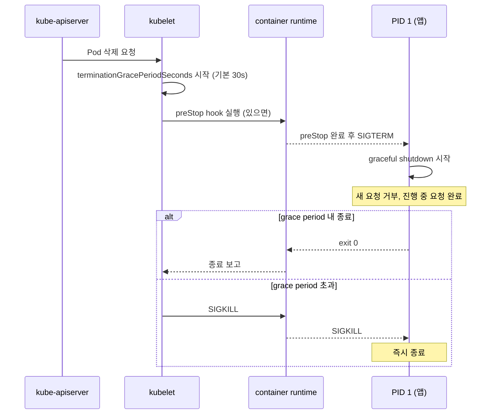

# 시그널 처리

## 개요

프로세스 관리에서 가장 미묘한 버그가 나오는 영역이 시그널이다. `kill -9`로 끝나는 단순한 이야기 같지만, 실제로는 컨테이너 종료 시 요청이 잘리거나, SIGCHLD를 잘못 다뤄서 좀비가 쌓이거나, 핸들러 안에서 `printf` 한 줄 때문에 데드락이 걸리는 경우가 끊임없이 나온다. 이 문서는 시그널이라는 메커니즘 자체보다, 운영 중에 실제로 만나는 함정과 그걸 피하는 코드 패턴을 정리한다.

시그널은 비동기적인 인터럽트다. 프로세스가 어떤 명령을 실행하는 중간에 핸들러로 점프했다가 돌아온다. 이 "어떤 명령을 실행하는 중간"이라는 부분이 거의 모든 시그널 버그의 원인이다. malloc 중간일 수도, printf 중간일 수도, 어떤 자료구조의 일관성이 깨진 순간일 수도 있다. 핸들러는 그 어떤 상황에서도 안전하게 끝나야 한다.

## 시그널 종류와 기본 동작

자주 보는 시그널은 30개 정도지만, 실무에서 직접 다루는 건 다음 표 정도다.

| 번호 | 이름 | 기본 동작 | 캐치 가능 | 무시 가능 | 주요 용도 |
|------|------|-----------|-----------|-----------|-----------|
| 1 | SIGHUP | Term | O | O | 터미널 종료, 데몬 설정 리로드 관례 |
| 2 | SIGINT | Term | O | O | Ctrl+C |
| 3 | SIGQUIT | Core | O | O | Ctrl+\\, JVM은 스레드 덤프 |
| 6 | SIGABRT | Core | O | O | abort(), assert 실패 |
| 9 | SIGKILL | Term | **X** | **X** | 강제 종료, 절대 못 막음 |
| 11 | SIGSEGV | Core | O | O | 잘못된 메모리 접근 |
| 13 | SIGPIPE | Term | O | O | 닫힌 파이프/소켓에 write |
| 14 | SIGALRM | Term | O | O | alarm(), setitimer() |
| 15 | SIGTERM | Term | O | O | 정상 종료 요청, 기본 kill |
| 17 | SIGCHLD | Ign | O | O | 자식 프로세스 상태 변경 |
| 18 | SIGCONT | Cont | O | O | STOP된 프로세스 재개 |
| 19 | SIGSTOP | Stop | **X** | **X** | 강제 일시정지, 절대 못 막음 |
| 20 | SIGTSTP | Stop | O | O | Ctrl+Z |
| 28 | SIGWINCH | Ign | O | O | 터미널 크기 변경 |
| 10/12 | SIGUSR1/2 | Term | O | O | 애플리케이션이 임의로 정의 |

번호가 다를 수 있다. SIGUSR1이 어떤 아키텍처에서는 16, 다른 곳에서는 30이다. 코드에서는 무조건 이름(`SIGUSR1`)으로 써야 하고, 셸에서는 `kill -l`로 매핑을 확인한다.

핵심은 SIGKILL과 SIGSTOP은 핸들러로 못 잡는다는 점이다. 컨테이너가 안 죽는다면 `D` 상태(uninterruptible sleep)이거나 PID 1로 동작 중인 프로세스가 시그널을 받아도 디폴트 핸들러가 없는 경우다. PID 1은 명시적으로 핸들러를 등록하지 않은 시그널은 **무시**하는 특수 동작을 하기 때문에, 컨테이너에서 SIGTERM 무시되는 사고가 자주 난다.

## signal()과 sigaction() 차이, signal()을 쓰면 안 되는 이유

대부분의 입문 자료가 `signal(SIGINT, handler)` 같은 코드를 보여준다. 이건 쓰면 안 된다. 이유는 `signal()`의 의미가 시스템마다 다르기 때문이다.

System V 의미론에서는 핸들러가 한 번 호출되면 디폴트 동작으로 자동 리셋된다. 즉 두 번째 시그널부터는 핸들러가 안 불린다. BSD 의미론에서는 핸들러가 유지되고, 핸들러 실행 중에는 같은 시그널이 자동으로 블록된다. Linux의 `signal()`은 glibc 버전과 컴파일 옵션(`_BSD_SOURCE` 등)에 따라 어느 쪽으로도 동작할 수 있다. 같은 코드가 환경에 따라 다르게 돈다.

```c
// 쓰지 말 것
signal(SIGINT, handler);

// 항상 sigaction()
struct sigaction sa = {0};
sa.sa_handler = handler;
sigemptyset(&sa.sa_mask);
sa.sa_flags = SA_RESTART;  // 시스템 콜 재시작
sigaction(SIGINT, &sa, NULL);
```

`sigaction()`은 동작이 명확하게 정의돼 있고, 핸들러 동안 어떤 시그널을 추가로 블록할지(`sa_mask`), 시스템 콜을 재시작할지(`SA_RESTART`), 자식 종료 통지를 자동으로 받을지(`SA_NOCLDWAIT`) 같은 걸 명시적으로 지정한다. POSIX도 `signal()`을 deprecated로 본다.

`SA_RESTART`를 켜는 이유는 `read()`, `accept()` 같은 블로킹 시스템 콜이 시그널을 받으면 `EINTR`로 깨어나는데, 매번 EINTR을 체크해서 재시도하는 코드를 쓰기 귀찮기 때문이다. 다만 `SA_RESTART`가 모든 시스템 콜에 적용되지는 않는다. `select()`, `poll()`, `epoll_wait()`, `pselect()`는 `SA_RESTART`가 켜져 있어도 EINTR을 반환한다. 이게 의도된 동작이라, "시그널이 와도 어차피 깨어나서 처리할 거니까 재시작 안 한다"는 식이다.

## 비동기 안전 함수(async-signal-safe) 제약

핸들러 안에서 호출할 수 있는 함수는 POSIX가 명시적으로 "async-signal-safe"라고 지정한 것뿐이다. 그 외의 함수를 호출하면 정의되지 않은 동작이 된다. 보통 잘 돌다가 부하가 올라갔을 때 어쩌다 한 번 데드락이 걸리는 식으로 터진다.

핸들러에서 **호출하면 안 되는 함수** (자주 실수하는 것들):

- `printf`, `fprintf`, `puts` 등 stdio 함수들 — 내부 락 잡고 있는 중에 핸들러 들어가면 데드락
- `malloc`, `free`, `calloc`, `realloc` — 힙 락 데드락
- `pthread_*` 대부분 — `pthread_self()` 정도만 안전한 구현이 있음, 표준은 아님
- `localtime`, `gmtime`, `strftime` — 내부 정적 버퍼와 tzset 락
- `syslog` — 내부 락
- `exit` — atexit 핸들러 + stdio 플러시. `_exit()`만 안전

핸들러에서 **써도 되는 것들** (POSIX.1-2008 기준):

- `write`, `read` (단순 시스템 콜은 대체로 안전)
- `_exit`, `_Exit`
- `signal`, `sigaction`, `sigprocmask`, `kill`, `raise`
- `time`, `clock_gettime` (Linux는 안전, 표준은 시스템 의존)
- `sem_post` — 세마포어로 메인 루프에 시그널 알리는 용도

실용적으로는 핸들러 안에서 `write(STDERR_FILENO, "term\n", 5)` 같은 단순한 로깅 외에는 아무것도 하지 않는다. 플래그만 세팅하고 나오는 게 정석이다.

```c
#include <signal.h>
#include <unistd.h>

// volatile sig_atomic_t 가 핵심
static volatile sig_atomic_t g_should_exit = 0;

static void handle_term(int signo) {
    g_should_exit = 1;
    // 핸들러는 여기서 끝. 나머지는 메인 루프에서.
}

int main(void) {
    struct sigaction sa = {0};
    sa.sa_handler = handle_term;
    sigemptyset(&sa.sa_mask);
    sa.sa_flags = 0;  // SA_RESTART 안 켬: 메인 루프가 EINTR 보고 종료 체크
    sigaction(SIGTERM, &sa, NULL);
    sigaction(SIGINT, &sa, NULL);

    while (!g_should_exit) {
        // 작업
    }
    // 정리
    return 0;
}
```

`volatile sig_atomic_t`는 두 가지 의미가 있다. `volatile`은 컴파일러가 캐시하지 못하게 막아서 핸들러가 바꾼 값을 메인 루프가 보게 하고, `sig_atomic_t`는 단일 워드 원자적 읽기/쓰기를 보장한다. 일반 `int`도 대부분 동작하지만, ABI에 따라 보장이 안 되는 경우가 있다.

## errno 보존

핸들러가 `write()`나 `read()` 같은 시스템 콜을 부르면 `errno`를 덮어쓴다. 메인 코드가 시스템 콜 결과를 보기 직전에 핸들러가 끼어들면 errno가 엉뚱한 값으로 바뀐다.

```c
static void handle_chld(int signo) {
    int saved_errno = errno;
    while (waitpid(-1, NULL, WNOHANG) > 0)
        ;
    errno = saved_errno;
}
```

핸들러 진입 직후 `errno`를 저장하고, 빠져나오기 전에 복원한다. 이걸 빠뜨리면 `read()`가 멀쩡히 성공했는데 errno가 ECHILD로 바뀌어 있어서 디버깅 하루 날리는 일이 있다.

## SIGCHLD 표준 처리 패턴

자식 프로세스가 종료되면 SIGCHLD가 부모에게 온다. 부모가 `wait()` 또는 `waitpid()`를 호출해서 종료 상태를 거둬가야 자식 PID가 회수된다. 안 거둬가면 좀비가 된다.

여기서 자주 하는 실수가 SIGCHLD 한 번에 자식 하나를 wait하는 거다. 시그널은 큐에 쌓이지 않는다(실시간 시그널 제외). 자식 3개가 거의 동시에 종료되면 SIGCHLD가 한 번 또는 두 번만 전달될 수 있다. 그래서 핸들러에서는 반드시 **WNOHANG으로 루프를 돌려서** 더 거둘 자식이 없을 때까지 비워야 한다.

```c
#include <sys/wait.h>
#include <errno.h>
#include <signal.h>

static void handle_chld(int signo) {
    int saved_errno = errno;
    pid_t pid;
    while ((pid = waitpid(-1, NULL, WNOHANG)) > 0) {
        // 필요하면 pid 기록
    }
    errno = saved_errno;
}

int setup_chld(void) {
    struct sigaction sa = {0};
    sa.sa_handler = handle_chld;
    sigemptyset(&sa.sa_mask);
    sa.sa_flags = SA_RESTART | SA_NOCLDSTOP;
    return sigaction(SIGCHLD, &sa, NULL);
}
```

`SA_NOCLDSTOP`은 자식이 SIGSTOP/SIGCONT로 멈추거나 재개될 때까지 SIGCHLD를 안 받겠다는 의미다. 보통 종료만 신경 쓰면 되니까 켠다.

자식 상태에 관심이 없고 좀비만 안 만들면 되는 경우, 더 간단한 방법이 있다.

```c
struct sigaction sa = {0};
sa.sa_handler = SIG_IGN;
sa.sa_flags = SA_NOCLDWAIT;
sigaction(SIGCHLD, &sa, NULL);
```

`SA_NOCLDWAIT`을 켜면 커널이 자식 종료 상태를 자동으로 거둬간다. 자식의 종료 코드를 모르게 되는 대가로 좀비가 안 생긴다. 데몬에서 자주 쓴다.

## sigprocmask로 시그널 차단/해제

크리티컬 섹션에서 시그널을 일시적으로 막고 싶을 때 쓴다. 예를 들어 자료구조를 갱신하는 동안에는 SIGTERM 처리를 잠깐 미루고 싶을 때다.

```c
sigset_t newset, oldset;
sigemptyset(&newset);
sigaddset(&newset, SIGTERM);
sigaddset(&newset, SIGINT);

pthread_sigmask(SIG_BLOCK, &newset, &oldset);
// 크리티컬 섹션
pthread_sigmask(SIG_SETMASK, &oldset, NULL);
```

단일 스레드 프로그램은 `sigprocmask()`, 멀티스레드는 `pthread_sigmask()`를 쓴다. 멀티스레드에서 `sigprocmask()`는 정의되지 않은 동작이다.

차단된 시그널은 사라지지 않고 "pending" 상태로 대기한다. 차단을 풀면 그 시점에 핸들러가 실행된다. 같은 시그널이 차단된 동안 여러 번 와도 한 번만 전달된다(실시간 시그널 SIGRTMIN ~ SIGRTMAX는 큐잉됨).

멀티스레드 프로그램에서는 어느 스레드가 시그널을 받을지 통제하기 위해 보통 다음 패턴을 쓴다.

1. 메인 스레드에서 모든 시그널을 블록
2. 워커 스레드들 생성 (블록 상태를 상속)
3. 시그널 전담 스레드 하나가 `sigwait()`으로 동기적으로 받음

```c
sigset_t set;
sigfillset(&set);
pthread_sigmask(SIG_BLOCK, &set, NULL);

// 워커 생성

// 전담 스레드
sigemptyset(&set);
sigaddset(&set, SIGTERM);
sigaddset(&set, SIGINT);
int sig;
sigwait(&set, &sig);
// sig 처리, 이건 핸들러가 아니라 일반 코드라 뭐든 호출 가능
```

이러면 async-signal-safe 제약이 사라진다. 핸들러 안이 아니라 일반 코드에서 처리하기 때문이다.

## signalfd로 동기적 처리

`signalfd()`는 시그널을 파일 디스크립터로 만들어주는 Linux 전용 인터페이스다. epoll 루프에 그대로 끼울 수 있어서, 이벤트 루프 기반 서버에서 매우 깔끔하게 처리된다.

```c
#include <sys/signalfd.h>

sigset_t mask;
sigemptyset(&mask);
sigaddset(&mask, SIGTERM);
sigaddset(&mask, SIGINT);
sigaddset(&mask, SIGCHLD);

// 시그널을 블록해야 signalfd가 받음
sigprocmask(SIG_BLOCK, &mask, NULL);

int sfd = signalfd(-1, &mask, SFD_CLOEXEC | SFD_NONBLOCK);

// epoll에 등록
struct epoll_event ev = { .events = EPOLLIN, .data.fd = sfd };
epoll_ctl(epfd, EPOLL_CTL_ADD, sfd, &ev);

// 이벤트 루프에서
struct signalfd_siginfo si;
while (read(sfd, &si, sizeof(si)) == sizeof(si)) {
    if (si.ssi_signo == SIGTERM) {
        // 종료 처리
    } else if (si.ssi_signo == SIGCHLD) {
        // waitpid 루프
    }
}
```

`signalfd`를 쓰는 가장 큰 이유는 핸들러를 안 써도 된다는 점이다. async-signal-safe 제약이 없고, 일반 코드 흐름 안에서 시그널을 처리한다. 단점은 Linux 전용이라 macOS에서는 안 돈다는 것.

## pselect/ppoll와 self-pipe trick

`signalfd`가 없는 환경(BSD, macOS)에서 비슷한 효과를 내려면 self-pipe trick을 쓴다. 핸들러는 파이프에 1바이트 쓰고, 메인 루프는 그 파이프를 다른 fd들과 함께 select/poll한다.

```c
static int g_pipe[2];

static void handle_term(int signo) {
    int saved_errno = errno;
    write(g_pipe[1], "x", 1);  // write는 async-signal-safe
    errno = saved_errno;
}

int main(void) {
    pipe2(g_pipe, O_NONBLOCK | O_CLOEXEC);

    struct sigaction sa = {0};
    sa.sa_handler = handle_term;
    sa.sa_flags = SA_RESTART;
    sigaction(SIGTERM, &sa, NULL);

    fd_set rfds;
    while (1) {
        FD_ZERO(&rfds);
        FD_SET(g_pipe[0], &rfds);
        FD_SET(client_fd, &rfds);
        select(...);
        if (FD_ISSET(g_pipe[0], &rfds)) {
            // 종료 처리
            break;
        }
    }
}
```

`pselect()`와 `ppoll()`는 atomic하게 시그널 마스크를 바꾸고 대기하는 변형이다. self-pipe보다 약간 더 깔끔한데, 시그널을 미리 블록해놓고 pselect 호출 시점에만 풀어주는 식으로 race condition을 막을 수 있다.

```c
sigset_t blocked, original;
sigemptyset(&blocked);
sigaddset(&blocked, SIGTERM);
sigprocmask(SIG_BLOCK, &blocked, &original);

// 여기서는 SIGTERM 블록 상태
if (g_should_exit) goto cleanup;

// pselect는 atomically: SIGTERM 풀고 → 대기 → 다시 블록
pselect(nfds, &rfds, NULL, NULL, NULL, &original);
```

일반 select에서 g_should_exit 체크와 select 호출 사이에 SIGTERM이 오면 select에서 영원히 대기하는 race가 있는데, pselect는 그걸 막는다.

## graceful shutdown 구현

운영 환경에서 가장 자주 쓰는 패턴이다. 컨테이너 재배포, 무중단 배포, 스케일 다운 시 SIGTERM이 오는데, 이때 처리 중이던 요청을 끝까지 완료하고 새 요청만 거부해야 한다.

전체 흐름:

1. SIGTERM 받음 → 종료 모드 전환 플래그 ON
2. 새 연결 수락 중지 (listen socket 닫기 또는 accept 루프 종료)
3. 진행 중인 요청은 계속 처리
4. 헬스체크 엔드포인트에서 unhealthy 응답 (로드밸런서가 트래픽 끊도록)
5. 모든 연결이 닫히거나 타임아웃이 될 때까지 대기
6. 종료

C 의사 코드:

```c
static volatile sig_atomic_t g_shutdown = 0;

static void handle_term(int signo) { g_shutdown = 1; }

int main(void) {
    setup_signals();
    int listen_fd = open_listener();

    while (!g_shutdown) {
        int client = accept4(listen_fd, ..., SOCK_NONBLOCK);
        if (client < 0) {
            if (errno == EINTR) continue;
            // ...
        }
        spawn_worker(client);
    }

    close(listen_fd);  // 새 요청 차단

    // 워커가 다 끝날 때까지 대기, 단 타임아웃 있음
    int waited = 0;
    while (active_workers() > 0 && waited < 30) {
        sleep(1);
        waited++;
    }

    if (active_workers() > 0) {
        // 강제 종료
    }
    return 0;
}
```

Go에서는 `context.Context`와 `signal.NotifyContext`로 깔끔하게 표현된다.

```go
ctx, stop := signal.NotifyContext(context.Background(), syscall.SIGTERM, syscall.SIGINT)
defer stop()

srv := &http.Server{Addr: ":8080", Handler: mux}

go func() {
    <-ctx.Done()
    shutdownCtx, cancel := context.WithTimeout(context.Background(), 30*time.Second)
    defer cancel()
    srv.Shutdown(shutdownCtx)  // 진행 중 요청 완료 대기, 새 요청 거부
}()

srv.ListenAndServe()
```

`http.Server.Shutdown()`이 위에서 설명한 흐름을 그대로 구현한 것이다. 새 연결 수락 중지 → keep-alive 연결 닫기 → 진행 중인 핸들러 완료 대기. 타임아웃이 지나면 컨텍스트가 취소되고 핸들러도 강제 종료된다.

Node.js에서는 `server.close()`가 비슷한 역할을 한다.

```javascript
const server = http.createServer(handler);

process.on('SIGTERM', () => {
    console.log('SIGTERM received, shutting down');
    server.close((err) => {
        if (err) process.exit(1);
        process.exit(0);
    });
    // 타임아웃 안전장치
    setTimeout(() => process.exit(1), 30000).unref();
});
```

`server.close()`는 새 연결을 받지 않지만 기존 keep-alive 연결은 안 닫는다. 그래서 클라이언트가 keep-alive로 유지하고 있으면 close 콜백이 영원히 안 불릴 수 있다. 안전장치로 타임아웃이 필요하다.

## 런타임별 시그널 처리 차이

언어 런타임이 시그널을 어떻게 다루는지를 모르면 의외의 동작을 만난다.

**Java/JVM**: JVM은 기본적으로 SIGTERM, SIGINT, SIGHUP에 대해 shutdown hook을 트리거한다. `Runtime.getRuntime().addShutdownHook(...)`으로 등록한다. JVM은 SIGSEGV, SIGFPE도 자체적으로 핸들링해서 NullPointerException으로 변환한다(HotSpot의 implicit null check). SIGQUIT는 스레드 덤프를 stderr로 출력한다 — `kill -3 <pid>`로 OOM 디버깅할 때 자주 쓴다. JVM 내부에서 시그널 핸들러를 가로채기 때문에, JNI에서 직접 sigaction을 부르면 JVM과 충돌한다.

**Node.js**: V8은 SIGUSR1을 디버거 진입에 쓴다. `process.on('SIGTERM', ...)`로 핸들러를 등록할 수 있는데, libuv가 내부적으로 self-pipe 비슷한 방식으로 받아서 이벤트 루프로 dispatch한다. 그래서 핸들러 안에서 일반 JavaScript 코드를 다 쓸 수 있다(async-signal-safe 제약 없음). 단, SIGKILL과 SIGSTOP은 Node에서도 못 잡는다.

**Go**: goroutine 스케줄러가 시그널을 가로채서 채널로 변환한다. `signal.Notify(ch, syscall.SIGTERM)` 패턴이 표준이다. Go 런타임이 SIGSEGV를 panic으로 바꾸는 동작이 있어서, C 라이브러리(cgo)에서 SIGSEGV를 자체 처리하려면 `signal.Ignore` 또는 별도 처리가 필요하다. Go는 모든 OS 스레드에서 시그널 마스크를 통일하지 않으니, cgo에서 pthread를 만들면 그 스레드는 별도 시그널 정책을 가진다.

**Python**: GIL과 시그널이 같이 놀면서 미묘한 이슈가 많다. 핸들러는 메인 스레드에서만 실행되고, C 확장이 GIL을 풀고 일하는 동안에는 핸들러 처리가 지연된다. `signal.signal()` 후에도 핸들러가 즉시 실행되는 게 아니라, 다음 바이트코드 실행 시점에 체크된다. Ctrl+C가 안 먹히는 것처럼 보이는 게 이 때문이다.

런타임이 자체적으로 받는 시그널을 사용자가 다시 등록하면 충돌할 수 있다. 예를 들어 JVM에서 `-XX:+UseSignalChaining` 옵션을 안 켜고 JNI에서 SIGSEGV 핸들러를 등록하면 JVM이 이상해진다. Go cgo에서도 비슷한 함정이 있다.

## kubelet의 SIGTERM → grace period → SIGKILL 흐름

Kubernetes에서 Pod이 종료되는 흐름이 시그널 처리 관점에서 정확히 어떻게 도는지 정리한다.



이 흐름에서 몇 가지 함정이 있다.

**PID 1 문제**: 컨테이너에서 앱이 PID 1로 도는데, PID 1은 명시적으로 핸들러가 등록되지 않은 시그널을 무시한다. `CMD ["./myapp"]`로 직접 띄우면 myapp이 SIGTERM을 처리하면 되지만, `CMD ["sh", "-c", "./myapp"]`로 띄우면 sh가 PID 1이 되고 sh는 SIGTERM 핸들러가 없어서 무시한다. 결과적으로 30초 후 SIGKILL로 강제 종료된다. 해결책은 직접 띄우거나 `tini`, `dumb-init` 같은 init 래퍼를 쓰는 것.

**preStop hook**: SIGTERM 보내기 전에 실행된다. `sleep 5` 같은 거 박아두면 로드밸런서가 트래픽 끊을 시간을 벌 수 있다. Endpoint가 Service에서 빠지는 데 시간이 걸리기 때문에, SIGTERM 직후에 들어오는 요청이 있을 수 있다.

**terminationGracePeriodSeconds**: 기본 30초. preStop + SIGTERM 후 처리 시간을 합친 전체 시간이다. preStop에 sleep 10을 박으면 SIGTERM 후 사용 가능한 시간은 20초만 남는다.

**grace period 초과 시 SIGKILL**: 이건 협상 불가다. SIGKILL은 핸들러로 못 잡으니 진행 중인 요청은 그대로 잘린다. DB 트랜잭션 중간에 죽으면 InnoDB가 롤백하긴 하지만, 비즈니스 로직에서 이미 외부 호출을 보냈다면 거기까지는 책임 못 진다. graceful shutdown이 grace period 내에 끝나도록 설계해야 한다.

검증 방법:

```bash
# Pod 삭제하고 실제로 SIGTERM이 잘 전달되는지 확인
kubectl delete pod mypod &
kubectl exec mypod -- sh -c 'cat /proc/1/status | grep State'

# Pod 안에서 strace로 1번 프로세스 시그널 받는 거 보기 (privileged 필요)
strace -e trace=signal -p 1
```

## strace로 시그널 전달 확인

시그널이 진짜 전달됐는지, 핸들러가 호출됐는지를 strace로 본다.

```bash
# 프로세스가 받는 모든 시그널 추적
strace -e trace=signal -p <pid>

# 자식 프로세스까지 따라가기
strace -f -e trace=signal -p <pid>

# 출력 예시
# --- SIGTERM {si_signo=SIGTERM, si_code=SI_USER, si_pid=12345, si_uid=1000} ---
# rt_sigreturn({mask=[]})                 = 0
```

`---` 사이에 나오는 게 시그널 전달이고, `rt_sigreturn`이 핸들러에서 빠져나오는 시점이다. 이게 안 보이면 시그널이 안 왔거나 블록된 상태다.

블록 상태 확인:

```bash
cat /proc/<pid>/status | grep -E '^Sig'
# SigQ:   0/127836            현재 큐에 쌓인 실시간 시그널 개수
# SigPnd: 0000000000000000    이 스레드에 pending인 시그널
# ShdPnd: 0000000000000000    프로세스 전체에 pending인 시그널
# SigBlk: fffffffe7ffbfeff    블록된 시그널 마스크
# SigIgn: 0000000000001000    무시 중인 시그널
# SigCgt: 0000000180014002    핸들러 등록된 시그널
```

비트마스크다. SigBlk에 SIGTERM(15번) 비트가 켜져 있으면 SIGTERM이 와도 처리가 안 된다. PID 1로 돌면서 SIGTERM 무시 문제를 디버깅할 때 SigCgt에 SIGTERM 비트가 꺼져 있는 게 보일 거다.

큰 비트로 디코딩하기 귀찮으면:

```bash
# 16진수를 2진수로 풀어서 어느 시그널인지 확인하는 헬퍼
python3 -c '
mask = int("0000000180014002", 16)
for i in range(64):
    if mask & (1 << i):
        print(f"SIG{i+1}")
'
```

SigCgt(caught) 비트맵을 보면 그 프로세스가 어떤 시그널에 핸들러를 걸었는지 다 알 수 있다. JVM 프로세스에 붙여보면 SIGSEGV, SIGBUS, SIGFPE, SIGPIPE, SIGCHLD 등이 다 켜져 있는 게 보인다.

## 함정 모음

운영 중에 자주 만났던 시그널 관련 사고들이다.

**좀비가 계속 쌓인다**: SIGCHLD 핸들러를 안 걸었거나, 핸들러에서 한 번만 wait했다. 표준 패턴(WNOHANG 루프)으로 고친다.

**컨테이너가 30초 걸려야 죽는다**: PID 1이 SIGTERM을 무시한다. shell wrapper 제거하거나 tini를 쓴다.

**핸들러 안에서 가끔 데드락**: printf, malloc 같은 비안전 함수 호출. 플래그만 세팅하는 패턴으로 변경.

**select가 시그널 받고 깨어나지 않는다**: pselect 또는 self-pipe trick으로 변경. select는 신호 처리와 race가 있다.

**errno가 이상한 값**: 핸들러에서 errno 보존 안 했음. saved_errno 패턴 추가.

**Ctrl+C가 한 번만 먹힌다**: 옛날 `signal()` 호출. SysV 의미로 핸들러가 디폴트로 리셋된 상태. `sigaction()`으로 교체.

**SIGUSR1 받으면 죽는다**: 핸들러를 등록 안 한 시그널의 디폴트 동작이 Term이라서 그렇다. JVM처럼 런타임이 다른 용도로 쓰는 시그널을 잘못 보내도 비슷하다. 애플리케이션 임의 시그널은 USR1/USR2로 약속하지만, 안 쓰더라도 핸들러는 등록해둬야 안전하다.

**graceful shutdown 중 새 요청이 들어온다**: SIGTERM 직후 로드밸런서가 아직 endpoint를 안 뗐다. preStop hook으로 sleep 5 정도 넣거나, readinessProbe를 unhealthy로 만든 뒤 충분히 기다린 후 listen 종료한다.
