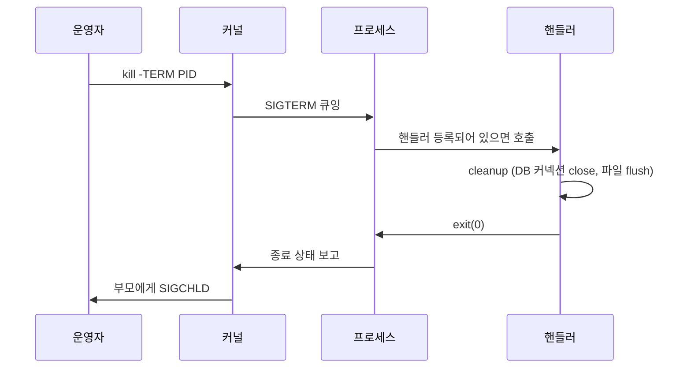

# 프로세스 관리

## 개요

서버에서 가장 많이 마주치는 게 "프로세스가 죽지 않는다", "좀비가 쌓인다", "OOM이 떴다", "ps에서 갑자기 다르게 보인다" 같은 문제다. 명령어 옵션은 `man`을 보면 되지만, 실제로 시간을 잡아먹는 건 STAT 컬럼의 `D`가 무슨 의미인지, 왜 `kill -9`도 안 통하는지, 자식 프로세스가 왜 자꾸 좀비로 남는지 같은 부분이다.

이 문서는 옵션 나열보다는 운영 중에 부딪히는 상황과 그 원인을 추적하는 흐름을 위주로 정리한다.

## 프로세스 상태(STAT) 읽는 법

`ps aux`의 STAT 컬럼은 단순히 "실행 중/대기 중"이 아니라 커널이 그 프로세스를 어떻게 다루고 있는지를 보여준다.

| 코드 | 의미 | 실무에서 마주칠 때 |
|------|------|------|
| R | Running 또는 Runnable | CPU에서 돌고 있거나 런큐에 있음 |
| S | Interruptible Sleep | 시그널 받으면 깨어남, 가장 흔한 정상 상태 |
| D | Uninterruptible Sleep | I/O 대기, **kill로 못 죽임** |
| Z | Zombie | 이미 종료됐지만 부모가 wait()을 안 함 |
| T | Stopped | SIGSTOP 받았거나 디버거 attach 상태 |
| I | Idle 커널 스레드 | kthreadd 자식 |
| < | 높은 우선순위 (nice < 0) | renice -n -5 같은 거 적용된 상태 |
| N | 낮은 우선순위 (nice > 0) | 배치 작업 |
| s | Session leader | setsid()로 분리된 데몬 |
| l | Multi-threaded | 스레드를 가진 프로세스 |
| + | Foreground process group | 터미널과 연결됨 |

가장 위험한 게 `D` 상태다. 시그널을 받지 않기 때문에 `kill -9`로도 죽일 수 없고, 시스템 재부팅 외에는 답이 없는 경우도 있다.

## D 상태 프로세스 디버깅

### 어떤 상황에서 발생하나

D 상태는 커널이 I/O를 기다리는 동안 시그널을 무시하도록 잠근 상태다. 디스크 응답이 멈췄거나, NFS 서버가 죽었거나, FUSE 파일시스템이 hang 됐을 때 흔하다.

```bash
$ ps aux | awk '$8 ~ /D/ { print }'
root       4521  0.0  0.1  12340  3120 ?        D    14:22   0:00 cp /mnt/nfs/data.bin /tmp/
www-data   4892  0.0  0.5  78400 12340 ?        D    14:23   0:01 nginx: worker process
```

이 프로세스에 `kill -9`를 날려도 사라지지 않는다. 시그널 자체가 큐에 들어가긴 하지만 D 상태에서 빠져나오지 않으면 처리되지 않는다.

### 어디서 멈췄는지 확인

`/proc/<PID>/stack`을 읽으면 커널 콜 스택이 나온다. NFS가 원인이면 `nfs_*` 함수가 보인다.

```bash
$ cat /proc/4521/stack
[<ffffffffc0a8c123>] rpc_wait_bit_killable+0x33/0xa0 [sunrpc]
[<ffffffffc0a8c456>] __rpc_execute+0x1a6/0x430 [sunrpc]
[<ffffffffc0a8c789>] rpc_execute+0x69/0x90 [sunrpc]
[<ffffffffc0b1a234>] nfs_revalidate_inode+0xa4/0x1c0 [nfs]
[<ffffffffc0b1c567>] nfs_lookup+0x67/0x2b0 [nfs]
```

`nfs_*`, `rpc_*` 호출이 보이면 NFS 마운트 포인트가 응답하지 않는 거다. `mount | grep nfs`로 어떤 서버를 보는지 확인하고 그 서버 상태를 점검해야 한다.

### iowait 폭증 추적

`top`에서 `%wa`가 높을 때 D 상태 프로세스를 묶어서 본다.

```bash
$ top -b -n 1 | head -5
top - 14:25:33 up 12 days,  3:14,  2 users,  load average: 8.21, 6.33, 4.12
%Cpu(s):  2.1 us,  1.8 sy,  0.0 ni, 31.4 id, 64.3 wa,  0.0 hi,  0.4 si,  0.0 st
```

`wa`(iowait)가 64%인데 D 상태 프로세스가 누적된다면 디스크나 네트워크 스토리지가 병목이다. `iotop -o`로 실제 I/O를 일으키는 프로세스를 찾고, `iostat -x 1`로 디스크별 `await`, `%util`을 본다.

NFS hang의 응급 처치는 보통 이렇게 흘러간다.

```bash
# 1. NFS 마운트 강제 해제 시도
umount -f /mnt/nfs

# 2. 위가 안 되면 lazy unmount
umount -l /mnt/nfs

# 3. 그래도 D 상태 프로세스가 살아있다면 재부팅 외에 방법이 없다
```

`-l` (lazy)은 새로운 접근만 차단할 뿐, 이미 D 상태로 들어간 프로세스는 그대로 남는다. NFS는 `soft,intr` 옵션 없이 마운트하면 이런 문제가 반복된다.

## 좀비 프로세스 양산 원인 추적

좀비는 자식이 종료됐는데 부모가 `wait()` 또는 `waitpid()`로 종료 상태를 회수하지 않은 상태다. 프로세스 테이블 슬롯만 차지하고 메모리는 거의 없지만, 누적되면 fork 자체가 실패한다.

### 좀비를 만드는 부모 찾기

```bash
$ ps -eo stat,pid,ppid,cmd | awk '$1 ~ /Z/ { print }'
Z    18234  1842 [worker] <defunct>
Z    18235  1842 [worker] <defunct>
Z    18236  1842 [worker] <defunct>
```

PPID가 1842이고 좀비가 계속 쌓인다면 PID 1842가 자식 종료를 처리하지 않는 거다.

```bash
$ ps -p 1842 -o pid,cmd
  PID CMD
 1842 /usr/bin/python3 /opt/app/job_dispatcher.py
```

### 원인 1: SIGCHLD 핸들러 누락

자식이 죽으면 커널이 부모에게 SIGCHLD를 보내는데, 부모가 이걸 받아서 `wait()`을 호출해야 한다. Python에서는 `subprocess.Popen`을 만들어 두고 `wait()`이나 `poll()`을 호출하지 않으면 그대로 좀비가 된다.

```python
# 좀비 만드는 코드
import subprocess
for cmd in commands:
    subprocess.Popen(cmd, shell=True)  # wait() 안 함

# 정상 코드
for cmd in commands:
    p = subprocess.Popen(cmd, shell=True)
    p.wait()  # 또는 별도 스레드에서 회수
```

C에서는 SIGCHLD를 명시적으로 처리하거나 `signal(SIGCHLD, SIG_IGN)`으로 자동 회수하도록 둬야 한다.

### 원인 2: 데몬에서 double-fork 미사용

데몬을 만들 때 한 번만 fork하면 부모가 죽은 뒤 자식이 init(1)에 입양되긴 하지만, 세션 리더 분리가 제대로 안 되면 터미널이 닫힐 때 SIGHUP에 영향을 받을 수 있고, 자식이 다시 fork할 때 그 손자 프로세스가 좀비로 남기 쉽다.

전형적인 double-fork 패턴은 이렇게 한다.

```c
pid_t pid = fork();
if (pid > 0) exit(0);          // 1차 부모 종료
setsid();                       // 새 세션 리더로 분리
pid = fork();
if (pid > 0) exit(0);          // 2차 부모 종료 → 손자가 init에 입양됨
// 이제 여기가 진짜 데몬
```

2차 fork를 안 하면 세션 리더 자체로 남아서 터미널을 다시 열 수 있고, 자식 프로세스가 좀비로 누적되기 쉽다.

### 좀비 즉시 정리

좀비는 SIGKILL로 못 없앤다(이미 죽어 있으니까). 부모를 재시작하거나 부모에게 SIGCHLD를 명시적으로 보내서 핸들러를 깨운다.

```bash
# 부모에게 SIGCHLD 보내기 (핸들러가 있으면 회수됨)
kill -CHLD 1842

# 안 되면 부모 자체를 재시작
systemctl restart job-dispatcher
```

## 부모 PID 1 고아 프로세스 추적

부모가 먼저 죽으면 자식은 init(보통 systemd, PID 1)에 입양된다. 정상적으로는 systemd가 회수하지만, 의도치 않게 PPID가 1로 바뀐 프로세스가 보인다면 어디선가 부모가 비정상 종료된 거다.

```bash
$ ps -eo pid,ppid,user,etime,cmd | awk '$2 == 1 && $1 != 1'
  PID  PPID USER     ELAPSED CMD
 2341     1 www-data 03:14:22 /usr/bin/php-fpm: pool www
 8721     1 root        2:14 /tmp/.cache/cryptominer
12453     1 deploy   01:23:45 node /opt/app/worker.js
```

여기서 `8721 /tmp/.cache/cryptominer` 같은 게 보이면 침해 사고일 수 있다. 부모가 사라졌다는 건 `nohup`, `setsid`, `disown` 같은 걸로 의도적으로 분리됐거나, 부모가 크래시한 거다.

추적은 이렇게 한다.

```bash
# 1. 실행 파일 확인
ls -l /proc/8721/exe

# 2. cwd 확인
ls -l /proc/8721/cwd

# 3. 명령어 라인 (cmdline은 NUL 구분이라 tr 필요)
cat /proc/8721/cmdline | tr '\0' ' '; echo

# 4. 환경 변수
cat /proc/8721/environ | tr '\0' '\n'

# 5. 열린 파일/소켓
ls -l /proc/8721/fd/
```

`/proc/<PID>/exe`가 이미 삭제된 파일을 가리키면 `(deleted)`가 붙는다. 악성 프로세스가 자기 바이너리를 지운 뒤 메모리에서 실행 중일 때 흔히 보이는 패턴이다.

## OOM Killer 발동 후 dmesg 확인

메모리가 부족하면 커널이 OOM Killer를 발동시켜 점수가 가장 높은 프로세스를 죽인다. 갑자기 nginx나 mysql이 사라졌는데 로그에 종료 사유가 안 남아 있다면 OOM부터 의심한다.

```bash
$ dmesg -T | grep -i 'killed process\|out of memory'
[Tue Apr 30 13:42:11 2026] mysqld invoked oom-killer: gfp_mask=0x100cca(GFP_HIGHUSER_MOVABLE), order=0, oom_score_adj=0
[Tue Apr 30 13:42:11 2026] Out of memory: Killed process 18234 (mysqld) total-vm:8421344kB, anon-rss:6231244kB, file-rss:0kB, shmem-rss:0kB, UID:27 pgtables:12856kB oom_score_adj:0
```

`Killed process 18234 (mysqld)` 라인이 핵심이다. `total-vm`, `anon-rss`로 죽기 직전 메모리 사용량을 알 수 있다.

OOM 직전 후보를 미리 보려면 `/proc/<PID>/oom_score`를 본다.

```bash
$ for pid in $(ls /proc | grep -E '^[0-9]+$'); do
    score=$(cat /proc/$pid/oom_score 2>/dev/null)
    [ -z "$score" ] && continue
    cmd=$(cat /proc/$pid/comm 2>/dev/null)
    echo "$score $pid $cmd"
  done | sort -rn | head -10
```

점수가 높을수록 먼저 죽는다. 절대 죽으면 안 되는 프로세스는 `oom_score_adj`를 -1000으로 설정하면 OOM Killer 대상에서 제외된다.

```bash
echo -1000 > /proc/$(pidof critical-daemon)/oom_score_adj
```

systemd 유닛이라면 `OOMScoreAdjust=-900`을 unit 파일에 넣는다.

OOM이 한 번 떴다는 건 메모리 누수든, 캐시 폭주든, swap이 막혀 있든 근본 원인이 있다. `dmesg`의 OOM 로그 위쪽에는 메모리를 많이 쓰던 상위 프로세스 목록이 같이 찍히니 그걸 같이 본다.

## ps/top이 갑자기 다르게 보이는 이유

운영하다 보면 "방금 ps에서 봤는데 다시 보니 다른 컬럼이 나와요" 같은 질문을 받는다. 거의 다 `/proc` 갱신 시점과 표시 단위 차이 때문이다.

### /proc는 스냅샷이다

`ps`는 명령어를 실행하는 그 순간 `/proc/<PID>/stat`을 읽어서 보여준다. CPU 사용률은 누적 jiffy를 시간으로 나눠서 계산한 평균이라, 실행 직후의 짧은 burst는 잘 안 잡힌다.

```bash
# 1초 차이로 두 번 보기
$ ps -p 12345 -o pid,pcpu,pmem,rss; sleep 1; ps -p 12345 -o pid,pcpu,pmem,rss
  PID %CPU %MEM   RSS
12345 45.2  3.1 254320
  PID %CPU %MEM   RSS
12345 78.6  3.2 256480
```

`%CPU`가 갑자기 튀는 건 그 1초 사이에 실제로 작업이 많이 들어갔거나, 누적값 계산의 노이즈다. `top -d 1`처럼 짧은 주기로 보면서 평균을 봐야 정확하다.

### top과 ps의 %CPU 정의가 다르다

`top`은 기본적으로 직전 갱신 주기 동안의 CPU 사용률을 보여주고, `ps aux`의 `%CPU`는 프로세스 시작부터 지금까지의 누적 평균이다. 그래서 같은 프로세스를 동시에 봐도 값이 다르다.

오래 돌면서 처음 한 번만 CPU를 많이 쓴 프로세스는 `ps`에서는 높게 보이지만 `top`에서는 0%에 가깝다. 반대로 방금 막 시작해서 CPU를 갈아 넣는 프로세스는 `top`에서 100%인데 `ps`에서는 낮게 보일 수 있다.

### top에서 1코어가 100%를 넘는 이유

`top`이 기본적으로 "Irix mode"라서 멀티스레드 프로세스의 CPU 사용률이 코어 수만큼 곱해져서 표시된다. 8코어 머신에서 모든 스레드가 풀로 돌면 800%까지 보인다. `top` 안에서 `I` 키를 누르면 "Solaris mode"로 전환돼서 코어 수로 나눈 값(최대 100%)이 보인다.

### RSS와 VSZ 차이

`VSZ`(가상 메모리)는 프로세스가 주소 공간으로 잡고 있는 크기, `RSS`(상주 메모리)는 실제 물리 메모리에 올라온 크기다. JVM이나 Go 런타임은 VSZ가 수십 GB로 보일 수 있는데 RSS는 그보다 훨씬 작다. 메모리 사용량 판단은 RSS를 본다.

공유 라이브러리 때문에 여러 프로세스의 RSS를 단순 합산하면 실제 사용량보다 크게 나온다. 정확하게 보려면 `pmap -x <PID>`나 `smem`을 쓴다.

## strace로 hang 원인 찾기

프로세스가 응답이 없는데 D 상태도 아니고 좀비도 아니면, 어떤 시스템 콜에서 멈춰 있는지 확인한다.

```bash
$ strace -p 12345
strace: Process 12345 attached
read(4,
```

`read(4, ...`에서 멈춰 있다는 건 fd 4번에서 데이터를 기다리는 중이라는 뜻이다. fd 4번이 뭔지 본다.

```bash
$ ls -l /proc/12345/fd/4
lrwx------ 1 app app 64 Apr 30 14:30 /proc/12345/fd/4 -> socket:[8821345]
```

소켓이라면 `ss`로 어떤 연결인지 확인한다.

```bash
$ ss -tnp | grep 12345
ESTAB  0  0  10.0.1.5:54234  10.0.2.10:5432  users:(("app",pid=12345,fd=4))
```

10.0.2.10:5432(아마 PostgreSQL)에서 응답을 안 주고 있는 거다. 이제 DB 쪽을 봐야 한다.

`strace`를 처음 attach할 때는 `-f`(자식 추적), `-T`(시스템 콜 소요 시간), `-tt`(타임스탬프) 옵션을 같이 쓰면 어디서 시간이 길어지는지 보기 좋다.

```bash
strace -fttT -p 12345
```

운영 중인 프로세스에 strace를 걸면 시스템 콜이 모두 ptrace를 거치면서 느려진다. 짧게 붙였다가 떼는 게 좋다.

## lsof로 파일/포트 점유 추적

### 삭제했는데 디스크가 안 비는 경우

```bash
$ df -h /var
Filesystem      Size  Used Avail Use% Mounted on
/dev/sda2        50G   48G   2G  96% /var

$ rm /var/log/huge.log
$ df -h /var
Filesystem      Size  Used Avail Use% Mounted on
/dev/sda2        50G   48G   2G  96% /var   # 안 비었다
```

파일을 지웠는데 어떤 프로세스가 fd로 열고 있으면 inode가 살아 있어서 디스크가 회수되지 않는다.

```bash
$ lsof | grep deleted
nginx    1842 www-data   5w   REG   8,2  41234567890  131234 /var/log/huge.log (deleted)
```

해당 프로세스를 재시작하거나(`systemctl restart nginx`), 라이브 프로세스라면 `truncate -s 0 /proc/1842/fd/5`로 fd를 비우는 트릭이 있다(파일 자체는 이미 unlink됐으니까 fd만 비운다).

### 포트를 누가 잡고 있나

```bash
$ lsof -i :8080
COMMAND   PID USER   FD   TYPE DEVICE SIZE/OFF NODE NAME
java    18234 app   105u  IPv6 8821456      0t0  TCP *:http-alt (LISTEN)
```

`ss -tlnp | grep 8080`도 같은 정보를 더 빠르게 보여준다. lsof는 시스템 전체를 스캔해서 느리다.

## 시그널 전송 흐름

`kill`은 프로세스를 죽이는 명령이 아니라 시그널을 보내는 명령이다. 시그널 종류에 따라 동작이 완전히 다르다.

### 기본 흐름



SIGTERM은 핸들러를 등록할 수 있어서 프로세스가 정리 작업을 하고 종료할 수 있다. SIGKILL과 SIGSTOP은 핸들러를 등록할 수 없고 커널이 즉시 처리한다.

### 종료 보장 패턴

웹 서버나 워커를 안전하게 내리는 표준 패턴이다.

```bash
#!/bin/bash
PID=$1
TIMEOUT=30

# 1. SIGTERM으로 graceful shutdown 시작
kill -TERM "$PID" 2>/dev/null || exit 0

# 2. 정해진 시간만큼 대기하면서 종료 확인
for i in $(seq 1 "$TIMEOUT"); do
    if ! kill -0 "$PID" 2>/dev/null; then
        echo "Stopped gracefully after ${i}s"
        exit 0
    fi
    sleep 1
done

# 3. 시간 초과 시 SIGKILL
echo "Timeout, sending SIGKILL"
kill -KILL "$PID"
```

`kill -0`은 시그널을 보내지 않고 프로세스 존재 여부만 확인한다. 권한도 같이 체크되니까 권한이 없으면 0이 아닌 코드로 빠진다.

systemd는 이 흐름을 `TimeoutStopSec`로 자동 처리한다. 기본 90초 동안 SIGTERM을 보내고, 안 죽으면 SIGKILL을 보낸다.

### graceful shutdown 시 자식까지 정리

부모가 SIGTERM을 받고 종료해도 자식이 살아남으면 init에 입양되면서 누수된다. trap으로 자식을 같이 정리해야 한다.

```bash
#!/bin/bash
trap 'kill -TERM $(jobs -p) 2>/dev/null; wait; exit 0' TERM INT

# 자식 시작
worker1.sh &
worker2.sh &

wait
```

## 프로세스 그룹과 세션을 활용한 일괄 종료

### PGID, SID 개념

프로세스는 PID 외에 PGID(프로세스 그룹 ID)와 SID(세션 ID)를 가진다. 같은 파이프라인으로 묶인 프로세스들은 같은 PGID를 공유한다.

```bash
$ ps -eo pid,ppid,pgid,sid,stat,cmd | grep -E 'pipeline|cat|grep'
12340 11234 12340 11234 Ss+  cat /var/log/app.log
12341 11234 12340 11234 S+   grep ERROR
12342 11234 12340 11234 S+   awk '{print $5}'
```

이 셋은 하나의 파이프(`cat ... | grep ... | awk ...`)로 묶여 있고 PGID가 모두 12340이다.

### 프로세스 그룹 전체 종료

`kill`에 음수 PID를 주면 프로세스 그룹 전체에 시그널을 보낸다.

```bash
# PGID 12340 그룹 전체에 SIGTERM
kill -TERM -12340

# 강제로
kill -KILL -12340
```

이 방식이 유용한 건 자식의 자식까지 한 번에 잡아준다는 점이다. node나 python으로 만든 워커가 자식을 fork하는 경우, 부모 PID만 죽이면 자식이 입양되어 살아남는데, PGID 단위로 죽이면 같이 정리된다.

새 프로세스 그룹으로 분리해서 시작하려면 `setsid`나 셸의 `set -m`을 쓴다.

```bash
setsid ./worker.sh &
```

### 세션 단위로 정리

세션 리더가 죽으면 같은 세션의 프로세스들이 SIGHUP을 받는다. 터미널이 닫힐 때 그 안에서 돌던 프로세스들이 같이 죽는 게 이 메커니즘이다. `nohup`은 SIGHUP을 무시하게 만들어서 이걸 회피한다.

운영 중에 "ssh 끊었더니 빌드가 멈췄다"는 건 거의 다 SIGHUP 때문이다. tmux/screen 안에서 돌리거나 `nohup`을 쓰면 해결된다.

## ps/top 외 자주 쓰는 도구

### pgrep / pkill

이름으로 찾고 죽인다. 스크립트에서 자주 쓴다.

```bash
pgrep -a nginx              # PID와 명령어 같이
pgrep -f "python worker"    # 명령어 라인 전체로 매칭
pkill -TERM -f "old-job"
pkill -P 12345              # PPID로 매칭 (12345의 자식 모두)
```

`pkill -P`로 부모 PID 기반으로 자식을 죽일 수 있는데, 이건 입양 전에만 동작한다. 부모가 이미 죽고 init에 입양된 프로세스는 PPID가 1이라 잡히지 않는다.

### pidof

```bash
$ pidof nginx
1842 1841 1840 1839 1830
$ pidof -s nginx
1830
```

마스터/워커 구조에서 마스터만 잡고 싶으면 `-s`(single, 가장 오래된 PID)를 쓰거나, `pgrep -o`를 쓴다.

### pstree

부모-자식 관계를 트리로 본다. 자식이 어디서 갈라졌는지 한눈에 보여준다.

```bash
$ pstree -p 1842
nginx(1842)─┬─nginx(1845)
            ├─nginx(1846)
            └─nginx(1847)
```

### /proc 직접 읽기

스크립트에서는 `/proc/<PID>/`를 직접 읽는 게 안정적이다. `ps`의 출력 포맷은 배포판마다 미묘하게 다르다.

| 파일 | 내용 |
|------|------|
| status | Name, State, Pid, PPid, Uid, VmRSS 등 사람이 읽기 좋은 형식 |
| stat | 같은 정보를 한 줄로 (top/ps가 파싱하는 형식) |
| cmdline | 명령어 라인, NUL 구분 |
| environ | 환경 변수, NUL 구분 |
| fd/ | 열린 파일 디스크립터 (심볼릭 링크) |
| maps | 메모리 매핑 |
| limits | ulimit 값 |
| io | 누적 I/O 바이트 |
| stack | 커널 콜 스택 (D 상태 디버깅에 핵심) |
| oom_score | OOM 점수 |
| oom_score_adj | OOM 점수 조정값 (-1000 ~ 1000) |

## nice / renice 우선순위

CPU 우선순위를 조정하는 nice 값은 -20(최우선)부터 19(최저)까지다. 일반 사용자는 0~19만 쓸 수 있고, 음수값(우선순위 상승)은 root만 가능하다.

```bash
# 백업 같은 배경 작업은 우선순위 낮춰서
nice -n 19 tar czf backup.tar.gz /data &

# 실행 중인 프로세스 변경
renice -n 10 -p 12345
```

CPU 스케줄링 정책을 바꾸는 `chrt`도 있다. 실시간 우선순위가 필요하면 `chrt -r 50 command`처럼 쓰지만, 잘못 쓰면 시스템 응답성이 박살난다. 일반 워크로드에서는 거의 쓸 일이 없다.

I/O 우선순위는 `ionice`로 따로 관리한다. CPU 우선순위와 I/O 우선순위는 별개라서 nice만 낮춰도 디스크는 똑같이 점유한다.

```bash
ionice -c 3 -p 12345        # idle class (다른 I/O 없을 때만 동작)
```

## 백그라운드 실행과 세션 분리

`command &`는 단순히 백그라운드로 보내기만 한다. 터미널이 닫히면 SIGHUP을 받아 같이 죽는다. 영구히 띄우려면 세션 자체를 분리해야 한다.

```bash
# 1. nohup: SIGHUP 무시
nohup ./worker.sh > worker.log 2>&1 &

# 2. disown: 이미 실행 중인 작업을 셸의 jobs 테이블에서 제거
./worker.sh &
disown -h %1

# 3. setsid: 새 세션으로 분리 (가장 깔끔)
setsid ./worker.sh > worker.log 2>&1 < /dev/null &

# 4. systemd-run: 임시 systemd 유닛으로 실행
systemd-run --scope --user ./worker.sh
```

운영에서 영구 실행은 `systemd` 유닛으로 만드는 게 정답이다. nohup은 즉석에서 쓸 때나 적절하다. 로그 회전, 자동 재시작, 의존성 같은 게 다 빠지기 때문이다.

## 정리

운영 중에 프로세스 문제로 시간을 가장 많이 잡아먹는 건 D 상태 hang, 좀비 누적, OOM, 그리고 "왜 안 죽지" 시리즈다. 이들 대부분은 `/proc/<PID>/stack`, `dmesg`, `strace`, `lsof`만 익숙하면 짧게 끝난다.

옵션을 외우려고 하지 말고, 어디서 무엇을 봐야 하는지 흐름을 머리에 넣어두는 게 더 빠르다. 명령어는 매번 `man`을 봐도 되지만, "D 상태가 보이면 stack을 본다", "좀비가 쌓이면 PPID를 찾아서 그 프로세스의 SIGCHLD 처리를 본다", "갑자기 사라진 프로세스는 dmesg에서 OOM부터 본다" 같은 판단 기준이 더 중요하다.
