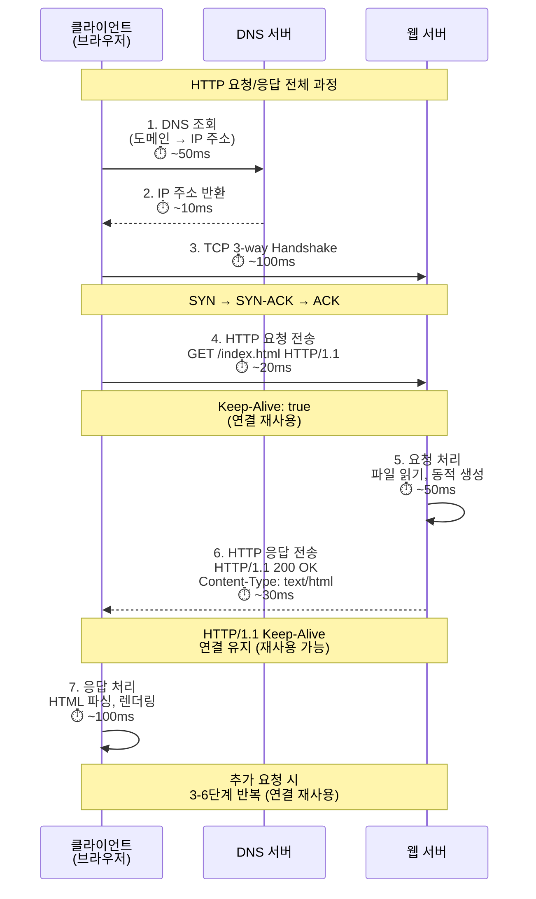
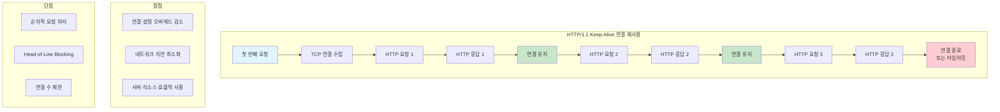
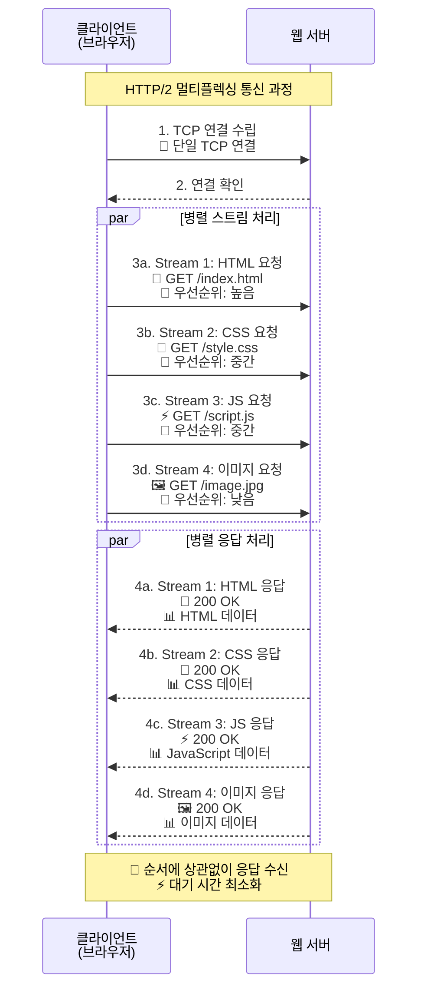
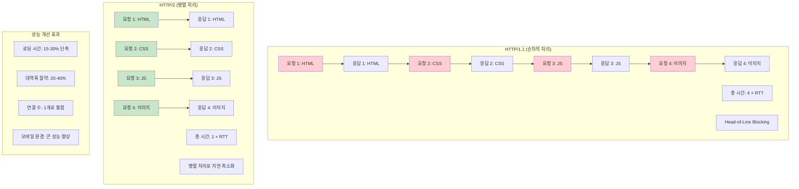
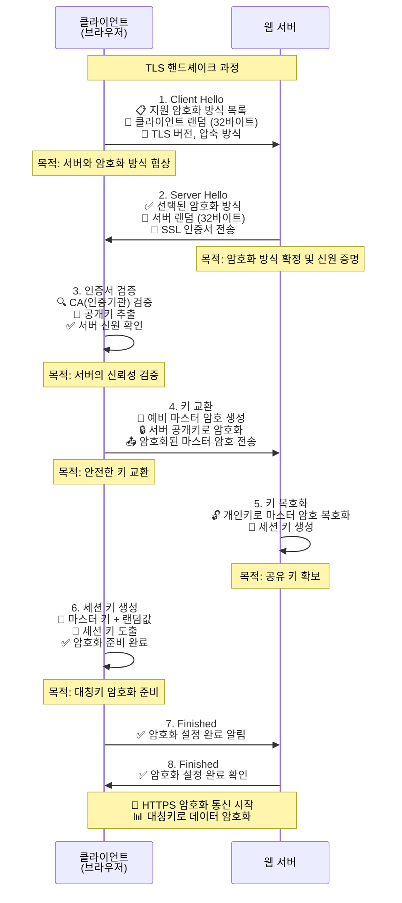
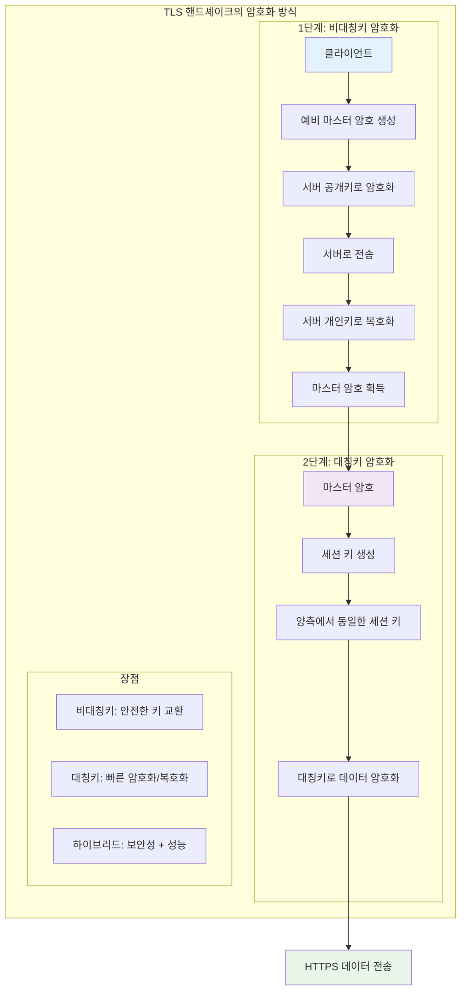

# HTTP (HyperText Transfer Protocol)

> **📌 개요**: 웹의 기반이 되는 프로토콜로, 클라이언트와 서버 간의 통신을 담당하는 애플리케이션 계층 프로토콜입니다.

## HTTP 기본 개념

### HTTP란?
HTTP(HyperText Transfer Protocol)는 웹에서 정보를 주고받기 위한 프로토콜입니다. 클라이언트(웹 브라우저)와 서버 간의 통신 규칙을 정의하며, HTML 문서, 이미지, 동영상 등 다양한 리소스를 전송할 수 있습니다.

### 주요 특징
- **클라이언트-서버 모델**: 요청하는 클라이언트와 응답하는 서버로 구성
- **포트 번호**: HTTP는 80번, HTTPS는 443번 포트 사용
- **텍스트 기반**: 사람이 읽을 수 있는 형태의 메시지 구조
- **상태 비저장(Stateless)**: 각 요청이 독립적으로 처리됨

## HTTP 통신 구조

### 구성 요소
1. **클라이언트**: 웹 브라우저, 모바일 앱, API 클라이언트 등
2. **서버**: 웹 서버, API 서버, 정적 파일 서버 등
3. **프록시**: 중간 서버로 캐싱, 로드 밸런싱, 보안 기능 제공

## HTTP 프로토콜의 핵심 특징

### 1. Connectionless (비연결 지향)
- 요청-응답 후 연결 종료
- **장점**: 서버 리소스 효율적 사용, 동시 접속자 증가 가능
- **단점**: 매 요청마다 연결 설정 필요, 지연 발생

### 2. Stateless (무상태)
- 각 요청이 독립적으로 처리됨
- **장점**: 서버 복잡도 감소, 확장성 우수
- **단점**: 상태 정보 유지를 위한 추가 메커니즘 필요

### 3. 상태 관리 방법
- **쿠키**: 클라이언트에 상태 정보 저장
- **세션**: 서버에 상태 정보 저장
- **JWT**: 토큰 기반 상태 관리
- **OAuth**: 외부 인증 서비스 활용

## HTTP 통신 과정

### HTTP 요청/응답 플로우

### HTTP/1.1 Keep-Alive 연결 재사용

### HTTP/2 멀티플렉싱 구조

### HTTP/1.1 vs HTTP/2 성능 비교

### 1. 연결 설정
- 클라이언트가 서버와 TCP 연결 수립
- HTTP/1.1: Keep-Alive로 연결 재사용
- HTTP/2: 멀티플렉싱으로 효율적 연결 관리

### 2. 메시지 전송
- **HTTP/1.1**: 텍스트 기반 메시지
- **HTTP/2**: 바이너리 프레임 단위 전송
- **메시지 구조**: 시작줄 + 헤더 + 본문

### 3. 응답 처리
- 서버가 요청 처리 후 응답 반환
- **응답 구조**: 상태 코드 + 헤더 + 본문

## HTTP 메서드 (요청 방식)

### 주요 메서드
- **GET**: 리소스 조회 (읽기 전용, 안전)
- **POST**: 리소스 생성 (데이터 전송)
- **PUT**: 리소스 전체 수정
- **DELETE**: 리소스 삭제
- **PATCH**: 리소스 부분 수정

### 기타 메서드
- **HEAD**: 헤더 정보만 조회
- **OPTIONS**: 지원하는 메서드 확인
- **TRACE**: 요청 경로 추적
- **CONNECT**: 프록시 터널링

## HTTP 상태 코드

### 1xx (정보 응답)
- **100 Continue**: 요청 계속 진행
- **101 Switching Protocols**: 프로토콜 전환

### 2xx (성공)
- **200 OK**: 요청 성공
- **201 Created**: 리소스 생성 성공
- **204 No Content**: 성공하지만 응답 본문 없음

### 3xx (리다이렉션)
- **301 Moved Permanently**: 영구 이동
- **302 Found**: 임시 이동
- **304 Not Modified**: 수정되지 않음 (캐시 사용)

### 4xx (클라이언트 오류)
- **400 Bad Request**: 잘못된 요청
- **401 Unauthorized**: 인증 필요
- **403 Forbidden**: 접근 금지
- **404 Not Found**: 리소스 없음

### 5xx (서버 오류)
- **500 Internal Server Error**: 서버 내부 오류
- **502 Bad Gateway**: 게이트웨이 오류
- **503 Service Unavailable**: 서비스 이용 불가

## HTTP 헤더

### 일반 헤더 (General Headers)
- **Date**: 메시지 생성 시간
- **Connection**: 연결 관리 방식
- **Cache-Control**: 캐시 정책

### 요청 헤더 (Request Headers)
- **Host**: 대상 서버
- **User-Agent**: 클라이언트 정보
- **Accept**: 수용 가능한 미디어 타입
- **Authorization**: 인증 정보

### 응답 헤더 (Response Headers)
- **Server**: 서버 정보
- **Set-Cookie**: 쿠키 설정
- **Content-Type**: 응답 데이터 타입
- **Content-Length**: 응답 본문 크기

## HTTPS (HTTP Secure)

### HTTPS란?
HTTPS는 HTTP에 SSL/TLS 암호화를 추가한 보안 프로토콜입니다. 데이터 전송 시 암호화를 통해 중간자 공격을 방지하고, 서버의 신원을 인증합니다.

### HTTP vs HTTPS 비교

| 구분 | HTTP | HTTPS |
|------|------|-------|
| **보안성** | 평문 전송 (취약) | 암호화 전송 (안전) |
| **포트** | 80번 | 443번 |
| **인증서** | 불필요 | SSL 인증서 필요 |
| **성능** | 빠름 | 암호화로 인한 오버헤드 |
| **URL** | `http://` | `https://` |

## TLS/SSL 보안 프로토콜

### SSL과 TLS
- **SSL (Secure Sockets Layer)**: 1995년 Netscape에서 개발한 초기 보안 프로토콜
- **TLS (Transport Layer Security)**: SSL의 개선된 버전, 현재 웹 표준

### 보안 프로토콜의 목적
- **데이터 보호**: 민감한 정보의 암호화 전송
- **중간자 공격 방지**: 통신 경로의 보안 강화
- **신원 인증**: 서버의 신뢰성 확인

### 프로토콜 버전 현황

| 버전 | 발표년도 | 보안 수준 | 현재 상태 |
|------|----------|-----------|-----------|
| **SSL 2.0/3.0** | 1995-1996 | 취약 | 사용 금지 |
| **TLS 1.0/1.1** | 1999-2006 | 취약 | 사용 금지 |
| **TLS 1.2** | 2008 | 안전 | 널리 사용 |
| **TLS 1.3** | 2018 | 매우 안전 | 최신 표준 |

## 암호화 방식

### 대칭키 암호화
- **특징**: 동일한 키로 암호화/복호화
- **장점**: 빠른 연산 속도
- **단점**: 키 교환 문제, 키 노출 시 위험
- **알고리즘**: AES, DES, 3DES

### 비대칭키 암호화
- **특징**: 공개키/개인키 쌍 사용
- **장점**: 안전한 키 교환, 키 노출 위험 낮음
- **단점**: 느린 연산 속도
- **알고리즘**: RSA, ECC

### 하이브리드 방식
- **구성**: 비대칭키로 대칭키 교환 + 대칭키로 데이터 암호화
- **장점**: 보안성과 성능의 균형
- **사용**: TLS/SSL에서 실제 사용하는 방식

## TLS 핸드셰이크 과정

### TLS 핸드셰이크 전체 과정

### 대칭키/비대칭키 암호화 과정

### 핸드셰이크의 목적
- 클라이언트와 서버 간의 신원 확인
- 암호화 알고리즘 협상
- 세션 키 생성 및 교환
- 안전한 통신 채널 구축

### 핸드셰이크 단계

#### 1. Client Hello
- 클라이언트가 서버에 연결 시도
- 지원하는 암호화 방식 목록 전송
- 클라이언트 랜덤 데이터 생성

#### 2. Server Hello
- 서버가 선택한 암호화 방식 응답
- 서버 랜덤 데이터 전송
- SSL 인증서 전송

#### 3. 인증서 검증
- 클라이언트가 서버 인증서 검증
- CA(인증기관)를 통한 신원 확인
- 공개키 추출

#### 4. 키 교환
- 클라이언트가 예비 마스터 암호 생성
- 서버 공개키로 암호화하여 전송
- 서버가 개인키로 복호화

#### 5. 세션 키 생성
- 양측에서 마스터 키 생성
- 세션 키 도출
- 암호화 통신 준비 완료

#### 6. 암호화 통신 시작
- HTTPS 데이터 전송 시작

## SSL/TLS 인증서

### 인증서 구성 요소
- **공개키**: 암호화에 사용
- **개인키**: 복호화에 사용 (서버 보관)
- **도메인명**: 적용 대상 도메인
- **발급기관**: CA(인증기관) 정보
- **유효기간**: 인증서 만료일

### 인증서 종류

#### 1. DV (Domain Validated) 인증서
- **검증**: 도메인 소유권만 확인
- **비용**: 무료 (Let's Encrypt)
- **용도**: 개인 사이트, 블로그

#### 2. OV (Organization Validated) 인증서
- **검증**: 조직 정보 추가 확인
- **비용**: 유료
- **용도**: 기업 웹사이트

#### 3. EV (Extended Validated) 인증서
- **검증**: 가장 엄격한 검증
- **특징**: 브라우저 주소창에 조직명 표시
- **용도**: 금융, 전자상거래 사이트

## 보안 헤더

### HSTS (HTTP Strict Transport Security)
- **목적**: 브라우저가 HTTP 대신 HTTPS만 사용하도록 강제
- **헤더**: `Strict-Transport-Security: max-age=63072000; includeSubDomains; preload`

### CSP (Content Security Policy)
- **목적**: XSS 공격 방지
- **헤더**: `Content-Security-Policy: default-src 'self'`

### X-Frame-Options
- **목적**: 클릭재킹 공격 방지
- **헤더**: `X-Frame-Options: SAMEORIGIN`

### X-XSS-Protection
- **목적**: 브라우저의 XSS 필터 활성화
- **헤더**: `X-XSS-Protection: 1; mode=block`

### X-Content-Type-Options
- **목적**: MIME 타입 스니핑 방지
- **헤더**: `X-Content-Type-Options: nosniff`

## 결론

HTTP/HTTPS/TLS는 웹 통신의 핵심 프로토콜입니다.

### 핵심 포인트
- **HTTP**: 웹의 기본 프로토콜, 클라이언트-서버 간 통신 담당
- **HTTPS**: HTTP에 SSL/TLS 암호화를 추가한 보안 프로토콜
- **TLS 핸드셰이크**: 안전한 암호화 통신 채널 구축
- **SSL 인증서**: 서버 신원 인증 및 암호화 키 교환
- **보안 헤더**: 추가적인 웹 보안 강화

### 보안 고려사항
- TLS 1.2 이상 사용 권장
- 정기적인 인증서 갱신 및 모니터링
- 적절한 보안 헤더 설정
- HTTPS 강제 사용 (HSTS)

> **참고 자료**: 
> - [MDN HTTP 개요](https://developer.mozilla.org/ko/docs/Web/HTTP/Overview)
> - [MDN HTTP 메서드](https://developer.mozilla.org/ko/docs/Web/HTTP/Methods)
> - [MDN HTTP 상태 코드](https://developer.mozilla.org/ko/docs/Web/HTTP/Status)