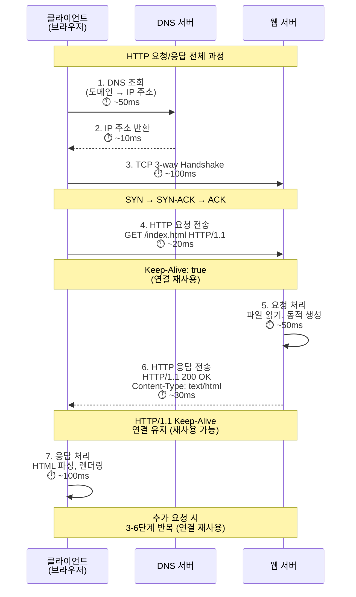
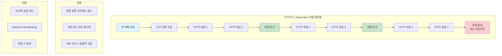

# HTTP (HyperText Transfer Protocol)

## 개요

웹의 기반이 되는 프로토콜로, 클라이언트와 서버 간의 통신을 담당하는 애플리케이션 계층 프로토콜이다.

## HTTP 기본 개념

### HTTP란?

HTTP(HyperText Transfer Protocol)는 웹에서 정보를 주고받기 위한 프로토콜이다. 클라이언트(웹 브라우저)와 서버 간의 통신 규칙을 정의하며, HTML 문서, 이미지, 동영상 등 다양한 리소스를 전송할 수 있다.

### 주요 특징

- 클라이언트-서버 모델: 요청하는 클라이언트와 응답하는 서버로 구성
- 포트 번호: HTTP는 80번, HTTPS는 443번 포트 사용
- 텍스트 기반: 사람이 읽을 수 있는 형태의 메시지 구조
- 상태 비저장(Stateless): 각 요청이 독립적으로 처리됨

## HTTP 통신 구조

### 구성 요소

1. 클라이언트: 웹 브라우저, 모바일 앱, API 클라이언트 등
2. 서버: 웹 서버, API 서버, 정적 파일 서버 등
3. 프록시: 중간 서버로 캐싱, 로드 밸런싱, 보안 기능 제공

## HTTP 프로토콜의 주요 특징

### Connectionless (비연결 지향)

요청-응답 후 연결 종료한다.

**장점:**
- 서버 리소스 효율적 사용
- 동시 접속자 증가 가능

**단점:**
- 매 요청마다 연결 설정 필요
- 지연 발생

**실무 팁:**
HTTP/1.1부터 Keep-Alive로 연결을 재사용할 수 있다.

### Stateless (무상태)

각 요청이 독립적으로 처리된다.

**장점:**
- 서버 복잡도 감소
- 확장성 우수

**단점:**
- 상태 정보 유지를 위한 추가 메커니즘 필요

### 상태 관리 방법

- 쿠키: 클라이언트에 상태 정보 저장
- 세션: 서버에 상태 정보 저장
- JWT: 토큰 기반 상태 관리
- OAuth: 외부 인증 서비스 활용

**실무 팁:**
인증 정보는 세션이나 JWT로 관리한다. 사용자 선호도는 쿠키로 관리한다.

## HTTP 통신 과정

### HTTP 요청/응답 플로우



### HTTP/1.1 Keep-Alive 연결 재사용



### HTTP/2 멀티플렉싱 구조

**통신 과정:**
1. TCP 연결 수립 (단일 TCP 연결)
2. 연결 확인
3. 병렬 스트림 처리:
   - Stream 1: HTML 요청 (우선순위: 높음)
   - Stream 2: CSS 요청 (우선순위: 중간)
   - Stream 3: JS 요청 (우선순위: 중간)
   - Stream 4: 이미지 요청 (우선순위: 낮음)
4. 병렬 응답 처리:
   - Stream 1: HTML 응답
   - Stream 2: CSS 응답
   - Stream 3: JS 응답
   - Stream 4: 이미지 응답

**특징:**
- 순서에 상관없이 응답 수신
- 대기 시간 최소화

### HTTP/1.1 vs HTTP/2 성능 비교

**HTTP/1.1 (순차적 처리):**
- 요청 1: HTML → 응답 1: HTML
- 요청 2: CSS → 응답 2: CSS
- 요청 3: JS → 응답 3: JS
- 요청 4: 이미지 → 응답 4: 이미지
- 총 시간: 4 × RTT
- Head-of-Line Blocking 발생

**HTTP/2 (병렬 처리):**
- 요청 1: HTML → 응답 1: HTML
- 요청 2: CSS → 응답 2: CSS
- 요청 3: JS → 응답 3: JS
- 요청 4: 이미지 → 응답 4: 이미지
- 총 시간: 1 × RTT
- 병렬 처리로 지연 최소화

**성능 개선 효과:**
- 로딩 시간: 15-30% 단축
- 대역폭 절약: 20-40%
- 연결 수: 1개로 통합
- 모바일 환경: 큰 성능 향상

### 연결 설정

- 클라이언트가 서버와 TCP 연결 수립
- HTTP/1.1: Keep-Alive로 연결 재사용
- HTTP/2: 멀티플렉싱으로 효율적 연결 관리

### 메시지 전송

- HTTP/1.1: 텍스트 기반 메시지
- HTTP/2: 바이너리 프레임 단위 전송
- 메시지 구조: 시작줄 + 헤더 + 본문

### 응답 처리

- 서버가 요청 처리 후 응답 반환
- 응답 구조: 상태 코드 + 헤더 + 본문

**실무 팁:**
HTTP/2는 단일 연결로 여러 요청을 병렬 처리하므로 성능이 크게 향상된다.

## HTTP 메서드 (요청 방식)

### 주요 메서드

- GET: 리소스 조회 (읽기 전용, 안전)
- POST: 리소스 생성 (데이터 전송)
- PUT: 리소스 전체 수정
- DELETE: 리소스 삭제
- PATCH: 리소스 부분 수정

### 기타 메서드

- HEAD: 헤더 정보만 조회
- OPTIONS: 지원하는 메서드 확인
- TRACE: 요청 경로 추적
- CONNECT: 프록시 터널링

**예시:**
```http
GET /users/123 HTTP/1.1
Host: api.example.com

POST /users HTTP/1.1
Host: api.example.com
Content-Type: application/json

{
  "name": "홍길동",
  "email": "hong@example.com"
}
```

**실무 팁:**
GET은 멱등성이 보장되지만 POST는 그렇지 않다. PUT은 전체 교체, PATCH는 부분 수정에 사용한다.

## HTTP 상태 코드

### 1xx (정보 응답)

- 100 Continue: 요청 계속 진행
- 101 Switching Protocols: 프로토콜 전환

### 2xx (성공)

- 200 OK: 요청 성공
- 201 Created: 리소스 생성 성공
- 204 No Content: 성공하지만 응답 본문 없음

### 3xx (리다이렉션)

- 301 Moved Permanently: 영구 이동
- 302 Found: 임시 이동
- 304 Not Modified: 수정되지 않음 (캐시 사용)

### 4xx (클라이언트 오류)

- 400 Bad Request: 잘못된 요청
- 401 Unauthorized: 인증 필요
- 403 Forbidden: 접근 금지
- 404 Not Found: 리소스 없음

### 5xx (서버 오류)

- 500 Internal Server Error: 서버 내부 오류
- 502 Bad Gateway: 게이트웨이 오류
- 503 Service Unavailable: 서비스 이용 불가

**실무 팁:**
4xx는 클라이언트 오류이므로 재시도해도 해결되지 않는다. 5xx는 서버 오류이므로 일시적일 수 있어 재시도가 도움이 될 수 있다.

## HTTP 헤더

### 일반 헤더 (General Headers)

- Date: 메시지 생성 시간
- Connection: 연결 관리 방식
- Cache-Control: 캐시 정책

### 요청 헤더 (Request Headers)

- Host: 대상 서버
- User-Agent: 클라이언트 정보
- Accept: 수용 가능한 미디어 타입
- Authorization: 인증 정보

### 응답 헤더 (Response Headers)

- Server: 서버 정보
- Set-Cookie: 쿠키 설정
- Content-Type: 응답 데이터 타입
- Content-Length: 응답 본문 크기

**예시:**
```http
GET /api/users HTTP/1.1
Host: api.example.com
User-Agent: Mozilla/5.0
Accept: application/json
Authorization: Bearer token123

HTTP/1.1 200 OK
Content-Type: application/json
Content-Length: 123
Set-Cookie: sessionId=abc123; HttpOnly; Secure
```

**실무 팁:**
Authorization 헤더는 민감한 정보이므로 HTTPS를 사용해야 한다.

## HTTPS (HTTP Secure)

### HTTPS란?

HTTPS는 HTTP에 SSL/TLS 암호화를 추가한 보안 프로토콜이다. 데이터 전송 시 암호화를 통해 중간자 공격을 방지하고, 서버의 신원을 인증한다.

### HTTP vs HTTPS 비교

| 구분 | HTTP | HTTPS |
|------|------|-------|
| 보안성 | 평문 전송 (취약) | 암호화 전송 (안전) |
| 포트 | 80번 | 443번 |
| 인증서 | 불필요 | SSL 인증서 필요 |
| 성능 | 빠름 | 암호화로 인한 오버헤드 |
| URL | `http://` | `https://` |

**실무 팁:**
민감한 정보를 전송하는 모든 API는 HTTPS를 사용해야 한다. HTTP/2는 HTTPS가 필수다.

## TLS/SSL 보안 프로토콜

### SSL과 TLS

- SSL (Secure Sockets Layer): 1995년 Netscape에서 개발한 초기 보안 프로토콜
- TLS (Transport Layer Security): SSL의 개선된 버전, 현재 웹 표준

### 보안 프로토콜의 목적

- 데이터 보호: 민감한 정보의 암호화 전송
- 중간자 공격 방지: 통신 경로의 보안 강화
- 신원 인증: 서버의 신뢰성 확인

### 프로토콜 버전 현황

| 버전 | 발표년도 | 보안 수준 | 현재 상태 |
|------|----------|-----------|-----------|
| SSL 2.0/3.0 | 1995-1996 | 취약 | 사용 금지 |
| TLS 1.0/1.1 | 1999-2006 | 취약 | 사용 금지 |
| TLS 1.2 | 2008 | 안전 | 널리 사용 |
| TLS 1.3 | 2018 | 매우 안전 | 최신 표준 |

**실무 팁:**
TLS 1.2 이상을 사용해야 한다. TLS 1.0/1.1은 보안 취약점이 있어 사용 금지되었다.

## 암호화 방식

### 대칭키 암호화

- 특징: 동일한 키로 암호화/복호화
- 장점: 빠른 연산 속도
- 단점: 키 교환 문제, 키 노출 시 위험
- 알고리즘: AES, DES, 3DES

### 비대칭키 암호화

- 특징: 공개키/개인키 쌍 사용
- 장점: 안전한 키 교환, 키 노출 위험 낮음
- 단점: 느린 연산 속도
- 알고리즘: RSA, ECC

### 하이브리드 방식

- 구성: 비대칭키로 대칭키 교환 + 대칭키로 데이터 암호화
- 장점: 보안성과 성능의 균형
- 사용: TLS/SSL에서 실제 사용하는 방식

**실무 팁:**
TLS는 하이브리드 방식을 사용한다. 키 교환은 비대칭키로 하고, 실제 데이터 암호화는 대칭키로 한다.

## TLS 핸드셰이크 과정

### TLS 핸드셰이크 전체 과정

**1. Client Hello:**
- 클라이언트가 서버에 연결 시도
- 지원하는 암호화 방식 목록 전송
- 클라이언트 랜덤 데이터 생성 (32바이트)
- TLS 버전, 압축 방식 전송

**2. Server Hello:**
- 서버가 선택한 암호화 방식 응답
- 서버 랜덤 데이터 전송 (32바이트)
- SSL 인증서 전송

**3. 인증서 검증:**
- 클라이언트가 서버 인증서 검증
- CA(인증기관)를 통한 신원 확인
- 공개키 추출

**4. 키 교환:**
- 클라이언트가 예비 마스터 암호 생성
- 서버 공개키로 암호화하여 전송
- 서버가 개인키로 복호화

**5. 세션 키 생성:**
- 양측에서 마스터 키 생성
- 세션 키 도출
- 암호화 통신 준비 완료

**6. Finished:**
- 클라이언트와 서버가 암호화 설정 완료 알림
- HTTPS 암호화 통신 시작
- 대칭키로 데이터 암호화

### 대칭키/비대칭키 암호화 과정

**1단계: 비대칭키 암호화:**
- 클라이언트가 예비 마스터 암호 생성
- 서버 공개키로 암호화
- 서버로 전송
- 서버 개인키로 복호화
- 마스터 암호 획득

**2단계: 대칭키 암호화:**
- 마스터 암호로 세션 키 생성
- 양측에서 동일한 세션 키
- 대칭키로 데이터 암호화

**장점:**
- 비대칭키: 안전한 키 교환
- 대칭키: 빠른 암호화/복호화
- 하이브리드: 보안성 + 성능

### 핸드셰이크의 목적

- 클라이언트와 서버 간의 신원 확인
- 암호화 알고리즘 협상
- 세션 키 생성 및 교환
- 안전한 통신 채널 구축

**실무 팁:**
TLS 핸드셰이크는 초기 연결 시 한 번만 수행된다. 이후 세션 재사용으로 성능을 최적화할 수 있다.

## SSL/TLS 인증서

### 인증서 구성 요소

- 공개키: 암호화에 사용
- 개인키: 복호화에 사용 (서버 보관)
- 도메인명: 적용 대상 도메인
- 발급기관: CA(인증기관) 정보
- 유효기간: 인증서 만료일

### 인증서 종류

#### DV (Domain Validated) 인증서

- 검증: 도메인 소유권만 확인
- 비용: 무료 (Let's Encrypt)
- 용도: 개인 사이트, 블로그

**실무 팁:**
Let's Encrypt는 무료 DV 인증서를 제공한다. 자동 갱신이 가능하다.

#### OV (Organization Validated) 인증서
- 검증: 조직 정보 추가 확인
- 비용: 유료
- 용도: 기업 웹사이트

#### EV (Extended Validated) 인증서
- 검증: 가장 엄격한 검증
- 특징: 브라우저 주소창에 조직명 표시
- 용도: 금융, 전자상거래 사이트

## 보안 헤더

### HSTS (HTTP Strict Transport Security)
- 목적: 브라우저가 HTTP 대신 HTTPS만 사용하도록 강제
- 헤더: `Strict-Transport-Security: max-age=63072000; includeSubDomains; preload`

### CSP (Content Security Policy)
- 목적: XSS 공격 방지
- 헤더: `Content-Security-Policy: default-src 'self'`

### X-Frame-Options
- 목적: 클릭재킹 공격 방지
- 헤더: `X-Frame-Options: SAMEORIGIN`

### X-XSS-Protection
- 목적: 브라우저의 XSS 필터 활성화
- 헤더: `X-XSS-Protection: 1; mode=block`

### X-Content-Type-Options
- 목적: MIME 타입 스니핑 방지
- 헤더: `X-Content-Type-Options: nosniff`

### 요약

- HTTP: 웹의 기본 프로토콜, 클라이언트-서버 간 통신 담당
- HTTPS: HTTP에 SSL/TLS 암호화를 추가한 보안 프로토콜
- TLS 핸드셰이크: 안전한 암호화 통신 채널 구축
- SSL 인증서: 서버 신원 인증 및 암호화 키 교환
- 보안 헤더: 추가적인 웹 보안 강화

### 보안 고려사항

- TLS 1.2 이상 사용 권장
- 정기적인 인증서 갱신 및 모니터링
- 적절한 보안 헤더 설정
- HTTPS 강제 사용 (HSTS)

**실무 팁:**
HSTS 헤더를 설정하면 브라우저가 자동으로 HTTPS를 사용한다.

## 프로덕션 환경에서의 HTTP 최적화

### HTTP/1.1 vs HTTP/2 실제 성능 비교

**실제 프로덕션 환경에서 측정된 데이터:**
- 로딩 시간: HTTP/2 사용 시 평균 25-35% 단축
- 대역폭 사용량: 헤더 압축으로 20-30% 절약
- 동시 연결 수: HTTP/1.1은 도메인당 6개 제한, HTTP/2는 단일 연결로 통합
- 모바일 환경: 네트워크 지연이 큰 환경에서 HTTP/2의 이점이 더욱 큼 (40-50% 성능 향상)

**실제 측정 사례:**

**HTTP/1.1 환경:**
- 초기 페이지 로딩: 2.5초
- 리소스 요청 수: 87개
- 총 다운로드 크기: 1.2MB
- 연결 설정 오버헤드: 450ms

**HTTP/2 환경:**
- 초기 페이지 로딩: 1.6초 (36% 개선)
- 리소스 요청 수: 87개 (동일)
- 총 다운로드 크기: 0.9MB (25% 절약)
- 연결 설정 오버헤드: 120ms (73% 감소)

**실무 팁:**
HTTP/2는 특히 모바일 환경에서 성능 향상 효과가 크다.

### Keep-Alive 연결 최적화

**문제 상황:**
프로덕션 환경에서 Keep-Alive 연결을 잘못 설정하면 리소스 고갈이 발생할 수 있다.

**Nginx 설정 예시:**
```nginx
http {
    # Keep-Alive 타임아웃 설정
    keepalive_timeout 65s;  # 기본값: 75초
    keepalive_requests 100; # 연결당 최대 요청 수
    
    # Keep-Alive 연결 풀 크기 제한
    keepalive_connections 1000; # 최대 유지 연결 수
}
```

**문제:**
- Keep-Alive 타임아웃이 너무 길면 서버 리소스 고갈
- 연결 풀 크기 제한 없으면 메모리 부족 발생
- 실제 사례: 타임아웃 300초 설정 시 서버 메모리 사용량 40% 증가

**해결:**
- Keep-Alive 타임아웃을 30-60초로 설정
- 연결 풀 크기를 모니터링하고 적절히 제한
- 결과: 메모리 사용량 15% 감소, 응답 시간 개선

**실무 팁:**
Keep-Alive 타임아웃은 너무 길지 않게 설정한다. 30-60초가 적절하다.

### HTTP/2 서버 푸시 최적화

HTTP/2의 서버 푸시 기능을 활용하면 성능을 더욱 향상시킬 수 있다.

**실무 팁:**
서버 푸시는 필요한 리소스를 미리 전송한다. 과도한 푸시는 오히려 성능을 저하시킬 수 있다.

**실제 사용 사례:**

```javascript
// Node.js Express에서 HTTP/2 서버 푸시 구현
const express = require('express');
const spdy = require('spdy');
const app = express();

app.get('/', (req, res) => {
    // HTML 응답과 함께 CSS, JS 파일 푸시
    res.push('/static/style.css', {
        request: { accept: 'text/css' },
        response: { 'content-type': 'text/css' }
    }, (err, stream) => {
        if (err) return;
        stream.end(fs.readFileSync('./static/style.css'));
    });
    
    res.push('/static/app.js', {
        request: { accept: 'application/javascript' },
        response: { 'content-type': 'application/javascript' }
    }, (err, stream) => {
        if (err) return;
        stream.end(fs.readFileSync('./static/app.js'));
    });
    
    res.send(html);
});
```

**성능 개선 효과:**
- 서버 푸시 사용 전: CSS/JS 로딩까지 추가 200-300ms 소요
- 서버 푸시 사용 후: HTML과 함께 전송되어 추가 지연 없음
- 실제 측정: 초기 렌더링 시간 15-20% 단축

### 캐싱 전략 최적화

프로덕션 환경에서 HTTP 캐싱은 성능과 비용에 큰 영향을 미친다.

**실무 팁:**
정적 리소스는 긴 캐시 시간을 설정한다. API 응답은 ETag를 사용하여 조건부 요청을 처리한다.

**실제 최적화 사례:**

```nginx
# 정적 리소스 캐싱
location ~* \.(jpg|jpeg|png|gif|ico|css|js)$ {
    expires 1y;
    add_header Cache-Control "public, immutable";
    add_header Vary "Accept-Encoding";
}

# API 응답 캐싱 (조건부)
location /api/ {
    add_header Cache-Control "public, max-age=300";
    add_header ETag $upstream_http_etag;
    
    # ETag 기반 조건부 요청 처리
    if_modified_since exact;
}
```

**성능 개선 효과:**
- 정적 리소스 캐싱: 서버 부하 60-70% 감소
- API 응답 캐싱: 응답 시간 50-80% 단축 (캐시 히트 시)
- 실제 측정: CDN 사용 시 전송 비용 40% 절감

### 프로덕션 환경 트러블슈팅

**1. HTTP/2 연결 다운그레이드 문제**

**증상:**
- 일부 클라이언트에서 HTTP/2 연결이 HTTP/1.1로 다운그레이드됨
- 성능 저하 및 연결 수 증가

**원인:**
- TLS 버전 호환성 문제
- ALPN(Application-Layer Protocol Negotiation) 미지원 클라이언트
- 프록시나 로드 밸런서 설정 문제

**해결:**
```nginx
# Nginx HTTP/2 설정
server {
    listen 443 ssl http2;
    ssl_protocols TLSv1.2 TLSv1.3;
    ssl_ciphers HIGH:!aNULL:!MD5;
    
    # HTTP/2 지원 확인
    http2_push_preload on;
    http2_max_concurrent_streams 100;
}
```

**2. Keep-Alive 연결 고갈**

**증상:**
- 서버가 새로운 연결을 거부
- 503 Service Unavailable 에러 발생
- 메모리 사용량 급증

**원인:**
- Keep-Alive 타임아웃이 너무 길게 설정됨
- 연결 풀 크기 제한 없음
- 클라이언트가 연결을 제대로 종료하지 않음

**해결:**
```nginx
# 연결 관리 최적화
http {
    keepalive_timeout 30s;  # 타임아웃 단축
    keepalive_requests 50;   # 연결당 요청 수 제한
    client_max_body_size 10m;
    
    # 타임아웃된 연결 정리
    reset_timedout_connection on;
}
```

**3. HTTP 헤더 크기 제한 초과**

**증상:**
- 400 Bad Request 에러 발생
- 특정 요청만 실패

**원인:**
- 쿠키나 인증 토큰이 너무 큼
- 커스텀 헤더가 많음
- HTTP/2 헤더 압축 미적용

**해결:**
```nginx
# 헤더 크기 제한 증가
http {
    large_client_header_buffers 4 16k;
    client_header_buffer_size 4k;
}

# 또는 헤더 최적화
# - 불필요한 쿠키 제거
# - 토큰을 쿠키 대신 Authorization 헤더 사용
# - HTTP/2 사용으로 헤더 압축 활용
```

### 모니터링 및 메트릭

프로덕션 환경에서 HTTP 성능을 모니터링해야 할 주요 메트릭이다.

**1. 연결 메트릭**
- 활성 연결 수
- Keep-Alive 연결 수
- 연결 생성/종료 속도

**2. 성능 메트릭**
- 평균 응답 시간 (P50, P95, P99)
- 처리량 (RPS - Requests Per Second)
- 에러율 (4xx, 5xx)

**3. 리소스 메트릭**
- 메모리 사용량
- CPU 사용률
- 네트워크 대역폭

**실제 모니터링 예시:**

```javascript
// Node.js에서 HTTP 메트릭 수집
const prometheus = require('prom-client');

const httpRequestDuration = new prometheus.Histogram({
    name: 'http_request_duration_seconds',
    help: 'Duration of HTTP requests in seconds',
    labelNames: ['method', 'route', 'status_code'],
    buckets: [0.1, 0.3, 0.5, 0.7, 1, 3, 5, 7, 10]
});

const httpRequestTotal = new prometheus.Counter({
    name: 'http_requests_total',
    help: 'Total number of HTTP requests',
    labelNames: ['method', 'route', 'status_code']
});

// 미들웨어에서 메트릭 수집
app.use((req, res, next) => {
    const start = Date.now();
    
    res.on('finish', () => {
        const duration = (Date.now() - start) / 1000;
        httpRequestDuration.observe(
            { method: req.method, route: req.route?.path, status_code: res.statusCode },
            duration
        );
        httpRequestTotal.inc({
            method: req.method,
            route: req.route?.path,
            status_code: res.statusCode
        });
    });
    
    next();
});
```

### 프로덕션 환경 HTTP 최적화 요약

**필수 최적화 항목:**
1. HTTP/2 활성화 및 모니터링
2. Keep-Alive 연결 최적화 (타임아웃, 풀 크기)
3. 적절한 캐싱 전략 수립
4. 보안 헤더 설정 (HSTS, CSP 등)
5. TLS 1.2 이상 사용
6. 성능 메트릭 모니터링

**성능 목표:**
- 초기 페이지 로딩: 2초 이내
- API 응답 시간 (P95): 200ms 이내
- 에러율: 0.1% 이하
- 연결 재사용률: 80% 이상

> **참고 자료**: 
> - [MDN HTTP 개요](https://developer.mozilla.org/ko/docs/Web/HTTP/Overview)
> - [MDN HTTP 메서드](https://developer.mozilla.org/ko/docs/Web/HTTP/Methods)
> - [MDN HTTP 상태 코드](https://developer.mozilla.org/ko/docs/Web/HTTP/Status)
> - [HTTP/2 사양 (RFC 7540)](https://tools.ietf.org/html/rfc7540)
> - [TLS 1.3 사양 (RFC 8446)](https://tools.ietf.org/html/rfc8446)