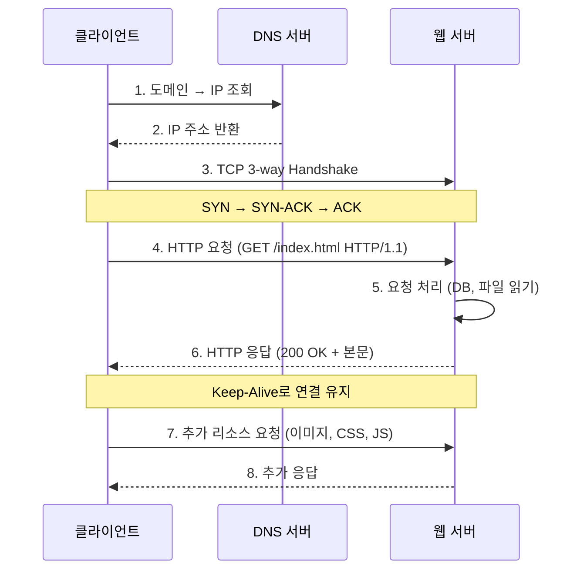

# HTTP (HyperText Transfer Protocol)

웹 통신의 기반 프로토콜이다. 클라이언트-서버 모델로 요청과 응답을 주고받는다. 평문은 80번, TLS 위에서 동작하는 HTTPS는 443번 포트를 쓴다. HTTP/1.x는 텍스트, HTTP/2부터는 바이너리 프레임 기반이다.

HTTP는 자체적으로 상태를 유지하지 않는다(Stateless). 동일한 클라이언트가 보낸 두 요청을 서버가 같은 사용자의 것이라고 알 방법이 없으므로, 쿠키·세션·JWT 같은 별도 메커니즘으로 상태를 만든다. 인증은 보통 세션이나 JWT로 관리하고, 사용자 선호 같은 가벼운 값은 쿠키로 처리한다.

연결 관점에서도 원래 HTTP/1.0은 요청-응답 한 번에 TCP 연결을 끊었지만, HTTP/1.1부터 Keep-Alive로 연결을 재사용하는 것이 기본이 되면서 사실상 비연결이라는 표현은 의미가 없어졌다. HTTP/2·3에서는 한 연결에서 여러 요청을 멀티플렉싱한다.

## HTTP 버전 진화

각 버전은 직전 버전의 성능 한계를 풀려고 나왔다. 어떤 문제를 풀려고 어떤 결정을 했는지를 알아두면 운영 중 마주치는 이상한 동작을 이해하기 쉽다.

### HTTP/0.9 (1991)

GET 메서드 하나, 헤더 없음, HTML만 전송. 역사 자료로만 본다.

### HTTP/1.0 (1996, RFC 1945)

헤더, 상태 코드, Content-Type, POST·HEAD 메서드가 들어왔다. 그러나 요청 하나마다 TCP를 새로 맺고 끊었다. 한 페이지에 이미지 50개가 박혀 있으면 핸드셰이크를 50번 했다. RTT가 100ms인 환경에서 페이지 로딩이 수 초씩 늘어졌다. Keep-Alive는 비표준 확장으로 일부 서버가 지원했다.

### HTTP/1.1 (1997, RFC 2068 → 1999 RFC 2616 → 현재 RFC 9112)

지금도 가장 많이 쓰이는 버전이다. 1.0의 성능 문제를 해결하려고 나왔다.

- **Persistent Connection**: Keep-Alive가 기본 동작이 됐다. 한 TCP 연결에서 여러 요청을 처리한다
- **Host 헤더 필수**: 한 IP에 여러 도메인을 올리는 가상 호스팅이 가능해졌다. 클라우드 웹 호스팅의 전제 조건이다
- **Chunked Transfer Encoding**: 응답 전체 크기를 미리 모를 때 조각 단위로 전송
- **Pipelining**: 응답을 기다리지 않고 요청을 연달아 보내는 기능. 프록시 구현 문제와 HOL Blocking 때문에 거의 안 쓴다. 브라우저는 기본 비활성화돼 있다
- **캐시 헤더 확장**: Cache-Control, ETag, If-None-Match, If-Modified-Since
- **새 메서드**: PUT, DELETE, OPTIONS, TRACE, CONNECT

한계: 한 TCP 연결에서 요청을 순차로 처리해야 한다. 앞 요청 응답이 늦으면 뒤 요청은 대기한다(HTTP 레벨 HOL Blocking). 브라우저는 도메인당 동시 연결 6개를 열어 우회하지만 근본 해결책은 아니다. 이걸 피하려고 한때 이미지 도메인을 여러 개로 쪼개는 "도메인 샤딩"이 유행했다.

### HTTP/2 (2015, RFC 7540 → 현재 RFC 9113)

구글 SPDY가 표준화된 결과물이다. 1.1의 HOL Blocking을 풀려고 나왔다.

- **바이너리 프레이밍**: 텍스트가 아니라 프레임 단위로 통신. 파서가 단순해지고 빨라진다
- **멀티플렉싱**: 한 TCP 연결에서 여러 요청·응답을 동시에 주고받는다. 스트림(Stream) ID로 구분한다
- **헤더 압축(HPACK)**: 인덱스 테이블 + 허프만 코딩. 매 요청마다 중복되던 User-Agent, Cookie 같은 헤더 오버헤드가 크게 줄어든다
- **서버 푸시**: 클라이언트가 요청하기 전에 리소스를 미리 보낸다. 실제 활용이 까다로워 Chrome 106에서 제거됐다. 새로 만드는 서비스에서는 안 쓰는 게 안전하다
- **스트림 우선순위**: 어떤 리소스를 먼저 보낼지 클라이언트가 힌트 제공

브라우저는 HTTP/2를 HTTPS(TLS + ALPN)에서만 지원한다. 평문 HTTP/2(h2c)는 스펙에는 있지만 브라우저가 받아주지 않는다. 백엔드 서버 간 gRPC 같은 통신에서는 h2c가 쓰인다.

한계: TCP 레벨 HOL Blocking은 그대로 남는다. 한 TCP 세그먼트가 손실되면 운영체제 TCP 스택이 그것부터 복구해야 다음 데이터를 위로 올린다. 멀티플렉싱된 다른 스트림들도 같이 멈춘다. 패킷 손실이 잦은 모바일 환경에서 HTTP/1.1보다 느려지는 역설이 생긴다.

### HTTP/3 (2022, RFC 9114)

TCP를 버리고 UDP 기반 QUIC 위에서 동작한다. HTTP/2의 TCP HOL Blocking을 풀려고 나왔다.

- **QUIC**: UDP 위에 TLS 1.3을 통합한 새 전송 프로토콜. 첫 연결에 1-RTT, 재방문은 0-RTT 핸드셰이크
- **스트림 단위 손실 복구**: 한 스트림 패킷이 빠져도 다른 스트림은 그대로 진행한다
- **연결 ID(Connection ID)**: IP가 바뀌어도 같은 연결을 이어 쓴다. Wi-Fi → LTE 전환 시 연결이 끊기지 않는다
- **QPACK**: HPACK과 비슷한 헤더 압축. QUIC의 순서 무보장 특성에 맞게 다시 설계됐다

광고 방식이 특이하다. 서버는 HTTP/2나 HTTP/1.1 응답에 `Alt-Svc: h3=":443"` 헤더를 붙여 "나는 HTTP/3도 지원한다"고 알린다. 클라이언트는 이걸 보고 다음 요청부터 QUIC로 시도한다. 그래서 사이트를 처음 열 때는 HTTP/2, 두 번째 방문부터 HTTP/3로 바뀌는 패턴을 자주 본다.

문제 상황: 일부 기업망이나 공공 와이파이에서 UDP 443을 차단하거나 QoS에서 우선순위를 낮춘다. 이때 HTTP/3가 안 붙고 HTTP/2로 떨어진다. 브라우저는 자동 fallback하지만 첫 연결이 몇 백 ms 늘어진다.

### 버전 비교 한눈에

| 항목 | HTTP/1.0 | HTTP/1.1 | HTTP/2 | HTTP/3 |
|---|---|---|---|---|
| 전송 계층 | TCP | TCP | TCP | UDP (QUIC) |
| 메시지 형식 | 텍스트 | 텍스트 | 바이너리 프레임 | 바이너리 프레임 |
| 연결 재사용 | X | Keep-Alive | 멀티플렉싱 | 멀티플렉싱 |
| 동시 요청 | 1 | 1 (pipelining 사실상 X) | N (스트림) | N (스트림) |
| 헤더 압축 | X | X | HPACK | QPACK |
| HOL Blocking | - | HTTP 레벨 | TCP 레벨 | 거의 해결 |
| 암호화 | 옵션 | 옵션 | 사실상 필수 (브라우저) | 필수 (QUIC 내장) |
| 핸드셰이크 RTT | TCP 1 | TCP 1 | TCP 1 + TLS 1~2 | QUIC 1 (재방문 0) |

운영 입장에서는 1.1과 2를 동시에 노출하고, 가능하면 3을 추가로 광고하는 형태가 가장 흔하다. Nginx, Caddy, Cloudflare 같은 앞단에서 거의 자동으로 처리된다.

## HTTP 통신 과정

브라우저 주소창에 URL을 입력한 시점부터 화면이 그려질 때까지를 단계로 쪼개보면, 실제 HTTP 트래픽이 흐르는 구간은 의외로 짧다. 앞뒤에 DNS 조회와 TCP/TLS 핸드셰이크가 붙는다.


```mermaid
sequenceDiagram
    participant Client as 클라이언트
    participant DNS as DNS 서버
    participant Server as 웹 서버

    Client->>DNS: 1. 도메인 → IP 조회
    DNS-->>Client: 2. IP 주소 반환

    Client->>Server: 3. TCP 3-way Handshake
    Note over Client,Server: SYN → SYN-ACK → ACK

    Client->>Server: 4. HTTP 요청 (GET /index.html HTTP/1.1)
    Server->>Server: 5. 요청 처리 (DB, 파일 읽기)
    Server-->>Client: 6. HTTP 응답 (200 OK + 본문)

    Note over Client,Server: Keep-Alive로 연결 유지
    Client->>Server: 7. 추가 리소스 요청 (이미지, CSS, JS)
    Server-->>Client: 8. 추가 응답
```

HTTPS면 3번 뒤에 TLS 핸드셰이크가 한 번 더 들어간다(TLS 1.2는 2-RTT, 1.3은 1-RTT). HTTP/3에서는 TCP·TLS 핸드셰이크가 QUIC 한 단계로 합쳐진다.

DNS는 보통 50ms 안팎, TCP 핸드셰이크는 같은 리전 기준 수십 ms, TLS는 그와 비슷한 수준이다. 첫 바이트가 돌아오는 시간(TTFB)이 길어질 때 어디서 시간이 새는지는 DevTools Network 탭의 Waterfall에서 단계별로 본다(자세한 건 디버깅 절 참고).

Keep-Alive는 HTTP/1.1의 기본 동작이다. 한 TCP 연결에 요청을 여러 번 실어 보낸다. 다만 같은 연결 안에서는 요청을 순차로 처리한다. 앞 요청이 길게 처리되면 뒤 요청도 기다린다. 이게 HTTP 레벨 HOL Blocking이고, HTTP/2의 멀티플렉싱이 푸는 문제다.

## HTTP 메시지 구조

HTTP 메시지는 요청(Request)과 응답(Response) 두 종류가 있다. 둘 다 시작줄, 헤더, 빈 줄(CRLF), 바디로 구성된다.

### 요청 메시지 (Request Message)

```
[Request Line]    POST /api/users HTTP/1.1
[Headers]         Host: api.example.com
                  Content-Type: application/json
                  Content-Length: 52
                  Authorization: Bearer eyJhbG...
[빈 줄 CRLF]
[Body]            {"name": "홍길동", "email": "hong@example.com"}
```

#### Request Line

Request Line은 `메서드 SP 요청대상 SP HTTP버전 CRLF` 형식이다.

```
GET /users?page=2&size=10 HTTP/1.1
```

- **메서드**: GET, POST, PUT, DELETE, PATCH 등
- **요청 대상(Request Target)**: 리소스 경로와 쿼리스트링. 보통 절대 경로(`/path`)를 쓰지만, 프록시를 거칠 때는 전체 URL(`http://example.com/path`)을 쓰는 경우가 있다
- **HTTP 버전**: `HTTP/1.0`, `HTTP/1.1`, `HTTP/2` 등

실무에서 자주 실수하는 부분이 요청 대상에 한글이나 공백을 그대로 넣는 것이다. URL 인코딩을 해야 한다.

```
# 잘못된 요청
GET /search?q=검색어 HTTP/1.1

# 올바른 요청
GET /search?q=%EA%B2%80%EC%83%89%EC%96%B4 HTTP/1.1
```

#### 요청 헤더 구조

헤더는 `헤더이름: 값` 형식이다. 헤더 이름은 대소문자를 구분하지 않지만, 값은 구분한다.

```http
GET /api/users/123 HTTP/1.1
Host: api.example.com
User-Agent: Mozilla/5.0 (Windows NT 10.0; Win64; x64)
Accept: application/json
Accept-Language: ko-KR,ko;q=0.9,en;q=0.8
Accept-Encoding: gzip, deflate, br
Connection: keep-alive
If-None-Match: "abc123"
```

Host 헤더는 HTTP/1.1에서 유일한 필수 헤더다. 하나의 서버에 여러 도메인이 호스팅될 수 있기 때문에 반드시 포함해야 한다. Host가 빠지면 400 Bad Request가 돌아온다.

### 응답 메시지 (Response Message)

```
[Status Line]     HTTP/1.1 200 OK
[Headers]         Content-Type: application/json; charset=utf-8
                  Content-Length: 128
                  Date: Sat, 29 Mar 2026 10:30:00 GMT
                  Cache-Control: max-age=3600
[빈 줄 CRLF]
[Body]            {"id": 123, "name": "홍길동", "email": "hong@example.com"}
```

#### Status Line

Status Line은 `HTTP버전 SP 상태코드 SP 사유구절 CRLF` 형식이다.

```
HTTP/1.1 404 Not Found
```

- **HTTP 버전**: 서버가 사용하는 HTTP 버전
- **상태 코드**: 3자리 숫자. 요청 처리 결과를 나타낸다
- **사유 구절(Reason Phrase)**: 사람이 읽기 위한 텍스트. 클라이언트가 파싱에 쓰면 안 된다. HTTP/2에서는 아예 제거됐다

### 바디(Body)

GET, HEAD, DELETE, OPTIONS 요청은 보통 바디가 없다. POST, PUT, PATCH는 바디가 있다.

응답도 204 No Content, 304 Not Modified 같은 경우에는 바디가 없다.

바디가 있을 때 `Content-Length` 헤더로 바디 크기를 바이트 단위로 지정하거나, `Transfer-Encoding: chunked`로 청크 전송한다.

```http
HTTP/1.1 200 OK
Transfer-Encoding: chunked
Content-Type: text/plain

7\r\n
Hello, \r\n
6\r\n
World!\r\n
0\r\n
\r\n
```

청크 전송은 전체 응답 크기를 미리 알 수 없을 때 사용한다. 스트리밍 API나 대용량 파일 다운로드에서 흔히 볼 수 있다. 각 청크는 `크기(16진수)\r\n데이터\r\n` 형식이고, 크기 0인 청크가 마지막을 의미한다.

Content-Length와 Transfer-Encoding: chunked가 동시에 오면 chunked가 우선한다. 둘 다 없으면 연결이 닫힐 때까지 바디를 읽는다.

## Transfer-Encoding: 전송 인코딩

### chunked 전송의 동작 원리

서버가 응답을 생성하면서 전체 크기를 알 수 없는 경우, 데이터를 조각(chunk) 단위로 나눠서 보낸다. DB 쿼리 결과를 스트리밍하거나, SSE(Server-Sent Events), 대용량 리포트 생성 같은 상황에서 쓴다.

각 청크는 크기 줄과 데이터 줄이 한 쌍이다.

```
[청크 크기(16진수)]\r\n
[청크 데이터]\r\n
```

마지막 청크는 크기가 0이고, 그 뒤에 빈 줄이 온다. 트레일러 헤더가 있으면 마지막 청크 뒤에 붙는다.

```http
HTTP/1.1 200 OK
Transfer-Encoding: chunked
Content-Type: application/json
Trailer: X-Checksum

1a\r\n
{"results": [{"id": 1},\r\n
19\r\n
{"id": 2}, {"id": 3}]}\r\n
0\r\n
X-Checksum: abc123\r\n
\r\n
```

트레일러 헤더는 전체 응답이 끝난 뒤에야 계산할 수 있는 값(체크섬, 서명 등)을 전달할 때 쓴다. `Trailer` 헤더로 미리 어떤 트레일러가 올지 알려줘야 한다. 다만 트레일러를 제대로 처리하는 클라이언트가 많지 않으므로, 쓸 일이 있으면 클라이언트가 지원하는지부터 확인한다.

### chunked 전송이 필요한 실무 상황

**DB 결과 스트리밍**: 수만 건의 데이터를 한 번에 메모리에 올려서 Content-Length를 계산하면 OOM이 날 수 있다. cursor나 stream으로 읽으면서 청크 단위로 내려보내면 메모리 사용량을 일정하게 유지할 수 있다.

```java
// Spring WebFlux에서 chunked 스트리밍
@GetMapping(value = "/export", produces = MediaType.APPLICATION_NDJSON_VALUE)
public Flux<User> exportUsers() {
    return userRepository.findAllAsStream(); // DB cursor 기반 스트리밍
}
```

**실시간 로그 전송**: 서버에서 로그가 쌓이는 대로 클라이언트에 밀어넣는 경우, 전체 크기를 알 수 없으므로 chunked가 자연스럽다.

```javascript
// Node.js에서 chunked 응답
app.get('/logs', (req, res) => {
    res.writeHead(200, {
        'Content-Type': 'text/plain',
        'Transfer-Encoding': 'chunked'
    });

    const tail = spawn('tail', ['-f', '/var/log/app.log']);
    tail.stdout.on('data', (chunk) => {
        res.write(chunk); // Node.js가 자동으로 chunked 인코딩
    });

    req.on('close', () => tail.kill());
});
```

### chunked 전송에서 자주 겪는 문제

**프록시 버퍼링**: Nginx가 기본적으로 업스트림 응답을 버퍼링한다. 스트리밍이 필요한 엔드포인트에서 응답이 한꺼번에 오는 경우, 버퍼링이 원인인 경우가 많다.

```nginx
location /stream/ {
    proxy_pass http://backend;
    proxy_buffering off;         # 버퍼링 비활성화
    proxy_cache off;             # 캐시도 끈다
    proxy_http_version 1.1;      # chunked는 HTTP/1.1 이상
    chunked_transfer_encoding on;
}
```

**Content-Length와의 충돌**: 애플리케이션 프레임워크가 Content-Length를 자동으로 넣는 경우가 있다. Content-Length와 Transfer-Encoding: chunked가 동시에 있으면 스펙상 chunked가 우선하지만, 일부 클라이언트에서 혼란이 생긴다. 프레임워크 설정을 확인해서 스트리밍 응답에는 Content-Length가 안 붙도록 해야 한다.

**HTTP/2에서는 chunked가 없다**: HTTP/2는 프레임 단위로 데이터를 나눠 보내므로 Transfer-Encoding: chunked 자체가 의미 없다. HTTP/2에서 chunked 헤더를 보내면 프로토콜 에러가 발생한다. Nginx 같은 리버스 프록시가 HTTP/1.1 chunked 응답을 HTTP/2 프레임으로 자동 변환해주므로, 애플리케이션에서는 HTTP/1.1 기준으로 작성해도 된다.

## HTTP 메서드 (요청 방식)

### 주요 메서드

- GET: 리소스 조회 (읽기 전용, 안전)
- POST: 리소스 생성 (데이터 전송)
- PUT: 리소스 전체 수정
- DELETE: 리소스 삭제
- PATCH: 리소스 부분 수정

### 기타 메서드

- HEAD: 헤더 정보만 조회. 바디 없이 응답 헤더만 받는다. 리소스 존재 여부 확인이나 Content-Length 확인에 쓴다
- OPTIONS: 서버가 지원하는 메서드 확인. CORS preflight 요청에서 브라우저가 자동으로 보낸다
- TRACE: 요청 경로 추적. 보안상 위험해서 대부분의 서버에서 비활성화한다
- CONNECT: 프록시를 통한 TCP 터널링. HTTPS 통신 시 프록시에서 사용한다

### 메서드 속성

| 메서드 | 안전(Safe) | 멱등(Idempotent) | 캐시 가능 |
|--------|-----------|------------------|-----------|
| GET | O | O | O |
| HEAD | O | O | O |
| POST | X | X | 조건부 |
| PUT | X | O | X |
| DELETE | X | O | X |
| PATCH | X | X | 조건부 |

- **안전(Safe)**: 서버의 상태를 변경하지 않는다
- **멱등(Idempotent)**: 같은 요청을 여러 번 보내도 결과가 동일하다. PUT으로 같은 데이터를 10번 보내도 결과는 같다. POST는 10번 보내면 10개가 생길 수 있다
- **캐시 가능**: GET, HEAD는 캐시 가능. POST, PATCH는 Content-Location 헤더가 있으면 캐시할 수 있지만 실제로 캐시하는 구현체는 드물다

```http
GET /users/123 HTTP/1.1
Host: api.example.com

POST /users HTTP/1.1
Host: api.example.com
Content-Type: application/json

{
  "name": "홍길동",
  "email": "hong@example.com"
}
```

PUT은 전체 교체이므로 빠뜨린 필드가 null로 바뀔 수 있다. 부분 수정은 PATCH를 써야 한다.

### 안전성·멱등성이 실무에서 문제가 되는 경우

**GET에 부수 효과를 넣으면 생기는 일**: GET은 안전한 메서드이므로 브라우저, 크롤러, 프리페치, CDN 등이 부담 없이 호출한다. GET 요청에 조회수 증가나 상태 변경 같은 부수 효과를 넣으면, 구글 크롤러가 돌 때마다 조회수가 올라가거나 프리페치가 의도하지 않은 상태 변경을 일으킨다. 실제로 GET으로 삭제를 구현한 관리 화면에서 크롤러가 모든 데이터를 날린 사례가 있다.

```
잘못된 설계:
GET /api/posts/123/delete    → 크롤러가 이 링크를 따라가면 삭제됨
GET /api/users/123?action=deactivate → 프리페치가 사용자를 비활성화

올바른 설계:
DELETE /api/posts/123
PATCH /api/users/123 {"active": false}
```

**DELETE의 멱등성 함정**: DELETE는 멱등하다. 같은 리소스를 두 번 삭제해도 서버 상태는 동일하다(리소스가 없는 상태). 하지만 첫 번째 DELETE는 200을 돌려주고, 두 번째 DELETE는 404를 돌려주는 서버가 많다. 응답 코드가 달라진다고 멱등성이 깨진 건 아니다. 멱등성은 "서버 상태"가 동일한지를 따지는 것이지 "응답 코드"가 동일한지를 따지는 게 아니다.

**POST 재시도와 중복 생성**: 네트워크 타임아웃으로 POST 응답을 못 받았을 때, 클라이언트가 재시도하면 리소스가 중복 생성될 수 있다. 결제 API에서 이런 일이 생기면 이중 결제가 된다.

```http
# 멱등 키로 중복 요청 방지
POST /api/payments HTTP/1.1
Content-Type: application/json
Idempotency-Key: 550e8400-e29b-41d4-a716-446655440000

{"amount": 50000, "card_id": "card_abc"}
```

서버에서 Idempotency-Key를 저장해두고, 같은 키로 요청이 다시 오면 이전 응답을 그대로 돌려준다. Stripe, 토스페이먼츠 같은 결제 API에서 이 방식을 쓴다. 키 저장 시 TTL을 설정해야 한다. 보통 24시간~48시간이면 충분하다.

**PUT의 멱등성과 동시성**: PUT이 멱등하다고 해서 동시성 문제가 없는 건 아니다. 두 클라이언트가 동시에 같은 리소스를 PUT하면 나중에 도착한 요청이 이긴다(Last-Write-Wins). 이런 충돌을 방지하려면 ETag 기반 낙관적 잠금을 쓴다.

```http
# 1. 리소스 조회 — ETag 확인
GET /api/users/123 HTTP/1.1

HTTP/1.1 200 OK
ETag: "v3"
{"name": "홍길동", "email": "hong@example.com"}

# 2. 수정 요청 — If-Match로 조건부 PUT
PUT /api/users/123 HTTP/1.1
If-Match: "v3"
Content-Type: application/json

{"name": "홍길동", "email": "new@example.com"}

# ETag가 맞으면 200, 다른 누가 먼저 수정했으면 412 Precondition Failed
```

## HTTP 상태 코드

### 1xx (정보 응답)

- 100 Continue: 클라이언트가 `Expect: 100-continue` 헤더를 보냈을 때, 서버가 바디를 받을 준비가 됐다는 응답. 대용량 파일 업로드 전에 서버가 거부할 수 있는지 먼저 확인할 때 쓴다
- 101 Switching Protocols: WebSocket 연결 시 HTTP에서 WS 프로토콜로 전환할 때 나온다
- 103 Early Hints: 서버가 최종 응답 전에 미리 Link 헤더를 보내서 브라우저가 리소스를 프리로드할 수 있게 한다

### 2xx (성공)

- 200 OK: 요청 성공
- 201 Created: 리소스 생성 성공. Location 헤더에 새로 생성된 리소스의 URI가 들어간다
- 204 No Content: 성공했지만 응답 본문 없음. DELETE 성공 시 주로 사용한다
- 206 Partial Content: Range 요청에 대한 응답. 대용량 파일 다운로드 시 이어받기에 쓴다

### 3xx (리다이렉션)

- 301 Moved Permanently: 영구 이동
- 302 Found: 임시 이동
- 303 See Other: POST 처리 후 GET으로 리다이렉트
- 304 Not Modified: 수정되지 않음 (캐시 사용)
- 307 Temporary Redirect: 임시 이동 (메서드 유지)
- 308 Permanent Redirect: 영구 이동 (메서드 유지)

리다이렉션 코드의 차이는 아래 별도 섹션에서 상세히 다룬다.

### 4xx (클라이언트 오류)

- 400 Bad Request: 요청 문법 오류, 유효성 검증 실패
- 401 Unauthorized: 인증 필요. 이름이 Unauthorized이지만 실제 의미는 "Unauthenticated"에 가깝다
- 403 Forbidden: 인증은 됐지만 권한 없음. 401과 혼동하는 경우가 많은데, 401은 "누구인지 모르겠다", 403은 "누구인지 알지만 권한이 없다"
- 404 Not Found: 리소스 없음
- 405 Method Not Allowed: 해당 리소스에서 지원하지 않는 메서드. Allow 헤더에 지원하는 메서드 목록이 포함된다
- 409 Conflict: 현재 서버 상태와 충돌. 중복 생성 시도나 동시 수정 충돌 시 사용한다
- 413 Content Too Large: 요청 바디가 서버가 허용하는 크기를 초과. 파일 업로드 크기 제한에 걸릴 때 나온다
- 429 Too Many Requests: 속도 제한(Rate Limiting) 초과. `Retry-After` 헤더로 재시도 가능 시점을 알려줘야 한다

### 5xx (서버 오류)

- 500 Internal Server Error: 서버 내부 오류. 예외 처리 안 된 에러가 여기로 빠진다
- 502 Bad Gateway: 게이트웨이/프록시가 업스트림 서버로부터 잘못된 응답을 받음. Nginx 뒤의 애플리케이션 서버가 죽었을 때 자주 보인다
- 503 Service Unavailable: 서비스 이용 불가. 배포 중이거나 과부하 상태. `Retry-After` 헤더로 복구 예상 시간을 알려줄 수 있다
- 504 Gateway Timeout: 게이트웨이/프록시가 업스트림 서버로부터 응답을 시간 내에 받지 못함

4xx는 클라이언트가 요청을 고쳐야 하므로 재시도해도 같은 결과다. 5xx는 서버 상태에 따라 달라지므로 재시도가 의미 있다. 다만 500은 코드 버그인 경우가 많아서 재시도해도 안 되는 경우가 많고, 503은 일시적이라 재시도가 도움이 된다.

## 리다이렉션 상세

### 301 vs 302 vs 307 vs 308

리다이렉션 코드를 잘못 쓰면 SEO 문제, POST 데이터 유실, 무한 리다이렉트 같은 실무 장애가 생긴다.

| 코드 | 의미 | 영구/임시 | 메서드 변경 |
|------|------|-----------|-------------|
| 301 | Moved Permanently | 영구 | POST → GET으로 변경될 수 있음 |
| 302 | Found | 임시 | POST → GET으로 변경될 수 있음 |
| 303 | See Other | - | 무조건 GET으로 변경 |
| 307 | Temporary Redirect | 임시 | 원래 메서드 유지 |
| 308 | Permanent Redirect | 영구 | 원래 메서드 유지 |

#### 301 Moved Permanently

리소스가 영구적으로 새 위치로 옮겨졌다. 브라우저와 검색 엔진은 이 응답을 캐시한다.

```http
HTTP/1.1 301 Moved Permanently
Location: https://new.example.com/users
```

문제는 301 응답을 받은 브라우저가 POST 요청을 GET으로 바꿔서 리다이렉트하는 경우가 있다. RFC 스펙상으로는 메서드를 유지해야 하지만, 초기 브라우저 구현에서 GET으로 바꾸는 관행이 굳어졌다. 301 응답을 브라우저가 캐시하면 원래 URL을 다시 쓸 수 없게 된다. 개발 중에 잘못된 301을 내보내면 브라우저 캐시를 지우기 전까지 계속 리다이렉트된다.

```
사용 사례:
- 도메인 변경: example.com → new-example.com
- URL 구조 변경: /old-path → /new-path
- HTTP → HTTPS 강제 전환
```

#### 302 Found

원래 이름은 "Moved Temporarily"였다. 리소스가 임시로 다른 위치에 있다.

```http
HTTP/1.1 302 Found
Location: https://example.com/login
```

301과 같은 문제가 있다. POST를 보냈는데 302 응답이 오면 브라우저가 GET으로 바꿔서 리다이렉트할 수 있다. 이 동작이 원래 스펙 위반이었지만 브라우저들이 다 그렇게 구현해버려서, 그래서 303과 307이 나왔다.

```
사용 사례:
- 로그인 후 원래 페이지로 돌려보내기
- A/B 테스트 시 다른 버전으로 보내기
- 점검 중 임시 페이지로 안내
```

#### 303 See Other

POST/PUT/DELETE 처리 후 결과를 GET으로 조회하라는 의미다. PRG(Post/Redirect/Get) 패턴에서 쓴다.

```http
POST /orders HTTP/1.1
Content-Type: application/json
{"item": "laptop", "quantity": 1}

HTTP/1.1 303 See Other
Location: /orders/12345
```

주문을 POST로 생성하고, 303으로 주문 조회 페이지로 보내면 사용자가 새로고침을 눌러도 주문이 중복 생성되지 않는다. 브라우저가 GET으로 바꿔서 요청하기 때문이다.

#### 307 Temporary Redirect

302의 메서드 변경 문제를 해결한 코드다. 원래 요청의 메서드와 바디를 그대로 유지해서 리다이렉트한다.

```http
POST /api/v1/users HTTP/1.1
Content-Type: application/json
{"name": "홍길동"}

HTTP/1.1 307 Temporary Redirect
Location: /api/v2/users
```

POST 요청이 307로 리다이렉트되면 브라우저는 POST 메서드와 바디를 그대로 유지해서 새 URL로 요청한다. API 버전 마이그레이션에서 유용하다.

```
사용 사례:
- API 버전 마이그레이션: v1 → v2로 임시 전환
- 로드 밸런싱 시 다른 서버로 전달
- HSTS 적용 시 HTTP → HTTPS (브라우저 내부 동작)
```

#### 308 Permanent Redirect

301의 메서드 변경 문제를 해결한 코드다. 영구 이동이면서 메서드를 유지한다.

```http
POST /api/old-endpoint HTTP/1.1
Content-Type: application/json
{"data": "value"}

HTTP/1.1 308 Permanent Redirect
Location: /api/new-endpoint
```

```
사용 사례:
- API 엔드포인트 영구 변경 (메서드 유지 필요 시)
- POST를 받는 URL이 영구 이동한 경우
```

### 리다이렉션 실무 주의사항

**리다이렉트 체인**: 리다이렉트가 2~3번 이상 연속되면 지연이 누적된다. 크롬은 최대 20회까지 따라가고 그 이후에는 ERR_TOO_MANY_REDIRECTS를 표시한다. 리다이렉트는 최대 1~2번 이내로 끝나도록 설정한다.

```nginx
# 나쁜 예: 리다이렉트 체인
# http://example.com → https://example.com → https://www.example.com → https://www.example.com/
# 3번 리다이렉트 = 3 × RTT 추가

# 좋은 예: 한 번에 최종 목적지로
server {
    listen 80;
    server_name example.com www.example.com;
    return 301 https://www.example.com$request_uri;
}
```

**304 Not Modified와 조건부 요청**: 304는 리다이렉션이 아니라 캐시 관련 응답이다. 클라이언트가 `If-None-Match`(ETag 비교)나 `If-Modified-Since`(날짜 비교) 헤더를 보내서 서버에 "내가 가진 캐시가 아직 유효한지" 물어보면, 변경이 없으면 304를 응답하고 바디 없이 끝난다.

```http
# 첫 번째 요청
GET /api/users/123 HTTP/1.1
Host: api.example.com

HTTP/1.1 200 OK
ETag: "v1-abc123"
Last-Modified: Sat, 28 Mar 2026 10:00:00 GMT
Content-Type: application/json
{"id": 123, "name": "홍길동"}

# 이후 요청 (캐시 검증)
GET /api/users/123 HTTP/1.1
Host: api.example.com
If-None-Match: "v1-abc123"

HTTP/1.1 304 Not Modified
ETag: "v1-abc123"
```

바디를 안 보내므로 대역폭을 절약할 수 있다. 다만 요청 자체는 발생하므로 RTT는 줄어들지 않는다. RTT까지 줄이려면 `Cache-Control: max-age`를 적절히 설정해야 한다.

## 콘텐츠 협상 (Content Negotiation)

클라이언트와 서버가 응답의 형식, 언어, 인코딩을 협상하는 메커니즘이다. 같은 리소스라도 클라이언트가 어떤 형식을 원하는지에 따라 다른 표현(representation)을 제공한다.

### Accept: 미디어 타입 협상

클라이언트가 처리할 수 있는 미디어 타입을 서버에 알린다.

```http
GET /api/users/123 HTTP/1.1
Accept: application/json
```

서버는 이 헤더를 보고 응답 형식을 결정한다. 여러 타입을 나열할 수 있고, `q` 값(quality factor)으로 우선순위를 지정한다. q 값은 0~1 사이이며, 생략하면 1이다.

```http
Accept: text/html, application/xhtml+xml, application/xml;q=0.9, */*;q=0.8
```

이 헤더는 "text/html이나 application/xhtml+xml을 선호하고, 그 다음으로 application/xml, 나머지는 뭐든 괜찮다"는 의미다.

Spring에서 Accept 헤더에 맞는 응답을 못 만들면 406 Not Acceptable이 돌아온다. API를 개발할 때 Accept 헤더를 무시하는 서버가 많은데, 클라이언트가 XML을 보냈는데 JSON을 주면 파싱 에러가 나서 디버깅하기 어렵다.

```java
// Spring에서 콘텐츠 협상 설정
@GetMapping(value = "/users/{id}",
            produces = {MediaType.APPLICATION_JSON_VALUE, MediaType.APPLICATION_XML_VALUE})
public User getUser(@PathVariable Long id) {
    return userService.findById(id);
}
```

### Accept-Encoding: 압축 방식 협상

클라이언트가 지원하는 압축 알고리즘을 서버에 알린다.

```http
GET /api/data HTTP/1.1
Accept-Encoding: gzip, deflate, br
```

서버는 지원하는 압축 방식 중 하나를 선택해서 `Content-Encoding` 헤더와 함께 압축된 바디를 보낸다.

```http
HTTP/1.1 200 OK
Content-Encoding: gzip
Content-Type: application/json
Vary: Accept-Encoding
```

`br`은 Brotli 압축이다. gzip보다 압축률이 20~30% 좋지만 압축 속도가 느리다. 정적 파일은 미리 Brotli로 압축해두고, 동적 응답은 gzip을 쓰는 경우가 많다.

`Vary: Accept-Encoding` 헤더가 중요하다. CDN이나 프록시 캐시에게 "Accept-Encoding 헤더가 다르면 별도로 캐시하라"고 알려주는 것이다. 이게 없으면 gzip 응답이 캐시된 상태에서 Brotli를 지원하는 클라이언트에게도 gzip이 전달될 수 있다.

### Content-Encoding: 압축 동작 원리

HTTP 압축은 협상 → 압축 → 해제 세 단계로 흐른다.

```
1. 클라이언트 → 서버: Accept-Encoding: gzip, br
2. 서버: 응답 바디를 선택한 알고리즘으로 압축
3. 서버 → 클라이언트: Content-Encoding: gzip (압축된 바디)
4. 클라이언트: Content-Encoding 헤더를 보고 압축 해제 후 처리
```

여기서 Content-Length는 **압축된 후의 크기**를 나타낸다. 원본 크기가 아니다. 이 부분을 헷갈려서 Content-Length를 원본 크기로 넣으면 클라이언트가 데이터를 덜 읽거나 더 읽다가 에러가 난다.

#### 압축 알고리즘 비교

| 알고리즘 | 압축률 | 압축 속도 | 해제 속도 | 브라우저 지원 |
|---------|--------|----------|----------|-------------|
| gzip (deflate) | 보통 | 빠름 | 빠름 | 모든 브라우저 |
| br (Brotli) | gzip 대비 15~25% 향상 | 느림 (레벨에 따라 다름) | 빠름 | 모던 브라우저 (IE 제외) |
| zstd | Brotli와 비슷하거나 좋음 | Brotli보다 빠름 | 매우 빠름 | Chrome 123+, Firefox 126+ |

gzip은 어디서나 동작하므로 기본값으로 쓴다. Brotli는 정적 파일에 미리 압축해두는 방식으로 쓰면 압축 속도 문제를 피할 수 있다. zstd는 아직 지원 범위가 좁아서 CDN 레벨에서 fallback과 함께 쓰는 정도다.

#### Nginx에서 gzip 설정

```nginx
http {
    gzip on;
    gzip_comp_level 6;        # 1-9, 6이 속도/압축률 균형점
    gzip_min_length 256;      # 256바이트 미만은 압축 안 함 (오히려 커질 수 있음)
    gzip_types
        text/plain
        text/css
        text/javascript
        application/json
        application/javascript
        application/xml
        image/svg+xml;

    gzip_vary on;              # Vary: Accept-Encoding 자동 추가
    gzip_proxied any;          # 프록시 뒤에서도 압축
    gzip_disable "msie6";      # IE6은 gzip 버그가 있어서 제외
}
```

`gzip_min_length`를 빠뜨리는 경우가 흔하다. 작은 응답은 gzip 헤더(약 20바이트) 때문에 압축 후 오히려 커진다. 256바이트 이상부터 압축하는 것이 적절하다.

`gzip_comp_level`은 6을 넘으면 CPU 사용량이 급격히 늘어나는데 압축률 향상은 미미하다. 9로 올려봐야 6 대비 1~2% 더 줄어드는 정도다.

이미지(JPEG, PNG, WebP)나 이미 압축된 파일(.gz, .zip, .mp4)은 gzip_types에 넣지 않는다. 이미 압축된 데이터를 다시 압축하면 CPU만 낭비하고 크기는 줄지 않는다.

#### Nginx에서 Brotli 설정

Brotli는 Nginx 기본 모듈이 아니다. `ngx_brotli` 모듈을 별도로 설치해야 한다.

```nginx
# 동적 압축 (요청마다 압축)
brotli on;
brotli_comp_level 4;       # 1-11, 동적 압축은 4-6이 적절
brotli_types
    text/plain
    text/css
    text/javascript
    application/json
    application/javascript
    image/svg+xml;

# 정적 파일 사전 압축 (미리 .br 파일을 만들어둠)
brotli_static on;
```

동적 Brotli 압축은 레벨 4~6이 적절하다. 레벨 11은 파일 하나 압축하는 데 수초가 걸릴 수 있다. 정적 파일은 빌드 시점에 미리 최고 레벨로 압축해두고 `brotli_static on`으로 제공하는 방식이 일반적이다.

```bash
# 빌드 시 정적 파일 사전 압축
find ./dist -type f \( -name "*.js" -o -name "*.css" -o -name "*.html" -o -name "*.svg" \) \
  -exec brotli -q 11 {} \;
# 결과: 원본 파일 옆에 .br 파일 생성 (bundle.js → bundle.js.br)
```

#### Spring Boot에서 압축 설정

```properties
# application.properties
server.compression.enabled=true
server.compression.min-response-size=2048
server.compression.mime-types=application/json,application/xml,text/html,text/css,text/javascript
```

Spring Boot 내장 톰캣의 압축은 CPU를 애플리케이션 서버에서 소모한다. 대부분의 프로덕션 환경에서는 앞단 Nginx나 CDN에서 압축을 처리하고, 애플리케이션 서버에서는 압축을 끄는 것이 좋다. 애플리케이션 서버의 CPU는 비즈니스 로직에 쓰는 게 낫다.

#### 압축에서 자주 겪는 문제

**이중 압축**: 앞단 Nginx에서 gzip 압축을 하고, 애플리케이션에서도 gzip 압축을 하면 이중 압축이 된다. 클라이언트가 한 번만 해제하면 깨진 데이터가 나온다. 압축은 한 곳에서만 한다.

**CDN 캐시 오염**: `Vary: Accept-Encoding`이 빠지면, CDN이 gzip으로 압축된 응답을 캐시한 뒤 압축을 지원하지 않는 클라이언트에게도 그대로 전달한다. 클라이언트는 깨진 응답을 받게 된다.

**ETag 불일치**: 같은 원본 파일이라도 gzip과 Brotli 결과는 다르다. Apache는 압축할 때 ETag에 인코딩 suffix를 붙이는데, Nginx는 gzip 시 weak ETag(`W/"..."`)로 바꿔버린다. CDN에서 ETag 기반 캐시 무효화를 쓰고 있으면 이 차이가 문제가 될 수 있다.

### Content-Type 협상

`Content-Type`은 요청/응답 바디의 미디어 타입을 나타낸다.

```http
POST /api/users HTTP/1.1
Content-Type: application/json; charset=utf-8

{"name": "홍길동"}
```

자주 쓰는 Content-Type:

| Content-Type | 용도 |
|-------------|------|
| `application/json` | JSON API |
| `application/x-www-form-urlencoded` | HTML 폼 기본 전송 |
| `multipart/form-data` | 파일 업로드 |
| `text/html; charset=utf-8` | HTML 문서 |
| `application/octet-stream` | 바이너리 데이터 |

`multipart/form-data`로 파일을 업로드할 때는 boundary 구분자가 자동으로 생성된다.

```http
POST /upload HTTP/1.1
Content-Type: multipart/form-data; boundary=----WebKitFormBoundary7MA4YWxkTrZu0gW

------WebKitFormBoundary7MA4YWxkTrZu0gW
Content-Disposition: form-data; name="file"; filename="report.pdf"
Content-Type: application/pdf

(바이너리 데이터)
------WebKitFormBoundary7MA4YWxkTrZu0gW
Content-Disposition: form-data; name="description"

분기 보고서
------WebKitFormBoundary7MA4YWxkTrZu0gW--
```

Spring에서 `@RequestBody`로 JSON을 받을 때 Content-Type이 `application/json`이 아니면 415 Unsupported Media Type이 돌아온다. Postman에서 테스트할 때는 잘 되는데 프론트엔드에서 fetch로 보낼 때 Content-Type을 안 넣어서 400이 나는 경우가 흔하다.

### Accept-Language: 언어 협상

```http
GET /help HTTP/1.1
Accept-Language: ko-KR,ko;q=0.9,en;q=0.8,ja;q=0.7
```

서버는 지원하는 언어 중 q 값이 가장 높은 것을 선택한다. 매칭되는 언어가 없으면 서버의 기본 언어로 응답한다.

실무에서는 Accept-Language를 무시하고 URL 경로(`/ko/help`, `/en/help`)나 쿼리 파라미터(`?lang=ko`)로 언어를 지정하는 방식이 많다. Accept-Language는 브라우저 설정에 의존하므로 사용자가 명시적으로 언어를 바꾼 경우를 처리하기 어렵다.

### 서버 주도 vs 에이전트 주도 협상

**서버 주도(Server-Driven)**: 위에서 설명한 방식이다. 클라이언트가 Accept 계열 헤더를 보내면 서버가 적절한 표현을 선택한다. 서버가 클라이언트의 선호를 정확히 알기 어렵다는 단점이 있다.

**에이전트 주도(Agent-Driven)**: 서버가 300 Multiple Choices 응답과 함께 선택 가능한 표현 목록을 보내면 클라이언트가 직접 선택한다. 실제로는 거의 안 쓴다.

## HTTP 헤더

헤더 이름은 대소문자 무시, 값은 대소문자 구분이다. HTTP/2부터는 헤더 이름이 모두 소문자로 직렬화된다. 운영에서 자주 마주치는 헤더를 용도별로 묶어 본다.

### 요청 쪽에서 자주 보는 헤더

| 헤더 | 용도 |
|---|---|
| `Host` | 대상 서버의 호스트명. HTTP/1.1 유일한 필수 헤더 |
| `User-Agent` | 클라이언트 식별. 봇 차단, 라우팅, 로그 분석에 쓰임 |
| `Authorization` | `Basic`, `Bearer <token>` 등 인증 자격 |
| `Cookie` | 클라이언트가 가진 모든 쿠키 |
| `Accept`, `Accept-Encoding`, `Accept-Language` | 콘텐츠 협상 |
| `Referer` | 이전 페이지 URL. 표준에 오타가 그대로 박혔다(Referrer가 정상 철자) |
| `Origin` | CORS와 CSRF 판정에 쓰는 요청 출처 |
| `If-None-Match`, `If-Modified-Since` | 캐시 조건부 검증 |
| `Range` | 부분 다운로드. 동영상 시킹·이어받기 |
| `X-Forwarded-For`, `X-Forwarded-Proto`, `Forwarded` | 프록시 체인이 채워주는 원본 클라이언트 정보 |
| `Idempotency-Key` | 중복 방지 키. 결제·주문 API에서 표준화돼 가는 중 |

### 응답 쪽에서 자주 보는 헤더

| 헤더 | 용도 |
|---|---|
| `Content-Type` | 본문 미디어 타입. charset 지정도 같이 한다 |
| `Content-Length` | 본문 바이트 수 (압축 후 크기) |
| `Content-Encoding` | gzip, br, zstd 같은 압축 방식 |
| `Transfer-Encoding: chunked` | 청크 전송 |
| `Cache-Control`, `ETag`, `Last-Modified`, `Expires` | 캐시 정책과 검증자 |
| `Set-Cookie` | 클라이언트 쿠키 설정. `HttpOnly`, `Secure`, `SameSite` 같이 본다 |
| `Location` | 3xx 리다이렉트 대상, 201 생성 응답의 새 리소스 URI |
| `Vary` | 캐시 키 분기 기준 (`Accept-Encoding`, `Origin` 등) |
| `Server` | 서버 소프트웨어. 노출하면 공격 표면이 늘어 보통 가리거나 비운다 |
| `Strict-Transport-Security` | HSTS. HTTPS 강제 |
| `Content-Security-Policy` | CSP. XSS 방어 |
| `Access-Control-Allow-Origin` | CORS 허용 출처 |
| `Alt-Svc` | "나 HTTP/3 지원함" 같은 대체 프로토콜 광고 |
| `Retry-After` | 429, 503 응답에서 재시도 시점 |

### 양쪽에 다 등장하는 헤더

`Date`, `Connection`, `Cache-Control`, `Upgrade`, `Via`, `Warning`, `Trailer`, `Transfer-Encoding`은 요청·응답 모두에 올 수 있다. HTTP/2부터 `Connection`, `Keep-Alive`, `Upgrade`처럼 연결 단위 의미를 갖는 헤더는 금지된다(전송 계층에서 멀티플렉싱하므로 의미가 없다).

### 헤더 작성 시 주의할 점

- **`Authorization` 노출**: TLS 없는 채널에 절대 보내지 않는다. 로그·에러 리포트·HAR 파일에 자주 새어 나간다
- **`X-` 접두사**: 더 이상 권장되지 않지만 관행은 남아 있다. 새 헤더라면 IANA 등록 이름을 쓰거나 사내 표준을 따로 정한다
- **사용자 입력을 헤더로 echo**: 헤더 인젝션(CRLF Injection) 위험. 값에 `\r\n`이 들어가지 못하게 검증한다
- **쿠키 누적**: 도메인에 쿠키가 쌓이면 모든 요청에 따라붙어 헤더 비대화의 주범이 된다. 도메인을 분리하거나 정리한다
- **CORS 응답 헤더 위치**: 프리플라이트(OPTIONS) 응답에도 같은 헤더가 가야 한다. 본 요청에만 붙이면 브라우저가 차단한다

```http
GET /api/users HTTP/1.1
Host: api.example.com
User-Agent: Mozilla/5.0
Accept: application/json
Authorization: Bearer eyJhbG...
If-None-Match: "v3"

HTTP/1.1 200 OK
Content-Type: application/json; charset=utf-8
Content-Length: 123
Cache-Control: private, max-age=60
ETag: "v3"
Vary: Accept-Encoding
Set-Cookie: sessionId=abc123; HttpOnly; Secure; SameSite=Lax
```

## 운영 환경의 HTTP 설정

### Keep-Alive 타임아웃

Keep-Alive 타임아웃을 길게 잡으면 유휴 연결이 쌓여 서버 메모리와 파일 디스크립터를 잡아먹는다. 짧게 잡으면 연결을 자주 새로 맺어 핸드셰이크 비용이 든다. 일반적인 웹 트래픽은 30~60초 사이를 기준으로 잡는다. 트래픽 패턴이 RTT가 긴 모바일이면 좀 더 길게 두는 게 유리하다.

```nginx
http {
    keepalive_timeout 30s;       # 클라이언트와의 유휴 타임아웃
    keepalive_requests 1000;     # 한 연결로 처리할 최대 요청 수
    reset_timedout_connection on;

    # 업스트림 쪽 keepalive 풀
    upstream backend {
        server 10.0.0.10:8080;
        keepalive 64;            # 워커당 유지할 업스트림 연결 수
    }
}
```

업스트림 쪽 `keepalive`를 안 잡으면 Nginx ↔ 백엔드 사이 연결이 매 요청마다 새로 열린다. 백엔드 TIME_WAIT 소켓이 폭증하는 흔한 원인이다.

### 헤더 크기

특정 사용자만 400 Bad Request가 나면 헤더 크기 한계를 의심한다. JWT가 무거워지거나 쿠키가 여러 서비스에서 적재되면 4~8KB 기본값을 넘긴다.

```nginx
http {
    client_header_buffer_size 4k;
    large_client_header_buffers 4 16k;
}
```

근본 해결은 쿠키 다이어트와 토큰 슬림화다. 헤더 버퍼만 키우면 다음 청구서에서 다시 만난다.

### 정적 자원 캐시

```nginx
location ~* \.(?:js|css|png|jpe?g|gif|svg|ico|woff2?)$ {
    expires 1y;
    add_header Cache-Control "public, immutable";
    add_header Vary "Accept-Encoding";
}
```

`immutable`은 파일명에 해시가 박혀 있어 절대 안 바뀌는 빌드 산출물에만 붙인다. 브라우저가 새로고침 시에도 조건부 요청을 안 보낸다. 반대로 `index.html`처럼 자주 바뀌는 파일에 `immutable`을 붙이면 배포해도 사용자가 옛 버전을 본다.

## 실무 디버깅

### curl -v로 요청·응답 들여다보기

`curl -v`(또는 `--verbose`)는 HTTP를 다룰 때 가장 자주 쓰는 도구다. DNS → TCP → TLS → HTTP 단계를 한 화면에 보여준다.

```bash
$ curl -v https://api.example.com/users/123
*   Trying 93.184.216.34:443...
* Connected to api.example.com (93.184.216.34) port 443
* ALPN: server accepted h2
* SSL connection using TLSv1.3 / TLS_AES_256_GCM_SHA384
* Server certificate:
*  subject: CN=api.example.com
*  start date: ...  expire date: ...
> GET /users/123 HTTP/2
> Host: api.example.com
> user-agent: curl/8.4.0
> accept: */*
>
< HTTP/2 200
< content-type: application/json
< cache-control: max-age=60
< etag: "v3"
<
{"id":123,"name":"홍길동"}
```

`>`는 보낸 헤더, `<`는 받은 헤더다. 자주 보는 신호들이다.

- `ALPN: server accepted h2`: HTTP/2로 협상 성공. `h3`이면 HTTP/3
- `SSL connection using TLSv1.3`: TLS 버전과 cipher
- `Server certificate`: 인증서 정보. 만료일 확인할 때 유용
- 응답 헤더에 `alt-svc: h3=":443"`이 있으면 다음 요청은 HTTP/3로 가도 된다는 광고다

자주 쓰는 옵션을 정리해두면 운영 중 빠르게 찍어볼 수 있다.

```bash
# 응답 헤더만 보기
curl -I https://example.com

# 헤더와 본문 분리해서 보기 (--include는 본문 앞에 헤더 출력)
curl -i https://example.com

# POST + JSON
curl -X POST https://api.example.com/users \
  -H 'Content-Type: application/json' \
  -d '{"name":"홍길동"}'

# 멱등 키 같은 임의 헤더
curl -H 'Idempotency-Key: 550e8400-e29b-41d4-a716-446655440000' ...

# 리다이렉트 따라가기
curl -L https://example.com

# 단계별 타이밍 측정
curl -o /dev/null -s -w \
  'dns=%{time_namelookup}s connect=%{time_connect}s tls=%{time_appconnect}s ttfb=%{time_starttransfer}s total=%{time_total}s\n' \
  https://api.example.com/users/123

# HTTP/2 강제
curl --http2 https://example.com

# HTTP/3 강제 (curl이 HTTP/3 빌드여야 함)
curl --http3 https://example.com

# TLS 핸드셰이크 디버그 (인증서 체인 검증 실패 추적)
curl -v --trace-time https://example.com

# 자체 서명 인증서 무시 (테스트 환경에서만)
curl -k https://localhost:8443
```

`time_namelookup`, `time_connect`, `time_appconnect`, `time_starttransfer`를 한 번에 찍어보면 TTFB가 어디서 늘어났는지 보인다. DNS만 50ms를 먹으면 DNS 서버, TLS 단계가 길면 인증서 체인이나 OCSP 검증, TTFB만 길면 백엔드 처리 시간을 의심한다.

### 브라우저 DevTools Network 탭

크롬 기준 F12 → Network 탭이 가장 많이 쓰는 도구다. 핵심은 Waterfall, Headers, Timing 세 영역이다.

**Waterfall**: 각 요청이 언제 시작돼서 언제 끝났는지를 막대로 보여준다. 가로축은 시간. 막대가 비어 있는 부분이 Queued / Stalled 상태고, 색깔이 채워진 구간이 실제 전송 구간이다. HTTP/1.1에서 도메인당 6개 연결 한계 때문에 막대들이 계단식으로 밀리는 패턴을 자주 본다.

**Timing 탭 (요청 클릭 → Timing)**:

- **Queueing**: 같은 도메인 연결 한계나 우선순위 때문에 대기
- **Stalled**: 연결 슬롯 대기, 프록시 협상
- **DNS Lookup**: DNS 조회
- **Initial connection**: TCP 핸드셰이크
- **SSL**: TLS 핸드셰이크
- **Request sent**: 요청 전송
- **Waiting (TTFB)**: 서버 처리 시간
- **Content Download**: 본문 다운로드

TTFB가 길면 서버, Content Download가 길면 본문 크기 또는 회선, Stalled가 길면 연결 한계나 도메인 분산 문제다.

**Headers 탭**: 요청·응답 헤더 확인. CORS 이슈를 디버깅할 때 가장 먼저 보는 곳이다. `Access-Control-Allow-Origin`, `Vary`, `Cache-Control`이 의도대로 붙었는지 확인한다.

**자주 쓰는 기능**:

- `Disable cache` 체크박스: DevTools가 열려 있는 동안 캐시 무시. 캐시 의심 시 가장 먼저 켠다
- `Preserve log`: 페이지 이동·새로고침에도 로그 유지. 리다이렉트 체인 추적할 때 필수
- 필터 입력란에 `status-code:500` 같은 식으로 조건 필터링. `larger-than:100k`도 가능
- 우클릭 → `Copy as cURL`: 그 요청을 그대로 재현할 수 있는 curl 명령으로 복사. 백엔드에 재현 요청 보낼 때 유용
- 우클릭 → `Save all as HAR with content`: HAR 파일로 저장. 다른 사람과 트래픽을 공유할 때 쓴다. 다만 HAR에는 Authorization 헤더와 쿠키가 그대로 박히므로 외부 공유 전에 토큰을 지운다

**Protocol 컬럼**: 컬럼 헤더 우클릭 → Protocol을 켜면 `h2`, `h3`, `http/1.1` 같은 실제 프로토콜이 보인다. HTTP/3 마이그레이션 검증할 때 이걸로 확인한다.

### chrome://net-export로 깊게 보기

DevTools로도 안 잡히는 문제(QUIC 협상 실패, 알 수 없는 캐시 동작)는 `chrome://net-export`로 .json 로그를 받아 `netlog-viewer.appspot.com`(과거 도구) 또는 로컬 분석 도구로 본다. CDN과 함께 디버깅할 때 가장 확실한 증거가 된다.

### Charles / mitmproxy로 HTTPS 가로채기

모바일 앱이 HTTPS로 백엔드를 호출하는데 어떤 헤더를 보내는지 봐야 할 때 쓴다. mitmproxy를 로컬에 띄우고 디바이스 프록시 설정 + 루트 인증서를 신뢰시키면, 앱이 보내는 HTTPS 요청을 평문으로 볼 수 있다. 인증서를 신뢰시키는 단계 때문에 자기 디바이스가 아니면 절대 쓰면 안 된다.

```bash
# mitmproxy 실행
mitmproxy --listen-port 8080

# 디바이스 프록시: <PC IP>:8080
# 인증서: http://mitm.it 에서 다운로드
```

### tcpdump / Wireshark

QUIC나 비표준 동작을 추적할 때 패킷 캡처가 마지막 수단이다.

```bash
# 특정 호스트로 가는 트래픽만 캡처
sudo tcpdump -i any -w trace.pcap host api.example.com

# Wireshark에서 trace.pcap 열기
# 필터: http, tls, quic
```

TLS는 키 없으면 평문이 안 보인다. 디버깅용으로 `SSLKEYLOGFILE` 환경변수를 설정한 뒤 브라우저로 트래픽을 만들면 Wireshark가 TLS를 복호화해서 보여준다. 운영 트래픽에는 절대 쓰지 않는다.

## 참고 자료

- [MDN HTTP 개요](https://developer.mozilla.org/ko/docs/Web/HTTP/Overview)
- [MDN HTTP 메서드](https://developer.mozilla.org/ko/docs/Web/HTTP/Methods)
- [MDN HTTP 상태 코드](https://developer.mozilla.org/ko/docs/Web/HTTP/Status)
- [MDN 콘텐츠 협상](https://developer.mozilla.org/ko/docs/Web/HTTP/Content_negotiation)
- [RFC 9110 - HTTP Semantics](https://httpwg.org/specs/rfc9110.html)
- [RFC 9112 - HTTP/1.1](https://httpwg.org/specs/rfc9112.html)
- [RFC 9113 - HTTP/2](https://httpwg.org/specs/rfc9113.html)
- [RFC 9114 - HTTP/3](https://httpwg.org/specs/rfc9114.html)
- [curl manpage](https://curl.se/docs/manpage.html)
- [Chrome DevTools - Network reference](https://developer.chrome.com/docs/devtools/network)
