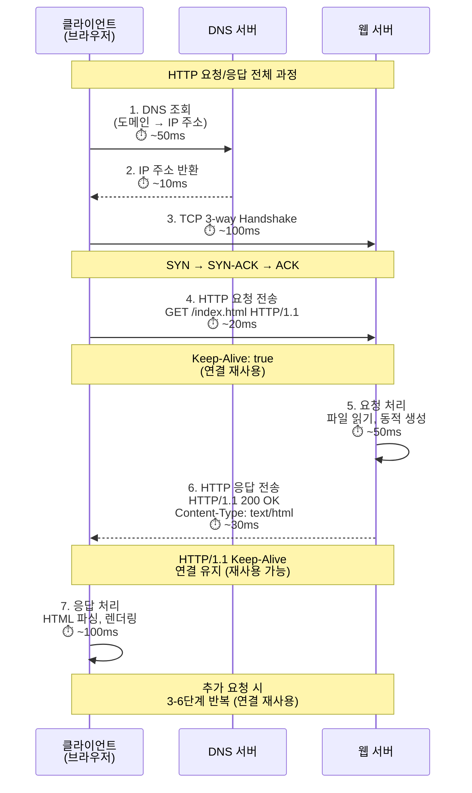
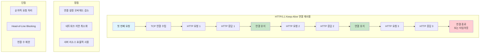

# HTTP (HyperText Transfer Protocol)

## 개요

웹의 기반이 되는 프로토콜로, 클라이언트와 서버 간의 통신을 담당하는 애플리케이션 계층 프로토콜이다.

## HTTP 기본 개념

### HTTP란?

HTTP(HyperText Transfer Protocol)는 웹에서 정보를 주고받기 위한 프로토콜이다. 클라이언트(웹 브라우저)와 서버 간의 통신 규칙을 정의하며, HTML 문서, 이미지, 동영상 등 다양한 리소스를 전송할 수 있다.

### 주요 특징

- 클라이언트-서버 모델: 요청하는 클라이언트와 응답하는 서버로 구성
- 포트 번호: HTTP는 80번, HTTPS는 443번 포트 사용
- 텍스트 기반: 사람이 읽을 수 있는 형태의 메시지 구조
- 상태 비저장(Stateless): 각 요청이 독립적으로 처리됨

## HTTP 통신 구조

### 구성 요소

1. 클라이언트: 웹 브라우저, 모바일 앱, API 클라이언트 등
2. 서버: 웹 서버, API 서버, 정적 파일 서버 등
3. 프록시: 중간 서버로 캐싱, 로드 밸런싱, 보안 기능 제공

## HTTP 프로토콜의 주요 특징

### Connectionless (비연결 지향)

요청-응답 후 연결 종료한다.

**장점:**
- 서버 리소스 효율적 사용
- 동시 접속자 증가 가능

**단점:**
- 매 요청마다 연결 설정 필요
- 지연 발생

HTTP/1.1부터 Keep-Alive로 연결을 재사용할 수 있다.

### Stateless (무상태)

각 요청이 독립적으로 처리된다.

**장점:**
- 서버 복잡도 감소
- 확장성 우수

**단점:**
- 상태 정보 유지를 위한 추가 메커니즘 필요

### 상태 관리 방법

- 쿠키: 클라이언트에 상태 정보 저장
- 세션: 서버에 상태 정보 저장
- JWT: 토큰 기반 상태 관리
- OAuth: 외부 인증 서비스 활용

인증 정보는 세션이나 JWT로 관리한다. 사용자 선호도는 쿠키로 관리한다.

## HTTP 통신 과정

### HTTP 요청/응답 플로우


```mermaid
sequenceDiagram
    participant Client as 클라이언트<br/>(브라우저)
    participant DNS as DNS 서버
    participant Server as 웹 서버

    Note over Client,Server: HTTP 요청/응답 전체 과정

    Client->>DNS: 1. DNS 조회<br/>(도메인 → IP 주소)<br/>⏱️ ~50ms
    DNS-->>Client: 2. IP 주소 반환<br/>⏱️ ~10ms

    Client->>Server: 3. TCP 3-way Handshake<br/>⏱️ ~100ms
    Note over Client,Server: SYN → SYN-ACK → ACK

    Client->>Server: 4. HTTP 요청 전송<br/>GET /index.html HTTP/1.1<br/>⏱️ ~20ms
    Note over Client,Server: Keep-Alive: true<br/>(연결 재사용)

    Server->>Server: 5. 요청 처리<br/>파일 읽기, 동적 생성<br/>⏱️ ~50ms

    Server-->>Client: 6. HTTP 응답 전송<br/>HTTP/1.1 200 OK<br/>Content-Type: text/html<br/>⏱️ ~30ms

    Note over Client,Server: HTTP/1.1 Keep-Alive<br/>연결 유지 (재사용 가능)

    Client->>Client: 7. 응답 처리<br/>HTML 파싱, 렌더링<br/>⏱️ ~100ms

    Note over Client,Server: 추가 요청 시<br/>3-6단계 반복 (연결 재사용)
```

### HTTP/1.1 Keep-Alive 연결 재사용


```mermaid
graph TB
    subgraph "HTTP/1.1 Keep-Alive 연결 재사용"
        A[첫 번째 요청] --> B[TCP 연결 수립]
        B --> C[HTTP 요청 1]
        C --> D[HTTP 응답 1]
        D --> E[연결 유지]
        E --> F[HTTP 요청 2]
        F --> G[HTTP 응답 2]
        G --> H[연결 유지]
        H --> I[HTTP 요청 3]
        I --> J[HTTP 응답 3]
        J --> K[연결 종료<br/>또는 타임아웃]
    end

    subgraph "장점"
        L[연결 설정 오버헤드 감소]
        M[네트워크 지연 최소화]
        N[서버 리소스 효율적 사용]
    end

    subgraph "단점"
        O[순차적 요청 처리]
        P[Head-of-Line Blocking]
        Q[연결 수 제한]
    end

    style A fill:#e1f5fe
    style E fill:#c8e6c9
    style H fill:#c8e6c9
    style K fill:#ffcdd2
```

## HTTP 메시지 구조

HTTP 메시지는 요청(Request)과 응답(Response) 두 종류가 있다. 둘 다 시작줄, 헤더, 빈 줄(CRLF), 바디로 구성된다.

### 요청 메시지 (Request Message)

```
[Request Line]    POST /api/users HTTP/1.1
[Headers]         Host: api.example.com
                  Content-Type: application/json
                  Content-Length: 52
                  Authorization: Bearer eyJhbG...
[빈 줄 CRLF]
[Body]            {"name": "홍길동", "email": "hong@example.com"}
```

#### Request Line

Request Line은 `메서드 SP 요청대상 SP HTTP버전 CRLF` 형식이다.

```
GET /users?page=2&size=10 HTTP/1.1
```

- **메서드**: GET, POST, PUT, DELETE, PATCH 등
- **요청 대상(Request Target)**: 리소스 경로와 쿼리스트링. 보통 절대 경로(`/path`)를 쓰지만, 프록시를 거칠 때는 전체 URL(`http://example.com/path`)을 쓰는 경우가 있다
- **HTTP 버전**: `HTTP/1.0`, `HTTP/1.1`, `HTTP/2` 등

실무에서 자주 실수하는 부분이 요청 대상에 한글이나 공백을 그대로 넣는 것이다. URL 인코딩을 해야 한다.

```
# 잘못된 요청
GET /search?q=검색어 HTTP/1.1

# 올바른 요청
GET /search?q=%EA%B2%80%EC%83%89%EC%96%B4 HTTP/1.1
```

#### 요청 헤더 구조

헤더는 `헤더이름: 값` 형식이다. 헤더 이름은 대소문자를 구분하지 않지만, 값은 구분한다.

```http
GET /api/users/123 HTTP/1.1
Host: api.example.com
User-Agent: Mozilla/5.0 (Windows NT 10.0; Win64; x64)
Accept: application/json
Accept-Language: ko-KR,ko;q=0.9,en;q=0.8
Accept-Encoding: gzip, deflate, br
Connection: keep-alive
If-None-Match: "abc123"
```

Host 헤더는 HTTP/1.1에서 유일한 필수 헤더다. 하나의 서버에 여러 도메인이 호스팅될 수 있기 때문에 반드시 포함해야 한다. Host가 빠지면 400 Bad Request가 돌아온다.

### 응답 메시지 (Response Message)

```
[Status Line]     HTTP/1.1 200 OK
[Headers]         Content-Type: application/json; charset=utf-8
                  Content-Length: 128
                  Date: Sat, 29 Mar 2026 10:30:00 GMT
                  Cache-Control: max-age=3600
[빈 줄 CRLF]
[Body]            {"id": 123, "name": "홍길동", "email": "hong@example.com"}
```

#### Status Line

Status Line은 `HTTP버전 SP 상태코드 SP 사유구절 CRLF` 형식이다.

```
HTTP/1.1 404 Not Found
```

- **HTTP 버전**: 서버가 사용하는 HTTP 버전
- **상태 코드**: 3자리 숫자. 요청 처리 결과를 나타낸다
- **사유 구절(Reason Phrase)**: 사람이 읽기 위한 텍스트. 클라이언트가 파싱에 쓰면 안 된다. HTTP/2에서는 아예 제거됐다

### 바디(Body)

GET, HEAD, DELETE, OPTIONS 요청은 보통 바디가 없다. POST, PUT, PATCH는 바디가 있다.

응답도 204 No Content, 304 Not Modified 같은 경우에는 바디가 없다.

바디가 있을 때 `Content-Length` 헤더로 바디 크기를 바이트 단위로 지정하거나, `Transfer-Encoding: chunked`로 청크 전송한다.

```http
HTTP/1.1 200 OK
Transfer-Encoding: chunked
Content-Type: text/plain

7\r\n
Hello, \r\n
6\r\n
World!\r\n
0\r\n
\r\n
```

청크 전송은 전체 응답 크기를 미리 알 수 없을 때 사용한다. 스트리밍 API나 대용량 파일 다운로드에서 흔히 볼 수 있다. 각 청크는 `크기(16진수)\r\n데이터\r\n` 형식이고, 크기 0인 청크가 마지막을 의미한다.

Content-Length와 Transfer-Encoding: chunked가 동시에 오면 chunked가 우선한다. 둘 다 없으면 연결이 닫힐 때까지 바디를 읽는다.

## HTTP 메서드 (요청 방식)

### 주요 메서드

- GET: 리소스 조회 (읽기 전용, 안전)
- POST: 리소스 생성 (데이터 전송)
- PUT: 리소스 전체 수정
- DELETE: 리소스 삭제
- PATCH: 리소스 부분 수정

### 기타 메서드

- HEAD: 헤더 정보만 조회. 바디 없이 응답 헤더만 받는다. 리소스 존재 여부 확인이나 Content-Length 확인에 쓴다
- OPTIONS: 서버가 지원하는 메서드 확인. CORS preflight 요청에서 브라우저가 자동으로 보낸다
- TRACE: 요청 경로 추적. 보안상 위험해서 대부분의 서버에서 비활성화한다
- CONNECT: 프록시를 통한 TCP 터널링. HTTPS 통신 시 프록시에서 사용한다

### 메서드 속성

| 메서드 | 안전(Safe) | 멱등(Idempotent) | 캐시 가능 |
|--------|-----------|------------------|-----------|
| GET | O | O | O |
| HEAD | O | O | O |
| POST | X | X | 조건부 |
| PUT | X | O | X |
| DELETE | X | O | X |
| PATCH | X | X | 조건부 |

- **안전(Safe)**: 서버의 상태를 변경하지 않는다
- **멱등(Idempotent)**: 같은 요청을 여러 번 보내도 결과가 동일하다. PUT으로 같은 데이터를 10번 보내도 결과는 같다. POST는 10번 보내면 10개가 생길 수 있다
- **캐시 가능**: GET, HEAD는 캐시 가능. POST, PATCH는 Content-Location 헤더가 있으면 캐시할 수 있지만 실제로 캐시하는 구현체는 드물다

```http
GET /users/123 HTTP/1.1
Host: api.example.com

POST /users HTTP/1.1
Host: api.example.com
Content-Type: application/json

{
  "name": "홍길동",
  "email": "hong@example.com"
}
```

PUT은 전체 교체이므로 빠뜨린 필드가 null로 바뀔 수 있다. 부분 수정은 PATCH를 써야 한다.

## HTTP 상태 코드

### 1xx (정보 응답)

- 100 Continue: 클라이언트가 `Expect: 100-continue` 헤더를 보냈을 때, 서버가 바디를 받을 준비가 됐다는 응답. 대용량 파일 업로드 전에 서버가 거부할 수 있는지 먼저 확인할 때 쓴다
- 101 Switching Protocols: WebSocket 연결 시 HTTP에서 WS 프로토콜로 전환할 때 나온다
- 103 Early Hints: 서버가 최종 응답 전에 미리 Link 헤더를 보내서 브라우저가 리소스를 프리로드할 수 있게 한다

### 2xx (성공)

- 200 OK: 요청 성공
- 201 Created: 리소스 생성 성공. Location 헤더에 새로 생성된 리소스의 URI가 들어간다
- 204 No Content: 성공했지만 응답 본문 없음. DELETE 성공 시 주로 사용한다
- 206 Partial Content: Range 요청에 대한 응답. 대용량 파일 다운로드 시 이어받기에 쓴다

### 3xx (리다이렉션)

- 301 Moved Permanently: 영구 이동
- 302 Found: 임시 이동
- 303 See Other: POST 처리 후 GET으로 리다이렉트
- 304 Not Modified: 수정되지 않음 (캐시 사용)
- 307 Temporary Redirect: 임시 이동 (메서드 유지)
- 308 Permanent Redirect: 영구 이동 (메서드 유지)

리다이렉션 코드의 차이는 아래 별도 섹션에서 상세히 다룬다.

### 4xx (클라이언트 오류)

- 400 Bad Request: 요청 문법 오류, 유효성 검증 실패
- 401 Unauthorized: 인증 필요. 이름이 Unauthorized이지만 실제 의미는 "Unauthenticated"에 가깝다
- 403 Forbidden: 인증은 됐지만 권한 없음. 401과 혼동하는 경우가 많은데, 401은 "누구인지 모르겠다", 403은 "누구인지 알지만 권한이 없다"
- 404 Not Found: 리소스 없음
- 405 Method Not Allowed: 해당 리소스에서 지원하지 않는 메서드. Allow 헤더에 지원하는 메서드 목록이 포함된다
- 409 Conflict: 현재 서버 상태와 충돌. 중복 생성 시도나 동시 수정 충돌 시 사용한다
- 413 Content Too Large: 요청 바디가 서버가 허용하는 크기를 초과. 파일 업로드 크기 제한에 걸릴 때 나온다
- 429 Too Many Requests: 속도 제한(Rate Limiting) 초과. `Retry-After` 헤더로 재시도 가능 시점을 알려줘야 한다

### 5xx (서버 오류)

- 500 Internal Server Error: 서버 내부 오류. 예외 처리 안 된 에러가 여기로 빠진다
- 502 Bad Gateway: 게이트웨이/프록시가 업스트림 서버로부터 잘못된 응답을 받음. Nginx 뒤의 애플리케이션 서버가 죽었을 때 자주 보인다
- 503 Service Unavailable: 서비스 이용 불가. 배포 중이거나 과부하 상태. `Retry-After` 헤더로 복구 예상 시간을 알려줄 수 있다
- 504 Gateway Timeout: 게이트웨이/프록시가 업스트림 서버로부터 응답을 시간 내에 받지 못함

4xx는 클라이언트가 요청을 고쳐야 하므로 재시도해도 같은 결과다. 5xx는 서버 상태에 따라 달라지므로 재시도가 의미 있다. 다만 500은 코드 버그인 경우가 많아서 재시도해도 안 되는 경우가 많고, 503은 일시적이라 재시도가 도움이 된다.

## 리다이렉션 상세

### 301 vs 302 vs 307 vs 308

리다이렉션 코드를 잘못 쓰면 SEO 문제, POST 데이터 유실, 무한 리다이렉트 같은 실무 장애가 생긴다.

| 코드 | 의미 | 영구/임시 | 메서드 변경 |
|------|------|-----------|-------------|
| 301 | Moved Permanently | 영구 | POST → GET으로 변경될 수 있음 |
| 302 | Found | 임시 | POST → GET으로 변경될 수 있음 |
| 303 | See Other | - | 무조건 GET으로 변경 |
| 307 | Temporary Redirect | 임시 | 원래 메서드 유지 |
| 308 | Permanent Redirect | 영구 | 원래 메서드 유지 |

#### 301 Moved Permanently

리소스가 영구적으로 새 위치로 옮겨졌다. 브라우저와 검색 엔진은 이 응답을 캐시한다.

```http
HTTP/1.1 301 Moved Permanently
Location: https://new.example.com/users
```

문제는 301 응답을 받은 브라우저가 POST 요청을 GET으로 바꿔서 리다이렉트하는 경우가 있다. RFC 스펙상으로는 메서드를 유지해야 하지만, 초기 브라우저 구현에서 GET으로 바꾸는 관행이 굳어졌다. 301 응답을 브라우저가 캐시하면 원래 URL을 다시 쓸 수 없게 된다. 개발 중에 잘못된 301을 내보내면 브라우저 캐시를 지우기 전까지 계속 리다이렉트된다.

```
사용 사례:
- 도메인 변경: example.com → new-example.com
- URL 구조 변경: /old-path → /new-path
- HTTP → HTTPS 강제 전환
```

#### 302 Found

원래 이름은 "Moved Temporarily"였다. 리소스가 임시로 다른 위치에 있다.

```http
HTTP/1.1 302 Found
Location: https://example.com/login
```

301과 같은 문제가 있다. POST를 보냈는데 302 응답이 오면 브라우저가 GET으로 바꿔서 리다이렉트할 수 있다. 이 동작이 원래 스펙 위반이었지만 브라우저들이 다 그렇게 구현해버려서, 그래서 303과 307이 나왔다.

```
사용 사례:
- 로그인 후 원래 페이지로 돌려보내기
- A/B 테스트 시 다른 버전으로 보내기
- 점검 중 임시 페이지로 안내
```

#### 303 See Other

POST/PUT/DELETE 처리 후 결과를 GET으로 조회하라는 의미다. PRG(Post/Redirect/Get) 패턴에서 쓴다.

```http
POST /orders HTTP/1.1
Content-Type: application/json
{"item": "laptop", "quantity": 1}

HTTP/1.1 303 See Other
Location: /orders/12345
```

주문을 POST로 생성하고, 303으로 주문 조회 페이지로 보내면 사용자가 새로고침을 눌러도 주문이 중복 생성되지 않는다. 브라우저가 GET으로 바꿔서 요청하기 때문이다.

#### 307 Temporary Redirect

302의 메서드 변경 문제를 해결한 코드다. 원래 요청의 메서드와 바디를 그대로 유지해서 리다이렉트한다.

```http
POST /api/v1/users HTTP/1.1
Content-Type: application/json
{"name": "홍길동"}

HTTP/1.1 307 Temporary Redirect
Location: /api/v2/users
```

POST 요청이 307로 리다이렉트되면 브라우저는 POST 메서드와 바디를 그대로 유지해서 새 URL로 요청한다. API 버전 마이그레이션에서 유용하다.

```
사용 사례:
- API 버전 마이그레이션: v1 → v2로 임시 전환
- 로드 밸런싱 시 다른 서버로 전달
- HSTS 적용 시 HTTP → HTTPS (브라우저 내부 동작)
```

#### 308 Permanent Redirect

301의 메서드 변경 문제를 해결한 코드다. 영구 이동이면서 메서드를 유지한다.

```http
POST /api/old-endpoint HTTP/1.1
Content-Type: application/json
{"data": "value"}

HTTP/1.1 308 Permanent Redirect
Location: /api/new-endpoint
```

```
사용 사례:
- API 엔드포인트 영구 변경 (메서드 유지 필요 시)
- POST를 받는 URL이 영구 이동한 경우
```

### 리다이렉션 실무 주의사항

**리다이렉트 체인**: 리다이렉트가 2~3번 이상 연속되면 지연이 누적된다. 크롬은 최대 20회까지 따라가고 그 이후에는 ERR_TOO_MANY_REDIRECTS를 표시한다. 리다이렉트는 최대 1~2번 이내로 끝나도록 설정한다.

```nginx
# 나쁜 예: 리다이렉트 체인
# http://example.com → https://example.com → https://www.example.com → https://www.example.com/
# 3번 리다이렉트 = 3 × RTT 추가

# 좋은 예: 한 번에 최종 목적지로
server {
    listen 80;
    server_name example.com www.example.com;
    return 301 https://www.example.com$request_uri;
}
```

**304 Not Modified와 조건부 요청**: 304는 리다이렉션이 아니라 캐시 관련 응답이다. 클라이언트가 `If-None-Match`(ETag 비교)나 `If-Modified-Since`(날짜 비교) 헤더를 보내서 서버에 "내가 가진 캐시가 아직 유효한지" 물어보면, 변경이 없으면 304를 응답하고 바디 없이 끝난다.

```http
# 첫 번째 요청
GET /api/users/123 HTTP/1.1
Host: api.example.com

HTTP/1.1 200 OK
ETag: "v1-abc123"
Last-Modified: Sat, 28 Mar 2026 10:00:00 GMT
Content-Type: application/json
{"id": 123, "name": "홍길동"}

# 이후 요청 (캐시 검증)
GET /api/users/123 HTTP/1.1
Host: api.example.com
If-None-Match: "v1-abc123"

HTTP/1.1 304 Not Modified
ETag: "v1-abc123"
```

바디를 안 보내므로 대역폭을 절약할 수 있다. 다만 요청 자체는 발생하므로 RTT는 줄어들지 않는다. RTT까지 줄이려면 `Cache-Control: max-age`를 적절히 설정해야 한다.

## 콘텐츠 협상 (Content Negotiation)

클라이언트와 서버가 응답의 형식, 언어, 인코딩을 협상하는 메커니즘이다. 같은 리소스라도 클라이언트가 어떤 형식을 원하는지에 따라 다른 표현(representation)을 제공한다.

### Accept: 미디어 타입 협상

클라이언트가 처리할 수 있는 미디어 타입을 서버에 알린다.

```http
GET /api/users/123 HTTP/1.1
Accept: application/json
```

서버는 이 헤더를 보고 응답 형식을 결정한다. 여러 타입을 나열할 수 있고, `q` 값(quality factor)으로 우선순위를 지정한다. q 값은 0~1 사이이며, 생략하면 1이다.

```http
Accept: text/html, application/xhtml+xml, application/xml;q=0.9, */*;q=0.8
```

이 헤더는 "text/html이나 application/xhtml+xml을 선호하고, 그 다음으로 application/xml, 나머지는 뭐든 괜찮다"는 의미다.

Spring에서 Accept 헤더에 맞는 응답을 못 만들면 406 Not Acceptable이 돌아온다. API를 개발할 때 Accept 헤더를 무시하는 서버가 많은데, 클라이언트가 XML을 보냈는데 JSON을 주면 파싱 에러가 나서 디버깅하기 어렵다.

```java
// Spring에서 콘텐츠 협상 설정
@GetMapping(value = "/users/{id}",
            produces = {MediaType.APPLICATION_JSON_VALUE, MediaType.APPLICATION_XML_VALUE})
public User getUser(@PathVariable Long id) {
    return userService.findById(id);
}
```

### Accept-Encoding: 압축 방식 협상

클라이언트가 지원하는 압축 알고리즘을 서버에 알린다.

```http
GET /api/data HTTP/1.1
Accept-Encoding: gzip, deflate, br
```

서버는 지원하는 압축 방식 중 하나를 선택해서 `Content-Encoding` 헤더와 함께 압축된 바디를 보낸다.

```http
HTTP/1.1 200 OK
Content-Encoding: gzip
Content-Type: application/json
Vary: Accept-Encoding
```

`br`은 Brotli 압축이다. gzip보다 압축률이 20~30% 좋지만 압축 속도가 느리다. 정적 파일은 미리 Brotli로 압축해두고, 동적 응답은 gzip을 쓰는 경우가 많다.

`Vary: Accept-Encoding` 헤더가 중요하다. CDN이나 프록시 캐시에게 "Accept-Encoding 헤더가 다르면 별도로 캐시하라"고 알려주는 것이다. 이게 없으면 gzip 응답이 캐시된 상태에서 Brotli를 지원하는 클라이언트에게도 gzip이 전달될 수 있다.

### Content-Type 협상

`Content-Type`은 요청/응답 바디의 미디어 타입을 나타낸다.

```http
POST /api/users HTTP/1.1
Content-Type: application/json; charset=utf-8

{"name": "홍길동"}
```

자주 쓰는 Content-Type:

| Content-Type | 용도 |
|-------------|------|
| `application/json` | JSON API |
| `application/x-www-form-urlencoded` | HTML 폼 기본 전송 |
| `multipart/form-data` | 파일 업로드 |
| `text/html; charset=utf-8` | HTML 문서 |
| `application/octet-stream` | 바이너리 데이터 |

`multipart/form-data`로 파일을 업로드할 때는 boundary 구분자가 자동으로 생성된다.

```http
POST /upload HTTP/1.1
Content-Type: multipart/form-data; boundary=----WebKitFormBoundary7MA4YWxkTrZu0gW

------WebKitFormBoundary7MA4YWxkTrZu0gW
Content-Disposition: form-data; name="file"; filename="report.pdf"
Content-Type: application/pdf

(바이너리 데이터)
------WebKitFormBoundary7MA4YWxkTrZu0gW
Content-Disposition: form-data; name="description"

분기 보고서
------WebKitFormBoundary7MA4YWxkTrZu0gW--
```

Spring에서 `@RequestBody`로 JSON을 받을 때 Content-Type이 `application/json`이 아니면 415 Unsupported Media Type이 돌아온다. Postman에서 테스트할 때는 잘 되는데 프론트엔드에서 fetch로 보낼 때 Content-Type을 안 넣어서 400이 나는 경우가 흔하다.

### Accept-Language: 언어 협상

```http
GET /help HTTP/1.1
Accept-Language: ko-KR,ko;q=0.9,en;q=0.8,ja;q=0.7
```

서버는 지원하는 언어 중 q 값이 가장 높은 것을 선택한다. 매칭되는 언어가 없으면 서버의 기본 언어로 응답한다.

실무에서는 Accept-Language를 무시하고 URL 경로(`/ko/help`, `/en/help`)나 쿼리 파라미터(`?lang=ko`)로 언어를 지정하는 방식이 많다. Accept-Language는 브라우저 설정에 의존하므로 사용자가 명시적으로 언어를 바꾼 경우를 처리하기 어렵다.

### 서버 주도 vs 에이전트 주도 협상

**서버 주도(Server-Driven)**: 위에서 설명한 방식이다. 클라이언트가 Accept 계열 헤더를 보내면 서버가 적절한 표현을 선택한다. 서버가 클라이언트의 선호를 정확히 알기 어렵다는 단점이 있다.

**에이전트 주도(Agent-Driven)**: 서버가 300 Multiple Choices 응답과 함께 선택 가능한 표현 목록을 보내면 클라이언트가 직접 선택한다. 실제로는 거의 안 쓴다.

## HTTP 헤더

### 일반 헤더 (General Headers)

- Date: 메시지 생성 시간
- Connection: 연결 관리 방식. HTTP/1.1에서 `keep-alive`가 기본이므로 `Connection: close`를 명시적으로 보내야 연결이 끊긴다
- Cache-Control: 캐시 정책

### 요청 헤더 (Request Headers)

- Host: 대상 서버 (HTTP/1.1 필수)
- User-Agent: 클라이언트 정보
- Accept: 수용 가능한 미디어 타입
- Authorization: 인증 정보
- Referer: 이전 페이지 URL. 오타가 그대로 표준이 됐다(Referrer가 맞는 철자)

### 응답 헤더 (Response Headers)

- Server: 서버 소프트웨어 정보. 보안상 노출하지 않거나 최소한으로 설정하는 것이 좋다
- Set-Cookie: 쿠키 설정
- Content-Type: 응답 데이터 타입
- Content-Length: 응답 본문 크기 (바이트 단위)
- Location: 리다이렉트 대상 URL (3xx 응답에서 사용)

```http
GET /api/users HTTP/1.1
Host: api.example.com
User-Agent: Mozilla/5.0
Accept: application/json
Authorization: Bearer token123

HTTP/1.1 200 OK
Content-Type: application/json
Content-Length: 123
Set-Cookie: sessionId=abc123; HttpOnly; Secure
```

Authorization 헤더는 평문으로 전송되므로 HTTPS를 반드시 사용해야 한다.

## 프로덕션 환경에서의 HTTP 설정

### Keep-Alive 연결 관리

프로덕션 환경에서 Keep-Alive 연결을 잘못 설정하면 리소스 고갈이 발생할 수 있다.

**Nginx 설정 예시:**
```nginx
http {
    # Keep-Alive 타임아웃 설정
    keepalive_timeout 65s;  # 기본값: 75초
    keepalive_requests 100; # 연결당 최대 요청 수

    # Keep-Alive 연결 풀 크기 제한
    keepalive_connections 1000; # 최대 유지 연결 수
}
```

- Keep-Alive 타임아웃이 너무 길면 서버 리소스 고갈. 실제로 타임아웃 300초 설정 시 서버 메모리 사용량 40% 증가한 사례가 있다
- 연결 풀 크기 제한 없으면 메모리 부족 발생
- 30-60초가 적절하다

```nginx
# 연결 관리 최적화
http {
    keepalive_timeout 30s;  # 타임아웃 단축
    keepalive_requests 50;   # 연결당 요청 수 제한
    client_max_body_size 10m;

    # 타임아웃된 연결 정리
    reset_timedout_connection on;
}
```

### 캐싱 설정

```nginx
# 정적 리소스 캐싱
location ~* \.(jpg|jpeg|png|gif|ico|css|js)$ {
    expires 1y;
    add_header Cache-Control "public, immutable";
    add_header Vary "Accept-Encoding";
}

# API 응답 캐싱 (조건부)
location /api/ {
    add_header Cache-Control "public, max-age=300";
    add_header ETag $upstream_http_etag;

    # ETag 기반 조건부 요청 처리
    if_modified_since exact;
}
```

- 정적 리소스 캐싱: 서버 부하 60-70% 감소
- API 응답 캐싱: 응답 시간 50-80% 단축 (캐시 히트 시)
- CDN 사용 시 전송 비용 40% 절감

### 헤더 크기 제한 초과 문제

**증상:** 400 Bad Request 에러가 특정 요청에서만 발생

**원인:** 쿠키나 인증 토큰이 너무 크거나 커스텀 헤더가 많은 경우

```nginx
# 헤더 크기 제한 증가
http {
    large_client_header_buffers 4 16k;
    client_header_buffer_size 4k;
}
```

토큰을 쿠키 대신 Authorization 헤더에 넣거나, 불필요한 쿠키를 정리하는 것이 근본적인 해결책이다.

### 모니터링 메트릭

프로덕션에서 확인해야 할 HTTP 관련 메트릭:

**연결 메트릭:**
- 활성 연결 수
- Keep-Alive 연결 수
- 연결 생성/종료 속도

**성능 메트릭:**
- 평균 응답 시간 (P50, P95, P99)
- 처리량 (RPS - Requests Per Second)
- 에러율 (4xx, 5xx)

**리소스 메트릭:**
- 메모리 사용량
- CPU 사용률
- 네트워크 대역폭

```javascript
// Node.js에서 HTTP 메트릭 수집
const prometheus = require('prom-client');

const httpRequestDuration = new prometheus.Histogram({
    name: 'http_request_duration_seconds',
    help: 'Duration of HTTP requests in seconds',
    labelNames: ['method', 'route', 'status_code'],
    buckets: [0.1, 0.3, 0.5, 0.7, 1, 3, 5, 7, 10]
});

const httpRequestTotal = new prometheus.Counter({
    name: 'http_requests_total',
    help: 'Total number of HTTP requests',
    labelNames: ['method', 'route', 'status_code']
});

// 미들웨어에서 메트릭 수집
app.use((req, res, next) => {
    const start = Date.now();

    res.on('finish', () => {
        const duration = (Date.now() - start) / 1000;
        httpRequestDuration.observe(
            { method: req.method, route: req.route?.path, status_code: res.statusCode },
            duration
        );
        httpRequestTotal.inc({
            method: req.method,
            route: req.route?.path,
            status_code: res.statusCode
        });
    });

    next();
});
```

> **참고 자료**:
> - [MDN HTTP 개요](https://developer.mozilla.org/ko/docs/Web/HTTP/Overview)
> - [MDN HTTP 메서드](https://developer.mozilla.org/ko/docs/Web/HTTP/Methods)
> - [MDN HTTP 상태 코드](https://developer.mozilla.org/ko/docs/Web/HTTP/Status)
> - [MDN 콘텐츠 협상](https://developer.mozilla.org/ko/docs/Web/HTTP/Content_negotiation)
> - [RFC 9110 - HTTP Semantics](https://httpwg.org/specs/rfc9110.html)
