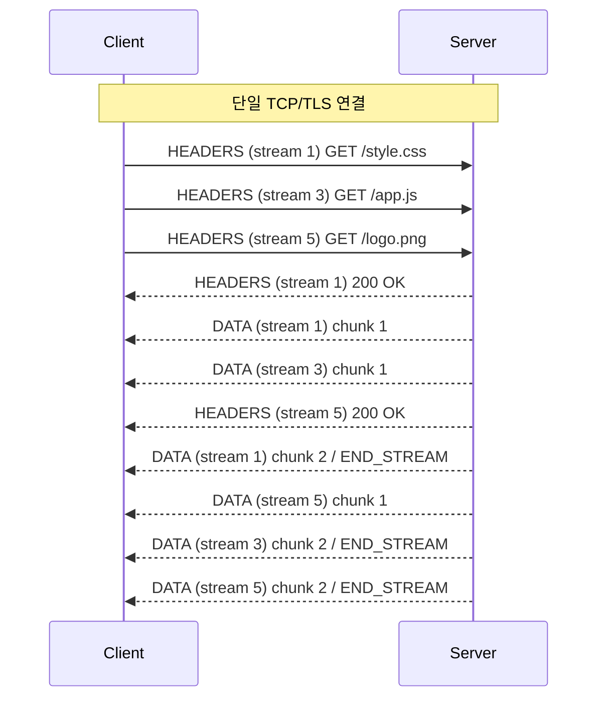

# HTTP/2

## 들어가며

HTTP/2는 2015년 RFC 7540으로 표준화되었다. 2009년 Google이 만든 SPDY를 기반으로 IETF가 다듬은 결과물이고, 2022년 RFC 9113으로 개정되면서 서버 푸시 같은 일부 사양은 사실상 삭제되었다. HTTP/1.1과 동일한 시맨틱(메서드, 상태 코드, 헤더 의미)을 유지하면서 와이어 포맷만 바이너리 프레이밍으로 바꾼 것이 핵심이다. 따라서 애플리케이션 레벨에서 보면 변한 게 거의 없는데, 트랜스포트 가까운 레이어에서는 완전히 다른 프로토콜이라고 봐도 된다.

이 문서는 HTTP/1.1에서 HTTP/2로 넘어가면서 무엇이 어떻게 바뀌었는지, 실무에서 디버깅하다 보면 어떤 함정에 빠지는지를 다룬다. 성능 수치 자체보다는 프로토콜이 바이트 수준에서 어떻게 동작하는지, 그리고 그 동작이 운영 환경에서 어떤 문제를 만드는지에 초점을 맞췄다.

## HTTP/1.1의 한계

### Head-of-Line Blocking이 실제로 어떻게 발생하는가

HTTP/1.1에서 Keep-Alive로 같은 TCP 연결을 재사용해도, 한 연결 위에서는 한 번에 하나의 요청-응답만 처리된다. 파이프라이닝이 RFC 2616에 명시되어 있긴 하지만, 중간 프록시들의 호환성 문제로 거의 모든 브라우저가 비활성화한 채 출시했다. 결과적으로 브라우저는 도메인당 6개 정도의 동시 TCP 연결을 띄워서 병렬성을 흉내낸다.

문제는 한 연결 안에서 첫 응답이 느리면 같은 연결로 보낸 다음 요청도 무조건 기다려야 한다는 점이다. 와이어샤크로 잡아보면 다음과 같은 패턴이 보인다.

```
Frame 142: GET /api/slow-report  (Stream A로 가는 요청)
Frame 143: GET /api/user/profile  (파이프라이닝으로 보낸 요청)
Frame 144: ... (서버는 slow-report 처리 중, 5초 동안 침묵)
Frame 145: HTTP/1.1 200 OK (slow-report 응답 시작)
Frame 198: HTTP/1.1 200 OK (그제서야 user/profile 응답)
```

profile 요청 자체는 50ms면 끝났을 텐데도 앞 요청 때문에 5초를 기다린다. 브라우저가 6개 연결을 쓰면 어느 정도 가려지지만, 한 페이지에서 100개 이상의 리소스를 받는 요즘 웹에서는 결국 큐가 쌓인다. 크롬 DevTools의 Network 탭에서 `Stalled` 또는 `Queued`로 표시되는 시간이 이 대기열 때문에 생긴다.

### 헤더 중복 전송

HTTP/1.1은 매 요청마다 헤더를 평문 그대로 다시 보낸다. 쿠키 하나가 4KB 가까이 되는 사이트에서 100개 리소스를 받으면 헤더만 400KB가 오간다. 본문이 작은 API 호출일수록 헤더 비중이 비정상적으로 커진다. 실제로 광고 쿠키가 누적된 사이트에서 HAR 파일을 까보면 응답 본문보다 요청 헤더가 더 큰 경우가 흔하다.

### 도메인 샤딩 같은 우회 기법

브라우저가 도메인당 6개 연결로 제한하니까 `static1.example.com`, `static2.example.com`처럼 도메인을 쪼개서 연결 수를 늘리는 방법이 한때 표준이었다. 이미지 스프라이트로 작은 아이콘들을 한 장의 PNG에 합치고 CSS background-position으로 잘라 쓰는 것도 같은 동기에서 나왔다. 요청 수를 줄이려고 짠 코드들이다. HTTP/2로 넘어가면 이 모든 게 안티패턴이 된다(뒤에서 다룬다).

## 바이너리 프레이밍 레이어

HTTP/2의 가장 근본적인 변화는 메시지를 **프레임**이라는 바이너리 단위로 쪼개고, 한 TCP 연결을 여러 **스트림**으로 다중화하는 점이다.

```
+-----------------------------------------------+
|                 Length (24)                   |
+---------------+---------------+---------------+
|   Type (8)    |   Flags (8)   |
+-+-------------+---------------+-------------------------------+
|R|                 Stream Identifier (31)                      |
+=+=============================================================+
|                   Frame Payload (0...)                      ...
+---------------------------------------------------------------+
```

프레임 헤더는 9바이트 고정이다. 24비트 길이 필드 때문에 프레임 페이로드는 최대 16MB까지 가능하지만 기본값은 16KB(`SETTINGS_MAX_FRAME_SIZE`)다.

### 한 연결에서 프레임이 섞여 흐르는 모습

세 개의 리소스를 같이 받을 때 와이어 위에서 프레임이 어떻게 인터리빙되는지 보면 멀티플렉싱이 직관적으로 와닿는다.



세 요청이 거의 동시에 나가고, 응답 DATA 프레임은 스트림 ID가 섞인 채로 도착한다. 받는 쪽 라이브러리가 스트림 ID를 보고 각자의 큐로 재조립한다. HTTP/1.1처럼 첫 응답이 끝날 때까지 두 번째 응답이 기다리는 일이 없다. 단, 모든 프레임이 단일 TCP 연결을 통하기 때문에 한 패킷이 손실되면 스트림 1, 3, 5가 같이 막힌다. 이게 뒤에 나오는 TCP HOL Blocking이다.

### 주요 프레임 타입

| 타입 코드 | 이름 | 용도 |
|----------|------|------|
| 0x0 | DATA | 응답/요청 본문 |
| 0x1 | HEADERS | HPACK 인코딩된 헤더 블록과 스트림 시작 |
| 0x2 | PRIORITY | 스트림 우선순위 (RFC 9113에서 deprecated) |
| 0x3 | RST_STREAM | 단일 스트림 중단 |
| 0x4 | SETTINGS | 연결 파라미터 협상 |
| 0x5 | PUSH_PROMISE | 서버 푸시 예고 (deprecated) |
| 0x6 | PING | 연결 살아있음 확인, RTT 측정 |
| 0x7 | GOAWAY | 전체 연결 종료 |
| 0x8 | WINDOW_UPDATE | 흐름 제어 윈도우 증가 |
| 0x9 | CONTINUATION | HEADERS 프레임 이어서 |

HEADERS 프레임의 페이로드 크기가 `MAX_FRAME_SIZE`를 넘으면 CONTINUATION 프레임으로 이어 보낸다. 이 시점에 다른 스트림의 프레임을 끼워 넣을 수 없다는 제약이 있어서, 거대 헤더 블록 자체가 일종의 미니 HOL이 된다. 일반적으로 발생할 일은 거의 없지만 인증 토큰을 헤더에 잔뜩 넣는 사내 시스템에서는 가끔 만난다.

### 스트림 ID 할당 규칙

스트림 ID는 31비트 정수로, 클라이언트가 시작한 스트림은 **홀수**, 서버가 시작한 스트림(PUSH_PROMISE로 만들어지는 것)은 **짝수**다. 0번은 연결 자체를 가리키는 예약 ID라서 SETTINGS, GOAWAY 같은 연결 레벨 프레임만 쓴다. ID는 단조 증가해야 하고, 한번 쓴 ID는 같은 연결 내에서 재사용할 수 없다.

이 규칙 때문에 한 연결에서 만들 수 있는 스트림 수는 결국 유한하다. 31비트 홀수 ID를 다 쓰면(약 10억 7천만 개) 새 스트림을 만들 수 없어 GOAWAY를 보내고 연결을 끊어야 한다. WebSocket 같은 장기 연결에서는 신경 쓸 일이 거의 없지만, 한 연결로 트래픽을 몰아서 24시간 운영하는 gRPC 게이트웨이에서는 ID 고갈을 한 번씩 본다.

### 동시 스트림 제한

`SETTINGS_MAX_CONCURRENT_STREAMS`는 한 연결에서 동시에 열 수 있는 스트림 수를 제한한다. RFC는 100 이상 권장하지만 강제는 아니다. Nginx 기본값은 128, Apache는 100, 대부분의 클라이언트 라이브러리도 100 근처에 있다.

이 값을 무작정 높이면 안 된다. 동시 스트림이 많을수록 서버는 그 수만큼 응답을 동시에 메모리에 올려두고 인터리빙해야 한다. 100을 넘으면 스레드 풀이나 이벤트 루프 처리 비용이 빠르게 커진다. 반대로 너무 낮으면 클라이언트가 의미 있는 병렬성을 못 얻고 큐에서 대기한다.

실무에서는 다음 기준으로 정한다.

- 백엔드 → 백엔드 gRPC: 1000~5000. 짧고 빈번한 호출이 많고 한 연결로 모든 트래픽을 보낸다.
- 정적 파일 서버: 100~256. 파일 한 번 보내고 나면 끝나니까 너무 높일 이유가 없다.
- 일반 웹 API: 128 정도가 무난하다.

설정값을 바꾸면 양쪽이 SETTINGS 프레임으로 협상하는데, **둘 중 더 작은 값이 적용되는 게 아니라 각자 자기 값을 상대에게 통보하는 방식**이다. 서버가 100을 광고하면 클라이언트는 그 연결에서 동시 스트림 100개를 넘으면 안 된다. 반대 방향(서버 푸시)은 클라이언트가 광고한 값을 따른다.

### 흐름 제어

스트림마다 그리고 연결 전체에 대해 별도의 흐름 제어 윈도우가 있다. 초기값은 64KB - 1바이트로, WINDOW_UPDATE 프레임으로 늘린다. 큰 응답을 받을 때 클라이언트가 윈도우를 빨리 안 늘려주면 서버가 보낼 데이터가 있어도 못 보낸다. nghttp2나 Envoy 같은 구현체에서 큰 파일 전송이 느릴 때 가장 먼저 의심해볼 곳이다.

## HPACK 헤더 압축

### 정적 테이블

HPACK은 HTTP/2 표준에 박혀 있는 61개의 헤더를 정적 테이블로 가지고 있다. RFC 7541 Appendix A에 그대로 적혀 있고, 모든 구현체가 동일한 테이블을 공유한다. 자주 쓰는 항목 일부:

| Index | Name | Value |
|-------|------|-------|
| 1 | :authority | |
| 2 | :method | GET |
| 3 | :method | POST |
| 4 | :path | / |
| 5 | :path | /index.html |
| 7 | :scheme | https |
| 8 | :status | 200 |
| 16 | accept-encoding | gzip, deflate |
| 32 | cookie | |
| 60 | via | |
| 61 | www-authenticate | |

`:method GET`을 보내고 싶으면 인덱스 2 한 바이트만 적어도 된다. 정확히는 가변 길이 정수 인코딩 때문에 0x82(1000 0010, 첫 비트가 인덱스 헤더 필드 표시) 한 바이트로 표현된다.

### 동적 테이블

연결마다 별도의 동적 테이블을 유지한다. 헤더가 정적 테이블에 없으면 동적 테이블에 추가하고 인덱스 62번부터 부여한다. 다음 요청부터 같은 헤더가 나오면 인덱스만 보낸다. 테이블 크기는 `SETTINGS_HEADER_TABLE_SIZE`로 협상하는데 기본 4096바이트다.

구체적인 예시를 보면 이해가 빠르다. 같은 연결에서 같은 API 엔드포인트를 두 번 호출한다고 하자.

```
첫 번째 요청:
  :method: GET                 → 정적 인덱스 2  (1바이트)
  :scheme: https               → 정적 인덱스 7  (1바이트)
  :path: /api/v1/users/me      → /가 인덱스 4, 나머지는 새 값
                                 → 인덱싱과 함께 보내고 동적 인덱스 62 부여 (~24바이트)
  :authority: api.example.com  → 정적 인덱스 1에 이름 매칭, 새 값
                                 → 동적 인덱스 63 부여 (~18바이트)
  authorization: Bearer eyJ... (1500B)
                               → 동적 인덱스 64 부여 (~1500바이트, Never Indexed면 매번 전송)
  user-agent: MyApp/1.0        → 동적 인덱스 65 부여 (~15바이트)

두 번째 요청:
  :method: GET                 → 0x82                (1바이트)
  :scheme: https               → 0x87                (1바이트)
  :path: /api/v1/users/me      → 인덱스 62, 0xbe     (1바이트)
  :authority: api.example.com  → 인덱스 63, 0xbf     (1바이트)
  authorization: Bearer eyJ... → 인덱스 64, 0xc0     (1바이트)
  user-agent: MyApp/1.0        → 인덱스 65, 0xc1     (1바이트)
```

첫 요청에서 1500바이트 가까이 나갔던 헤더 블록이 두 번째 요청에서는 6바이트로 줄어든다. 같은 사용자가 1초에 수십 번 API를 호출하는 모바일 앱에서 이 차이가 누적되면 백엔드 인그레스 트래픽이 통째로 한 자리 수 KB/s로 떨어진다.

다만 `authorization` 헤더가 토큰 재발급으로 매번 바뀌면 매 요청마다 새 엔트리가 동적 테이블에 들어가고 오래된 엔트리가 evict된다. 결국 인덱스 참조 효과를 못 받는다. 토큰 재발급 주기와 HPACK 캐시 효율은 직접적인 상관관계가 있다.

여기서 미묘한 보안 이슈가 있다. CRIME 공격 같은 압축 사이드 채널을 막으려고 RFC 7541은 민감한 헤더(인증 토큰 등)를 동적 테이블에 넣지 않도록 "Never Indexed" 플래그를 정의했다. 라이브러리가 이걸 제대로 안 쓰면 길이 변화로 토큰을 추측당할 수 있는 이론적 가능성이 있다. nghttp2, golang/x/net/http2 등 메인스트림 구현체는 잘 처리하지만 직접 구현했다면 확인해야 한다.

### 허프만 인코딩

문자열 자체는 허프만 코드로 한 번 더 압축한다. RFC 7541에 박혀 있는 정적 허프만 트리를 사용하고, ASCII 영문/숫자/구두점에 짧은 코드를 부여한다. `www.example.com`은 12바이트 허프만 코드로 줄어든다. 이미 압축된 데이터(예: 헤더에 base64로 인코딩된 큰 토큰)는 허프만으로 더 줄어들지 않으므로, 인코더는 평문이 더 짧으면 평문 그대로 보낼 수도 있다.

## ALPN 협상과 h2/h2c

### h2 vs h2c

- **h2**: TLS 위에서 동작하는 HTTP/2. 사실상 모든 프로덕션 트래픽.
- **h2c**: 평문 TCP 위에서 동작하는 HTTP/2 (cleartext). 사양상 가능하지만 **모든 주류 브라우저가 거부**한다.

브라우저가 h2c를 막은 건 의도적이다. 중간 프록시(투명 프록시, 캐시, 방화벽)들이 평문 HTTP/1.1 트래픽을 가로채서 변조하거나 차단하는 게 흔한데, h2c는 같은 80 포트를 쓰면서 전혀 다른 와이어 포맷이라 호환되지 않는다. Upgrade 헤더로 h2c를 협상하는 절차도 RFC 9113에서는 deprecated되었다.

h2c가 의미 있는 곳은 사실상 두 군데다. 첫째, 신뢰할 수 있는 내부망에서의 서비스 간 통신(특히 gRPC). 둘째, 사이드카 프록시 같이 TLS는 외부에서 종료되고 내부는 평문인 환경. Envoy → 백엔드 사이가 대표적이다.

### ALPN 협상 과정

TLS 핸드셰이크의 ClientHello에 ALPN 확장으로 클라이언트가 지원하는 프로토콜 목록을 넣는다.

```
extension: application_layer_protocol_negotiation
  ALPN Protocol: h2
  ALPN Protocol: http/1.1
```

서버는 ServerHello에서 하나를 골라 응답한다. h2를 고르면 핸드셰이크 직후부터 HTTP/2 연결 프리페이스를 보낸다. 프리페이스는 정확히 다음 24바이트로 시작한다.

```
PRI * HTTP/2.0\r\n\r\nSM\r\n\r\n
```

이 마법의 문자열이 보내지지 않으면 HTTP/2 서버는 즉시 연결을 끊는다. 디버깅하다가 패킷 캡처 첫 줄에서 PRI를 못 보면 ALPN 협상 단계에서 뭔가 어긋난 것이다. AWS ALB나 CloudFront 같은 프록시가 중간에 끼어 있을 때, 프록시 ALB → 백엔드 사이는 HTTP/1.1로 다운그레이드되는 게 기본 동작이라는 점도 알아둘 필요가 있다.

## 서버 푸시는 왜 폐기되었나

서버 푸시는 클라이언트가 요청하지도 않은 리소스를 서버가 미리 보내는 기능이었다. 이론상 HTML을 받으러 온 요청에 대해 서버가 "어차피 이 페이지는 style.css도 필요할 거다"라고 판단해서 PUSH_PROMISE 프레임으로 미리 응답을 보내는 식이다.

문제는 실제로 거의 도움이 안 됐다는 점이다.

- 캐시 인지 불가: 서버는 클라이언트가 이미 그 리소스를 캐시에 가지고 있는지 모른다. 푸시한 리소스가 그냥 버려지는 경우가 많았다.
- 잘못된 우선순위: 푸시는 일반 요청과 우선순위가 충돌해서 정작 중요한 HTML 파싱을 늦추는 경우가 잦았다.
- 복잡도 대비 이득 없음: Chrome 팀이 측정한 결과 평균적으로 의미 있는 성능 개선이 없거나 오히려 더 느려졌다.

Chrome은 106 버전(2022년 10월)부터 서버 푸시 지원을 기본 비활성화했다. Firefox도 200번대 버전에서 같이 따랐다. 대안으로 자리잡은 것이 `103 Early Hints` 응답이다. 서버가 최종 응답 전에 103과 함께 `Link: </style.css>; rel=preload` 같은 힌트만 먼저 보내고, 클라이언트가 그걸 보고 자기 판단으로 미리 받으러 가는 방식이다. 캐시 검사를 클라이언트가 하기 때문에 푸시의 단점이 없다.

운영 코드에 `http2_push` 같은 설정이 남아 있다면 지금 시점에는 의미가 없다. 끄거나 Early Hints로 마이그레이션해야 한다.

## TCP HOL Blocking이 여전히 남아있는 이유

HTTP/2는 애플리케이션 레이어에서 HOL Blocking을 해결했지만, **TCP 자체의 HOL Blocking은 그대로다**. 이게 HTTP/3로 가게 된 결정적인 이유다.

TCP는 바이트 스트림이다. 스트림 1번의 데이터 프레임이 들어 있는 패킷이 손실되면, TCP는 재전송될 때까지 그 뒤에 도착한 모든 패킷을 애플리케이션에 올려주지 않는다. 스트림 7번은 패킷이 멀쩡히 다 도착했어도, 앞에서 막혀서 같이 기다린다. 한 연결로 모든 스트림을 다중화한 결과가 거꾸로 발목을 잡는다.

```
TCP 입장에서의 패킷 순서:
[Stream 1 frame] [Stream 7 frame] [Stream 1 frame (손실!)] [Stream 7 frame] [Stream 7 frame]
                                          ↓
                                  여기서 막히면
                                  뒤에 있는 Stream 7 데이터도
                                  애플리케이션이 못 받음
```

손실률이 높은 모바일 네트워크나 위성 회선에서 HTTP/2가 HTTP/1.1보다 오히려 느려지는 사례가 보고된 게 이 때문이다. HTTP/1.1은 6개 TCP 연결을 쓰니까 한 연결이 막혀도 나머지 5개는 진행된다.

QUIC(HTTP/3의 트랜스포트)는 UDP 위에서 자체 스트림 추상화를 만들어서 이 문제를 해결한다. 스트림 1번이 막혀도 스트림 7번은 독립적으로 진행된다. HTTP/2를 쓰면서 모바일 트래픽이 많은 서비스라면 HTTP/3 도입을 검토할 가치가 있다.

## HTTP/1.1과 HTTP/2 실측 비교

수치는 환경마다 다르지만, 어느 시나리오에서 어느 방향으로 차이가 벌어지는지 패턴은 일관되게 나온다. 마이그레이션 효과를 가늠하거나 회귀를 추적할 때 참고할 수 있는 기준이다. 아래 수치는 동일 서버(Nginx 1.27)에서 ALPN으로만 h2/http1.1을 가르고 h2load와 wrk로 잡은 값을 정리한 것이다.

### 시나리오 1: 작은 리소스 100개를 받는 페이지

전형적인 SPA 초기 로드. 평균 5KB짜리 리소스 100개를 받는 상황이다. RTT 30ms 유선 환경에서 측정하면 대략 이런 격차가 난다.

| 항목 | HTTP/1.1 | HTTP/2 |
|------|----------|--------|
| TCP/TLS 핸드셰이크 수 | 6 | 1 |
| 페이지 완료까지 | 1.8 ~ 2.2초 | 600 ~ 900ms |
| 총 전송 바이트 | 약 540KB | 약 480KB |

연결 셋업 비용 자체가 줄어드는 게 크다. TLS 1.2 풀 핸드셰이크가 RTT 2번이라는 점을 생각하면, 6번을 1번으로 줄이는 효과만으로 RTT가 큰 환경에서 차이가 벌어진다. RTT 100ms LTE에서 다시 잡으면 격차가 더 극단으로 간다.

### 시나리오 2: 큰 단일 파일 다운로드

100MB짜리 파일 하나를 받는 경우다. 둘 다 큰 차이가 없다. 한 스트림만 쓰면 다중화는 의미가 없고, 압축은 본문에 적용되지 않는다. 굳이 차이를 찾자면 흐름 제어 윈도우 협상이 빠릿하지 못한 HTTP/2 구현체에서 HTTP/1.1보다 살짝 느려지는 정도다. CDN의 정적 파일 다운로드 성능을 비교하면 HTTP/2가 미세하게 느리거나 동등하게 나오는 게 보통이다.

### 시나리오 3: 패킷 손실이 있는 환경

`tc qdisc`로 손실률을 인위적으로 넣어서 같은 100개 리소스 테스트를 돌려본다.

```bash
sudo tc qdisc add dev eth0 root netem loss 1%
```

| 손실률 | HTTP/1.1 | HTTP/2 | 승자 |
|--------|----------|--------|------|
| 0% | 1.9s | 0.7s | HTTP/2 |
| 1% | 2.4s | 1.1s | HTTP/2 |
| 3% | 3.6s | 3.4s | 거의 동등 |
| 5% | 4.2s | 5.1s | HTTP/1.1 |
| 8% | 5.1s | 8.7s | HTTP/1.1 |

TCP HOL Blocking 때문이다. 다중 연결을 쓰는 HTTP/1.1은 한 연결이 막혀도 나머지가 진행되지만, HTTP/2는 한 연결의 한 패킷이 빠지면 모든 스트림이 같이 멈춘다. 위성 회선이나 셀룰러 약전계 환경에서 HTTP/2를 도입했는데 오히려 체감 성능이 떨어진다는 보고가 나오는 원인이다.

### 시나리오 4: 헤더가 큰 API 호출

쿠키와 인증 토큰을 합쳐서 헤더 4KB짜리 요청을 1000번 보내는 경우다.

| 항목 | HTTP/1.1 | HTTP/2 |
|------|----------|--------|
| 첫 요청 헤더 크기 | 4096 B | 4096 B (Literal with Indexing) |
| 두 번째 요청부터 | 4096 B | 약 30 ~ 80 B (인덱스 참조) |
| 1000회 총 헤더 전송량 | 약 4.0 MB | 약 100 ~ 200 KB |

본문이 작은 API 호출일수록 격차가 커진다. 마이크로서비스 간 gRPC 호출처럼 헤더 비중이 큰 트래픽에서는 네트워크 사용량이 1/20 ~ 1/40 수준으로 떨어지는 게 드물지 않다. 백엔드 간 통신을 HTTP/1.1에서 HTTP/2(또는 gRPC)로 옮긴 뒤 NAT 게이트웨이 트래픽 비용이 눈에 띄게 줄었다는 사례가 많다.

### 시나리오 5: TTFB와 LCP

단일 요청의 TTFB는 거의 차이가 없다. HTTP/2의 이점은 페이지 전체를 받는 시간(Load Event End)이지 첫 바이트가 빨리 오는 게 아니다. Lighthouse 점수에서 LCP가 개선되는 건 다중 리소스가 동시에 진행되어 첫 화면 렌더링에 필요한 자원이 일찍 모이기 때문이지, 개별 요청 자체가 빨라져서가 아니다. 단일 API 응답 시간 모니터링에서 HTTP/2 도입 전후 차이를 못 찾는 게 정상이다.

### 결과를 일반화할 때 주의할 점

벤치마크 환경에서 잡힌 수치는 그대로 프로덕션에 옮겨가지 않는다. 실제 영향에 가장 크게 작용하는 변수는 세 가지다.

- 최종 클라이언트의 RTT 분포 (모바일/유선/지역)
- 페이지를 구성하는 리소스 수와 평균 크기
- 중간 경로의 패킷 손실률

A/B 테스트로 일부 사용자에게만 HTTP/2를 활성화하고 RUM(Real User Monitoring) 데이터를 비교하는 게 가장 정확하다. SpeedCurve, mPulse, 직접 만든 navigation timing 수집 파이프라인 어느 쪽이든 일반 사용자 환경에서 잡은 분포로 판단해야 한다. 사내 네트워크에서 잡은 마이크로벤치마크로만 결정하면 실패한다.

## Nginx와 Apache 설정 시 자주 만나는 문제

### Nginx

```nginx
http {
    http2_max_concurrent_streams 128;
    http2_max_field_size 16k;
    http2_max_header_size 32k;

    server {
        listen 443 ssl;
        http2 on;  # nginx 1.25.1부터의 새 문법
    }
}
```

옛날 문법인 `listen 443 ssl http2`는 1.25.1부터 deprecated이다. `http2 on;` 디렉티브를 server 블록 안에 따로 적는 형태로 바뀌었다.

자주 만나는 문제는 워커 프로세스당 연결 한계다. Nginx는 워커당 `worker_connections` 만큼의 동시 연결을 처리하는데, HTTP/2는 한 연결이 길게 살아남으면서 그 안에 많은 스트림을 돌리기 때문에 연결 수 자체는 적지만 연결당 부하가 크다. `worker_connections`를 늘리는 것보다 `worker_processes` 자체를 CPU 코어 수에 맞춰서 키우는 게 효과적이다.

또 하나, `keepalive_timeout`이 너무 짧으면 HTTP/2의 단일 연결 효과가 사라진다. 65초 정도가 일반적이지만, 모바일 트래픽이 많으면 좀 더 길게 잡는다.

### Apache

```apache
LoadModule http2_module modules/mod_http2.so
Protocols h2 h2c http/1.1
H2MaxSessionStreams 128
H2WindowSize 1048576
H2StreamMaxMemSize 65536
```

Apache의 prefork MPM은 HTTP/2와 잘 안 맞는다. prefork는 프로세스 하나가 한 연결을 잡고 있는 구조라서, 한 연결이 다중 스트림을 돌리는 HTTP/2의 이점이 거의 사라진다. event MPM이나 worker MPM으로 바꿔야 한다. 운영 환경에서 `httpd -V` 찍어보면 어떤 MPM을 쓰고 있는지 나온다.

## 디버깅 도구

### curl

```bash
# 자동 협상 (대부분의 경우)
curl -v --http2 https://example.com/

# 평문 h2c (Upgrade 협상 사용)
curl -v --http2 http://internal.local/

# Upgrade 없이 바로 h2c 시작 (백엔드 디버깅용)
curl -v --http2-prior-knowledge http://internal.local/
```

`--http2-prior-knowledge`는 ALPN도 Upgrade도 안 거치고 클라이언트 프리페이스부터 바로 보내는 옵션이다. 사이드카 프록시 뒤에 붙어 있는 gRPC 백엔드에 직접 찔러볼 때 거의 항상 이 옵션을 쓴다.

### nghttp / nghttpx / h2load

nghttp2 패키지에 들어 있는 `nghttp` 명령어는 HTTP/2 트래픽을 프레임 단위로 보여준다.

```bash
# 프레임 덤프
nghttp -nv https://example.com/

# 헤더 압축 통계까지 출력
nghttp -nvas https://example.com/

# 부하 테스트 (HTTP/2 전용 wrk 같은 도구)
h2load -n 10000 -c 100 -m 10 https://example.com/
```

`h2load`의 `-m`은 연결당 동시 스트림 수다. 이걸 1로 두면 사실상 HTTP/1.1처럼 동작하고, 100으로 두면 다중화 한계까지 밀어붙인다. 두 값을 비교하면 서버 쪽 다중 스트림 처리 능력이 보인다.

### 와이어샤크

TLS 위 HTTP/2를 보려면 SSLKEYLOGFILE 환경변수로 키 로그 파일을 만들어서 와이어샤크에 등록해야 한다. Chrome, Firefox, curl 모두 이 환경변수를 인식한다.

```bash
export SSLKEYLOGFILE=$HOME/sslkeys.log
curl --http2 https://example.com/
# 와이어샤크 환경설정 → Protocols → TLS → (Pre)-Master-Secret log filename
```

복호화가 되면 HTTP/2 디섹터가 프레임 타입, 스트림 ID, HPACK 디코드 결과까지 다 보여준다.

## HTTP/1.1 시대 기법이 안티패턴이 되는 이유

### 도메인 샤딩

`static1.example.com`, `static2.example.com`으로 도메인을 나누면 HTTP/2에서는 도메인 수만큼 별도 TCP 연결이 생긴다. 한 연결로 다중화하려고 만든 프로토콜인데 일부러 연결을 쪼개는 셈이다. HPACK 동적 테이블도 연결마다 따로 관리되니 압축 효율도 떨어진다. 같은 인증서 SAN에 들어 있고 같은 IP로 가는 도메인이면 브라우저가 연결을 합치는 최적화(connection coalescing)를 시도하긴 하지만, 인증서 구성이 정확해야 동작한다.

마이그레이션할 때는 정적 자산을 단일 도메인으로 통합한다.

```html
<!-- 변경 전 -->


<!-- 변경 후 -->


```

### 리소스 인라이닝

CSS나 작은 SVG를 HTML에 인라인으로 박아 넣는 것도 요청 수를 줄이려는 트릭이었다. HTTP/2에서는 별도 파일로 빼서 캐시 가능하게 두는 게 낫다. 인라인하면 매 페이지 로드마다 같은 바이트가 다시 내려간다.

```html
<!-- 변경 전: 작은 CSS를 HTML에 박아넣음 -->
<style>
  .icon { width: 24px; height: 24px; ... }
  /* ... 5KB 정도의 인라인 CSS ... */
</style>

<!-- 변경 후: 별도 파일로 분리 -->
<link rel="stylesheet" href="/css/icons.css">
```

### 이미지 스프라이트

작은 아이콘들을 한 장의 이미지로 합쳐서 background-position으로 잘라 쓰는 기법도 같은 이유로 의미가 없어진다. 개별 SVG/PNG를 개별 요청으로 받는 게 HTTP/2에서는 더 가볍다. 캐시 무효화도 개별로 가능하다.

```css
/* 변경 전: 스프라이트 시트 */
.icon-home   { background: url(/sprite.png) -0px -0px; }
.icon-search { background: url(/sprite.png) -24px -0px; }

/* 변경 후: 개별 파일 */
.icon-home   { background: url(/icons/home.svg); }
.icon-search { background: url(/icons/search.svg); }
```

### 리소스 번들링

Webpack 번들 자체는 HTTP/2에서도 어느 정도 의미가 있다. JS 파싱 비용, 모듈 로더 오버헤드 같은 게 있어서 너무 많은 작은 청크는 안 좋다. 다만 1MB짜리 단일 vendor.js로 합치는 식의 극단적 번들링은 HTTP/2에서 개별 청크로 쪼개는 게 캐시 효율이 더 좋다. HTTP/1.1 시절보다는 청크 크기를 줄이고 개수를 늘리는 방향이 자연스럽다.

## 종료와 에러 처리

### RST_STREAM

특정 스트림 하나만 중단할 때 보낸다. 30비트 에러 코드를 페이로드에 넣는다.

| 코드 | 이름 | 의미 |
|------|------|------|
| 0x0 | NO_ERROR | 정상 종료 (보통 RST_STREAM에는 안 씀) |
| 0x1 | PROTOCOL_ERROR | 프로토콜 위반 |
| 0x2 | INTERNAL_ERROR | 서버 내부 오류 |
| 0x3 | FLOW_CONTROL_ERROR | 흐름 제어 윈도우 위반 |
| 0x4 | SETTINGS_TIMEOUT | SETTINGS ACK 안 옴 |
| 0x5 | STREAM_CLOSED | 닫힌 스트림에 프레임 |
| 0x6 | FRAME_SIZE_ERROR | 프레임 크기 위반 |
| 0x7 | REFUSED_STREAM | 스트림 시작 거부 |
| 0x8 | CANCEL | 클라이언트 측 취소 |
| 0xb | ENHANCE_YOUR_CALM | 트래픽 너무 많음 (HAProxy가 자주 보냄) |

`CANCEL`은 클라이언트가 응답을 받기 전에 페이지를 떠나거나 fetch를 abort했을 때 자주 나타난다. 서버 로그에서 이게 많이 보이면 정상이다. 반면 `REFUSED_STREAM`이 많으면 동시 스트림 한계에 걸리고 있다는 신호다.

### GOAWAY

연결 자체를 종료할 때 보낸다. 마지막으로 처리할 스트림 ID를 같이 알려서, 그 ID 이하의 스트림은 마저 처리되고 그 이상은 거부됨을 명시한다. 무중단 배포 시 워커가 새 연결을 받지 않게 하면서 기존 요청만 마저 처리하는 graceful shutdown에 쓴다.

```
GOAWAY frame:
  Last-Stream-ID: 17
  Error Code: 0x0 (NO_ERROR)
  Additional Debug Data: "shutting down"
```

클라이언트는 GOAWAY를 받으면 새 스트림을 만들지 않고 기존 응답만 받은 다음 연결을 닫는다. 잘 짜인 클라이언트 라이브러리는 자동으로 새 연결을 열어 진행 중이던 후속 요청을 재시도한다. 직접 구현한다면 이 부분을 잊지 말아야 한다. GOAWAY 후 들어온 요청을 그냥 실패시키면 배포 때마다 사용자 요청이 깨진다.

ENHANCE_YOUR_CALM 에러 코드와 함께 GOAWAY를 받는 경우는 서버가 "너무 빨리/많이 요청한다"고 판단했을 때다. 이때 즉시 재연결해서 똑같이 행동하면 다시 끊긴다. 백오프와 함께 재시도해야 한다.

## 정리

HTTP/2는 와이어 포맷의 변화이지 시맨틱의 변화가 아니다. 애플리케이션 코드는 거의 그대로 동작하지만, 그 아래 레이어에서 프레임, 스트림, HPACK, 흐름 제어 같은 새로운 추상이 동작한다. HTTP/1.1 시절의 우회 기법(도메인 샤딩, 스프라이트, 인라인)은 대부분 안티패턴이 되었고, 서버 푸시는 이론적 가능성과 실제 효용 사이의 간극 때문에 사실상 사라졌다. TCP HOL Blocking이라는 근본적 한계는 결국 HTTP/3와 QUIC로 가게 만든 동력이 되었다.

운영 환경에서는 `SETTINGS_MAX_CONCURRENT_STREAMS`, ALPN 협상, GOAWAY 처리, 그리고 프록시 체인의 각 홉이 어느 버전의 HTTP를 쓰는지 같은 디테일이 문제의 대부분을 차지한다. 패킷 캡처와 nghttp, h2load로 프레임 단위까지 내려가서 보는 습관을 들이는 게 결국 가장 빠른 디버깅 경로다.
