# HTTP 스트리밍과 실시간 통신

## 왜 필요한가

HTTP는 기본적으로 요청-응답 모델이다. 클라이언트가 요청하면 서버가 응답하고 연결이 끝난다. 그런데 실시간 알림, 채팅, 주식 시세처럼 서버에서 클라이언트로 데이터를 계속 보내야 하는 상황이 있다. 이때 매번 새로운 요청을 보내는 건 비효율적이다.

이 문제를 푸는 방식은 Long Polling, Chunked 전송, SSE, WebSocket, WebTransport 다섯 가지다. 차이는 "요청 한 번에 응답이 어떻게 이어지느냐"에서 갈린다. 아래에서 방식마다 시퀀스를 하나씩 보고, 마지막에 비교표와 선택 흐름도로 묶는다.

## Long Polling

### 동작 방식

일반 Polling은 클라이언트가 일정 주기로 서버에 요청을 보내는 방식이다. 데이터가 없어도 요청을 보내므로 불필요한 트래픽이 발생한다.

Long Polling은 이 문제를 개선한 방식이다. 클라이언트가 요청을 보내면 서버가 즉시 응답하지 않고, 새 데이터가 생길 때까지 연결을 유지한다. 데이터가 생기면 응답을 보내고, 클라이언트는 응답을 받자마자 다시 요청을 보낸다.

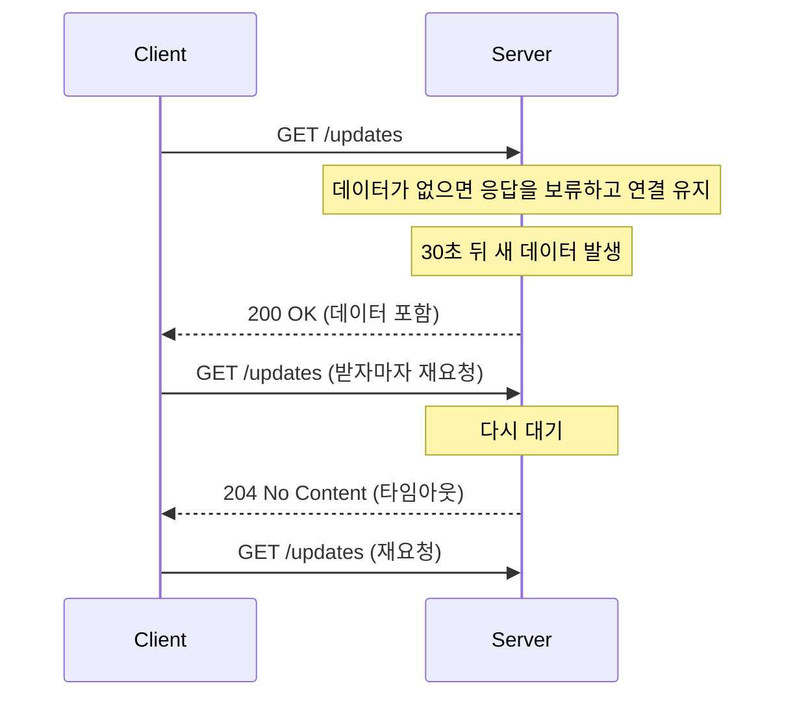

요청 하나에 응답 하나다. 응답이 나가면 그 요청은 끝나고, 다음 이벤트를 받으려면 요청을 새로 보내야 한다. 응답을 받고 재요청하는 사이에 생긴 이벤트는 서버가 따로 쌓아두지 않으면 놓친다.

### 구현 시 주의사항

서버 측에서 연결을 오래 유지하면 커넥션 풀이 고갈될 수 있다. Tomcat 같은 서블릿 컨테이너는 스레드 하나가 요청 하나를 잡고 있으므로, 동시 접속자가 많으면 스레드가 모자라는 상황이 생긴다.

타임아웃 설정도 중요하다. 서버 앞에 Nginx나 로드밸런서가 있으면 프록시 타임아웃에 걸릴 수 있다. 보통 30초 정도로 설정하고, 타임아웃되면 클라이언트가 재연결하는 구조로 만든다.

### Spring 구현 예제

```java
@RestController
public class LongPollingController {

    private final Map<String, DeferredResult<ResponseEntity<String>>> waitingClients
            = new ConcurrentHashMap<>();

    @GetMapping("/poll")
    public DeferredResult<ResponseEntity<String>> poll(@RequestParam String clientId) {
        // 30초 타임아웃 설정
        DeferredResult<ResponseEntity<String>> result = new DeferredResult<>(30000L);

        result.onTimeout(() -> {
            waitingClients.remove(clientId);
            result.setResult(ResponseEntity.noContent().build());
        });

        result.onCompletion(() -> waitingClients.remove(clientId));

        waitingClients.put(clientId, result);
        return result;
    }

    // 새 데이터가 생기면 대기 중인 클라이언트에게 전달
    public void pushMessage(String clientId, String message) {
        DeferredResult<ResponseEntity<String>> result = waitingClients.get(clientId);
        if (result != null) {
            result.setResult(ResponseEntity.ok(message));
        }
    }
}
```

`DeferredResult`를 사용하면 서블릿 스레드를 바로 반환하면서 응답은 나중에 보낼 수 있다. 스레드 풀 고갈 문제를 줄이는 핵심이다.

## Chunked Transfer-Encoding

### 동작 방식

HTTP/1.1에서 도입된 전송 방식이다. 응답의 전체 크기를 미리 알 수 없을 때, 데이터를 조각(chunk)으로 나눠서 보낸다. `Content-Length` 헤더 대신 `Transfer-Encoding: chunked` 헤더를 사용한다.

```http
HTTP/1.1 200 OK
Transfer-Encoding: chunked

7\r\n
Hello, \r\n
6\r\n
World!\r\n
0\r\n
\r\n
```

각 chunk는 `크기(16진수)\r\n데이터\r\n` 형식이다. 크기가 0인 chunk가 전송 종료를 의미한다.

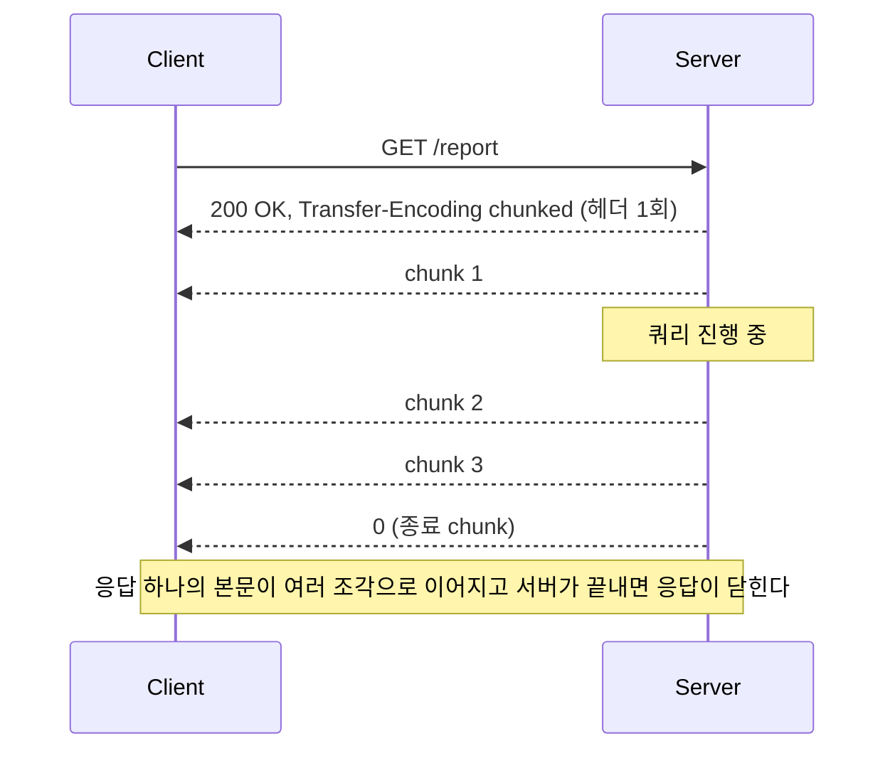

### 스트리밍에 활용

Chunked Transfer-Encoding 자체가 실시간 통신 프로토콜은 아니다. 원래 목적은 큰 파일이나 동적 콘텐츠를 점진적으로 전송하는 것이다. 서버가 chunk를 천천히 보내면 스트리밍처럼 동작하고, HTTP/1.1에서 SSE 응답이 이 방식으로 나간다. HTTP/2에는 chunked 가 없고 DATA 프레임이 같은 역할을 한다.

Nginx 같은 리버스 프록시가 chunk를 모았다가 한꺼번에 내보내는 문제는 [프록시 버퍼링](#프록시-버퍼링으로-스트림이-막히는-구조)에서 따로 다룬다.

## Server-Sent Events (SSE)

### 동작 방식

SSE는 서버에서 클라이언트로 단방향 스트리밍을 위한 표준이다. HTTP 위에서 동작하며 별도의 프로토콜 업그레이드가 필요 없다. 서버가 `text/event-stream` 콘텐츠 타입으로 응답하면, 브라우저의 `EventSource` API가 이를 처리한다.

```http
HTTP/1.1 200 OK
Content-Type: text/event-stream
Cache-Control: no-cache
Connection: keep-alive

data: 첫 번째 메시지

event: notification
data: {"type": "alert", "message": "서버 점검"}

id: 3
data: 세 번째 메시지
```

각 이벤트는 빈 줄(`\n\n`)로 구분한다. `data:` 필드가 실제 데이터이고, `event:` 필드로 이벤트 타입을 지정할 수 있다. `id:` 필드는 재연결 시 마지막으로 받은 이벤트를 서버에 알려주는 용도다.

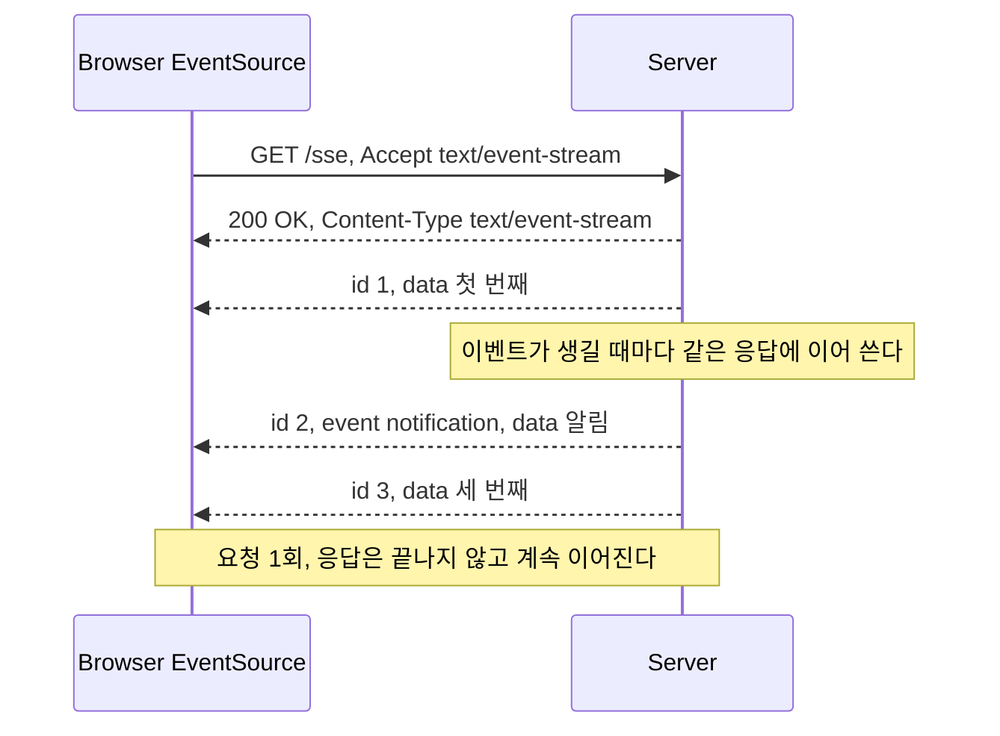

Long Polling과 달리 응답이 닫히지 않는다. 이벤트마다 요청-응답이 새로 생기지 않아서 이벤트 사이의 공백이 없다.

### 자동 재연결

SSE의 큰 장점은 연결이 끊어지면 브라우저가 자동으로 재연결을 시도한다는 점이다. 서버가 `retry:` 필드로 재연결 간격(밀리초)을 지정할 수 있다.

```http
retry: 5000
data: 5초 후 재연결하도록 설정
```

재연결할 때 브라우저는 `Last-Event-ID` 헤더에 마지막으로 받은 `id` 값을 보낸다. 서버는 이를 확인해서 놓친 이벤트부터 다시 보내주면 된다.

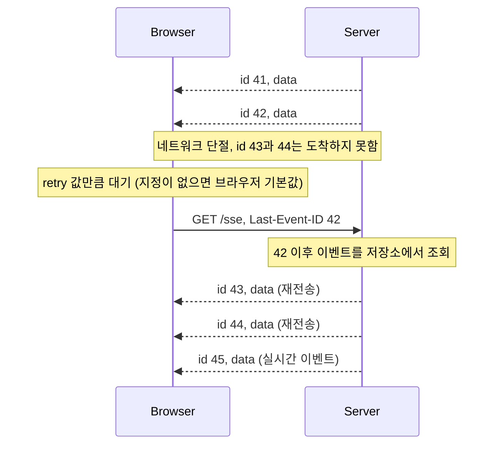

`Last-Event-ID`는 서버가 이벤트를 보관하고 있어야 쓸모가 있다. 메모리에서 바로 브로드캐스트만 하는 구조면 헤더를 받아도 43, 44를 되돌려줄 곳이 없다. 이벤트 ID를 단조 증가하는 값으로 부여하고, 최근 N분치를 Redis Stream이나 DB에 두고 `id > Last-Event-ID` 조건으로 읽는 구조가 흔하다.

재연결 헤더는 브라우저가 자동 재연결할 때만 붙는다. 코드에서 `new EventSource(url)`을 새로 만들면 `Last-Event-ID`가 가지 않는다. 직접 재연결하는 경로(탭 복귀 등)에서는 쿼리 파라미터로 마지막 ID를 넘기는 처리가 따로 필요하다. 이 부분은 [모바일 백그라운드 전환](#모바일-백그라운드-전환과-연결-유지)에서 코드로 본다.

### Spring 구현 예제

```java
@RestController
public class SseController {

    private final CopyOnWriteArrayList<SseEmitter> emitters = new CopyOnWriteArrayList<>();

    @GetMapping(value = "/sse", produces = MediaType.TEXT_EVENT_STREAM_VALUE)
    public SseEmitter subscribe() {
        SseEmitter emitter = new SseEmitter(60_000L); // 60초 타임아웃

        emitters.add(emitter);
        emitter.onCompletion(() -> emitters.remove(emitter));
        emitter.onTimeout(() -> emitters.remove(emitter));
        emitter.onError(e -> emitters.remove(emitter));

        return emitter;
    }

    // 이벤트를 모든 구독자에게 전달
    public void broadcast(String eventName, Object data) {
        List<SseEmitter> deadEmitters = new ArrayList<>();

        emitters.forEach(emitter -> {
            try {
                emitter.send(SseEmitter.event()
                        .name(eventName)
                        .data(data, MediaType.APPLICATION_JSON));
            } catch (IOException e) {
                deadEmitters.add(emitter);
            }
        });

        emitters.removeAll(deadEmitters);
    }
}
```

`SseEmitter`의 타임아웃은 서블릿 컨테이너의 비동기 타임아웃과 맞춰야 한다. Spring Boot에서는 `spring.mvc.async.request-timeout` 설정과 `SseEmitter` 생성자의 타임아웃 값이 다르면 예상치 못한 연결 종료가 발생한다.

### Express 구현 예제

```javascript
const express = require('express');
const app = express();

const clients = new Set();

app.get('/sse', (req, res) => {
    res.writeHead(200, {
        'Content-Type': 'text/event-stream',
        'Cache-Control': 'no-cache',
        'Connection': 'keep-alive'
    });

    // 연결 직후 초기 데이터 전송
    res.write('retry: 5000\n\n');

    clients.add(res);

    req.on('close', () => {
        clients.delete(res);
    });
});

function broadcast(event, data) {
    const message = `event: ${event}\ndata: ${JSON.stringify(data)}\n\n`;
    clients.forEach(client => client.write(message));
}
```

Node.js는 이벤트 루프 기반이라 연결을 오래 유지해도 스레드를 점유하지 않는다. Long Polling이나 SSE 구현에 유리한 이유다.

IE는 SSE를 지원하지 않는다. polyfill 라이브러리를 사용하거나, IE 지원이 필요하면 Long Polling으로 대체해야 한다.

## 동시 연결 제한과 HTTP/2

### HTTP/1.1은 오리진당 6연결

HTTP/1.1에서 브라우저는 같은 오리진(호스트+포트)에 동시에 6개까지만 TCP 연결을 연다. SSE는 연결 하나를 계속 붙잡고 있으므로 6개 중 하나가 영구히 사라진다. 같은 오리진으로 탭을 여섯 개 열면 일곱 번째 탭의 SSE는 연결 시도조차 못 하고 대기한다. 이 한도는 탭마다 따로 세는 게 아니라 브라우저 전체에서 오리진 기준으로 합산한다.

증상이 헷갈린다. 탭 몇 개까지는 정상인데 어느 순간부터 새 탭의 API 호출까지 pending 상태로 멈춘다. SSE가 슬롯을 다 먹은 탓에 일반 XHR/fetch 요청이 줄을 서는 것이다. 서버 로그에는 아무것도 찍히지 않아서 서버 문제로 오해하기 쉽다.

### HTTP/2에서는 스트림 수가 한도다

HTTP/2는 연결 하나에 스트림을 여러 개 올린다. SSE 연결 하나는 스트림 하나가 된다. 6연결 제한이 사라지는 대신 서버가 `SETTINGS_MAX_CONCURRENT_STREAMS`로 광고한 값이 새 한도가 된다. RFC 9113은 이 값을 100 이상으로 두라고 권고하고, Nginx의 `http2_max_concurrent_streams` 기본값은 128이다.

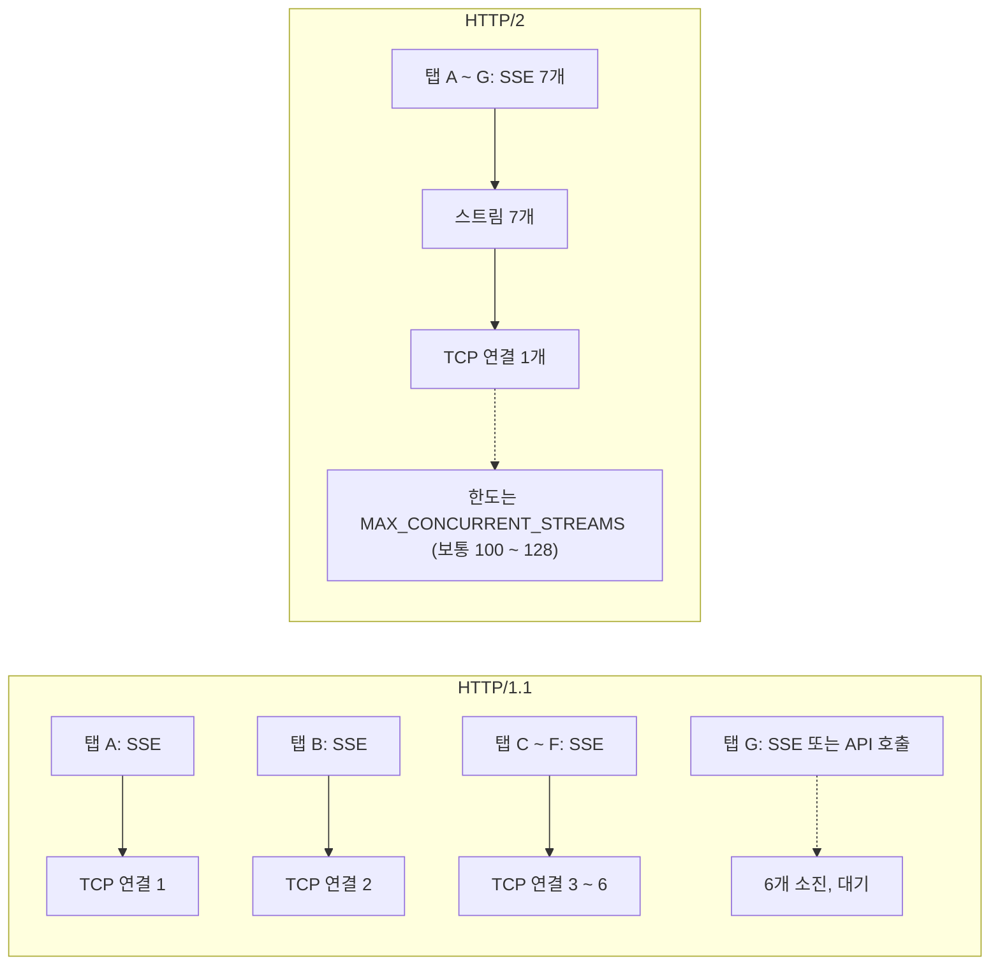

다만 HTTP/2는 클라이언트와 프록시 구간의 얘기다. 일반적인 `proxy_pass` 설정에서 Nginx는 업스트림과 HTTP/1.1로 통신한다. 클라이언트 쪽 스트림 100개는 업스트림 쪽 커넥션 100개로 풀린다. 앱 서버의 최대 연결 수, 파일 디스크립터 한도, Nginx의 `worker_connections`(클라이언트와 업스트림 양쪽을 각각 센다)를 같이 봐야 한다.

HTTP/2로 바꿨는데도 SSE 연결이 안 늘어나는 경우는 대부분 프록시나 로드밸런서가 HTTP/1.1로 내려 보내고 있는 것이다. 브라우저 개발자 도구의 Protocol 열이 `h2`인지 먼저 확인한다.

### HTTP/1.1을 못 벗어날 때

탭 간에 SSE를 하나만 공유하는 방법이 있다. `SharedWorker`에서 `EventSource`를 하나 열고 각 탭에 `postMessage`로 나눠주거나, `BroadcastChannel`과 리더 선출(Web Locks API)로 한 탭만 연결을 유지하게 만든다. 서브도메인을 나눠 오리진을 늘리는 방법도 있지만 CORS와 쿠키 설정이 따라와서 마지막 수단이다.

## 모바일 백그라운드 전환과 연결 유지

앱이나 브라우저가 백그라운드로 가면 OS가 네트워크와 CPU를 제한한다. iOS는 앱이 백그라운드로 내려간 뒤 수 초에서 수십 초 안에 일반 소켓 작업을 중단시킨다. Android는 Doze와 App Standby 상태에서 네트워크 접근을 막는다. 모바일 브라우저는 백그라운드 탭의 타이머를 늦추고, 메모리가 모자라면 탭을 통째로 버린다. SSE든 WebSocket이든 장시간 연결은 이 영향을 그대로 받는다.

문제는 끊김을 클라이언트가 모를 수 있다는 점이다. 연결이 정상적으로 닫히지 않고 반쯤 죽은 채 남으면(half-open) `EventSource`는 `error` 이벤트를 내지 않고 `readyState`가 `OPEN`으로 남는다. 서버는 이미 그 연결을 정리했는데 화면에는 "연결됨"으로 보이고 이벤트는 오지 않는다.

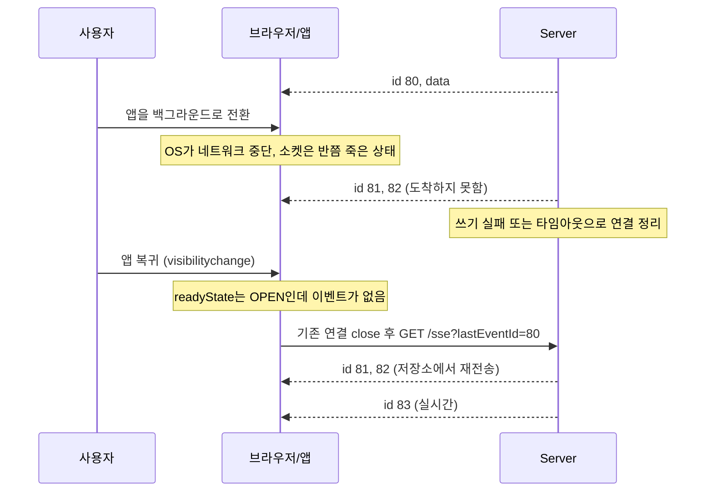

대응은 세 가지를 같이 건다.

서버가 15~30초마다 주석 줄(`: ping\n\n`)을 보낸다. 주석은 `EventSource`가 무시하지만 연결이 살아 있다는 신호가 되고, 프록시의 idle timeout도 막아준다. 클라이언트는 일정 시간 아무것도 못 받으면 연결이 죽었다고 보고 직접 닫고 다시 연다. 탭이나 앱이 포그라운드로 돌아오는 순간에도 같은 처리를 한다.

```javascript
let es;
let lastId = null;
let watchdog;

function connect() {
    if (es) es.close();
    const url = lastId
        ? `/sse?lastEventId=${encodeURIComponent(lastId)}`
        : '/sse';
    es = new EventSource(url);

    es.onmessage = (e) => {
        lastId = e.lastEventId;
        armWatchdog();
        render(e.data);
    };
    armWatchdog();
}

function armWatchdog() {
    clearTimeout(watchdog);
    // 서버 ping 주기(20초)의 두 배 넘게 조용하면 죽은 연결로 본다
    watchdog = setTimeout(connect, 45_000);
}

document.addEventListener('visibilitychange', () => {
    if (document.visibilityState === 'visible') connect();
});
```

직접 `connect()`를 부르는 경로에서는 `Last-Event-ID` 헤더가 붙지 않으므로 서버가 `lastEventId` 쿼리 파라미터도 같이 읽어야 한다. 헤더와 쿼리 둘 다 받는 핸들러를 만들어 두는 게 편하다.

세 번째는 한계를 인정하는 것이다. 앱이 오래 백그라운드에 있는 동안 연결을 붙들어 둘 수는 없다. 그 시간에 발생한 알림은 FCM/APNs 같은 푸시로 보내고, 복귀했을 때 SSE를 다시 열면서 놓친 이벤트를 `lastEventId` 이후로 조회한다. 실시간 연결은 포그라운드용, 백그라운드는 푸시로 역할을 나누는 구조가 안정적이다.

복귀하는 사용자가 한꺼번에 재연결하는 시간대(출근 시간, 알림 발송 직후)가 있다. 클라이언트에 지수 백오프와 jitter를 넣지 않으면 서버로 요청이 몰린다. 이 문제는 [비정상 종료 패턴 분석](#비정상-종료-패턴-분석)에서 다시 본다.

## 프록시 버퍼링으로 스트림이 막히는 구조

로컬에서는 이벤트가 즉시 오는데 배포하면 한참 조용하다가 한꺼번에 도착하는 경우가 있다. 앱 서버 문제가 아니라 클라이언트와 앱 사이에 있는 장비 중 하나가 응답을 모으고 있어서다.

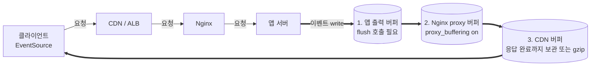

버퍼는 세 곳에 있고 하나라도 막으면 스트림은 멈춘다. 번호는 응답이 지나가는 순서다.

1번은 앱 자체다. Spring `SseEmitter.send()`는 내부에서 flush 하지만, Express는 `compression` 미들웨어가 응답을 모아서 압축하기 때문에 `res.flush()`를 직접 불러야 한다. 서블릿 필터나 Gzip 설정이 응답 전체를 감싸는 경우도 같다.

2번이 가장 흔하다. Nginx는 `proxy_buffering`이 기본 `on`이라 업스트림 응답을 `proxy_buffers`(기본 8개)에 모은다. 이벤트 한 건이 수백 바이트면 버퍼가 차는 데 이벤트가 수십 개 쌓여야 하고, 그 전까지 클라이언트는 아무것도 못 받는다. 이벤트 간격이 길면 "몇 분 조용하다가 한꺼번에 도착"하는 증상으로 나타난다.

```nginx
location /sse {
    proxy_pass http://backend;
    proxy_http_version 1.1;
    proxy_set_header Connection "";
    proxy_buffering off;
    proxy_cache off;
    gzip off;
    proxy_read_timeout 3600s;
}
```

`proxy_buffering off`는 location 단위 설정이다. 앱 팀이 Nginx 설정을 못 건드리는 상황이라면 응답 헤더 `X-Accel-Buffering: no`로 해당 응답만 버퍼링을 끌 수 있다. Nginx가 이 헤더를 보면 그 응답에 한해 `proxy_buffering off`와 같이 동작한다.

```java
@GetMapping(value = "/sse", produces = MediaType.TEXT_EVENT_STREAM_VALUE)
public ResponseEntity<SseEmitter> subscribe() {
    SseEmitter emitter = new SseEmitter(0L);
    return ResponseEntity.ok()
            .header("X-Accel-Buffering", "no")
            .header("Cache-Control", "no-cache")
            .body(emitter);
}
```

Express에서는 `res.setHeader('X-Accel-Buffering', 'no')`를 `writeHead` 전에 호출한다. 헤더 방식은 Nginx가 그 헤더를 무시하도록 `proxy_ignore_headers X-Accel-Buffering`가 걸려 있으면 안 먹는다. 안 먹는 것 같으면 `nginx -T`로 실제 적용된 설정부터 본다.

`proxy_read_timeout` 기본값은 60초다. 이벤트 간격이 60초보다 길면 Nginx가 업스트림이 죽었다고 보고 504로 끊는다. 주기적인 ping 주석으로 간격을 줄이거나 타임아웃을 늘려야 한다.

3번은 Nginx 앞단이다. 응답이 `text/event-stream`이어도 CDN이 응답 완료를 기다리거나 압축하느라 모을 수 있다. CloudFront, Cloudflare 같은 서비스는 캐시·압축 동작을 경로 단위로 바꿀 수 있으니 SSE 경로는 캐시 비활성화와 압축 제외로 둔다. 안 되면 실시간 경로를 CDN 밖으로 빼는 쪽이 낫다. ALB는 응답을 모으지는 않지만 `idle_timeout` 기본 60초에 걸린다.

## WebSocket과 HTTP Upgrade

WebSocket 자체의 프로토콜 동작, 프레임 구조, 하트비트, 인증 처리는 [WebSocket](../../../Protocol/WebSocket.md)에서 다룬다. Nginx 앞에 WebSocket 서버를 둘 때의 Upgrade 헤더 전달과 타임아웃 설정은 [WebSocket 프록시](../../../../WebServer/Nginx/Web_Socket_Proxy.md)에 정리돼 있다. 이 절에서는 HTTP 스트리밍 방식과 비교하는 데 필요한 부분만 본다.

### HTTP Upgrade 메커니즘

WebSocket은 HTTP와 다른 프로토콜이지만, 연결 수립은 HTTP를 통해 이루어진다. 클라이언트가 HTTP 요청에 `Upgrade: websocket` 헤더를 포함하면, 서버가 `101 Switching Protocols` 응답으로 프로토콜을 전환한다.

```http
GET /ws HTTP/1.1
Host: example.com
Upgrade: websocket
Connection: Upgrade
Sec-WebSocket-Key: dGhlIHNhbXBsZSBub25jZQ==
Sec-WebSocket-Version: 13
```

```http
HTTP/1.1 101 Switching Protocols
Upgrade: websocket
Connection: Upgrade
Sec-WebSocket-Accept: s3pPLMBiTxaQ9kYGzzhZRbK+xOo=
```

이 핸드셰이크가 완료되면 HTTP 연결이 WebSocket 연결로 전환된다. 이후부터는 HTTP가 아니라 WebSocket 프레임 단위로 양방향 통신이 이루어진다.

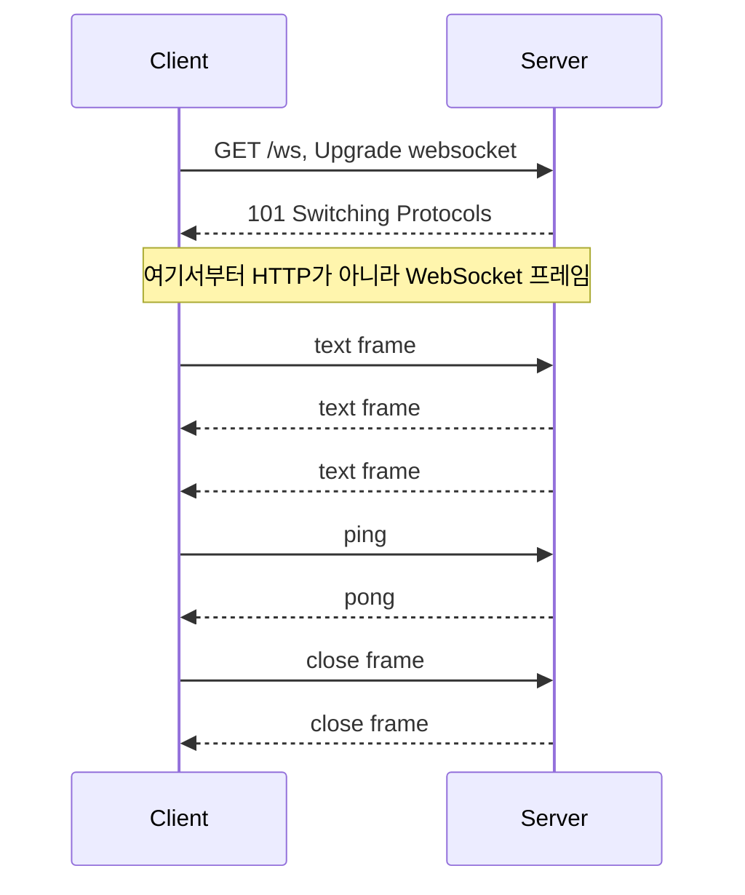

요청 1회, 응답(101) 1회가 끝나면 같은 TCP 연결에서 양쪽이 아무 때나 프레임을 보낸다. SSE와 달리 클라이언트가 서버로 보내는 메시지에도 요청-응답 짝이 필요 없다.

### SSE와의 차이

WebSocket은 양방향 통신이다. 클라이언트와 서버 모두 자유롭게 메시지를 보낼 수 있다. SSE는 서버에서 클라이언트 방향만 가능하다. 클라이언트가 서버로 데이터를 보내려면 별도의 HTTP 요청을 사용해야 한다.

WebSocket은 바이너리 데이터도 전송할 수 있다. SSE는 텍스트만 가능하다. 이미지나 파일 같은 바이너리를 실시간으로 주고받아야 하면 WebSocket이 맞다.

### 프록시 환경에서의 차이

WebSocket은 `Upgrade`와 `Connection` 헤더를 프록시가 업스트림으로 그대로 넘겨줘야 연결된다. SSE는 일반 HTTP 응답이라 이런 설정이 필요 없고, 대신 위에서 본 버퍼링이 문제가 된다. Nginx 설정 예시와 `proxy_read_timeout` 기본값 60초로 유휴 연결이 끊기는 문제는 [WebSocket 프록시](../../../../WebServer/Nginx/Web_Socket_Proxy.md)를 본다.

AWS ALB는 WebSocket을 기본 지원하지만, Classic Load Balancer는 지원하지 않는다. Classic ELB 환경이면 TCP 모드로 설정하거나 ALB로 변경해야 한다.

## HTTP/2 Server Push와 103 Early Hints

### Server Push의 본래 목적

HTTP/2 명세(RFC 7540)에 포함됐던 기능이다. 서버가 클라이언트의 요청을 처리하면서, 클라이언트가 곧 요청할 것으로 예상되는 리소스를 미리 푸시하는 동작이다. 예를 들어 `/index.html`을 요청받으면 서버가 그 안에서 참조하는 `/style.css`, `/app.js`를 클라이언트가 요청하기 전에 보내버린다.

내부적으로는 `PUSH_PROMISE` 프레임으로 동작한다. 서버가 푸시할 리소스의 헤더를 미리 알리고, 별도 스트림에 응답 본문을 실어서 보낸다. 이론적으로는 RTT 한 번을 절감할 수 있다.

```
클라이언트 → 서버: GET /index.html
서버 → 클라이언트: PUSH_PROMISE (/style.css)
서버 → 클라이언트: PUSH_PROMISE (/app.js)
서버 → 클라이언트: 200 OK /index.html
서버 → 클라이언트: 200 OK /style.css (푸시)
서버 → 클라이언트: 200 OK /app.js (푸시)
```

### 왜 사실상 폐기됐는가

기대만큼 성능이 나오지 않았다. 가장 큰 문제는 서버가 클라이언트의 캐시 상태를 모른다는 점이다. 사용자가 이미 `/style.css`를 캐시에 가지고 있어도 서버는 그걸 알 길이 없으니 또 푸시한다. 캐시 적중률이 높은 정적 리소스에서는 오히려 대역폭 낭비가 된다.

`Cache-Digest` 같은 표준이 보완책으로 논의됐지만 결국 채택되지 않았다. 그리고 푸시한 리소스가 클라이언트의 우선순위 큐와 충돌해서 진짜 필요한 리소스의 다운로드를 늦추는 경우도 있었다. Chrome 팀이 실제 트래픽을 분석한 결과 First Contentful Paint 개선 효과가 거의 없거나 오히려 악화되는 사례가 많았다.

Chrome은 106 버전(2022년 9월)에서 HTTP/2 Server Push 지원을 제거했다. Firefox도 비슷한 시기에 기본 비활성화 상태로 전환했다. 명세 자체가 RFC 9113에서는 빠졌다.

### 대체 수단인 103 Early Hints

`103 Early Hints`(RFC 8297)는 비슷한 목적을 다른 방식으로 푼다. 서버가 본 응답을 만들기 전에 임시 응답으로 미리 힌트만 보낸다. 클라이언트는 이 힌트를 보고 리소스를 직접 요청한다. 푸시가 아니라 사전 통지다.

```http
HTTP/1.1 103 Early Hints
Link: </style.css>; rel=preload; as=style
Link: </app.js>; rel=preload; as=script

HTTP/1.1 200 OK
Content-Type: text/html
...
```

서버가 DB 쿼리를 기다리는 동안 `103`을 먼저 보내면, 클라이언트는 그 시간에 정적 리소스를 다운로드한다. 캐시 상태는 클라이언트가 판단하므로 푸시의 단점이 없다. CloudFront, Cloudflare, Fastly가 이 기능을 지원하고, Chrome도 103 버전부터 지원한다.

Spring에서는 아직 표준 API가 없다. 직접 응답을 조작해야 하는데, 보통 CDN/리버스 프록시 단에서 처리하는 게 현실적이다. Cloudflare는 일정 조건에서 자동으로 `Link` 헤더를 보고 `103`을 생성해준다.

## WebTransport

### HTTP/3 위의 새로운 양방향 통신

WebTransport는 HTTP/3(QUIC) 위에서 동작하는 양방향 통신 API다. 브라우저에서 사용할 수 있고, WebSocket의 후속처럼 자리잡고 있다. WebTransport over HTTP/3 명세(W3C, IETF)로 표준화 진행 중이다.

```javascript
const transport = new WebTransport('https://example.com/wt');
await transport.ready;

// 양방향 스트림
const stream = await transport.createBidirectionalStream();
const writer = stream.writable.getWriter();
await writer.write(new TextEncoder().encode('hello'));

// 데이터그램 (비신뢰 전송)
const writer2 = transport.datagrams.writable.getWriter();
await writer2.write(new Uint8Array([1, 2, 3]));
```

QUIC 연결을 맺은 뒤 HTTP/3 확장 CONNECT로 세션을 열고, 그 위에서 스트림과 데이터그램을 독립적으로 주고받는다.

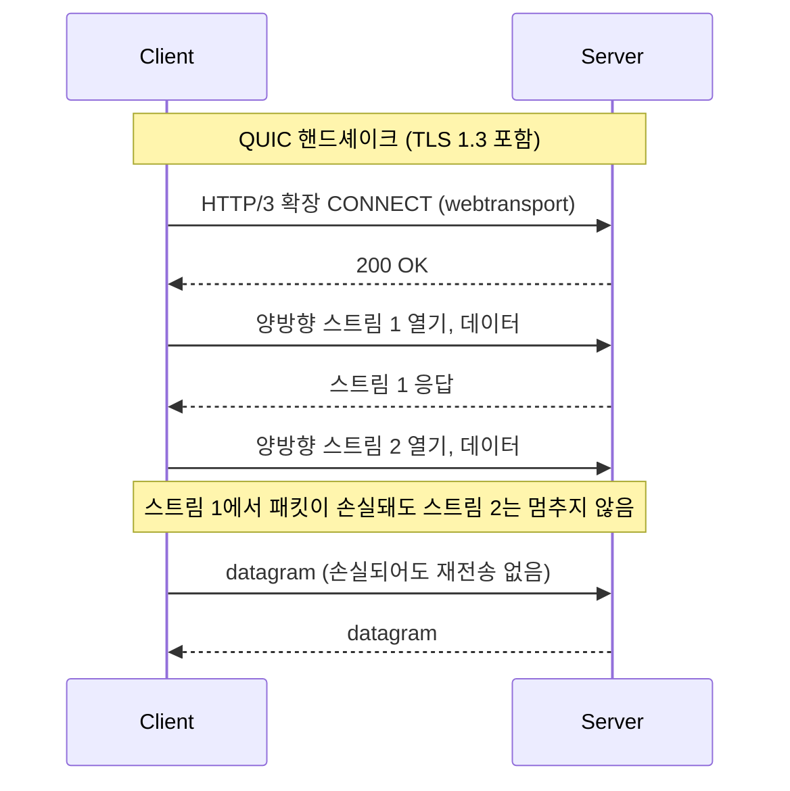

### WebSocket 대비 장점

가장 큰 차이는 헤드 오브 라인 블로킹(HoL blocking) 해소다. WebSocket은 단일 TCP 연결 위에서 동작하므로, 패킷 하나가 손실되면 그 뒤의 모든 메시지가 재전송을 기다려야 한다. 게임이나 실시간 영상 스트리밍처럼 메시지가 독립적인 경우에는 이게 큰 손해다.

WebTransport는 QUIC 위에서 동작한다. QUIC은 UDP 기반이고 스트림이 독립적으로 처리된다. 한 스트림에서 손실이 나도 다른 스트림은 영향받지 않는다. 여러 종류의 데이터를 동시에 주고받아야 할 때 유리하다.

또 하나의 차이는 데이터그램 지원이다. TCP 기반이 아니므로 비신뢰 전송 옵션이 있다. 손실되어도 재전송하지 않는 메시지를 보낼 수 있다. 게임의 위치 업데이트처럼 최신 값만 중요하고 과거 값은 의미 없는 데이터에 적합하다.

| 항목 | WebSocket | WebTransport |
|------|-----------|--------------|
| 전송 계층 | TCP | QUIC (UDP) |
| HoL 블로킹 | 발생 | 스트림 단위로 격리 |
| 스트림 다중화 | 단일 스트림 | 다중 스트림 |
| 비신뢰 전송 | 불가 | 데이터그램 지원 |
| 연결 마이그레이션 | 불가 | IP 변경 시에도 유지 |

### 현재 사용 시 제약

서버 구현이 아직 부족하다. Node.js 에는 `node:quic`(`--experimental-quic`)이 있지만 QUIC 전송과 HTTP/3 까지고 WebTransport 상위 API 는 아직 없다., Spring Boot는 정식 지원이 없다. 보통 aioquic(Python), quinn(Rust), msquic(.NET) 같은 QUIC 라이브러리 위에 직접 구현해야 한다.

브라우저는 Chromium 계열과 Firefox(114부터 기본 활성)에서 동작한다. Safari 는 아직이다. 프로덕션에서는 WebSocket으로 폴백하는 구조가 필요하다.

방화벽 환경에서 UDP가 차단되는 경우도 있다. 기업 네트워크에서 UDP 443번 포트가 막혀 있으면 WebTransport 연결 자체가 안 된다.

## LLM 응답 스트리밍 패턴

### 왜 SSE가 사실상 표준이 됐는가

ChatGPT가 등장한 이후 거의 모든 LLM API가 SSE로 토큰 스트리밍을 제공한다. 모델이 토큰 하나씩 생성하는 특성상 결과를 다 만들어서 보내면 사용자 체감 응답 속도가 너무 느리다. 토큰이 생성되는 즉시 클라이언트에 보내야 한다.

SSE는 이 시나리오에 잘 맞는다. 단방향이고, 텍스트 기반이고, HTTP 위에서 동작하니 기존 인프라와 잘 어울린다. 별도 프로토콜 협상 없이 그냥 `text/event-stream` 응답이면 된다.

### OpenAI 응답 형식

OpenAI Chat Completions API는 `stream: true` 옵션을 주면 SSE로 응답한다. 형식이 표준 SSE와 약간 다른 부분이 있다.

```http
data: {"id":"...","object":"chat.completion.chunk","choices":[{"delta":{"content":"안"}}]}

data: {"id":"...","object":"chat.completion.chunk","choices":[{"delta":{"content":"녕"}}]}

data: {"id":"...","object":"chat.completion.chunk","choices":[{"delta":{"content":"하"}}]}

data: [DONE]
```

각 `data:` 줄에 JSON이 들어 있고, `delta.content`에 토큰이 담긴다. 마지막에 `data: [DONE]`이 종료자 역할을 한다. 표준 SSE에는 없는 OpenAI 고유 컨벤션이다.

```javascript
async function streamChat(messages) {
    const res = await fetch('https://api.openai.com/v1/chat/completions', {
        method: 'POST',
        headers: {
            'Authorization': `Bearer ${API_KEY}`,
            'Content-Type': 'application/json'
        },
        body: JSON.stringify({
            model: 'gpt-4',
            messages,
            stream: true
        })
    });

    const reader = res.body.getReader();
    const decoder = new TextDecoder();
    let buffer = '';

    while (true) {
        const { done, value } = await reader.read();
        if (done) break;

        buffer += decoder.decode(value, { stream: true });
        const lines = buffer.split('\n');
        buffer = lines.pop(); // 마지막 줄은 잘릴 수 있으므로 보관

        for (const line of lines) {
            if (!line.startsWith('data: ')) continue;
            const data = line.slice(6);
            if (data === '[DONE]') return;

            const chunk = JSON.parse(data);
            const token = chunk.choices[0]?.delta?.content;
            if (token) process.stdout.write(token);
        }
    }
}
```

`TextDecoder`에 `stream: true` 옵션을 주는 게 중요하다. UTF-8 멀티바이트 문자가 청크 경계에서 잘리는 경우, 이 옵션이 없으면 깨진 문자가 나온다. 한국어, 이모지 같은 다바이트 문자에서 자주 발생하는 버그다.

청크 경계가 SSE 메시지 경계와 일치한다는 보장이 없다. 한 줄이 두 청크에 걸쳐서 도착할 수 있으므로 마지막 부분 줄을 버퍼에 남겨두는 처리가 필요하다.

### Anthropic 응답 형식

Anthropic Messages API는 좀 더 풍부한 이벤트 타입을 사용한다. 표준 SSE의 `event:` 필드를 활용한다.

```http
event: message_start
data: {"type":"message_start","message":{"id":"msg_...","role":"assistant"}}

event: content_block_start
data: {"type":"content_block_start","index":0,"content_block":{"type":"text","text":""}}

event: content_block_delta
data: {"type":"content_block_delta","index":0,"delta":{"type":"text_delta","text":"안녕"}}

event: content_block_stop
data: {"type":"content_block_stop","index":0}

event: message_stop
data: {"type":"message_stop"}
```

이벤트 타입을 보고 처리 분기를 만들어야 한다. tool_use, thinking 같은 별도 콘텐츠 블록 타입도 있고, 최근에는 캐시 관련 이벤트도 추가됐다. 단순히 `delta.text`만 뽑아 쓰면 새 기능이 추가됐을 때 놓친다.

### 중간 끊김 시 재시도 방법

LLM 스트리밍에서 가장 까다로운 부분이다. 모바일 환경에서 와이파이가 끊기거나, 프록시가 idle timeout으로 연결을 끊는 경우가 자주 있다. 일반 SSE처럼 `Last-Event-ID`로 재개할 수가 없다. LLM은 같은 입력에도 다른 출력을 내기 때문이다.

실무에서는 보통 세 가지 방법 중 하나를 쓴다.

첫째, 처음부터 재시작하고 사용자에게 표시한다. 가장 단순하고 확실하다. "응답 생성 중 오류가 발생했습니다. 다시 생성합니다." 같은 안내를 띄우고 같은 프롬프트로 새 요청을 보낸다.

둘째, 받은 토큰까지를 assistant 메시지로 컨텍스트에 추가하고 "계속 작성해주세요"로 이어 받는다. 토큰을 절약할 수 있지만 자연스러움이 떨어지는 경우가 있다.

```python
async def stream_with_retry(messages, max_retries=2):
    accumulated = ""
    for attempt in range(max_retries):
        try:
            current_messages = messages.copy()
            if accumulated:
                current_messages.append({"role": "assistant", "content": accumulated})
                current_messages.append({"role": "user", "content": "이어서 작성해주세요"})

            async with client.messages.stream(messages=current_messages, ...) as stream:
                async for text in stream.text_stream:
                    accumulated += text
                    yield text
            return
        except (httpx.ReadTimeout, httpx.RemoteProtocolError) as e:
            if attempt == max_retries - 1:
                raise
            await asyncio.sleep(2 ** attempt)
```

셋째, 서버 측에서 응답을 다 받은 뒤 클라이언트로 재전송하는 구조로 만든다. LLM 응답은 서버 DB에 저장하고, 클라이언트 끊김과 무관하게 백엔드에서는 끝까지 받는다. 클라이언트는 재접속하면 저장된 응답을 다시 스트리밍받는다. 토큰 비용이 가장 안정적이지만 인프라 복잡도가 올라간다.

## 백프레셔 처리

### 클라이언트가 느릴 때 일어나는 일

서버가 SSE로 초당 1000개의 이벤트를 보내는데 클라이언트가 100개밖에 처리하지 못한다고 가정하자. 차이만큼은 어딘가에 쌓인다. 처음에는 TCP 송신 버퍼에 쌓이고, 그게 차면 OS가 서버 애플리케이션의 `write()`를 블록하거나 버퍼링한다.

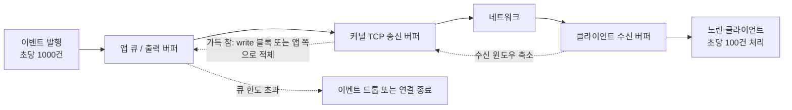

차이만큼이 오른쪽에서 왼쪽으로 거꾸로 쌓여 올라온다. 클라이언트가 읽지 않으면 수신 윈도우가 줄고, 송신 버퍼가 차고, 마지막에 앱의 큐나 힙이 부풀어 오른다. 앱 큐에 한도를 두지 않으면 이 줄의 끝은 OOM이다.

문제는 서버 애플리케이션이 이걸 인지하지 못하는 경우다. `SseEmitter.send()`나 `res.write()`가 정상 반환됐다고 데이터가 클라이언트에 도착했다는 뜻이 아니다. 메모리 어딘가에 적재된 것뿐이다.

장시간 누적되면 OOM으로 서비스가 죽는다. 특히 서버가 모든 클라이언트에게 같은 이벤트를 브로드캐스트하는 구조에서 자주 본다. 클라이언트 100개 중 1개만 느려도 그 1개에 대한 큐가 무한정 커진다.

### Spring SseEmitter의 한계

`SseEmitter.send()`는 동기적으로 응답 스트림에 쓴다. 내부적으로 서블릿 컨테이너의 출력 버퍼에 쓰는데, 클라이언트가 느리면 이 호출이 블록된다. 비동기 스레드에서 호출하지 않으면 이벤트 발행 스레드가 묶인다.

기본 `ConcurrentHashMap` 같은 구조에 emitter를 보관하고 일괄 전송하는 코드는 위험하다. emitter 하나가 느리면 전체 발행 스레드가 멈춘다.

```java
@Service
public class SseBroadcaster {

    private final Map<String, BlockingQueue<Object>> queues = new ConcurrentHashMap<>();
    private final Map<String, SseEmitter> emitters = new ConcurrentHashMap<>();
    private static final int MAX_QUEUE_SIZE = 100;

    public SseEmitter subscribe(String clientId) {
        SseEmitter emitter = new SseEmitter(0L);
        BlockingQueue<Object> queue = new LinkedBlockingQueue<>(MAX_QUEUE_SIZE);

        emitters.put(clientId, emitter);
        queues.put(clientId, queue);

        // 클라이언트별 전용 스레드에서 큐를 소비
        Thread.startVirtualThread(() -> {
            try {
                while (!Thread.currentThread().isInterrupted()) {
                    Object event = queue.take();
                    emitter.send(event);
                }
            } catch (Exception e) {
                emitter.completeWithError(e);
            } finally {
                cleanup(clientId);
            }
        });

        return emitter;
    }

    public void publish(String clientId, Object event) {
        BlockingQueue<Object> queue = queues.get(clientId);
        if (queue == null) return;

        // offer는 큐가 가득 차면 false를 반환하고 이벤트를 버린다
        if (!queue.offer(event)) {
            // 느린 클라이언트는 강제 종료하거나 이벤트 드롭
            log.warn("Slow consumer detected: {}", clientId);
            cleanup(clientId);
        }
    }
}
```

큐 크기를 제한하고, 가득 차면 이벤트를 버리거나 클라이언트 연결을 강제 종료한다. 무엇을 선택할지는 데이터 성격에 따라 다르다. 알림처럼 일부 누락이 허용되면 드롭, 정합성이 중요하면 연결 종료 후 클라이언트가 다시 조회하도록 유도한다.

### Node.js Writable Stream

Node.js의 `res.write()`는 false를 반환할 수 있다. 내부 버퍼(`highWaterMark` 기본 16KB)가 가득 찼다는 뜻이다. 이 신호를 무시하고 계속 write하면 메모리에 쌓인다.

```javascript
function sendEvent(res, data) {
    const message = `data: ${JSON.stringify(data)}\n\n`;
    const ok = res.write(message);

    if (!ok) {
        // 버퍼가 비워질 때까지 대기
        return new Promise(resolve => res.once('drain', resolve));
    }
    return Promise.resolve();
}

async function broadcast(data) {
    for (const client of clients) {
        await sendEvent(client.res, data);
    }
}
```

다만 `await`로 직렬 처리하면 한 클라이언트의 느림이 전체를 막는다. 클라이언트별로 큐를 두고 독립 처리하는 게 맞다. 또는 `pipeline()`이나 `Readable.from()` 같은 스트림 API를 활용해서 백프레셔를 자동으로 전파시킨다.

### WebSocket의 bufferedAmount

WebSocket에는 `bufferedAmount`라는 속성이 있다. 클라이언트(브라우저) 측에서 아직 전송되지 않고 큐에 남아 있는 바이트 수다. 서버 측 라이브러리도 비슷한 정보를 노출한다.

```javascript
ws.on('message', (msg) => {
    if (ws.bufferedAmount > 1024 * 1024) {
        // 1MB 이상 적체되면 메시지 발행 중단 또는 연결 종료
        ws.close(1009, 'Buffer overflow');
        return;
    }
    ws.send(processedMsg);
});
```

브로드캐스트 시점마다 `bufferedAmount`를 확인해서 임계치를 넘는 클라이언트는 제외하거나 끊는다.

## 모니터링

### 수집해야 할 메트릭

장시간 연결을 유지하는 SSE/WebSocket은 일반 REST API와 모니터링 포인트가 다르다. 단순한 응답 시간이나 처리량 메트릭으로는 문제를 잡기 어렵다.

| 메트릭 | 의미 | 임계치 예시 |
|--------|------|------------|
| 활성 연결 수 | 현재 유지 중인 연결 | 인스턴스당 최대치 대비 80% |
| 메시지 처리량 | 초당 발행/수신 메시지 수 | 평소 대비 ±50% |
| 비정상 종료율 | 서버 오류로 끊긴 비율 | 5분간 1% 초과 시 알림 |
| 연결 지속 시간 | 평균 연결 유지 시간 | 평소보다 짧아지면 안정성 저하 의심 |
| 백프레셔 큐 깊이 | 클라이언트별 적체 메시지 수 | 큐 크기의 50% 이상 |

Spring Boot에서는 Micrometer로 노출한다.

```java
@Component
public class SseMetrics {

    private final AtomicInteger activeConnections = new AtomicInteger(0);
    private final Counter messagesSent;
    private final Counter abnormalClosures;

    public SseMetrics(MeterRegistry registry) {
        registry.gauge("sse.connections.active", activeConnections);
        this.messagesSent = registry.counter("sse.messages.sent");
        this.abnormalClosures = registry.counter("sse.connections.abnormal_close");
    }

    public void onConnect() { activeConnections.incrementAndGet(); }
    public void onDisconnect(boolean abnormal) {
        activeConnections.decrementAndGet();
        if (abnormal) abnormalClosures.increment();
    }
}
```

### ALB access log에서 SSE/WebSocket 식별

AWS ALB access log를 보면 일반 요청과 스트리밍 연결을 구분하기가 헷갈린다. 몇 가지 패턴이 있다.

SSE 응답은 `target_status_code`가 200이지만 `request_processing_time`이 비정상적으로 길다(수십 초 ~ 수 분). `received_bytes`는 작고 `sent_bytes`는 메시지 양에 비례한다. URL 경로로 구분하는 게 가장 확실하다(`/sse`, `/events` 같은 경로 컨벤션).

WebSocket은 `elb_status_code`가 101이거나, 연결이 끊길 때 `target_processing_time`에 전체 연결 유지 시간이 기록된다. ALB 로그에서 101 응답을 찾으면 WebSocket 핸드셰이크 시점이고, 종료 시점은 같은 `trace_id`로 추적해야 한다.

```
# SSE 패턴 예시 (CSV 일부)
http 2026-04-29T10:15:23 ... 200 200 0 245678 "GET /sse?... HTTP/1.1" ...
                                           ↑ sent_bytes만 큼
# 처리 시간 필드가 길게 찍힌다 (예: 60.234)
```

### Nginx access_log 식별

Nginx도 비슷하다. `$body_bytes_sent`, `$request_time` 두 변수를 보면 된다. 일반 API는 `$request_time`이 수백 ms 이내인데 SSE/WebSocket은 분 단위다.

WebSocket 연결의 정상 종료는 `499`(클라이언트가 먼저 끊음)이나 `200`으로 찍힌다. `502`, `504`가 자주 나오면 백엔드에 문제가 있는 것이다. `proxy_read_timeout` 설정값을 확인해야 한다.

별도 access_log 포맷을 만들어두면 분석이 쉽다.

```nginx
log_format streaming '$remote_addr $request_time $upstream_response_time '
                     '$status $body_bytes_sent "$http_user_agent" '
                     '"$http_upgrade"';

location /ws/ {
    access_log /var/log/nginx/streaming.log streaming;
    proxy_pass http://backend;
    ...
}
```

`$http_upgrade` 값이 `websocket`이면 WebSocket 요청이고, `text/event-stream` Accept 헤더면 SSE다. 별도 로그로 분리해두면 일반 요청과 섞이지 않는다.

### 비정상 종료 패턴 분석

오랫동안 운영하다 보면 특정 시간대마다 대량의 연결이 끊기는 패턴이 보인다. 원인은 보통 인프라 쪽이다.

ALB나 Nginx의 idle timeout이 짧으면 활동 없는 SSE/WebSocket이 일정 시간마다 끊긴다. 클라이언트는 자동 재연결로 복구되니 문제를 인지하기 어렵다. 메트릭에서 활성 연결 수가 주기적으로 출렁이면 idle timeout을 의심해야 한다.

서버 배포 시점도 점검 대상이다. 롤링 업데이트 중 인스턴스 종료로 모든 연결이 한꺼번에 끊긴다. 클라이언트들이 동시에 재연결을 시도하면서 신규 인스턴스에 부하가 몰린다(thundering herd). 클라이언트 측에서 jitter를 넣은 지수 백오프로 재연결하도록 만들거나, 서버 측에서 graceful shutdown으로 일정 시간 분산해서 끊는 처리가 필요하다.

## 방식별 비교

| 항목 | Long Polling | Chunked | SSE | WebSocket | WebTransport |
|------|-------------|---------|-----|-----------|--------------|
| 양방향성 | 서버 → 클라이언트 (반대 방향은 별도 요청) | 서버 → 클라이언트 | 서버 → 클라이언트 (반대 방향은 별도 요청) | 양방향 | 양방향 (스트림과 데이터그램) |
| 요청과 응답 | 요청 1회에 응답 1회, 반복 | 요청 1회에 본문이 조각으로 이어짐 | 요청 1회에 응답이 계속 이어짐 | 요청 1회 후 101로 전환 | CONNECT 1회 후 스트림 다중화 |
| 프록시 호환 | 가장 좋음 (일반 HTTP) | 버퍼링 설정 필요 | 버퍼링 해제와 idle timeout 조정 필요 | Upgrade 헤더 전달 필요 | UDP 443 허용 필요, 대부분 미지원 |
| 재연결 | 직접 구현 (응답 직후 재요청) | 없음 (응답 종료 = 끝) | 브라우저 내장, Last-Event-ID | 직접 구현 | 직접 구현 |
| 데이터 형식 | 텍스트/바이너리 | 텍스트/바이너리 | 텍스트 | 텍스트/바이너리 | 바이너리 |
| 전송 계층 | TCP | TCP | TCP | TCP | QUIC (UDP) |
| HoL 블로킹 | 무관 | 발생 | 발생 (HTTP/2에서도 TCP 수준에서 발생) | 발생 | 스트림 단위 격리 |
| 브라우저 지원 | 모든 브라우저 | 모든 브라우저 | IE 제외 | 모든 브라우저 | Chromium과 Firefox만, Safari 미지원 |

## 실무에서 선택하는 기준

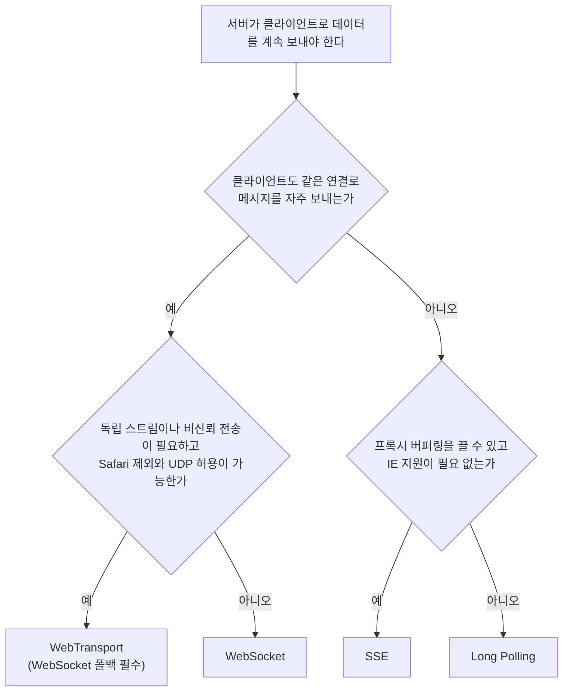

Chunked 전송은 선택지에 없다. 실시간 이벤트용이 아니라 SSE의 하위 메커니즘이고, 단발성 대용량 응답(진행률이 있는 다운로드, 큰 리포트의 점진 렌더링)에 쓴다.

분기마다 현실에서 걸리는 지점은 이렇다.

양방향 메시지가 많은 쪽은 채팅, 실시간 게임, 공동 편집이다. 이때 WebSocket을 쓴다. WebTransport는 클라우드 게임이나 영상 협업처럼 WebSocket의 HoL 블로킹이 병목이 되는 경우에 한정한다. Safari 미지원, 서버 라이브러리 부족, UDP 차단 환경 때문에 WebSocket 폴백을 같이 만들어야 해서, 안정성이 필요한 신규 서비스는 WebSocket을 기본으로 두고 WebTransport는 점진적 도입 대상으로 본다.

서버에서 클라이언트로 가는 단방향이면 SSE가 가장 단순하다. 알림, 실시간 피드, 대시보드, LLM 토큰 스트리밍이 여기에 해당한다. 클라이언트가 서버로 보낼 일은 일반 POST로 처리한다. 브라우저 내장 재연결이 있어 구현이 짧다.

Long Polling은 SSE를 쓸 수 없을 때의 대안이다. IE 지원이 필요하거나 인프라가 스트리밍 응답을 허용하지 않는 레거시 환경에서 선택하게 된다. 새 서비스에서 의도적으로 고르는 경우는 거의 없다.

## 인프라 설정 시 확인할 것

방식과 무관하게 클라이언트와 서버 사이 장비의 설정이 먼저 걸린다. Nginx/Apache는 [프록시 버퍼링](#프록시-버퍼링으로-스트림이-막히는-구조)과 타임아웃, WebSocket은 Upgrade 헤더 전달을 본다. 로드밸런서는 WebSocket 지원 여부, sticky session 필요성, idle timeout 값을 점검한다. 실시간 경로는 CDN의 캐시와 압축을 끄거나 CDN을 우회시킨다. 기업 방화벽이 WebSocket을 막는 경우도 있어서 SSE나 Long Polling으로 폴백하는 로직이 필요하고, Socket.IO 같은 라이브러리가 이 폴백을 자동으로 처리한다.
