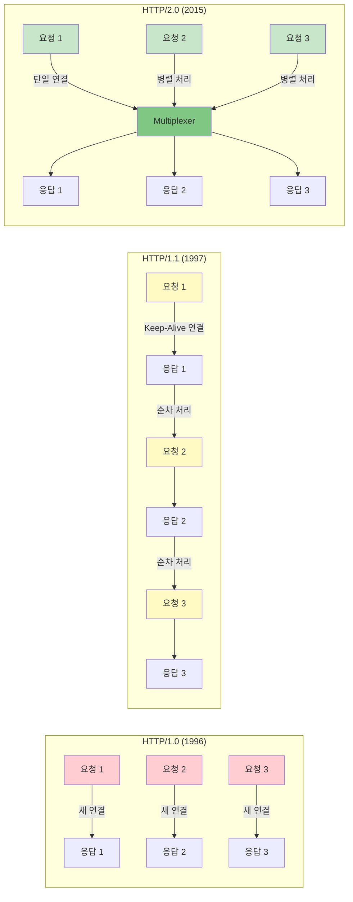
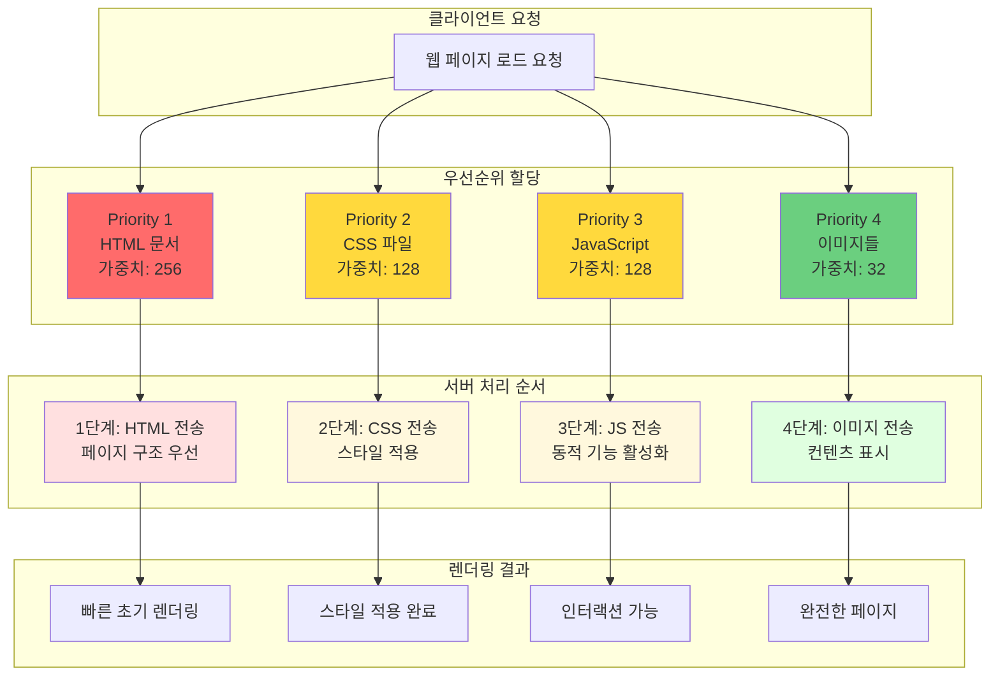
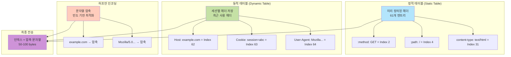
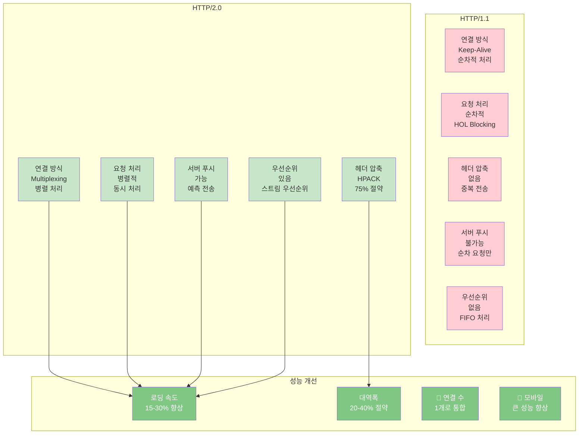

# HTTP와 HTTP 2.0

## 개요

HTTP 2.0은 HTTP 1.1의 성능 한계를 극복하기 위해 개발된 차세대 프로토콜이다.

### HTTP 2.0 주요 개선사항

**성능 향상:**
- 멀티플렉싱
- 헤더 압축
- 바이너리 프레이밍

**사용자 경험:**
- 서버 푸시
- 스트림 우선순위
- 빠른 로딩 속도

**효율성:**
- 단일 TCP 연결
- 대역폭 절약
- 리소스 최적화

### HTTP 버전별 진화

**HTTP/0.9 (1991):**
- 단순 텍스트 전송
- 메서드 GET만 지원
- HTML만 전송 가능

**HTTP/1.0 (1996):**
- 헤더 도입
- 상태 코드 추가
- 매 요청마다 새 연결

**HTTP/1.1 (1997):**
- Keep-Alive 추가
- 파이프라이닝 도입
- 하지만 순차 처리

**HTTP/2.0 (2015):**
- 멀티플렉싱
- 헤더 압축
- 서버 푸시
- 바이너리 프레이밍

**HTTP/3 (2022):**
- QUIC 프로토콜
- UDP 기반
- 더 빠른 연결

## 주요 개선사항

### Multiplexed Streams (멀티플렉싱)

하나의 TCP 연결로 여러 요청을 동시에 처리하는 기술이다.

#### HTTP 버전별 연결 방식 비교

#### 각 버전의 특징

| 버전 | 연결 방식 | 문제점 | 성능 |
|------|----------|--------|------|
| HTTP/1.0 | 매 요청마다 새 연결 | 3-Way Handshake 반복, 연결 설정 오버헤드, 자원 낭비 | 낮음 |
| HTTP/1.1 | Keep-Alive (연결 재사용) | HOL Blocking, 순차 처리 필수, 파이프라이닝 한계 | 중간 |
| HTTP/2.0 | 멀티플렉싱 (단일 연결) | 하나의 연결로 병렬 처리, Stream 기반 통신, 응답 순서 무관 | 높음 |

**실무 팁:**
HTTP/2.0은 단일 연결로 여러 요청을 병렬 처리하므로 성능이 크게 향상된다.

### HTTP/2 멀티플렉싱 구조

**통신 과정:**
1. TCP 연결 수립 (단일 TCP 연결)
2. 연결 확인
3. 병렬 스트림 처리:
   - Stream 1: HTML 요청 (우선순위: 높음)
   - Stream 2: CSS 요청 (우선순위: 중간)
   - Stream 3: JS 요청 (우선순위: 중간)
   - Stream 4: 이미지 요청 (우선순위: 낮음)
4. 병렬 응답 처리:
   - Stream 1: HTML 응답
   - Stream 2: CSS 응답
   - Stream 3: JS 응답
   - Stream 4: 이미지 응답

**특징:**
- 순서에 상관없이 응답 수신
- 대기 시간 최소화

**실무 팁:**
HTTP/2.0은 여러 요청을 병렬로 처리하므로 HOL Blocking 문제가 해결된다.

### HTTP/1.1 vs HTTP/2 성능 비교

**HTTP/1.1 (순차적 처리):**
- 요청 1: HTML → 응답 1: HTML
- 요청 2: CSS → 응답 2: CSS
- 요청 3: JS → 응답 3: JS
- 요청 4: 이미지 → 응답 4: 이미지
- 총 시간: 4 × RTT
- Head-of-Line Blocking 발생

**HTTP/2 (병렬 처리):**
- 요청 1: HTML → 응답 1: HTML
- 요청 2: CSS → 응답 2: CSS
- 요청 3: JS → 응답 3: JS
- 요청 4: 이미지 → 응답 4: 이미지
- 총 시간: 1 × RTT
- 병렬 처리로 지연 최소화

**성능 개선 효과:**
- 로딩 시간: 15-30% 단축
- 대역폭 절약: 20-40%
- 연결 수: 1개로 통합
- 모바일 환경: 큰 성능 향상

**실무 팁:**
HTTP/2.0을 사용하면 단일 연결로 여러 요청을 병렬 처리할 수 있어 성능이 크게 향상된다.

### Stream Prioritization (스트림 우선순위)

각 리소스에 우선순위를 부여하여 중요한 것부터 처리한다.

**HTTP/2 스트림 우선순위:**
- HTML 문서: 우선순위 높음 → 즉시 처리
- CSS 파일: 우선순위 중간 → HTML 완료 후 처리
- JavaScript: 우선순위 중간 → HTML 완료 후 처리
- 이미지들: 우선순위 낮음 → 다른 리소스 완료 후 처리

**처리 순서:**
1. HTML 먼저 로드
2. CSS 로드
3. JavaScript 로드
4. 이미지 로드

**사용자 경험 개선:**
- 페이지 렌더링 시작
- 스타일 적용
- 인터랙션 활성화
- 이미지 표시

**실무 팁:**
우선순위를 잘 설정하면 초기 렌더링 시간을 단축할 수 있다.

#### 우선순위 처리 메커니즘

#### 우선순위 가중치 예시

**리소스 타입별 우선순위:**
- HTML 문서: 가중치 256 (가장 높음)
- CSS 스타일: 가중치 128 (높음)
- JavaScript: 가중치 128 (높음)
- 폰트: 가중치 64 (중간)
- 이미지: 가중치 32 (낮음)

#### 우선순위 효과

| 리소스 타입 | 우선순위 | 처리 시점 | 사용자 경험 |
|------------|----------|----------|------------|
| HTML | 최고 (256) | 즉시 | 빠른 페이지 구조 표시 |
| CSS | 높음 (128) | HTML 직후 | 시각적 스타일 적용 |
| JavaScript | 높음 (128) | CSS와 병렬 | 인터랙션 활성화 |
| 폰트 | 중간 (64) | 초기 렌더링 후 | 텍스트 표시 개선 |
| 이미지 | 낮음 (32) | 마지막 | 시각적 완성도 |

### Server Push (서버 푸시)

서버가 클라이언트 요청 전에 필요한 리소스를 미리 전송한다.

#### HTTP/1.1 vs HTTP/2.0 통신 방식

**HTTP/1.1 (전통적인 방식):**
- GET /index.html → index.html 응답
- HTML 파싱 중... CSS, JS 필요 발견
- GET /style.css → style.css 응답
- GET /script.js → script.js 응답
- GET /logo.png → logo.png 응답
- 총 4번의 라운드트립, 각 RTT마다 지연 발생

**HTTP/2.0 (서버 푸시 방식):**
- GET /index.html
- 서버가 필요한 리소스 미리 예측
- index.html 응답 + PUSH: style.css + PUSH: script.js + PUSH: logo.png
- HTML 파싱 시작, 필요한 리소스 이미 도착, 즉시 렌더링 가능
- 총 1번의 라운드트립, 75% 시간 단축

#### 서버 푸시의 장점

| 항목 | HTTP/1.1 | HTTP/2.0 Server Push | 개선율 |
|------|----------|----------------------|--------|
| 라운드트립 | 4회 이상 | 1회 | 75% 감소 |
| 네트워크 지연 | 높음 (누적) | 낮음 (병렬) | 60-70% 감소 |
| 초기 로딩 | 순차적, 느림 | 즉시, 빠름 | 200-300% 향상 |
| 캐시 활용 | 요청 후 캐시 | 푸시 시 캐시 확인 | 효율적 |

#### 서버 푸시 사용 시나리오

**서버 푸시 결정 과정:**
1. 클라이언트 요청 index.html
2. 리소스 분석
3. 필수 리소스 (CSS, JavaScript) → PUSH
4. 선택 리소스 (폰트, 이미지) → 캐시 확인 후 결정

**주의사항:**
- 클라이언트에 이미 캐시된 리소스는 푸시하지 않기
- 우선순위가 낮은 리소스는 푸시 제외
- 대용량 파일은 신중하게 판단

**실무 팁:**
서버 푸시는 항상 필요한 리소스에만 사용한다. 과도한 푸시는 오히려 성능을 저하시킬 수 있다.

### Header Compression (헤더 압축)

HPACK 알고리즘으로 중복 헤더를 압축하여 대역폭을 절약한다.

#### HTTP/1.1 헤더의 문제점

**HTTP/1.1 - 매 요청마다 전체 헤더 전송:**
- 요청 1 (800 bytes): Host, User-Agent, Accept, Cookie 등
- 요청 2 (800 bytes): 동일한 헤더 반복
- 요청 3 (800 bytes): 동일한 헤더 반복
- 총 2400 bytes (중복 전송)

#### HTTP/2.0 HPACK 압축

**HTTP/2.0 - HPACK 압축 사용:**
- 요청 1 (800 bytes): 전체 헤더 전송, 헤더 테이블에 저장
- 요청 2 (50 bytes): 압축된 헤더, 인덱스만 참조
- 요청 3 (50 bytes): 압축된 헤더, 인덱스만 참조
- 총 900 bytes (63% 절약)

**실무 팁:**
HPACK 압축으로 헤더 크기를 크게 줄일 수 있다. 특히 쿠키가 큰 경우 효과가 크다.

#### HPACK 압축 메커니즘

#### 압축 효과 비교

#### 헤더 테이블 동작 원리

| 요청 | 전송 내용 | 크기 | 설명 |
|------|----------|------|------|
| 1 | 전체 헤더 | 800B | 동적 테이블에 저장 |
| 2 | 인덱스: 2,3,4,5 | 50B | 테이블 참조 |
| 3 | 인덱스: 2,3,4,5 | 50B | 테이블 참조 |
| 4 | 인덱스: 2,3,4,5 + 변경사항 | 80B | 차이만 추가 |
| 5 | 인덱스: 2,3,4,5,6 | 55B | 새 인덱스 참조 |

#### HPACK의 주요 장점

- 정적 테이블: 자주 사용하는 헤더는 미리 정의
- 동적 테이블: 세션별로 사용자 정의 헤더 캐싱
- 허프만 코딩: 문자열을 효율적으로 압축
- 차등 인코딩: 변경된 부분만 전송
- 보안 강화: 압축으로 인한 정보 노출 최소화

## 전체 성능 비교

### 기능별 상세 비교

### 실제 성능 측정 데이터

| 측정 항목 | HTTP/1.1 | HTTP/2.0 | 개선율 |
|----------|----------|----------|--------|
| 페이지 로딩 시간 | 3.2초 | 2.1초 | 34% 단축 |
| 요청당 대역폭 | 800 bytes/req | 200 bytes/req | 75% 절약 |
| 동시 연결 수 | 6-8개 | 1개 | 87% 감소 |
| 네트워크 왕복 | 15-20 RTT | 4-6 RTT | 70% 감소 |
| CPU 사용량 | 높음 | 중간 | 20% 감소 |
| 모바일 (3G) | 5.8초 | 3.2초 | 45% 단축 |

### 시나리오별 성능 향상

**데스크톱 (광대역):**
- HTTP/1.1: 로딩 3.2초
- HTTP/2.0: 로딩 2.1초
- 34% 향상

**모바일 (4G):**
- HTTP/1.1: 로딩 4.5초
- HTTP/2.0: 로딩 2.8초
- 38% 향상

**모바일 (3G):**
- HTTP/1.1: 로딩 5.8초
- HTTP/2.0: 로딩 3.2초
- 45% 향상

**느린 네트워크:**
- HTTP/1.1: 로딩 8.5초
- HTTP/2.0: 로딩 4.2초
- 51% 향상

**실무 팁:**
모바일 환경에서 HTTP/2.0의 성능 향상 효과가 더 크다. 네트워크가 느릴수록 효과가 커진다.

## 마이그레이션 가이드

### HTTP/2.0 도입 장점

**기술적 장점:**
- 자동 네고시에이션
- 하위 호환성 보장
- 투명한 업그레이드
- 점진적 적용 가능

**비즈니스 이점:**
- 사용자 경험 향상
- 이탈률 감소
- SEO 개선
- 모바일 최적화

**운영 효율:**
- 서버 부하 감소
- 대역폭 비용 절감
- 인프라 효율화
- 모니터링 개선

### 적용 고려사항

**필수 요구사항:**
- HTTPS 필수 (TLS 1.2 이상)
- 서버 지원 (Nginx 1.9.5+, Apache 2.4.17+)
- 브라우저 지원 (Chrome 43+, Firefox 36+, Safari 9+)

**최적화 고려사항:**
- 리소스 번들링: 불필요할 수 있음
- 도메인 샤딩: 제거 권장
- 인라인 리소스: 재검토 필요

**모니터링 항목:**
- 로딩 시간
- TTFB
- 연결 상태
- 서버 푸시 효과

**실무 팁:**
HTTP/2.0은 HTTPS가 필수다. SSL/TLS 인증서를 먼저 설정한다.

## 요약

### HTTP/2.0의 주요 기술

**멀티플렉싱:**
- 단일 연결로 병렬 처리
- HOL Blocking 해결

**헤더 압축:**
- HPACK으로 75% 대역폭 절약

**서버 푸시:**
- 예측적 리소스 전송으로 RTT 75% 감소

**스트림 우선순위:**
- 중요 리소스 우선 처리로 UX 개선

### 적용 권장사항

1. 즉시 적용: 사용자 경험이 중요한 모든 웹 애플리케이션
2. 우선 적용: 모바일 트래픽 비중이 높은 서비스
3. 점진적 적용: 레거시 시스템은 단계적 마이그레이션
4. 모니터링 필수: 실시간 성능 메트릭 수집 및 분석

**실무 팁:**
HTTP/2.0은 대부분의 현대 웹 애플리케이션에서 필수다. 성능 향상 효과가 크다. HTTPS가 필수 요구사항이다.