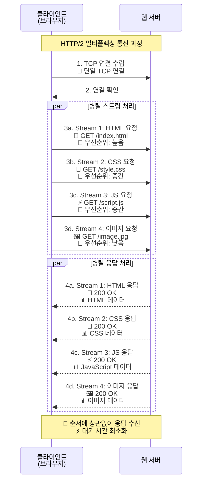
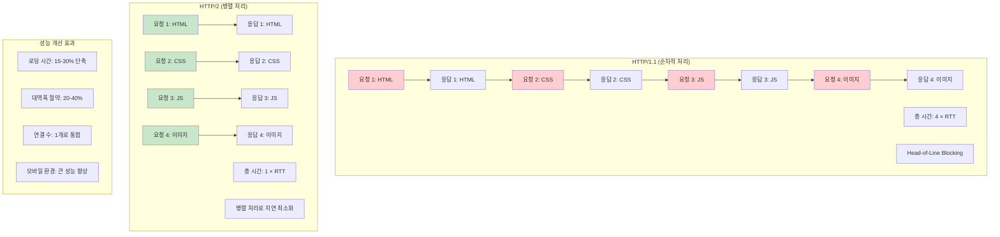
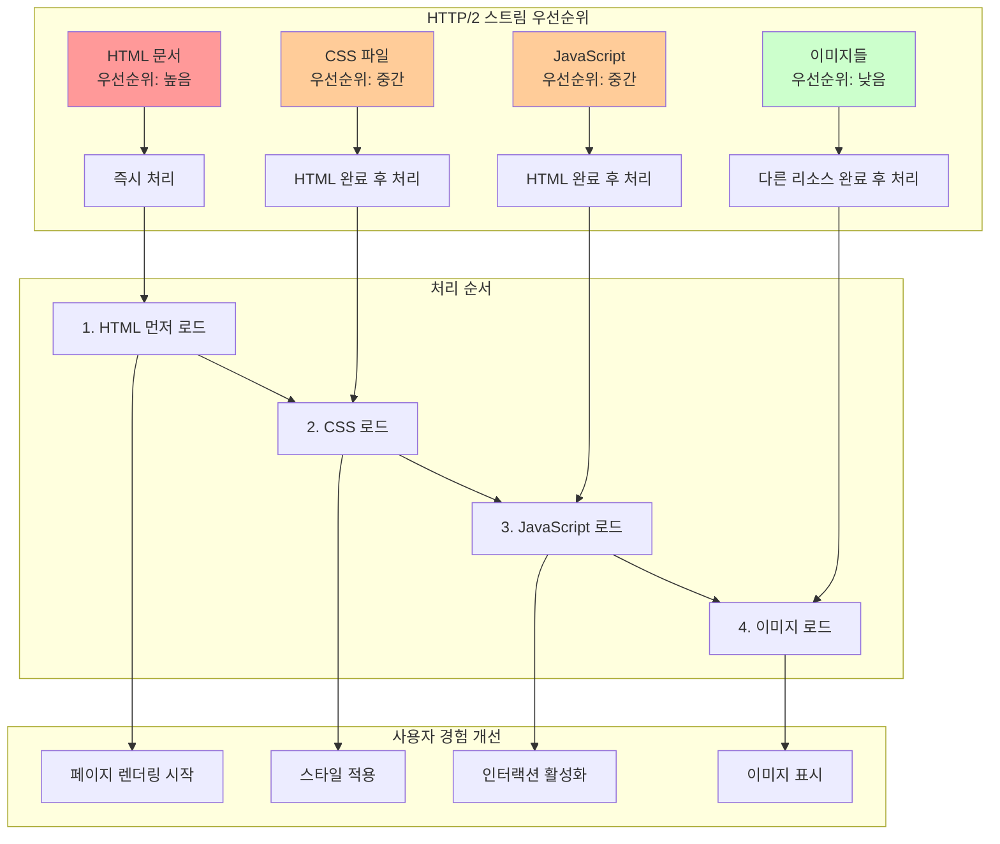

# HTTP와 HTTP 2.0


## 개요

HTTP 2.0은 HTTP 1.1의 성능 한계를 극복하기 위해 개발된 프로토콜입니다. 가장 큰 개선점은 **속도 향상**으로, 헤더 압축, 멀티플렉싱, 서버 푸시 등의 기술을 통해 웹 성능을 크게 향상시켰습니다.

## 주요 개선사항

### 1. Multiplexed Streams (멀티플렉싱)

**HTTP 1.0의 문제점**
- 매 요청마다 새로운 TCP 연결을 생성하여 성능 저하 발생
- 연결 설정 오버헤드가 크고 자원 낭비

**HTTP 1.1의 개선**
- Keep-Alive를 통한 연결 재사용으로 일부 문제 해결
- 하지만 여전히 순차적 요청 처리로 인한 지연 발생

**HTTP 2.0의 해결책**
- **단일 TCP 연결**로 여러 요청을 동시에 처리
- **Stream**을 통해 요청을 병렬로 처리
- 순서에 상관없이 응답을 받을 수 있어 대기 시간 단축

### HTTP/2 멀티플렉싱 구조



### HTTP/1.1 vs HTTP/2 성능 비교



### 스트림 우선순위 처리



### 2. Stream Prioritization (스트림 우선순위)

**개념**
- 각 요청에 **우선순위(Priority)**를 부여
- 중요한 리소스를 먼저 처리하여 사용자 경험 향상

**실제 예시**
```
요청 순서: HTML 문서 → CSS 파일 → JavaScript → 이미지들
우선순위: HTML(높음) → CSS(중간) → JS(중간) → 이미지(낮음)
```

**효과**
- HTML 문서를 먼저 받아 렌더링 시작
- 이미지가 먼저 와도 의미가 없으므로 효율적인 리소스 배분
- 페이지 로딩 시간 단축

### 3. Server Push (서버 푸시)

**기존 방식 (HTTP 1.1)**
1. 클라이언트가 HTML 요청
2. 서버가 HTML 응답
3. 클라이언트가 HTML 파싱 후 CSS, JS, 이미지 요청
4. 서버가 각각 응답

**HTTP 2.0 Server Push**
1. 클라이언트가 HTML 요청
2. 서버가 HTML과 함께 **예상되는 리소스들을 미리 푸시**
3. 클라이언트가 HTML 파싱할 때 이미 필요한 리소스들이 준비됨

**장점**
- **라운드트립 시간 단축**: 추가 요청 없이 리소스 확보
- **네트워크 지연 감소**: 예측적 리소스 전송
- **사용자 경험 향상**: 페이지 로딩 속도 개선

### 4. Header Compression (헤더 압축)

**HTTP 1.1의 문제점**
- 매 요청마다 동일한 헤더 정보를 반복 전송
- 쿠키, User-Agent 등 중복 데이터로 인한 대역폭 낭비

**HTTP 2.0의 해결책**
- **HPACK 압축 알고리즘** 사용
- 허프만 코딩 기반의 효율적인 압축
- 이전 요청과의 차이점만 전송하여 대역폭 절약

**압축 효과**
```
HTTP 1.1: 매 요청마다 전체 헤더 전송 (예: 800 bytes)
HTTP 2.0: 차이점만 전송 (예: 50 bytes)
절약률: 약 94% 대역폭 절약
```

## 성능 비교

| 항목 | HTTP 1.1 | HTTP 2.0 |
|------|----------|----------|
| 연결 방식 | Keep-Alive | Multiplexing |
| 요청 처리 | 순차적 | 병렬적 |
| 헤더 압축 | 없음 | HPACK |
| 서버 푸시 | 불가능 | 가능 |
| 우선순위 | 없음 | 있음 |

## 실제 성능 향상

- **페이지 로딩 시간**: 15-30% 단축
- **대역폭 사용량**: 20-40% 절약
- **동시 연결 수**: 1개로 통합 (연결 오버헤드 감소)
- **모바일 환경**: 특히 큰 성능 향상

## 마이그레이션 고려사항

### 장점
- **자동 적용**: 대부분의 현대 브라우저에서 지원
- **하위 호환성**: HTTP 1.1과 완전 호환
- **투명한 업그레이드**: 클라이언트/서버 설정만으로 적용 가능

### 주의사항
- **HTTPS 필수**: 대부분의 브라우저에서 HTTP 2.0을 HTTPS에서만 지원
- **서버 설정**: 웹서버(nginx, Apache) 설정 필요
- **모니터링**: 새로운 프로토콜에 대한 성능 모니터링 필요

## 결론

HTTP 2.0은 웹 성능을 획기적으로 개선한 프로토콜입니다. 멀티플렉싱, 서버 푸시, 헤더 압축 등의 기술을 통해 사용자 경험을 크게 향상시키며, 현대 웹 애플리케이션의 필수 기술로 자리잡았습니다.