# 🌐 HTTP와 HTTP 2.0

## 📌 개요

> **HTTP 2.0**은 HTTP 1.1의 성능 한계를 극복하기 위해 개발된 차세대 프로토콜입니다.

### 🎯 핵심 개선사항

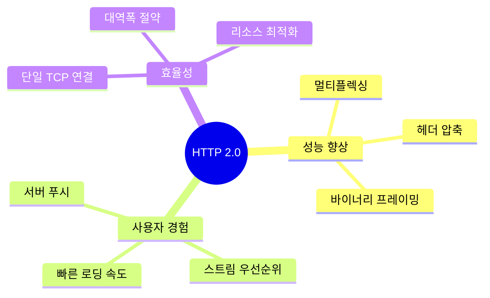

### 📊 HTTP 버전별 진화

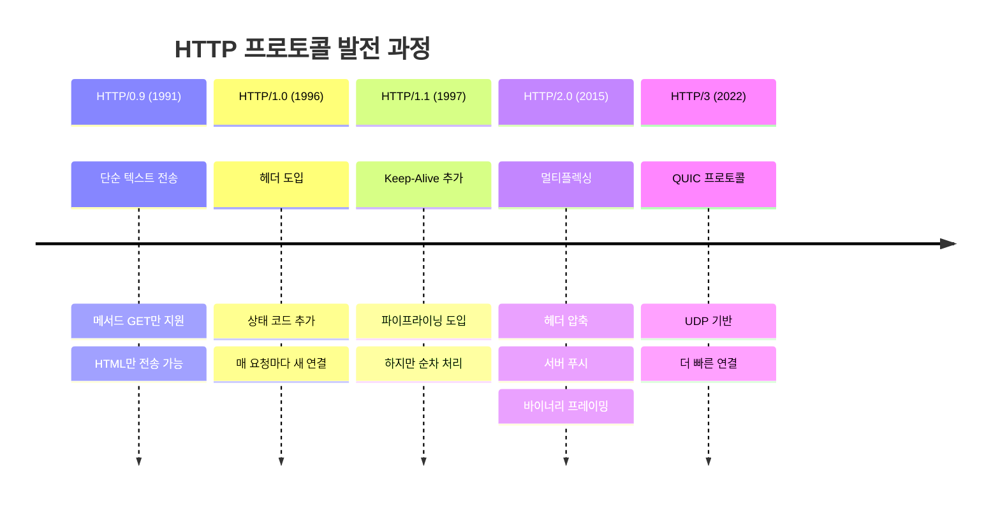

## 🚀 주요 개선사항

### 1️⃣ Multiplexed Streams (멀티플렉싱)

> 💡 **핵심 개념**: 하나의 TCP 연결로 여러 요청을 동시에 처리하는 기술

#### 📜 HTTP 버전별 연결 방식 비교

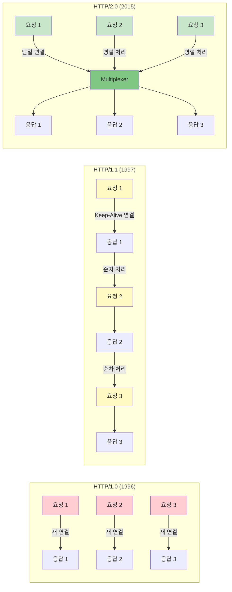

#### 🔍 각 버전의 특징

| 버전 | 연결 방식 | 문제점 | 성능 |
|------|----------|--------|------|
| 🔴 **HTTP/1.0** | 매 요청마다 새 연결 | • 3-Way Handshake 반복<br/>• 연결 설정 오버헤드<br/>• 자원 낭비 | ⭐ |
| 🟡 **HTTP/1.1** | Keep-Alive (연결 재사용) | • HOL Blocking<br/>• 순차 처리 필수<br/>• 파이프라이닝 한계 | ⭐⭐⭐ |
| 🟢 **HTTP/2.0** | 멀티플렉싱 (단일 연결) | • 하나의 연결로 병렬 처리<br/>• Stream 기반 통신<br/>• 응답 순서 무관 | ⭐⭐⭐⭐⭐ |

### HTTP/2 멀티플렉싱 구조

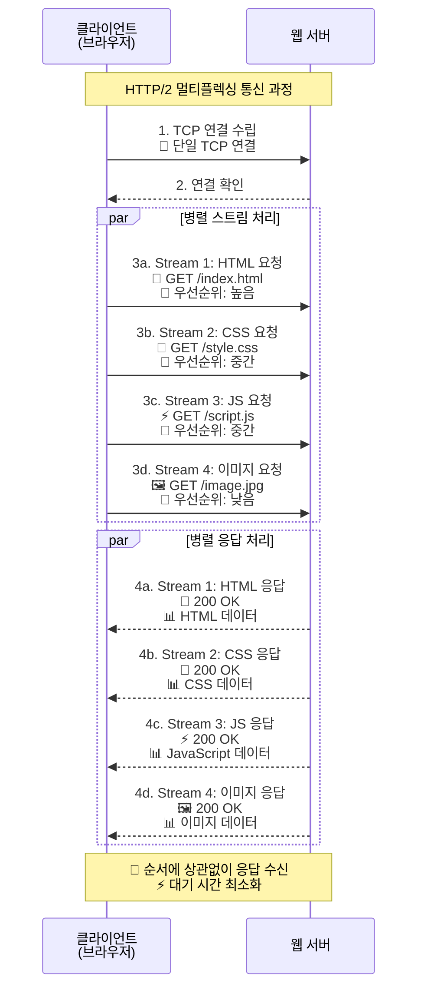

### HTTP/1.1 vs HTTP/2 성능 비교

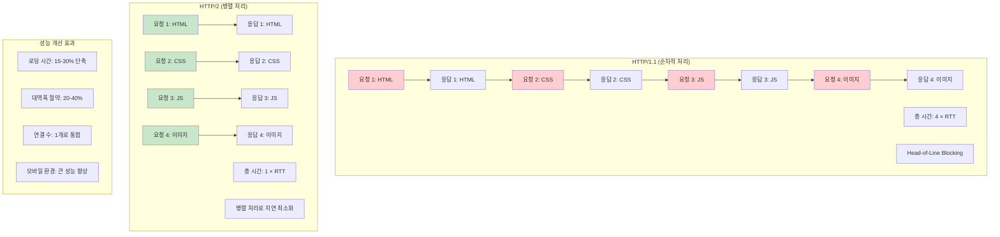

### 스트림 우선순위 처리

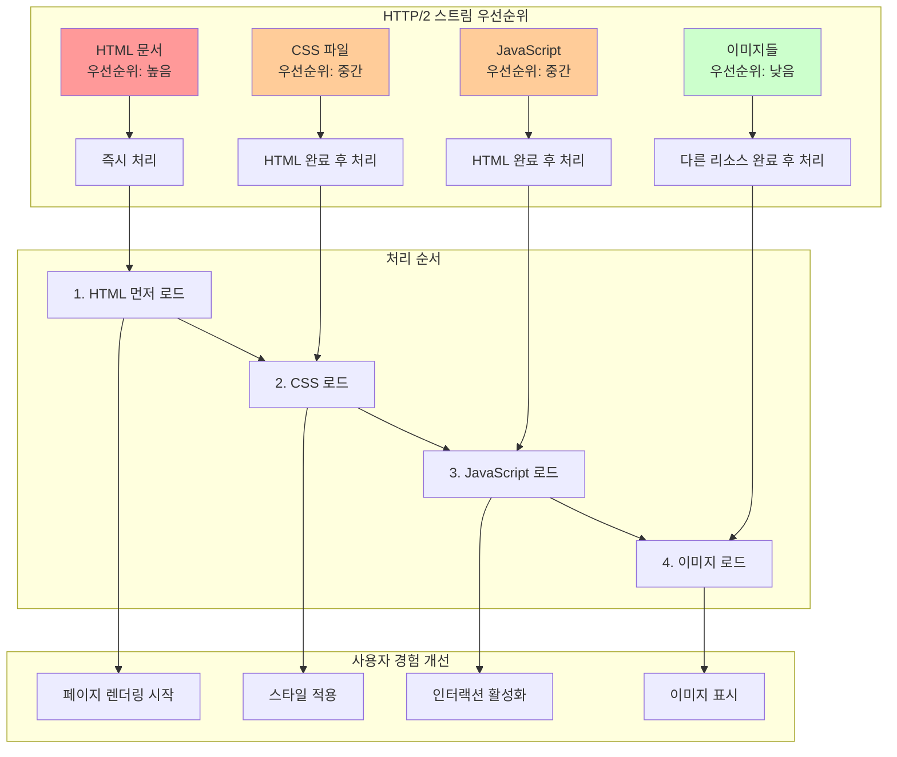

### 2️⃣ Stream Prioritization (스트림 우선순위)

> 💡 **핵심 개념**: 각 리소스에 우선순위를 부여하여 중요한 것부터 처리

#### 🎯 우선순위 처리 메커니즘

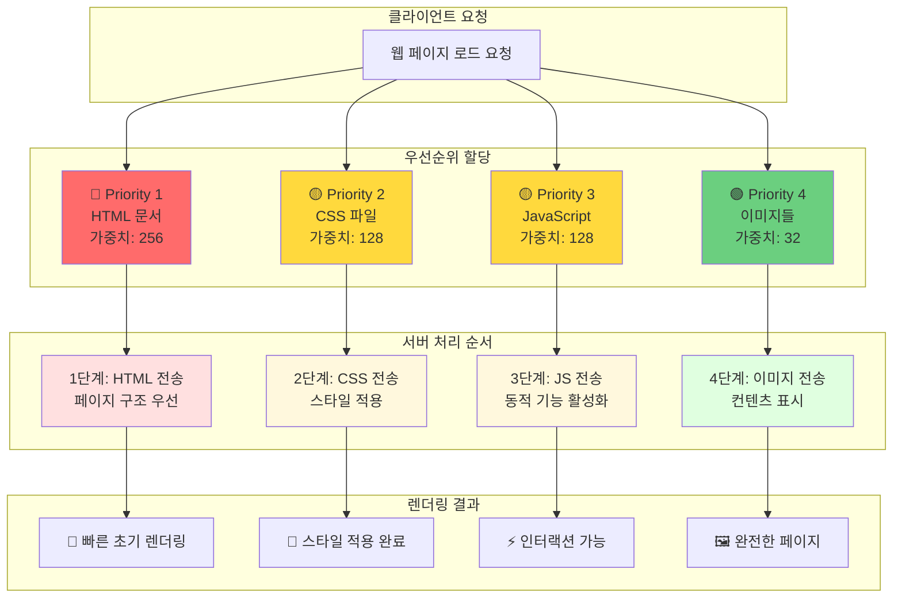

#### 📊 우선순위 가중치 예시

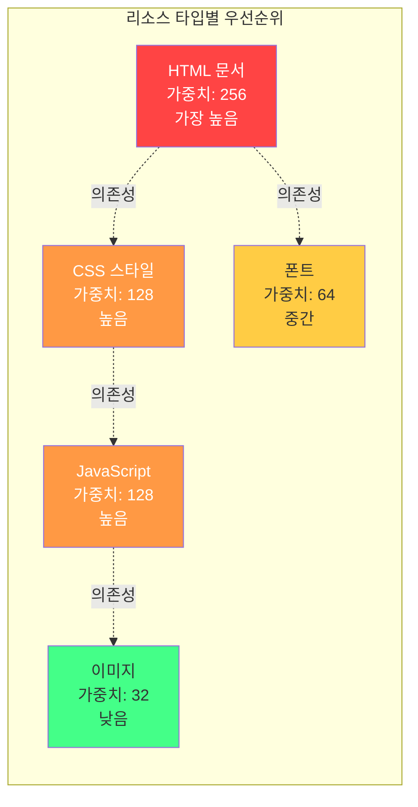

#### ✅ 우선순위 효과

| 리소스 타입 | 우선순위 | 처리 시점 | 사용자 경험 |
|------------|----------|----------|------------|
| 🔴 **HTML** | 최고 (256) | 즉시 | 빠른 페이지 구조 표시 |
| 🟠 **CSS** | 높음 (128) | HTML 직후 | 시각적 스타일 적용 |
| 🟡 **JavaScript** | 높음 (128) | CSS와 병렬 | 인터랙션 활성화 |
| 🟢 **폰트** | 중간 (64) | 초기 렌더링 후 | 텍스트 표시 개선 |
| 🔵 **이미지** | 낮음 (32) | 마지막 | 시각적 완성도 |

### 3️⃣ Server Push (서버 푸시)

> 💡 **핵심 개념**: 서버가 클라이언트 요청 전에 필요한 리소스를 미리 전송

#### 🔄 HTTP/1.1 vs HTTP/2.0 통신 방식

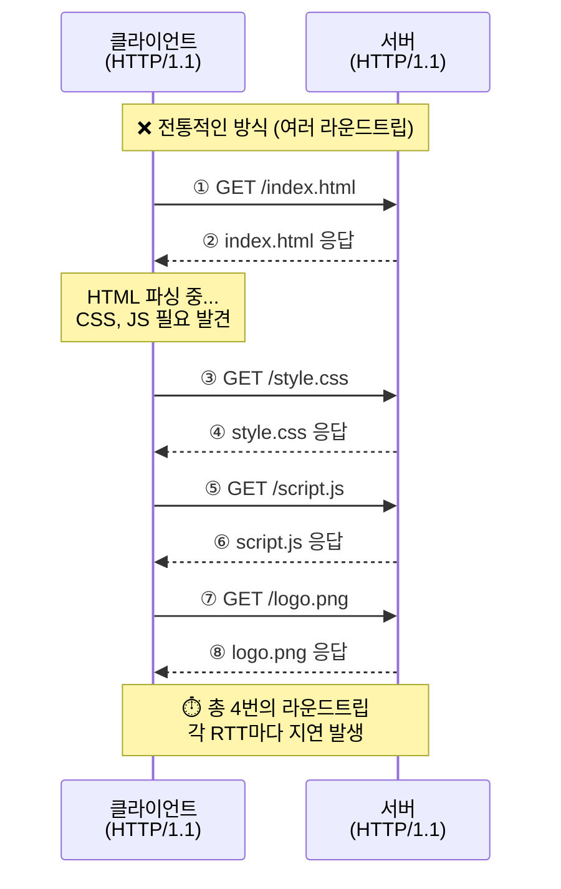

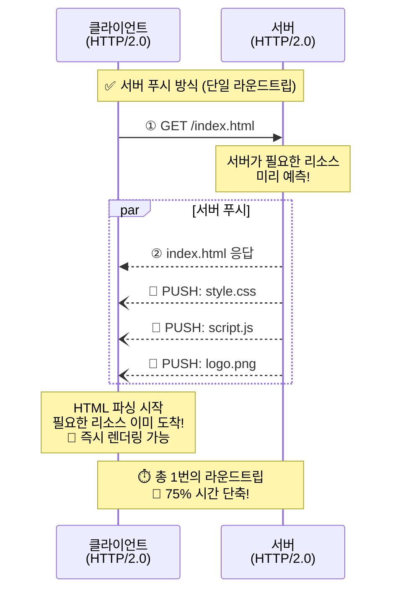

#### 📊 성능 비교

```mermaid
gantt
    title HTTP/1.1 vs HTTP/2.0 로딩 시간 비교
    dateFormat X
    axisFormat %L ms
    
    section HTTP/1.1
    HTML 요청/응답    :done, h1, 0, 100
    CSS 요청/응답     :done, c1, 100, 200
    JS 요청/응답      :done, j1, 200, 300
    이미지 요청/응답  :done, i1, 300, 400
    
    section HTTP/2.0
    HTML + 모든 리소스 :crit, h2, 0, 120
    렌더링 시작       :active, r2, 120, 150
```

#### ✨ 서버 푸시의 장점

| 항목 | HTTP/1.1 | HTTP/2.0 Server Push | 개선율 |
|------|----------|----------------------|--------|
| ⏱️ **라운드트립** | 4회 이상 | 1회 | 📉 **75% 감소** |
| 🌐 **네트워크 지연** | 높음 (누적) | 낮음 (병렬) | 📉 **60-70% 감소** |
| 🚀 **초기 로딩** | 순차적, 느림 | 즉시, 빠름 | 📈 **200-300% 향상** |
| 💾 **캐시 활용** | 요청 후 캐시 | 푸시 시 캐시 확인 | 📈 **효율적** |

#### 🎯 서버 푸시 사용 시나리오

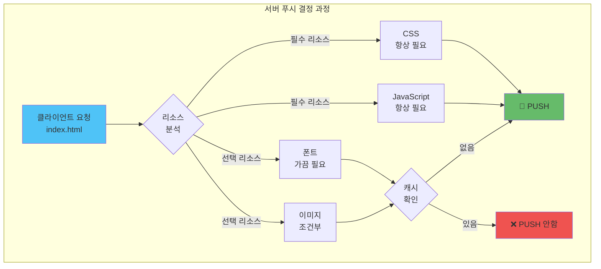

#### ⚠️ 주의사항

> **과도한 푸시는 역효과!**
> - 클라이언트에 이미 캐시된 리소스는 푸시하지 않기
> - 우선순위가 낮은 리소스는 푸시 제외
> - 대용량 파일은 신중하게 판단

### 4️⃣ Header Compression (헤더 압축)

> 💡 **핵심 개념**: HPACK 알고리즘으로 중복 헤더를 압축하여 대역폭 절약

#### 📦 HTTP/1.1 헤더의 문제점

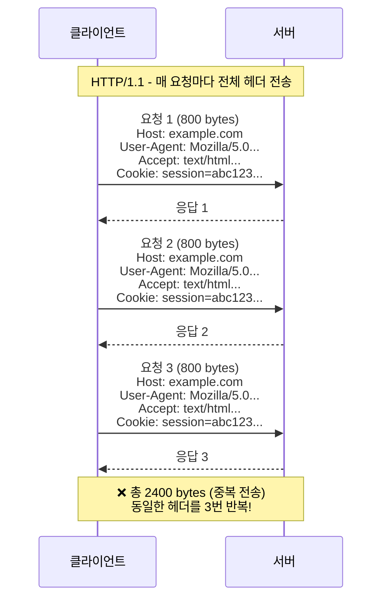

#### ✅ HTTP/2.0 HPACK 압축

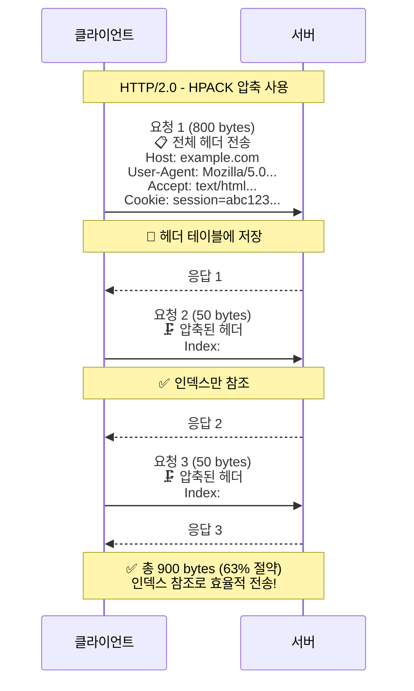

#### 🔧 HPACK 압축 메커니즘

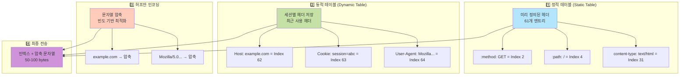

#### 📊 압축 효과 비교

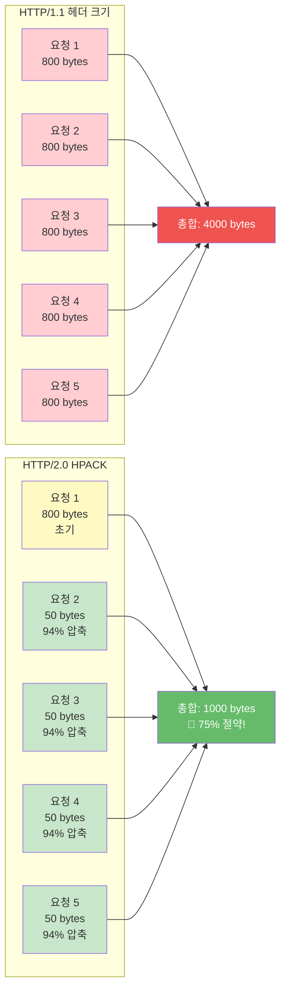

#### 💾 헤더 테이블 동작 원리

| 요청 | 전송 내용 | 크기 | 설명 |
|------|----------|------|------|
| 1️⃣ | 전체 헤더 | 800B | 📝 동적 테이블에 저장 |
| 2️⃣ | 인덱스: 2,3,4,5 | 50B | 🔍 테이블 참조 |
| 3️⃣ | 인덱스: 2,3,4,5 | 50B | 🔍 테이블 참조 |
| 4️⃣ | 인덱스: 2,3,4,5 + 변경사항 | 80B | 📝 차이만 추가 |
| 5️⃣ | 인덱스: 2,3,4,5,6 | 55B | 🔍 새 인덱스 참조 |

#### 🎯 HPACK의 핵심 장점

- ✅ **정적 테이블**: 자주 사용하는 헤더는 미리 정의
- ✅ **동적 테이블**: 세션별로 사용자 정의 헤더 캐싱
- ✅ **허프만 코딩**: 문자열을 효율적으로 압축
- ✅ **차등 인코딩**: 변경된 부분만 전송
- ✅ **보안 강화**: 압축으로 인한 정보 노출 최소화

## 📊 전체 성능 비교

### 🔍 기능별 상세 비교

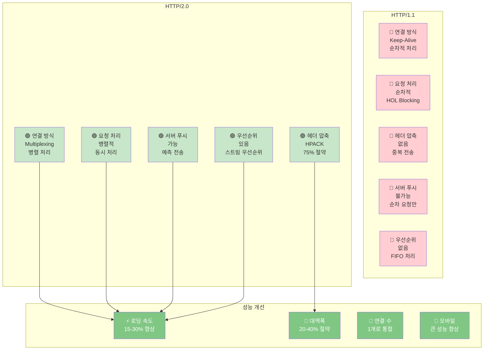

### 📈 실제 성능 측정 데이터

| 측정 항목 | HTTP/1.1 | HTTP/2.0 | 개선율 |
|----------|----------|----------|--------|
| ⏱️ **페이지 로딩 시간** | 3.2초 | 2.1초 | 📉 **34% 단축** |
| 📊 **요청당 대역폭** | 800 bytes/req | 200 bytes/req | 📉 **75% 절약** |
| 🔗 **동시 연결 수** | 6-8개 | 1개 | 📉 **87% 감소** |
| 🌐 **네트워크 왕복** | 15-20 RTT | 4-6 RTT | 📉 **70% 감소** |
| 💻 **CPU 사용량** | 높음 | 중간 | 📉 **20% 감소** |
| 📱 **모바일 (3G)** | 5.8초 | 3.2초 | 📉 **45% 단축** |

### 🎯 시나리오별 성능 향상

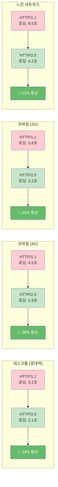

## 🚀 마이그레이션 가이드

### ✅ HTTP/2.0 도입 장점

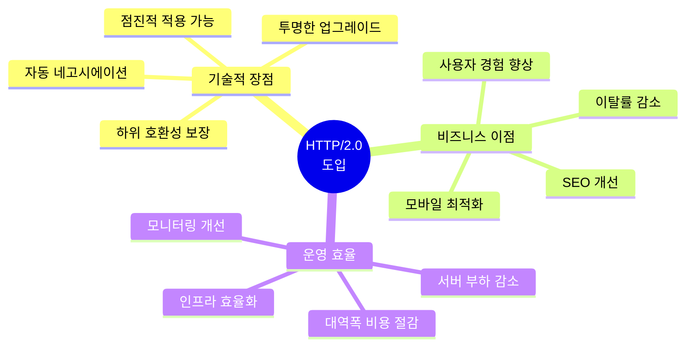

### 📋 적용 체크리스트

| 순서 | 단계 | 작업 내용 | 중요도 |
|------|------|----------|--------|
| 1️⃣ | **HTTPS 적용** | SSL/TLS 인증서 설치 | 🔴 필수 |
| 2️⃣ | **서버 설정** | Nginx/Apache HTTP/2 활성화 | 🔴 필수 |
| 3️⃣ | **브라우저 지원 확인** | 타겟 브라우저 호환성 검증 | 🟡 중요 |
| 4️⃣ | **리소스 최적화** | 불필요한 도메인 샤딩 제거 | 🟡 중요 |
| 5️⃣ | **서버 푸시 설정** | 중요 리소스 푸시 구성 | 🟢 권장 |
| 6️⃣ | **모니터링 구축** | 성능 메트릭 수집 | 🟡 중요 |
| 7️⃣ | **A/B 테스트** | 실제 사용자 성능 비교 | 🟢 권장 |

### ⚠️ 주의사항

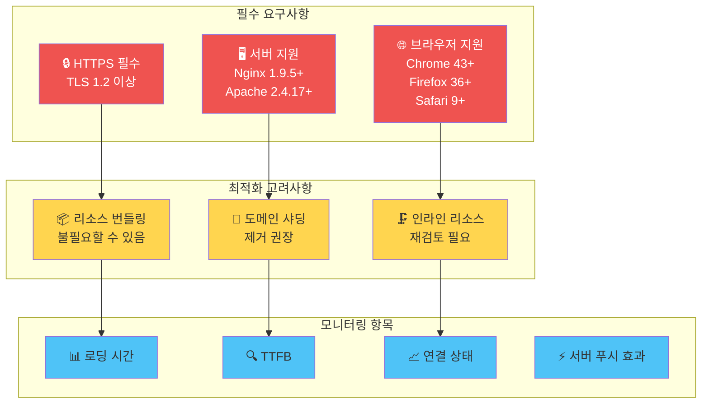

## 🎓 핵심 요약

### 💡 HTTP/2.0의 4대 핵심 기술

```mermaid
quadrantChart
    title HTTP/2.0 기술별 영향도
    x-axis 낮은 구현 난이도 --> 높은 구현 난이도
    y-axis 낮은 성능 향상 --> 높은 성능 향상
    quadrant-1 전략적 적용
    quadrant-2 우선 적용
    quadrant-3 기본 적용
    quadrant-4 신중 검토
    멀티플렉싱: [0.7, 0.9]
    헤더 압축: [0.8, 0.7]
    서버 푸시: [0.4, 0.8]
    스트림 우선순위: [0.6, 0.6]
```

### 📝 최종 결론

> **HTTP/2.0**은 웹 성능을 **혁신적으로 개선**한 프로토콜입니다.

#### 🌟 주요 성과

- ✅ **멀티플렉싱**: 단일 연결로 병렬 처리, HOL Blocking 해결
- ✅ **헤더 압축**: HPACK으로 75% 대역폭 절약
- ✅ **서버 푸시**: 예측적 리소스 전송으로 RTT 75% 감소
- ✅ **스트림 우선순위**: 중요 리소스 우선 처리로 UX 개선

#### 🎯 적용 권장사항

1. **즉시 적용**: 사용자 경험이 중요한 모든 웹 애플리케이션
2. **우선 적용**: 모바일 트래픽 비중이 높은 서비스
3. **점진적 적용**: 레거시 시스템은 단계적 마이그레이션
4. **모니터링 필수**: 실시간 성능 메트릭 수집 및 분석

#### 🚀 미래 전망

```mermaid
timeline
    title 웹 프로토콜의 미래
    2015 : HTTP/2.0 공식 출시 : 멀티플렉싱 도입 : HPACK 압축
    2018 : HTTP/2 보급률 50% 돌파 : 주요 CDN 전면 지원
    2020 : HTTP/3 표준화 시작 : QUIC 프로토콜 기반 : UDP 사용
    2022 : HTTP/3 공식 표준 : 0-RTT 연결 : 향상된 보안
    2025 : HTTP/3 보급 확대 : AI 최적화 통합 : 자동 리소스 관리
```

---

> 💡 **핵심 메시지**: HTTP/2.0은 현대 웹의 필수 기술이며, 사용자 경험 향상과 비즈니스 성과에 직접적인 영향을 미칩니다. 지금 바로 적용을 검토하세요!