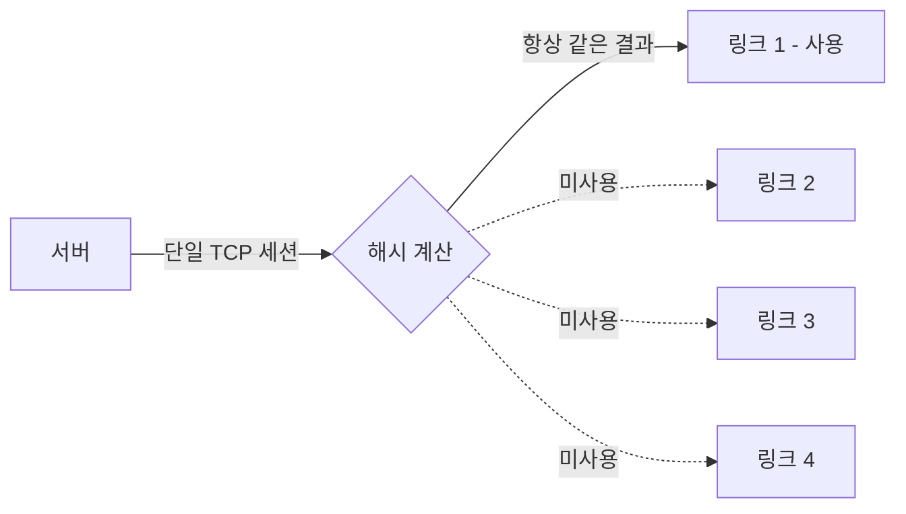

# 링크 애그리게이션과 LACP

여러 물리 링크를 묶어서 하나의 논리 링크처럼 쓰는 기술이다. 벤더마다 부르는 이름이 다르다. 리눅스에서는 bonding, 시스코 NX-OS나 일부 진영에서는 teaming, 스위치 쪽 설정 화면에서는 포트채널(port-channel) 또는 EtherChannel, 표준 용어로는 LAG(Link Aggregation Group)라고 한다. 같은 걸 가리키는데 문맥마다 단어가 바뀌니 처음엔 헷갈린다.

묶는 이유는 두 가지다. 하나는 대역폭을 늘리는 것, 다른 하나는 링크 하나가 죽어도 나머지로 트래픽이 넘어가게 해서 가용성을 확보하는 것이다. 1G 링크 4개를 묶으면 산술적으로는 4G가 된다. 그런데 이 "4G"라는 숫자를 실무에서 그대로 믿으면 나중에 크게 당황한다. 단일 세션은 여전히 1G만 쓴다. 이 부분이 링크 애그리게이션을 처음 도입할 때 가장 많이 깨지는 지점이라 먼저 짚고 간다.

## 단일 세션이 한 링크만 쓰는 이유

링크를 4개 묶었는데 왜 한 연결은 1G밖에 안 나오는가. 패킷이 어느 물리 링크로 나갈지 정하는 방식 때문이다.

만약 패킷을 순수하게 라운드로빈으로 4개 링크에 골고루 뿌리면 어떻게 될까. 같은 TCP 세션의 패킷들이 서로 다른 링크를 타고 가는데, 링크마다 미세하게 지연이 다르다. 그러면 받는 쪽에서 패킷 순서가 뒤바뀌어 도착한다. TCP는 순서가 어긋난 패킷을 보면 재전송을 유발하거나 리오더링 처리를 하느라 성능이 떨어진다. 그래서 대부분의 구현은 라운드로빈을 기본으로 쓰지 않는다.

대신 해시를 쓴다. 패킷의 특정 필드를 해시 함수에 넣어서 나온 값으로 어느 링크를 쓸지 결정한다. 같은 세션의 패킷은 항상 같은 필드 값을 가지니까 항상 같은 링크로 나간다. 순서가 안 꼬인다. 대신 한 세션은 링크 하나에 고정된다.

해시 입력으로 뭘 넣느냐가 분산 정책이다.

- **L2 해시**: 출발지/목적지 MAC 주소를 해시한다. 같은 두 장비 사이 통신은 MAC이 고정이라 항상 같은 링크로 간다. 서버 두 대가 직접 대량 전송하는 구간이라면 링크 하나만 쓰게 된다.
- **L3 해시**: 출발지/목적지 IP를 해시한다. 라우터를 넘어오면 MAC은 바뀌어도 IP는 유지되니 L2보다 분산이 낫다. 그래도 서버 한 대가 다른 서버 한 대로 보내는 트래픽은 IP 쌍이 고정이라 한 링크에 몰린다.
- **L4 해시**: IP에 더해 TCP/UDP 포트 번호까지 해시한다. 같은 두 IP 사이라도 포트가 다른 세션은 다른 링크로 분산될 수 있다. 웹 서버처럼 클라이언트가 많고 포트가 다양하면 분산이 가장 잘 먹는다.

여기서 실무 함정이 나온다. NFS나 iSCSI로 스토리지에 붙는 백업 트래픽을 생각해보자. 서버 한 대가 스토리지 한 대로 단일 TCP 세션을 열어서 대용량을 쏟아붓는다. 출발지 IP 하나, 목적지 IP 하나, 포트도 보통 고정. L4 해시를 써도 세션이 하나면 해시 결과가 하나로 나오니 링크 하나에 박힌다. 4G를 기대하고 묶었는데 백업은 1G로 도는 상황이 벌어진다.

이걸 모르고 "본딩 묶었으니 백업 빨라지겠지" 하고 넘어가면 나중에 백업 윈도가 안 줄어드는 걸 보고 한참 헤맨다. 단일 대용량 전송의 속도를 올리고 싶으면 링크 애그리게이션이 아니라 더 빠른 단일 링크(10G, 25G)로 가거나, 전송을 여러 세션으로 쪼개는 멀티스트림 방식을 써야 한다.



분산은 세션 단위지 패킷 단위가 아니다. 이 한 문장만 기억하면 대부분의 오해가 풀린다.

## 액티브-스탠바이 vs 액티브-액티브

링크를 묶는 방식은 크게 두 갈래다.

**액티브-스탠바이**는 한 링크만 실제로 트래픽을 쓰고 나머지는 대기한다. 쓰던 링크가 죽으면 대기하던 링크로 넘어간다. 대역폭은 안 늘어난다. 링크 하나 분량만 쓴다. 대신 설정이 단순하고 스위치 쪽 협조가 필요 없다. 서버를 서로 다른 스위치 두 대에 한 가닥씩 꽂아두고, 스위치가 LAG를 몰라도 동작한다. 가용성만 필요하고 스위치 설정을 건드리기 어려운 환경에서 쓴다. 리눅스 bonding의 active-backup 모드가 이것이다.

**액티브-액티브**는 묶인 링크 전부로 동시에 트래픽을 흘린다. 앞서 말한 해시 분산이 여기서 동작한다. 대역폭이 늘어나고(세션이 많을 때) 가용성도 같이 얻는다. 대신 양쪽 끝이 같은 방식으로 묶여 있어야 한다. 서버가 LACP로 묶었으면 스위치도 LACP 포트채널로 받아야 한다. 이 매칭이 안 맞으면 문제가 생긴다.

대부분의 경우 액티브-액티브를 원하지만, 스위치 설정 권한이 없거나 서버를 물리적으로 다른 스위치에 분산해야 하는 상황이면 active-backup이 현실적인 선택이 된다.

## LACP

LACP는 802.3ad 표준 프로토콜이다. 양쪽 끝이 LACPDU라는 제어 프레임을 주기적으로 주고받으면서 "우리 이 포트들 묶어서 하나로 쓰자"고 협상한다.

LACP를 쓰는 이유는 그냥 정적으로 묶는 것(static LAG, 시스코 용어로 mode on)보다 안전하기 때문이다. 정적 묶음은 양쪽이 "이 포트들은 묶인 거다"라고 서로 일방적으로 믿는다. 한쪽 케이블이 잘못 꽂혀서 엉뚱한 포트에 연결돼도 그냥 묶인 줄 알고 트래픽을 흘린다. 그러면 루프가 생기거나 트래픽이 블랙홀로 빠진다. LACP는 LACPDU를 주고받아 상대가 진짜 같은 묶음의 파트너인지 확인한 뒤에야 포트를 묶음에 넣는다. 케이블 오결선이나 한쪽만 설정된 상태를 잡아낸다.

LACP에는 두 가지 모드가 있다.

- **active**: 자기가 먼저 LACPDU를 보낸다.
- **passive**: 상대가 LACPDU를 보내오면 응답만 한다. 먼저 보내지는 않는다.

한쪽이라도 active면 협상이 시작된다. 양쪽 다 passive면 둘 다 먼저 안 보내니 협상이 시작되지 않아서 묶이지 않는다. 보통 서버 쪽을 active로 두는 게 안전하다.

LACP 전송 주기에는 slow(30초)와 fast(1초)가 있다. fast로 두면 링크 장애를 더 빨리 감지하지만 LACPDU 트래픽이 늘고 양쪽 주기가 맞아야 안정적이다. 한쪽 fast, 한쪽 slow로 어긋나 있으면 플랩이 생기는 경우가 있어서 양쪽을 맞춰주는 게 좋다.

## 리눅스 bonding 모드

리눅스 bonding 드라이버는 여러 모드를 제공한다. 실무에서 주로 보는 건 세 개다.

| 모드 | 이름 | 스위치 설정 필요 | 특징 |
|------|------|------------------|------|
| mode 1 | active-backup | 불필요 | 한 링크만 사용, 장애 시 절체 |
| mode 4 | 802.3ad (LACP) | 필요 (포트채널) | LACP 협상, 해시 분산 |
| mode 6 | balance-alb | 불필요 | ARP 조작으로 부하 분산 |

mode 4(LACP)가 표준이고 가장 흔하다. mode 1은 스위치 협조 없이 가용성만 챙길 때, mode 6은 스위치를 못 건드리는데 송수신 양쪽 부하분산까지 원할 때 쓴다. mode 6은 ARP 응답을 조작해서 분산하는 방식이라 동작이 미묘한 구석이 있고 특정 환경에서 문제가 생기는 경우가 있어서, 가능하면 스위치를 설정해서 mode 4로 가는 걸 권한다.

### mode 4 (LACP) 설정

NetworkManager나 netplan 같은 상위 도구를 쓰는 환경이 많지만, 동작을 이해하려면 sysfs/modprobe 레벨 설정을 한 번 봐두는 게 좋다. RHEL 계열 ifcfg 스타일 예시다.

```ini
# /etc/sysconfig/network-scripts/ifcfg-bond0
DEVICE=bond0
NAME=bond0
TYPE=Bond
BONDING_MASTER=yes
ONBOOT=yes
BOOTPROTO=none
IPADDR=10.0.10.20
PREFIX=24
GATEWAY=10.0.10.1
BONDING_OPTS="mode=802.3ad miimon=100 lacp_rate=fast xmit_hash_policy=layer3+4"
```

```ini
# /etc/sysconfig/network-scripts/ifcfg-eth0
DEVICE=eth0
NAME=eth0
TYPE=Ethernet
ONBOOT=yes
BOOTPROTO=none
MASTER=bond0
SLAVE=yes
```

eth1도 같은 식으로 MASTER=bond0, SLAVE=yes로 만든다.

`BONDING_OPTS`의 옵션을 하나씩 보면:

- `mode=802.3ad`: LACP 모드. mode=4와 같다.
- `miimon=100`: 100ms마다 링크 상태(캐리어)를 확인한다. 케이블이 빠지거나 포트가 다운되면 이 주기로 감지한다.
- `lacp_rate=fast`: LACPDU를 1초마다 보낸다. 기본은 slow(30초). 스위치 쪽 lacp rate도 같이 맞춰야 한다.
- `xmit_hash_policy=layer3+4`: L3+L4 해시. 기본값은 layer2라서 IP/포트를 안 본다. 분산을 제대로 받으려면 거의 항상 layer3+4 또는 layer2+3으로 바꿔야 한다.

`xmit_hash_policy`는 송신 방향 분산만 결정한다는 점을 놓치기 쉽다. 서버가 어느 링크로 내보낼지는 서버의 이 설정이 정하지만, 스위치가 서버로 내려보낼 때 어느 링크를 쓸지는 스위치의 해시 정책이 정한다. 양쪽이 독립적이다. 그래서 서버에서만 layer3+4로 바꿔도 들어오는 트래픽은 스위치 정책을 따른다. 상하행 분산을 다 챙기려면 양쪽 다 신경 써야 한다.

### 상태 확인

bond이 제대로 묶였는지는 proc 파일로 본다.

```bash
cat /proc/net/bonding/bond0
```

출력에서 봐야 할 부분:

```
Bonding Mode: IEEE 802.3ad Dynamic link aggregation
...
802.3ad info
LACP rate: fast
...
Slave Interface: eth0
MII Status: up
Aggregator ID: 1
...
Slave Interface: eth1
MII Status: up
Aggregator ID: 1
```

핵심은 두 슬레이브의 **Aggregator ID가 같은 값**으로 묶였는지다. eth0이 Aggregator ID 1, eth1이 Aggregator ID 2처럼 서로 다르게 나오면 LACP 협상이 제대로 안 돼서 둘이 별개 묶음으로 갈라진 것이다. 이 경우 실제로는 링크 하나만 트래픽을 쓰게 된다. 거의 대부분 스위치 쪽 포트채널 설정이 안 맞아서 생긴다.

## 스위치 측 포트채널 매칭 주의사항

서버에서 bonding을 mode 4로 잘 설정해놨는데도 동작이 이상하다면 십중팔구 스위치 쪽 문제다. 양쪽이 짝이 맞아야 묶인다.

**스위치도 LACP로 받아야 한다.** 서버가 802.3ad(LACP)인데 스위치 포트채널을 static(mode on)으로 만들어두면 안 묶인다. 서버는 LACPDU를 보내는데 스위치는 응답을 안 하니 협상이 실패한다. 시스코 IOS 기준으로 보면:

```
! 스위치 측 - LACP active로 받기
interface range GigabitEthernet1/0/1 - 2
 channel-group 1 mode active
!
interface Port-channel1
 switchport mode trunk
```

`channel-group 1 mode active`에서 mode를 active나 passive로 둬야 LACP다. `mode on`은 정적 묶음이라 서버가 LACP면 안 맞는다. 서버를 active로 뒀으면 스위치는 active든 passive든 협상되지만, 양쪽 passive면 안 된다는 규칙은 여기서도 똑같다.

**포트채널에 들어가는 포트들의 설정이 동일해야 한다.** 묶이는 물리 포트들의 속도, 듀플렉스, VLAN(access/trunk), trunk allowed VLAN 목록, MTU가 전부 같아야 한다. 하나라도 다르면 스위치가 그 포트를 포트채널에서 빼버린다(suspended/individual 상태). 트렁크로 쓰는데 한 포트만 allowed VLAN 목록이 다르면 그 포트가 채널에서 빠져서 대역폭이 줄거나 특정 VLAN 트래픽이 샌다.

상태는 스위치에서 이렇게 확인한다.

```
show etherchannel summary
```

포트 옆에 `(P)`가 붙으면 포트채널에 정상 편입(bundled)된 것이다. `(s)`는 suspended, `(I)`는 individual로 빠진 것이다. (P)가 아닌 포트가 있으면 설정 불일치를 의심한다.

**두 스위치에 나눠 꽂으려면 MLAG/vPC가 필요하다.** 가용성을 위해 서버의 두 링크를 서로 다른 스위치 두 대에 한 가닥씩 꽂고 싶을 때가 있다. 그런데 일반적인 LACP 포트채널은 한 스위치 안에서만 묶인다. 서로 다른 스위치 두 대의 포트를 하나의 포트채널로 묶으려면 그 두 스위치가 vPC(시스코), MLAG(아리스타 등), 스택 같은 기술로 묶여서 외부에는 한 대처럼 보여야 한다. 이걸 안 하고 그냥 서로 무관한 스위치 두 대에 mode 4로 꽂으면, 두 스위치가 각자 별개 LACP 파트너로 보여서 서버 쪽 Aggregator ID가 갈라진다. 이 상황이라면 차라리 서버를 active-backup(mode 1)으로 두는 게 맞다. mode 1은 스위치끼리 묶일 필요가 없으니 그냥 두 스위치에 꽂아두면 한 링크 죽을 때 다른 쪽으로 넘어간다.

## 정리

링크 애그리게이션을 도입할 때 실제로 확인해야 하는 건 정해져 있다. 단일 세션은 한 링크만 쓰니 대용량 단일 전송의 속도는 안 올라간다는 점, 분산을 받으려면 해시 정책을 layer2 기본값에서 L3나 L4로 바꿔야 한다는 점, 송신과 수신 분산은 양쪽 끝이 독립적으로 결정한다는 점. 그리고 서버를 mode 4로 묶었으면 스위치 포트채널도 반드시 LACP로 받고 포트 설정을 동일하게 맞춰야 한다는 점이다. 두 스위치에 나눠 꽂는 구성은 MLAG/vPC가 없으면 mode 4로는 안 되고 active-backup으로 가야 한다.