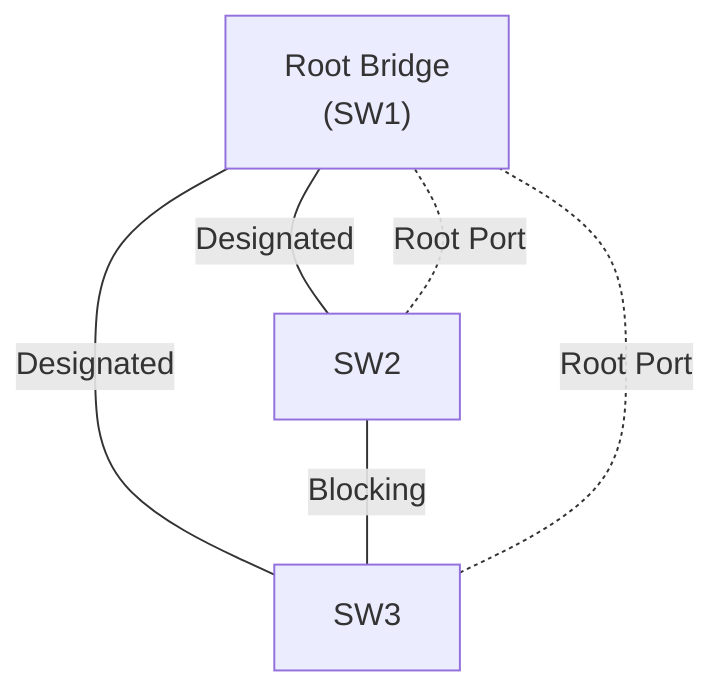

# STP — 스위치 이중화하다 브로드캐스트 스톰 만나는 이야기

## 왜 이걸 알아야 하나

스위치를 두 대 이상 케이블로 엮다 보면 어느 순간 루프가 생긴다. 가용성을 높이려고 일부러 회선을 두 가닥 뽑아 이중화하는 경우가 대표적이다. A 스위치와 B 스위치를 두 개의 링크로 연결하면, 한 링크가 끊겨도 다른 링크로 통신이 이어진다. 문제는 평상시에도 두 링크가 다 살아 있다는 점이다.

L2 스위치는 목적지 MAC을 모르는 프레임(브로드캐스트, 모르는 유니캐스트, 멀티캐스트)을 받으면 들어온 포트를 뺀 모든 포트로 복제해서 내보낸다. 이게 플러딩이다. 루프가 있는 토폴로지에서 브로드캐스트 한 개가 들어오면 A→B로 갔다가, B가 다시 다른 링크로 A에게 돌려보내고, A가 또 B로 보낸다. IP 패킷처럼 TTL이 줄어드는 필드가 이더넷 프레임에는 없다. 그래서 한 번 돌기 시작한 프레임은 영원히 돈다. 초당 수만, 수십만 개로 불어나면서 스위치 CPU와 대역폭을 다 잡아먹는다. 이게 브로드캐스트 스톰이다.

실제로 겪으면 증상이 꽤 무섭다. 핑이 간헐적으로 끊기고, 스위치 LED가 전 포트 미친 듯이 깜빡이고, 관리 인터페이스(SSH, 콘솔)조차 응답이 느려진다. MAC 주소 테이블도 같은 MAC이 이 포트 저 포트로 계속 바뀌면서 플래핑한다. 로그에 `MAC flapping` 또는 `host moving between ports`가 찍히면 거의 루프다.

Spanning Tree Protocol(STP, IEEE 802.1D)은 이 루프를 막으려고 나왔다. 물리적으로는 루프가 있는 토폴로지에서, 논리적으로 트리 구조를 만들어 루프를 끊는다. 여분 링크를 평소엔 막아두고(Blocking), 주 경로가 죽으면 그제서야 살려서 우회한다.

## 동작 원리 한 줄 요약

STP는 결국 "어느 링크를 막을지" 정하는 알고리즘이다. 막는 기준을 정하려면 스위치들끼리 정보를 주고받아야 하고, 그 정보 교환에 쓰는 게 BPDU다. 순서는 이렇다.

1. 스위치 한 대를 기준점(Root Bridge)으로 뽑는다.
2. 각 스위치는 Root까지 가는 가장 가까운 경로(Root Port)를 하나 고른다.
3. 각 네트워크 세그먼트마다 대표 포트(Designated Port)를 하나 정한다.
4. Root Port도 Designated Port도 아닌 포트는 막는다(Blocking).



SW2와 SW3 사이 링크가 막혀서 트리가 된다. 평소엔 이 링크로 트래픽이 안 흐르고, SW1↔SW2나 SW1↔SW3 링크가 죽으면 그제서야 SW2↔SW3가 풀린다.

## BPDU — 스위치들이 주고받는 쪽지

BPDU(Bridge Protocol Data Unit)는 STP가 토폴로지를 계산하려고 스위치끼리 교환하는 프레임이다. 목적지 MAC은 `01:80:C2:00:00:00`(STP 예약 멀티캐스트)이고, 기본 2초마다 한 번씩 나간다.

종류는 둘이다.

- **Configuration BPDU**: Root 정보, 경로 비용, 보내는 스위치 ID 등을 담는다. Root가 만들어 흘려보내고, 나머지 스위치가 받아서 갱신해 다시 전달한다.
- **TCN(Topology Change Notification) BPDU**: 토폴로지가 바뀌었을 때(링크 up/down) Root 쪽으로 올려보내는 쪽지. 이걸 받으면 MAC 테이블 에이징 타임을 기본 300초에서 15초로 줄여 빠르게 재학습한다.

Configuration BPDU 안에서 중요한 필드가 Bridge ID와 Path Cost다. 이 두 개로 Root 선출과 포트 역할이 다 정해진다.

### Bridge ID

Bridge ID = **Bridge Priority(2바이트)** + **MAC 주소(6바이트)**다. 802.1D 원본은 Priority가 2바이트 통째였는데, 지금 장비는 대부분 802.1t 확장을 써서 Priority 4비트 + VLAN ID 12비트(Extended System ID)로 쪼개 쓴다. 그래서 Priority는 0부터 65535까지지만 실제로는 4096 단위로만 설정된다(0, 4096, 8192...). 기본값은 32768이다.

값이 작을수록 우선순위가 높다. 이게 STP에서 제일 자주 헷갈리는 부분이다. "Priority 높다"가 숫자가 크다는 뜻이 아니라 작다는 뜻이다.

## Root Bridge 선출

전원을 켜면 모든 스위치가 처음엔 자기가 Root라고 우긴다. 자기 Bridge ID를 Root ID에 박아 BPDU를 뿌린다. 그러다 자기보다 작은 Bridge ID를 가진 BPDU를 받으면 "쟤가 나보다 위네" 하고 그 정보로 갱신해서 전달한다. 이 과정을 반복하면 결국 네트워크 전체에서 Bridge ID가 가장 작은 스위치 하나가 Root로 남는다.

비교 순서는 이렇다.

1. Bridge Priority가 낮은 쪽이 Root.
2. Priority가 같으면 MAC 주소가 낮은 쪽이 Root.

여기서 실무 함정이 하나 있다. 아무 설정도 안 하면 Priority가 전부 기본값 32768이라, 결국 **MAC 주소가 가장 낮은 스위치**가 Root가 된다. MAC이 낮다는 건 보통 가장 오래된, 제일 구린 스위치라는 뜻이다. 코어에 둔 고성능 스위치가 아니라 구석에 박힌 액세스 스위치가 Root가 되면 트래픽이 그 구린 스위치로 다 몰려서 경로가 비효율적으로 꼬인다.

그래서 Root는 반드시 사람이 지정한다. 코어 스위치에 Priority를 낮춰 박는다.

```
! 코어 스위치를 VLAN 10의 Root로 강제
SW-CORE(config)# spanning-tree vlan 10 priority 4096

! 또는 자동으로 가장 낮은 값 잡게
SW-CORE(config)# spanning-tree vlan 10 root primary
```

`root primary`는 현재 네트워크에서 제일 낮은 Priority를 보고 그보다 낮은 값을 자동 계산해 넣어준다. 백업용 Root는 `root secondary`로 잡아둔다. Root가 죽었을 때 두 번째로 좋은 스위치가 받게 하려는 거다.

## Path Cost와 포트 역할

Root를 정하고 나면, 각 스위치는 Root까지 가는 비용을 따진다. Path Cost는 링크 속도가 빠를수록 낮다. 표준값은 아래와 같다.

| 링크 속도 | Cost (802.1D 기본) |
|---|---|
| 10 Mbps | 100 |
| 100 Mbps | 19 |
| 1 Gbps | 4 |
| 10 Gbps | 2 |

스위치는 자기 포트들 중 Root까지 누적 Cost가 가장 작은 포트를 **Root Port**로 고른다. 세그먼트마다는 그 세그먼트에서 Root에 가장 가까운 포트가 **Designated Port**가 된다. Root Bridge의 모든 포트는 항상 Designated다(Root까지 Cost가 0이니까). 어느 쪽도 못 된 포트가 **Blocking** 상태로 들어가 루프를 끊는다.

Cost가 같으면 타이브레이커가 작동한다. 송신 측 Bridge ID가 낮은 쪽, 그것도 같으면 송신 측 Port ID(Port Priority + 포트 번호)가 낮은 쪽이 이긴다.

## 포트 상태와 컨버전스 시간 문제

여기가 STP를 운영할 때 제일 골치 아픈 부분이다. 802.1D 포트는 링크가 올라오면 곧장 통신하지 못하고 단계를 밟는다.


- **Blocking**: BPDU만 듣는다. 데이터 프레임은 보내지도 받지도 않는다.
- **Listening**: BPDU를 주고받으며 자기 역할을 계산한다. 아직 MAC 학습도 안 하고 데이터도 안 흘린다.
- **Learning**: 들어오는 프레임의 출발지 MAC을 학습해 테이블을 채운다. 데이터는 아직 안 흘린다.
- **Forwarding**: 정상 통신.

문제는 시간이다. Listening 15초 + Learning 15초 = 30초. 여기에 Blocking에서 깨어날 때 Max Age 20초까지 걸릴 수 있다. 즉 포트 하나가 올라와서 실제 트래픽을 흘리기까지 **최대 50초**가 걸린다.

이게 실무에서 어떻게 터지냐면, 서버에 랜선을 꽂거나 PC를 켜면 링크는 즉시 올라오는데 통신이 30초 동안 안 된다. DHCP 클라이언트가 그 사이에 타임아웃 나서 IP를 못 받는다. PXE 부팅하는 서버는 부팅 자체가 실패한다. "케이블 꽂았는데 30초 동안 인터넷이 안 돼요"라는 문의가 들어오면 십중팔구 이거다.

## RSTP — 컨버전스를 초 단위로 줄이기

RSTP(Rapid STP, IEEE 802.1w)가 이 30~50초 문제를 푼다. 지금 새로 사는 장비는 기본이 거의 RSTP거나 그 변형(MSTP, Rapid-PVST)이다.

핵심 차이 몇 가지.

**포트 상태를 3개로 줄였다.** Blocking/Listening/Disabled를 Discarding 하나로 합쳤다. Discarding → Learning → Forwarding 셋만 남는다.

**타이머를 안 기다리고 핸드셰이크로 넘어간다.** 802.1D는 Forward Delay 타이머가 만료되길 무조건 기다렸다. RSTP는 인접 스위치끼리 Proposal/Agreement를 주고받아 "이 링크 양쪽 다 점대점이고 루프 없는 거 확인됐지?"를 합의하면 즉시 Forwarding으로 간다. 정상이면 컨버전스가 1초 안쪽이다.

**포트 타입을 구분한다.** 다른 스위치와 직결된 점대점(point-to-point) 링크는 빠른 전환 대상이다. 종단 장치가 붙는 Edge 포트는 아예 루프 가능성이 없다고 보고 곧바로 Forwarding으로 보낸다. 이 Edge 포트 개념이 시스코의 PortFast와 같은 거다.

**모든 스위치가 BPDU를 자기가 만들어 보낸다.** 802.1D는 Root만 BPDU를 생성하고 나머지는 중계만 했다. RSTP는 각자 2초마다 BPDU를 직접 내보내서, 3번(6초) 연속 못 받으면 인접 스위치가 죽었다고 빠르게 판단한다.

호환성은 된다. RSTP 스위치가 802.1D만 아는 옛날 스위치를 만나면 그 포트만 레거시 모드로 떨어져 느리게 동작한다. 그래서 망에 STP 장비 한 대 섞여 있으면 그 구간만 컨버전스가 느려진다.

## PortFast — 종단 포트는 줄 세우지 마라

서버나 PC가 붙는 액세스 포트는 거기서 루프가 생길 일이 없다. 그런 포트까지 30초씩 Listening/Learning을 시킬 이유가 없다. PortFast(RSTP에선 Edge 포트)를 켜면 링크 업과 동시에 바로 Forwarding으로 보낸다.

```
! 단일 포트에 적용
SW(config)# interface GigabitEthernet0/1
SW(config-if)# spanning-tree portfast

! 액세스 모드 포트 전부에 일괄 적용
SW(config)# spanning-tree portfast default
```

앞서 말한 DHCP 타임아웃, PXE 부팅 실패는 PortFast 한 줄로 거의 다 사라진다.

대신 절대 지켜야 할 규칙이 하나 있다. **PortFast는 종단 장치 포트에만 켠다. 스위치끼리 연결되는 포트(트렁크, 업링크)에는 절대 켜지 마라.** PortFast 포트는 STP 계산을 건너뛰고 바로 Forwarding이라, 거기에 실수로 다른 스위치를 물리면 STP가 루프를 인지하기도 전에 브로드캐스트 스톰이 터진다. 이걸 막으려고 BPDU Guard를 같이 건다.

```
! PortFast 포트에 BPDU가 들어오면 포트를 즉시 차단(err-disabled)
SW(config-if)# spanning-tree bpduguard enable
```

BPDU Guard는 PortFast 포트로 BPDU가 들어오는 순간(=거기에 스위치가 물렸다는 신호) 포트를 err-disabled로 내려버린다. 종단 포트엔 BPDU가 올 일이 없으니, BPDU가 왔다는 건 누가 거기에 스위치나 허브를 잘못 꽂았다는 뜻이다. 사고를 한 포트로 가둬버리는 안전장치다.

## 브로드캐스트 스톰 실제 트러블슈팅

이중화 구성하다 스톰을 만나면 어떻게 잡는지 순서대로 정리한다.

### 1. 증상으로 루프부터 의심

- 핑이 불규칙하게 끊기고 지연(RTT)이 들쭉날쭉하다.
- 스위치 전 포트 LED가 동시에 미친 듯이 깜빡인다.
- SSH/콘솔이 버벅인다. CPU를 보면 거의 100%다.
- 로그에 MAC 플래핑이 찍힌다.

```
! 시스코 기준 CPU 점유 확인
SW# show processes cpu sorted | exclude 0.00

! MAC 플래핑 로그 확인
SW# show logging | include MAC|flap|move
```

`%SW_MATM-4-MACFLAP_NOTIF: Host aaaa.bbbb.cccc in vlan 10 is flapping between port Gi0/1 and Gi0/2` 같은 로그가 보이면 Gi0/1과 Gi0/2 사이에 루프가 있는 거다.

### 2. STP 상태부터 확인

```
SW# show spanning-tree vlan 10
```

여기서 봐야 할 것.

- Root Bridge가 의도한 스위치가 맞나. 엉뚱한 스위치가 Root면 누가 Priority를 안 잡은 거다.
- 막혀 있어야 할 포트가 Blocking(RSTP면 Discarding) 상태로 잘 잡혀 있나. 전부 Forwarding이면 STP가 루프를 못 끊고 있다는 뜻이다.
- 한쪽 포트만 BPDU를 못 받고 있진 않나.

### 3. STP가 꺼져 있거나 BPDU가 한쪽만 흐르는 경우

가장 흔한 사고 원인 두 가지다.

**한쪽 장비에서 STP가 비활성화돼 있다.** 일부 비관리형 스위치나 잘못 설정된 장비는 STP를 아예 안 돌린다. 그러면 BPDU 교환이 안 돼서 루프를 못 끊는다. 관리형 장비라면 STP가 켜져 있는지부터 확인한다.

**단방향 링크(unidirectional link).** 광 모듈 한 가닥이 죽거나 케이블 한 방향만 끊기면, 한쪽은 BPDU를 보내는데 받지를 못한다. 받는 쪽은 BPDU가 안 오니 "여긴 종단인가 보다" 하고 Blocking이던 포트를 Forwarding으로 열어버린다. 그 순간 루프가 풀려 스톰이 터진다. 이걸 막는 게 UDLD나 RSTP의 Loop Guard다.

```
! Loop Guard: BPDU가 끊긴 비지정 포트를 Forwarding으로 안 풀고 loop-inconsistent로 가둠
SW(config)# spanning-tree loopguard default
```

### 4. 급할 때 응급 처치

스톰이 한창이라 SSH도 안 들어가는 상황이면, 의심되는 이중화 링크 한쪽을 **물리적으로 뽑는다.** 루프를 끊으면 트래픽이 가라앉고 그제서야 관리 접속이 살아난다. 그 다음 STP 설정을 점검하고 다시 꽂는다. 콘솔 케이블이 살아 있으면 의심 포트를 `shutdown` 해서 끊어도 된다.

### 5. 재발 방지

- 모든 스위치 포트에서 STP를 켜둔다. 이중화 구간에서 끄지 마라.
- Root는 코어에 Priority로 고정한다. 기본값에 맡기지 마라.
- 종단 포트엔 PortFast + BPDU Guard를 같이 건다.
- 스위치 간 업링크엔 Loop Guard나 UDLD를 건다.
- 스톰 컨트롤로 브로드캐스트 비율 상한을 걸어 폭주 시 자동 억제되게 한다.

```
! 브로드캐스트가 대역폭의 1% 넘으면 초과분 드롭
SW(config-if)# storm-control broadcast level 1.00
SW(config-if)# storm-control action shutdown
```

스톰 컨트롤은 루프를 막는 게 아니라 터졌을 때 피해를 줄이는 안전망이다. 근본 원인은 STP로 잡고, 스톰 컨트롤은 보험으로 깔아둔다.

## 정리

스위치를 이중화하면 물리적 루프가 생기고, 이더넷엔 TTL이 없어서 루프 한 번이 그대로 브로드캐스트 스톰이 된다. STP는 여분 링크를 막아 논리적 트리를 만들어 루프를 끊는다. Root Bridge는 Bridge ID(Priority + MAC)가 가장 작은 스위치가 되는데, 기본값에 맡기면 제일 구린 스위치가 Root가 되니 코어에 Priority를 박아 고정한다.

802.1D는 포트가 Forwarding까지 30~50초 걸려서 DHCP 타임아웃 같은 문제를 일으킨다. RSTP는 핸드셰이크로 이걸 1초 안쪽으로 줄였고, 종단 포트엔 PortFast(Edge)로 대기 시간을 없앤다. PortFast 포트엔 BPDU Guard를, 스위치 간 링크엔 Loop Guard를 같이 걸어 오설정 사고를 한 포트로 가둔다. 스톰이 실제로 터지면 의심 링크부터 끊어 루프를 멈추고, STP 상태와 BPDU 흐름을 점검한다.
