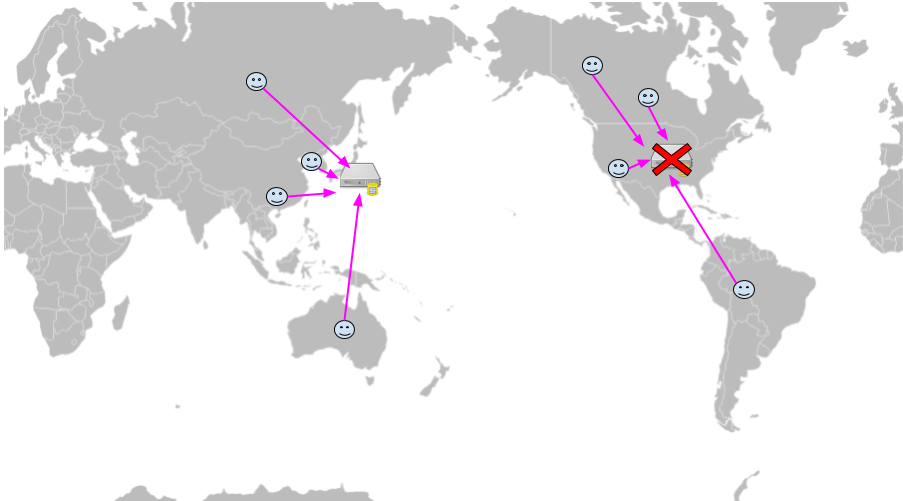
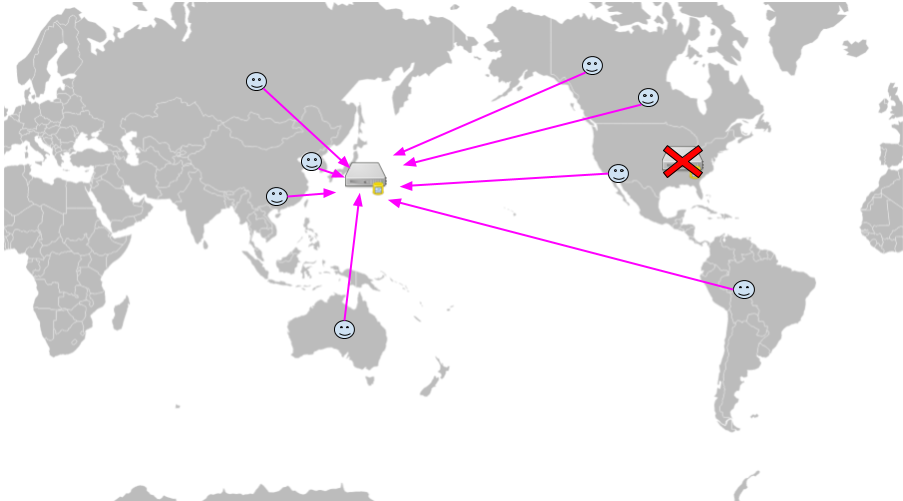
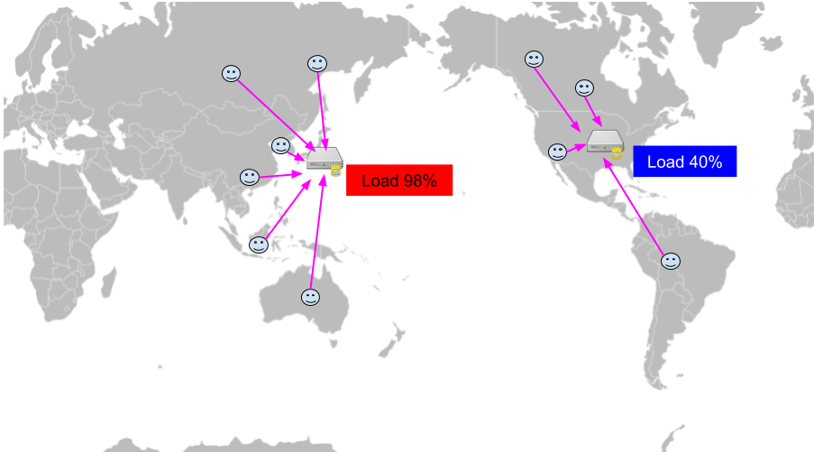
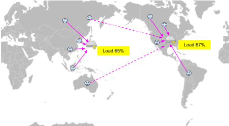
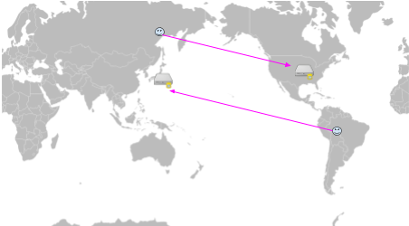
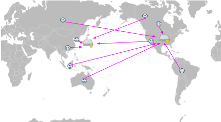
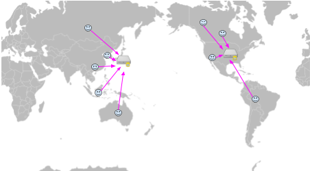

# GSLB(Global Server Load Balancing)
- 이름만 보면 얼핏 업그레이드된 로드 밸런싱 형태라고 생각할 수 있지만, 이름과는 다르게 DNS 서비스의 발전된 형태이다.
- 전 세계적으로 분산된 서버들의 부하를 분산시키고 가용성을 높이는 서비스입니다.
- 단순한 DNS 서비스와 달리, 서버의 상태, 지리적 위치, 네트워크 상태 등 다양한 요소를 고려하여 최적의 서버를 선택합니다.

# DNS의 한계
- DNS는 도메인 주소와 IP를 매핑하여 도메인으로 요청이 들어왔을 때 타켓의 주소로 변환해 주는 서비스이다. 
- 하나의 도메인 주소에 대해서 여러 개의 IP주소를 넘겨 줄 수 있는데, 이 기능을 이용해서 가용성 구성과 로드 밸랜싱 기능을 수행하기도 한다. 
- DNS 뒤에 여러 IP를 붙여 고가용성과 로드 밸런싱 역할을 할 수 있긴 하겠지만 근본적으로는 다음과 같은 한계가 있다:

1. 서버 상태 모니터링 불가: 서버가 다운되었는지, 과부하 상태인지 알 수 없음
2. 단순한 라운드 로빈 방식: 서버의 실제 부하나 성능을 고려하지 않음
3. 지리적 위치 고려 불가: 사용자와 서버 간의 거리를 고려하지 않음
4. 실시간 대응 불가: 서버 상태 변화에 실시간으로 대응할 수 없음

> DNS의 로드 밸런싱은 IP 목록중 하나를 반환할 뿐(라운드로빈?) 네트워크 지연, 성능, 트래픽 유입, 서비스 실패 등은 전혀 고려하지 않는다. 

--- 

## GSLB & DNS 동작방식 차이

### 1. 재해복구 

## DNS

<br>
<div align="center">
    
</div>

- DNS는 서버의 상태를 알 수 없기 때문에 서버가 실패하는 유저들이 다수 존재한다.
- 서버 장애 발생 시 자동 전환 메커니즘이 없어 서비스 중단이 발생할 수 있다.
- Health Check 기능이 없어 실패한 서버로도 요청이 계속 전달될 수 있다.

## GSLB

<br>
<div align="center">
    
</div>

- GSLB는 서버의 상태를 모니터링 하기 때문에 실패한 서버의 IP는 응답(Converting Domain to IP response) 에서 제외하므로, 유저는 서비스를 계속해서 이용할 수 있다.
- Active-Active 또는 Active-Standby 구성으로 고가용성 보장
- 자동 장애 감지 및 복구 메커니즘으로 서비스 연속성 유지
- 지역별 장애 격리 및 대응 가능

---

### 2. 로드밸런싱

## DNS

<br>
<div align="center">
    
</div>

- 위에서 간단히 설명한 것과 같이 DNS는 Round Robin 방식으로 로드밸런싱한다. 
- 작은 서비스는 크게 문제 없겠지만 트래픽이 아주 높은 서비스 같은 경우는 정교한 로드 밸런싱이 필요하다.
- 서버의 실제 부하 상태를 고려하지 않아 특정 서버에 과부하가 발생할 수 있다.
- 트래픽 패턴에 따른 동적 조정이 불가능하다.

## GSLB

<br>
<div align="center">
    
</div>

- GSLB는 서버의 로드(상태)를 모니터링하기 때문에 트래픽이 몰리지 않은 서버의 IP를 반환해주기 때문에 DNS보다 정교한 로드밸런싱이 가능하다.
- 다양한 로드밸런싱 알고리즘 지원:
  - Least Connection: 현재 연결 수가 가장 적은 서버 선택
  - Weighted Round Robin: 서버별 가중치를 부여한 라운드 로빈
  - Response Time: 응답 시간이 가장 빠른 서버 선택
  - Geographic: 지리적 위치 기반 서버 선택
- 실시간 부하 모니터링 및 동적 조정
- 트래픽 패턴 분석 및 예측 기반 부하 분산

---

### 3. 레이턴시 기반

## DNS

<br>
<div align="center">
    
</div>

- DNS는 Round Robin 방식을 사용하기 때문에 유저는 자신이 위치한 곳과 아주 먼곳에 떨어진 서버로 연결이 될 수도 있다.
- 네트워크 지연 시간을 고려하지 않아 사용자 경험 저하 가능성
- RTT(Round Trip Time) 측정 불가
- 패킷 손실률 모니터링 불가

## GSLB

<br>
<div align="center">
    
</div>

- GSLB는 각 지역별로 서버에 대한 레이턴시(latency) 정보를 가지고 있기 때문에 해당 유저로부터 레이턴시가 적은 서버의 IP를 반환해준다.
- 네트워크 성능 모니터링:
  - RTT 측정
  - 패킷 손실률 모니터링
  - 대역폭 사용량 추적
- BGP 라우팅 정보 활용
- Anycast 네트워크 구성 지원

---

### 4. 위치 기반

## DNS

<br>
<div align="center">
    
</div>

- DNS는 Round Robin 방식을 사용
- 사용자의 지리적 위치를 고려하지 않음
- 지역별 최적화 불가능
- 데이터 주권 준수 어려움

## GSLB

<br>
<div align="center">
    
</div>

- GSLB는 유저의 지역정보를 기반해서 가까운 지역의 서버로 연결
- 위치 인식 기능:
  - IP 기반 위치 파악
  - GeoIP 데이터베이스 활용
  - 지역별 서버 매핑
- 지역별 최적화:
  - 데이터 주권 준수
  - 지역별 콘텐츠 최적화
  - 지역별 트래픽 관리

---

## GSLB 구현 방식

### 1. DNS 기반 GSLB
- DNS 쿼리에 대한 응답으로 최적의 서버 IP 반환
- TTL(Time To Live) 값을 통한 캐시 관리
- DNS 프로토콜 확장을 통한 추가 정보 전달

### 2. Anycast 기반 GSLB
- 동일한 IP 주소를 여러 위치에서 광고
- BGP 라우팅을 통한 최적 경로 선택
- 네트워크 레벨에서의 부하 분산

## GSLB 도입 시 고려사항

### 1. 비용
- GSLB 솔루션 라이선스 비용
- 인프라 구축 및 유지보수 비용
- 모니터링 및 관리 비용

### 2. 복잡성
- 설정 및 관리의 복잡성
- 네트워크 아키텍처 변경 필요
- 운영팀의 전문성 요구

### 3. 성능
- DNS 해석 시간 증가 가능성
- Health Check로 인한 오버헤드
- 캐시 정책 최적화 필요

## 주요 GSLB 솔루션
1. F5 BIG-IP GTM
2. Citrix NetScaler
3. AWS Route 53
4. Cloudflare
5. Akamai

```출처
1. https://coding-start.tistory.com/339
2. https://www.f5.com/services/resources/glossary/global-server-load-balancing
3. https://www.nginx.com/resources/glossary/global-server-load-balancing/
```

