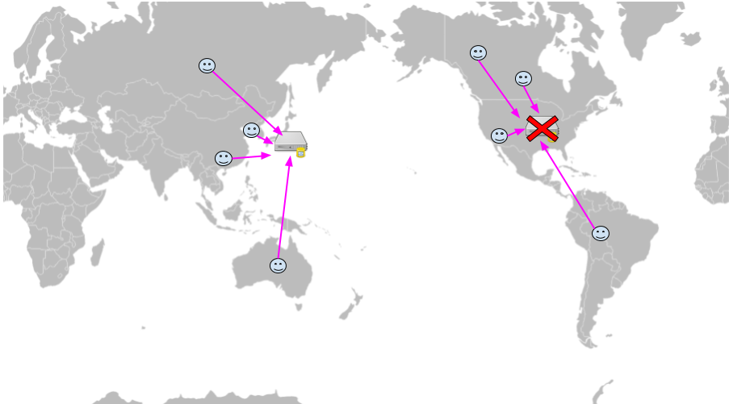
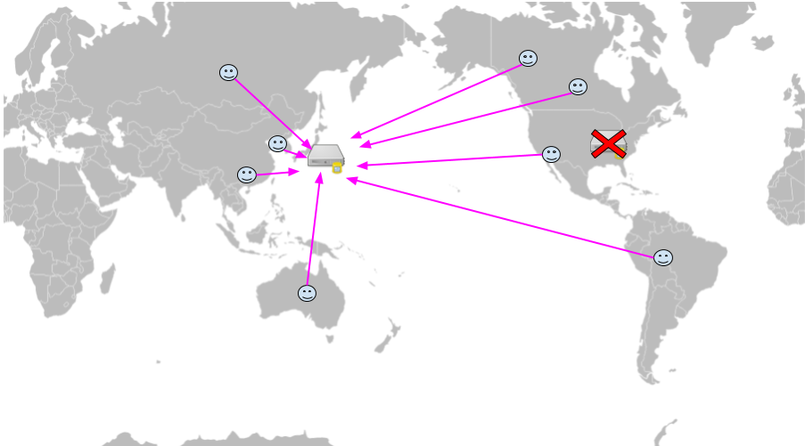
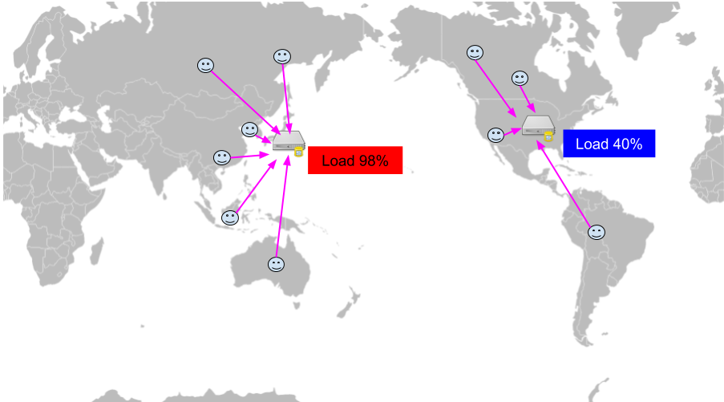
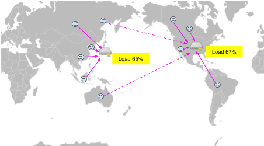
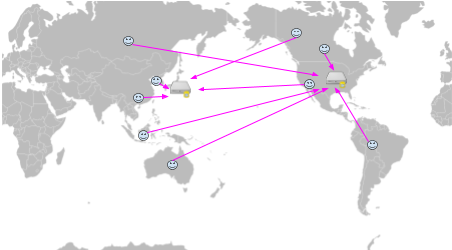
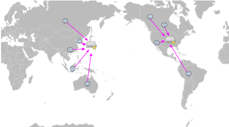
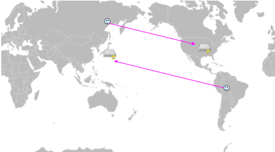
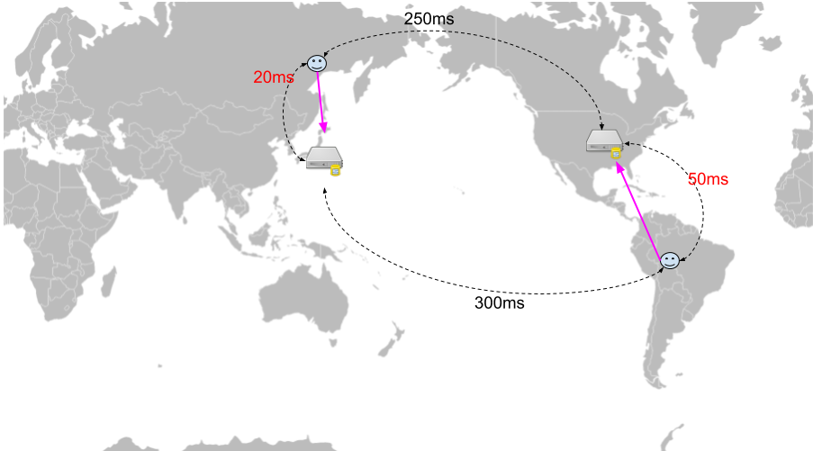

# GSLB (Global Server Load Balancing)

## 정의

GSLB는 여러 지역(region)에 분산된 서버 중 어떤 IP를 사용자에게 돌려줄지 결정하는 장치다. 구현 방식은 크게 두 갈래로 나뉜다.

- **DNS 기반 GSLB**: 권한 DNS 서버가 클라이언트 위치·서버 헬스·지연 시간을 보고 A/AAAA 응답을 다르게 내준다. F5 BIG-IP DNS(구 GTM), NS1, Route 53, Akamai Edge DNS, NS1 Pulsar 등이 여기 속한다.
- **Anycast 기반 GSLB**: 동일한 IP를 여러 PoP에서 BGP로 광고하고, 라우터가 AS-path가 가장 짧은 경로로 트래픽을 흘려보낸다. Cloudflare, Google, Fastly의 엣지가 이 방식을 쓴다.

둘은 자주 같이 묶여 설명되지만 실제 동작 계층이 다르다. DNS 기반은 L7(이름 해석) 시점에 의사결정을, Anycast는 L3(라우팅) 시점에 의사결정을 한다. 이 차이가 운영에서 갈리는 모든 trade-off의 출발점이다.

---

## DNS 기반과 Anycast 기반의 trade-off

### 동작 계층 차이

| 항목 | DNS 기반 GSLB | Anycast 기반 |
|------|---------------|--------------|
| 의사결정 시점 | 사용자가 도메인을 resolve 할 때 | 라우터가 BGP 경로를 선택할 때 |
| 의사결정 주체 | 권한 DNS 서버 | 인터넷 백본의 BGP |
| 사용자 식별 | 클라이언트 resolver IP (또는 ECS) | 진입 라우터 |
| 페일오버 단위 | DNS 응답 (TTL 만료 후) | BGP withdraw (수 초 ~ 수십 초) |
| 라우팅 변경 비용 | 권한 DNS 레코드 수정 | BGP announce/withdraw |

### TTL 의존성

DNS 기반 GSLB의 가장 큰 약점이 TTL이다. Route 53에서 latency-based 레코드 TTL을 60초로 잡았다고 실제로 60초 안에 모든 사용자가 새 IP를 받는 게 아니다. 중간 경로의 캐싱 resolver가 TTL을 그대로 존중하는 경우도 있지만, 일부 ISP의 resolver는 자체 정책으로 최소 TTL을 적용하거나(예: 300초 floor) 만료된 응답을 stale-while-revalidate 방식으로 계속 내준다. 모바일 OS와 브라우저의 자체 DNS 캐시도 따로 돌아간다. 크롬은 자체 캐시를 60초 정도 가져가고, iOS는 시스템 캐시가 별도로 있다.

결과적으로 TTL을 60초로 박아도 실제 수렴까지 5~15분이 걸리는 경우가 흔하다. 사고 났을 때 "왜 페일오버했는데 일부 사용자가 아직 죽은 IP로 가지?" 하는 상황이 여기서 나온다.

Anycast는 BGP withdraw가 인터넷 전반에 전파되는 시간(보통 수십 초)만 기다리면 된다. TTL이 끼지 않으니 클라이언트 캐시도 무관하다. 단, BGP 전파가 모든 ISP에서 균일하지 않다는 별개의 문제는 있다.

### 클라이언트 위치 추정: Resolver IP vs ECS

DNS 기반 GSLB가 "사용자 위치"를 어떻게 아는지가 핵심 함정이다. 권한 DNS 서버에 도달하는 패킷의 출발지 IP는 **사용자의 IP가 아니라 사용자가 사용하는 recursive resolver의 IP**다.

- 사용자가 KT 자체 resolver를 쓰면: 권한 서버는 KT resolver IP → 한국으로 판단 → 한국 서버 IP 반환. 정확함.
- 사용자가 8.8.8.8(Google Public DNS)을 쓰면: 권한 서버는 구글 resolver IP → 미국 또는 가장 가까운 구글 PoP으로 판단. 한국 사용자가 미국 서버 IP를 받을 수 있다.

이 문제를 풀려고 만든 게 **EDNS Client Subnet (ECS, RFC 7871)**이다. recursive resolver가 권한 서버로 쿼리 보낼 때 사용자 IP의 prefix(보통 /24)를 옵션으로 같이 실어 보낸다. 권한 서버는 이 prefix를 보고 사용자의 실제 위치를 GeoIP로 추정해 적절한 응답을 내린다.

ECS의 프라이버시 trade-off는 무겁다. 사용자 IP의 일부가 권한 DNS 서버로 노출되니, 도메인 운영자는 누가 어디서 접속하는지를 resolver를 우회해 직접 본다. Cloudflare 1.1.1.1과 Quad9는 프라이버시 이유로 ECS를 보내지 않는다. Google Public DNS와 OpenDNS는 보낸다. 이 차이 때문에 같은 GSLB라도 1.1.1.1을 쓰는 사용자는 라우팅 정확도가 떨어진다.

Anycast는 ECS 자체가 필요 없다. 사용자 패킷이 직접 가까운 PoP으로 흘러 들어오니까. 클라이언트의 DNS 설정과 무관하다는 게 Anycast의 큰 장점이다.

### 수렴 시간 비교

| 시나리오 | DNS 기반 (TTL 60s) | Anycast |
|---------|--------------------|---------| 
| 정상 페일오버 | 1~5분 (TTL+캐시) | 10~60초 (BGP) |
| 사고 시 worst case | 15~30분 (stale resolver) | 1~3분 (BGP 수렴) |
| 글로벌 전파 | 비균일 (resolver별) | 비균일 (peering별) |

---

## Health Check 실제 동작

GSLB 문서에서 "Health Check"는 늘 한 줄로 끝나는데, 운영 들어가면 이게 가장 골치 아픈 부분이다.

### Probe 빈도와 임계값

대부분의 솔루션에서 probe 간격은 10~30초가 기본값이다. Route 53은 표준 30초, fast(10초) 옵션. 짧을수록 장애 감지가 빠르지만 타깃 서버 입장에서는 헬스체크 트래픽이 무시 못 할 정도로 쌓인다.

임계값(failure threshold)은 보통 연속 실패 3회를 본다. probe 30초 × 실패 3회 = 최소 90초가 지나야 unhealthy 판정. Fast probe(10초) × 실패 3회 = 30초. 여기에 DNS TTL 60초가 또 붙으니 실제 사용자가 새 IP를 받기까지 2~3분은 우습게 걸린다.

임계값을 1로 낮추면 flapping이 심해진다. 잠깐의 패킷 손실이나 GC 멈춤에도 unhealthy → healthy → unhealthy를 반복한다. flapping은 캐싱 resolver 입장에서는 사실상 무작위 응답으로 보이고, 사용자에게 일관성 없는 경험을 준다.

### 지역별 분산 probe (multi-region health check)

Route 53은 헬스체크를 8개 리전(us-east-1, us-west-1, eu-west-1, ap-northeast-1 등)에서 동시에 보낸다. 각 리전에서 별도로 판정하고, 18% 이상의 리전이 healthy로 보면 전체 healthy로 친다.

이게 왜 중요하냐면, 단일 지점 probe는 자기 자신이 네트워크 격리되면 멀쩡한 서버를 unhealthy로 잘못 본다. 2021년 Fastly 사건처럼 특정 리전의 BGP 문제가 생기면 그 리전 probe는 다 실패하지만 다른 리전에서는 정상이다. 분산 probe가 없으면 멀쩡한 서버를 죽은 걸로 보고 페일오버해버린다.

반대로 분산 probe에도 함정이 있다. 8개 리전이 모두 한 곳의 데이터센터를 probe하면 서버 입장에서는 헬스체크만 초당 수십 건이다. probe 경량화(`HEAD /health`나 TCP-only)를 안 하면 헬스체크가 실제 트래픽보다 무거워지는 경우도 있다.

### Health Check에서 자주 잘못하는 것

- `GET /` 를 헬스체크로 씀: 메인 페이지가 DB 쿼리를 하면 DB 죽었을 때 모든 서버가 unhealthy로 빠진다. 헬스체크 엔드포인트는 의존성 없이 200을 내려야 한다.
- 의존성 포함 헬스체크: `GET /health`가 DB·Redis·외부 API까지 다 검사하면 외부 의존성 하나 잠깐 끊겨도 전 지역이 동시에 페일오버된다. shallow check(프로세스 살아있나)와 deep check(의존성 검사)를 분리해야 한다.
- TLS 인증서 만료를 헬스체크가 못 봄: HTTPS probe인데 인증서 만료를 fail 처리 안 하는 솔루션이 있다. EnableSNI와 인증서 검증 옵션을 명시적으로 켜야 한다.

---

## 짧은 TTL의 부작용

문서마다 "TTL은 짧게 잡아라"라고 쓰여 있지만, 실제로는 그 비용이 작지 않다.

### 권한 DNS 서버 부하

TTL 60초로 잡으면 각 캐싱 resolver가 분당 한 번씩 권한 서버에 다시 묻는다. 글로벌 서비스라면 권한 서버에 도달하는 쿼리가 TTL 300초 → 60초로 줄였을 때 약 5배 증가한다. Route 53처럼 쿼리당 과금하는 서비스에서는 그대로 비용이다($0.40/백만 쿼리 표준 쿼리, latency-based는 $0.60).

자체 권한 서버를 운영한다면 UDP 53 포트 부하가 그만큼 늘어난다. DNS DDoS 공격이 들어올 때 TTL이 짧으면 캐시가 방어막 역할을 못 하니 그대로 권한 서버가 두들겨 맞는다.

### 캐시 무력화로 인한 지연 누적

DNS 캐시는 평균 응답 시간을 깎는 가장 효과적인 layer다. TTL 300초면 같은 사용자가 5분에 한 번만 DNS 해석에 30~80ms를 쓰지만, TTL 60초면 매 분마다 그 비용을 낸다. 모바일에서는 패킷 손실이나 캐리어급 NAT 환경에서 DNS 응답이 100ms를 넘기는 경우도 흔하다.

특히 같은 도메인의 짧은 TTL은 connection-per-request 방식의 클라이언트(예: HTTP/1.1 클로즈 커넥션, 일부 모바일 SDK)에서 누적 지연으로 드러난다. 매 요청마다 DNS lookup → TCP handshake → TLS handshake가 새로 일어나는 구조라면 TTL이 짧을수록 사용자 경험이 일관되게 나빠진다.

### 실무에서 잡는 TTL 값

- 평상시: 300~3600초. 권한 서버 부하와 캐시 효율의 균형점.
- 배포 직전: 60초로 미리 낮춤. 새 IP로 갈아탈 때 빠르게 수렴하려고.
- 사고 대응: 60초가 가장 빠른 페일오버지만, 위에서 본 stale resolver 문제로 어차피 5분은 걸린다고 봐야 한다.

배포 24시간 전에 TTL을 미리 낮춰두는 게 표준 운영이다. 사고 터지고 나서 TTL 낮춰봤자 이미 캐시된 TTL은 그대로 만료를 기다려야 한다.

---

## RUM 기반 라우팅

위에서 본 DNS 기반 GSLB의 한계 — resolver IP에 의존, GeoIP 부정확 — 를 우회하려는 접근이 RUM(Real User Measurement) 기반 라우팅이다.

### 동작 원리

- 운영자가 사용자 브라우저에 측정용 JavaScript를 심는다.
- JS는 백그라운드로 여러 CDN/리전 엔드포인트에 작은 비콘 요청을 보내고 RTT, 손실률, throughput을 측정한다.
- 측정값을 수집 서버로 보내 통계를 누적한다.
- 다음 사용자가 같은 ASN/지역에서 접속하면, 누적된 통계를 보고 가장 빠를 것으로 예상되는 엔드포인트의 IP를 DNS로 응답한다.

대표 서비스가 Cedexis(현재 Citrix Intelligent Traffic Management로 흡수)였고, NS1 Pulsar, Catchpoint도 비슷한 모델이다. CDN 운영자가 멀티 CDN을 쓰면서 사용자별로 그 순간 가장 빠른 CDN을 고르는 데 주로 쓴다.

### Resolver 기반보다 정확한 이유

resolver IP는 사용자에서 한 hop 떨어진 정보고, GeoIP는 IP 블록 단위의 추정값이다. RUM은 실제 사용자가 측정한 RTT를 본다. 같은 한국 사용자라도 KT 사용자와 LG U+ 사용자가 받는 응답이 달라질 수 있다.

다만 측정 비콘이 첫 페이지 로드를 차단하지 않도록 비동기로 돌려야 하고, 측정 데이터 수집 자체가 트래픽이라 무겁다. 작은 서비스에서 RUM 인프라를 직접 만드는 건 비현실적이라 보통 외부 서비스를 산다.

---

## EDNS Client Subnet 더 자세히

ECS는 RFC 7871에서 표준화됐다. 동작은 단순하지만 운영의 함정이 많다.

### 동작 흐름

```
1. 사용자(IP: 211.234.x.y) → resolver(8.8.8.8)에 example.com 쿼리
2. resolver → 권한 DNS에 쿼리 + ECS option (subnet: 211.234.x.0/24)
3. 권한 DNS: 211.234.x.0/24 → 한국 → 서울 서버 IP 응답
4. resolver는 응답을 캐시할 때 "이 응답은 211.234.x.0/24에만 유효"로 표기
5. 같은 prefix의 다른 사용자가 오면 캐시 응답을 줌. 다른 prefix면 권한 서버에 다시 물음
```

### 캐시 효율 저하

ECS를 쓰면 캐시 키가 (도메인) 에서 (도메인, subnet) 으로 늘어난다. 권한 서버 입장에서는 같은 도메인을 수십~수백 개의 subnet 별로 다 응답해야 한다. 캐시 적중률이 떨어지고 권한 서버 부하가 커진다. 그래서 GSLB 솔루션에 따라 ECS scope를 /24가 아니라 /16, /8로 잡아 적당히 broad하게 캐시하기도 한다. scope가 클수록 캐시는 좋아지지만 라우팅 정확도는 떨어진다.

### 프라이버시 문제

ECS가 권한 DNS 서버에 사용자 IP prefix를 노출한다는 점이 본질적인 문제다. CDN 운영자는 어느 ASN/지역의 사용자가 어떤 도메인을 보는지 통계를 직접 확보한다. 사용자가 1.1.1.1을 쓰는 이유 중 하나가 이것이다.

DoH/DoT을 써서 사용자와 resolver 구간을 암호화해도, resolver → 권한 서버 구간에서 ECS가 노출되면 의미가 줄어든다. Apple Private Relay 같은 서비스는 ECS를 의도적으로 막아 GSLB 라우팅 정확도가 떨어지는 대신 프라이버시를 챙긴다.

### 어떤 resolver가 ECS를 보내는지

| Resolver | ECS 전송 여부 |
|----------|--------------|
| Google Public DNS (8.8.8.8) | 보냄 |
| OpenDNS (208.67.222.222) | 보냄 |
| Cloudflare (1.1.1.1) | 보내지 않음 |
| Quad9 (9.9.9.9) | 보내지 않음 |
| 대부분의 ISP resolver | 보냄 (드물게 안 보내는 곳도 있음) |

같은 GSLB를 운영해도 사용자 resolver 분포에 따라 라우팅 정확도가 갈린다. 일본·한국은 ISP resolver 사용 비중이 높아 ECS 효과가 크고, 미국·유럽은 8.8.8.8/1.1.1.1 사용 비중이 높아 케이스가 갈린다.

---

## GSLB와 CDN의 차이

자주 혼동되는 부분이라 한 번 정리한다.

| 항목 | GSLB | CDN |
|------|------|-----|
| 역할 | 어떤 origin 서버 IP를 줄지 결정 | 콘텐츠를 엣지에 캐싱하고 직접 서빙 |
| 다루는 것 | 도메인 → IP 매핑 | HTTP 요청·응답 자체 |
| 캐싱 | 안 함 (DNS 응답만) | 함 (오브젝트 캐시) |
| 출구 | origin이 직접 응답 | 엣지가 응답, 캐시 미스 시 origin |
| 동적 콘텐츠 | 라우팅만 결정 | TCP/TLS terminate, HTTP/2·HTTP/3, 압축 |

CDN(Cloudflare, Akamai, CloudFront)은 내부적으로 Anycast + 자체 GSLB 로직으로 엣지를 선택한다. 그래서 외부에서 보면 "CDN을 쓰는 것"이 "GSLB를 쓰는 것"과 같아 보일 수 있다. 차이는 origin이 자기 서버인지(GSLB만), 엣지 인프라가 캐싱·terminate를 해주는지(CDN)다.

API 응답처럼 캐시 불가능한 트래픽은 CDN을 써도 캐시 미스가 100%다. 이 경우 CDN을 쓰는 이유는 (1) Anycast로 가까운 PoP까지 끌어당기고 (2) PoP↔origin 구간을 백본망으로 빠르게 보내는 것이다. 순수 라우팅 목적이라면 GSLB만으로 충분하다.

순서를 정하자면 보통 이렇다: GSLB로 어떤 region의 LB(L4·L7)로 보낼지 결정 → region 내 LB가 어떤 인스턴스로 보낼지 결정. CDN을 쓰면 그 앞단에 엣지가 한 겹 더 들어간다.

---

## 페일오버 사고 시 사용자에게 보이는 현상

여기가 GSLB 운영에서 가장 자주 헤매는 부분이다. "분명 페일오버 됐는데 왜 일부 사용자는 아직 안 됐다고 하지?"

### 사고 타임라인 예시

서울 region 장애 발생, 도쿄로 페일오버 시나리오. TTL 60초, failure threshold 3회, probe 30초.

```
T+0초:    서울 서버 장애 시작. 사용자 요청 실패 시작.
T+30초:   Route 53 첫 번째 probe 실패.
T+60초:   두 번째 probe 실패.
T+90초:   세 번째 probe 실패. unhealthy 판정. DNS 응답에서 서울 IP 제외.
T+90초~:  새로 DNS 쿼리하는 사용자는 도쿄 IP 받음. 
          하지만 이미 서울 IP를 캐시한 사용자(resolver 단)는 캐시 만료까지 계속 서울로 감.
T+150초~: 일부 resolver의 TTL 만료. 새 쿼리 → 도쿄 IP.
T+5분~:   대부분의 resolver 수렴. 하지만:
          - 클라이언트 OS/브라우저 캐시: 별도 만료 시간 대기 중
          - 일부 ISP의 min-TTL 정책으로 5~10분 더 잡혀 있음
          - HTTP keep-alive 커넥션: DNS 재해석 안 함, 끊길 때까지 서울로 시도
T+15~30분: 사실상 전체 수렴.
```

### 사용자가 체감하는 패턴

- **세션이 살아있는 사용자**: HTTP keep-alive 커넥션을 잡고 있던 사용자는 DNS와 무관하게 그 커넥션이 끊어질 때까지 계속 죽은 IP로 요청을 시도한다. 브라우저 탭을 닫았다 다시 열면 그제야 새 IP를 본다.
- **모바일 앱**: OkHttp, NSURLSession 같은 라이브러리는 자체 DNS 캐시를 가진다. iOS의 NSURLSession DNS 캐시는 명시적 만료가 어렵다. 앱 재시작이 필요한 경우가 있다.
- **공유 resolver 환경**: 회사·학교 같은 공유 NAT 환경에서 한 사용자가 캐시를 미리 채워 놓으면 같은 resolver를 쓰는 다른 모든 사용자가 같은 IP를 받는다.
- **CDN 엣지**: CDN을 origin GSLB 앞에 두면, CDN 엣지도 origin DNS를 자기 TTL로 캐싱한다. CDN 운영자가 강제 flush를 안 하면 엣지가 죽은 origin을 한참 더 본다.

운영 입장에서는 "전체 사용자의 95%가 5분 안에 수렴, 마지막 1%가 30분"이라는 long-tail이 일반적이다. 사고 보고서에 "DNS TTL이 60초였는데 왜 30분간 영향이 있었나"라는 질문이 들어오면, 위 캐시 layer들을 다 짚어줘야 한다.

### 사고 시 그래도 빠르게 줄이는 방법

- TTL을 평소에 미리 낮춰둠 (배포 ETA 1일 전): 사후에 낮춰도 이미 캐시된 TTL은 그대로 만료를 기다려야 한다.
- Application 레벨 retry + fallback IP 목록: 클라이언트가 첫 IP 실패 시 두 번째 IP로 즉시 시도. SDK에 fallback 리스트를 내장하면 DNS 의존도가 줄어든다.
- HTTPS DNS over Encrypted Channels는 별 도움 안 됨: 암호화는 프라이버시 문제고 캐시 layer는 그대로다.
- 가능하면 Anycast로 옮김: 위에서 본 모든 캐시 문제가 사라진다. BGP 수렴만 기다리면 된다.

---

## 재해복구 시나리오 비교

### DNS 방식의 한계

<div align="center">
    
</div>

단순 DNS만 쓰면 서버 상태를 모른다. 죽은 서버 IP도 그대로 응답에 포함된다. 클라이언트는 죽은 IP에 SYN을 보내고 타임아웃을 기다린 뒤에야 다음 IP로 넘어간다. 일부 브라우저는 happy eyeballs(RFC 8305)로 빠르게 다음 IP를 시도하지만, 모든 클라이언트가 그런 건 아니다.

### GSLB 방식

<div align="center">
    
</div>

GSLB는 헬스체크 결과를 보고 죽은 IP를 응답에서 빼버린다. 다만 위에서 본 캐시 layer 때문에 즉시 효과는 없다. Active-Standby로 설정하면 primary가 죽었을 때만 secondary 응답으로 갈아탄다. Active-Active로 양쪽에 동시 트래픽을 흘리면 일상적인 부하 분산이 되고 한쪽 장애 시 자동으로 쏠림이 일어난다.

---

## 로드밸런싱 비교

### DNS round-robin의 문제

<div align="center">
    
</div>

DNS round-robin은 응답 IP의 순서를 단순 순환할 뿐이다. 서버 부하, 응답 시간, 커넥션 수를 보지 않는다. 캐싱 resolver가 첫 번째 IP를 고정으로 잡거나, 클라이언트가 첫 번째 IP만 시도하는 케이스가 흔해서 분포도 균등하지 않다.

### GSLB의 알고리즘 선택

<div align="center">
    
</div>

GSLB 솔루션이 제공하는 알고리즘은 보통 다음과 같다.

- **Round Robin**: 가장 단순. 각 region이 비슷한 capacity일 때만 의미 있다.
- **Weighted Round Robin**: region별 capacity 차이를 가중치로 반영. 신규 region 도입 시 트래픽을 5% → 25% → 100%로 점진적으로 옮기는 카나리 배포에도 쓴다.
- **Least Connection**: 진짜로 동작하려면 각 region LB의 현재 커넥션 수를 GSLB가 실시간으로 알아야 하는데, DNS 응답 주기와 맞지 않는다. 실제로는 region 내 L4 LB가 하는 게 정확하고, DNS 레벨에서 하는 건 근사치다.
- **Geographic**: 단순히 사용자 지역과 매핑된 region을 고른다.
- **Latency-based**: 지속적으로 측정한 region별 RTT 통계를 보고 가장 가까운 region 선택. Route 53 latency-based routing이 대표.

---

## 위치 기반 라우팅

<div align="center">
    
</div>

<div align="center">
    
</div>

지리적 라우팅이 데이터 주권(GDPR, 한국 개인정보보호법) 준수에 자주 쓰인다. EU 사용자의 PII가 미국 region 서버에 닿으면 안 되는 케이스라면 GeoLocation routing으로 EU 사용자를 무조건 EU region으로 묶는다.

다만 위에서 본 resolver IP 문제 때문에 지리적 라우팅의 정확도는 ECS 의존도가 크다. 한국 사용자가 1.1.1.1을 쓰면 GeoIP가 미국으로 판단해 EU 격리 정책을 우회하는 결과가 나올 수 있다. 데이터 주권용으로 쓸 거라면 DNS 레벨이 아니라 application 레벨에서 사용자 IP를 직접 보고 검증해야 한다.

---

## 레이턴시 기반 라우팅

<div align="center">
    
</div>

<div align="center">
    
</div>

Latency-based routing은 GSLB 제공자가 자체적으로 측정한 "ASN별 → region별 RTT 통계"를 보고 결정한다. Route 53은 자기 인프라가 측정한 데이터를 쓰고, NS1 Pulsar는 RUM 데이터를 결합해 쓴다.

레이턴시는 시간에 따라 변동이 크다. 평소엔 서울이 빠르다가 KIX(Tokyo-Seoul) 해저케이블 트래픽 폭증 시 도쿄가 더 빨라지는 식. 좋은 GSLB는 이런 변동을 자동 반영하지만, 변동이 잦으면 사용자가 자주 region을 옮겨다녀 세션 affinity가 깨진다. 게임, WebRTC처럼 세션이 긴 서비스라면 region 변경이 잦지 않도록 sticky 옵션을 같이 켜야 한다.

---

## GSLB 구현 옵션

### DNS 기반 솔루션

- **F5 BIG-IP DNS (구 GTM)**: 엔터프라이즈 표준. 자체 데이터센터에 설치. 헬스체크 알고리즘이 풍부하고 application-aware 모니터링 가능.
- **Route 53**: AWS 관리형. failover, latency-based, geolocation, weighted, multivalue answer 다섯 가지 routing policy. 헬스체크가 8개 리전 분산 probe. ECS 지원.
- **NS1**: Pulsar로 RUM 기반 라우팅. filter chain 방식으로 라우팅 결정을 프로그래밍 가능하게 만든 게 특징.
- **Akamai Edge DNS**: CDN 통합. GSLB와 CDN 엣지가 같은 인프라.

### Anycast 기반

- **Cloudflare**: 모든 트래픽이 Anycast로 가장 가까운 PoP에 도달. PoP에서 origin GSLB(DNS 기반)로 다시 라우팅하는 2단 구조도 흔하다.
- **Google Cloud**: HTTPS Load Balancer가 anycast IP를 제공. 단일 IP로 글로벌 라우팅.
- **AWS Global Accelerator**: Anycast IP를 AWS region에 매핑. Route 53(DNS 기반)과 별개 제품. DNS TTL 문제를 우회하고 싶을 때 같이 쓴다.

---

## AWS Route 53 GSLB 설정

### Health Check 생성

```bash
HEALTH_CHECK_ID=$(aws route53 create-health-check \
  --caller-reference "$(date +%s)" \
  --health-check-config '{
    "IPAddress": "54.1.2.3",
    "Port": 443,
    "Type": "HTTPS",
    "ResourcePath": "/health",
    "RequestInterval": 30,
    "FailureThreshold": 3,
    "EnableSNI": true,
    "MeasureLatency": true
  }' \
  --query 'HealthCheck.Id' --output text)

echo "Health Check ID: $HEALTH_CHECK_ID"
```

`RequestInterval`은 30 또는 10. `FailureThreshold`는 1~10. `MeasureLatency: true`로 켜면 8개 리전에서 측정한 RTT가 CloudWatch에 들어와 사후 분석에 쓸 수 있다.

### Failover 라우팅 (Active-Standby)

```json
{
  "Changes": [
    {
      "Action": "UPSERT",
      "ResourceRecordSet": {
        "Name": "api.example.com",
        "Type": "A",
        "SetIdentifier": "Primary-Seoul",
        "Failover": "PRIMARY",
        "TTL": 60,
        "ResourceRecords": [{ "Value": "54.1.2.3" }],
        "HealthCheckId": "abc-health-check-id"
      }
    },
    {
      "Action": "UPSERT",
      "ResourceRecordSet": {
        "Name": "api.example.com",
        "Type": "A",
        "SetIdentifier": "Secondary-Tokyo",
        "Failover": "SECONDARY",
        "TTL": 60,
        "ResourceRecords": [{ "Value": "13.2.3.4" }]
      }
    }
  ]
}
```

Primary가 unhealthy로 빠지면 Secondary IP가 응답된다. Secondary에도 헬스체크를 붙이면 둘 다 죽었을 때 NXDOMAIN 대신 SOA만 응답되는 동작이 나올 수 있으니, Secondary가 살아있을 거라 가정하지 말고 모니터링은 별개로 한다.

### 지연 시간 기반 라우팅

```json
{
  "Changes": [
    {
      "Action": "UPSERT",
      "ResourceRecordSet": {
        "Name": "api.example.com",
        "Type": "A",
        "SetIdentifier": "Seoul",
        "Region": "ap-northeast-2",
        "TTL": 60,
        "ResourceRecords": [{ "Value": "54.1.2.3" }],
        "HealthCheckId": "seoul-health-check-id"
      }
    },
    {
      "Action": "UPSERT",
      "ResourceRecordSet": {
        "Name": "api.example.com",
        "Type": "A",
        "SetIdentifier": "Tokyo",
        "Region": "ap-northeast-1",
        "TTL": 60,
        "ResourceRecords": [{ "Value": "13.2.3.4" }],
        "HealthCheckId": "tokyo-health-check-id"
      }
    }
  ]
}
```

`Region`은 실제 AWS 리전 코드. Route 53은 이 리전 코드와 자체 latency 데이터를 매핑해 사용자에게 가까운 region IP를 돌려준다. 사용자 위치 추정은 resolver IP + ECS(켜져 있으면).

### 지리적 라우팅 (데이터 주권)

```json
{
  "Changes": [
    {
      "Action": "UPSERT",
      "ResourceRecordSet": {
        "Name": "api.example.com",
        "Type": "A",
        "SetIdentifier": "EU",
        "GeoLocation": { "ContinentCode": "EU" },
        "TTL": 60,
        "ResourceRecords": [{ "Value": "3.4.5.6" }]
      }
    },
    {
      "Action": "UPSERT",
      "ResourceRecordSet": {
        "Name": "api.example.com",
        "Type": "A",
        "SetIdentifier": "Default",
        "GeoLocation": { "CountryCode": "*" },
        "TTL": 60,
        "ResourceRecords": [{ "Value": "52.3.4.5" }]
      }
    }
  ]
}
```

GeoLocation은 ContinentCode, CountryCode, SubdivisionCode(주/도) 세 단위가 있다. 우선순위는 좁은 단위가 먼저. 한국만 매칭하려면 `CountryCode: KR`.

### Terraform 예시

```hcl
resource "aws_route53_health_check" "seoul" {
  fqdn              = "seoul.api.example.com"
  port              = 443
  type              = "HTTPS"
  resource_path     = "/health"
  failure_threshold = 3
  request_interval  = 30
  measure_latency   = true

  tags = { Name = "seoul-health-check" }
}

resource "aws_route53_record" "api_seoul" {
  zone_id        = var.hosted_zone_id
  name           = "api.example.com"
  type           = "A"
  set_identifier = "Seoul"

  latency_routing_policy {
    region = "ap-northeast-2"
  }

  ttl     = 60
  records = ["54.1.2.3"]

  health_check_id = aws_route53_health_check.seoul.id
}

resource "aws_route53_record" "api_tokyo" {
  zone_id        = var.hosted_zone_id
  name           = "api.example.com"
  type           = "A"
  set_identifier = "Tokyo"

  latency_routing_policy {
    region = "ap-northeast-1"
  }

  ttl     = 60
  records = ["13.2.3.4"]
}
```

---

## 도입 결정 기준

GSLB는 도입과 운영 비용이 작지 않다. 다음 조건이 아니면 단일 리전 + L4/L7 LB로도 충분한 경우가 많다.

- 여러 region에 origin 서버가 실재함 (multi-region active).
- region 단위 장애를 다른 region이 흡수해야 하는 RPO/RTO 요구사항.
- 데이터 주권 규제로 region 격리가 강제됨.
- 사용자 지역 분포가 글로벌이고 RTT가 사용자 경험에 직접 영향.

단일 region에 multi-AZ로 충분한 서비스에 GSLB를 얹는 건 운영 복잡도만 늘린다. 클라우드 매니지드(Route 53)는 진입 비용이 낮으니 시도해볼 만하지만, F5 BIG-IP DNS 같은 자체 운영형은 신중하게 검토한다.

---

## 참고 자료

1. [RFC 7871 — Client Subnet in DNS Queries](https://datatracker.ietf.org/doc/html/rfc7871)
2. [RFC 8305 — Happy Eyeballs Version 2](https://datatracker.ietf.org/doc/html/rfc8305)
3. [Route 53 Health Check Routing Policy](https://docs.aws.amazon.com/Route53/latest/DeveloperGuide/dns-failover.html)
4. [Cloudflare: How DNS-based load balancing differs from anycast](https://blog.cloudflare.com/anycast-and-load-balancing/)
5. [NS1 — Filter Chain and Pulsar](https://www.ns1.com/products/dns/pulsar/)
6. [F5 BIG-IP DNS Overview](https://www.f5.com/products/big-ip-services/big-ip-dns)
