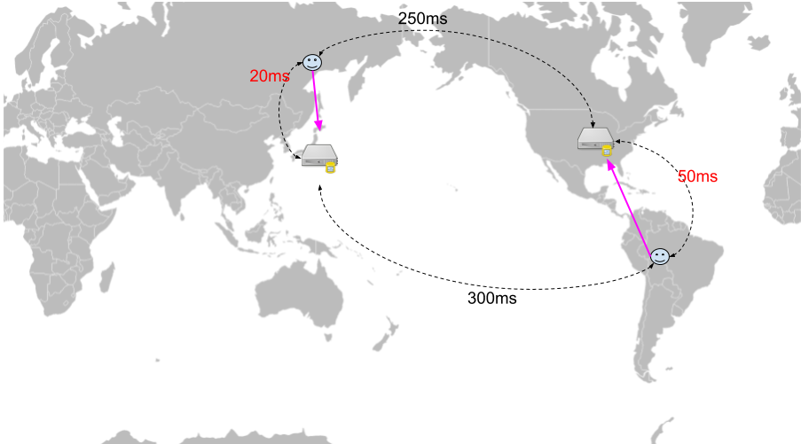

# GSLB(Global Server Load Balancing)
- 이름만 보면 얼핏 업그레이드된 로드 밸런싱 형태라고 생각할 수 있지만, 이름과는 다르게 DNS 서비스의 발전된 형태이다.

# DNS의 한계
- DNS는 도메인 주소와 IP를 매핑하여 도메인으로 요청이 들어왔을 때 타켓의 주소로 변환해 주는 서비스이다. 
- 하나의 도메인 주소에 대해서 여러 개의 IP주소를 넘겨 줄 수 있는데, 이 기능을 이용해서 가용성 구성과 로드 밸랜싱 기능을 수행하기도 한다. 
- DNS 뒤에 여러 IP를 붙여 고가용성과 로드 밸런싱 역할을 할 수 있긴 하겠지만 근본적으로는 한계가 있다.

>  DNS의 로드 밸런싱은 IP 목록중 하나를 반환할 뿐(라운드로빈?) 네트워크 지연, 성능, 트래픽 유입, 서비스 실패 등은 전혀 고려하지 않는다. 


--- 

## GSLB & DNS 동작방식 차이


### 1. 재해복구 


## DNS

<br>
<div align="center">
    
</div>

- DNS는 서버의 상태를  알 수 없기 때문에 서버시를 실패하는 유저들이 다수 존재한다.


## GSLB

<br>
<div align="center">
    
</div>

- GSLB는 서버의 상태를 모니터링 하기 때문에 실패한 서버의 IP는 응답(Converting Domain to IP response) 에서 제외하므로, 유저는 서비스를 계속해서 이용할 수 있다.


---

### 2. 로드밸런싱

## DNS

<br>
<div align="center">
    
</div>

- 위에서 간단히 설명한 것과 같이 DNS는 Round Robin 방식으로 로드밸런싱한다. 
- 작은 서비스는 크게 문제 없겠지만 트래픽이 아주 높은 서비스 같은 경우는 정교한 로드 밸런싱이 필요하다.


## GSLB

<br>
<div align="center">
    
</div>

- GSLB는 서버의 로드(상태)를 모니터링하기 때문에 트래픽이 몰리지 않은 서버의 IP를 반환해주기 때문에 DNS보다 정교한 로드밸런싱이 가능하다.

---

### 3. 레이턴시 기반

## DNS

<br>
<div align="center">
    
</div>

- DNS는 Round Robin 방식을 사용하기 때문에 유저는 자신이 위치한 곳과 아주 먼곳에 떨어진 서버로 연결이 될 수도 있다.


## GSLB

<br>
<div align="center">
    
</div>

- GSLB는 각 지역별로 서버에 대한 레이턴시(latency) 정보를 가지고 있기 때문에 해당 유저로부터 레이턴시가 적은 서버의 IP를 반환해준다.

---


### 4.위치 기반

## DNS

<br>
<div align="center">
    
</div>

- DNS는 Round Robin 방식을 사용


## GSLB

<br>
<div align="center">
    
</div>

- GSLB는 유저의 지역정보를 기반해서 가까운 지역의 서버로 연결

---


```출처

1. https://coding-start.tistory.com/339
```

