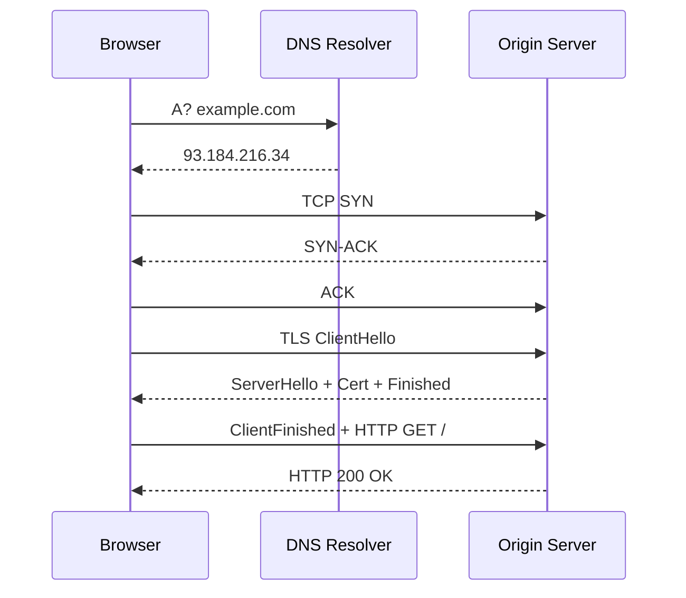
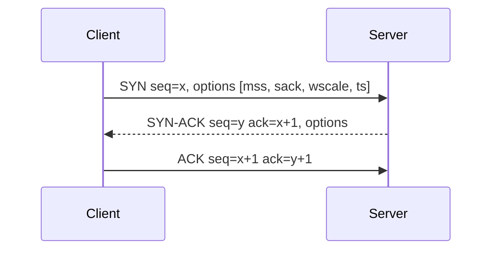
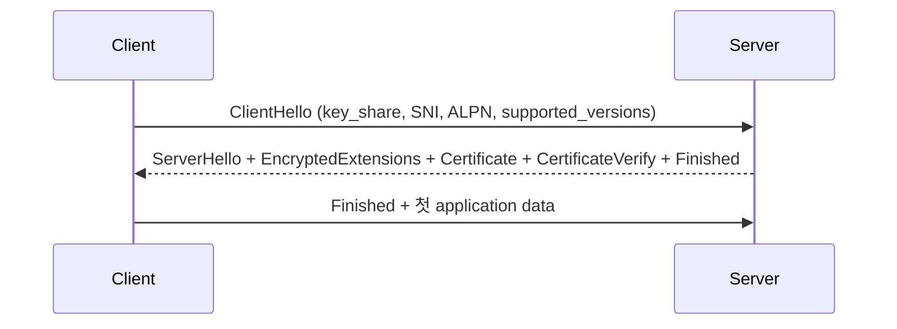
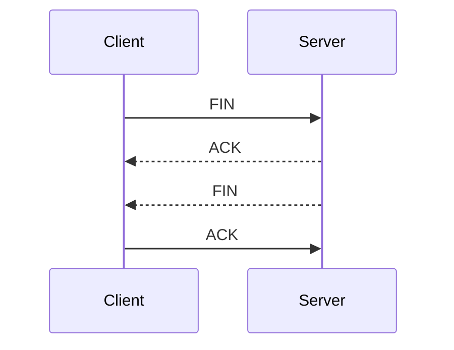

# 네트워크 플로우

브라우저 주소창에 URL을 입력하고 Enter를 누른 순간부터 화면에 페이지가 그려지기까지 패킷 단위로 무슨 일이 벌어지는지 정리한 문서. 단계마다 실제 캡처 예시를 함께 본다.

---

## 전체 그림

`curl https://example.com` 한 줄이 끝나기까지 거치는 단계는 6개다.

1. URL 파싱 — 브라우저 또는 OS가 URL을 구성 요소로 분해
2. DNS 조회 — 도메인을 IP로 변환
3. TCP 3-way handshake — 신뢰성 있는 연결 수립
4. TLS handshake — 암호화 채널 협상
5. HTTP 요청/응답 — 실제 데이터 교환
6. 연결 종료 또는 keep-alive 유지

각 단계는 curl의 타이밍 변수로 측정한다. 실제 호출 결과는 보통 이렇게 나온다.

```bash
$ curl -o /dev/null -s -w \
  "dns: %{time_namelookup}\ntcp: %{time_connect}\ntls: %{time_appconnect}\nttfb: %{time_starttransfer}\ntotal: %{time_total}\n" \
  https://example.com

dns:   0.012
tcp:   0.028   # dns + tcp handshake
tls:   0.082   # + tls handshake
ttfb:  0.143   # + http 요청 전송 및 첫 바이트 수신
total: 0.144
```

누적값에서 앞 단계를 빼면 단계별 순수 소요 시간이 나온다. tcp - dns = 16ms (TCP 핸드셰이크 RTT 한 번), tls - tcp = 54ms (TLS 1.2 기준 RTT 2회 분량), ttfb - tls = 61ms (서버 처리 + 첫 바이트 도달).



---

## 1. URL 파싱

`https://api.example.com:8443/users/42?tab=profile#bio` 라는 문자열은 브라우저 내부에서 6개 필드로 분해된다.

- scheme: `https`
- host: `api.example.com`
- port: `8443` (생략 시 scheme 기본값 — http=80, https=443)
- path: `/users/42`
- query: `tab=profile`
- fragment: `bio` — 서버로 전송되지 않음

fragment는 클라이언트 전용이다. 서버 액세스 로그에서 `#` 뒷부분을 보려는 시도는 의미가 없다. 라우터 단에서 fragment 기반 라우팅을 하려고 시간을 쓴 적이 있는데, 브라우저가 애초에 그 부분을 전송하지 않는다는 사실을 확인하고 한 번에 정리됐다.

스킴이 `https`면 TLS 단계가 들어가고, `http`면 평문 TCP로 바로 진행된다. `wss`는 HTTP 업그레이드를 거쳐 WebSocket으로 전환되는 흐름이라 핸드셰이크는 HTTPS와 동일하다.

---

## 2. DNS 조회

브라우저는 OS에 호스트명만 넘기고, 실제 조회는 OS의 stub resolver와 그 뒤의 recursive resolver가 처리한다. 단계마다 캐시가 끼어든다.

### 캐시 계층

1. 브라우저 내장 DNS 캐시 — Chrome은 `chrome://net-internals/#dns` 에서 확인. TTL 60초 내외로 짧게 잡힌다.
2. OS resolver 캐시 — macOS는 `sudo dscacheutil -flushcache` 와 `sudo killall -HUP mDNSResponder`, Linux는 `systemd-resolve --statistics`.
3. recursive resolver 캐시 — ISP, 8.8.8.8, 1.1.1.1 같은 외부 resolver가 들고 있는 캐시.
4. authoritative 응답 — 캐시 미스가 끝까지 내려갔을 때 도메인 소유자가 운영하는 네임서버가 답한다.

캐시가 한 번도 안 맞을 때의 풀 쿼리는 root → TLD(.com) → authoritative 순으로 3홉이 일어난다. iterative 모드로 보면 이렇다.

```bash
$ dig +trace example.com

;; .                       518400  IN  NS  a.root-servers.net.   # root에 질의
;; com.                    172800  IN  NS  a.gtld-servers.net.   # TLD가 .com 네임서버 응답
;; example.com.            172800  IN  NS  a.iana-servers.net.   # authoritative 위임
;; example.com.            86400   IN  A   93.184.216.34         # 최종 A 레코드
```

### 실제 캡처

`tcpdump`로 53/UDP를 잡으면 질의와 응답 한 쌍이 보인다.

```bash
$ sudo tcpdump -i en0 -n port 53

15:02:11.123 IP 192.168.0.10.54123 > 1.1.1.1.53: 47120+ A? example.com. (29)
15:02:11.139 IP 1.1.1.1.53 > 192.168.0.10.54123: 47120 1/0/0 A 93.184.216.34 (45)
```

47120은 트랜잭션 ID. 응답의 ID가 요청과 같아야 매칭된다. UDP는 무상태라 ID 매칭이 유일한 신원 확인 수단이다. 이게 DNS 캐시 포이즈닝의 공격 표면이 되어 0x20 인코딩이나 DNSSEC, DoT/DoH 같은 보완책이 나왔다.

### 흔히 마주치는 문제

응답이 512바이트를 넘으면 UDP가 잘려서 TC 비트가 켜진 채 돌아오고, 클라이언트는 같은 질의를 TCP/53으로 다시 보낸다. 방화벽이 TCP/53을 막아둔 환경에서 DNSSEC 응답이 안 와서 한참 디버깅한 적이 있다.

TTL이 5분인 레코드를 60초 뒤에 바꾸면 전 세계 resolver 캐시가 정리되기까지 최대 5분에 클라이언트 캐시까지 더해진다. 배포 직전 DNS TTL을 30초로 줄여놓는 습관이 도움된다.

`/etc/hosts` 가 모든 resolver보다 우선한다. 로컬에서 DNS가 이상하면 hosts 파일부터 본다.

---

## 3. TCP 3-way Handshake

DNS로 받은 IP에 대고 TCP 연결을 연다. 표면적으로는 SYN → SYN-ACK → ACK 세 패킷이지만, 안에서 협상되는 항목이 의외로 많다.

### 핸드셰이크 시퀀스



SYN에 실리는 옵션을 보면 이 연결의 성격이 잡힌다.

- MSS — 한 세그먼트에 담을 수 있는 최대 페이로드. 이더넷 기본은 1460이지만 VPN/터널 환경에서는 더 작게 광고된다. 작은 MSS는 TLS 핸드셰이크 메시지가 여러 세그먼트로 쪼개지는 원인이다.
- Window Scale — 64KB 윈도 제한을 푸는 스케일 인자. 양쪽이 광고해야 적용된다. 한쪽이 옵션을 제거하면 윈도가 64KB로 고정된다.
- SACK permitted — 손실 구간만 선택 재전송할지 합의.
- Timestamps — RTT 측정과 PAWS(시퀀스 랩어라운드 방어) 용.

### 실제 캡처

```bash
$ sudo tcpdump -i en0 -n -S 'host 93.184.216.34 and port 443'

15:02:11.200 192.168.0.10.55001 > 93.184.216.34.443: Flags [S], seq 1000, win 65535,
    options [mss 1460,sackOK,TS val 1 ecr 0,nop,wscale 7]
15:02:11.220 93.184.216.34.443 > 192.168.0.10.55001: Flags [S.], seq 9000, ack 1001, win 65535,
    options [mss 1452,sackOK,TS val 9 ecr 1,nop,wscale 8]
15:02:11.220 192.168.0.10.55001 > 93.184.216.34.443: Flags [.], ack 9001, win 65535
```

`-S` 옵션이 시퀀스 번호를 상대값이 아닌 절대값으로 보여준다. SYN 한 번에 seq+1, SYN-ACK 한 번에 ack+1 이 되는 것을 직접 확인할 수 있다.

### SYN이 사라지면

방화벽이 drop 하면 SYN-ACK가 안 와서 클라이언트는 1초, 3초, 7초… 식으로 지수 backoff로 재전송한다. 끝까지 응답이 없으면 보통 `connect: timed out` 으로 끝난다.

RST가 돌아오는 경우는 포트는 열려 있는데 프로세스가 죽었거나 listen queue가 가득 찼다. `ss -lnt` 의 `Send-Q` 가 listen backlog 한도, `Recv-Q` 가 현재 대기 중인 SYN 수다. backlog 부족은 트래픽 스파이크 때 502가 튀는 흔한 원인이다.

---

## 4. TLS Handshake

TCP가 연결되면 그 위에서 TLS 협상이 일어난다. 1.2와 1.3은 RTT 수가 다르다. 1.2는 풀 핸드셰이크에 2 RTT, 1.3은 1 RTT, 세션 재개면 0-RTT까지 내려간다.

### TLS 1.3 풀 핸드셰이크



ClientHello가 평문이라서 SNI에 들어 있는 도메인은 그대로 노출된다. 사내 프록시가 SNI만 보고 도메인 기반 차단을 거는 이유이고, ECH(Encrypted Client Hello)가 도입되는 배경이다.

### TLS 1.2와의 비교

1.2는 ClientHello → ServerHello/Certificate → ClientKeyExchange → ChangeCipherSpec/Finished → ChangeCipherSpec/Finished 로 RTT 두 번이 든다. 53ms RTT 환경에서 풀 핸드셰이크가 110ms 가까이 걸리던 게 1.3으로 가면 절반이 된다.

세션 재개는 1.2의 Session ID/Ticket, 1.3의 PSK 모드가 있다. PSK + early_data 조합이면 첫 application data가 ClientHello에 동봉되어 RTT 0으로 들어간다. 멱등하지 않은 요청에 early_data를 쓰면 재생 공격에 노출되니 GET만 허용하는 게 보통이다.

### 인증서 검증

서버가 보낸 Certificate 체인은 클라이언트 측에서 다음 순서로 검증된다.

1. 서명 체인을 따라 트러스트 스토어의 루트까지 도달하는가
2. SAN(또는 CN)에 요청 호스트가 들어 있는가
3. notBefore ≤ 현재 시간 ≤ notAfter
4. OCSP 또는 CRL로 폐기 여부 확인

OCSP stapling이 켜진 서버는 ServerHello 시점에 OCSP 응답을 같이 묶어준다. stapling이 없으면 클라이언트가 별도 HTTP 요청으로 OCSP responder에 다녀와야 해서 추가 RTT가 든다.

### 실제 핸드셰이크 캡처

```bash
$ openssl s_client -connect example.com:443 -servername example.com -tls1_3 -msg

>>> TLS 1.3 [length 005a], Handshake
    01 00 00 56 03 03 ... ClientHello
<<< TLS 1.3 [length 007a], Handshake
    02 00 00 76 03 03 ... ServerHello
<<< TLS 1.3 [length 0017], ChangeCipherSpec
<<< TLS 1.3 [length 09e6], Handshake
    08 ... EncryptedExtensions
    0b ... Certificate
    0f ... CertificateVerify
    14 ... Finished
>>> TLS 1.3 [length 0035], Handshake
    14 ... Finished
```

핸드셰이크 메시지 타입을 외워두면 캡처가 빨리 읽힌다. 01=ClientHello, 02=ServerHello, 0b=Certificate, 0f=CertificateVerify, 14=Finished.

### 자주 보는 에러

`tlsv1 alert handshake failure` — 클라이언트와 서버의 지원 cipher 교집합이 없다. 구형 안드로이드가 새 TLS만 켠 서버에 붙으려고 할 때 나온다.

`certificate verify failed: unable to get local issuer certificate` — 중간 인증서가 체인에 빠져 있다. `openssl s_client -showcerts` 로 서버가 보내는 체인을 직접 확인하면 된다.

`SSL_ERROR_SYSCALL` 직후 즉시 연결 끊김 — 보통 SNI 기반 라우팅에서 매칭되는 vhost가 없을 때 발생한다.

---

## 5. HTTP 요청과 응답

TLS 채널이 열리면 그 위로 HTTP 메시지가 흐른다. HTTP/1.1, HTTP/2, HTTP/3에 따라 와이어 포맷이 다르지만 의미상 메시지는 같다.

### HTTP/1.1 요청 라인

```http
GET /users/42?tab=profile HTTP/1.1
Host: api.example.com
User-Agent: curl/8.4.0
Accept: */*
Cookie: session=abc123
```

요청 라인 + 헤더 + 빈 줄 + 바디. 헤더 끝을 `\r\n\r\n` 으로 구분한다. Host 헤더는 1.1에서 필수다. 가상 호스트 라우팅이 이 한 줄로 결정된다.

### HTTP/2의 변화

요청은 같은 의미지만 와이어 포맷은 바이너리 프레임이다. 헤더는 HPACK으로 압축되고, 한 TCP 연결 위에서 stream ID로 다중화된다. 같은 TLS 세션 안에서 동시에 100개 이상 요청이 진행되는 게 보통이다.

ALPN에서 `h2` 가 협상되어야 HTTP/2로 진입한다. ClientHello의 ALPN 확장에 `h2, http/1.1` 을 광고하고 서버가 `h2` 를 고르면 그 위로 HTTP/2 프레임이 흐른다.

### HTTP/3

전송이 TCP가 아니라 UDP 위의 QUIC다. TLS가 QUIC에 내장되어 있어서 별도 핸드셰이크가 아니라 QUIC 초기 패킷에 ClientHello가 실린다. 0-RTT 재개가 표준화되어 있고, head-of-line blocking이 stream 단위로 격리된다.

### curl로 본 응답

```bash
$ curl -v https://example.com 2>&1 | grep -E '^(>|<|\*)'

* Connected to example.com (93.184.216.34) port 443
* ALPN: server accepted h2
* SSL connection using TLSv1.3 / TLS_AES_128_GCM_SHA256
> GET / HTTP/2
> Host: example.com
> User-Agent: curl/8.4.0
> Accept: */*
>
< HTTP/2 200
< content-type: text/html; charset=UTF-8
< date: Mon, 03 Jun 2026 06:02:12 GMT
< server: ECS (dcb/7F50)
< content-length: 1256
```

`>` 는 송신, `<` 는 수신, `*` 는 libcurl의 메타 로그. 디버깅할 때 이 세 기호만 구분해도 흐름이 잡힌다.

### 응답 상태 코드의 실무 의미

- 1xx — 100 Continue는 큰 PUT/POST를 보낼 때 `Expect: 100-continue` 와 짝지어 쓴다. 본문을 보내기 전에 서버가 받을 의향이 있는지 확인하는 절차.
- 2xx — 200, 201, 204. 204(No Content)는 응답 바디가 없다는 약속이라 클라이언트가 바디를 읽지 않는다. JSON을 담으면 파싱 단에서 깨진다.
- 3xx — 301과 308은 영구, 302와 307은 일시 리다이렉트. 301/302는 메서드를 GET으로 바꿔도 되는 반면 307/308은 원래 메서드를 유지한다. POST 리다이렉트가 GET으로 변하는 버그는 거의 다 이걸 잘못 쓴 경우다.
- 4xx — 클라이언트 측 문제. 429는 Retry-After 헤더와 짝이고, 401은 WWW-Authenticate 헤더가 따라온다.
- 5xx — 서버 측. 502는 게이트웨이 뒤쪽 업스트림 실패, 503은 서버 자신이 의도적 거절, 504는 게이트웨이 timeout.

---

## 6. 응답 처리와 연결 종료

서버가 바디까지 다 보내면 클라이언트는 Content-Length 또는 Transfer-Encoding: chunked 로 끝을 안다. chunked는 마지막에 0 길이 청크가 오는 시점이 끝이다.

### Keep-Alive

HTTP/1.1은 기본이 keep-alive다. 응답이 끝나도 TCP 연결은 살려두고 다음 요청에 재사용한다. 서버가 `Connection: close` 를 보내거나 idle timeout을 넘기면 연결이 닫힌다. 한 페이지가 수십 개의 리소스를 불러올 때 keep-alive가 없으면 매번 TCP+TLS 핸드셰이크가 다시 일어난다.

### TCP 종료



FIN을 먼저 보낸 쪽이 TIME_WAIT 상태로 60초가량 머무른다. 정상 종료라면 양쪽에 시퀀스 번호 재사용 보호를 위해 이 상태가 필요하다. 짧은 시간에 새 연결을 대량으로 여닫는 서버에서 TIME_WAIT가 쌓이면 ephemeral port가 고갈된다. `ss -tan state time-wait | wc -l` 로 모니터링한다.

---

## 단계별 지연 분리

성능 문제가 들어왔을 때 어느 단계가 느린지 분리해야 다음 조치가 정해진다.

```bash
$ curl -o /dev/null -s -w \
  "namelookup:    %{time_namelookup}\nconnect:       %{time_connect}\nappconnect:    %{time_appconnect}\npretransfer:   %{time_pretransfer}\nstarttransfer: %{time_starttransfer}\ntotal:         %{time_total}\n" \
  https://example.com

namelookup:    0.012
connect:       0.028
appconnect:    0.082
pretransfer:   0.082
starttransfer: 0.143
total:         0.144
```

각 변수는 누적 시간이다. 단계별로 빼야 순수값이 나온다.

| 단계 | 계산 | 의미 |
|---|---|---|
| DNS | namelookup | 도메인 → IP |
| TCP | connect - namelookup | 3-way handshake RTT 한 번 |
| TLS | appconnect - connect | 핸드셰이크 RTT (1.2면 2회, 1.3이면 1회) |
| 서버 처리 + 첫 바이트 | starttransfer - appconnect | 서버 응답 생성 시간이 사실상 여기에 들어간다 |
| 본문 다운로드 | total - starttransfer | 바디 크기와 대역폭에 비례 |

ttfb가 길고 나머지가 짧으면 서버 측 처리(쿼리, 외부 API, 락 대기)가 범인이다. tls 단계만 길면 인증서 체인 검증, OCSP, 핸드셰이크 협상 실패 후 재시도를 의심한다. tcp만 길면 패킷 손실에 따른 SYN 재전송, 또는 라우팅 우회.

---

## 캡처를 파일로 떠서 보기

실시간 tcpdump는 빠르고, Wireshark는 단계 디코딩이 풍부하다. 둘을 같이 쓴다.

```bash
$ sudo tcpdump -i en0 -n -w session.pcap 'host example.com'
# 트래픽 발생 후 Ctrl-C
$ wireshark session.pcap
```

Wireshark 안에서 Statistics → Conversations 로 가면 이 연결이 RTT 몇 번이 들었는지, 재전송이 얼마나 있었는지가 표로 나온다. TLS는 키 자료가 있어야 복호화가 되는데, `SSLKEYLOGFILE` 환경변수를 설정하고 브라우저나 curl을 실행하면 세션 키가 로그로 떨어진다. Wireshark의 TLS 설정에 이 파일 경로를 넣으면 응답 바디까지 평문으로 보인다.

---

## 트러블슈팅 사례

### 가끔 첫 요청이 5초씩 느려진다

curl 타이밍을 측정해보면 namelookup이 5초로 튄다. resolver 한 곳이 응답을 안 주고, 5초 타임아웃 후 다음 resolver로 fallback 한 것이다. `/etc/resolv.conf` 의 `options timeout:1 attempts:2` 같은 설정으로 fallback을 빠르게 만든다. systemd-resolved 환경이면 `resolvectl statistics` 로 어느 서버가 실패하는지 보인다.

### 프록시 뒤에서만 SSL 에러가 난다

대부분 SNI를 안 보내는 구형 클라이언트가 vhost를 못 찾는 경우다. `curl -vk --resolve example.com:443:1.2.3.4 https://example.com` 으로 SNI를 명시해서 재현해본다. 다른 케이스는 사내 MITM 프록시가 발급한 자체 서명 인증서가 OS 트러스트 스토어에 없는 경우.

### POST가 GET으로 바뀐다

리다이렉트 응답이 301 또는 302인데 클라이언트가 RFC 권고를 따라 메서드를 GET으로 변경했다. 메서드 보존이 필요하면 서버가 307/308을 보내야 한다.

### TIME_WAIT가 만 단위로 쌓인다

요청마다 새 connection을 여는 클라이언트(또는 keep-alive를 꺼둔 HTTP 라이브러리)가 범인이다. 클라이언트 측에서 connection pool을 켜고, 서버는 `tcp_tw_reuse` 또는 라우팅 단의 LB로 분산. `net.ipv4.ip_local_port_range` 를 넓혀 ephemeral 포트 풀을 늘리는 것이 단기 처방.

---

## 참고자료

> [1] [RFC 9110 — HTTP Semantics](https://www.rfc-editor.org/rfc/rfc9110)
>
> [2] [RFC 8446 — TLS 1.3](https://www.rfc-editor.org/rfc/rfc8446)
>
> [3] [RFC 1035 — Domain Names](https://www.rfc-editor.org/rfc/rfc1035)
>
> [4] [High Performance Browser Networking](https://hpbn.co/)
