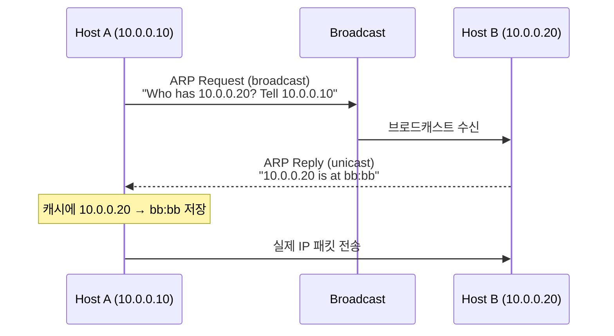

# ARP — IP와 MAC을 잇는 끈

## 들어가며

ARP는 평소에는 잘 보이지 않는다. 핑이 통하고 SSH가 붙으면 그것으로 끝이다. 그러다 어느 날 AWS에서 ENI를 떼고 다른 서버에 옮겨 붙였는데 외부에서 트래픽이 안 들어온다거나, 사내망에서 IP를 새로 받았는데 30초쯤 통신이 끊긴다거나, VRRP 페일오버가 끝났는데 클라이언트가 옛 서버를 계속 찾아간다거나 하는 일이 생긴다. 그때마다 결국 ARP 테이블을 들여다보게 된다.

ARP(Address Resolution Protocol)는 같은 링크 위에 있는 호스트의 IP 주소를 MAC 주소로 바꿔주는 프로토콜이다. RFC 826에서 정의됐고 1982년부터 거의 그대로 쓰인다. 단순한 만큼 허점도 있고, 그 허점이 보안 사고로 이어진 사례가 산더미처럼 쌓여 있다.

이 문서는 ARP의 동작 원리, 패킷 구조, 캐시 관리, Gratuitous/Proxy/Reverse ARP 같은 변종, 그리고 실제 운영에서 부딪히는 문제들을 정리한 글이다.

## ARP가 필요한 이유

IP는 논리적 주소다. MAC은 물리적 주소다. 호스트가 같은 이더넷 세그먼트 위에 있는 다른 호스트에 패킷을 보내려면 결국 이더넷 프레임을 만들어야 한다. 이더넷 프레임의 목적지 필드는 IP가 아니라 MAC이다. 그래서 송신자는 "내가 보내려는 IP의 MAC이 뭐냐"를 알아내야 한다. 그 질문을 던지는 게 ARP다.

ARP의 위치는 어딘가 어정쩡하다. OSI 모델에서는 보통 2.5계층 또는 L2와 L3 사이라고 부른다. ARP 패킷 자체는 IP 헤더를 거치지 않는다. 이더넷 프레임 위에 EtherType 0x0806으로 바로 실린다. 그러면서도 ARP가 해결하려는 대상은 L3 주소(IP)다.

```
[Ethernet 헤더 EtherType=0x0806] [ARP 패킷 28바이트]
```

IP 위에 얹히는 ICMP와 다르다. ARP는 IP 없이도 동작하며, 오히려 IP가 동작하려면 ARP가 먼저 끝나야 한다. IP 패킷을 보내기 직전, 커널은 라우팅 테이블에서 next-hop을 결정한 다음 그 next-hop의 MAC을 ARP 캐시에서 찾는다. 없으면 ARP Request를 쏘고, 응답을 기다린 뒤에야 실제 패킷이 나간다. 그래서 ARP가 막힌 네트워크에서는 IP 통신 자체가 시작되지 않는다.

## ARP 패킷 구조

ARP 패킷은 28바이트 고정이다. 이더넷 프레임 위에 그대로 실린다.

```
 0                   1                   2                   3
 0 1 2 3 4 5 6 7 8 9 0 1 2 3 4 5 6 7 8 9 0 1 2 3 4 5 6 7 8 9 0 1
+-------------------------------+-------------------------------+
|     Hardware Type (2)         |     Protocol Type (2)         |
+---------------+---------------+-------------------------------+
| HW Len (1)    | Proto Len (1) |       Opcode (2)              |
+---------------+---------------+-------------------------------+
|              Sender Hardware Address (6 bytes)                |
+---------------------------------------------------------------+
|              Sender Protocol Address (4 bytes)                |
+---------------------------------------------------------------+
|              Target Hardware Address (6 bytes)                |
+---------------------------------------------------------------+
|              Target Protocol Address (4 bytes)                |
+---------------------------------------------------------------+
```

- **Hardware Type**: 1이면 이더넷. 거의 항상 1이다.
- **Protocol Type**: 0x0800이면 IPv4. IPv6는 ARP를 안 쓰니 여기 들어올 일이 없다.
- **HW Len / Proto Len**: 각각 6, 4. 이더넷 MAC은 6바이트, IPv4 주소는 4바이트다.
- **Opcode**: 1이면 Request, 2면 Reply. RARP는 3과 4를 쓴다.
- **Sender HW/Protocol Address**: 보내는 쪽의 MAC과 IP.
- **Target HW/Protocol Address**: Request에서는 Target HW가 전부 0이다(모르니까). Reply에서는 채워져서 돌아온다.

이 단순한 구조 때문에 ARP는 검증 수단이 거의 없다. 누가 어떤 IP의 응답을 보내든 받는 쪽은 그냥 믿는다. ARP Spoofing이 가능한 근본 원인이 여기에 있다.

## ARP Request / Reply 흐름

같은 서브넷에 있는 호스트 A(10.0.0.10, MAC aa:aa)가 호스트 B(10.0.0.20, MAC bb:bb)에 패킷을 보내야 한다고 하자.



Request는 브로드캐스트(목적 MAC ff:ff:ff:ff:ff:ff)다. 그래서 같은 L2 세그먼트 위의 모든 호스트가 수신한다. 자기 IP가 아니면 무시하고, 자기 IP면 Reply를 만들어 유니캐스트로 돌려준다. Reply가 유니캐스트인 이유는 받는 쪽이 누구인지 Request의 Sender 필드에서 이미 알았기 때문이다.

브로드캐스트는 비싸다. 같은 VLAN의 모든 NIC 인터럽트를 깨우고, 모든 호스트의 커널이 ARP 패킷을 파싱한다. 그래서 큰 L2 세그먼트(/22 이상)에서는 ARP 스톰이 운영 이슈가 된다. 데이터센터에서 L2 도메인을 작게 가져가는 이유 중 하나가 ARP 부하 때문이다.

## ARP 캐시와 TTL

매번 ARP Request를 쏘면 너무 비싸다. 그래서 모든 호스트는 ARP 캐시를 들고 있다. 한 번 해석된 IP↔MAC 매핑을 일정 시간 보관한다.

리눅스에서 캐시 상태와 만료 시간은 `/proc/sys/net/ipv4/neigh/<iface>/` 아래에 있다. 주요 파라미터를 보자.

```bash
$ sysctl net.ipv4.neigh.default
net.ipv4.neigh.default.base_reachable_time_ms = 30000
net.ipv4.neigh.default.gc_stale_time = 60
net.ipv4.neigh.default.gc_thresh1 = 128
net.ipv4.neigh.default.gc_thresh2 = 512
net.ipv4.neigh.default.gc_thresh3 = 1024
net.ipv4.neigh.default.retrans_time_ms = 1000
```

- `base_reachable_time_ms`: 한 엔트리가 REACHABLE 상태로 머무는 기준 시간. 리눅스는 여기에 0.5x~1.5x 사이의 랜덤 지터를 곱한다. 한꺼번에 만료되는 걸 피하려고.
- `gc_stale_time`: STALE 상태에서 사용되지 않은 채 이 시간을 넘기면 GC 대상이 된다.
- `gc_thresh1/2/3`: 캐시 크기 임계치. thresh3을 넘기면 새 엔트리가 거절된다. 대규모 베어메탈 클러스터에서 이 값을 안 올려서 사고 나는 경우가 흔하다.

리눅스 ARP 캐시는 단순 TTL이 아니라 상태 머신이다.

| 상태 | 의미 |
|---|---|
| INCOMPLETE | Request를 보내고 응답 대기 중 |
| REACHABLE | 최근에 응답을 받았거나 양방향 트래픽이 확인됨 |
| STALE | 시간은 지났지만 엔트리는 아직 보관. 트래픽 발생 시 재검증 |
| DELAY | STALE 상태에서 트래픽 발생, 짧은 시간 동안 응답 기다림 |
| PROBE | 명시적으로 Unicast Request를 다시 보내 검증 중 |
| FAILED | 응답이 없어서 실패로 마킹 |

핵심은 STALE에서 곧바로 트래픽을 막지 않는다는 점이다. 일단 옛 MAC으로 보내고, 그 사이에 검증을 돌린다. 그래서 IP-MAC 매핑이 바뀐 직후 잠깐의 통신 단절이 생긴다. AWS ENI를 떼서 다른 인스턴스에 붙였을 때 즉시 안 통하는 게 이 STALE 구간 때문이다.

## arp / ip neigh 명령어

옛 리눅스에서는 `arp` 명령(net-tools 패키지)을 썼다. 지금은 deprecated이고 `ip neigh`(iproute2)가 표준이다.

```bash
# 현재 캐시 보기
$ ip neigh show
10.0.0.1 dev eth0 lladdr 00:1c:42:00:00:01 REACHABLE
10.0.0.20 dev eth0 lladdr bb:bb:bb:bb:bb:bb STALE
10.0.0.99 dev eth0  FAILED

# 특정 IP만 보기
$ ip neigh show 10.0.0.20

# 특정 엔트리 강제 삭제
$ sudo ip neigh del 10.0.0.20 dev eth0

# 정적 엔트리 추가 (재시작하면 사라짐)
$ sudo ip neigh add 10.0.0.99 lladdr cc:cc:cc:cc:cc:cc dev eth0 nud permanent

# 캐시 전체 비우기
$ sudo ip neigh flush all
$ sudo ip neigh flush dev eth0
```

`nud` 뒤의 값이 강제로 지정할 상태다. `permanent`로 박으면 만료되지 않는다. 라우터에 GARP가 안 들어오는 환경에서 임시방편으로 쓰지만, 운영에서는 거의 쓸 일이 없다. 정적 ARP 박아두고 잊은 사이 상대 NIC을 교체했다가 패킷이 사라지는 사고가 잘 일어난다.

`arp -n`은 아직도 손에 익은 사람이 많아 자주 보이지만 새 환경에서는 안 깔린 경우가 있다. macOS에는 `arp -a`가 그대로 있다.

## Gratuitous ARP

Gratuitous ARP(GARP)는 "묻지도 않았는데 보내는 ARP"다. Sender Protocol Address와 Target Protocol Address가 같은 ARP Request 또는 Reply 형식이다.

용도는 두 가지다.

**1) 자기 IP 충돌 감지.** 부팅 직후 또는 IP를 새로 받은 직후, 호스트는 "10.0.0.10이 누구냐"를 자기 자신 IP에 대해 던진다. 응답이 오면 누군가 같은 IP를 쓰고 있다는 뜻이다. 그러면 dhclient는 DHCPDECLINE을 보내고 IP를 반환한다.

**2) ARP 캐시 갱신 공지.** 페일오버나 IP 인수인계 시 "10.0.0.50의 MAC이 이제 나야"를 같은 서브넷에 일방 통보한다. 라우터와 다른 호스트들은 자기 캐시를 새 MAC으로 덮어쓴다.

VRRP, Keepalived, AWS의 ENI 이동, 그리고 GCP/Azure의 Floating IP가 전부 이걸 쓴다. 페일오버 시점에 새 액티브 노드가 GARP를 쏘지 않으면 라우터의 ARP 캐시는 옛 노드의 MAC을 계속 들고 있고, 트래픽은 죽은 노드로 흘러간다. 그래서 keepalived 설정에서 `garp_master_delay`나 `garp_master_repeat`를 잘못 잡으면 페일오버는 됐는데 트래픽은 몇 십 초 동안 검은 구멍에 떨어진다.

GARP는 보안 관점에서는 위험하다. 누구나 "10.0.0.1이 내 MAC이야"라고 일방적으로 외칠 수 있고, 라우터 IP를 그렇게 가로채는 게 ARP Spoofing이다. 뒤에서 다시 다룬다.

## Proxy ARP

같은 IP 서브넷에 있는데 물리적으로는 다른 세그먼트에 호스트가 있을 때, 또는 호스트가 라우팅을 모르고 같은 서브넷의 다른 호스트에 직접 보내려 할 때, 중간 라우터가 자기 MAC으로 ARP Reply를 대신 돌려주는 방식이다.

A가 "10.0.0.50이 어딨냐"고 묻는데 10.0.0.50이 실제로는 다른 인터페이스 뒤에 있다고 하자. 라우터는 그 사실을 알고 "10.0.0.50은 내 MAC이야"라고 거짓말한다. A는 라우터의 MAC으로 패킷을 보내고, 라우터가 실제 목적지로 라우팅해준다.

옛 환경에서 서브넷 마스크 설정이 엉망일 때 응급 처치로 쓰였다. AWS VPC에서도 ENI에 secondary IP를 붙이고 그걸 다른 VLAN 비슷한 환경에 노출시킬 때 Proxy ARP 비슷한 동작이 일어난다. 다만 진짜 클래식 Proxy ARP는 보안 사고의 출발점이 되는 경우가 많아 데이터센터에서는 거의 꺼둔다.

```bash
# 인터페이스별 Proxy ARP 활성화 (켜져있는지 확인)
$ cat /proc/sys/net/ipv4/conf/eth0/proxy_arp
0
$ sudo sysctl -w net.ipv4.conf.eth0.proxy_arp=1
```

켜기는 쉽다. 끄기 전에 트래픽이 사라질 수 있다는 사실을 기억해야 한다. 누가 어떤 의도로 켰는지 모르면 그대로 두는 게 낫다.

## Reverse ARP (RARP)

RARP는 반대 방향이다. 자기 MAC만 알고 있는 디스크리스 호스트가 부팅 시 "내 MAC이 이건데 IP가 뭐냐"고 묻는 프로토콜이다. RFC 903에서 정의됐는데 거의 사장됐다. BOOTP가 RARP를 대체했고, 그 다음 DHCP가 BOOTP를 대체했다.

지금 실무에서 RARP를 만날 일은 거의 없다. 옛 SAN 부팅이나 임베디드 장비 일부에 남아 있는 정도다. 면접에서 가끔 물어보지만 실제로 패킷을 잡아본 사람은 드물다.

## 같은 서브넷 vs 다른 서브넷

ARP는 같은 L2 브로드캐스트 도메인 안에서만 동작한다. 다른 서브넷의 호스트 MAC을 ARP로 직접 알아낼 수 없다.

호스트 A(10.0.0.10/24)가 B(192.168.1.5)에 패킷을 보낸다고 하자. B는 다른 서브넷이다.

1. 커널이 라우팅 테이블을 본다. `192.168.1.0/24`로 가는 길은 기본 게이트웨이(10.0.0.1)다.
2. 게이트웨이 10.0.0.1의 MAC을 ARP 캐시에서 찾는다. 없으면 ARP Request를 쏜다.
3. 게이트웨이가 Reply를 돌려준다.
4. A는 이더넷 프레임의 목적 MAC을 **게이트웨이 MAC**으로 설정하고, IP 헤더의 목적 IP는 **B의 IP**로 설정해서 보낸다.
5. 게이트웨이가 받아서 다음 홉을 결정한 뒤 새 이더넷 프레임을 만들어 전달한다.

핵심은 목적지가 다른 서브넷이면 ARP는 게이트웨이 MAC만 묻는다는 점이다. B의 MAC은 영원히 모른다. 알 필요가 없다.

이 사실을 모르면 트러블슈팅에서 자주 헤맨다. "10.0.0.10에서 192.168.1.5로 핑이 안 가는데 ARP 캐시에 192.168.1.5가 왜 없냐"고 묻는 케이스가 흔하다. 없는 게 정상이다.

같은 서브넷 안의 호스트라면 그 호스트의 MAC을 직접 묻는다. 이 차이는 NetworkManager나 systemd-networkd의 라우팅 출력에서 `via`가 있느냐 없느냐로 드러난다.

## ARP Spoofing 공격

ARP는 응답을 검증하지 않는다. 공격자가 "라우터 IP의 MAC은 내 MAC이야"라고 Reply 또는 GARP를 뿌리면 같은 서브넷의 모든 호스트가 자기 캐시를 덮어쓴다. 그 뒤로 인터넷으로 나가는 모든 트래픽이 공격자 호스트를 거친다. 공격자는 그걸 다시 진짜 라우터에 전달한다(MITM). 호스트는 인터넷이 정상으로 보인다.

이중으로 더 악질인 경우는 SSL Strip이나 패킷 수정과 결합될 때다. HTTPS가 보편화된 지금은 HSTS와 TLS로 1차 방어가 되지만, 평문 프로토콜이 한 줄이라도 섞여 있으면 그 라인은 그대로 노출된다.

운영 환경의 방어 수단은 크게 셋이다.

**1) DAI (Dynamic ARP Inspection).** Cisco/Aruba 같은 엔터프라이즈 스위치 기능. DHCP Snooping과 함께 동작한다. 스위치가 DHCP 트랜잭션을 엿보면서 "포트 7번에 붙은 호스트의 IP는 10.0.0.50, MAC은 aa:aa"라는 바인딩 테이블을 만든다. 그 뒤로 그 포트에서 다른 IP-MAC 조합의 ARP 패킷이 나오면 드롭한다. 데이터센터의 표준이다.

**2) 정적 ARP 엔트리.** 게이트웨이의 MAC을 모든 호스트에 박아두는 방식. 운영 부담이 커서 가벼운 환경에서만 쓴다. NIC 교체 한 번이면 전부 다시 작업해야 한다.

**3) arpwatch / arp-scan.** ARP 변경을 모니터링해서 알람을 띄우는 방식. 막지는 못하지만 사후 추적은 된다. 작은 사무실 네트워크에서 가성비가 좋다.

AWS, GCP, Azure 같은 퍼블릭 클라우드의 가상 네트워크는 ARP 스푸핑이 원천적으로 막혀 있다. 하이퍼바이저가 가상 NIC의 MAC을 통제하고, 인스턴스가 임의로 다른 MAC을 가장하면 그 프레임을 드롭한다. EC2의 source/destination check가 그 일부다. 그래서 클라우드 안에서는 ARP 보안을 거의 신경 쓸 일이 없다.

## AWS VPC에서 만나는 ARP 문제

클라우드라고 ARP가 사라진 건 아니다. 가상화돼서 보이지 않을 뿐이다. 운영하다 보면 결국 ARP 캐시 문제로 헤매는 순간이 온다.

**1) ENI 이동 직후 통신 단절.** ENI를 인스턴스 A에서 떼고 인스턴스 B에 붙이면 ENI의 MAC은 그대로 따라간다. AWS가 알아서 GARP를 뿌려주긴 하는데, 라우터(VPC 라우팅)나 같은 서브넷의 다른 인스턴스의 캐시가 즉시 갱신되지 않으면 몇 초~30초 정도 통신이 끊긴다. EIP 재할당이나 인스턴스 재시작으로 우회한다.

**2) Secondary Private IP의 ARP.** ENI에 secondary IP를 붙여서 컨테이너에 할당하는 패턴(AWS VPC CNI 같은)에서는 호스트 OS의 ARP 응답 설정이 중요하다. `arp_ignore`, `arp_announce` sysctl을 잘못 잡으면 ENI 위의 secondary IP에 대한 ARP Request에 호스트가 응답을 안 하거나, 엉뚱한 인터페이스로 응답해서 패킷이 사라진다.

```bash
$ sysctl net.ipv4.conf.all.arp_ignore
net.ipv4.conf.all.arp_ignore = 0
$ sysctl net.ipv4.conf.all.arp_announce
net.ipv4.conf.all.arp_announce = 0
```

- `arp_ignore=0`은 어느 인터페이스로 들어온 ARP Request든 자기가 가진 IP면 응답한다.
- `arp_ignore=1`은 Request가 들어온 인터페이스에 해당 IP가 직접 있을 때만 응답한다.
- `arp_announce=2`는 보낼 때 가장 적절한 소스 IP를 골라 쓴다.

멀티 NIC 또는 ENI 여러 개 붙은 인스턴스에서는 이 두 값을 1, 2로 잡는 게 안전한 경우가 많다. DSR(Direct Server Return) 로드밸런서 뒤의 호스트도 이 설정이 표준이다.

**3) Transit Gateway나 NLB 뒤의 트래픽 단절.** AWS의 가상 라우팅 계층이 결국 어딘가에서 MAC을 들고 있다. 인스턴스를 빠르게 교체하는 블루-그린 배포에서 짧은 단절이 보이면 ARP 캐시(혹은 그에 상응하는 매핑) 갱신 지연이 원인인 경우가 있다.

## IPv6의 NDP — ARP의 후계자

IPv6에는 ARP가 없다. 대신 NDP(Neighbor Discovery Protocol, RFC 4861)가 그 역할을 한다. NDP는 ICMPv6 위에서 동작한다. EtherType이 따로 있는 ARP와 달리 NDP는 IPv6 패킷 안에서 ICMPv6 타입으로 구분된다.

| 기능 | IPv4 (ARP) | IPv6 (NDP) |
|---|---|---|
| 주소 해석 | ARP Request/Reply | Neighbor Solicitation / Neighbor Advertisement |
| 게이트웨이 발견 | DHCP / 정적 설정 | Router Solicitation / Router Advertisement |
| 중복 주소 감지 | Gratuitous ARP | DAD (Duplicate Address Detection) |
| 도달성 확인 | GARP / 트래픽 관찰 | NUD (Neighbor Unreachability Detection) |
| 전송 방식 | 브로드캐스트 | 멀티캐스트 (Solicited-Node Multicast) |

NDP의 중요한 개선은 멀티캐스트다. ARP는 브로드캐스트라서 같은 세그먼트의 모든 호스트가 깨어난다. NDP는 IPv6 주소에서 파생된 Solicited-Node Multicast 그룹(`ff02::1:ffXX:XXXX`)으로 보내기 때문에 관심 있는 소수만 받는다. 큰 L2에서 ARP 스톰을 피하는 이유 하나가 여기서 해소된다.

NDP도 ARP와 마찬가지로 기본적으로 응답을 검증하지 않는다. NDP Spoofing이 가능하다. 방어 수단으로 SEND(Secure Neighbor Discovery, RFC 3971)와 RA Guard가 있다. SEND는 거의 안 쓰이고, 실무에서는 스위치의 RA Guard로 가짜 Router Advertisement를 차단하는 정도가 현실적이다.

리눅스에서 NDP 캐시도 `ip neigh`로 본다. IPv4/IPv6를 따로 출력하려면 `ip -4 neigh`, `ip -6 neigh`다.

```bash
$ ip -6 neigh show
fe80::1 dev eth0 lladdr 00:1c:42:00:00:01 router REACHABLE
2001:db8::20 dev eth0 lladdr bb:bb:bb:bb:bb:bb STALE
```

## tcpdump로 ARP 잡기

ARP는 IP 위에 없으니 `tcpdump -i eth0 host x.x.x.x` 같은 일반 필터에 안 잡힌다. EtherType으로 직접 골라야 한다.

```bash
# ARP 전체
$ sudo tcpdump -i eth0 -n arp
listening on eth0, link-type EN10MB (Ethernet), capture size 262144 bytes
14:22:15.123456 ARP, Request who-has 10.0.0.20 tell 10.0.0.10, length 28
14:22:15.123789 ARP, Reply 10.0.0.20 is-at bb:bb:bb:bb:bb:bb, length 28

# 특정 IP 관련 ARP만
$ sudo tcpdump -i eth0 -n 'arp and (arp[24:4] = 0x0a000014 or arp[14:4] = 0x0a000014)'

# Gratuitous ARP만 (Sender IP == Target IP)
$ sudo tcpdump -i eth0 -nn 'arp and arp[14:4] = arp[24:4]'

# MAC 주소로 필터
$ sudo tcpdump -i eth0 -n 'ether src bb:bb:bb:bb:bb:bb and arp'
```

장애 상황에서 가장 자주 쓰는 패턴은 첫 번째 줄이다. `tcpdump -i any -n arp`로 캡처하면서 다른 창에서 `ip neigh flush dev eth0; ping x.x.x.x`를 돌리면 Request가 나가는지, Reply가 들어오는지가 그대로 보인다. Request만 나가고 Reply가 안 오면 상대가 죽었거나 스위치 포트가 막혔거나 VLAN 분리가 안 된 것이다. Reply가 오는데 캐시에 안 박히면 NIC 드라이버나 sysctl 설정이 의심된다.

GARP는 두 번째/세 번째 줄 필터가 유용하다. 페일오버가 일어났는데 트래픽이 옛 노드로 가는 상황을 잡을 때 "신규 액티브 노드가 GARP를 실제로 쐈는지" 검증하려고 자주 쓴다.

Wireshark로 보면 더 편하다. `arp` 필터 한 줄이면 끝이다. 필드별로 색깔이 들어와서 Opcode, Sender, Target이 한눈에 보인다.

## 마무리

ARP는 단순해서 평소엔 잊고 살아도 된다. 하지만 페일오버, 클라우드 ENI 이동, 멀티 NIC, 보안 사고 같은 자리에서는 결국 ARP 캐시를 들여다본다. `ip neigh`와 `tcpdump -n arp` 두 명령어가 손에 익으면 네트워크 트러블슈팅의 절반은 해결된다.

또 하나, ARP는 IPv4의 유물이고 NDP가 자리를 이어받고 있다는 사실은 기억해두는 게 좋다. IPv6 환경이 늘면서 "ARP 캐시"라는 표현 대신 "neighbor table"이라는 표현이 표준이 됐다. 리눅스가 `arp` 명령을 deprecated 시키고 `ip neigh`로 통합한 이유도 그래서다.
