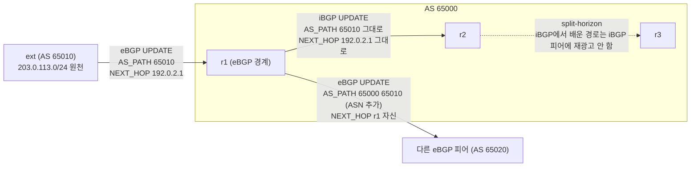
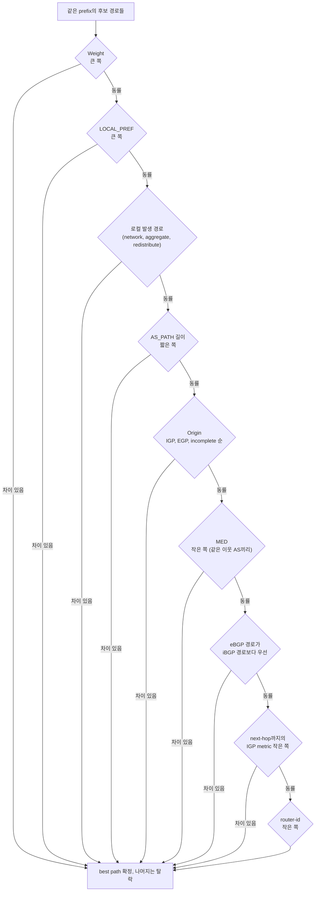
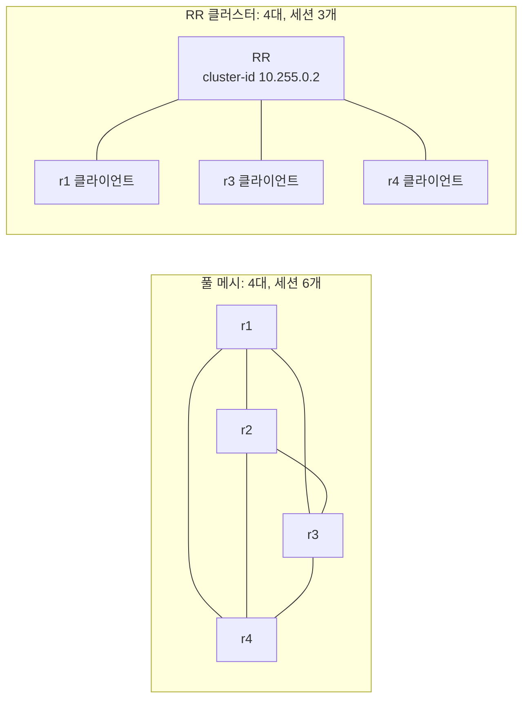
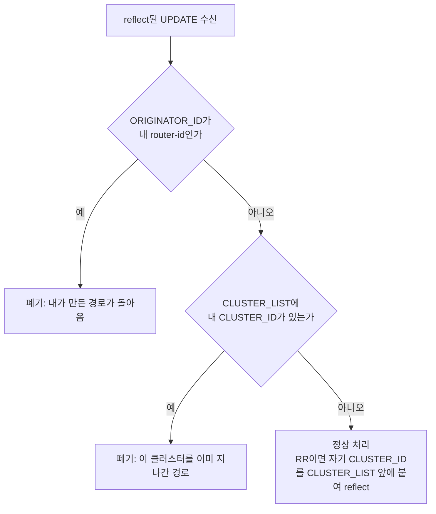
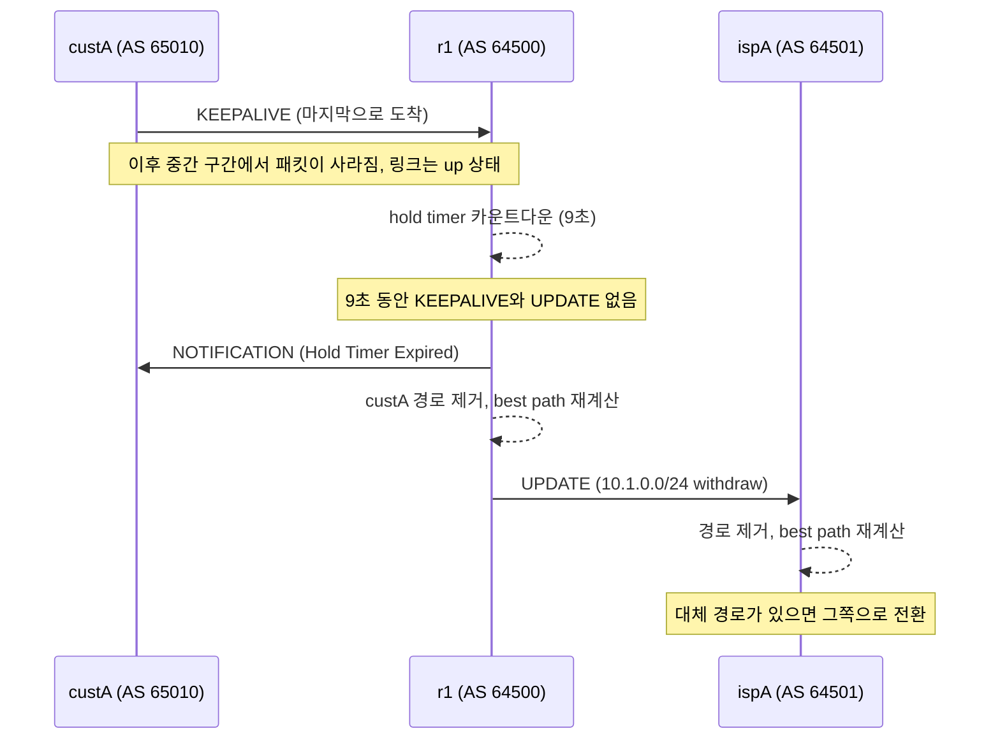
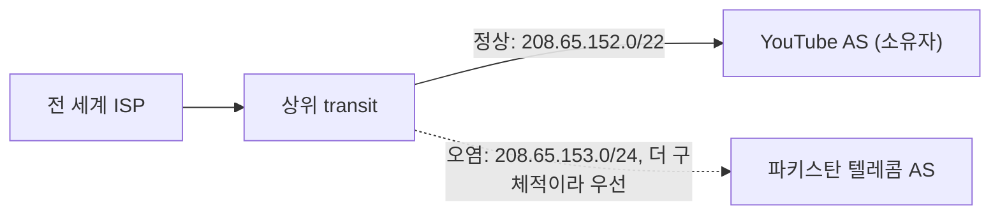
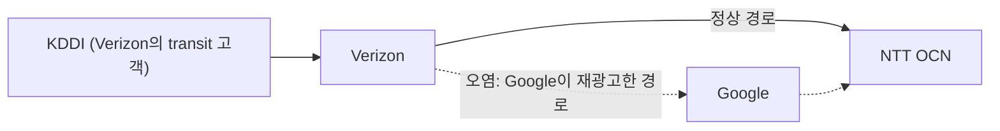

# BGP — 인터넷을 굴리는 라우팅 프로토콜

## 들어가며

서버 운영을 5년 하면서 BGP를 직접 만질 일은 사실 드물다. OSPF는 사내 네트워크에서 가끔 마주치지만, BGP는 보통 네트워크 팀이 회선 사업자와 협의해서 세팅해놓고 끝이다. 그런데 어느 날 "특정 리전에서만 응답이 느려진다", "Direct Connect 회선을 새로 뽑는다", "트위터에서 BGP hijack이 났다는데 우리도 영향이 있나?" 같은 질문이 날아온다. 이때 BGP를 모르면 한 발짝도 못 움직인다.

BGP는 AS(Autonomous System) 사이에서 도달 가능한 경로 정보를 교환하는 프로토콜이다. 인터넷의 골격이고, 인터넷에서 가장 신뢰가 없는 프로토콜이기도 하다. 이 문서는 AS와 ASN, eBGP/iBGP의 경계에서 UPDATE가 어떻게 변하는지, 경로를 고르는 순서와 ECMP, Route Reflector, 컨버전스, hijack과 leak을 다루고, 마지막에 AWS Direct Connect와 Site-to-Site VPN에서 BGP 세션이 어떻게 보이는지를 적는다.

문서에 나오는 FRR 설정과 출력은 FRR 8.1을 network namespace 여러 개에 띄워서 실제로 돌린 결과다. 라우터 간 링크는 veth로 만들었고, IPsec 터널은 올리지 않았다. community, 세션 상태 머신, RPKI·보안 상세, Kubernetes 환경의 BGP, 실습 구성은 이 문서에서 다루지 않는다.

## AS — 인터넷의 자치 단위

인터넷은 하나의 거대한 네트워크가 아니라 수많은 AS가 서로 연결된 구조다. AS는 하나의 관리 주체가 통제하는 라우팅 정책의 단위다. KT, SK브로드밴드, LG U+ 같은 ISP가 각각 AS이고, AWS, Google, Cloudflare 같은 클라우드/CDN 사업자도 자기 AS를 운영한다. AS마다 ASN(AS Number)이 붙는다. KT는 4766, AWS는 16509 같은 식이다.

AS 안에서는 그 조직이 알아서 라우팅한다. OSPF를 쓰든 IS-IS를 쓰든 외부에서는 알 바가 아니다. AS와 AS 사이를 잇는 게 BGP다. "내 AS는 이 IP 대역을 가지고 있고, 이쪽으로 오면 도달 가능하다"는 정보를 이웃 AS에게 알리고, 받은 쪽은 자기 테이블에 반영한 뒤 또 이웃에게 넘긴다.

BGP는 최단 경로를 찾는 프로토콜이 아니다. OSPF는 링크 비용을 합산해 가장 싼 길을 계산하지만 BGP는 정책이 우선한다. 이 트래픽은 KT로, 저 트래픽은 LG로 보내라는 식의 비즈니스 결정이 설정에 박힌다. 회선료, 트래픽 정산, 백업 회선 정책이 전부 BGP 설정으로 들어간다. 경로(AS 시퀀스)와 그 경로에 붙은 속성을 같이 광고하기 때문에 path-vector 프로토콜이라고 부른다.

```
[AS 64500] --- eBGP --- [AS 65000] --- eBGP --- [AS 65001]
   회사 A              ISP            회사 B

광고: "10.10.0.0/16, AS_PATH = [65000, 64500], next-hop = 1.1.1.1"
```

회사 A가 자기 대역을 광고하면 ISP가 자기 ASN을 앞에 붙여 회사 B에게 전달한다. 회사 B는 AS_PATH를 보고 AS 65000을 거쳐 AS 64500까지 간다는 걸 안다.

### 4바이트 ASN과 AS_TRANS

ASN은 원래 16비트였다. 65,535개로는 모자라서 32비트로 늘렸고(RFC 6793), 4바이트 ASN을 모르는 구형 피어와도 세션을 맺을 수 있게 AS_TRANS라는 예약 값 23456을 둔다.

4바이트 ASN 196613을 쓰는 라우터가 4바이트를 모르는 피어와 붙으면 OPEN 메시지의 "My Autonomous System" 필드(2바이트)에 23456이 들어가고, 진짜 ASN은 capability 65에 4바이트로 실린다. 같은 상황을 FRR 두 대로 만들어 tcpdump로 잡았다. 한쪽은 `neighbor ... dont-capability-negotiate`로 capability를 아예 안 보내게 해서 4바이트를 모르는 피어를 흉내 냈다.

```
OPEN  ... 0104 5ba0 00b4 01010101 ...      # 버전 4, My AS = 0x5ba0 = 23456, hold time 180
          ... 4104 0003 0005               # capability 65: 0x00030005 = 196613
```

UPDATE도 같다. 4바이트를 모르는 피어에게 보내는 AS_PATH에는 4바이트 ASN 자리에 23456이 들어간다(RFC 6793은 실제 경로를 AS4_PATH 속성에 따로 싣도록 정한다). 캡처한 UPDATE의 AS_PATH 세그먼트는 `02 01 5ba0`(AS_SEQUENCE, 1개, 23456)이었고, 받은 쪽 `show bgp`에도 경로가 `23456`으로 보였다.

```
b# show bgp ipv4 unicast
   Network          Next Hop            Metric LocPrf Weight Path
*> 198.18.0.0/24    172.20.0.1               0             0 23456 i
```

운영에서 이게 보이는 경우는 두 가지다. 오래된 장비가 끼어 있는 구간의 AS_PATH에 23456이 찍혀 있으면 "이 경로 어딘가에 4바이트 ASN이 있고 이 구간은 그걸 못 읽는다"는 뜻이다. 그리고 필터에 ASN을 정규식으로 쓸 때 4바이트 ASN을 쓰는 상대가 구형 장비 너머에 있으면 23456으로 매칭해야 한다. 사설 ASN 범위도 둘로 나뉜다. 2바이트는 64512~65534, 4바이트는 4200000000~4294967294(RFC 6996)다.

### 사설 ASN은 어디선가 벗겨야 한다

공인 ASN이 없는 고객은 사설 ASN으로 ISP와 eBGP를 맺는다. 이 경로가 인터넷으로 나갈 때 AS_PATH에 사설 ASN이 그대로 남아 있으면 다른 AS의 사설 ASN과 구별이 안 되고, 필터에도 걸린다. 그래서 ISP는 고객에게서 받은 경로를 외부로 광고할 때 사설 ASN을 벗긴다. FRR 설정은 `neighbor X remove-private-AS`다.

고객 AS 65010(사설)이 ISP AS 64500을 거쳐 상위로 광고되는 상황으로 확인했다. 상위 라우터가 보는 AS_PATH는 이렇게 달라졌다.

| 설정 | 상위가 보는 AS_PATH (원래 `65010`) |
|---|---|
| 없음 | `64500 65010` |
| `remove-private-AS` | `64500` |
| `remove-private-AS all replace-AS` | `64500 64500` |

공인/사설이 섞인 경로에서는 옵션 차이가 갈린다. 입력 경로에 공인 ASN 64505를 앞에 붙여 `64505 65010`으로 만들어보면, 옵션 없는 `remove-private-AS`는 경로를 건드리지 않았고(`64500 64505 65010`), `all`을 붙였을 때만 사설 ASN이 벗겨졌다(`64500 64505`). 옵션 없이 쓰면 경로 전체가 사설일 때만 벗긴다고 보면 된다. `replace-AS`는 벗긴 자리를 자기 ASN으로 채워서 AS_PATH 길이를 유지한다. 길이가 줄면 경로 선택 순서가 바뀌므로 길이를 지켜야 하는 곳에서 쓴다.

## eBGP와 iBGP — 같은 프로토콜, 다른 동작

BGP 세션은 두 종류다. eBGP는 서로 다른 AS 사이, iBGP는 같은 AS 안에서 맺는다. 프로토콜은 같은데 UPDATE를 보낼 때 하는 일이 다르다.

eBGP는 보통 직접 연결된 라우터끼리 TTL 1로 맺는다. UPDATE를 내보낼 때 자기 ASN을 AS_PATH 맨 앞에 붙이고 NEXT_HOP을 자기 인터페이스 주소로 바꾼다. iBGP는 같은 AS 안의 라우터끼리 맺고, 물리 링크 하나가 끊겨도 세션이 살아남도록 보통 루프백끼리 TCP 179 세션을 연다. AS_PATH도 NEXT_HOP도 건드리지 않는다.

아래 flowchart는 eBGP 경계에서 UPDATE가 AS 안으로 퍼지는 과정이다. 경로 하나가 r1에서 두 방향으로 갈라질 때 AS_PATH와 NEXT_HOP이 어떻게 달라지는지를 본다.



r1에서 나가는 화살표 두 개가 같은 경로에 대한 서로 다른 처리다. eBGP로 나갈 때는 ASN이 붙고 NEXT_HOP이 r1로 바뀌고, iBGP로 나갈 때는 둘 다 그대로다. r2에서 r3로 가는 점선이 iBGP split-horizon이다. iBGP로 받은 경로는 다른 iBGP 피어에게 재광고하지 않는다. AS 안에서는 ASN이 안 바뀌어서 AS_PATH로 루프를 잡을 수 없으니, 아예 재광고를 금지해서 루프를 막는 것이다.

그 대가가 풀 메시다. BGP를 도는 라우터가 N개면 모든 라우터가 서로 세션을 맺어야 해서 N(N-1)/2개가 된다. 50대면 1225개다. 뒤의 Route Reflector 절에서 이걸 푼다.

| 구분 | eBGP | iBGP |
|---|---|---|
| 피어 ASN | 다름 | 같음 |
| TTL | 보통 1 | 255 (루프백 사용) |
| AS_PATH | 자기 ASN 추가 | 안 바꿈 |
| NEXT_HOP | 자기로 바꿈 | 안 바꿈 |
| 재광고 | eBGP/iBGP 모두 가능 | 다른 iBGP에는 금지 |
| 토폴로지 | 점대점 | 풀 메시 또는 RR |

### NEXT_HOP 처리

iBGP가 NEXT_HOP을 그대로 두는 규칙이 운영에서 가장 많이 사고를 낸다. 외부 피어에서 받은 경로의 NEXT_HOP은 외부 피어의 IP(192.0.2.1)이고, 이게 iBGP를 타고 AS 안의 다른 라우터에 그대로 전달된다. 그 라우터가 192.0.2.1로 가는 길을 모르면 BGP 테이블에는 경로가 보이는데 쓸 수가 없다.

위 flowchart와 같은 구성(ext - r1 - r2 - r3, r1~r3은 AS 65000, r1-r2 사이만 iBGP)으로 확인했다. r1이 ext에게 받은 경로를 r2에게 넘기면 r2에서는 이렇게 보인다.

```
r2# show bgp ipv4 unicast 203.0.113.0/24
BGP routing table entry for 203.0.113.0/24, version 0
Paths: (1 available, no best path)
  Not advertised to any peer
  65010
    192.0.2.1 (inaccessible) from 10.255.0.1 (10.255.0.1)
      Origin IGP, metric 0, localpref 100, invalid, internal
```

`inaccessible`에 `invalid`, `no best path`다. best path가 없으니 r2는 이 경로를 어디에도 다시 광고하지 않는다. 해결은 둘 중 하나다.

첫째는 경계 라우터에서 `next-hop-self`를 거는 것이다. iBGP로 내보낼 때 NEXT_HOP을 r1의 루프백으로 바꾼다.

```
router bgp 65000
 neighbor 10.255.0.2 remote-as 65000
 neighbor 10.255.0.2 update-source lo
 address-family ipv4 unicast
  neighbor 10.255.0.2 next-hop-self
```

```
r2# show bgp ipv4 unicast 203.0.113.0/24
Paths: (1 available, best #1, table default)
  65010
    10.255.0.1 from 10.255.0.1 (10.255.0.1)
      Origin IGP, metric 0, localpref 100, valid, internal, best (First path received)
```

둘째는 외부 피어와 맺은 링크의 서브넷(192.0.2.0/30)을 AS 안으로 퍼뜨리는 것이다. 보통 IGP에 passive 인터페이스로 넣는다. FRR 8.1 실습에서는 r1에서 `network 192.0.2.0/30`으로 BGP에 넣는 것만으로도 r2가 192.0.2.1을 BGP 경로로 재귀 해석해서 valid가 됐다. 이 동작은 장비와 버전에 따라 다를 수 있어서, 실제 망에서는 IGP에 넣는 쪽을 쓴다.

두 방식은 성격이 다르다. `next-hop-self`는 NEXT_HOP이 경계 라우터로 고정되어 내부 라우터는 외부 링크 주소를 몰라도 된다. 대신 경계 라우터가 죽으면 그 라우터를 NEXT_HOP으로 가진 경로가 한꺼번에 무효가 된다. 링크 서브넷을 IGP로 퍼뜨리는 쪽은 외부 링크 장애가 IGP를 거쳐 전파되므로 IGP 설계를 같이 봐야 한다. 경계 라우터 여러 대가 같은 외부 AS와 붙는 구성에서는 `next-hop-self`가 기본값에 가깝다.

## Path Attribute — 경로 선택의 기준

같은 목적지로 가는 경로가 여러 개 광고되면 BGP는 그중 하나를 골라 라우팅 테이블에 넣는다. 이때 쓰는 기준이 Path Attribute다. 종류는 많지만 실무에서 자주 만지는 건 AS_PATH, LOCAL_PREF, MED이고, 벤더 로컬 값인 Weight가 하나 더 있다.

### AS_PATH와 AS_SET

경로상의 AS들이 순서대로 나열된 리스트다. eBGP를 건널 때마다 자기 ASN이 맨 앞에 붙는다. 다른 속성이 같다면 AS_PATH가 짧은 경로가 이긴다. 자기 ASN이 이미 AS_PATH에 있으면 루프로 보고 버린다.

자기 AS를 광고할 때 ASN을 일부러 여러 번 붙이는 게 AS_PATH prepending이다. 이웃 AS는 이 경로가 길다고 보고 우선순위를 낮춘다. 백업 회선에 걸어서 평소엔 안 쓰이게 하는 용도로 쓴다.

```
정상 광고:  AS_PATH = [64500]
prepend 3회: AS_PATH = [64500, 64500, 64500, 64500]
```

prepending은 요청이지 강제가 아니다. 받는 쪽이 LOCAL_PREF로 경로를 고정하면 AS_PATH 길이는 평가되기 전에 끝난다. 실제로 상대 ISP가 prepend를 무시한다는 이야기는 흔하다.

route-map으로 prepend를 걸 때 주의할 점이 있다. eBGP로 내보낼 때는 `set as-path prepend 65001 65001`이라고 써도 라우터가 자기 ASN을 한 번 더 붙인다. 뒤의 VPN 실습에서 상대가 본 경로는 `65001 65001 65001`, 3개였다.

AS_SET은 AS_PATH에 들어갈 수 있는 또 다른 세그먼트 타입이다. 순서가 없는 ASN 집합이고, route aggregation에서 만들어진다. 고객 AS 65010과 65011이 각각 10.1.0.0/24, 10.2.0.0/24를 광고하는데 ISP(AS 64500)가 이걸 10.0.0.0/14 하나로 묶어서 상위에 올리면, 기본 동작은 AS_PATH에서 원래 AS 정보를 버리고 `64500`만 남긴다. `as-set` 옵션을 주면 원래 AS들을 집합으로 모아 붙인다.

```
router bgp 64500
 address-family ipv4 unicast
  aggregate-address 10.0.0.0/14 as-set summary-only
```

```
ispA# show bgp ipv4 unicast
   Network          Next Hop            Metric LocPrf Weight Path
*> 10.0.0.0/14      172.16.11.1                            0 64500 i                    # as-set 없음
*> 10.0.0.0/14      172.16.11.1                            0 64500 {65010,65011} i      # as-set 있음
```

as-set이 없으면 상위 AS는 이 aggregate 뒤에 누가 있는지 모르고, 경로가 되돌아와도 루프 검출이 안 된다. as-set을 넣으면 `{65010,65011}`이 AS_PATH에 남아서 그 ASN을 가진 AS가 이 경로를 받으면 자기 ASN을 보고 버린다. 반면 구성 AS가 바뀔 때마다 aggregate가 새 UPDATE로 갱신되어 flap이 늘어난다. AS_SET은 길이를 셀 때 원소 개수와 상관없이 1로 계산한다(RFC 4271). 그래서 요즘은 AS_SET 사용을 말리는 쪽이고(RFC 6472), 꼭 필요한 곳이 아니면 쓰지 않는다.

### LOCAL_PREF와 Weight

둘 다 큰 값이 이기는 속성이라 헷갈리지만 범위가 다르다.

LOCAL_PREF는 AS 안에서만 의미가 있고 iBGP로 전파된다. 기본값은 100이다. 우리 AS 안의 모든 라우터가 같은 값을 보고 같은 출구를 고르게 하는 용도다. KT 회선에서 받은 광고에 200, LG 회선에서 받은 광고에 100을 주면 AS 안의 모든 라우터가 KT 쪽으로 트래픽을 보낸다. 나가는 방향만 제어한다. 들어오는 방향은 prepending이나 MED 같은 다른 수단으로 상대에게 부탁해야 한다.

Weight는 Cisco가 만든 속성이고 FRR도 구현한다. 경로 속성이 아니라 그 라우터 한 대의 로컬 값이어서 UPDATE에 실리지 않고 iBGP로도 전파되지 않는다. 기본값은 학습한 경로가 0, 로컬 발생 경로가 32768이다. 의사결정에서 가장 먼저 평가된다.

두 값을 충돌시켜서 어느 쪽이 이기는지 확인했다. 같은 prefix를 ispA와 ispB 두 피어에게 받는데 ispB에는 LOCAL_PREF 200, ispA에는 Weight 100을 걸었다.

```
r1# show bgp ipv4 unicast
   Network          Next Hop            Metric LocPrf Weight Path
*  198.51.100.0/24  172.16.12.2              0    200      0 64502 i
*>                  172.16.11.2              0           100 64501 i

r1# show bgp ipv4 unicast 198.51.100.0/24
    172.16.11.2 from 172.16.11.2 (2.2.2.2)
      Origin IGP, metric 0, weight 100, valid, external, best (Weight)
```

LOCAL_PREF 200인 ispB가 졌다. Weight가 있는 라우터는 AS 안의 다른 라우터와 다른 경로를 고르게 되어 AS 내부 일관성이 깨진다. 그래서 "라우터 하나만 임시로 특정 피어로 보내고 싶다" 같은 예외 처리에만 쓰고, 정책의 기본 도구는 LOCAL_PREF로 둔다. Weight를 지원하지 않는 장비와 섞이는 순간 이 설정은 이식이 안 된다.

### MED (Multi-Exit Discriminator)

다른 AS에게 "내 쪽으로 들어올 때는 이쪽으로 들어와줘"라고 힌트를 주는 속성이다. 작을수록 우선한다. 같은 두 AS가 서울과 부산 두 곳에서 연결된 경우에 쓴다. 회사 A가 서울 회선 광고에 MED 100, 부산 회선 광고에 MED 200을 박으면 회사 B는 서울 쪽으로 보낸다.

MED는 기본적으로 같은 이웃 AS에서 온 경로끼리만 비교한다. 서로 다른 AS에서 온 두 경로에는 MED를 비교하지 않는다. ispA(AS 64501)에서 온 경로에 MED 100, ispB(AS 64502)에서 온 경로에 MED 50을 주고 확인했다.

```
# 기본
    172.16.11.2 from 172.16.11.2 (2.2.2.2)
      Origin IGP, metric 100, valid, external, best (Older Path)

# bgp always-compare-med
    172.16.12.2 from 172.16.12.2 (1.1.1.1)
      Origin IGP, metric 50, valid, external, best (MED)
```

기본 설정에서는 MED가 더 작은 ispB가 선택되지 않고 먼저 도착한 ispA가 이긴다. `bgp always-compare-med`를 켜야 서로 다른 AS 사이에서도 MED가 비교된다. MED는 다른 AS로 넘어가면 광고할 때 초기화되고, 받는 쪽이 LOCAL_PREF를 걸면 무효다. 어디까지나 제안이다.

## BGP 의사결정 순서

여러 경로가 있을 때 BGP는 아래 순서로 한 단계씩 비교해서 탈락시킨다. 어느 단계에서든 우열이 나면 거기서 끝나고 아래는 보지 않는다.



운영에서는 위쪽 두세 단계에서 거의 끝난다. 아래 단계까지 내려오는 건 같은 조건의 회선 두 개를 나란히 놓았을 때뿐이다. 그런데 그때 실제로 무엇이 이기는지는 장비마다 달라서 한번은 확인해야 한다.

router-id가 마지막 기준이라고 문서에 적혀 있어도 eBGP 경로끼리는 보통 그 앞에 "가장 오래된 경로가 우선"이라는 단계가 끼어든다. 경로가 flap해서 이기고 지는 일을 줄이려는 규칙이다. ispA(router-id 2.2.2.2)와 ispB(1.1.1.1)가 같은 prefix를 같은 조건으로 광고하게 하고, ispA가 먼저 올라오게 만들었다.

```
r1# show bgp ipv4 unicast 198.51.100.0/24
    172.16.12.2 from 172.16.12.2 (1.1.1.1)
      Origin IGP, metric 0, valid, external
    172.16.11.2 from 172.16.11.2 (2.2.2.2)
      Origin IGP, metric 0, valid, external, best (Older Path)
```

router-id가 작은 ispB가 졌다. `bgp bestpath compare-routerid`를 켜자 `best (Router ID)`로 ispB가 이겼다. 같은 조건의 두 회선 중 어느 쪽이 먼저 선택될지가 장비를 재부팅하거나 세션이 한 번 끊겼다 올라올 때마다 달라지는 이유다. 의도한 쪽이 있다면 LOCAL_PREF를 줘서 이 단계까지 안 내려오게 한다.

### ECMP와 multipath

best path는 하나지만, 조건이 같은 경로 여러 개를 라우팅 테이블에 같이 넣어 트래픽을 나눌 수 있다. `maximum-paths N`(eBGP) 또는 `maximum-paths ibgp N`을 설정한다. 기본값은 1이라 켜지 않으면 항상 하나다.

경로가 multipath 후보가 되려면 best path와 Weight, LOCAL_PREF, AS_PATH 길이, Origin, MED, eBGP/iBGP 구분, IGP metric이 같아야 한다. 여기서 AS_PATH는 길이만이 아니라 내용도 같아야 한다는 조건이 걸린다.

ispA(64501)와 ispB(64502)를 같은 조건으로 놓고 `maximum-paths 2`를 켰다.

```
r1# show ip route 198.51.100.0/24
  Known via "bgp", distance 20, metric 0, best
  * 172.16.11.2, via r1-ispA, weight 1
```

경로가 하나뿐이다. AS_PATH가 `64501`과 `64502`로 내용이 달라서 후보가 못 됐다. `bgp bestpath as-path multipath-relax`를 켜자 둘 다 올라갔다.

```
r1# show ip route 198.51.100.0/24
  Known via "bgp", distance 20, metric 0, best
  * 172.16.11.2, via r1-ispA, weight 1
  * 172.16.12.2, via r1-ispB, weight 1
```

relax는 내용 비교만 푼다. ispB 쪽에 `set as-path prepend 64502`를 걸어 길이를 2로 만들면 relax가 켜져 있어도 ispA 하나만 설치됐다. 같은 ISP 두 회선(같은 이웃 AS)에는 relax 없이 되고, 서로 다른 ISP 두 곳에 걸치려면 relax가 필요하다.

multipath가 걸린 뒤 트래픽 분배는 BGP가 아니라 커널이 한다. Linux는 기본 해시가 출발지/목적지 IP 기준(L3)이라 한 서버 쌍 사이의 트래픽은 한 경로로 쏠린다. 이건 `net.ipv4.fib_multipath_hash_policy`로 L4 포트까지 넣을 수 있다. 상대편이 ECMP를 안 해주면 돌아오는 트래픽은 한 회선으로 몰리는 비대칭이 생기고, stateful 방화벽이 끼어 있으면 여기서 세션이 깨진다.

## Route Reflector — iBGP 풀 메시 문제 해결

iBGP 풀 메시는 라우터 10대면 45개, 50대면 1225개 세션이다. Route Reflector(RR)는 iBGP 규칙을 일부러 깨는 라우터다. 클라이언트에게 받은 경로를 다른 클라이언트에게 재광고(reflect)한다. 클라이언트는 RR 하고만 세션을 맺는다.



왼쪽은 라우터가 늘 때마다 세션이 제곱으로 늘고, 오른쪽은 클라이언트가 하나 늘 때 세션이 하나 는다. 클라이언트끼리는 직접 세션이 없는데도 RR이 중간에서 경로를 뿌려준다.

RR이 있으면 split-horizon을 깼으니 루프를 막을 장치가 따로 필요하고, 그래서 두 가지 속성이 붙는다. ORIGINATOR_ID는 경로를 AS 안에 처음 넣은 라우터의 router-id이고, CLUSTER_LIST는 이 경로가 거쳐 간 RR 클러스터의 CLUSTER_ID를 쌓는 리스트다.



ORIGINATOR_ID는 자기가 만든 경로가 돌아오는 걸 막고, CLUSTER_LIST는 RR 사이에서 경로가 같은 클러스터를 다시 지나가는 걸 막는다. RR 두 대를 같은 클러스터로 이중화하려면 CLUSTER_ID를 같게 맞춘다. 서로 reflect한 경로가 자기 CLUSTER_ID를 보고 버려지므로 같은 경로가 두 번 도는 일이 없다.

r1 - r2 - r3 구성에서 r2를 RR로 바꿔서 확인했다. r1이 ext에게 받은 경로가 r3까지 간다.

```
router bgp 65000
 neighbor 10.255.0.1 remote-as 65000
 neighbor 10.255.0.3 remote-as 65000
 address-family ipv4 unicast
  neighbor 10.255.0.1 route-reflector-client
  neighbor 10.255.0.3 route-reflector-client
```

```
r3# show bgp ipv4 unicast 203.0.113.0/24
  65010
    192.0.2.1 from 10.255.0.2 (10.255.0.1)
      Origin IGP, metric 0, localpref 100, valid, internal, best (First path received)
      Originator: 10.255.0.1, Cluster list: 10.255.0.2
```

RR를 켜기 전에는 r3의 BGP 테이블이 비어 있었다. split-horizon 때문에 r2가 r1에게 받은 경로를 r3에 넘기지 않았기 때문이다. 켠 뒤에는 `Originator`가 r1의 router-id, `Cluster list`가 RR(r2)의 CLUSTER_ID로 찍힌다. RR의 CLUSTER_ID는 따로 설정하지 않으면 router-id를 쓴다.

NEXT_HOP은 reflect해도 바뀌지 않는다. 위 출력에서 r3이 본 NEXT_HOP이 `192.0.2.1` 그대로다. RR는 컨트롤 플레인에서 경로를 뿌려줄 뿐 NEXT_HOP을 자기로 바꾸지 않으므로, 클라이언트는 원래 광고한 라우터까지의 도달성을 스스로 확보해야 한다. RR를 도입한 뒤 통신이 안 되면 십중팔구 이 문제다. RR가 포워딩 경로에 끼느냐도 토폴로지에 달려 있어서, RR를 어디에 두느냐가 트래픽 경로에 영향을 준다.

## BGP 컨버전스 — 왜 이렇게 느린가

OSPF는 LSA가 퍼지면 수초 안에 모든 라우터가 새 경로를 안다. BGP는 경로 하나가 바뀌면 인터넷 전체가 안정을 되찾는 데 수십 초에서 수 분이 걸리고, 심하면 십수 분도 간다. 이유가 여러 개 겹친다.

**MRAI(Minimum Route Advertisement Interval).** 같은 prefix에 대한 UPDATE를 너무 자주 보내지 않게 제한하는 타이머다. RFC 4271은 eBGP 30초, iBGP 5초를 기본값으로 든다. 구현마다 실제 기본값은 다르다. FRR 8.1에서 `show bgp neighbors`를 보면 `Minimum time between advertisement runs is 0 seconds`로 eBGP도 0초였다. 장비를 바꾸면 같은 토폴로지에서 컨버전스가 몇 초 단위로 달라지는 이유다.

**Path Hunting.** 경로가 사라졌을 때 BGP는 곧장 "도달 불가"라고 광고하지 않고 다른 AS에게 받아둔 대체 경로를 시도한다. 그 대체 경로도 사실은 같은 장애의 영향을 받은 죽은 경로일 수 있는데 알 수 없으니, "이것도 안 되네, 그럼 저거"를 반복하며 시간을 쓴다. AS 토폴로지가 복잡할수록 길어진다.

**장애 감지가 느리다.** BGP는 TCP 179 위에서 동작하고, 상대가 조용히 죽으면 hold timer가 만료될 때까지 모른다. FRR 기본은 keepalive 60초, hold 180초다. 3분을 기다려야 한다는 뜻이다. 반대로 직접 연결된 eBGP 피어와의 링크가 down되면 hold timer를 기다리지 않고 바로 세션을 내린다. r1에서 고객 쪽 링크를 `ip link set down`했더니 1초 안에 세션이 `Active`로 떨어졌고 상위(ispA)에서 해당 prefix가 사라졌다.

문제는 링크는 살아 있는데 중간 구간이 패킷만 삼키는 경우다. 중간 장비 장애, ACL 실수, 회선 사업자 구간 단절이 이렇다. 이 경우는 hold timer를 기다린다. 아래 순서가 그 경우의 컨버전스 과정이다. r1과 고객(custA) 사이에서 패킷이 조용히 사라진다고 가정하고, r1 쪽에서 custA가 보내는 모든 패킷을 drop시켜 확인했다. 타이머는 `timers 3 9`로 줄였다.



drop을 건 시점부터 r1 세션이 `Idle`로 내려가고 ispA에서 `10.1.0.0/24`가 사라질 때까지 약 8초(폴링 간격 0.5초)가 걸렸다. `show bgp neighbors`에는 `Notification sent (Hold Timer Expired)`가 찍혔다. 그 시간 동안 ispA는 이 prefix로 오는 트래픽을 r1에 계속 보내고, r1은 그걸 custA 쪽으로 넘기려다 버린다. hold 180초면 이 구간이 3분이다. withdraw가 ispA로 넘어가는 데는 시간이 거의 안 걸렸다. FRR의 MRAI가 0이라서다. MRAI 30초가 걸려 있었다면 withdraw가 그만큼 더 늦게 갔을 것이다.

그래서 감지 시간을 줄이는 도구를 쓴다. 타이머를 줄이는 방법이 있고(`timers 3 9`처럼), 더 낫게는 BFD를 붙인다. BFD는 BGP와 별개의 프로토콜로 수백 ms 단위로 상대를 확인하고, 끊기면 BGP에 알려서 세션을 즉시 내린다. keepalive를 짧게 하는 방법은 CPU 부담이 있어서 회선이 많은 라우터에서는 BFD가 일반적이다. 감지가 빨라져도 그 뒤에 이어지는 path hunting은 줄지 않는다. 경로를 미리 여러 개 두고 장애 시 선택만 바꾸는 설계가 컨버전스를 가장 크게 줄인다.

CDN이 한 리전을 빼버렸을 때 다른 리전으로 트래픽이 옮겨가는 데 30초에서 수 분이 걸리는 이유도 여기 있다.

## Route Hijack과 Route Leak

BGP는 신뢰 기반 프로토콜이다. 어떤 AS가 "이 IP는 내 거야"라고 광고하면 이웃 AS는 그걸 그대로 믿는다. 광고를 검증하는 메커니즘이 프로토콜 자체에 없다. 사고의 근원이다. 비슷해 보이는 두 종류의 사고가 있고, 원인과 막는 방법이 다르다.

| 구분 | Hijack | Leak |
|---|---|---|
| 원인 | 소유하지 않은 prefix를 자기 것이라고 광고 | 정상 경로를 정책을 어기고 엉뚱한 곳에 광고 |
| origin AS | 가짜(공격자) | 진짜 그대로 |
| 탐지 | origin 검증으로 어느 정도 가능 | origin이 정상이라 어렵다 |

### Route Hijack

소유하지 않은 IP 대역을 자기 것이라고 광고하는 경우다. 의도든 실수든 똑같이 위험하다. BGP는 longest prefix match로 경로를 고르기 때문에 더 작은 prefix를 광고하면 트래픽을 끌어온다.



2008년 파키스탄 텔레콤 사건이 교과서적이다. 정부의 YouTube 차단 명령을 실행하려고 ISP가 YouTube의 대역(208.65.153.0/24)을 자기 AS 안에서만 blackhole로 광고했는데, 이 광고가 실수로 외부까지 새어 나갔다. YouTube가 원래 광고하던 건 더 큰 prefix(208.65.152.0/22)였고 파키스탄이 광고한 /24가 더 구체적이라서 전 세계 ISP가 그쪽으로 트래픽을 보냈다. YouTube가 전 세계에서 2시간 가까이 죽었다.

2018년 Amazon Route 53 사건도 비슷하다. 어떤 AS가 Amazon이 광고하던 대역을 자기 것이라고 광고했고, Route 53 DNS 질의가 가로채져 MyEtherWallet 사용자들이 가짜 사이트로 유도돼 약 15만 달러가 털렸다.

### Route Leak

소유권은 맞는데 광고하면 안 되는 곳에 광고가 새는 경우다. BGP 경로에는 비즈니스 관계가 묻어 있다. 고객에게서 받은 경로는 피어와 transit에게 전달해도 되지만, 피어나 transit에게서 받은 경로는 다른 피어나 transit에게 전달하면 안 된다. 상대가 내 망을 공짜 transit으로 쓰게 되기 때문이다. 이 규칙이 깨지면 leak이다.

2017년 8월 Google 사건이 대표적이다. Google이 일본 ISP(NTT OCN 등)의 대역을 포함해 16만 개 가까운 prefix를 Verizon에 광고했고, Verizon이 이걸 받아서 퍼뜨렸다. Verizon의 transit 고객이던 KDDI와 NTT OCN이 장애를 공지했고, 일본 통신망 일부가 1시간 가까이 불안정했다([CircleID 정리](https://circleid.com/posts/20170831_large_bgp_leak_by_google_disrupts_internet_in_japan)).



그림에서 점선이 leak으로 생긴 경로다. NTT 대역의 origin은 끝까지 NTT라서 hijack처럼 보이지 않는다. 문제는 이 경로 중간에 끼어든 Google이 원래 이 트래픽의 경유지가 아니라는 점이다. origin 검증으로는 못 잡고, BGP 메시지에 비즈니스 관계가 적혀 있지 않으니 prefix-list나 max-prefix 같은 수신 필터가 마지막 방어선이 된다.

### origin 검증

hijack 쪽은 RPKI(Resource Public Key Infrastructure)로 어느 정도 막을 수 있다. prefix 소유자가 ROA(Route Origin Authorization)로 "이 prefix는 이 ASN만 광고할 수 있다"는 서명된 선언을 발급하고, 라우터가 받은 경로를 ROA와 대조해 Valid, Invalid, NotFound로 분류한다. 운영자는 보통 Invalid를 drop한다. origin만 보기 때문에 위의 leak은 못 막고, 정상 origin 뒤에 자기 ASN을 끼워 넣은 가짜 AS_PATH도 못 잡는다. ROA를 잘못 발급하면 자기 prefix를 자기가 못 광고하게 되는 사고도 난다. ROA, RTR, ASPA 같은 상세는 이 문서 범위 밖이다.

## AWS Direct Connect와 Site-to-Site VPN의 BGP 세션

백엔드 개발자가 BGP를 가장 가깝게 만지는 자리다. Direct Connect는 전용 회선 위에서 고객 라우터와 AWS 쪽 가상 인터페이스(VIF)가 eBGP 세션을 맺는다. AWS가 /30 또는 /31 서브넷과 피어 IP를 주고, AWS 쪽 ASN은 7224다. Private VIF는 VPC CIDR을 받고 온프레미스 대역을 광고하며, Public VIF는 S3 같은 AWS 퍼블릭 서비스 대역을 받는다. Public VIF는 받는 prefix가 수천 개 단위라 라우터 메모리를 봐야 한다.

Site-to-Site VPN은 인터넷 위의 IPsec 터널이고 빠르게 올릴 수 있어서 Direct Connect의 백업으로 많이 쓴다. VGW나 TGW가 터널 두 개를 주고, 터널마다 BGP 세션을 하나씩 맺는다. AWS 쪽 ASN은 기본 64512다. IPsec 설정은 이 문서에서 다루지 않는다. 터널이 올라와서 `vti0`, `vti1` 같은 인터페이스가 생겼다는 전제로 BGP만 본다.

### 한 라우터에 DX와 VPN 두 개를 같이 붙이기

세 세션(DX 하나, VPN 터널 둘)을 한 FRR에 올린 구성이다. 평소에는 DX로 나가고, 터널 둘은 백업이다. 터널 2는 prepend로 AWS가 터널 1을 선호하게 한다.

```
router bgp 65001
 bgp router-id 10.10.0.1
 !
 neighbor 169.254.100.2 remote-as 7224
 neighbor 169.254.100.2 description AWS-DX-Primary
 neighbor 169.254.100.2 password BGPauthkey1
 neighbor 169.254.100.2 timers 10 30
 !
 neighbor 169.254.10.2 remote-as 64512
 neighbor 169.254.10.2 description AWS-VPN-Tunnel1
 neighbor 169.254.10.2 timers 10 30
 !
 neighbor 169.254.11.2 remote-as 64512
 neighbor 169.254.11.2 description AWS-VPN-Tunnel2
 neighbor 169.254.11.2 timers 10 30
 !
 address-family ipv4 unicast
  network 10.10.0.0/16
  neighbor 169.254.100.2 activate
  neighbor 169.254.100.2 soft-reconfiguration inbound
  neighbor 169.254.100.2 route-map TO-AWS out
  neighbor 169.254.100.2 route-map FROM-AWS in
  !
  neighbor 169.254.10.2 activate
  neighbor 169.254.10.2 route-map FROM-AWS-VPN in
  neighbor 169.254.10.2 route-map TO-AWS-VPN out
  !
  neighbor 169.254.11.2 activate
  neighbor 169.254.11.2 route-map FROM-AWS-VPN in
  neighbor 169.254.11.2 route-map TO-AWS-VPN-T2 out
 exit-address-family
!
ip prefix-list ON-PREM seq 10 permit 10.10.0.0/16
!
route-map TO-AWS permit 10
 match ip address prefix-list ON-PREM
 set metric 100
!
route-map FROM-AWS permit 10
 set local-preference 200
!
route-map FROM-AWS-VPN permit 10
 set local-preference 100
!
route-map TO-AWS-VPN permit 10
 match ip address prefix-list ON-PREM
!
route-map TO-AWS-VPN-T2 permit 10
 match ip address prefix-list ON-PREM
 set as-path prepend 65001 65001
```

`network 10.10.0.0/16`는 라우팅 테이블에 같은 prefix가 실제로 있어야 광고된다. 실습에서는 dummy 인터페이스에 `10.10.0.1/16`을 붙여서 만족시켰다. 이게 없으면 세션은 올라오는데 `PfxSnt`가 0이다. FRR 8의 `ebgp-requires-policy` 때문에 모든 eBGP 이웃에 in/out route-map이 있어야 하는데, 위 구성은 세 이웃 모두 양방향에 있어서 따로 끄지 않아도 된다.

세 세션이 올라온 상태다.

```
cgw# show bgp summary
Neighbor        V         AS   MsgRcvd   MsgSent   TblVer  InQ OutQ  Up/Down State/PfxRcd   PfxSnt Desc
169.254.10.2    4      64512        10         8        0    0    0 00:00:15            1        1 AWS-VPN-Tunnel1
169.254.11.2    4      64512        10         8        0    0    0 00:00:15            1        1 AWS-VPN-Tunnel2
169.254.100.2   4       7224         6         5        0    0    0 00:00:15            1        1 AWS-DX-Primary
```

`State/PfxRcd`가 숫자면 세션이 살아 있는 것이다. `Idle`, `Active`, `Connect`에 머물면 TCP 179 연결이 안 된다는 뜻이므로 피어 IP, ASN, 인증 키, 방화벽을 순서대로 본다. DX Gateway를 쓰면 AWS 쪽 ASN이 7224가 아닐 수 있으니 콘솔에서 실제 값을 확인한다.

같은 prefix(172.31.0.0/16)가 세 경로로 들어왔을 때 선택은 이렇다.

```
cgw# show bgp ipv4 unicast
   Network          Next Hop            Metric LocPrf Weight Path
*  172.31.0.0/16    169.254.11.2             0    100      0 64512 i
*                   169.254.10.2             0    100      0 64512 i
*>                  169.254.100.2            0    200      0 7224 i

cgw# show ip route bgp
B>* 172.31.0.0/16 [20/0] via 169.254.100.2, dx0, weight 1
```

LOCAL_PREF 200인 DX가 best이고, `show ip route bgp`에는 best path 하나만 나온다. BGP 테이블에서 best가 아닌 경로는 라우팅 테이블에 설치되지 않으므로, 같은 prefix에 `B` 줄이 두 개 보이길 기대하면 안 된다(`maximum-paths`를 켜지 않은 경우). DX 세션을 `shutdown`하자 라우팅 테이블이 바로 VPN 터널 1로 바뀌었다.

```
cgw# show ip route bgp
B>* 172.31.0.0/16 [20/0] via 169.254.10.2, vti0, weight 1
```

AWS 쪽이 우리 prefix를 어떻게 보는지도 봤다. 들어오는 방향(AWS에서 온프레미스로)은 이쪽에서 광고하는 MED와 prepend가 결정한다.

```
dx# show bgp ipv4 unicast       10.10.0.0/16  169.254.100.1   Metric 100          65001
t1# show bgp ipv4 unicast       10.10.0.0/16  169.254.10.1    Metric 0            65001
t2# show bgp ipv4 unicast       10.10.0.0/16  169.254.11.1    Metric 0            65001 65001 65001
```

터널 2의 AS_PATH가 `65001 65001 65001`이다. route-map에서 prepend를 2개 썼는데 eBGP로 나가면서 자기 ASN이 한 번 더 붙어서 3개가 됐다.

DX를 내린 뒤의 선택에는 함정이 있다. 터널 1과 터널 2가 우리 쪽에서 받는 속성이 완전히 같아서(LOCAL_PREF 100, AS_PATH `64512`) 나가는 방향에서는 둘 중 하나가 라우터 ID로 결정된다.

```
cgw# show bgp ipv4 unicast 172.31.0.0/16
    169.254.10.2 from 169.254.10.2 (169.254.10.2)
      Origin IGP, metric 0, localpref 100, valid, external, best (Router ID)
```

prepend는 우리가 광고하는 경로에만 걸렸고 우리가 받는 경로에는 아무 영향이 없다. 터널 1이 이긴 건 router-id가 작아서일 뿐 우연이다. 들어오는 방향은 터널 1, 나가는 방향도 터널 1이어야 의도한 대칭인데, 나가는 방향을 명시하려면 받는 쪽 route-map에서 터널별로 LOCAL_PREF를 다르게 줘야 한다. 위 구성에서는 `FROM-AWS-VPN`이 두 터널 모두 100이라 이걸 안 했다.

### 운영에서 만나는 함정

**광고 prefix 수 제한.** Direct Connect는 BGP 세션당 광고받을 수 있는 prefix 수에 상한이 있다. Private VIF는 100개, Public VIF는 1000개가 기본이고, 넘으면 세션이 끊긴다. 온프레미스 prefix가 많으면 summary route로 묶거나 한도 상향을 신청한다.

**정책 변경은 soft reset으로.** `soft-reconfiguration inbound`를 켜두면 route-map을 고친 뒤 `clear ip bgp 169.254.100.2 soft in`으로 세션을 끊지 않고 정책만 재적용한다. 받은 경로 원본은 `show bgp ipv4 unicast neighbors 169.254.100.2 received-routes`로 본다. hard reset하면 그 시간 동안 트래픽이 끊긴다.

**BFD.** AWS 쪽 BGP 기본 타이머는 keepalive 30초, hold 90초다. BFD를 안 켜면 회선이 조용히 끊겼을 때 최대 90초 동안 트래픽이 블랙홀로 빠진다. BFD를 켜면 보통 수백 ms 안에 감지하고 두 번째 회선으로 넘어간다. 신규 구축에서는 거의 무조건 켠다.

**VPN 백업과의 경합.** AWS는 같은 prefix에 대해 Direct Connect를 VPN보다 우선한다. 하지만 prefix 길이가 다르거나 양쪽에 prepend가 걸려 있으면 의도와 다르게 동작한다. 페일오버는 실제로 회선을 끊어보고 확인한다. VPN 쪽은 `ip link set vti0 down`으로 터널 인터페이스를 내리고 라우팅 테이블이 바뀌는지 본다.

**VPC route propagation.** VGW나 TGW가 BGP로 받은 경로를 VPC 라우팅 테이블에 자동 반영하는 설정이다. 꺼져 있으면 BGP 세션은 올라오는데 VPC에서 온프레미스로 패킷이 안 나간다.

## 트러블슈팅에서 자주 보는 패턴

**경로는 보이는데 ping이 안 됨.** BGP 테이블에 prefix가 있는데 트래픽이 안 흐른다. 대부분 NEXT_HOP 도달성 문제다. 앞에서 본 `inaccessible`이 이 상태다. `show bgp ipv4 unicast <prefix>`에서 NEXT_HOP 옆에 `inaccessible`이 있는지 보고, 그 IP가 IGP 테이블에 있는지 확인한다. iBGP와 RR 환경에서 자주 본다.

**비대칭 라우팅.** 가는 길과 오는 길이 다르다. stateful 보안 장비가 한쪽만 보고 패킷을 버린다. 한쪽에서 LOCAL_PREF로 한 회선을 고르는데 반대쪽은 prepend 때문에 다른 회선을 고르면 생긴다. 양쪽 AS의 정책을 같이 봐야 하고, 위의 두 VPN 터널처럼 한쪽이 router-id로 우연히 결정되는 구간도 후보다.

**flap dampening.** prefix가 짧은 시간에 수십 번 광고/철회되면 한동안 광고에서 제외된다. 광고가 안 들어와서 이상할 때 dampening 상태를 확인한다.

**ASN 충돌.** 사설 ASN을 여러 곳에서 같은 번호로 쓰면 AS_PATH에 자기 ASN이 보여서 광고가 거부된다. 멀티 클라우드에서 의외로 자주 본다. `allowas-in`으로 풀 수 있지만 루프 위험이 따라온다.

**의도하지 않은 경로 선택.** best path가 예상과 다르면 `show bgp ipv4 unicast <prefix>` 출력의 `best (...)` 괄호를 본다. FRR은 `Weight`, `Local Pref`, `Older Path`, `Router ID`, `MED`처럼 어느 단계에서 이겼는지 적어준다. 위의 의사결정 flowchart에서 그 단계 위쪽은 전부 동률이었다는 뜻이므로 어느 속성을 만져야 하는지가 바로 나온다.

백엔드 개발자가 BGP를 처음부터 끝까지 설정할 일은 드물다. Direct Connect나 멀티 클라우드에서 페일오버가 의도대로 안 될 때, CDN 트래픽이 이상한 경로로 흐를 때, 인터넷 어딘가에서 hijack이 났을 때 BGP를 알면 원인을 짚을 수 있다.
