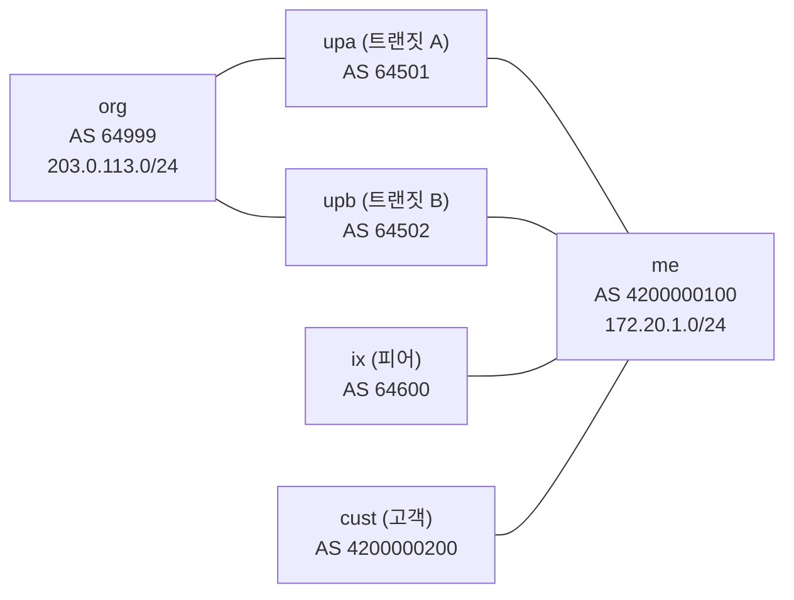
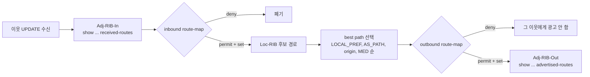
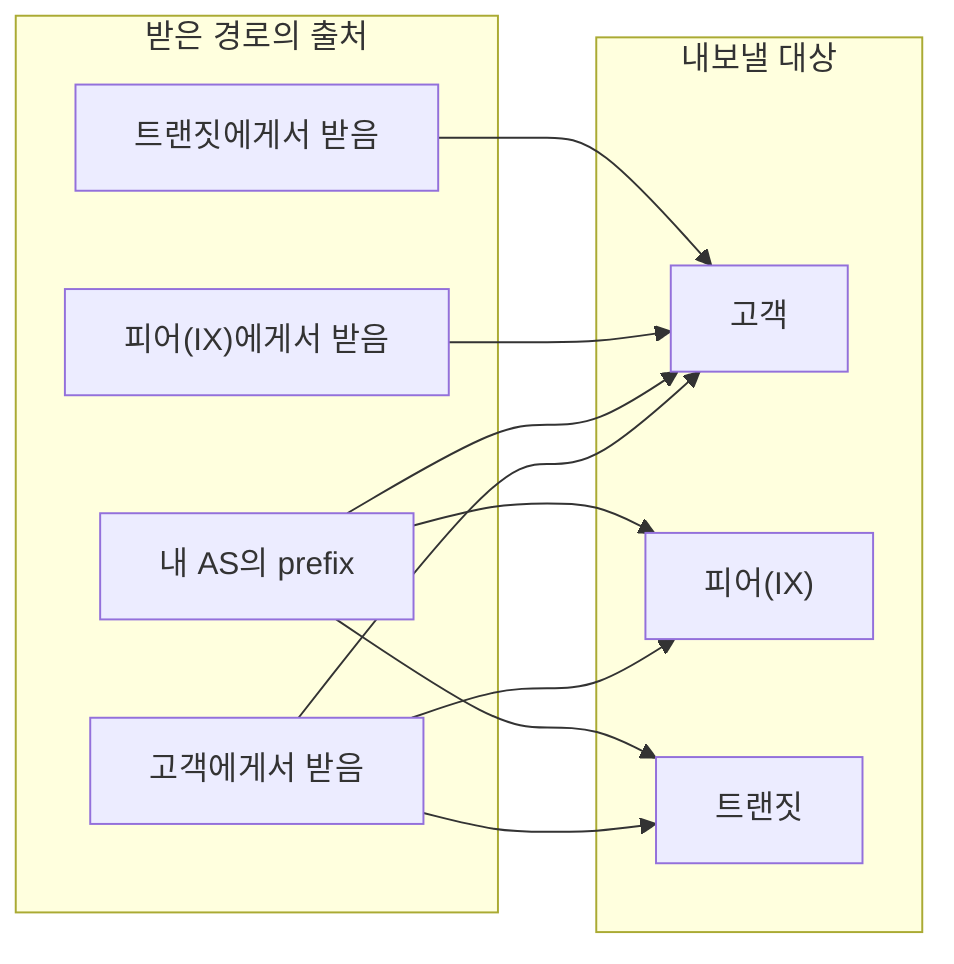
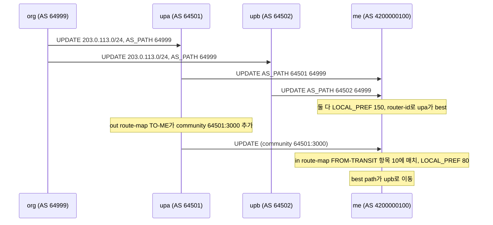
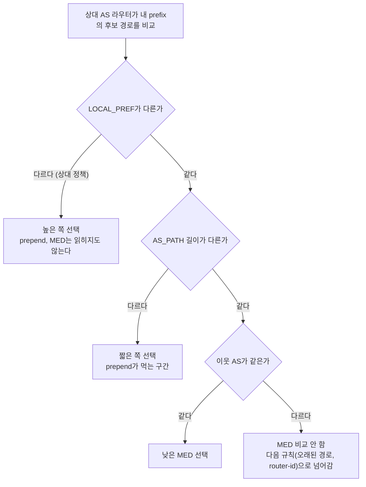
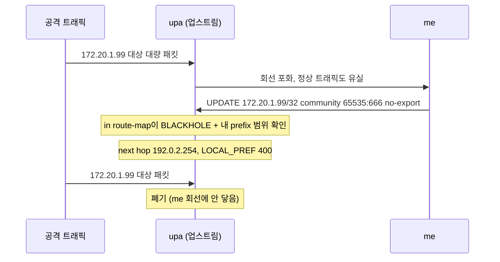

# BGP community와 라우팅 정책

[BGP](BGP.md) 문서는 경로 선택 순서와 Route Reflector, 컨버전스까지 다룬다. 거기서 route-map은 필터 도구로 몇 번 지나가고 community는 한 번도 나오지 않는다. 그런데 실제 BGP 운영 시간의 대부분은 경로 선택 알고리즘이 아니라 정책에 쓴다. 어디서 받은 경로를 어디로 내보낼지, 업스트림 두 곳 중 어느 쪽을 쓸지, 들어오는 트래픽을 어느 링크로 유도할지가 전부 정책 문제다. 정책의 상태를 경로에 실어 나르는 수단이 community다.

이 문서의 출력은 전부 FRR 8.1에서 직접 돌려 얻은 것이다. 컨테이너 런타임이 없는 머신이라 Docker 대신 network namespace 6개로 같은 토폴로지를 만들었다. 데몬(zebra, bgpd)은 Ubuntu 22.04 패키지의 바이너리다.

## 실험 토폴로지

내 AS(`me`)가 업스트림 두 곳, IX 피어 한 곳, 고객 한 곳과 붙어 있고, 업스트림 두 곳은 같은 출처 AS(`org`)로 가는 경로를 하나씩 가진다. 내 AS와 고객은 4바이트 사설 ASN을 쓴다.



`me`의 시점에서 203.0.113.0/24는 upa와 upb 양쪽에서 AS_PATH 길이 2로 들어온다. 길이가 같으니 어느 쪽이 best가 되는지는 정책이 정하지 않으면 router-id 같은 우연한 값이 정한다. 이 문서 전체가 이런 우연을 정책으로 바꾸는 이야기다.

## community는 세 종류가 있다

community는 경로에 붙는 꼬리표다. 라우터는 꼬리표의 의미를 모른다. route-map이 `match community`로 읽고 `set`으로 바꾸는 것뿐이고, 의미는 그 꼬리표를 정의한 AS의 문서에 있다.

| 종류 | 크기 | 표기 | 정의 |
|---|---|---|---|
| Standard | 4바이트 | `64501:3000` | RFC 1997. 앞 2바이트 ASN, 뒤 2바이트 값 |
| Extended | 8바이트 | `RT:64501:100` 등 | RFC 4360. 타입 필드가 있고 route target, Flowspec 동작 지정에 쓴다 |
| Large | 12바이트 | `4200000100:1:1` | RFC 8092. 4바이트 ASN + 4바이트 + 4바이트 |

Standard community는 앞 절반이 16비트라 4바이트 ASN을 담지 못한다. 내 AS가 4200000100이면 `4200000100:1`이라는 값을 만들 수 없다. FRR에 넣어 보면 이렇게 거부된다.

```
me# configure terminal
me(config)# route-map T permit 10
me(config-route-map)# set community 4200000100:1
% Malformed communities attribute
```

4바이트 ASN을 받기 시작한 초기에는 2바이트 사설 ASN(64512~65534)을 community의 앞자리에 쓰는 편법이 돌았다. 업스트림이 같은 사설 ASN을 다른 용도로 쓰고 있으면 의미가 겹치고, 누가 그 값을 정의했는지 경로만 봐서는 알 수 없다. Large community는 이 문제를 길이로 풀었다. 앞 4바이트가 정의한 AS(Global Administrator)를 못 박고, 뒤 8바이트를 둘로 나눠 쓴다. 이 둘의 쓰임은 RFC 8195가 관례를 정리해 두었다. 첫 번째 값을 함수(무엇을 하라), 두 번째 값을 파라미터(누구에게, 몇으로)로 쓰는 식이다.

이 실험에서는 내 AS가 이런 규칙으로 출처 태그를 만들었다.

| Large community | 의미 |
|---|---|
| `4200000100:1:1` | 고객에게서 받은 경로 |
| `4200000100:1:2` | 피어(IX)에게서 받은 경로 |
| `4200000100:1:3` | 트랜짓에게서 받은 경로 |

태그가 실제로 경로에 붙은 모습이다. 고객 경로는 LOCAL_PREF 300과 함께 `4200000100:1:1`이 붙어 있다.

```
me# show bgp ipv4 unicast 172.20.20.0/24
BGP routing table entry for 172.20.20.0/24, version 7
  4200000200
    10.0.4.2 from 10.0.4.2 (10.255.0.5)
      Origin IGP, metric 0, localpref 300, valid, external, best (First path received)
      Large Community: 4200000100:1:1
```

Standard와 Large는 별개의 속성이라 `show` 출력에서도 `Community:`와 `Large Community:` 줄로 따로 나온다. 경로에 둘이 같이 붙을 수 있다. 업스트림이 자기 AS의 동작을 Standard community(`64501:80`)로 열어 두었다면 그건 Standard로 붙여야 하고, 내 AS 안의 출처 태그는 Large로 두는 식으로 섞어 쓴다.

Large community는 upa 쪽에 그대로 도달한다. 내가 upa로 내보내는 경로에 `set large-community 4200000100:9:9`를 걸었더니 upa에서 이렇게 보였다.

```
upa# show bgp ipv4 unicast 172.20.1.0/24
  4200000100
      Large Community: 4200000100:9:9
```

community는 optional transitive 속성이라 중간 AS가 지우지 않는 한 끝까지 간다. 지우는 쪽은 받는 AS의 정책이다. 업스트림이 자기가 정의하지 않은 community를 입구에서 걷어내는지는 계약서나 문서에 적혀 있어야 하고, 라우터에서 확인할 방법은 상대 route-server나 looking glass에서 내 경로를 직접 보는 것뿐이다.

### set은 덮어쓰고 additive는 덧붙인다

`set large-community`에 `additive`가 없으면 경로에 원래 붙어 있던 값을 지우고 새 값으로 갈아끼운다. 실험에서 ix가 `4200000100:5:5`를 붙여 보내고, `me`의 FROM-IX 정책에서 `4200000100:1:2`를 넣어 봤다.

```
# set large-community 4200000100:1:2
      Large Community: 4200000100:1:2

# set large-community 4200000100:1:2 additive
      Large Community: 4200000100:1:2 4200000100:5:5
```

상대가 붙여 보낸 정보를 지울 의도가 아니면 입구 정책의 `set community`는 항상 `additive`를 붙인다. 위 출력은 Large에서 확인한 결과다. 반대로 고객이 보낸 community를 그대로 믿으면 안 되는 자리(예: 고객이 `65535:666`을 붙여 남의 경로를 블랙홀로 만들려는 경우)에서는 일부러 `additive` 없이 덮어쓴다.

## 정책이 평가되는 위치

route-map이 걸리는 자리는 두 곳이다. 이웃에게서 받은 직후(in)와 이웃에게 내보내기 직전(out). 둘 사이에 best path 선택이 끼어 있다는 점이 중요하다.



그림에서 볼 것은 세 가지다. 첫째, inbound에서 `set local-preference`를 하면 그 값이 best path 선택 입력으로 들어간다. LOCAL_PREF를 바꾸려면 반드시 in 쪽에서 한다. 둘째, outbound는 best로 뽑힌 경로 하나에만 적용된다. 후보 중 탈락한 경로는 out 정책에 닿지도 못한다. 셋째, `received-routes`는 inbound 정책 앞의 모습이고 `routes`는 뒤의 모습이다.

`received-routes`는 그냥 쓰면 안 나온다. 이웃에 `soft-reconfiguration inbound`가 켜져 있어야 Adj-RIB-In 원본을 라우터가 들고 있기 때문이다.

```
upa# show bgp ipv4 unicast neighbors 10.0.1.1 received-routes
% Inbound soft reconfiguration not enabled
```

`me`에는 켜 두었으므로 upa가 보낸 6개 중 무엇이 정책에 걸렸는지 비교할 수 있다. upa는 일부러 `198.18.7.0/25`를 하나 더 광고하게 했다.

```
me# show bgp ipv4 unicast neighbors 10.0.1.2 received-routes
   Network          Next Hop            Metric LocPrf Weight Path
*> 172.20.1.0/24    10.0.1.2                               0 64501 4200000100 i
*> 172.20.20.0/24   10.0.1.2                      150      0 64501 64999 64502 4200000100 4200000200 i
*> 192.0.2.0/24     10.0.1.2                 0    150      0 64501 i
*> 198.18.7.0/25    10.0.1.2                 0             0 64501 i
*> 198.51.100.0/24  10.0.1.2                      150      0 64501 64999 64502 i
*> 203.0.113.0/24   10.0.1.2                      150      0 64501 64999 i

me# show bgp ipv4 unicast neighbors 10.0.1.2 routes
   Network          Next Hop            Metric LocPrf Weight Path
*> 192.0.2.0/24     10.0.1.2                 0    150      0 64501 i
*  198.51.100.0/24  10.0.1.2                      150      0 64501 64999 64502 i
*> 203.0.113.0/24   10.0.1.2                      150      0 64501 64999 i
```

세 줄이 빠졌다. `/25`는 INTERNET-IN prefix-list(최대 /24)에, `172.20.1.0/24`는 FROM-TRANSIT의 MY-SPACE 거부 항목에 걸렸다. `172.20.20.0/24`는 정책이 아니라 AS_PATH에 내 ASN이 들어 있는 루프 검사에서 탈락했다. 위 출력의 `*>` 표시는 Adj-RIB-In 안에서의 표시일 뿐이라 `received-routes`의 `>`를 best로 읽으면 안 된다. 하단 합계 줄(`Total number of prefixes`)은 위 두 출력에서 뺐다. 필터된 개수 카운터가 표에서 센 줄 수와 맞지 않았고, 이 문서에서는 표의 줄만 근거로 쓴다.

### 정책이 없으면 세션이 살아도 경로가 안 온다

FRR 8.1은 eBGP 이웃에 inbound와 outbound 정책이 없으면 경로를 주고받지 않는다. `bgp ebgp-requires-policy`가 기본값이다. 고객 이웃에 일부러 route-map을 붙이지 않고 올려 봤다.

```
me# show bgp summary
Neighbor        V         AS   MsgRcvd   MsgSent   TblVer  InQ OutQ  Up/Down State/PfxRcd   PfxSnt Desc
10.0.4.2        4 4200000200         4         4        0    0    0 00:00:28     (Policy) (Policy) N/A

me# show bgp neighbors 10.0.4.2
  Inbound updates discarded due to missing policy
  Outbound updates discarded due to missing policy
```

세션은 Established인데 `PfxRcd` 자리에 숫자 대신 `(Policy)`가 찍힌다. 신규 고객이나 피어를 붙이고 "세션은 올라왔는데 경로가 0개"라는 문의가 오면 제일 먼저 보는 곳이다. 정책을 일부러 비우고 싶은 자리(내부 테스트)에서도 `route-map X permit 10`처럼 매치 조건이 없는 항목을 하나 달아야 통과한다.

## 출처별 태그와 export 규칙

경로의 출처는 세 부류다. 고객, 피어(IX 포함), 트랜짓. 요금이 흐르는 방향이 export 규칙을 정한다. 고객 경로는 누구에게나 광고한다. 고객이 내 광고를 타고 인터넷 전체에 닿는 것이 고객이 내게 요금을 내는 이유이기 때문이다. 피어와 트랜짓에서 받은 경로는 고객에게만 준다. 트랜짓 A에서 받은 경로를 트랜짓 B에게 주면 내가 둘 사이의 트랜짓이 되어 내 회선 요금으로 남의 트래픽을 나르게 된다.



선이 없는 조합이 금지 규칙이다. 피어에서 받은 경로는 고객에게만 가고, 트랜짓에서 받은 경로도 고객에게만 간다. 이 도식의 8개 선을 route-map으로 옮기려면 "이 경로가 어디서 왔는가"를 export 시점에 알아야 한다. 그런데 out route-map에서는 이웃 정보가 이미 사라져 있다. `match peer`가 되는 구현도 있지만 이웃이 늘 때마다 정책을 고쳐야 한다. 그래서 입구에서 태그를 붙이고 출구에서 태그만 본다.

### FRR 설정

in 쪽은 출처별로 LOCAL_PREF와 태그를 같이 건다. 고객 경로는 prefix-list와 AS_PATH 정규식 둘 다 통과해야 받는다. 고객이 모르는 prefix를 광고하거나 다른 AS를 경로에 끼워 넣어도 걸러진다.

```
bgp large-community-list standard FROM-CUSTOMER permit 4200000100:1:1
bgp as-path access-list CUST-ASPATH permit ^4200000200(_4200000200)*$

ip prefix-list CUST-IN seq 5 permit 172.20.20.0/24
ip prefix-list MY-SPACE seq 5 permit 172.20.1.0/24 le 32
ip prefix-list INTERNET-IN seq 5 deny 0.0.0.0/0
ip prefix-list INTERNET-IN seq 10 permit 0.0.0.0/0 le 24

route-map FROM-CUST permit 10
 match ip address prefix-list CUST-IN
 match as-path CUST-ASPATH
 set local-preference 300
 set large-community 4200000100:1:1 additive

route-map FROM-IX permit 10
 match ip address prefix-list IX-IN
 set local-preference 200
 set large-community 4200000100:1:2 additive

route-map FROM-TRANSIT deny 1
 match ip address prefix-list MY-SPACE
route-map FROM-TRANSIT permit 20
 match ip address prefix-list INTERNET-IN
 set local-preference 150
 set large-community 4200000100:1:3 additive
```

out 쪽은 트랜짓과 IX 두 곳에 같은 `TO-RESTRICTED`를 건다. 고객 태그가 붙은 경로와 내 대표 prefix만 내보낸다.

```
route-map TO-RESTRICTED permit 10
 match large-community FROM-CUSTOMER
route-map TO-RESTRICTED permit 20
 match ip address prefix-list AGG
route-map TO-CUST permit 10
```

`TO-CUST`는 매치 조건 없이 permit 하나만 있다. 전부 통과시킨다. 결과를 `advertised-routes`로 확인한다.

```
me# show bgp ipv4 unicast neighbors 10.0.2.2 advertised-routes
   Network          Next Hop            Metric LocPrf Weight Path
*> 172.20.1.0/24    0.0.0.0                  0         32768 i
*> 172.20.20.0/24   0.0.0.0                       300      0 4200000200 i

me# show bgp ipv4 unicast neighbors 10.0.3.2 advertised-routes
   Network          Next Hop            Metric LocPrf Weight Path
*> 172.20.1.0/24    0.0.0.0                  0         32768 i
*> 172.20.20.0/24   0.0.0.0                       300      0 4200000200 i
```

upb와 ix에게 두 줄씩만 나간다. 같은 `me`가 upa와 ix에서 받은 경로는 나가지 않는다.

### export 정책이 빠지면

`TO-RESTRICTED` 끝에 `route-map TO-RESTRICTED permit 30`(조건 없는 항목)을 넣어 일부러 열어 봤다. 정책을 고치다가 항목 하나를 잘못 넣은 상황과 같다. `clear bgp ipv4 unicast * soft out` 후 6초쯤 지나 본 upb의 테이블이다(일부 줄은 생략했다).

```
upb# show bgp ipv4 unicast
   Network          Next Hop            Metric LocPrf Weight Path
*> 172.20.1.0/24    10.0.2.1                 0             0 4200000100 i
*> 172.20.10.0/24   10.0.2.1                               0 4200000100 64600 i
*> 172.20.20.0/24   10.0.2.1                               0 4200000100 4200000200 i
*  192.0.2.0/24     10.0.2.1                               0 4200000100 64501 i
*>                  10.0.6.2                               0 64999 64501 i
```

`172.20.10.0/24`(IX 피어의 prefix)과 `192.0.2.0/24`(트랜짓 A의 prefix)가 내 ASN을 거쳐 upb로 들어갔다. upb는 이제 트랜짓 A로 가는 경로를 내게서도 배웠다. 실제 인터넷에서 이 모양이 route leak이고, 한 번 퍼지면 전 세계 트래픽이 내 회선으로 몰린다. 항목 30을 지우고 `clear bgp ipv4 unicast * soft out`을 치자 upb 테이블에서 `172.20.10.0/24`가 사라졌다. 사고 대응에서 쓸 수 있는 가장 빠른 수단은 outbound route-map을 닫는 것이다.

### 고객이 AS_PATH를 부풀리면

고객 이웃에서 AS_PATH 정규식 `^4200000200(_4200000200)*$`는 고객 자신의 ASN만 (prepend 포함해서) 허용한다. 고객 라우터가 실수로 `set as-path prepend 64999`를 걸어 보내면 이렇게 된다.

```
me# show bgp ipv4 unicast 172.20.20.0/24
% Network not in table
```

`received-routes`에는 `4200000200 64999` 경로가 보이는데 Loc-RIB에는 안 들어온다. 고객 경로가 "원인 없이 사라졌다"는 연락이 오면 고객 쪽 AS_PATH나 prefix 광고가 약속과 어긋났는지부터 본다. 반대로 as-path 필터 없이 prefix-list만 두면 고객이 상위 AS를 끼운 경로를 그대로 받아 LOCAL_PREF 300을 줘 버린다.

## 업스트림 두 곳의 LOCAL_PREF를 community로 움직이기

업스트림 A와 B에서 같은 prefix가 들어오면 AS_PATH가 같을 때 `me`는 우연히 하나를 고른다. 아래 정책은 둘 다 LOCAL_PREF 150을 기본으로 주고, 업스트림이 붙여 준 community를 읽고 내려가게 한다. upa가 정의한 `64501:3000`이 "이 경로는 우리가 피어에게서 받은 것"이라는 뜻이라고 하자. 실제 업스트림은 이런 community 표를 문서로 제공한다.

```
bgp community-list standard UPA-VIA-PEER permit 64501:3000
bgp community-list standard GSHUT permit graceful-shutdown

route-map FROM-TRANSIT permit 5
 match community GSHUT
 match ip address prefix-list INTERNET-IN
 set local-preference 0
 set large-community 4200000100:1:3 additive
route-map FROM-TRANSIT permit 10
 match community UPA-VIA-PEER
 match ip address prefix-list INTERNET-IN
 set local-preference 80
 set large-community 4200000100:1:3 additive
route-map FROM-TRANSIT permit 20
 match ip address prefix-list INTERNET-IN
 set local-preference 150
 set large-community 4200000100:1:3 additive
```

route-map은 위에서부터 첫 매치에서 끝난다. GSHUT가 가장 앞에 있고(5), 그다음이 특정 community(10), 마지막이 나머지 전부(20)다. 순서를 바꿔 20을 위로 올리면 앞의 두 규칙은 영원히 실행되지 않는다. `match`가 여러 줄이면 AND다. 위 정책에서 community와 prefix-list를 둘 다 만족해야 5나 10에 걸린다.

태그가 어떻게 흘러 `me`의 선택을 바꾸는지 시퀀스로 그리면 이렇다.



upa가 community를 붙이기 전의 `me`는 upa를 best로 골랐고, 이유는 `Router ID`였다.

```
me# show bgp ipv4 unicast 203.0.113.0/24
  64502 64999
    10.0.2.2 from 10.0.2.2 (10.255.0.3)
      Origin IGP, localpref 150, valid, external
      Large Community: 4200000100:1:3
  64501 64999
    10.0.1.2 from 10.0.1.2 (10.255.0.2)
      Origin IGP, localpref 150, valid, external, best (Router ID)
      Large Community: 4200000100:1:3
```

upa 쪽에서 `route-map TO-ME`에 `set community 64501:3000`을 걸고 soft out을 치면 6초쯤 뒤에 이렇게 바뀐다.

```
me# show bgp ipv4 unicast 203.0.113.0/24
  64502 64999
    10.0.2.2 from 10.0.2.2 (10.255.0.3)
      Origin IGP, localpref 150, valid, external, best (Local Pref)
      Large Community: 4200000100:1:3
  64501 64999
    10.0.1.2 from 10.0.1.2 (10.255.0.2)
      Origin IGP, localpref 80, valid, external
      Community: 64501:3000
      Large Community: 4200000100:1:3
```

기능은 하나다. 경로를 보내는 쪽(업스트림 운영팀)이 `64501:3000` 한 줄을 붙이면 받는 쪽 라우터를 건드리지 않고 트래픽이 이동한다. `me` 쪽에서는 route-map을 한 번 짜 두면 끝이다. community 없이 같은 일을 하려면 prefix 단위로 route-map 항목을 하나씩 추가해야 하고, 업스트림 장비를 점검할 때마다 담당자 둘이 시간을 맞춰야 한다.

### GRACEFUL_SHUTDOWN

점검으로 세션을 내리기 전에 `65535:0`(RFC 8326)을 붙여 보내면 받는 쪽이 그 경로를 후순위로 내려 대체 경로가 먼저 자리를 잡게 만들 수 있다. 세션을 갑자기 끊으면 컨버전스 동안 패킷이 버려지는데, 미리 LOCAL_PREF를 내려 두면 끊을 때 이미 다른 경로로 가고 있다.

upa에서 `bgp graceful-shutdown`을 켠 뒤 `me`의 모습이다.

```
me# show bgp ipv4 unicast 192.0.2.0/24
  64502 64999 64501
    10.0.2.2 from 10.0.2.2 (10.255.0.3)
      Origin IGP, localpref 0, valid, external
      Community: graceful-shutdown
      Large Community: 4200000100:1:3
  64501
    10.0.1.2 from 10.0.1.2 (10.255.0.2)
      Origin IGP, metric 0, localpref 0, valid, external, best (AS Path)
      Community: graceful-shutdown
      Large Community: 4200000100:1:3

me# show bgp ipv4 unicast
*> 203.0.113.0/24   10.0.2.2                      150      0 64502 64999 i
```

203.0.113.0/24는 upb로 갔다. 192.0.2.0/24는 upa 자신의 prefix라 둘 다 LOCAL_PREF 0인데 AS_PATH가 짧은 upa 직결이 남았다. `65535:0`은 받는 쪽 정책이 LOCAL_PREF 0으로 바꿔 줘야 효과가 있다. 여기서는 FROM-TRANSIT 항목 5가 그 일을 했다. 수신 구현이 정책 없이 자동으로 LOCAL_PREF를 내리는지는 확인하지 않았으니, 쓰는 장비마다 정책으로 명시해 둔다. community는 transitive라 upb를 거쳐 들어오는 경로(`64502 64999 64501`)에도 같이 붙어 있다. upa가 점검에 들어가면 upa를 경유하는 모든 경로가 LOCAL_PREF 0이 된다.

## well-known community

IANA가 예약한 값은 이름이 있고, 어느 구현이든 정책 없이 동작이 정해져 있다(GRACEFUL_SHUTDOWN과 BLACKHOLE은 이름만 예약이고 동작은 정책이 만든다).

| 이름 | 값 | 동작 |
|---|---|---|
| NO_EXPORT | `65535:65281` | eBGP 이웃(콘페더레이션 경계 포함)에게 광고하지 않는다 |
| NO_ADVERTISE | `65535:65282` | 어떤 이웃에게도 광고하지 않는다 |
| GRACEFUL_SHUTDOWN | `65535:0` | 받는 쪽이 낮은 LOCAL_PREF를 주도록 약속한 신호 (RFC 8326) |
| BLACKHOLE | `65535:666` | 이 목적지로 가는 트래픽을 버려 달라는 요청 (RFC 7999) |

NO_EXPORT와 NO_ADVERTISE는 정책이 필요 없다. 내가 /25와 /26을 TE 목적으로 upa에게만 보내려고 각각 NO_EXPORT, NO_ADVERTISE를 붙인 결과다.

```
upa# show bgp ipv4 unicast 172.20.1.128/25
Paths: (1 available, best #1, table default, not advertised to EBGP peer)
  Not advertised to any peer
  4200000100
      Community: no-export

upa# show bgp ipv4 unicast 172.20.1.192/26
Paths: (1 available, best #1, table default, not advertised to any peer)
  Not advertised to any peer
      Community: no-advertise

org# show bgp ipv4 unicast
   Network          Next Hop            Metric LocPrf Weight Path
*> 172.20.1.0/24    10.0.6.1                               0 64502 4200000100 i
```

upa는 두 prefix를 받았지만 `org`로는 /24만 간다. 용도는 이렇다. NO_EXPORT는 업스트림 안에서만 more-specific을 쓰게 하고 인터넷 전체 테이블에는 퍼뜨리지 않으려는 TE에 쓴다. NO_ADVERTISE는 쓸 일이 드물다. iBGP 이웃에게도 넘기면 안 되는 임시 경로 정도에 쓴다.

NO_EXPORT는 최초로 붙인 쪽이 아니라 받은 쪽이 지켜야 하는 약속이다. 수신 AS가 이 community를 지우는 정책을 갖고 있으면 막힌 경로가 다시 퍼진다. 퍼뜨리고 싶지 않은 prefix는 NO_EXPORT에만 기대지 말고 out route-map으로도 막는다.

## 들어오는 트래픽과 나가는 트래픽

나가는 트래픽(내 AS에서 인터넷으로)은 내가 정한다. 같은 prefix의 경로가 여러 개 있으면 내 라우터가 best를 고르고 패킷이 그 경로로 나간다. 쓰는 수단은 LOCAL_PREF 하나이고 in route-map에서 건다. 위의 FROM-TRANSIT이 이것이다.

들어오는 트래픽(인터넷에서 내 AS로)은 내가 못 정한다. 상대 AS의 라우터가 내 prefix 경로 후보를 비교해서 고른다. 내가 할 수 있는 것은 내 광고를 바꿔 상대의 비교에 영향을 주는 것이고, 각 수단이 비교 순서의 어느 칸에 닿는지가 효과를 결정한다.



수단별 정리다.

| 수단 | 건드리는 칸 | 조용히 안 먹는 경우 |
|---|---|---|
| AS_PATH prepend | AS_PATH 길이 | 상대가 LOCAL_PREF를 먼저 본다. 고객 경로에 높은 LOCAL_PREF를 주는 업스트림이 대표적이다 |
| MED | MED | 이웃 AS가 다른 경로끼리는 비교하지 않는다. 같은 AS의 여러 링크 사이에서만 의미가 있다 |
| community | 상대 정책이 정한 값(LOCAL_PREF가 보통) | 상대가 해당 community를 구현하지 않았거나 입구에서 지운다 |
| more-specific 분할 | 최장 일치 | 업스트림이 /24보다 긴 prefix를 필터한다 |

### prepend가 안 먹는 경우

me가 upa로 나가는 172.20.1.0/24에 `set as-path prepend 4200000100 4200000100 4200000100`을 걸었다. org의 시점에서는 upa 경유가 길어져 upb로 갈 것을 기대한다. upa가 고객 경로(`me`에서 받는 경로)의 LOCAL_PREF를 200으로 두고 있으면 org에서 이렇게 보인다.

```
org# show bgp ipv4 unicast 172.20.1.0/24
  64501 4200000100 4200000100 4200000100 4200000100
    10.0.5.1 from 10.0.5.1 (10.255.0.2)
      Origin IGP, valid, external
  64502 4200000100
    10.0.6.1 from 10.0.6.1 (10.255.0.3)
      Origin IGP, valid, external, best (AS Path)
```

org에서는 prepend가 먹었다. AS_PATH가 짧은 upb가 best다. 그런데 org가 자기 정책으로 upa 이웃 경로에 LOCAL_PREF 200을 주고 있으면 같은 prepend가 무시된다.

```
org# show bgp ipv4 unicast 172.20.1.0/24
  64501 4200000100 4200000100 4200000100 4200000100
    10.0.5.1 from 10.0.5.1 (10.255.0.2)
      Origin IGP, localpref 200, valid, external, best (Local Pref)
  64502 4200000100
    10.0.6.1 from 10.0.6.1 (10.255.0.3)
      Origin IGP, valid, external
```

경로가 5홉이어도 `best (Local Pref)`로 선택된다. 상대가 LOCAL_PREF 규칙을 가진 이상 prepend를 몇 번 늘려도 선택은 바뀌지 않는다. "prepend를 5번까지 늘렸는데도 트래픽이 안 움직인다"는 보고는 대개 이 경우다. 늘릴수록 효과가 없는 것이 아니라 그 칸에 닿지 못한 것이다.

업스트림 쪽 사정도 하나 있다. upa가 고객 경로에 LOCAL_PREF를 안 줘서(기본 100) AS_PATH만으로 비교하게 놔두면 직결 경로(길이 4)가 org 경유 경로(`64999 64502 4200000100`, 길이 3)에게 진다. 이때 upa는 org에서 받은 경로를 best로 쓰고, 그 경로는 org에서 받은 것이니 org에게 되돌려 주지 않는다. org는 upa 경유 후보를 아예 못 본다. 처음 실험에서 prepend를 걸었을 때 org의 테이블에서 upa 경로가 사라진 것이 이 때문이었다. prepend는 내가 광고하는 상대 AS의 best path 결정만 바꾸는 것이 아니라 그 AS가 다시 광고할 경로 자체를 바꾼다.

### MED가 비교되지 않는 경우

upa와 upb가 org로 광고할 때 MED를 upa는 50, upb는 10으로 붙였다. MED가 비교된다면 upb가 best여야 한다.

```
org# show bgp ipv4 unicast 172.20.1.0/24
  64501 4200000100
    10.0.5.1 from 10.0.5.1 (10.255.0.2)
      Origin IGP, metric 50, valid, external, best (Older Path)
  64502 4200000100
    10.0.6.1 from 10.0.6.1 (10.255.0.3)
      Origin IGP, metric 10, valid, external
```

best는 MED 50 쪽이다. 이웃 AS(64501과 64502)가 서로 달라서 MED를 건너뛰고 `Older Path`로 결정했다. org에서 `bgp always-compare-med`를 켜면 결과가 뒤집힌다.

```
org# show bgp ipv4 unicast 172.20.1.0/24
  64501 4200000100
    10.0.5.1 from 10.0.5.1 (10.255.0.2)
      Origin IGP, metric 50, valid, external
  64502 4200000100
    10.0.6.1 from 10.0.6.1 (10.255.0.3)
      Origin IGP, metric 10, valid, external, best (MED)
```

그 옵션은 상대 AS가 켜야 하는 것이라 내가 정할 수 없다. 서로 다른 업스트림에 MED를 다르게 줘서 들어오는 트래픽을 나누려는 계획은 상대 둘 다 `always-compare-med`가 켜져 있지 않으면 동작하지 않는다. 쓸 수 있는 자리는 같은 업스트림에 링크 두 개로 붙은 경우다. MED는 자기가 붙여 보낸 이웃에서 한 홉 안에서만 의미가 있다(받은 쪽 AS가 다른 이웃에게 광고할 때는 MED를 지운다).

### community로 상대 LOCAL_PREF를 움직이기

앞의 두 수단이 막히는 곳에서 쓰는 것이 community다. 업스트림이 자기 AS 안에서 LOCAL_PREF를 낮추는 community를 열어 두었다고 하자. upa가 `64501:80`을 받으면 그 경로의 LOCAL_PREF를 80으로 내리도록 정책을 짜 두었다. me가 upa에게 광고하는 172.20.1.0/24에 이 값을 붙이면 upa의 결정이 바뀐다.

```
upa# show bgp ipv4 unicast 172.20.1.0/24    (태그 전)
  64999 64502 4200000100
    10.0.5.2 from 10.0.5.2 (10.255.0.6)
      Origin IGP, valid, external
  4200000100
    10.0.1.1 from 10.0.1.1 (10.255.0.1)
      Origin IGP, metric 0, localpref 200, valid, external, best (Local Pref)

upa# show bgp ipv4 unicast 172.20.1.0/24    (me가 64501:80을 붙인 뒤)
  64999 64502 4200000100
    10.0.5.2 from 10.0.5.2 (10.255.0.6)
      Origin IGP, valid, external, best (Local Pref)
  4200000100
    10.0.1.1 from 10.0.1.1 (10.255.0.1)
      Origin IGP, metric 0, localpref 80, valid, external
      Community: 64501:80
```

upa가 나에게 보내는 트래픽의 길이 org를 경유하는 쪽으로 바뀌었다. prepend가 고객 LOCAL_PREF에 막힌 자리에서 community는 그 LOCAL_PREF 값 자체를 바꿔 버린다. 단점은 업스트림이 이런 community를 열어 줘야 쓸 수 있다는 것이고, 값마다 지원 범위가 달라 업스트림 문서의 community 표를 읽는 일이 전제다. 문서에 없는 community를 붙여도 아무 일도 일어나지 않고, 라우터는 경고하지 않는다.

## RTBH 블랙홀링

DDoS가 /32 하나로 몰려 회선이 차면 서버를 지키는 것보다 회선을 지키는 쪽이 우선일 때가 있다. 그때 업스트림에게 "이 /32로 가는 트래픽은 너희 경계에서 버려 달라"고 요청하는 것이 RTBH(Remotely Triggered Black Hole)다. 요청은 BGP로 보낸다. 내가 그 /32를 `65535:666`(BLACKHOLE, RFC 7999)과 함께 광고하면, 업스트림 정책이 그 community를 보고 next hop을 폐기용 주소로 바꿔 트래픽을 자기 경계에서 버린다. 공격 트래픽이 내 회선에 닿기 전에 사라진다.



upa의 정책은 두 조건을 모두 봐야 한다. community가 `65535:666`이고 prefix가 내 주소 범위 안의 /32여야 한다.

```
bgp community-list standard BLACKHOLE permit 65535:666
ip prefix-list ME-HOSTS seq 5 permit 172.20.1.0/24 ge 32 le 32
ip prefix-list ME-AGG seq 5 permit 172.20.1.0/24 le 26

route-map FROM-ME permit 5
 match community BLACKHOLE
 match ip address prefix-list ME-HOSTS
 set ip next-hop 192.0.2.254
 set local-preference 400
route-map FROM-ME permit 20
 match ip address prefix-list ME-AGG
 set local-preference 200
```

me 쪽은 /32에 community를 붙여서 광고한다. `no-export`를 같이 붙여 업스트림 밖으로 번지는 것을 막는다.

```
ip prefix-list RTBH-HOST seq 5 permit 172.20.1.99/32
route-map TO-UPA permit 5
 match ip address prefix-list RTBH-HOST
 set community 65535:666 no-export
```

실험 결과 upa는 /32를 받아들였다.

```
upa# show bgp ipv4 unicast 172.20.1.99/32
Paths: (1 available, best #1, table default, inform peer to blackhole prefix)
  Not advertised to any peer
  4200000100
    192.0.2.254 from 10.0.1.1 (10.255.0.1)
      Origin IGP, metric 0, localpref 400, valid, external, best (First path received)
      Community: blackhole no-export
```

`inform peer to blackhole prefix`와 `Community: blackhole`은 FRR이 `65535:666`을 알아본 표시다. `Not advertised to any peer`는 no-export 때문이다. 같은 /32를 community 없이 보내면 이렇게 된다.

```
upa# show bgp ipv4 unicast 172.20.1.99/32
% Network not in table
```

prefix-list가 /26까지만 받는 것이 정상이고, /32는 블랙홀 항목(5)만 통과한다. 일반 항목에서 /32를 받으면 고객 실수 하나로 라우팅 테이블에 호스트 경로가 늘어난다. 반대로 upa가 `ME-HOSTS` 같은 고객 범위 매치를 빼고 `match community BLACKHOLE`만 두면, 고객이 다른 AS의 /32에 `65535:666`을 붙여 광고해서 그 대상을 업스트림에서 지워 버릴 수 있다.

FRR 8.1에서는 데이터 플레인 설치가 안 됐다. next hop `192.0.2.254`를 FRR의 정적 blackhole 경로(`ip route 192.0.2.254/32 blackhole`)로 두었더니 BGP는 경로를 valid로 보는데 zebra는 이렇게 보고했다.

```
upa# show ip route 172.20.1.99/32
Routing entry for 172.20.1.99/32
  Known via "bgp", distance 20, metric 0
    192.0.2.254 inactive, weight 1
    AS-Path          : 4200000100
    Communities      : blackhole no-export
```

`inactive`이면 커널에 안 들어가고 트래픽은 버려지지 않는다. next hop을 커널에 직접 넣은 blackhole 경로로 두면 BGP가 `inaccessible`로 보고, dummy 인터페이스에 정적 경로를 걸어도 같은 `inactive`였다. 원인(zebra가 blackhole을 지나는 재귀 next hop을 활성으로 인정하지 않는 것으로 보이지만 소스까지 확인하지는 않았다)은 못 짚었다. 확인된 범위는 컨트롤 플레인까지다. RTBH를 받는 장비로 FRR을 쓰는 경우 자기 버전에서 `show ip route <prefix>`가 active인지 먼저 본다.

### Flowspec과의 차이

RTBH는 목적지 하나를 통째로 버린다. 공격 대상 서버로 가는 정상 사용자 트래픽도 같이 사라진다. 사실상 공격자가 원하던 결과(그 서버를 오프라인으로 만드는 것)를 내가 직접 해 주는 셈이라, 회선 전체가 막히는 것보다 낫다고 판단될 때만 쓴다.

BGP Flowspec(RFC 8955)은 목적지 외에 출발지, 프로토콜, 포트, 패킷 길이, TCP 플래그를 조합해 트래픽을 지정한다. 동작은 extended community로 붙이고 버리기(rate 0), 속도 제한, 다른 VRF나 next hop으로 우회가 있다. NLRI가 별도 주소 체계(AFI 1, SAFI 133)에 실려서 일반 유니캐스트 경로와 섞이지 않는다. 예를 들어 "172.20.1.99로 가는 UDP 포트 11211 패킷만 버리고 나머지는 통과"라고 쓸 수 있다.

| 항목 | RTBH | Flowspec |
|---|---|---|
| 지정 단위 | 목적지 /32 | 5-tuple, 포트, 길이, 플래그 조합 |
| 동작 | 폐기 | 폐기, 속도 제한, 우회 |
| 정상 트래픽 | 같이 버려진다 | 조건에 안 맞으면 통과한다 |
| 업스트림 요구사항 | 일반 BGP + community 약속 | Flowspec을 받아 하드웨어에 올리는 장비와 계약 |
| 실패하는 곳 | 목적지 서비스 전체 중단 | 필터가 TCAM/ACL 한도에 걸리거나 업스트림이 수신 거부 |

Flowspec은 이 실험에서 돌려 보지 않았다. 표의 마지막 줄은 일반 운영 경험이지 FRR 8.1에서 확인한 값이 아니다. 업스트림이 Flowspec을 받아 주는지는 계약 단계에서 묻지 않으면 공격이 시작된 뒤에 알게 된다. 업스트림이 RTBH만 받아 주는 경우가 흔해서, RTBH 설정은 평소에 올려 두고 리허설해 둔다.

## 검증에 쓰는 명령

정책을 바꾼 뒤 가장 자주 치는 명령들이다.

```
me# clear bgp ipv4 unicast 10.0.1.2 soft in      # inbound 정책 재평가
me# clear bgp ipv4 unicast 10.0.1.2 soft out     # outbound 정책 재평가
me# show bgp ipv4 unicast neighbors 10.0.1.2 received-routes    # inbound 정책 앞
me# show bgp ipv4 unicast neighbors 10.0.1.2 routes             # inbound 정책 뒤
me# show bgp ipv4 unicast neighbors 10.0.1.2 advertised-routes  # outbound 정책 뒤
me# show bgp ipv4 unicast regexp ^4200000200$
me# show bgp ipv4 unicast large-community-list FROM-CUSTOMER
```

`regexp`와 `large-community-list`는 정책 정의를 바꾸지 않고 "이 조건에 걸리는 경로가 지금 몇 개인가"를 본다. 정책을 적용하기 전에 돌려서 걸리는 경로가 예상과 같은지 확인한다. 실험에서 두 명령 모두 `172.20.20.0/24` 한 줄만 반환했다.

```
me# show bgp ipv4 unicast regexp ^4200000200$
   Network          Next Hop            Metric LocPrf Weight Path
*> 172.20.20.0/24   10.0.4.2                 0    300      0 4200000200 i
```

`show bgp ipv4 unicast as-path-access-list CUST-ASPATH`는 이 실험에서 출력이 비어 있었다. 정규식 점검은 `regexp`로 한다.

route-map을 고친 직후에는 반영이 늦는 경우가 있다. 곧바로 `show`를 쳐서 안 바뀐 것을 보고 정책이 틀렸다고 판단하지 않는다. `clear ... soft`를 치고 몇 초 기다린 뒤 다시 본다.

## 실무에서 겪는 함정

route-map의 항목이 하나도 매치되지 않으면 경로는 거부된다(암묵적 deny). 위의 `TO-RESTRICTED`가 그 성질을 이용한 것이다. 반대로 `permit` 항목에 `match`가 하나도 없으면 전부 통과한다. 장애 대응 중 임시 항목을 넣으면서 `match`를 빼먹으면 `TO-RESTRICTED permit 30`처럼 정책이 통째로 열린다. route-map을 고치는 변경은 `advertised-routes`와 `routes` 출력의 줄 수를 변경 전과 비교해서 의도한 만큼만 늘거나 줄었는지 본다.

`set community`에 `additive`를 빼먹는 실수는 조용하다. 입구에서 덮어쓰면 업스트림이 붙여 준 `64501:3000` 같은 정보가 사라지고, 그걸 읽던 후속 정책은 매치가 안 되어 기본 값으로 흘러간다. 장애가 나는 것이 아니라 LOCAL_PREF가 의도와 달라진다. 반대로 고객에게서 받은 community는 일부러 덮어쓰거나 `set community none`으로 지운다. 고객이 `65535:666`이나 업스트림 전용 community를 붙여 보내면 그대로 업스트림에게 전달될 수 있다.

community는 의미가 AS마다 다르다. `64501:80`은 upa가 정의한 값일 때만 "LOCAL_PREF 80"이다. 다른 AS는 같은 숫자를 다른 용도로 쓴다. 정책에서 업스트림의 community를 읽는 규칙에는 어느 이웃에게서 온 경로인지도 같이 걸어 둔다. 이 실험의 `UPA-VIA-PEER`는 upa에서만 오는 값이라 이웃 구분 없이 둬도 되지만, 실제 환경에서는 `64501:3000`이 upb에서 올 수 있는지부터 따져 본다.

LOCAL_PREF 숫자의 기준은 한 번 정해 두고 문서로 남긴다. 이 실험에서는 고객 300, 피어 200, 트랜짓 150, 업스트림이 요청한 후순위 80, 점검 중 0으로 잡았다. 숫자가 흩어져 있으면 항목 하나를 추가할 때 다른 항목 위로 올라갔는지 아래로 갔는지를 매번 계산해야 한다.
