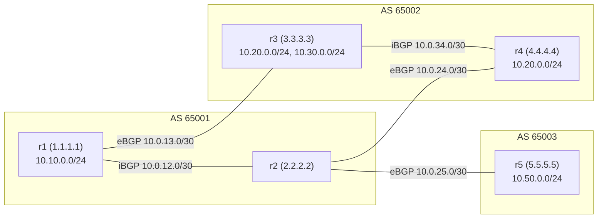
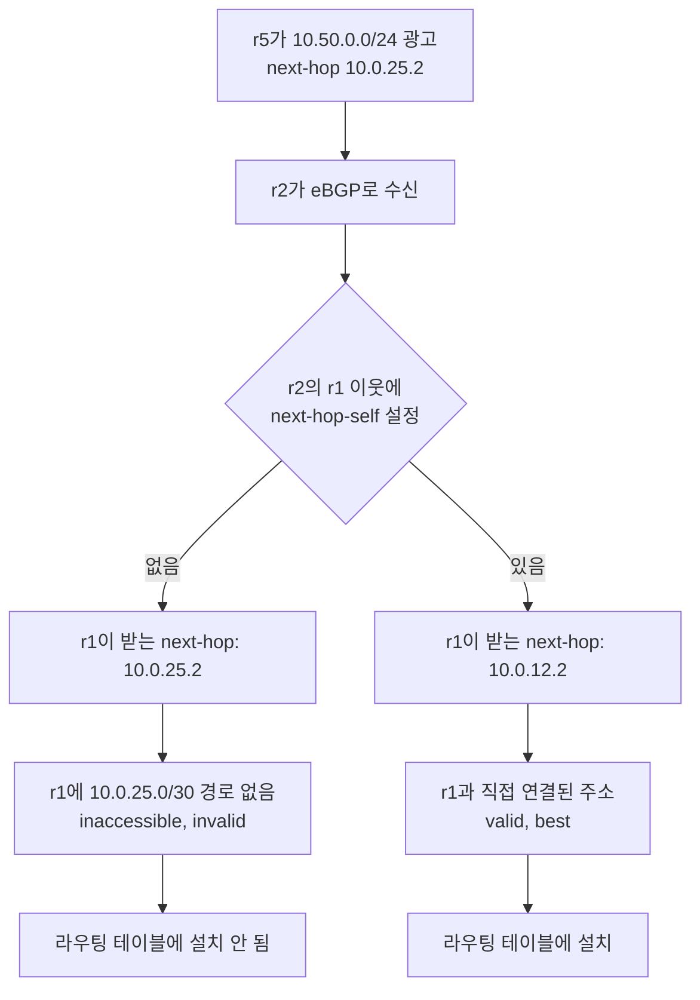
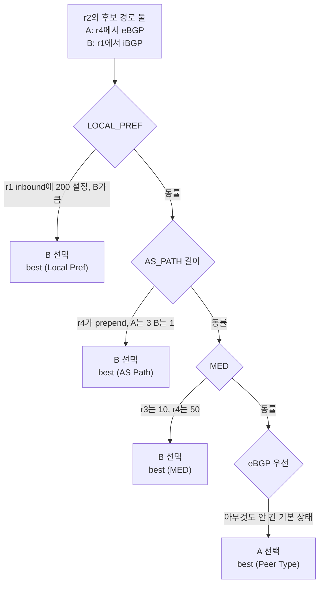
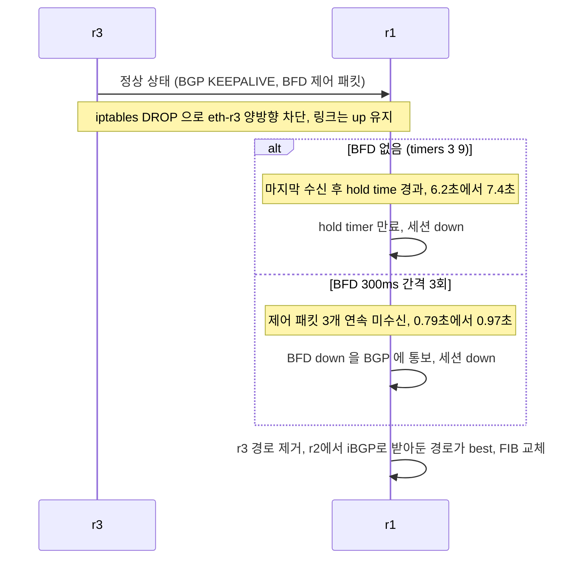
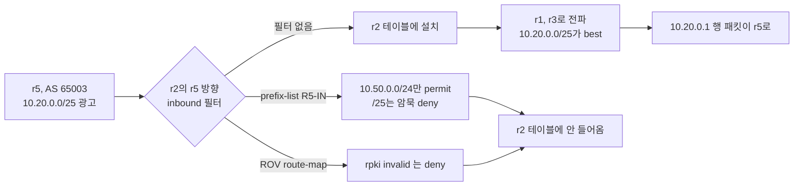

# BGP 실습, FRR 라우터 5대로 직접 돌려보기

[BGP](BGP.md) 문서에 나오는 FRR 설정은 설정 조각만 있어서 따라 쳐볼 환경이 없다. 이 문서는 라우터 5대를 한 호스트에 띄우고, 세션이 올라오는 것부터 next-hop 문제, best path가 바뀌는 지점, 장애 후 수렴 시간, 더 구체적인 prefix로 경로가 빨려가는 hijack까지 하나씩 재현한다. 문서에 있는 명령과 출력은 전부 이 토폴로지에서 실제로 실행한 결과다.

## 실행한 환경과 containerlab을 쓰지 않은 이유

| 항목 | 버전 |
|---|---|
| OS | Ubuntu 22.04 LTS, 커널 5.15.0-52-generic |
| FRR | 8.1 (패키지 `frr 8.1-1ubuntu1.16`, bgpd·zebra·bfdd, bgpd는 `-M rpki` 모듈 사용) |
| iproute2 | 5.15.0 |
| tcpdump | 4.99.1 |
| Python | 3.10.12 (RTR 서버와 측정 스크립트) |

이 작업 호스트에는 docker와 containerlab이 설치돼 있지 않았다. 설치하면 시스템 구성이 바뀌어서 돌리지 않았고, containerlab은 이 문서에서 실행해보지 못했다. 대신 라우터 한 대를 network namespace 하나로 만들고 링크는 veth로 이었다. containerlab의 linux 노드도 노드마다 netns를 쓰고 링크를 veth 쌍으로 잇는 구조라서, 아래 `frr.conf` 내용 자체는 컨테이너 환경으로 옮겨도 그대로 쓸 수 있는 형태다. 다만 컨테이너로 옮겨 돌려본 것은 아니다.

FRR 8.1은 2021년 말 릴리스라 최신 FRR과 `show` 출력 형식이나 기본값이 다를 수 있다. 특히 `best (Peer Type)` 같은 선택 사유 문구는 이 버전에서 본 그대로 옮겼다.

## 토폴로지

AS 세 개, 라우터 다섯 대다. AS 65001과 AS 65002는 서로 두 군데에서 맞물리고, 각 AS 안에서는 iBGP를 쓴다. AS 65003은 r2에 붙은 고객 겸 hijack을 일으키는 쪽이다.



r2가 중심이다. r2는 r1과 iBGP, r4와 eBGP, r5와 eBGP를 맺는다. 그래서 r2는 같은 prefix를 서로 다른 경로로 동시에 받게 되고, 경로 선택 실험은 전부 r2에서 본다. 10.20.0.0/24는 r3와 r4가 둘 다 광고한다. r2 입장에서는 r4가 직접 준 eBGP 경로와 r1을 거쳐 온 iBGP 경로 두 개가 생긴다.

IGP는 일부러 두지 않았다. iBGP 세션은 loopback이 아니라 링크 주소끼리 맺는다. 실제 망에서는 loopback에 IGP를 얹지만, 이 실습에서는 IGP가 없다는 점이 next-hop 실험의 전제가 된다.

## 띄우는 스크립트

모든 파일은 `/tmp/bgl` 아래에 둔다. 우선 노드를 만들고 데몬을 띄우는 `lab.sh`다.

```bash
#!/bin/bash
# lab.sh up|down
B=/tmp/bgl
NODES="r1 r2 r3 r4 r5"

link() { # nodeA ifA ipA nodeB ifB ipB
  ip link add $2 netns bgl_$1 type veth peer name $5 netns bgl_$4
  ip -n bgl_$1 addr add $3 dev $2; ip -n bgl_$1 link set $2 up
  ip -n bgl_$4 addr add $6 dev $5; ip -n bgl_$4 link set $5 up
}

# 데몬마다 private mount ns 에서 /var/tmp/frr 을 tmpfs 로 덮는다 (디스크가 꽉 찼을 때 log 설정이 SIGBUS 를 낸다)
sp() { n=$1; shift; unshare -m bash -c "mount -t tmpfs tmpfs /var/tmp/frr && exec ip netns exec bgl_$n $*"; }

up() {
  mkdir -p $B/run; mountpoint -q $B/run || mount -t tmpfs -o size=64m tmpfs $B/run
  for n in $NODES; do
    ip netns add bgl_$n
    ip -n bgl_$n link set lo up
    ip netns exec bgl_$n sysctl -q -w net.ipv4.ip_forward=1 net.ipv4.conf.all.rp_filter=0
    mkdir -p $B/run/$n; chown -R frr:frr $B/run
  done
  link r1 eth-r2 10.0.12.1/30 r2 eth-r1 10.0.12.2/30
  link r3 eth-r4 10.0.34.1/30 r4 eth-r3 10.0.34.2/30
  link r1 eth-r3 10.0.13.1/30 r3 eth-r1 10.0.13.2/30
  link r2 eth-r4 10.0.24.1/30 r4 eth-r2 10.0.24.2/30
  link r2 eth-r5 10.0.25.1/30 r5 eth-r2 10.0.25.2/30
  dum() { ip -n bgl_$1 link add $2 type dummy; ip -n bgl_$1 addr add $3 dev $2; ip -n bgl_$1 link set $2 up; }
  dum r1 d0 10.10.0.1/24
  dum r3 d0 10.20.0.1/24
  dum r3 d1 10.30.0.1/24
  dum r4 d0 10.20.0.2/24
  dum r5 d0 10.50.0.1/24
  dum r5 d1 10.20.0.1/25      # hijack 실험용. 아직 BGP 에는 안 넣는다
  for n in $NODES; do
    sp $n /usr/lib/frr/zebra -d -f /dev/null -i $B/run/$n/zebra.pid -z $B/run/$n/zserv.api --vty_socket $B/run/$n -A 127.0.0.1 -P 0
  done
  sleep 1
  for n in $NODES; do
    M=""; [ $n = r2 ] && M="-M rpki"
    sp $n /usr/lib/frr/bgpd -d -f /dev/null -i $B/run/$n/bgpd.pid -z $B/run/$n/zserv.api --vty_socket $B/run/$n -P 0 $M
    sp $n /usr/lib/frr/bfdd -d -f /dev/null -i $B/run/$n/bfdd.pid -z $B/run/$n/zserv.api --vty_socket $B/run/$n
  done
  sleep 1
  for n in $NODES; do vtysh --vty_socket $B/run/$n -f $B/conf/$n.conf; done
}

down() {
  for n in $NODES; do
    for d in bfdd bgpd zebra; do [ -f $B/run/$n/$d.pid ] && kill $(cat $B/run/$n/$d.pid) 2>/dev/null; done
  done
  sleep 1
  for n in $NODES; do ip netns del bgl_$n 2>/dev/null; done
  umount $B/run
}
"$@"
```

`network 10.20.0.0/24` 문은 라우팅 테이블에 같은 prefix가 있어야 광고된다. 그래서 prefix마다 dummy 인터페이스를 만들어 connected 경로를 만들어 둔다. 데몬마다 소켓 디렉터리를 `--vty_socket`으로 따로 주기 때문에 `vtysh --vty_socket /tmp/bgl/run/r1`로 라우터를 골라 접속한다. namespace 안에서 실행할 필요가 없다. 소켓은 파일시스템에 있어서 netns와 무관하다.

초기 설정은 세션과 `network` 문, 그리고 `soft-reconfiguration inbound`만 있다. 정책은 하나도 없다.

```bash
mkdir -p /tmp/bgl/conf && cd /tmp/bgl/conf
cat > r1.conf <<'EOF'
log file /tmp/bgl/run/r1/frr.log
router bgp 65001
 bgp router-id 1.1.1.1
 neighbor 10.0.12.2 remote-as 65001
 neighbor 10.0.13.2 remote-as 65002
 address-family ipv4 unicast
  network 10.10.0.0/24
  neighbor 10.0.12.2 soft-reconfiguration inbound
  neighbor 10.0.13.2 soft-reconfiguration inbound
 exit-address-family
EOF
cat > r2.conf <<'EOF'
log file /tmp/bgl/run/r2/frr.log
router bgp 65001
 bgp router-id 2.2.2.2
 neighbor 10.0.12.1 remote-as 65001
 neighbor 10.0.24.2 remote-as 65002
 neighbor 10.0.25.2 remote-as 65003
 address-family ipv4 unicast
  neighbor 10.0.12.1 soft-reconfiguration inbound
  neighbor 10.0.24.2 soft-reconfiguration inbound
  neighbor 10.0.25.2 soft-reconfiguration inbound
 exit-address-family
EOF
cat > r3.conf <<'EOF'
log file /tmp/bgl/run/r3/frr.log
router bgp 65002
 bgp router-id 3.3.3.3
 neighbor 10.0.34.2 remote-as 65002
 neighbor 10.0.13.1 remote-as 65001
 address-family ipv4 unicast
  network 10.20.0.0/24
  network 10.30.0.0/24
  neighbor 10.0.34.2 soft-reconfiguration inbound
  neighbor 10.0.13.1 soft-reconfiguration inbound
 exit-address-family
EOF
cat > r4.conf <<'EOF'
log file /tmp/bgl/run/r4/frr.log
router bgp 65002
 bgp router-id 4.4.4.4
 neighbor 10.0.34.1 remote-as 65002
 neighbor 10.0.24.1 remote-as 65001
 address-family ipv4 unicast
  network 10.20.0.0/24
  neighbor 10.0.34.1 soft-reconfiguration inbound
  neighbor 10.0.24.1 soft-reconfiguration inbound
 exit-address-family
EOF
cat > r5.conf <<'EOF'
log file /tmp/bgl/run/r5/frr.log
router bgp 65003
 bgp router-id 5.5.5.5
 neighbor 10.0.25.1 remote-as 65001
 address-family ipv4 unicast
  network 10.50.0.0/24
  neighbor 10.0.25.1 soft-reconfiguration inbound
 exit-address-family
EOF
```

이후 실험에서 설정을 바꾸는 명령을 짧게 쓰려고 도우미 함수 둘을 `env.sh`에 둔다. `v 라우터 '명령'`은 show 명령을 보내고, `cfg 라우터`는 표준 입력으로 받은 설정 조각을 적용한다.

```bash
cat > /tmp/bgl/env.sh <<'EOF'
B=/tmp/bgl
v() { n=$1; shift; for c in "$@"; do vtysh --vty_socket $B/run/$n -c "$c"; done; }
cfg() { n=$1; cat > $B/run/cfg.$n; vtysh --vty_socket $B/run/$n -f $B/run/cfg.$n; }
EOF
sudo bash /tmp/bgl/lab.sh up && . /tmp/bgl/env.sh
```

## 세션은 올라왔는데 경로가 안 오는 상태

`up` 직후 10초쯤 지나 r1의 요약을 본다.

```text
$ v r1 'show bgp summary'
Neighbor        V         AS   MsgRcvd   MsgSent   TblVer  InQ OutQ  Up/Down State/PfxRcd   PfxSnt Desc
10.0.12.2       4      65001         3         4        0    0    0 00:00:10            0        1 N/A
10.0.13.2       4      65002         3         3        0    0    0 00:00:10     (Policy) (Policy) N/A
```

iBGP 이웃(10.0.12.2)은 정상이다. eBGP 이웃(10.0.13.2)은 세션이 Established인데 `PfxRcd`와 `PfxSnt` 자리에 숫자 대신 `(Policy)`가 찍혀 있다. FRR 8부터 `bgp ebgp-requires-policy`가 기본으로 켜져 있어서, eBGP 이웃에 inbound와 outbound route-map이 없으면 받은 경로를 버리고 보내지도 않는다. 세션 상태만 보고 "붙었다"고 판단하면 이 상태를 놓친다. r2의 이웃 두 개(r4, r5)와 r5의 이웃도 같다.

실습에서는 route-map을 아직 쓰지 않으니 라우터 전부에서 이 옵션을 끈다. 실제 망에서는 끄지 않고 in/out route-map을 단다. 정책을 쓰는 방법은 [BGP_Community_and_Routing_Policy](BGP_Community_and_Routing_Policy.md)에서 다룬다.

```bash
for r in "r1 65001" "r2 65001" "r3 65002" "r4 65002" "r5 65003"; do
  set -- $r
  cfg $1 <<EOF
router bgp $2
 no bgp ebgp-requires-policy
EOF
done
```

옵션을 끈 직후에 요약을 다시 보면 `PfxRcd`가 여전히 0이다. 이미 버린 경로를 상대가 다시 보내주지 않기 때문이다. 라우터마다 soft clear를 한 번 해야 한다.

```bash
for n in r1 r2 r3 r4 r5; do v $n 'clear bgp ipv4 unicast * soft' >/dev/null; done
```

```text
$ v r1 'show bgp summary'
10.0.12.2       4      65001         6         6        0    0    0 00:00:55            3        3 N/A
10.0.13.2       4      65002         6         5        0    0    0 00:00:55            2        3 N/A
```

r1은 r2에서 3개, r3에서 2개를 받는다. r3 쪽이 2개인 이유는 r3가 실제로는 4개를 보냈는데 두 개가 AS_PATH에 65001이 들어 있어서 버려졌기 때문이다. 이 이야기는 뒤의 트러블슈팅 절에서 로그로 확인한다.

## next-hop-self를 빼면 경로가 설치되지 않는다

이 시점의 r1 BGP 테이블이다.

```text
$ v r1 'show bgp ipv4 unicast'
   Network          Next Hop            Metric LocPrf Weight Path
*> 10.10.0.0/24     0.0.0.0                  0         32768 i
  i10.20.0.0/24     10.0.24.2                0    100      0 65002 i
*>                  10.0.13.2                0             0 65002 i
  i10.30.0.0/24     10.0.24.2                     100      0 65002 i
*>                  10.0.13.2                0             0 65002 i
  i10.50.0.0/24     10.0.25.2                0    100      0 65003 i
```

10.50.0.0/24 줄에는 `*`도 `>`도 없고 `i`만 붙어 있다. r5가 만든 이 prefix는 r2를 거쳐 iBGP로 r1에 왔는데, next-hop이 r5의 주소 10.0.25.2 그대로다. r1에는 10.0.25.0/30에 대한 경로가 없다. 상세 출력은 이유를 직접 말해준다.

```text
$ v r1 'show bgp ipv4 unicast 10.50.0.0/24'
BGP routing table entry for 10.50.0.0/24, version 0
Paths: (1 available, no best path)
  Not advertised to any peer
  65003
    10.0.25.2 (inaccessible) from 10.0.12.2 (2.2.2.2)
      Origin IGP, metric 0, localpref 100, invalid, internal
$ v r1 'show ip route 10.50.0.0/24'
% Network not in table
```

`(inaccessible)`과 `invalid`가 핵심이다. iBGP는 eBGP에서 배운 경로의 next-hop을 바꾸지 않고 그대로 넘긴다. 받은 쪽은 그 next-hop에 도달할 수 있어야 경로를 쓴다. 도달 경로를 알려줄 IGP가 없으니 이 경로는 BGP 테이블에만 있고 라우팅 테이블에는 들어가지 못한다. 아래 도식이 이 차이다.



r2에서 r1 방향에 `next-hop-self`를 걸면 r1이 받는 next-hop이 r2 자신의 주소(10.0.12.2)로 바뀐다.

```bash
cfg r2 <<EOF
router bgp 65001
 address-family ipv4 unicast
  neighbor 10.0.12.1 next-hop-self
EOF
```

```text
$ v r1 'show bgp ipv4 unicast 10.50.0.0/24'
Paths: (1 available, best #1, table default)
  65003
    10.0.12.2 from 10.0.12.2 (2.2.2.2)
      Origin IGP, metric 0, localpref 100, valid, internal, best (First path received)
$ ip netns exec bgl_r1 ip route | grep 10.50
10.50.0.0/24 nhid 16 via 10.0.12.2 dev eth-r2 proto bgp metric 20
```

커널 라우팅 테이블에 `proto bgp` 경로가 들어왔다. 반대 방향도 같은 문제가 있다. r1이 r3에서 받은 경로를 r2에 넘길 때 next-hop이 10.0.13.2로 남기 때문에, r1에서도 r2 방향에 걸어준다. 이후 경로 선택 실험에서 r2가 r1을 거쳐 온 경로를 후보로 쓰려면 이 설정이 필요하다.

```bash
cfg r1 <<EOF
router bgp 65001
 address-family ipv4 unicast
  neighbor 10.0.12.2 next-hop-self
EOF
```

r3와 r4 사이의 iBGP는 이 문제가 없었다. r3와 r4의 경로는 둘 다 자기가 만든 prefix(`network` 문)이고, 그런 경로는 iBGP로 보낼 때 자기 주소를 next-hop으로 붙이기 때문이다. r1과 r2가 겪은 것은 "밖에서 배운 경로를 안으로 전달할 때" 생기는 문제다. 경계 라우터마다 이 설정이 필요하다.

## best path가 바뀌는 지점 읽기

r2가 10.20.0.0/24에 대해 두 경로를 갖는 상태에서 시작한다. 하나는 r4가 eBGP로 준 것, 다른 하나는 r3, r1을 거쳐 iBGP로 온 것이다. 두 경로 모두 AS_PATH가 `65002`로 길이가 같다.

```text
$ v r2 'show bgp ipv4 unicast 10.20.0.0/24'
Paths: (2 available, best #1, table default)
  65002
    10.0.24.2 from 10.0.24.2 (4.4.4.4)
      Origin IGP, metric 0, valid, external, best (Peer Type)
  65002
    10.0.12.1 from 10.0.12.1 (1.1.1.1)
      Origin IGP, metric 0, localpref 100, valid, internal
```

best 경로 줄 끝의 괄호가 이 출력에서 가장 중요한 정보다. `best (Peer Type)`은 "두 경로가 Peer Type 단계, 즉 eBGP와 iBGP 구분에서 갈렸다"는 뜻이다. 그 단계까지 앞의 비교는 모두 동률이었다는 이야기도 된다. 탈락한 쪽에는 사유가 붙지 않는다. 사유는 best 쪽에만 있고, 어느 단계에서 이겼는지를 말한다. JSON으로 보면 필드로 나온다.

```text
$ v r2 'show bgp ipv4 unicast 10.20.0.0/24 json'
... "peerId":"10.0.24.2" ... "bestpath":{"overall":true,"selectionReason":"Peer Type"} ...
```

이 실습에서 나온 사유 문구는 `Peer Type`, `Local Pref`, `AS Path`, `MED`, `First path received` 다섯 가지다. 이제 값을 하나씩 바꿔서 갈리는 단계가 어떻게 이동하는지 본다. 실험 도중에 r2의 후보 구성은 같고, 바뀌는 것은 어느 단계에서 우열이 나느냐다.



도식에는 실험에서 실제로 갈린 단계만 그렸다. Weight, 로컬 발생 경로, Origin 단계는 이 실험에서 우열이 나지 않아 생략했다. 전체 순서는 [BGP](BGP.md) 문서의 의사결정 순서 도식에 있다.

### LOCAL_PREF

r1이 r3에서 받는 경로에 LOCAL_PREF 200을 건다. LOCAL_PREF는 AS 안에서만 전달되는 값이라서 r1이 바꾸면 iBGP로 r2에 같이 간다.

```bash
cfg r1 <<EOF
route-map FROM-R3 permit 10
 set local-preference 200
router bgp 65001
 address-family ipv4 unicast
  neighbor 10.0.13.2 route-map FROM-R3 in
EOF
```

```text
$ v r2 'show bgp ipv4 unicast 10.20.0.0/24'
Paths: (2 available, best #2, table default)
  65002
    10.0.24.2 from 10.0.24.2 (4.4.4.4)
      Origin IGP, metric 0, valid, external
  65002
    10.0.12.1 from 10.0.12.1 (1.1.1.1)
      Origin IGP, metric 0, localpref 200, valid, internal, best (Local Pref)
```

best가 #1에서 #2로 넘어갔다. 앞에서 eBGP 경로가 이기던 Peer Type 단계는 LOCAL_PREF보다 뒤라서 아예 도달하지 못한다. LOCAL_PREF가 AS 경로나 경로 종류보다 앞선다는 것을 이 한 줄이 보여준다.

### AS_PATH prepend

LOCAL_PREF 설정을 지우고, r4가 r2로 내보내는 경로에 prepend를 건다.

```bash
cfg r1 <<EOF
router bgp 65001
 address-family ipv4 unicast
  no neighbor 10.0.13.2 route-map FROM-R3 in
EOF
cfg r4 <<EOF
route-map TO-R2 permit 10
 set as-path prepend 65002 65002
router bgp 65002
 address-family ipv4 unicast
  neighbor 10.0.24.1 route-map TO-R2 out
EOF
```

```text
$ v r2 'show bgp ipv4 unicast 10.20.0.0/24'
Paths: (2 available, best #2, table default)
  65002 65002 65002
    10.0.24.2 from 10.0.24.2 (4.4.4.4)
      Origin IGP, metric 0, valid, external
  65002
    10.0.12.1 from 10.0.12.1 (1.1.1.1)
      Origin IGP, metric 0, localpref 100, valid, internal, best (AS Path)
```

`prepend 65002 65002`로 두 번 붙였는데 경로에는 65002가 세 번 보인다. eBGP로 내보낼 때 라우터가 자기 AS를 한 번 더 붙이기 때문이다. 원하는 횟수보다 하나 더 붙는다는 점을 감안해서 설정해야 한다. 이번에는 Peer Type까지 가지 않고 AS Path에서 끝났다.

### MED

prepend를 빼고 MED를 건다. r4는 r2로 보낼 때 50, r3는 r1로 보낼 때 10을 붙인다. r1은 받은 MED를 iBGP로 r2에 넘기므로 r2가 보는 값은 B 경로 10, A 경로 50이 된다.

```bash
cfg r4 <<EOF
route-map TO-R2 permit 10
 no set as-path prepend
 set metric 50
EOF
cfg r3 <<EOF
route-map TO-R1 permit 10
 set metric 10
router bgp 65002
 address-family ipv4 unicast
  neighbor 10.0.13.1 route-map TO-R1 out
EOF
```

```text
$ v r2 'show bgp ipv4 unicast 10.20.0.0/24'
  65002
    10.0.24.2 from 10.0.24.2 (4.4.4.4)
      Origin IGP, metric 50, valid, external
  65002
    10.0.12.1 from 10.0.12.1 (1.1.1.1)
      Origin IGP, metric 10, localpref 100, valid, internal, best (MED)
```

MED가 낮은 쪽이 이겼고, eBGP 경로가 우선인 단계는 MED 뒤에 있어서 역시 도달하지 못했다. MED는 같은 이웃 AS에서 온 경로끼리만 비교한다. 이 실험에서는 두 경로 모두 AS 65002에서 온 것이라 비교가 성립했다.

`no set as-path prepend 65002 65002`처럼 인자를 붙여 지우려고 하면 `% Unknown command`가 나오고 그 줄에서 설정 적용이 멈춘다. 인자 없이 `no set as-path prepend`로 써야 한다.

### 설정을 바꿨는데 바로 안 바뀔 때

위 실험에서 route-map 내용을 바꾼 직후 r2를 보면 아직 이전 값이 보이는 순간이 있었다. FRR은 이미 붙어 있는 route-map의 내용이 바뀌면 `bgp route-map delay-timer`만큼 기다렸다가 경로를 다시 평가한다. 직접 재봤다. 새 route-map을 이웃에 처음 붙일 때는 r2가 0.2초 만에 반영했고, 붙어 있는 route-map의 `set metric` 값을 바꿨을 때는 5.2초가 걸렸다. 기본값이 5초다. `bgp route-map delay-timer 0`으로 바꾼 뒤에는 내용을 바꿔도 40초 동안 갱신되지 않았고, `clear bgp ipv4 unicast 10.0.24.1 soft out`을 해야 0.3초 만에 반영됐다. 값을 0으로 두면 자동 갱신이 꺼진다.

실험 결과를 읽을 때는 `Last update` 시각을 같이 보고, 바뀐 것 같지 않으면 5초 정도 기다리거나 soft clear를 한다.

실험이 끝났으니 r3, r4의 route-map 바인딩은 `no neighbor ... route-map ... out`으로 떼어서 기본 상태로 되돌린다. 이후 장애 실험은 이 상태에서 시작한다.

## 링크를 끊고 수렴 시간 재기

r1이 10.20.0.0/24로 가는 경로를 어떻게 바꾸는지 본다. 평소 r1의 best는 r3(10.0.13.2)로 직접 가는 eBGP 경로다. 백업으로 r2에서 iBGP로 받은 경로(r4 경유)가 이미 BGP 테이블에 있다. r1-r3 링크가 죽으면 r1은 r3 경로를 빼고 이 백업을 쓴다. 문제는 r1이 죽은 것을 언제 아느냐다.

링크를 끊는 방법이 두 가지로 갈린다. `ip link set down`은 carrier가 내려가서 라우터가 즉시 안다. 실제 장애에서 많은 것은 반대쪽 장비가 멈췄는데 링크는 살아 있는 경우다. 이를 재현하려고 r1의 `eth-r3`에서 양방향 패킷을 iptables로 버렸다. 링크는 up이고 패킷만 사라진다.

수렴 시간은 r1의 커널 라우팅 테이블에서 `10.20.0.0/24`의 next-hop이 `10.0.13.2`에서 `10.0.12.2`로 바뀌는 시점으로 쟀다. 장애를 넣은 시각부터 20ms 간격으로 `ip route show`를 읽는 스크립트다. 오차는 수십 ms 정도다.

```python
# fail.py drop|linkdown 제한초
import subprocess, sys, time
mode = sys.argv[1]
limit = float(sys.argv[2]) if len(sys.argv) > 2 else 60

def sh(*a):
    return subprocess.run(a, capture_output=True, text=True).stdout
def nh():
    return sh('ip', '-n', 'bgl_r1', '-o', 'route', 'show', '10.20.0.0/24').strip()
def wait_for(cond, tmo):
    t = time.monotonic()
    while time.monotonic() - t < tmo:
        if cond(nh()): return time.monotonic() - t
        time.sleep(0.02)
    return None

assert wait_for(lambda r: 'via 10.0.13.2' in r, 60) is not None, 'baseline not ready: ' + nh()
if mode == 'drop':
    sh('ip', 'netns', 'exec', 'bgl_r1', 'iptables', '-I', 'INPUT', '-i', 'eth-r3', '-j', 'DROP')
    sh('ip', 'netns', 'exec', 'bgl_r1', 'iptables', '-I', 'OUTPUT', '-o', 'eth-r3', '-j', 'DROP')
else:
    sh('ip', '-n', 'bgl_r1', 'link', 'set', 'eth-r3', 'down')
t0 = time.monotonic()
d = wait_for(lambda r: 'via 10.0.12.2' in r, limit)
print('mode=%s converge=%s s  route=%s' % (mode, '%.2f' % d if d is not None else 'TIMEOUT', nh()))
if mode == 'drop':
    sh('ip', 'netns', 'exec', 'bgl_r1', 'iptables', '-D', 'INPUT', '-i', 'eth-r3', '-j', 'DROP')
    sh('ip', 'netns', 'exec', 'bgl_r1', 'iptables', '-D', 'OUTPUT', '-o', 'eth-r3', '-j', 'DROP')
else:
    sh('ip', '-n', 'bgl_r1', 'link', 'set', 'eth-r3', 'up')
```



도식에서 `alt`의 두 갈래는 같은 장애를 서로 다른 설정에서 겪은 결과다. 두 경우 모두 세션이 내려간 뒤 일어나는 일(r3 경로를 빼고 백업을 쓰는 것)은 같고, 세션이 내려가기까지 걸리는 시간만 다르다.

타이머를 바꾸는 설정은 r1, r3 양쪽에 넣었다. 실험 사이에 세션이 빨리 되돌아오도록 `timers connect 5`도 같이 줬다.

```bash
cfg r1 <<EOF
router bgp 65001
 neighbor 10.0.13.2 timers 3 9
 neighbor 10.0.13.2 timers connect 5
EOF
cfg r3 <<EOF
router bgp 65002
 neighbor 10.0.13.1 timers 3 9
 neighbor 10.0.13.1 timers connect 5
EOF
v r1 'clear bgp ipv4 unicast 10.0.13.2'
```

```text
$ v r1 'show bgp neighbors 10.0.13.2' | grep -E 'hold time|keepalive'
  Hold time is 9, keepalive interval is 3 seconds
  Configured hold time is 9, keepalive interval is 3 seconds
```

BFD는 r1, r3 양쪽 이웃에 `neighbor ... bfd 3 300 300`(감지 배수 3, 수신 300ms, 송신 300ms)으로 켰다. 타이머 설정은 BFD를 켠 상태에서 그대로 뒀다.

```bash
cfg r1 <<EOF
router bgp 65001
 neighbor 10.0.13.2 bfd 3 300 300
EOF
cfg r3 <<EOF
router bgp 65002
 neighbor 10.0.13.1 bfd 3 300 300
EOF
```

```text
$ v r1 'show bfd peers'
BFD Peers:
	peer 10.0.13.2 local-address 10.0.13.1 vrf default interface eth-r3
		Status: up
		Local timers:
			Detect-multiplier: 3
			Receive interval: 300ms
			Transmission interval: 300ms
$ v r1 'show bgp neighbors 10.0.13.2' | grep -A2 'BFD:'
  BFD: Type: single hop
  Detect Multiplier: 3, Min Rx interval: 300, Min Tx interval: 300
  Status: Up, Last update: 0:00:00:09
```

`ip link set down`까지 포함해 네 구성을 쟀다.

| 구성 | 실패를 알아차린 수단 | 측정값 |
|---|---|---|
| 기본 타이머 (keepalive 60, hold 180) | hold timer | 173.47초 (1회) |
| `timers 3 9` | hold timer | 7.39, 6.42, 6.22초 |
| `timers 3 9` + BFD 300ms x 3 | BFD | 0.97, 0.87, 0.79초 |
| `ip link set down` | next-hop 도달성 상실 | 0.08, 0.07초 |

hold time이 9초인데 수렴이 6~7초대로 나오는 이유는 hold timer가 마지막으로 메시지를 받은 시각부터 센다는 데 있다. 장애는 keepalive 주기 중간에 들어가므로 이미 0~3초가 흘러 있다. 기본 타이머도 같아서 hold 180초에 173초가 나왔다. 평균적으로 hold의 절반을 넘는 시간이고, 최악은 hold 전체다. 실제 장비에서 기본값을 그대로 쓰는 회선에서는 상대가 조용히 멈췄을 때 이 정도 시간 동안 트래픽이 버려진다. BFD는 감지 시간이 300ms x 3 = 900ms로 정해져 있고 측정값도 그 안쪽이다.

링크 다운이 가장 빠른 이유는 처음에 `bgp fast-external-failover` 때문이라고 짐작했다. 이 옵션을 끄고 다시 쟀는데 0.10초로 똑같았다. 링크가 내려간 1초 뒤 상태를 직접 봤다.

```text
$ ip -n bgl_r1 link set eth-r3 down; sleep 1
$ v r1 'show bgp summary' | grep 10.0.13.2
10.0.13.2       4      65002       175       210        0    0    0 00:00:20            2        4 N/A
$ ip -n bgl_r1 -o route show 10.20.0.0/24
10.20.0.0/24 nhid 16 via 10.0.12.2 dev eth-r2 proto bgp metric 20
$ v r1 'show bgp ipv4 unicast 10.20.0.0/24'
  65002
    10.0.13.2 (inaccessible) from 10.0.13.2 (3.3.3.3)
      Origin IGP, metric 0, invalid, external
```

세션은 아직 Established(up 20초)인데 r3 경로가 이미 `inaccessible`이고 FIB는 백업으로 넘어가 있다. 링크가 내려가면 next-hop 10.0.13.2에 도달할 수 없게 되고, zebra가 그것을 BGP에 알려 경로가 먼저 무효화된다. 세션 타이머와는 상관이 없다. 앞의 iptables 실험에서 next-hop은 계속 도달 가능한 상태였다. 그래서 패킷만 버려지는 장애에서는 세션 타이머나 BFD만이 감지 수단이다.

한계도 있다. 이 측정은 r1 한 대의 FIB가 바뀌는 시간이고, 백업 경로가 이미 r1의 테이블에 있는 경우다. 백업이 없어서 상대 AS 쪽에서 새 경로를 찾아 전파해야 하거나 인터넷처럼 여러 AS를 거쳐 전파되는 경우의 수렴 시간은 측정하지 않았다.

## 더 구체적인 prefix로 경로 빨아들이기

r5(AS 65003)가 AS 65002의 10.20.0.0/24 중 절반인 10.20.0.0/25를 자기 것처럼 광고한다. `lab.sh`에서 r5의 dummy 인터페이스 `d1`에 10.20.0.1/25를 미리 붙여 뒀다. 이 주소는 r3의 10.20.0.1과 같은 주소다. 공격자가 그 주소에 응답하는 상황을 만들기 위해서다.

hijack 전에 r1에서 10.20.0.1로 ping을 보내면 r3로 간다. next-hop은 10.0.13.2다.

```text
$ v r1 'show ip route 10.20.0.1'
Routing entry for 10.20.0.0/24
  Known via "bgp", distance 20, metric 0, best
  * 10.0.13.2, via eth-r3, weight 1
    AS-Path          : 65002
```

r5에서 /25를 광고한다.

```bash
cfg r5 <<EOF
router bgp 65003
 address-family ipv4 unicast
  network 10.20.0.0/25
EOF
```

```text
$ v r1 'show bgp ipv4 unicast'
   Network          Next Hop            Metric LocPrf Weight Path
*> 10.10.0.0/24     0.0.0.0                  0         32768 i
*> 10.20.0.0/24     10.0.13.2                0             0 65002 i
* i                 10.0.12.2                0    100      0 65002 i
*>i10.20.0.0/25     10.0.12.2                0    100      0 65003 i
*> 10.30.0.0/24     10.0.13.2                0             0 65002 i
* i                 10.0.12.2                     100      0 65002 i
*>i10.50.0.0/24     10.0.12.2                0    100      0 65003 i
$ v r1 'show ip route 10.20.0.1'
Routing entry for 10.20.0.0/25
  Known via "bgp", distance 200, metric 0, best
  * 10.0.12.2, via eth-r2, weight 1
    AS-Path          : 65003
```

10.20.0.0/24 경로는 그대로 r3를 가리키고 best도 바뀌지 않았다. 그런데 10.20.0.1로 가는 라우팅 항목은 /25로 바뀌었다. /24와 /25는 BGP에게 서로 다른 prefix여서 best path 비교 대상이 아니다. 두 경로가 따로 best가 되고, 패킷을 보낼 때 longest prefix match가 더 구체적인 /25를 고른다. AS_PATH가 짧든 LOCAL_PREF가 높든 소용이 없다. 앞 절의 경로 선택 규칙이 전혀 작동하지 않는 영역이다.

r5의 인터페이스에서 tcpdump로 실제 패킷을 봤다. r1에서 10.10.0.1을 출발지로 ping을 보냈다.

```text
$ ip netns exec bgl_r5 tcpdump -ni eth-r2 icmp
03:37:07.316383 IP 10.10.0.1 > 10.20.0.1: ICMP echo request, id 1440, seq 1, length 64
03:37:07.316529 IP 10.20.0.1 > 10.10.0.1: ICMP echo reply, id 1440, seq 1, length 64
```

요청이 r5에 도착했고 r5가 직접 응답했다. 피해자인 r3도 영향을 받는다. r3의 테이블을 보면 10.20.0.0/25가 r1에서 온 경로(AS_PATH `65001 65003`)로 들어와 있다. r3는 자기 AS의 prefix 절반을 r1, r2를 거쳐 공격자에게 보내게 된다.

```text
$ v r3 'show ip route 10.20.0.0/25'
Routing entry for 10.20.0.0/25
  Known via "bgp", distance 20, metric 0, best
  * 10.0.13.1, via eth-r1, weight 1
    AS-Path          : 65001 65003
```



### prefix-list로 막기

고객 방향 세션에는 "이 고객이 광고할 수 있는 prefix"를 명시한 inbound 필터를 둔다. r5가 광고해야 하는 것은 10.50.0.0/24 하나뿐이다.

```bash
cfg r2 <<EOF
ip prefix-list R5-IN seq 5 permit 10.50.0.0/24
route-map FROM-R5 permit 10
 match ip address prefix-list R5-IN
router bgp 65001
 address-family ipv4 unicast
  neighbor 10.0.25.2 route-map FROM-R5 in
EOF
```

```text
$ v r1 'show bgp ipv4 unicast 10.20.0.0/25'
% Network not in table
$ v r2 'show bgp ipv4 unicast neighbors 10.0.25.2 received-routes'
*> 10.20.0.0/25     10.0.25.2                0             0 65003 i
*> 10.50.0.0/24     10.0.25.2                0             0 65003 i
$ v r2 'show bgp ipv4 unicast neighbors 10.0.25.2 routes'
*> 10.50.0.0/24     10.0.25.2                0             0 65003 i
```

`received-routes`는 필터 전에 받은 원본(soft-reconfiguration 덕분에 보인다)이고 `routes`는 필터를 통과한 것이다. /25는 앞에만 있다. r1에서 10.20.0.1의 경로도 다시 /24, 10.0.13.2로 돌아왔다.

### ROV로 막기

prefix-list는 고객이 광고할 수 있는 범위를 내가 미리 알아야 쓸 수 있다. 피어나 업스트림은 그걸 알 수 없다. 그럴 때 쓰는 것이 RPKI 기반 ROV다. FRR이 ROA를 받으려면 RTR 서버가 필요한데, 검증기를 따로 띄우지 않고 RTR 프로토콜을 최소로 구현한 Python 스크립트를 r2의 netns 안에서 돌렸다. ROA 네 개를 고정으로 내보낸다.

```python
# rtr.py
import socket, struct, threading

ROAS = [("10.10.0.0", 24, 24, 65001), ("10.20.0.0", 24, 24, 65002),
        ("10.30.0.0", 24, 24, 65002), ("10.50.0.0", 24, 24, 65003)]
SESSION, SERIAL = 7, 1

def pdu(ver, typ, field, body=b""):
    return struct.pack("!BBHI", ver, typ, field, 8 + len(body)) + body

def serve(c):
    while True:
        h = c.recv(8)
        if len(h) < 8:
            return
        ver, typ, _, ln = struct.unpack("!BBHI", h)
        if ln > 8:
            c.recv(ln - 8)
        if typ not in (1, 2):
            continue
        out = pdu(ver, 3, SESSION)
        for ip, plen, maxlen, asn in ROAS:
            out += pdu(ver, 4, 0, struct.pack("!BBBB4sI", 1, plen, maxlen, 0, socket.inet_aton(ip), asn))
        eod = struct.pack("!I", SERIAL) + (struct.pack("!III", 3600, 600, 7200) if ver >= 1 else b"")
        out += pdu(ver, 7, SESSION, eod)
        c.sendall(out)

s = socket.socket()
s.setsockopt(socket.SOL_SOCKET, socket.SO_REUSEADDR, 1)
s.bind(("127.0.0.1", 3323))
s.listen(5)
while True:
    c, _ = s.accept()
    threading.Thread(target=serve, args=(c,), daemon=True).start()
```

이 스크립트는 Reset Query와 Serial Query에 항상 전체 목록으로 답한다. 실습용이고, 실제 환경에서는 Routinator 같은 검증기를 쓴다. 검증기와 ROA 운영은 [BGP 경로 보안](BGP_Route_Security_RPKI_ROV.md)에서 다룬다.

```bash
(ip netns exec bgl_r2 nohup python3 /tmp/bgl/rtr.py >/tmp/bgl/run/rtr.log 2>&1 &)
```

앞의 prefix-list 바인딩을 떼서 hijack을 되살린 뒤 r2에 RPKI 캐시를 설정한다. 이때 r2의 테이블에 /25가 `rpki validation-state: invalid`로 보인다.

```bash
cfg r2 <<EOF
router bgp 65001
 address-family ipv4 unicast
  no neighbor 10.0.25.2 route-map FROM-R5 in
EOF
cfg r2 <<EOF
rpki
 rpki polling_period 60
 rpki cache 127.0.0.1 3323 preference 1
exit
EOF
```

```text
$ v r2 'show rpki cache-connection'
Connected to group 1
rpki tcp cache 127.0.0.1 3323 pref 1
$ v r2 'show rpki prefix-table'
Prefix                                   Prefix Length  Origin-AS
10.50.0.0                                   24 -  24        65003
10.30.0.0                                   24 -  24        65002
10.20.0.0                                   24 -  24        65002
10.10.0.0                                   24 -  24        65001
$ v r2 'show bgp ipv4 unicast 10.20.0.0/25'
  65003
    10.0.25.2 from 10.0.25.2 (5.5.5.5)
      Origin IGP, metric 0, valid, external, best (First path received), rpki validation-state: invalid
```

검증 상태는 표시만 하고 막지는 않는다. 이 시점에도 경로는 `valid, best`로 설치된다. `invalid`를 버리려면 route-map이 필요하다.

```bash
cfg r2 <<EOF
route-map ROV deny 10
 match rpki invalid
route-map ROV permit 20
router bgp 65001
 address-family ipv4 unicast
  neighbor 10.0.25.2 route-map ROV in
EOF
```

```text
$ v r2 'show bgp ipv4 unicast 10.20.0.0/25'
% Network not in table
$ v r1 'show ip route 10.20.0.1'
Routing entry for 10.20.0.0/24
  Known via "bgp", distance 20, metric 0, best
  * 10.0.13.2, via eth-r3, weight 1
$ v r2 'show bgp ipv4 unicast'
   Network          Next Hop            Metric LocPrf Weight Path
V*>i10.10.0.0/24     10.0.12.1                0    100      0 i
V* i10.20.0.0/24     10.0.12.1                0    100      0 65002 i
V*>                  10.0.24.2                0             0 65002 i
V*> 10.50.0.0/24     10.0.25.2                0             0 65003 i
```

테이블의 `V`는 RPKI valid 표시다. /25는 /24 ROA(origin 65002, max length 24)와 겹치는데 origin이 65003이고 길이도 max length를 넘어서 invalid가 됐다. 두 번째 줄의 `permit 20`은 빼면 안 된다. 없으면 `notfound`인 경로(ROA가 아예 없는 prefix)까지 암묵 deny로 전부 막힌다.

| 방법 | 막는 대상 | 쓰려면 알아야 하는 것 |
|---|---|---|
| prefix-list | 고객이 광고해도 되는 범위 밖의 prefix 전부 | 고객별 허용 prefix 목록, 변경 시 수동 갱신 |
| ROV | ROA와 origin AS 또는 길이가 어긋나는 광고 | ROA를 등록해 둔 prefix만 보호된다. ROA가 없는 prefix는 notfound라 통과한다 |

둘 다 이 실습의 hijack(origin이 다르고 더 구체적인 prefix)은 막았다. origin AS를 정상 AS로 위조한 광고에 ROV가 어떻게 반응하는지는 이 실습에서 확인하지 않았다.

## 트러블슈팅에 쓰는 명령

실습을 하면서 실제로 도움이 된 명령들이다. 증상별로 어디부터 보는지 정리했다.

| 증상 | 먼저 보는 명령 |
|---|---|
| 세션이 안 올라온다, 자꾸 내려간다 | `show bgp summary`, `show bgp neighbors X` |
| 세션은 Established인데 경로가 안 보인다 | `show bgp neighbors X received-routes`, `routes` |
| 경로는 있는데 라우팅 테이블에 없다 | `show bgp ipv4 unicast A.B.C.D/M`, `show bgp nexthop` |
| 왜 이 경로가 best인가 | `show bgp ipv4 unicast A.B.C.D/M` (best 줄의 괄호) |
| UPDATE가 왔는지, 왜 버려졌는지 | `debug bgp updates`, tcpdump |

### show bgp neighbors

세션 하나의 상태를 전부 보여주는 명령이다. 길어서 몇 군데만 보면 된다.

```text
$ v r1 'show bgp neighbors 10.0.13.2'
BGP neighbor is 10.0.13.2, remote AS 65002, local AS 65001, external link
  BGP version 4, remote router ID 3.3.3.3, local router ID 1.1.1.1
  BGP state = Established, up for 00:01:35
  Hold time is 180, keepalive interval is 60 seconds
  Message statistics:
                         Sent       Rcvd
    Opens:                 20         20
    Notifications:         26          4
    Updates:               83         74
    Keepalives:            64         54
  Connections established 15; dropped 14
  Last reset 00:01:36,   Notification sent (Hold Timer Expired)
```

`Last reset` 줄은 세션이 마지막으로 끊어진 이유를 알려준다. 위 값은 앞의 수렴 실험에서 hold timer 만료로 끊긴 흔적이다. Opens가 20번, `Connections established 15; dropped 14`는 그 실험을 반복한 횟수와 맞는다. 운영에서 세션이 자주 흔들린다면 이 두 숫자와 `Last reset` 사유가 첫 단서다. `Hold Timer Expired`면 상대나 경로 중간에서 패킷이 사라진 것이고, `Cease` 계열이면 상대가 의도적으로 끊은 것이다.

### received-routes와 routes

`soft-reconfiguration inbound`를 켜 두면 필터 적용 전에 받은 원본을 볼 수 있다.

```text
$ v r1 'show bgp ipv4 unicast neighbors 10.0.13.2 received-routes'
*> 10.10.0.0/24     10.0.13.2                              0 65002 65001 i
*> 10.20.0.0/24     10.0.13.2                0             0 65002 i
*> 10.30.0.0/24     10.0.13.2                0             0 65002 i
*> 10.50.0.0/24     10.0.13.2                              0 65002 65001 65003 i
```

r3가 r1에게 4개를 보냈다. 그런데 앞에서 요약의 `PfxRcd`는 2였다. 10.10.0.0/24와 10.50.0.0/24는 AS_PATH에 r1 자신의 AS 65001이 들어 있어서 루프로 판정돼 버려졌다. "상대가 보냈다"와 "내가 받아들였다"는 다른 숫자다. 이 옵션이 꺼져 있으면 원본이 남지 않아서 이 비교를 할 수 없다.

### clear bgp soft

세션을 끊지 않고 정책을 다시 적용하거나 경로를 다시 받는 명령이다. 정책을 바꾼 뒤 반영이 안 될 때 쓴다.

```bash
v r1 'clear bgp ipv4 unicast 10.0.13.2 soft in'    # 상대에게 경로를 다시 보내달라고 요청 (route refresh)
v r3 'clear bgp ipv4 unicast 10.0.13.1 soft out'   # 내가 가진 경로를 다시 보냄
```

두 명령 모두 출력이 없다. 효과는 `debug bgp updates`로 확인한다. r1에서 `soft in`을 실행하면 r3가 경로를 다시 보내고, r1은 그 UPDATE를 받아 판정한다.

### debug bgp updates

```bash
v r1 'debug bgp updates in'
v r1 'clear bgp ipv4 unicast 10.0.13.2 soft in'
grep 10.0.13.2 /tmp/bgl/run/r1/frr.log
v r1 'no debug bgp updates in'
```

```text
BGP: [H14WB-NG0VK] 10.0.13.2 rcvd UPDATE w/ attr:
BGP: [G759B-M5T1Y] 10.0.13.2 rcvd UPDATE about 10.10.0.0/24 IPv4 unicast -- DENIED due to: as-path contains our own AS;
BGP: [K69KT-EVBWH] 10.0.13.2 rcvd 10.20.0.0/24 IPv4 unicast...duplicate ignored
BGP: [K69KT-EVBWH] 10.0.13.2 rcvd 10.30.0.0/24 IPv4 unicast...duplicate ignored
BGP: [G759B-M5T1Y] 10.0.13.2 rcvd UPDATE about 10.50.0.0/24 IPv4 unicast -- DENIED due to: as-path contains our own AS;
```

버려진 경로에는 `DENIED due to` 뒤에 이유가 붙는다. 앞의 `(Policy)` 상태, 루프, route-map deny 같은 이유가 여기 문장으로 나온다. 로그 파일은 설정의 `log file`로 지정한 경로다. 운영 장비에서는 debug를 켠 채로 두지 않는다. 경로가 많은 장비에서 UPDATE 로그가 한꺼번에 쏟아진다.

### tcpdump로 UPDATE 보기

BGP는 TCP 179번 포트를 쓴다. 인터페이스에서 직접 잡으면 라우터 로그와 상관없이 실제로 선에 오간 것을 볼 수 있다. r3에서 `soft out`을 실행하는 동안 r1의 `eth-r3`에서 캡처했다.

```bash
ip netns exec bgl_r1 timeout 10 tcpdump -ni eth-r3 -c 3 -w /tmp/bgl/run/u.pcap 'tcp port 179 and len > 70' &
sleep 2; v r3 'clear bgp ipv4 unicast 10.0.13.1 soft out'; wait
tcpdump -nr /tmp/bgl/run/u.pcap -vv
```

```text
10.0.13.2.179 > 10.0.13.1.51554: Flags [P.], ... length 167: BGP
	Update Message (2), length: 52
	  Origin (1), length: 1, Flags [T]: IGP
	  AS Path (2), length: 10, Flags [TE]: 65002 65001
	  Next Hop (3), length: 4, Flags [T]: 10.0.13.2
	  Updated routes:
	    10.10.0.0/24
	Update Message (2), length: 59
	  Origin (1), length: 1, Flags [T]: IGP
	  AS Path (2), length: 6, Flags [TE]: 65002
	  Next Hop (3), length: 4, Flags [T]: 10.0.13.2
	  Multi Exit Discriminator (4), length: 4, Flags [O]: 0
	  Updated routes:
	    10.20.0.0/24
	    10.30.0.0/24
	Update Message (2), length: 56
	  Origin (1), length: 1, Flags [T]: IGP
	  AS Path (2), length: 14, Flags [TE]: 65002 65001 65003
	  Next Hop (3), length: 4, Flags [T]: 10.0.13.2
	  Updated routes:
	    10.50.0.0/24
```

TCP 세그먼트 하나에 UPDATE 메시지 세 개가 들어 있다. 10.20.0.0/24와 10.30.0.0/24는 속성이 같아서 UPDATE 하나에 같이 실렸다. UPDATE는 속성 묶음 단위로 나뉜다. 필터 `len > 70`은 19바이트짜리 KEEPALIVE를 걸러내려고 넣었다. `Flags [TE]` 같은 값은 속성 플래그이고, MED 줄은 r3가 `network`로 만든 경로에만 있다.

## 실습하다 막힌 곳

`ebgp-requires-policy` 때문에 세션은 Established인데 경로가 0인 상태가 가장 먼저 걸렸다. 옵션을 끈 뒤에도 soft clear를 해야 경로가 온다.

`vtysh -f` 로 설정을 넣는 중에 명령 하나가 틀리면 그 줄에서 해당 블록의 적용이 멈춘다. `no set as-path prepend 65002 65002`가 그랬다. 오류 메시지가 `-f` 출력 맨 위에 한 줄로만 나오니 설정 적용 후 `show route-map`이나 `show running-config`로 실제 반영을 확인하는 습관이 필요하다.

디스크가 꽉 찬 호스트에서 설정에 `log file ...`이나 `log stdout`을 넣으면 해당 데몬이 SIGBUS로 죽었다. zebra, bgpd, bfdd가 같은 방식으로 죽었고 `frr.log`에 남은 백트레이스의 맨 위 함수가 `zlog_msg_text`였다. 증상은 `vtysh: error reading from zebra`와 `failed to connect to any daemons`로 보인다. 데몬 프로세스를 띄우는 mount namespace 안에서 `/var/tmp/frr`를 tmpfs로 덮으니 사라졌다. FRR이 이 디렉터리에 로그 버퍼용 파일을 만드는 것으로 보이고, 디스크가 가득 차서 쓰기가 실패한 결과로 판단했다. 소스에서 확인한 것은 아니다. 디스크 여유가 있는 환경에서는 겪지 않는다.

tcpdump 출력을 파이프에 물리고 `timeout`으로 끊으면 버퍼가 비워지지 않아 아무것도 안 보이는 경우가 있었다. `-w`로 pcap에 저장하고 `-r`로 읽으면 이 문제가 없다.

실습을 마치면 `bash /tmp/bgl/lab.sh down`으로 정리한다. RTR 서버(`rtr.py`)는 별도 프로세스라서 직접 종료해야 한다.
