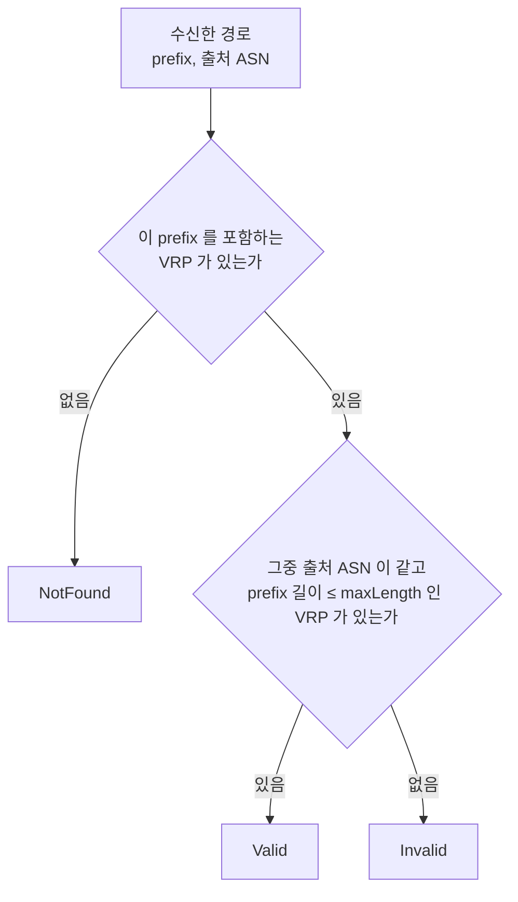
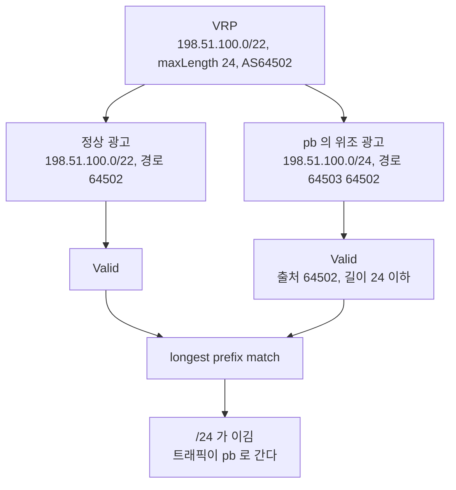
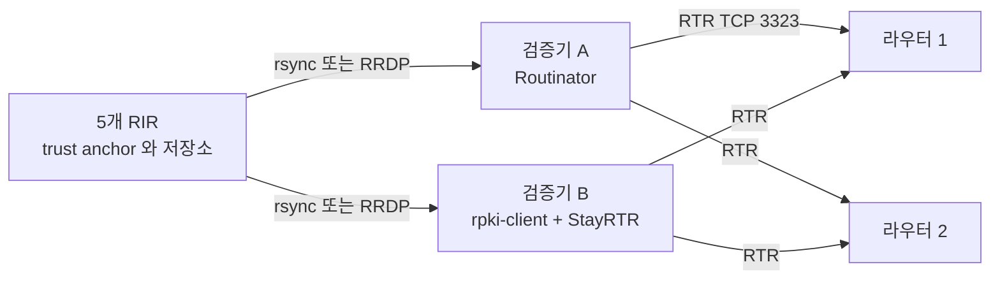
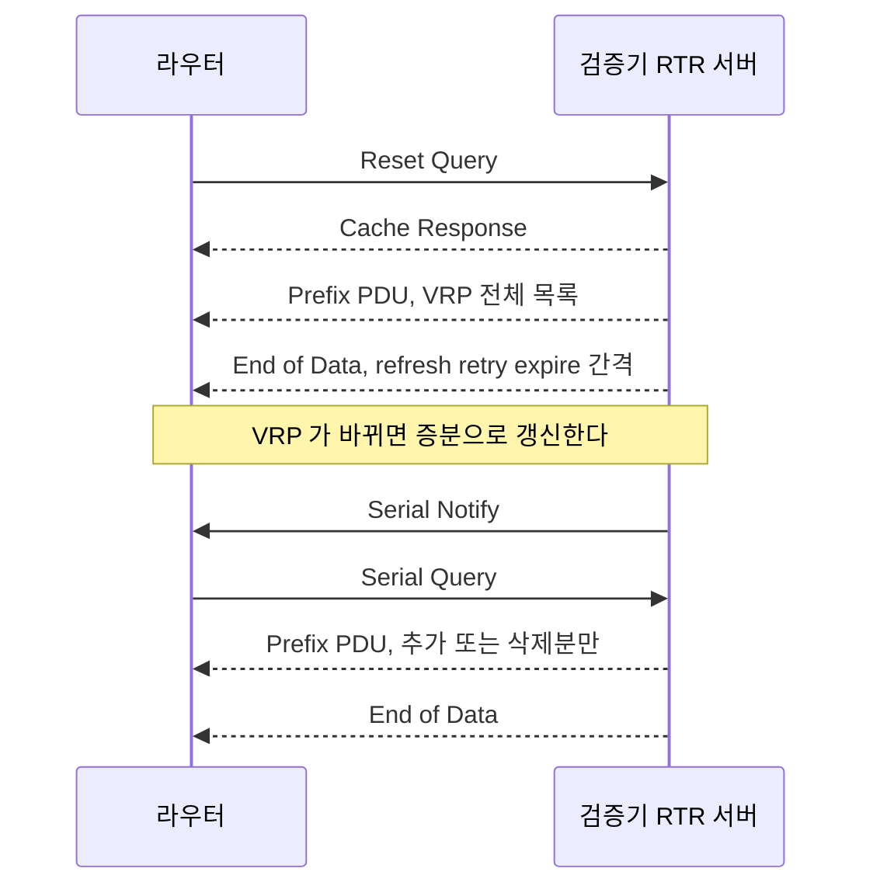
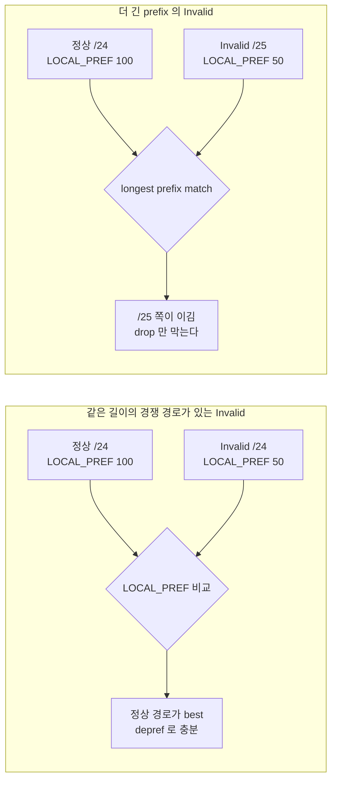
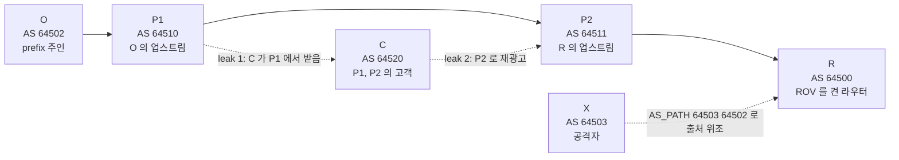
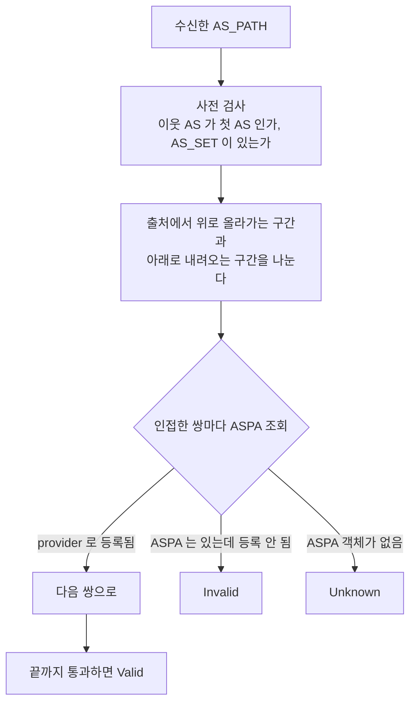
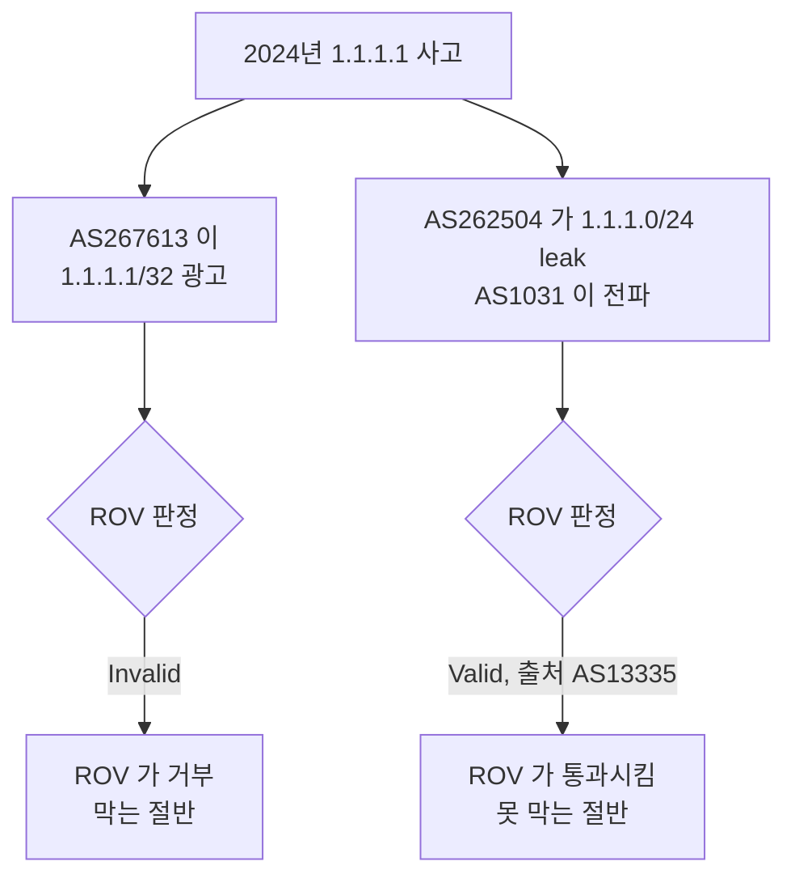

# BGP 경로 보안: RPKI, ROV, ASPA

[BGP](BGP.md) 문서 끝에 RPKI 를 한 단락으로 적어 두었다. ROA 가 있고 라우터가 그걸 보고 경로를 거른다는 정도다. 정작 운영에서 부딪히는 질문은 그다음에 있다. ROA 를 만들었는데 maxLength 를 얼마로 잡을지, 검증기가 죽으면 라우터는 어떻게 되는지, Invalid 를 버릴지 LOCAL_PREF 만 낮출지, 그리고 ROV 를 켜 놨는데도 왜 사고가 나는지.

이 문서는 경로 보안만 다룬다. community 로 정책을 태우는 이야기는 [BGP community와 라우팅 정책](BGP_Community_and_Routing_Policy.md) 쪽이다.

## 실험 환경

설정과 출력은 직접 돌려서 가져왔다. 컨테이너 런타임이 없는 머신이라 network namespace 네 개로 토폴로지를 만들었다.

| 이름 | ASN | 역할 | 소프트웨어 |
|---|---|---|---|
| r1 | 64500 | ROV 를 켜는 내 라우터 | FRR 8.1 (`bgpd -M rpki`, rtrlib 모듈) |
| pa | 64502 | 정상 출처. 192.0.2.0/24, 198.51.100.0/22 의 주인 | FRR 8.1 |
| pb | 64503 | 공격자 역할 | FRR 8.1 |
| val | - | 검증기 + RTR 서버 | Routinator 0.15.2 |

실제 RIR 의 trust anchor 는 쓰지 않았다. 격리된 namespace 에서 인터넷 저장소를 긁을 이유가 없어서, Routinator 의 SLURM(로컬 예외 파일)에 ROA 와 같은 효과를 내는 assertion 두 개를 넣어 VRP 를 직접 만들었다. 검증기가 RTR 로 내보내는 PDU 는 진짜와 같은 형태다. BIRD 2.0.8 로도 같은 시나리오를 돌렸고 판정은 FRR 과 같았다.

```json
{"slurmVersion":1,
 "validationOutputFilters":{"prefixFilters":[],"bgpsecFilters":[]},
 "locallyAddedAssertions":{"prefixAssertions":[
   {"asn":64502,"prefix":"192.0.2.0/24","maxPrefixLength":24},
   {"asn":64502,"prefix":"198.51.100.0/22","maxPrefixLength":24}],
  "bgpsecAssertions":[]}}
```

## ROA 가 말하는 것과 말하지 않는 것

ROA(Route Origin Authorization)는 세 값을 서명한 객체다. prefix, maxLength, origin ASN. "이 prefix 와 그 안쪽 maxLength 까지의 더 긴 prefix 를 이 ASN 이 출발점으로 광고해도 된다"는 뜻이다. 검증기가 서명 체인을 확인하고 나면 ROA 한 줄은 VRP(Validated ROA Payload)라는 `(prefix, maxLength, ASN)` 튜플이 된다. 라우터가 보는 건 ROA 가 아니라 이 VRP 목록이다.

RFC 6811 의 판정 규칙은 두 단어로 갈린다. VRP 의 prefix 가 경로의 prefix 를 포함하면 그 경로는 그 VRP 에 **covered** 다. covered 이면서 origin ASN 이 같고 경로의 prefix 길이가 maxLength 이하면 **matched** 다. 경로 하나에 대해 matched 인 VRP 가 하나라도 있으면 Valid, covered 인 VRP 는 있는데 matched 가 없으면 Invalid, covered 인 VRP 자체가 없으면 NotFound 다 ([RFC 6811](https://datatracker.ietf.org/doc/html/rfc6811)). AS_PATH 끝이 AS_SET 인 경로는 출처 ASN 이 "없음"으로 취급돼 어떤 VRP 와도 matched 가 안 되고, covered 이면 Invalid 가 된다.



규칙이 단순해서 오히려 오해가 많다. 하나씩 짚으면 이렇다. 첫째, ROA 는 AS_PATH 를 아무것도 증명하지 않는다. 출처 ASN 이 맞으면 경로가 어떤 AS 들을 거쳐 왔든 Valid 다. 둘째, NotFound 는 "검증 실패"가 아니라 "ROA 가 없다"는 뜻이라서 정상 통과시키는 게 기본이다. ROA 를 만든 prefix 만 보호받는다.

실험 결과가 이 두 가지를 같이 보여준다. r1 이 ROV 를 켜고 `match rpki invalid` 를 거부하게 둔 상태에서 본 BGP 테이블이다 (`V` Valid, `N` NotFound, `I` Invalid).

```
   Network          Next Hop            Metric LocPrf Weight Path
V*> 192.0.2.0/24     10.1.2.2                 0             0 64502 i
V*> 198.51.100.0/22  10.1.2.2                 0             0 64502 i
V   198.51.100.0/24  10.1.3.2                 0             0 64503 64502 i
N*> 203.0.113.0/24   10.1.2.2                 0             0 64502 i
N   203.0.113.0/25   10.1.3.2                 0             0 64503 i
```

pb(64503)는 자기 ASN 을 출처로 192.0.2.0/24 도 광고했다. 이 줄은 테이블에 없다. ASN 이 달라서 Invalid 가 됐고 정책이 버렸다. 반면 203.0.113.0/25 는 그 /24 에 ROA 가 없으니 NotFound 로 그대로 들어왔다. 그리고 `198.51.100.0/24` 줄이 이 문서의 나머지 절반을 요약한다. 경로가 `64503 64502` 인데 Valid 다. 이 이야기는 뒤에서 한다.

(`198.51.100.0/24` 줄에 `*` 가 없는 건 r1 의 zebra 를 중간에 재시작한 탓에 nexthop 이 inaccessible 로 찍힌 실험 환경 문제다. 볼 것은 검증 상태이고 그 값은 `rpki validation-state: valid` 로 확인했다.)

## maxLength 는 느슨하면 구멍이고 빡빡하면 자해다

위 표에서 pa 의 ROA 는 `198.51.100.0/22`, maxLength 24 다. 이 ROA 는 /22 도, 그 안의 /23 두 개도, /24 네 개도 AS64502 가 광고해도 된다고 말한다. 편의상 이렇게 열어 두는 경우가 많다. 트래픽 엔지니어링으로 /24 로 쪼개 광고하거나 DDoS 때 더 긴 prefix 로 우회시킬 여지가 필요하기 때문이다.

문제는 pb 가 /24 하나를 골라 출처를 위조하는 순간 생긴다. AS_PATH 맨 끝에 `64502` 를 붙여 `64503 64502` 로 광고하면 출처가 64502 이고, /24 는 maxLength 24 이내라서 matched 다. Valid 로 판정되고 ROV 를 켠 라우터도 받아 준다. 라우팅 테이블에서는 longest prefix match 가 이긴다. /22 경로가 AS_PATH 가 더 짧든 말든 /24 쪽으로 트래픽이 간다. 이 결과는 FRR 로 확인했고 BIRD 에서도 같았다.

아래 그림은 같은 VRP 하나가 정상 광고와 위조 광고를 둘 다 Valid 로 만든 뒤, 마지막 단계인 longest prefix match 에서 승부가 갈리는 흐름이다.



maxLength 를 ROA 에 쓰지 않으면 이 구멍은 막힌다. RFC 9319(BCP 185)는 maxLength 를 꼭 필요한 경우가 아니면 쓰지 말고 "minimal ROA"를 만들라고 권고한다. 실제로 광고하는 prefix 만 정확히 ROA 로 적는다는 뜻이다 ([RFC 9319](https://datatracker.ietf.org/doc/html/rfc9319)).

반대편 함정도 실험했다. SLURM 의 /22 assertion 을 maxPrefixLength 22 로 줄이고(`slurm_tight.json`) 검증기를 다시 돌리니, AS64502 가 정상적으로 광고하던 자기 /24 가 Invalid 로 나왔다. ROA 를 빡빡하게 쓰고 더 긴 prefix 를 광고하는 걸 잊으면 ROV 를 켠 네트워크에서 내 트래픽이 먼저 사라진다. ROA 를 만들거나 고치기 전에 내 라우터가 지금 내보내는 prefix 길이를 전부 뽑아 놓고 대조하는 습관이 필요한 이유다. 발급은 ROA 쪽이고 사고는 대개 BGP 쪽 목록과 어긋나서 난다.

ROA 파일 형식 자체의 최신 규격은 [RFC 9582](https://datatracker.ietf.org/doc/html/rfc9582)다.

## 검증기와 RTR

라우터가 RPKI 저장소를 직접 긁고 X.509 체인을 확인하는 일은 하지 않는다. 그 일은 검증기(relying party software)가 맡고, 라우터에는 검증이 끝난 VRP 목록만 RTR(RPKI-to-Router) 프로토콜로 전달한다.



검증기 후보는 셋을 많이 본다. Routinator(NLnet Labs)는 검증과 RTR 서버를 한 프로세스에서 한다. rpki-client(OpenBSD)는 검증만 하고 JSON 이나 CSV 로 결과를 내놓는데, RTR 서버 기능은 없다. 그 앞단에 StayRTR 를 붙이면 JSON 파일을 읽어 RTR 로 서빙한다. StayRTR 는 RFC 6810 과 8210 을 구현한다고 스스로 적고 있다 ([StayRTR](https://github.com/bgp/stayrtr)).

RTR 는 단순한 프로토콜이다. 라우터가 Reset Query 로 전체를 받고, 이후엔 Serial Notify 를 받거나 주기적으로 Serial Query 를 보내 증분만 받는다. RFC 8210(v1)에서는 End of Data PDU 가 refresh, retry, expire 간격을 실어 보낸다 ([RFC 8210](https://datatracker.ietf.org/doc/html/rfc8210)). ASPA 를 실을 v2 는 아직 draft 이고 `draft-ietf-sidrops-8210bis` 에 정리돼 있다.

처음 전체를 받는 단계와 이후 증분만 받는 단계가 어떻게 이어지는지는 아래 순서도로 보는 편이 빠르다.



운영 중 가장 조심할 점은 **검증기 연결이 끊어졌을 때 ROV 가 조용히 꺼진다**는 것이다. VRP 가 하나도 없으면 모든 경로가 NotFound 이고 NotFound 는 통과다. 라우터는 경고도 없이 ROV 없는 라우터로 돌아간다. 그래서 검증기를 서로 다른 구현으로 최소 둘 두고, 라우터에는 둘 다 cache 로 등록한다. FRR 의 `rpki cache ... preference` 가 그 우선순위다. 그리고 모니터링에서는 `match rpki` 가 동작하는지가 아니라 cache 연결 상태와 VRP 개수를 본다.

연결이 겉으로 붙었는데 동작하지 않는 일도 겪었다. 처음에 `show rpki cache-connection` 이 "No connection to RPKI cache server" 였는데 TCP 는 붙어 있었다. 파이썬으로 RTR 쿼리를 직접 보내 보니 Routinator 가 PDU 를 정상으로 내보내고 있었다. `rpki retry_interval 5` 를 넣고 r1 의 bgpd 를 재시작하자 연결이 올라왔다. 원인을 FRR 쪽 어디라고 끝까지 확정하지는 못했다. 첫 시도에 `rpki stop` 을 실행했다가 bgpd 가 죽은 적도 있다. 쓰기 전에 `Connected to group 1` 이 찍히는지 확인하고 그 뒤에 정책을 거는 순서로 했다.

```
r1# show rpki cache-connection
Connected to group 1
rpki tcp cache 10.9.0.2 3323 pref 1

r1# show rpki prefix-table
Prefix                                   Prefix Length  Origin-AS
198.51.100.0                                22 -  24        64502
192.0.2.0                                   24 -  24        64502
Number of IPv4 Prefixes: 2
```

`Prefix Length 22 - 24` 이 ROA 의 prefix 길이와 maxLength 다. 라우터에 들어온 VRP 를 이 표에서 눈으로 대조할 수 있다.

SLURM([RFC 8416](https://datatracker.ietf.org/doc/html/rfc8416))은 이 실험에서는 VRP 를 만드는 데 썼지만 본래 용도는 반대다. 상대 ROA 가 잘못 나갔을 때 내 검증기 쪽에서 그 prefix 만 임시로 허용하거나 필터링하는 로컬 예외다. 남의 실수 때문에 내 고객 경로가 Invalid 로 떨어질 때 쓰는 비상 레버다.

## FRR 과 BIRD 에서 ROV 켜기

FRR 은 `bgpd` 를 `-M rpki` 로 띄워야 하고, Ubuntu 에서는 `frr-rpki-rtrlib` 패키지가 별도다. 설정은 `rpki` 블록에서 cache 를 등록하고, route-map 에서 `match rpki` 로 판정 상태를 집는다.

```
rpki
 rpki polling_period 60
 rpki retry_interval 5
 rpki cache 10.9.0.2 3323 preference 1
 exit
!
router bgp 64500
 neighbor 10.1.2.2 remote-as 64502
 neighbor 10.1.3.2 remote-as 64503
 address-family ipv4 unicast
  neighbor 10.1.2.2 route-map IN-ROV in
  neighbor 10.1.3.2 route-map IN-ROV in
 exit-address-family
!
route-map IN-ROV deny 10
 match rpki invalid
route-map IN-ROV permit 20
```

Invalid 를 버리는 대신 우선순위만 낮추려면 첫 항목을 이렇게 바꾼다.

```
route-map IN-ROV permit 10
 match rpki invalid
 set local-preference 50
route-map IN-ROV permit 20
```

BIRD 는 ROA 테이블을 따로 만들고 `roa_check` 로 판정한다. 출처 ASN 은 `bgp_path.last` 다.

```
roa4 table r4;

protocol rpki rtr_routinator {
    roa4 { table r4; };
    remote 10.9.0.2 port 3323;
    retry keep 10;
    refresh keep 900;
    expire keep 172800;
}

filter rov_drop {
    if roa_check(r4, net, bgp_path.last) = ROA_INVALID then reject;
    accept;
}

filter rov_depref {
    if roa_check(r4, net, bgp_path.last) = ROA_INVALID then bgp_local_pref = 50;
    accept;
}

protocol bgp from_pa {
    local 10.1.4.1 as 64510;
    neighbor 10.1.4.2 as 64502;
    ipv4 { import filter rov_drop; export none; };
}
```

두 구현 모두 ROV 는 **import 정책**이다. 검증기가 정한 상태를 읽어 경로를 받을지 말지만 정하고, 이미 받은 경로를 사후에 지우지는 않는다. 여러 피어에 걸어야 하는 정책이라 FRR 에서는 peer-group 에, BIRD 에서는 공통 filter 하나에 묶어 두는 편이 낫다. 피어 하나에 거는 걸 빠뜨리면 그 피어만 ROV 가 꺼진다.

## drop 과 LOCAL_PREF 는 같지 않다

Invalid 를 완전히 버리기가 무서워서 LOCAL_PREF 만 낮추는 쪽을 선택하는 팀이 많다. 정상 트래픽을 잃을 위험은 피하면서 보호는 받겠다는 생각이다. 그런데 둘은 동등하지 않다. RFC 8207 은 BGPsec 의 Not Valid 경로를 다루는 대목에서 이 점을 짚는다. 대상은 BGPsec 이지만 논리는 ROV 의 Invalid 에 그대로 들어맞는다. LOCAL_PREF 는 **같은 목적지 집합을 가진 경로끼리만** 비교한다 ([RFC 8207](https://datatracker.ietf.org/doc/html/rfc8207)). 같은 prefix 로 들어온 정상 경로가 있어야 낮춘 값이 효과를 낸다. RFC 의 예도 /16 정상 경로와 그 안쪽 /24 Not Valid 경로를 두고, 후자를 버리지 않으면 LOCAL_PREF 값과 상관없이 longest match 가 그쪽으로 패킷을 보낸다고 쓴다.

실험에서 pb 가 192.0.2.0/25 를 자기 출처로 광고하게 했다. 이 /25 는 ROA 의 /24 안쪽이고 maxLength 24 를 넘으니 Invalid 다. LOCAL_PREF 50 으로 낮춘 상태에서 BGP 테이블을 보면 이 Invalid 경로가 /25 로 들어온 유일한 경로라서 best 가 된다. 경쟁 경로가 없다. 라우팅 테이블에 들어가면 longest prefix match 때문에 192.0.2.0/24 로 가야 할 트래픽 중 이 /25 에 속하는 절반이 pb 쪽으로 간다. (FIB 에 실제로 들어간 모습은 실험 중 zebra 가 죽는 바람에 깔끔하게 캡처하지 못했다. BGP 테이블 단계의 best 선정은 확인했고, 그 뒤는 LPM 규칙이다.)

아래 그림은 LOCAL_PREF 가 통하는 경우(같은 길이의 경쟁 경로가 있음)와 통하지 않는 경우(더 긴 prefix)를 나란히 놓은 것이다.



더 긴 prefix 로 가로채려는 Invalid 는 정의상 같은 길이의 경쟁 경로가 없는 경우가 많고, LOCAL_PREF 는 그 모양을 못 막는다. 정상 경로와 같은 길이인데 출처 ASN 만 다른 Invalid 라면 LOCAL_PREF 도 통한다. 그래서 도입 초기에 LOCAL_PREF 나 로깅 단계를 두는 건 괜찮아도, 최종 상태는 drop 으로 잡는 편이 맞다고 본다. RFC 8207 도 같은 이유로 BGPsec Not Valid 를 버리라고 권고한다.

## ROV 가 보지 못하는 경로: forged origin 과 route leak

ROV 는 경로의 **마지막 ASN** 만 본다. 그래서 두 가지는 원리상 못 막는다.

하나는 위에서 본 forged-origin 이다. 출처를 정상 ASN 으로 위조하고 그 앞에 자기 ASN 을 붙이면 Valid 다. 다른 하나는 route leak 이다. 정상 출처의 경로를 AS 관계에 맞지 않는 방향으로 다시 광고하는 사고인데, 출처는 그대로 정상이니 ROV 는 Valid 를 낸다. 아래 그림은 세 경우를 한 토폴로지에 그렸다. 실선이 정상 경로, 점선이 위조 경로와 leak 경로다.



정상 경로는 R 이 `64511 64510 64502` 로 보는 것이다. 위조는 X 가 R 에 직접 `64503 64502` 를 광고하는 경우다. leak 은 C 가 P1 에서 받은 경로를 P2 에 올려 보내는 경우로, R 이 `64511 64520 64510 64502` 를 받는다. 셋 다 출처는 64502 이고 ROA 가 맞으니 R 은 전부 Valid 를 낸다.

2024년 6월 1.1.1.1 사고에서 이 구조가 그대로 나타났다. Cloudflare 는 그 사고의 한 부분을 이렇게 설명한다. 1.1.1.0/24 가 AS262504 에 의해 위쪽으로 leak 됐고, 경로 `199524 1031 262504 267613 13335` 는 출처가 AS13335 라서 RPKI Valid 지만 AS267613 이 사실상 피어인 AS13335 의 경로를 피어나 업스트림에 내보냈다는 점에서 leak 이라는 것이다 ([Cloudflare](https://blog.cloudflare.com/cloudflare-1111-incident-on-june-27-2024/)). ROA 가 맞으니 ROV 는 통과시켰다.

### ASPA

ASPA(Autonomous System Provider Authorization)는 이 간극을 메우려는 RPKI 객체다. 어떤 AS 가 자기 업스트림(provider) AS 목록을 서명해서 공개한다. 검증하는 쪽은 AS_PATH 의 인접한 쌍마다 "앞 AS 가 뒤 AS 를 provider 로 등록했는가"를 본다. 결과는 Valid, Invalid, Unknown 이다 ([ASPA 검증 draft](https://datatracker.ietf.org/doc/draft-ietf-sidrops-aspa-verification/)).

위 토폴로지에 대입하면 이렇다. AS64510(P1)이 ASPA 에 자기 provider 목록을 올렸는데 AS64520(C)이 거기 없다면, `64510 → 64520` 은 customer → provider 가 아님이 증명되고, 올라갔다 내려온 경로가 다시 올라가는 모양은 Invalid 가 된다. leak 을 이 방식으로 잡는다. 위조 경로 `64503 64502` 도 AS64502 의 ASPA 에 64503 이 없으면 Invalid 다. draft 는 이걸 forged-origin 을 "어느 정도" 막는다고 쓴다.



ASPA 에는 단서 두 개가 붙는다. 하나는 규격이 아직 Internet-Draft 라는 점이다. 이 문서를 쓰는 시점에 최신 판은 `draft-ietf-sidrops-aspa-verification-28`(2026-08-24)이고, draft 자체가 "work in progress 로만 인용하라"고 밝힌다. 구현체마다 알고리즘과 옵션이 아직 달라질 수 있어 운영 도입은 시험 단계로 본다. 다른 하나는 효과가 ASPA 를 등록한 AS 가 늘어야 나온다는 점이다. 등록이 없으면 Unknown 이고 Unknown 은 통과다. NotFound 와 같은 도입의 한계가 그대로 있다.

경로 leak 을 세션 단위에서 막는 방법도 있다. RFC 9234 가 BGP role(provider, customer, peer 등)을 OPEN 에 협상하고 Only to Customer 속성을 붙여 leak 을 이웃 사이에서 차단한다 ([RFC 9234](https://datatracker.ietf.org/doc/html/rfc9234)). ASPA 와 다른 층이다. 9234 는 직접 맞닿은 이웃 사이에서, ASPA 는 경로 전체를 본다.

### BGPsec 이 왜 안 쓰이는가

BGPsec([RFC 8205](https://datatracker.ietf.org/doc/html/rfc8205))은 같은 문제를 다르게 푼다. 경로가 AS 를 지날 때마다 그 AS 의 라우터가 서명을 얹어서, 받는 쪽이 경로 전체의 서명 체인을 검증한다. 원리로는 ASPA 보다 강하다. 그런데 배포되지 않는다. RFC 와 RFC 8207 에 적힌 구조에서 이유를 읽을 수 있다.

- **전체 경로를 서명해야 의미가 있다.** 중간에 BGPsec 을 안 쓰는 AS 가 하나라도 있으면 서명 체인이 끊긴다. RFC 8207 은 이걸 "islands of assured paths"로 부르며, 섬이 서로 닿아야 커진다고 쓴다. 먼저 도입한 쪽이 얻는 이득이 거의 없다.
- **UPDATE 하나에 prefix 하나만 담는다.** 서명이 prefix 와 수신 AS 마다 달라서 지금처럼 prefix 여럿을 한 UPDATE 로 묶거나 한 UPDATE 를 여러 피어에 재사용할 수 없다. 메시지 수와 라우터의 CPU, 메모리가 같이 는다.
- **라우터가 서명 키를 갖고 서명과 검증을 직접 한다.** ROA 는 검증기 한 곳에서 끝나지만 BGPsec 은 경로가 지나는 라우터마다 키와 서명 부하가 생긴다.
- **NotFound 같은 중간 상태가 없다.** 서명이 없는 경로는 그냥 BGPsec 경로가 아니다.

ASPA 가 이 비용을 지지 않는 게 지금 방향이 갈린 이유라고 읽는다. 객체는 RPKI 에 올리고 검증은 검증기가 하며 라우터는 RTR 로 받은 결과로 비교만 한다. 이건 규격 문서에 쓰인 사실이 아니라 내가 두 방식의 설계를 비교해서 낸 해석이다.

## 접점에서 거르기: IRR, bogon, max-prefix, peer-lock

RPKI 가 없거나 못 믿는 구간은 오래된 방식으로 막는다. RFC 7454(BCP 194)가 이 필터들을 정리한다 ([RFC 7454](https://datatracker.ietf.org/doc/html/rfc7454)). 필터는 값싼 것부터 순서대로 걸리게 한다.


### IRR 로 prefix-list 만들기

고객이나 피어가 광고해도 되는 prefix 는 IRR(Internet Routing Registry)의 route 객체와 as-set 에서 뽑는다. 손으로 만들지 않고 bgpq4 로 생성한다. 이 머신에서 1.4 로 돌린 결과다.

```
$ bgpq4 -4 -A -l CF-IN AS13335
no ip prefix-list CF-IN
ip prefix-list CF-IN permit 1.0.0.0/24
ip prefix-list CF-IN permit 1.1.1.0/24
ip prefix-list CF-IN permit 1.32.192.0/18
ip prefix-list CF-IN permit 5.10.214.0/23 ge 24 le 24
...
```

`-A` 는 인접한 prefix 를 합쳐 줄 수를 줄이고, `-m 24` 는 최대 길이를 제한한다. 라우터 종류는 옵션으로 고른다(`-b` BIRD, `-J` Junos 등). 이 목록을 cron 으로 갱신해서 라우터에 밀어 넣는 식으로 쓴다.

한계를 알고 써야 한다. IRR 은 누구나 객체를 만들 수 있는 레지스트리라 RPKI 만큼 믿을 수 없다. 2018년 Amazon Route53 사건에서 Cloudflare 는 이미 IRR 에 `route: 205.251.192.0/23 origin: AS16509` 가 등록돼 있었다는 걸 `whois` 로 보여주며 필터를 만들 수 있었다고 설명한다 ([Cloudflare](https://blog.cloudflare.com/bgp-leaks-and-crypto-currencies/)). 그런데 2024년 사고 글은 IRR 필터링을 "best-effort 안전장치"로 부른다. 둘 다 사실이다. 있는 걸 쓰면 막히고, 필터가 없는 업스트림이 하나라도 있으면 새어 나간다.

### 경로 필터와 max-prefix, peer-lock

FRR 에서 실제로 돌려 본 접점 필터는 이렇다.

```
ip prefix-list BOGONS seq  5 permit 10.0.0.0/8 le 32
ip prefix-list BOGONS seq 10 permit 172.16.0.0/12 le 32
ip prefix-list BOGONS seq 15 permit 192.168.0.0/16 le 32
ip prefix-list BOGONS seq 20 permit 100.64.0.0/10 le 32
ip prefix-list BOGONS seq 25 permit 169.254.0.0/16 le 32
ip prefix-list NO-DEFAULT seq 5 permit 0.0.0.0/0
ip prefix-list TOO-LONG seq 5 permit 0.0.0.0/0 ge 25
!
route-map IN-EDGE deny 10
 match ip address prefix-list BOGONS
route-map IN-EDGE deny 20
 match ip address prefix-list NO-DEFAULT
route-map IN-EDGE deny 30
 match ip address prefix-list TOO-LONG
route-map IN-EDGE deny 40
 match rpki invalid
route-map IN-EDGE permit 50
!
bgp as-path access-list PEERLOCK-PB deny _64502_
bgp as-path access-list PEERLOCK-PB permit .*
!
router bgp 64500
 address-family ipv4 unicast
  neighbor 10.1.3.2 route-map IN-EDGE in
  neighbor 10.1.3.2 filter-list PEERLOCK-PB in
  neighbor 10.1.3.2 maximum-prefix 2
```

`TOO-LONG` 이 /25 이상을 거부한다. 2024년 사고에서 AS267613 이 광고한 1.1.1.1/32 는 이 필터 하나로 걸린다. Cloudflare 도 MANRS 가 권하는 대로 DFZ 에서 /24 보다 긴 IPv4 prefix 를 거르는 것이 영향을 줄였을 것이라고 쓴다 ([Cloudflare](https://blog.cloudflare.com/cloudflare-1111-incident-on-june-27-2024/)). MANRS 는 필터링, 스푸핑 방지, 연락 체계, 전역 검증을 요구하는 업계 프로그램이다 ([MANRS](https://www.manrs.org/)). IPv6 는 같은 이유로 /48 보다 긴 것을 거른다.

`PEERLOCK-PB` 는 peer-lock 이다. pb(64503)는 업스트림이 아니라서 pb 에서 오는 경로의 AS_PATH 에 64502(pa)가 들어 있을 이유가 없다. 그런 경로는 거부한다. 앞의 forged-origin 실험을 그대로 막는 필터다. ROV 가 못 막는 것을 수작업 AS_PATH 필터가 막는다. 대신 이건 대형 업스트림끼리 서로 상대 ASN 목록을 합의하고 유지해야 해서 아무 네트워크가 쉽게 쓸 수 있는 방식은 아니다. ASPA draft 는 §8.3 에서 이를 Peerlock 과의 관계로 다룬다.

`maximum-prefix` 는 leak 이 터졌을 때 세션을 자동으로 내려서 피해를 자르는 장치다. 한도 2 로 걸고 pb 가 prefix 를 더 많이 광고하게 했더니 세션이 `Idle (PfxCt)` 로 떨어졌고 pb 쪽에서 `Cease/Maximum Number of Prefixes Reached` 가 올라왔다. 정확히 몇 번째 prefix 에서 걸렸는지는 inbound 필터와 얽혀 있어 확정하지 못했다(4번째에서 끊겼다). 실제 한도는 평소 수신량에 여유를 둔 값으로 잡아야 하고, 세션이 내려간 뒤 자동으로 복구할지는 `restart` 옵션까지 정해야 한다. 한도를 너무 낮게 잡으면 정상 증가에도 세션이 끊긴다.

## 사고 사례 네 건

아래는 직접 열어서 확인한 공식 기록만 적었다. 출처에 없는 피해 수치는 쓰지 않았다.

**2008년 YouTube.** 2008-02-24 18:47 UTC, Pakistan Telecom(AS17557)이 YouTube 의 208.65.152.0/22 안쪽인 208.65.153.0/24 를 광고했고 PCCW Global(AS3491)이 이를 전 세계로 전달했다. YouTube 는 20:07 에 같은 /24 를 광고했지만 경쟁 경로일 뿐이라 일부 트래픽은 계속 파키스탄으로 갔다. 20:18 에 /25 두 개를 광고하자 longest prefix match 로 전부 돌아왔다. 21:01 에 AS3491 이 AS17557 의 prefix 를 철회하며 끝났다. RPKI 가 없던 시절이고, 더 긴 prefix 가 이긴다는 규칙이 공격과 방어 양쪽에 쓰인 기록이다 ([RIPE NCC](https://www.ripe.net/about-us/news/youtube-hijacking-a-ripe-ncc-ris-case-study/)). ROA 가 /22 하나만 있고 maxLength 22 였다면 이 /24 는 ROV 에서 Invalid 였을 것이다.

**2018년 Amazon Route53.** eNet(AS10297)이 Amazon(AS16509)의 205.251.192.0/23 등 네 개 /23 을 쪼갠 /24 다섯 개를 광고했고 Hurricane Electric(AS6939)이 전달했다. 약 두 시간(11:05~12:55 UTC 구간) 동안 해당 DNS 서버가 myetherwallet.com 질의에만 응답했고, Cloudflare 의 1.1.1.1 도 일부 지역에서 오염된 응답을 받았다 ([Cloudflare](https://blog.cloudflare.com/bgp-leaks-and-crypto-currencies/)). DNS 를 건드린 하이재킹이라 경로 수용 여부와 상관없이 오염된 리졸버만 써도 피해를 입는다는 점이 이 사건의 특징이다.

**2019년 Verizon.** BGP optimizer(Noction) 가 받은 prefix 를 더 작은 조각으로 쪼개는 기능이 있었고, 그 조각이 외부로 나갔다. Cloudflare 의 104.20.0.0/20 이 /21 두 개로 쪼개진 사례가 글에 나온다. Verizon(AS701)은 이 경로를 받아 전달하지 말았어야 했다고 글이 지적한다 ([Cloudflare](https://blog.cloudflare.com/how-verizon-and-a-bgp-optimizer-knocked-large-parts-of-the-internet-offline-today/)). 이 글에서 직접 인용되지는 않지만, ROA 의 maxLength 가 /20 이었다면 쪼개진 /21 이 Invalid 가 되는 구조다. 경로를 쪼개 광고하는 도구와 ROA 의 maxLength 가 충돌하는 지점이다.

**2024년 1.1.1.1.** 두 사건이 겹쳤다. AS267613 이 1.1.1.1/32 를 광고했고(이건 RPKI Invalid 다) 최소 한 곳의 Tier 1 사업자가 blackhole 경로로 받아들였다. 동시에 1.1.1.0/24 가 AS262504 에 의해 leak 됐고 AS1031 이 널리 퍼뜨렸다(이건 Valid 다). Cloudflare 는 /32 때문에 300개가 넘는 네트워크, 70개국에서 즉시 도달 불가가 발생했다고 적었다. 자기들은 /32 를 RPKI Invalid 와 DFZ Invalid 로 거부했다 ([Cloudflare](https://blog.cloudflare.com/cloudflare-1111-incident-on-june-27-2024/)). 한 사건 안에 ROV 가 막는 절반과 막지 못하는 절반이 같이 있었다. 앞의 설명이 그대로 맞아떨어지는 사례라서 이 문서의 기준 사례로 삼았다.

아래 그림은 2024년 사고를 두 사건으로 나눠 ROV 판정이 어디서 갈렸는지 보여준다.



## 내 prefix 가 바깥에서 어떻게 보이는지

ROA 를 만든 뒤, 그리고 광고를 바꿀 때마다 바깥 시점에서 확인한다. 내 라우터가 말하는 것과 인터넷이 받는 것은 다를 수 있다.

- **RIPEstat** (`stat.ripe.net`): `routing-status` 로 출처 ASN 과 가시성을, `rpki-validation` 으로 판정 결과를 JSON 으로 받는다. 키 없이 호출된다.
- **bgp.tools**: prefix 나 ASN 으로 검색하면 업스트림, 피어, 최근 변동을 웹으로 본다.
- **RouteViews, RIPE RIS**: 전 세계 수집기의 원본 BGP 데이터(MRT)다. 경로를 직접 받아 분석할 때 쓴다.
- **Looking Glass**: 업스트림이나 IX 가 제공하는 웹 또는 CLI 화면이다. 그 사업자의 라우터에서 내 prefix 가 어떤 경로와 어떤 RPKI 상태로 보이는지를 확인한다.

RIPEstat 만으로 감시 스크립트를 만들어 1.1.1.0/24 로 돌려 봤다. 기대 출처와 다른 origin, Valid 가 아닌 RPKI 상태, 예상 못 한 more-specific 이 나타나면 그 내용을 출력한다.

```python
#!/usr/bin/env python3
import json, urllib.request

EXPECT = {"1.1.1.0/24": 13335}
API = "https://stat.ripe.net/data"

def get(path):
    with urllib.request.urlopen(f"{API}/{path}", timeout=15) as r:
        return json.load(r)["data"]

for prefix, asn in EXPECT.items():
    st = get(f"routing-status/data.json?resource={prefix}")
    origins = {o["origin"] for o in st["origins"]}
    vis = st["visibility"]["v4"]
    rpki = get(f"rpki-validation/data.json?resource=AS{asn}&prefix={prefix}")["status"]
    more = [m["prefix"] for m in st.get("more_specifics", [])]
    problems = []
    if origins != {asn}:
        problems.append(f"origin {sorted(origins)} (기대 {asn})")
    if rpki != "valid":
        problems.append(f"RPKI {rpki}")
    if more:
        problems.append(f"more-specific {more}")
    print(prefix, f"RIS {vis['ris_peers_seeing']}/{vis['total_ris_peers']}",
          "이상 없음" if not problems else "; ".join(problems))
```

```
1.1.1.0/24 RIS 110/111 이상 없음
```

RIS 피어 111개 중 110개가 이 prefix 를 본다는 뜻이다. 이 스크립트가 잡는 건 "내 prefix 를 바깥이 어떻게 보는가" 한 방향이다. 더 쪼갠 /32 같은 하이재킹은 more-specific 항목으로 드러난다. 2024년 사고의 /32 가 이런 항목으로 보였을 것이다. 반면 leak 은 출처가 정상이라 origin 과 RPKI 둘 다 멀쩡하다. AS_PATH 에 낯선 AS 가 끼는지는 경로를 직접 비교하는 쪽으로 따로 감시해야 한다.

## 출처

- [RFC 6811 — BGP Prefix Origin Validation](https://datatracker.ietf.org/doc/html/rfc6811)
- [RFC 8210 — RPKI-to-Router Protocol, Version 1](https://datatracker.ietf.org/doc/html/rfc8210)
- [RFC 8416 — SLURM](https://datatracker.ietf.org/doc/html/rfc8416)
- [RFC 9319 — maxLength 사용 (BCP 185)](https://datatracker.ietf.org/doc/html/rfc9319)
- [RFC 9582 — ROA 프로필](https://datatracker.ietf.org/doc/html/rfc9582)
- [RFC 8205 — BGPsec 프로토콜](https://datatracker.ietf.org/doc/html/rfc8205)
- [RFC 8207 — BGPsec 운영 고려사항](https://datatracker.ietf.org/doc/html/rfc8207)
- [RFC 9234 — BGP role 과 route leak 방지](https://datatracker.ietf.org/doc/html/rfc9234)
- [RFC 7454 — BGP 운영 보안 (BCP 194)](https://datatracker.ietf.org/doc/html/rfc7454)
- [draft-ietf-sidrops-aspa-verification](https://datatracker.ietf.org/doc/draft-ietf-sidrops-aspa-verification/) (Internet-Draft)
- [Cloudflare — 1.1.1.1 incident on June 27, 2024](https://blog.cloudflare.com/cloudflare-1111-incident-on-june-27-2024/)
- [Cloudflare — BGP leaks and cryptocurrencies (2018)](https://blog.cloudflare.com/bgp-leaks-and-crypto-currencies/)
- [Cloudflare — How Verizon and a BGP Optimizer Knocked Large Parts of the Internet Offline (2019)](https://blog.cloudflare.com/how-verizon-and-a-bgp-optimizer-knocked-large-parts-of-the-internet-offline-today/)
- [RIPE NCC — YouTube Hijacking: A RIPE NCC RIS case study (2008)](https://www.ripe.net/about-us/news/youtube-hijacking-a-ripe-ncc-ris-case-study/)
- [StayRTR](https://github.com/bgp/stayrtr)
