# 쿠버네티스에서 쓰는 BGP

[BGP](BGP.md) 문서는 클라우드 전용 회선(Direct Connect, VPN) 위에서 도는 BGP를 다루고, [Kubernetes Networking](../../../DevOps/Kubernetes/Kubernetes_Networking.md)은 BGP를 한두 줄로 지나간다. 온프레미스나 베어메탈 클러스터는 사정이 다르다. 클라우드 로드밸런서가 없으니 `type: LoadBalancer` Service에 줄 IP와 그 IP로 들어오는 트래픽의 길을 직접 만들어야 하고, Pod 네트워크를 오버레이로 감출지 물리 네트워크에 직접 올릴지도 정해야 한다. 이 두 문제를 푸는 가장 흔한 방법이 노드가 랙 상단 스위치(ToR)와 BGP를 맺는 것이다.

이 문서는 그 구조에서 실제로 부딪히는 것들을 다룬다. 노드가 무엇을 광고하는지, ASN을 어떻게 나눌지, Calico·MetalLB·Cilium이 각각 어떤 CRD로 설정되는지, 노드가 죽었을 때 트래픽이 얼마 만에 빠지는지, 그리고 세션은 Established인데 Service가 안 닿는 상황이 왜 생기는지다.

## 확인한 범위

네트워크 동작은 직접 돌려서 확인했다. 이 머신에는 Docker, kind, containerlab이 없어서 Calico·MetalLB·Cilium 컨트롤러 자체는 띄우지 못했다. 대신 network namespace 6개(클라이언트, 코어, ToR, 노드 3대)에 FRR를 올려 노드가 선(wire) 위에서 하는 일, 즉 prefix를 광고하고 ToR이 ECMP로 받는 과정을 그대로 재현했다. 노드 쪽 BGP 데몬이 BIRD(Calico)나 GoBGP(Cilium)가 아니라 FRR라는 점이 다르지만, ToR이 받는 UPDATE의 의미는 같다.

| 항목 | 버전 | 확인 방법 |
|---|---|---|
| FRR | 8.1 (Ubuntu 22.04 패키지) | 직접 실행, 아래 모든 출력의 출처 |
| 커널 | 5.15.0-52 | ECMP 해시 실험 |
| Calico | v3.28.2 | 릴리스의 `crds.yaml`을 파싱해 필드 확인, 공식 문서 대조 |
| MetalLB | v0.14.9 | 릴리스 CRD와 Helm values 확인 |
| Cilium | v1.17.0, v1.18.0 | 릴리스 CRD 파싱, 공식 문서 대조 |

CRD 이름과 필드는 버전마다 다르다. 아래 YAML은 위 버전 기준이고, 실제 클러스터에 적용하기 전에 `kubectl explain`이나 `kubectl get crd`로 같은 필드가 있는지 본다. 제품을 실제로 띄워서 확인하지 않은 항목은 본문에서 문서 기준이라고 따로 적었다.

## 노드가 ToR과 BGP를 맺는 구조

랙마다 ToR 스위치가 있고, 그 랙의 노드들이 ToR과 eBGP 세션을 맺는다. ToR은 위쪽 코어(스파인)와 다시 BGP로 연결된다. 노드는 자기 Pod CIDR 블록과 Service IP를 광고하고, ToR과 코어는 그 경로를 받아 FIB에 넣는다. 노드끼리 서로를 직접 알 필요가 없어진다. 다른 랙의 Pod으로 가는 패킷은 ToR이 코어에서 배운 경로로 보낸다.

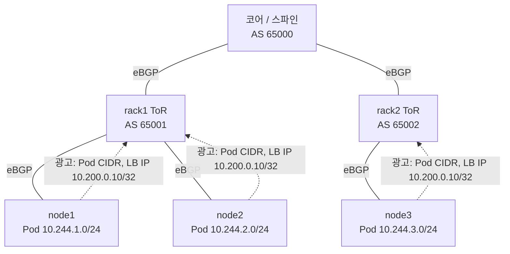

그림에서 같은 LB IP `10.200.0.10/32`를 세 노드가 모두 광고한다. 이게 BGP로 하는 로드밸런싱의 전부다. ToR 입장에서는 같은 목적지에 next-hop이 세 개인 경로가 들어온 것이고, 이걸 ECMP로 묶어 FIB에 넣으면 트래픽이 세 노드로 갈린다. 로드밸런서 장비는 없고 ToR의 해시 함수가 그 역할을 한다.

### 무엇을 광고하는가

제품마다 광고하는 대상이 다르다.

| 대상 | Calico | MetalLB | Cilium |
|---|---|---|---|
| 노드의 Pod CIDR | 광고한다. IPAM 블록 단위(기본 /26) | 하지 않는다 | `advertisementType: PodCIDR` |
| LoadBalancer IP | `serviceLoadBalancerIPs` | 이것만 한다 | `service.addresses: LoadBalancerIP` |
| ExternalIP | `serviceExternalIPs` | 해당 없음 | `service.addresses: ExternalIP` |
| ClusterIP | `serviceClusterIPs` | 해당 없음 | `service.addresses: ClusterIP` |
| 경로 광고 단위 | 설정에 쓴 CIDR 또는 Local일 때 /32 | Service IP /32 (aggregationLength 조정 가능) | Service별 /32 |

Pod CIDR을 BGP로 올리면 오버레이 없이 Pod IP가 패브릭에서 그대로 라우팅된다. 터널 헤더가 없으니 MTU 걱정이 줄고, 방화벽이나 모니터링 장비가 Pod IP를 그대로 본다. 그 대가로 Pod IP 대역이 패브릭 전체의 FIB를 차지하고, 라우팅 정책이 틀리면 클러스터 내부 통신까지 깨진다. 이 부분은 뒤의 장애 사례에서 다시 나온다.

MetalLB는 Pod 네트워크에 관여하지 않는다. CNI는 따로 두고 LoadBalancer IP만 BGP로 광고한다. Calico나 Cilium을 쓰면서 Service IP까지 같은 데몬이 광고하게 할 수도 있고, 이 경우 MetalLB는 필요 없다. 둘을 같이 쓸 때 생기는 충돌은 MetalLB 절에서 다룬다.

### ASN 설계 — 공유 ASN과 노드별 ASN

노드에 ASN을 어떻게 주느냐에 따라 ToR 설정과 장애 양상이 달라진다. 세 가지가 흔하다.

| 방식 | ASN 배치 | 장점 | 걸리는 곳 |
|---|---|---|---|
| 공유 ASN | 모든 노드가 같은 AS (Calico 기본 64512) | ToR 설정이 단순하다. `bgp listen range`로 노드를 동적으로 받을 수 있다 | AS_PATH 루프 방지에 걸려 노드끼리 경로를 못 받는다 |
| 랙별 ASN | 같은 랙의 노드는 같은 AS | 랙 단위로 정책을 걸기 쉽다 | 공유 ASN과 같은 문제가 랙 안에서 생긴다 |
| 노드별 ASN | 노드마다 다른 AS | 루프 방지 문제가 없고 경로 출처가 AS_PATH에 남는다 | ECMP를 묶으려면 ToR에 `multipath-relax`가 필요하다. ASN 관리 부담이 크다 |

공유 ASN에서 실제로 무슨 일이 나는지 노드 3대 모두 AS 65100, ToR이 AS 65001인 구성으로 봤다. node1의 BGP 테이블이다.

```text
node1# show ip bgp
*> 10.0.0.0/30      10.2.1.1                               0 65001 65000 i
*> 10.244.1.0/24    0.0.0.0                  0         32768 i
```

경로가 사라지는 과정을 시간 순으로 보면 아래와 같다. 버려지는 지점은 ToR이 아니라 받는 노드 자신이다.

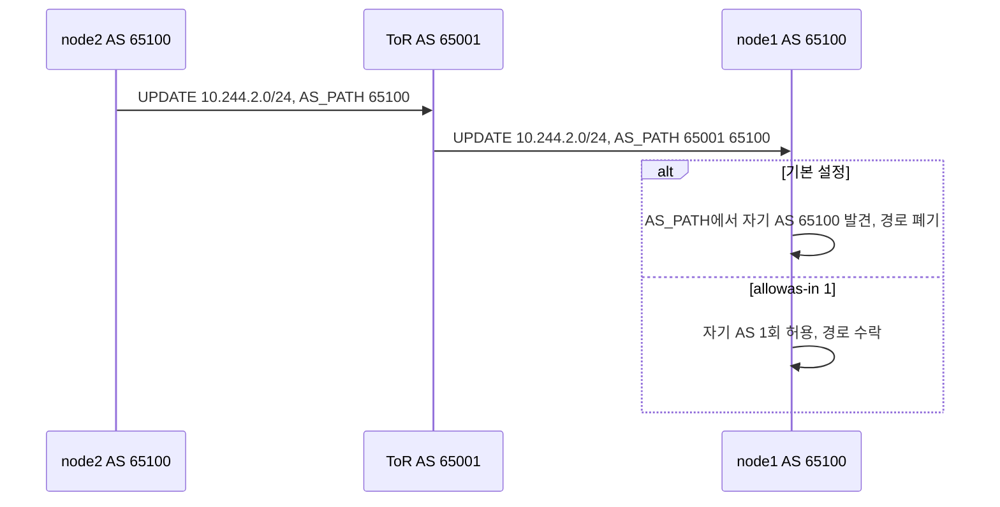

node2, node3의 Pod CIDR(`10.244.2.0/24`, `10.244.3.0/24`)이 없다. ToR은 두 경로를 정상적으로 받았고 node1에도 보냈지만, node1이 AS_PATH `65001 65100`에서 자기 AS를 발견하고 버렸다. 노드끼리 Pod 통신이 되려면 이 경로가 있어야 한다. 해법은 노드 쪽에서 자기 AS가 AS_PATH에 몇 번까지 나와도 받겠다고 푸는 것이다. FRR에서는 `neighbor ... allowas-in 1`이다.

```text
node1# show ip bgp
*  10.244.1.0/24    10.2.1.1                               0 65001 65100 i
*> 10.244.2.0/24    10.2.1.1                               0 65001 65100 i
*> 10.244.3.0/24    10.2.1.1                               0 65001 65100 i
```

`allowas-in 1`을 주니 다른 노드의 Pod CIDR이 들어오고 커널 라우팅 테이블에도 `10.244.2.0/24 via 10.2.1.1`이 생겼다. 자기 경로가 ToR을 한 바퀴 돌아 되돌아온 `10.244.1.0/24`도 같이 들어오지만 `*`만 붙고 best가 아니라서 무해하다. Calico에서는 BGPPeer의 `numAllowedLocalASNumbers`가 같은 역할이다.

노드별 ASN으로 바꾸면 이 문제가 사라지는 대신 ECMP가 안 묶인다. 같은 목적지가 세 노드에서 오는데 AS_PATH가 `65101`, `65102`, `65103`으로 서로 다르기 때문이다. BGP 최적 경로 선택은 AS_PATH 내용이 다르면 multipath 후보로 보지 않는다. `maximum-paths 3`을 줬는데도 ToR의 커널 라우팅 테이블은 이렇다.

```text
$ ip route show 10.200.0.10
10.200.0.10 nhid 22 via 10.2.1.2 dev t-n1 proto bgp metric 20
```

경로 세 개가 `available`인데 next-hop은 하나다. ToR에 `bgp bestpath as-path multipath-relax`를 주면 AS_PATH 길이만 같으면 묶인다.

```text
$ ip route show 10.200.0.10
10.200.0.10 nhid 29 proto bgp metric 20
        nexthop via 10.2.1.2 dev t-n1 weight 1
        nexthop via 10.2.3.2 dev t-n3 weight 1
        nexthop via 10.2.2.2 dev t-n2 weight 1
```

공유 ASN은 이 옵션이 필요 없다. AS_PATH가 모든 노드에서 `65100`으로 같아서 `maximum-paths`만으로 묶인다. 노드가 수십 대를 넘으면 ASN을 노드마다 배정하는 일 자체가 운영 부담이라, 공유 ASN에 `allowas-in`을 쓰거나 랙별 ASN으로 가는 쪽이 많다. 어느 쪽이든 ToR에 multipath 설정이 들어가야 한다는 점은 같다.

## Calico — mesh를 끄고 ToR과 맺기

Calico는 노드마다 BIRD를 띄우고 기본값으로 모든 노드끼리 iBGP 풀 메시를 만든다. 별도 라우터 없이 Pod CIDR이 노드 사이에서 교환되니 소규모에서는 설정할 것이 없다. 문제는 세션 수다. 노드가 N대면 세션이 N(N-1)/2개이고 노드 한 대가 N-1개를 들고 있다.

| 노드 수 | 전체 세션 | 노드당 세션 |
|---|---|---|
| 50 | 1,225 | 49 |
| 100 | 4,950 | 99 |
| 500 | 124,750 | 499 |
| 1,000 | 499,500 | 999 |

Calico 공식 문서는 풀 메시가 100노드 안팎까지는 잘 돌고 그보다 커지면 Route Reflector를 권한다고 쓴다(v3.28 문서 기준). 실제로 풀 메시를 끄는 시점은 노드 수보다 먼저 오는 경우가 많다. ToR이 이미 있고 네트워크 팀이 Pod CIDR을 패브릭에서 보고 싶어 할 때가 그렇다. 노드 간 iBGP는 패브릭 장비가 그 경로를 볼 수 없어서, ToR이나 코어에 Pod CIDR 경로가 없고 방화벽 정책이나 트래픽 추적이 막힌다.

피어링 구조는 세 가지로 갈린다.

| 구조 | 세션 구성 | 맞는 경우 |
|---|---|---|
| 풀 메시 (기본) | 노드 ↔ 노드 전부 | 노드 100대 안팎까지, 패브릭이 Pod 경로를 몰라도 되는 경우 |
| Route Reflector | 일부 노드가 RR, 나머지는 RR과만 | 패브릭 BGP를 건드릴 수 없는데 노드가 많은 경우 |
| ToR 피어링 | 노드 ↔ 랙의 ToR | 패브릭이 Pod CIDR과 Service IP를 알아야 하는 경우 |

세 구조를 세션 선으로 그리면 아래와 같다. 노드 세 대 기준이지만 풀 메시만 노드가 늘 때 선이 제곱으로 불어난다.

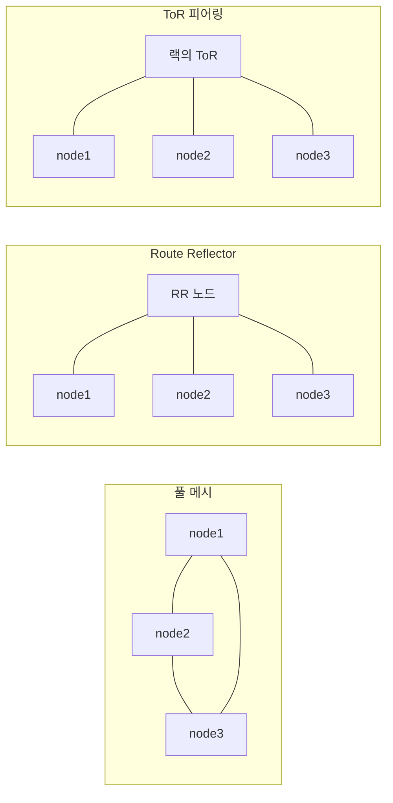

Route Reflector는 iBGP 풀 메시를 줄이는 표준 방법이고 원리는 [BGP 문서의 RR 절](BGP.md)에 있다. Calico에서는 노드에 `routeReflectorClusterID`를 주고 레이블로 RR 노드를 고른다.

```bash
calicoctl patch node rr-1 -p '{"spec": {"bgp": {"routeReflectorClusterID": "244.0.0.1"}}}'
kubectl label node rr-1 route-reflector=true
```

```yaml
apiVersion: projectcalico.org/v3
kind: BGPPeer
metadata:
  name: peer-with-route-reflectors
spec:
  nodeSelector: all()
  peerSelector: route-reflector == 'true'
```

RR 노드 자신도 이 BGPPeer 덕에 다른 RR과 서로 피어링한다. RR을 최소 둘 이상 두고 같은 ClusterID를 줘야 한다. RR이 한 대면 그 노드가 죽을 때 클러스터 전체의 경로 교환이 멈춘다.

### 풀 메시를 끄는 순서

올바른 순서와 잘못된 순서가 갈리는 지점은 아래와 같다.

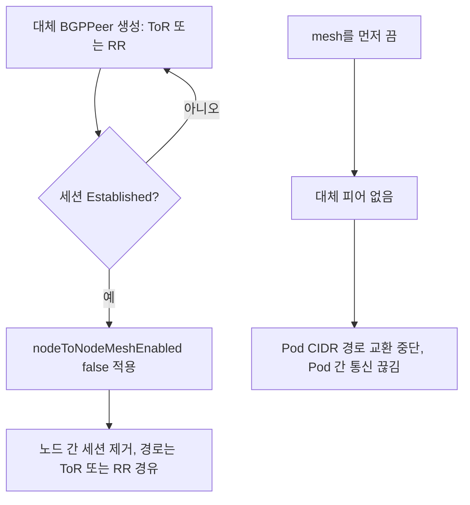

`nodeToNodeMeshEnabled: false`를 먼저 적용하면 노드 간 세션이 즉시 사라진다. 대체 피어(ToR이나 RR)가 아직 없으면 노드끼리 Pod CIDR 경로를 못 받아 Pod 간 통신이 끊긴다. 대체 BGPPeer를 먼저 만들어 세션이 Established가 된 것을 확인한 뒤에 mesh를 끈다. 순서가 반대인 설정 파일 하나를 한 번에 적용하는 실수가 가장 흔하다.

### ToR 피어링 CRD

노드별 ASN 대신 클러스터 기본 ASN을 정하고, ToR을 BGPPeer로 건다. 아래는 Calico v3.28.2 CRD 필드 기준이다.

```yaml
apiVersion: projectcalico.org/v3
kind: BGPConfiguration
metadata:
  name: default
spec:
  nodeToNodeMeshEnabled: false
  asNumber: 65100
  logSeverityScreen: Info
  serviceLoadBalancerIPs:
    - cidr: 10.200.0.0/24
  serviceExternalIPs:
    - cidr: 10.201.0.0/24
---
apiVersion: projectcalico.org/v3
kind: BGPPeer
metadata:
  name: rack1-tor
spec:
  peerIP: 10.2.1.1
  asNumber: 65001
  nodeSelector: rack == 'rack1'
  numAllowedLocalASNumbers: 1
```

`BGPConfiguration`은 이름이 `default`인 것 하나만 쓴다. `serviceClusterIPs`, `serviceExternalIPs`, `serviceLoadBalancerIPs`에 CIDR을 적으면 그 범위의 Service IP가 광고된다. 설정에 없는 범위의 Service는 광고되지 않으니, MetalLB 같은 다른 IP 할당기를 쓰는 경우 풀 대역을 여기에 맞춰야 한다. `nodeSelector: rack == 'rack1'`은 노드 레이블로 랙을 구분한 것이고, 랙마다 BGPPeer를 하나씩 만들어 각 랙의 ToR IP를 가리킨다. ToR IP가 노드마다 다르면(노드 서브넷의 게이트웨이를 ToR로 쓸 때) 노드 쪽에 `peerIP`를 노드 기준으로 다르게 줘야 하는데, 이때는 `node:` 필드로 노드 하나에 직접 고정하는 방법이 있다.

노드별 ASN이 필요하면 노드 리소스에 직접 쓴다.

```bash
calicoctl patch node node-1 -p '{"spec": {"bgp": {"asNumber": "64514"}}}'
```

경로를 걸러야 하면 BGPFilter를 만들고 BGPPeer의 `filters`에 이름을 건다. 이름이 비슷한 `BGPPeer.filters`와 `BGPFilter`는 v3.28.2 CRD에서 `exportV4`, `importV4` 리스트로 `action`, `cidr`, `matchOperator`, `source`, `interface`를 받는다.

```yaml
apiVersion: projectcalico.org/v3
kind: BGPFilter
metadata:
  name: export-service-only
spec:
  exportV4:
    - action: Accept
      matchOperator: In
      cidr: 10.200.0.0/24
    - action: Reject
```

세션 상태는 `CalicoNodeStatus` 리소스로 본다. v3.28.2 CRD 목록에 `caliconodestatuses`가 있다. 노드에서 직접 `calicoctl node status`를 쓰면 로컬 에이전트에 붙기 때문에 확인하려는 노드에서 실행해야 한다.

### IPIP, VXLAN과의 관계

Calico 매니페스트(v3.28.2 `calico.yaml`)의 기본 IPPool은 `CALICO_IPV4POOL_IPIP=Always`, `CALICO_IPV4POOL_VXLAN=Never`이다. 설치한 그대로 두면 노드 간 Pod 트래픽이 IPIP 터널로 나간다. ToR이 Pod CIDR을 라우팅하게 만들었는데 IPIP가 켜져 있으면 터널이 모든 걸 감싸서 ToR은 노드 IP끼리의 IP-in-IP 패킷만 본다. BGP로 Pod 경로를 올린 의미가 없어지고, 외부 헤더에는 L4 포트가 없어서 ToR의 5-tuple 해시가 노드 쌍마다 한 경로에 몰린다.

`ipipMode`는 세 값이 있다.

| 값 | 동작 |
|---|---|
| `Always` | 항상 IPIP로 감싼다 |
| `CrossSubnet` | 같은 서브넷 노드끼리는 캡슐화 없이, 다른 서브넷으로 갈 때만 IPIP |
| `Never` | 캡슐화하지 않는다 (CRD 기본값) |

ToR 피어링 구조에서 랙마다 서브넷이 다르면 `CrossSubnet`은 랙 안에서는 직접 가고 랙 사이에서는 IPIP로 감싼다. 랙 간 트래픽이 바로 패브릭이 보고 싶은 트래픽이니 `CrossSubnet`도 의도와 어긋나는 경우가 많다. 패브릭이 Pod CIDR을 라우팅하면 둘 다 `Never`로 둔다.

```yaml
apiVersion: projectcalico.org/v3
kind: IPPool
metadata:
  name: default-ipv4-ippool
spec:
  cidr: 10.244.0.0/16
  ipipMode: Never
  vxlanMode: Never
  natOutgoing: false
  blockSize: 26
```

`natOutgoing`을 끄는 것은 패브릭이 Pod IP를 외부와 라우팅할 수 있을 때만이다. 켜둔 채 Pod IP를 패브릭에서 직접 보려는 경우 외부로 나가는 트래픽만 SNAT되어 원하는 결과가 안 나온다. 이 필드는 제품 문서의 설명과 CRD 필드 존재 여부만 확인했다.

VXLAN 모드는 BGP와 무관하다. Calico 문서에 "Calico does not use BGP for VXLAN overlays"라고 적혀 있고, VXLAN만 쓰는 설치에서는 이 문서의 내용이 해당되지 않는다.

기존 클러스터에서 IPIP를 `Always`에서 `Never`로 바꿀 때는 IPPool을 고치면 새로 만들어지는 라우팅부터 바뀐다. 이미 떠 있는 노드의 터널 인터페이스(`tunl0`)와 라우트가 어떻게 정리되는지는 실제 클러스터에서 검증하지 못했다. 운영 중 클러스터라면 노드 한두 대로 먼저 확인한다.

## MetalLB — BGP 모드와 L2 모드

MetalLB는 `type: LoadBalancer` Service에 IP를 할당하고 그 IP로 오는 트래픽을 노드로 끌어오는 역할만 한다. 끌어오는 방법이 두 가지다.

| | L2 모드 | BGP 모드 |
|---|---|---|
| 방식 | 노드 한 대가 ARP/NDP로 "그 IP는 내 MAC"이라고 응답 | 노드가 ToR에 /32를 BGP로 광고 |
| 트래픽을 받는 노드 | 한 대 (리더) | 광고한 모든 노드 (ECMP) |
| 대역폭 | 한 노드 NIC에 묶인다 | 노드 수만큼 분산된다 |
| 장애 전환 | 리더가 바뀌고 gratuitous ARP를 보낸다. 클라이언트 ARP 캐시가 갱신될 때까지 끊긴다 | 세션이 끊긴 노드 경로가 withdraw되면 ECMP에서 빠진다 |
| 네트워크 요구 | 같은 L2 세그먼트 | BGP를 받는 라우터. ECMP 지원 필요 |
| 설정 | IPAddressPool + L2Advertisement | IPAddressPool + BGPPeer + BGPAdvertisement |

두 모드에서 트래픽이 노드에 닿는 모양을 나란히 놓으면 차이가 분명하다. L2는 한 노드로 모이고, BGP는 ToR을 거쳐 여러 노드로 갈린다.

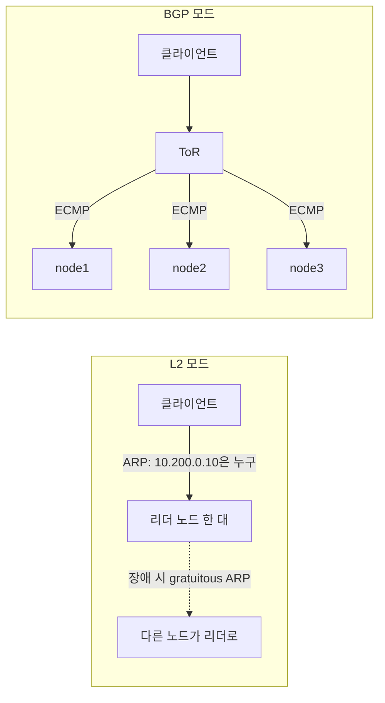

L2 모드는 BGP 장비 없이 시작하기 쉽지만 한 Service의 모든 트래픽이 노드 한 대로 들어온다. 노드가 갑자기 죽으면 클라이언트가 옛 MAC으로 계속 보내서 ARP 캐시가 만료될 때까지 끊기는 일이 있다. BGP 모드는 ToR이 ECMP를 지원해야 분산이 되고, 지원하지 않으면 경로 하나만 쓰인다(Calico 문서도 같은 경고를 쓴다).

MetalLB v0.14.9 Helm 차트는 `speaker.frr.enabled: true`가 기본값이라 BGP 구현이 FRR다. FRR 모드에서만 BFD와 IPv6 BGP, Multi Protocol BGP가 된다. 같은 호스트의 BGP 데몬과 피어링하는 것은 FRR 모드에서 안 된다는 점이 문서에 명시되어 있다. MetalLB 외에 Calico가 같은 노드에서 BIRD로 ToR과 세션을 맺고 있는 구성이 이 제약에 걸린다. 같은 노드 IP에서 같은 ToR로 BGP 세션 두 개를 맺을 수 없기 때문이다. 이 경우는 MetalLB 없이 Calico의 `serviceLoadBalancerIPs`로 Service IP도 같이 광고하거나, MetalLB의 FRR-K8s 모드로 FRR 인스턴스를 공유하는 방법이 있다. 이 조합은 내가 직접 띄워보지 않았고 문서 기준이다.

### MetalLB CRD (v0.14.9)

```yaml
apiVersion: metallb.io/v1beta1
kind: IPAddressPool
metadata:
  name: lb-pool
  namespace: metallb-system
spec:
  addresses:
    - 10.200.0.0/24
  autoAssign: true
---
apiVersion: metallb.io/v1beta2
kind: BGPPeer
metadata:
  name: rack1-tor
  namespace: metallb-system
spec:
  myASN: 65100
  peerASN: 65001
  peerAddress: 10.2.1.1
  holdTime: 9s
  keepaliveTime: 3s
  bfdProfile: fast
  nodeSelectors:
    - matchLabels:
        rack: rack1
---
apiVersion: metallb.io/v1beta1
kind: BFDProfile
metadata:
  name: fast
  namespace: metallb-system
spec:
  detectMultiplier: 3
  receiveInterval: 300
  transmitInterval: 300
---
apiVersion: metallb.io/v1beta1
kind: BGPAdvertisement
metadata:
  name: lb-adv
  namespace: metallb-system
spec:
  ipAddressPools:
    - lb-pool
  peers:
    - rack1-tor
```

BGPPeer는 `v1beta1`과 `v1beta2`가 둘 다 있고, `connectTime`, `enableGracefulRestart`, `dynamicASN`, `vrf`, `disableMP`는 `v1beta2`에만 있다. `holdTime`과 `keepaliveTime`은 duration 문자열이다. BGPAdvertisement(`v1beta1`)에는 `aggregationLength`, `communities`, `localPref`, `nodeSelectors`, `peers`가 있어서 광고되는 경로에 community나 local-pref를 붙일 수 있다.

`bfdProfile`을 지정하면 그 이름의 BFDProfile로 BFD 세션이 같이 만들어지고, 지정하지 않으면 BFD 세션이 없다(CRD 설명). 타이머를 줄이는 쪽은 뒤의 수렴 시간 절에서 다룬다.

### Service IP 광고와 패킷 경로

Service를 만든 순간부터 첫 패킷이 파드에 닿기까지의 순서다. `externalTrafficPolicy`에 따라 광고하는 노드가 달라지는 것에 주의해서 본다.

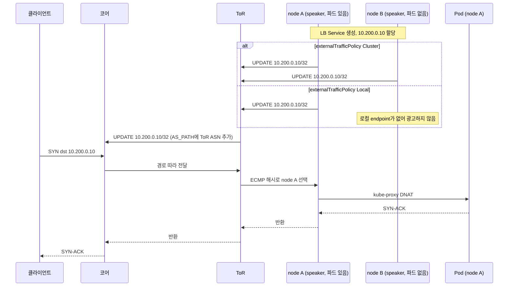

Cluster 정책에서는 모든 노드가 같은 /32를 광고하고, ToR의 해시가 파드 없는 node B를 골랐다면 node B의 kube-proxy가 파드가 있는 노드로 한 번 더 넘긴다. 이때 원래 클라이언트 IP가 SNAT되어 파드 입장에서는 보이지 않는다. Local 정책에서는 파드가 있는 노드만 광고하므로 ECMP 후보가 곧 파드가 있는 노드이고, kube-proxy가 같은 노드의 파드로만 보내서 클라이언트 IP가 유지된다. MetalLB 문서는 BGP 모드에서 Local일 때 "파드를 실행 중인 노드만 트래픽을 끌어온다"고 설명한다. Calico 문서도 Local에서는 Service를 받치는 파드가 있는 노드가 /32를 광고한다고 쓴다.

Local 정책의 단점도 같은 구조에서 나온다. 노드 A에 파드가 둘, 노드 B에 하나 있으면 트래픽은 파드 단위가 아니라 노드 단위로 5:5로 갈린다. 노드 A의 파드는 각각 25%, 노드 B의 파드는 50%를 받는다(MetalLB 문서의 예). 파드를 노드에 고르게 퍼뜨리는 `topologySpreadConstraints`가 이 정책과 한 쌍이다.

### ECMP에서 노드 집합이 바뀌면 연결이 끊긴다

BGP 로드밸런싱은 상태가 없다. ToR은 연결 상태를 기억하지 않고 패킷마다 헤더 해시로 next-hop을 고른다. 그래서 next-hop 집합의 크기가 바뀌면 해시 결과가 달라져서 이미 맺어진 연결의 다음 패킷이 다른 노드로 간다. 그 노드는 그 연결을 모르니 RST를 보내고 연결이 끊긴다. MetalLB 문서가 이 현상을 "한 번의 깨끗한 단절(one-time clean break)"이라고 설명한다.

얼마나 끊기는지 직접 쟀다. ToR의 ECMP 해시 정책을 L4(5-tuple)로 두고 클라이언트 포트 300개의 next-hop을 `ip route get`으로 얻은 뒤, 노드 한 대를 내리고 같은 포트로 다시 구했다. 이동한 건 살아있는 노드로 가던 flow 중 다른 노드로 바뀐 개수다.

| 내린 노드 | 장애 전 분포 (n1/n2/n3) | 장애 후 분포 | 살아있던 flow | 이동한 flow |
|---|---|---|---|---|
| node1 | 94 / 116 / 90 | - / 159 / 141 | 206 | 51 (25%) |
| node2 | 94 / 116 / 90 | 159 / - / 141 | 184 | 0 |
| node3 | 94 / 116 / 90 | 159 / 141 / - | 210 | 65 (31%) |

내린 노드 자신이 받던 연결은 당연히 끊긴다. 표의 이동 열은 죽지도 않은 노드로 가던 연결이 덩달아 끊긴 수다. node2를 내렸을 때는 0이고 node1이나 node3을 내렸을 때는 4분의 1 이상이 이동했다. 리눅스 커널 5.15의 multipath는 해시 공간을 next-hop 개수로 나눠 구간을 할당하는 방식이라, 목록의 가운데 항목이 빠지면 양끝 구간이 그대로 남고 앞이나 끝 항목이 빠지면 나머지 구간 경계가 밀린다. 어떤 노드가 빠지느냐에 따라 결과가 크게 달라서 평균을 믿으면 안 된다.

MetalLB 문서가 권하는 완화책은 ToR의 안정 해시다. 장비마다 "resilient ECMP", "resilient hashing", "consistent hashing" 같은 이름으로 있다. 노드가 빠져도 남은 노드로 가던 flow를 건드리지 않고 빠진 노드 몫만 재분배한다. 이 장비 옵션이 있는지는 ToR 모델에 달려 있어서 이 환경에서는 확인하지 못했다. 옵션이 없는 장비면 노드 메인터넌스 시간대를 잡거나 `externalTrafficPolicy: Local`로 파드가 있는 노드만 후보로 두는 것이 현실적이다. Local이라도 파드가 롤링 업데이트로 노드를 옮기면 집합이 바뀌므로 영향이 없지는 않다.

ECMP 해시 정책 자체도 걸린다. 같은 실험에서 ToR의 해시를 L3(출발지·목적지 IP만)로 두면 클라이언트 한 대가 연 연결 60개가 전부 한 노드로 갔다(`{'n3': 60}`). L4로 바꾸자 60개가 22/12/26, 600개가 197/206/197로 갈렸다. 클라이언트가 소수의 프록시나 NAT 뒤에 있으면 L3 해시에서는 분산이 사실상 안 된다. 리눅스 라우터는 `net.ipv4.fib_multipath_hash_policy`(0이 L3, 1이 L4)이고, 하드웨어 ToR은 장비마다 기본값과 이름이 다르다.

## Cilium BGP Control Plane

Cilium은 BGP 데몬을 따로 띄우지 않고 cilium-agent 안에서 처리한다. Helm에서 `bgpControlPlane.enabled=true`로 켜고 CRD로 설정한다. Pod CIDR, Service IP(ClusterIP, ExternalIP, LoadBalancerIP), CiliumPodIPPool을 광고할 수 있다.

버전에 따라 CRD 이름과 apiVersion이 다르다.

| Cilium 버전 | 현재 방식 | apiVersion | 옛 방식 |
|---|---|---|---|
| 1.16, 1.17 | ClusterConfig, PeerConfig, Advertisement, NodeConfigOverride | `cilium.io/v2alpha1` | `CiliumBGPPeeringPolicy` (`v2alpha1`) |
| 1.18 | 위와 같음 | `cilium.io/v2` | `CiliumBGPPeeringPolicy`는 `v2alpha1`에 남아 있음 |
| 1.20.2 | 위와 같음 | `cilium.io/v2` | CRD 디렉터리에서 PeeringPolicy가 없음 |

이 표는 각 릴리스 태그의 CRD 디렉터리 목록에서 읽은 것이다. `CiliumBGPClusterConfig`와 `CiliumBGPPeeringPolicy`는 같이 쓰면 안 된다고 공식 문서에 경고가 있다. 옛 방식을 쓰던 클러스터가 새 방식으로 옮길 때는 PeeringPolicy를 지우고 옮겨야 한다.

설정은 네 리소스로 나뉜다. ClusterConfig가 어느 노드가 어떤 피어와 맺는지, PeerConfig가 세션 속성(타이머, 주소 계열), Advertisement가 무엇을 광고하는지다. 아래는 1.18 기준이고 1.17이면 `apiVersion`만 `cilium.io/v2alpha1`로 바꾼다.

```yaml
apiVersion: cilium.io/v2
kind: CiliumBGPClusterConfig
metadata:
  name: rack1
spec:
  nodeSelector:
    matchLabels:
      rack: rack1
  bgpInstances:
    - name: instance-65100
      localASN: 65100
      peers:
        - name: rack1-tor
          peerASN: 65001
          peerAddress: 10.2.1.1
          peerConfigRef:
            name: tor-peer
---
apiVersion: cilium.io/v2
kind: CiliumBGPPeerConfig
metadata:
  name: tor-peer
spec:
  timers:
    holdTimeSeconds: 9
    keepAliveTimeSeconds: 3
  gracefulRestart:
    enabled: true
    restartTimeSeconds: 120
  families:
    - afi: ipv4
      safi: unicast
      advertisements:
        matchLabels:
          advertise: bgp
---
apiVersion: cilium.io/v2
kind: CiliumBGPAdvertisement
metadata:
  name: pod-and-lb
  labels:
    advertise: bgp
spec:
  advertisements:
    - advertisementType: PodCIDR
    - advertisementType: Service
      service:
        addresses:
          - LoadBalancerIP
      selector:
        matchExpressions:
          - { key: bgp, operator: In, values: [ blue ] }
```

세 리소스가 어떻게 이어지는지는 아래 그림과 같다. ClusterConfig에서 PeerConfig까지는 이름 참조이고, PeerConfig에서 Advertisement까지는 레이블 참조라는 점이 다르다.

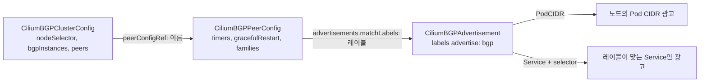

PeerConfig의 `families[].advertisements.matchLabels`가 Advertisement의 레이블과 연결되는 고리다. 이름으로 참조하지 않고 레이블로 고르기 때문에, Advertisement에 `advertise: bgp` 레이블을 빼먹으면 세션은 올라와도 아무것도 광고되지 않는다. Service 광고는 `selector`가 필수다. 위 예에서는 Service에 `bgp: blue` 레이블이 붙은 것만 광고된다. 레이블을 안 붙인 Service는 조용히 광고되지 않는다.

PeerConfig 타이머 기본값은 CRD에 명시되어 있다. `holdTimeSeconds` 90, `keepAliveTimeSeconds` 30, `connectRetryTimeSeconds` 120이다. 기본값 그대로면 노드가 침묵 장애를 일으켰을 때 ToR이 알아채기까지 최대 90초다. 수렴 시간 절의 측정에서 보듯이 이 값을 줄일 수 있는지 먼저 정한다.

Cilium의 BGP 인스턴스는 기본적으로 리스닝 포트가 없다. 노드에서 ToR로 나가는 연결만 맺고 들어오는 연결은 받지 않는다. 같은 노드에서 다른 BGP 데몬(BIRD 등)이 179를 쓰는 환경을 고려한 기본값이다(공식 문서). ToR 쪽에서 노드를 동적으로 받으려면 `bgp listen range`가 필요하다. 문서는 ToR을 모두 같은 로컬 ASN으로 맞추고 `neighbor CILIUM local-as 65000 no-prepend replace-as`로 피어 그룹을 만드는 예를 든다. 노드가 늘어도 ToR 설정을 안 건드리는 효과가 있다.

`externalTrafficPolicy: Local`일 때는 로컬 endpoint가 없는 노드가 Service 광고를 거둔다(v1.18 문서). ClusterIP, ExternalIP, LoadBalancerIP 광고가 각각 `internalTrafficPolicy`와 `externalTrafficPolicy` 중 어느 쪽을 보는지는 주소 종류마다 다르니 문서의 해당 절을 읽는다.

PeerConfig의 v1.17, v1.18 필드를 보면 `authSecretRef`, `ebgpMultihop`, `families`, `gracefulRestart`, `timers`, `transport`뿐이고 BFD 설정은 없다. Cilium의 BGP Control Plane으로 BFD 기반 빠른 감지를 쓸 수 없다는 뜻이다. 빠른 감지가 필요하면 `holdTimeSeconds`를 낮추거나 MetalLB FRR 모드를 쓴다.

## ECMP 해시와 노드 장애 수렴

노드 하나가 죽었을 때 트래픽이 얼마 만에 그 노드를 빠져나오는지는 죽는 방식에 따라 자릿수가 다르다. ToR이 장애를 알아채는 경로가 다섯 가지다.

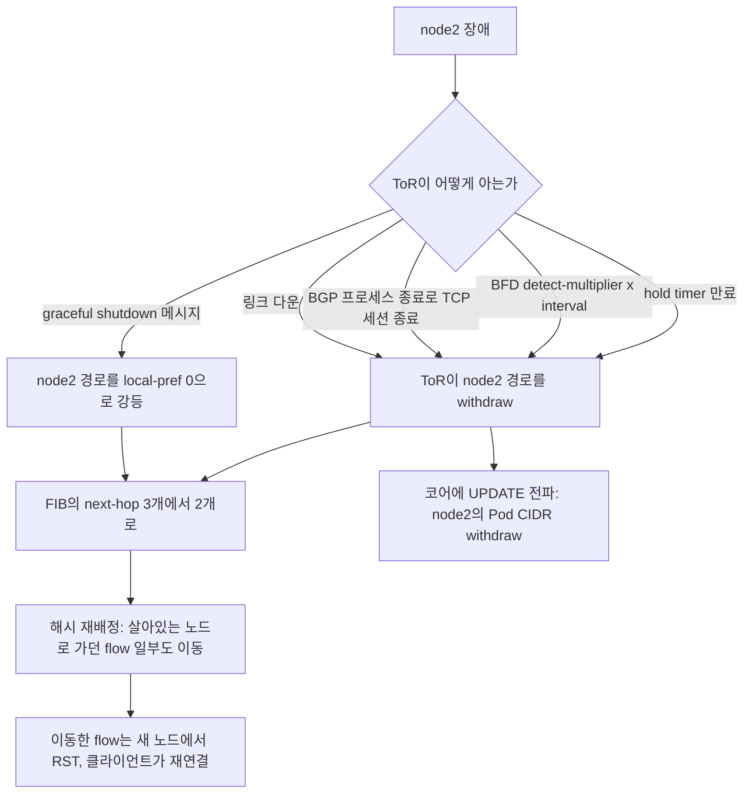

위 그림의 감지 경로별로 시간을 쟀다. node2만 장애를 일으키고, 클라이언트가 20ms 간격으로 새 연결을 계속 열면서 실패 개수를 센다. 연결 시도의 3분의 1 정도가 node2로 해시된다. 모든 실행에서 BGP 타이머는 keepalive 3초, hold 9초이고 BFD는 300ms 간격에 배수 3이다.

| 장애 방식 | 재현 | ToR의 ECMP가 3에서 2로 | 실패한 연결 시도 |
|---|---|---|---|
| 링크 다운 | node2의 인터페이스를 내림 | 0.01초 | 0 |
| bgpd 프로세스 강제 종료 | node2의 bgpd에 SIGKILL (커널은 정상) | 0.12초 | 0 |
| graceful shutdown | node2에서 `bgp graceful-shutdown` | 0.31초 | 0 |
| BFD | node2의 bgpd, bfdd, 응답 서버를 SIGSTOP | 0.84초 | 4건 (0.1~0.8초 구간) |
| hold timer | node2의 bgpd, 응답 서버를 SIGSTOP | 7.0초 | 34건 (0.1~6.9초 구간) |
| bgpd만 멈춤 | node2의 bgpd만 SIGSTOP, 서버는 정상 | 7.06초 | 0 |

hold timer는 9초로 설정했는데 7.0초에 끝났다. hold timer는 이벤트가 일어난 시점이 아니라 마지막으로 메시지를 받은 시점부터 센다. 멈추기 직전의 keepalive가 2초쯤 전에 왔으면 남은 시간만 기다린다. 기본값 90초를 쓰면 실제 detection이 최대 90초다. 그 사이 해당 노드로 해시되는 연결은 응답 없이 타임아웃을 맞는다.

링크 다운과 프로세스 종료가 빠른 이유는 BGP 타이머가 아니라 TCP와 링크 상태 덕이다. 링크가 내려가면 FRR의 `fast-external-failover`(eBGP 기본 동작)가 세션을 바로 끊는다. 프로세스가 종료되면 커널이 소켓을 닫아 TCP FIN이 가고 ToR이 세션 종료를 바로 안다. 반면 노드가 멈춘 채 NIC는 살아있는 경우(VM 멈춤, 커널 행, 스위치와 노드 사이의 중간 장비 장애)는 아무도 알려주지 않으므로 타이머만 믿어야 한다. 실제 운영에서 문제가 되는 건 이쪽이다.

### BFD를 켜는 이유와 한계

침묵 장애에서 BFD는 7.0초를 0.84초로 줄였다. BFD는 BGP와 별개의 데이터 경로 감지 프로토콜이라 BGP keepalive보다 훨씬 짧은 주기로 돌릴 수 있다. 300ms × 3이면 약 1초 안에 끝난다.

다만 BFD가 모든 걸 해결하지는 않는다. 위 표의 마지막 행처럼 bgpd만 멈추고 bfdd와 데이터 경로가 살아있으면 BFD 세션은 유지된다. 이 경우 BGP는 hold timer 7.06초 뒤에 경로를 withdraw했고, 실제로는 서버가 정상 응답하고 있었으니 실패한 연결은 0건이었다. 정상인 노드를 7초 뒤 ECMP에서 뺀 것이다. 노드의 BGP speaker 파드를 재시작하거나 업그레이드할 때 이런 일이 생긴다. 이걸 줄이는 장치가 Graceful Restart이고, Cilium PeerConfig와 MetalLB v1beta2 BGPPeer에 필드가 있다.

BFD는 노드 수만큼 세션이 늘어서 ToR의 BFD 세션 수와 처리 한도에 걸릴 수 있다. 한도는 장비마다 달라서 노드가 많은 랙에서는 ToR 사양서를 본다. Cilium은 BFD 필드가 없고 MetalLB는 FRR 모드에서 BFDProfile로 쓴다.

### 노드 drain과 graceful shutdown

`kubectl drain`은 파드를 쫓아낼 뿐 BGP 데몬을 건드리지 않는다. Calico의 `calico-node`, MetalLB speaker, Cilium agent는 모두 DaemonSet이라 drain에서 제외된다(`--ignore-daemonsets`). 그래서 drain이 끝난 노드는 파드는 없는데 BGP 세션은 살아서 경로를 계속 광고한다.

- Cluster 정책에서는 광고가 그대로라 ToR이 계속 이 노드로 보내고, 노드의 kube-proxy가 다른 노드의 파드로 넘긴다. 서비스는 이어진다.
- Local 정책에서는 로컬 endpoint가 없어지는 순간 광고가 거둬진다. 이 시점에 ECMP 집합이 바뀌어 위 표의 재해시가 일어난다.

drain 뒤에 노드를 재부팅하거나 내릴 때가 문제다. 세션이 갑자기 사라지면 위 표에서 가장 느린 경로(침묵 장애면 hold timer)로 가기 때문이다. 재부팅 전에 BGP를 먼저 내려 경로를 빼는 순서가 필요하다.

graceful shutdown을 거치는 노드 내리기와 갑자기 세션이 사라지는 경우를 비교하면 아래와 같다. 앞쪽은 세션을 유지한 채 경로만 먼저 강등하고, 뒤쪽은 타이머가 끝나야 경로가 빠진다.

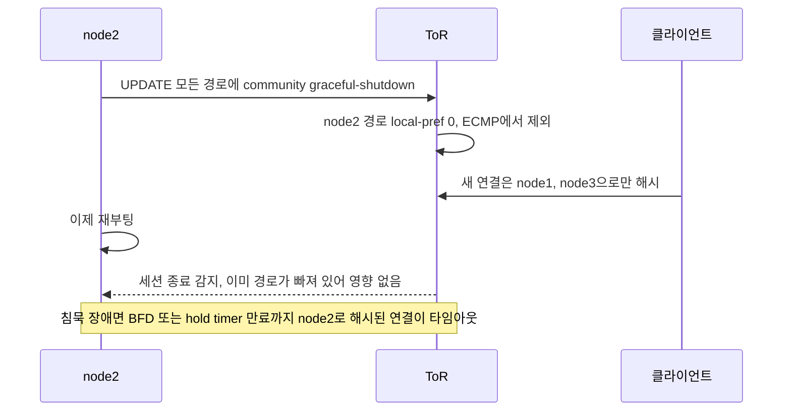

graceful shutdown은 그 순서를 BGP 안에서 해결한다. node2에서 `bgp graceful-shutdown`을 켜면 광고하는 모든 경로에 community `graceful-shutdown`(65535:0)이 붙는다. ToR의 FRR 8.1은 이 community가 붙은 경로의 local-pref를 자동으로 0으로 낮춘다.

```text
tor# show bgp ipv4 unicast 10.200.0.10/32
    10.2.3.2 from 10.2.3.2 (10.2.3.2)
      Origin IGP, metric 0, valid, external, multipath
    10.2.2.2 from 10.2.2.2 (10.2.2.2)
      Origin IGP, metric 0, localpref 0, valid, external
      Community: graceful-shutdown
    10.2.1.2 from 10.2.1.2 (10.2.1.2)
      Origin IGP, metric 0, valid, external, multipath, best (Local Pref)

$ ip route show 10.200.0.10
10.200.0.10 nhid 34 proto bgp metric 20
        nexthop via 10.2.1.2 dev t-n1 weight 1
        nexthop via 10.2.3.2 dev t-n3 weight 1
```

경로 세 개가 다 남아있고 세션도 살아있는데 node2 경로(localpref 0)만 multipath에서 빠졌다. 0.31초 만에 ECMP에서 빠졌고 그 사이 클라이언트 연결 실패는 0건이었다. 세션을 끊지 않았으니 node2는 계속 응답할 수 있어서, 이미 node2로 해시된 연결은 새 해시 결과가 나올 때까지만 영향을 받는다.

이 동작은 수신 쪽이 community를 보고 local-pref를 내려야 성립한다. FRR 8.1은 기본으로 그렇게 동작하지만 다른 장비는 route-map으로 직접 `match community graceful-shutdown` → `set local-preference 0`을 써야 하는 경우가 많다. community 자체는 [BGP community와 라우팅 정책](BGP_Community_and_Routing_Policy.md)의 GRACEFUL_SHUTDOWN 절에서 따로 다룬다. Calico, MetalLB, Cilium이 파드 종료나 drain 때 자동으로 graceful shutdown을 보내는지는 이 환경에서 확인하지 못했다. 운영하는 버전의 동작을 보고, 없으면 재부팅 스크립트에서 BGP를 먼저 내리는 단계를 직접 넣는다.

## 운영에서 막히는 지점

### ToR의 maximum-paths와 해시 설정

가장 먼저 만나는 문제다. 세션이 Established이고 경로도 다 들어왔는데 트래픽이 한 노드로만 간다. `maximum-paths`의 FRR 기본값이 1이라서 경로 세 개가 `available`이어도 FIB에는 하나만 들어간다. 이 실험에서 router-id가 가장 작은 노드가 best로 뽑혔고, 클라이언트 연결 60개가 전부 그 노드로 갔다(`{'n1': 60}`). `maximum-paths 3`을 주고서야 ECMP가 구성됐다.

```text
$ ip route show 10.200.0.10     # maximum-paths 1
10.200.0.10 nhid 22 via 10.2.1.2 dev t-n1 proto bgp metric 20

$ ip route show 10.200.0.10     # maximum-paths 3
10.200.0.10 nhid 29 proto bgp metric 20
        nexthop via 10.2.1.2 dev t-n1 weight 1
        nexthop via 10.2.2.2 dev t-n2 weight 1
        nexthop via 10.2.3.2 dev t-n3 weight 1
```

노드가 ToR의 max-paths보다 많으면 초과분은 ECMP에서 빠진다. 랙당 노드 수와 같은 서비스를 광고하는 노드 수를 세고, 장비의 max-paths 상한이 그보다 큰지 본다. 상한은 장비 모델과 라이선스에 따라 다르다. ECMP 해시를 L3로 두면 위에서 본 것처럼 클라이언트 IP가 같을 때 분산이 안 된다. 두 설정을 같이 확인한다.

### FIB 용량

Pod CIDR을 BGP로 올리면 패브릭 장비의 FIB를 쓴다. 이 부분은 실제로 측정하지 못했고 산식만 적는다. 경로 수는 노드 수 × 노드당 광고 블록 수에 Service /32 개수를 더한 값이다. Calico는 노드에 IPAM 블록(기본 /26, 64주소)을 필요할 때마다 할당하므로 파드가 많은 노드는 블록이 여러 개고 광고도 블록마다 따로 나간다. 노드 수가 수천이 되면 ToR이 아니라 코어와 스파인이 전체를 들고 있어야 한다.

줄이는 방법은 ToR에서 랙 단위로 요약해 코어에 올리는 것이다. 랙의 노드들에 Pod CIDR 블록이 연속으로 할당되어 있어야 요약이 되는데, 동적으로 블록을 받는 Calico는 연속성이 보장되지 않는다. 노드별 `nodeSelector`를 가진 IPPool로 랙마다 대역을 쪼개는 설계가 그래서 나온다. 장비마다 FIB 크기가 다르니 도입 전에 코어 장비의 한도를 확인한다.

### iBGP 풀 메시의 한계

앞의 표대로 100노드에서 4,950개 세션이고 1,000노드면 499,500개다. 경로가 바뀔 때마다 각 노드가 모든 피어에 UPDATE를 보내니 노드 수가 늘수록 BIRD의 CPU와 메모리를 쓴다. Calico 문서의 기준은 100노드 안팎이다. 이 선을 넘으면 앞서 본 Route Reflector나 ToR 피어링으로 간다. 이때 풀 메시를 끄는 순서를 지켜야 한다. 대체 피어를 먼저 만든다.

### 광고 prefix와 정책 필터가 어긋날 때

가장 진단하기 어려운 사고다. 노드 쪽 세션은 Established이고 `calicoctl node status`나 `cilium bgp peers`도 정상인데 Service가 안 닿는다. 노드는 광고했다고 믿고 ToR은 받은 걸 걸러서 코어에 못 올린 경우다.

아래 그림은 광고한 prefix가 어느 지점에서 사라지는지를 보여 준다. 노드 쪽에서는 아무것도 잘못되지 않은 것처럼 보인다.

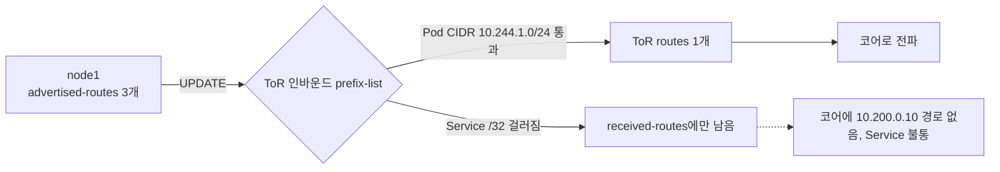

ToR의 인바운드 prefix-list가 Pod CIDR(`10.244.0.0/16`의 /24만)만 허용하는 상황으로 재현했다. 노드가 광고한 /32 Service IP는 prefix-list에 걸린다.

```text
node1# show ip bgp neighbors 10.2.1.1 advertised-routes
*> 10.200.0.10/32   0.0.0.0                  0         32768 i
*> 10.244.1.0/24    0.0.0.0                  0         32768 i
Total number of prefixes 3

tor# show ip bgp neighbors 10.2.1.2 received-routes
*> 10.200.0.10/32   10.2.1.2                 0             0 65100 i
*> 10.244.1.0/24    10.2.1.2                 0             0 65100 i
Total number of prefixes 3 (2 filtered)

tor# show ip bgp neighbors 10.2.1.2 routes
*> 10.244.1.0/24    10.2.1.2                 0             0 65100 i

tor# show bgp summary
10.2.1.2        4      65100        8        11 ...  00:00:10     1        4
```

node1은 prefix 3개를 광고했고 ToR은 3개를 받았지만 2개를 걸렀다. 수락된 건 Pod CIDR 하나뿐이다. 이 상태에서 코어에는 `10.200.0.10` 경로가 없고 클라이언트의 ping은 실패했다. `bgp summary`의 PfxRcd가 1로 줄어 있는 것이 유일한 단서다. 세션 상태만 보면 정상이다.

원인 위치를 가르는 순서는 같다. 노드의 `advertised-routes`에는 있는데 ToR의 `routes`(수락분)에 없으면 인바운드 필터다. 둘 사이의 `received-routes`가 필터 직전의 상태를 보여 준다. 이 명령이 동작하려면 ToR에서 `soft-reconfiguration inbound`를 켜 둬야 한다. FRR 8.1은 filtered 개수를 `(2 filtered)`로 같이 표시했다.

Calico에서는 광고 단위가 이 문제를 더 만든다. Local이면 /32를 광고하지만 Cluster에서는 `serviceLoadBalancerIPs`에 적은 CIDR이 광고된다. ToR의 prefix-list가 /32만 허용하도록 만들어져 있으면 Cluster 모드의 CIDR 경로가 걸러진다. 네트워크 팀이 쓴 필터와 쿠버네티스 쪽 정책이 서로의 광고 단위를 모르는 채로 만들어져서 생기는 사고다. 필터를 정할 때 `ge`, `le`를 광고 단위에 맞춰 같이 정한다.

### maximum-prefix로 세션이 끊길 때

ToR은 노드당 받는 prefix 수에 상한(`maximum-prefix`)을 걸어두는 경우가 많다. Service를 늘리다 보면 이 상한에 걸려 세션이 끊긴다. ToR에서 노드 하나의 상한을 3으로 두고 node1이 prefix를 늘리는 상황을 재현했다.

```text
tor# show bgp summary
10.2.1.2        4      65100        13        15 ...  00:00:03 Idle (PfxCt)        0

tor# show bgp neighbors 10.2.1.2
  BGP state = Idle
  Maximum prefixes allowed 3
  Last reset 00:00:04,   Notification sent (Cease/Maximum Number of Prefixes Reached)
  Peer had exceeded the max. no. of prefixes configured.
```

세션 상태는 아래처럼 한 번 꺾이면 운영자가 손대기 전까지 돌아오지 않는다.

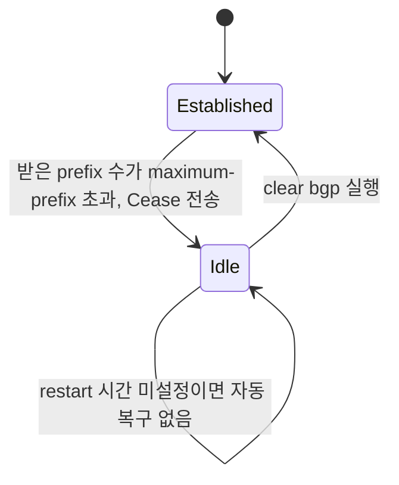

`Idle (PfxCt)`는 상한 초과로 ToR이 세션을 끊었다는 뜻이다. 32초 뒤에도 여전히 Idle이었다. FRR에서 `maximum-prefix`에 재시작 시간(`restart`)을 주지 않으면 운영자가 `clear bgp`를 하기 전까지 자동 복구가 안 된다. 이 노드는 ECMP에서도 빠져서 경로가 3개에서 2개로 줄었다.

한 노드에서만 이 일이 생기지 않는다는 점이 무섭다. Cluster 정책에서는 모든 노드가 같은 Service /32 집합을 광고하니 상한을 넘는 순간 모든 노드의 세션이 한꺼번에 끊긴다. Service 하나를 추가한 변경이 클러스터 전체 외부 접속을 끊는 사고가 된다. 상한은 지금 prefix 수보다 넉넉하게 잡고, 임계 경고(`warning-only`나 threshold)로 먼저 알림을 받는 쪽을 쓴다. 상한을 켜 두는 것 자체는 필요하다. 노드의 설정 오류가 풀 라우팅 테이블을 ToR에 쏟아내는 일을 막아 준다.

## 정리해서 보면

랙마다 ToR 설정과 쿠버네티스 쪽 설정이 맞물려야 BGP가 동작한다. 막힐 때 가장 먼저 의심할 것은 쿠버네티스 쪽이 아니라 ToR 쪽 세 가지다. multipath 설정, ECMP 해시 필드, 인바운드 prefix 필터다. 이 셋은 세션이 올라온 뒤에 증상이 나타나서, 세션 상태만 보면 정상으로 보인다. 노드 장애 때 걸리는 시간은 감지 방식이 정하므로, 프로세스 종료와 링크 다운은 1초 안에 끝나고 침묵 장애는 BFD가 없으면 hold timer 시간 전부를 기다린다. ECMP 집합이 바뀌면 살아있는 노드로 가던 연결도 일부 끊기는 것은 ToR이 stateless 해시로 분산하는 한 피할 수 없고, 줄이는 방법은 장비의 안정 해시 옵션뿐이다.
