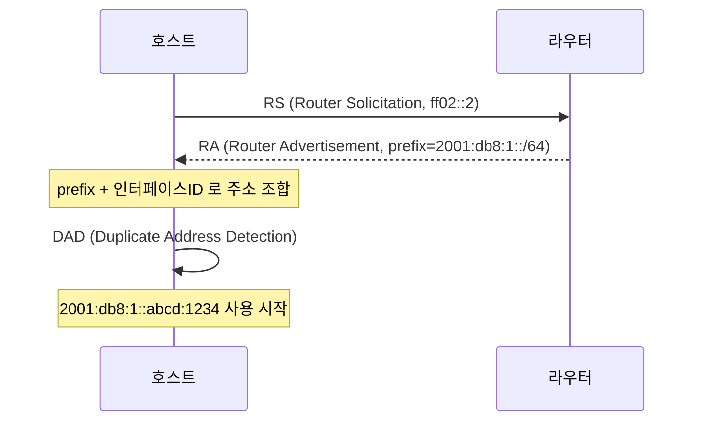
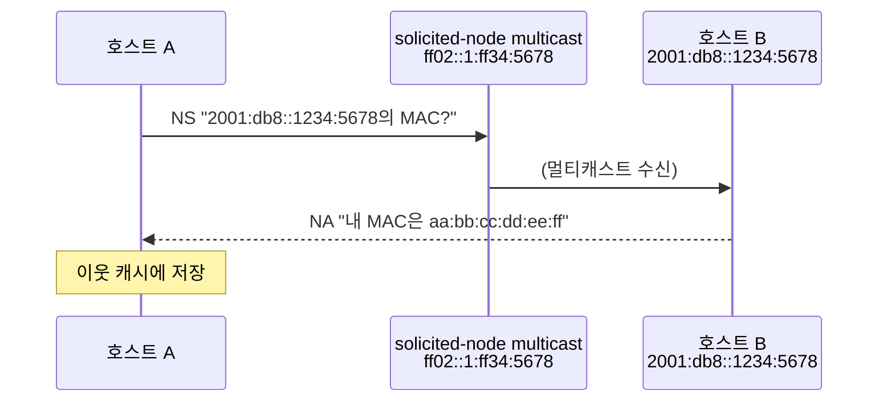

# IPv6 — 주소 고갈 너머의 운영 현실

## 들어가며

IPv6를 처음 진지하게 만진 건 AWS VPC에서 "외부 NAT 비용을 줄여보자"는 이야기가 나왔을 때였다. IPv4 환경에서 프라이빗 서브넷의 트래픽이 외부로 나가려면 NAT Gateway를 거치는데, 시간당 요금에 데이터 처리 요금까지 붙어서 트래픽이 좀만 늘어나도 청구서가 무겁다. 그런데 IPv6는 모든 주소가 사실상 공인이고, 인터넷 통신을 위해 NAT를 거칠 필요가 없으니 NAT Gateway 비용이 빠진다. 좋은 아이디어처럼 들렸다. 막상 작업을 시작하니 SLAAC가 뭔지, ICMPv6를 막으면 왜 통신이 깨지는지, Dual Stack과 IPv6-only가 운영상 어떻게 다른지부터 막혔다.

IPv6는 단순히 "주소가 길어진 IPv4"가 아니다. 주소 할당 방식이 다르고, ARP 대신 NDP가 들어왔고, ICMP는 선택 사항이 아니라 필수 인프라가 됐고, NAT를 전제로 만들어진 IPv4 운영 관행이 거의 다 통하지 않는다. 문서나 RFC만 봐서는 안 잡히는 부분이 너무 많다. 이 글은 IPv6의 주소 체계부터 시작해서 SLAAC와 DHCPv6, NDP가 ARP와 어떻게 다른지, IPv6-only/Dual Stack/NAT64+DNS64를 언제 어떻게 쓰는지, AWS VPC에서 IPv6 설계할 때 부딪히는 지점들, 그리고 운영하다 만나는 실무 함정까지 정리한다.

## IPv4 주소 고갈 문제와 IPv6의 등장

IPv4는 32비트 주소 공간을 가진다. 이론상 약 43억 개다. 인터넷이 학술 연구망이던 시절엔 충분해 보였지만, 1990년대 후반부터 한계가 보이기 시작했다. 클래스 단위로 IP를 통째 할당하던 관행이 낭비가 심했고, 인터넷에 붙는 기기는 폭증했다. 1994년에 IETF가 IPv6 표준화를 시작했고 1998년 RFC 2460으로 처음 정해졌다(현재 표준은 2017년 RFC 8200).

IANA의 IPv4 풀은 2011년에 고갈됐다. 그 뒤로는 RIR(지역 인터넷 레지스트리) 단위로 마지막 /8 블록을 나눠 쓰고 있고, APNIC, RIPE 같은 RIR들도 이미 보유 분량이 거의 다 떨어졌다. ISP들은 신규 가입자에게 공인 IPv4를 못 주고 CGNAT(Carrier-Grade NAT)로 묶어서 내보내는 식으로 버틴다.

IPv6는 128비트다. 주소 수가 약 3.4 × 10^38개로, 지구 표면 1제곱미터당 6.7 × 10^23개를 줄 수 있다. 사실상 고갈 걱정이 없는 공간이라 할당 방식 자체가 헐겁다. 일반 가정도 /64 하나(약 1800경 개 주소)를 받는 게 표준이다. 이 풍족함이 IPv6 설계의 곳곳에 녹아 있다. NAT를 안 써도 되고, 호스트가 알아서 주소를 만드는 SLAAC가 가능하고, 임시 주소를 수시로 바꿔 써도 부담이 없다.

## 주소 표기법

IPv6 주소는 128비트, 16비트씩 8그룹으로 끊고 콜론으로 구분해서 16진수로 쓴다.

```
2001:0db8:0000:0000:0000:ff00:0042:8329
```

이렇게 다 쓰면 길어서 두 가지 축약 규칙이 있다.

**규칙 1: 그룹 앞쪽의 0은 생략한다.**
`0db8` → `db8`, `0000` → `0`, `ff00` → `ff00`(앞이 0이 아니므로 그대로)

**규칙 2: 연속된 0 그룹은 `::`로 한 번만 압축할 수 있다.**

```
원본:   2001:0db8:0000:0000:0000:ff00:0042:8329
규칙1:  2001:db8:0:0:0:ff00:42:8329
규칙2:  2001:db8::ff00:42:8329
```

`::`는 한 주소에 한 번만 쓸 수 있다. 두 번 쓰면 어디부터 어디까지가 0인지 알 수 없다. 그래서 `2001::1::1` 같은 표기는 불법이다. 또 `::`가 가장 긴 0 시퀀스를 압축해야 하고, 길이가 같으면 보통 앞쪽 시퀀스를 압축한다. 사람마다 표기가 살짝 달라질 여지가 있어서 RFC 5952가 권장 표기를 정해뒀다. 도구가 출력하는 정규형은 대체로 이걸 따른다.

대표적인 특수 주소 몇 개는 외워두면 편하다.

| 주소 | 의미 |
|---|---|
| `::` | 모든 비트가 0. unspecified address. DHCPv6 클라이언트가 주소 받기 전에 소스로 씀 |
| `::1` | 루프백. IPv4의 127.0.0.1에 해당 |
| `fe80::/10` | Link-local. 같은 링크에서만 유효 |
| `fc00::/7` | Unique Local Address. IPv4의 사설 IP에 해당 |
| `2000::/3` | Global Unicast의 거의 전체 범위 |
| `ff00::/8` | Multicast |

IPv6는 브로드캐스트가 없다. 그 자리를 멀티캐스트가 대신한다. 대표적으로 `ff02::1`(all-nodes multicast)은 같은 링크의 모든 노드, `ff02::2`(all-routers multicast)는 같은 링크의 모든 라우터에게 가는 주소다.

### URL과 포트 표기

IPv6 주소는 콜론이 많아서 URL에 그대로 박으면 포트 구분이 모호해진다. 그래서 URL에서는 대괄호로 감싼다.

```
http://[2001:db8::1]:8080/path
ssh://user@[fe80::1%en0]
```

`%en0` 부분은 zone ID라고 부른다. Link-local 주소는 어느 인터페이스의 링크인지 명시해야 동작한다. 같은 `fe80::1`이 여러 인터페이스에 있을 수 있으니 OS가 인터페이스 이름을 붙여서 구분한다. macOS는 `%en0`, 리눅스는 `%eth0`, 윈도우는 `%4` 같은 인덱스를 쓴다.

### Prefix 표기

IPv6도 CIDR 표기를 쓴다. `2001:db8::/32` 같은 식이다. 단 IPv6에서는 거의 대부분의 서브넷이 `/64`다. 호스트 부분이 64비트로 고정되어 있어서 SLAAC가 동작한다. `/64`보다 작은 서브넷(예: /112)은 기술적으로 가능하지만 SLAAC가 깨지므로 특수 용도(라우터 간 P2P 링크 등)가 아니면 권장되지 않는다.

```
2001:db8:1234:5678::/64
└── 상위 64비트: 네트워크 ──┘└── 하위 64비트: 호스트(인터페이스 ID) ──┘
```

ISP에서 받는 prefix는 보통 `/48` 또는 `/56`이다. 가정용 회선이 `/56`을 받으면 그 안에서 `/64` 서브넷을 256개 잘라 쓸 수 있다. 회사가 `/48`을 받으면 6만 5천 개 서브넷이다.

## 주소 종류 — GUA, ULA, Link-local

IPv6 주소는 스코프(scope)에 따라 어디까지 유효한지가 달라진다. 한 인터페이스가 동시에 여러 종류의 주소를 갖는 게 정상이고, OS는 목적지에 따라 어느 소스 주소를 쓸지 자동으로 고른다(RFC 6724의 source address selection 규칙).

### Global Unicast Address (GUA)

`2000::/3` 범위. 인터넷 전 구간에서 유일한 주소다. IPv4로 치면 공인 IP에 해당하지만, IPv6에서는 거의 모든 호스트가 GUA를 가진다. 그래서 NAT 없이도 외부 통신이 그대로 된다.

GUA는 보통 `[글로벌 라우팅 prefix][서브넷 ID][인터페이스 ID]` 구조다. 예를 들어 ISP가 `/48`을 줬다면 앞 48비트는 라우팅 prefix, 그 다음 16비트는 서브넷 ID, 마지막 64비트는 인터페이스 ID다.

```
2001:db8:abcd:0001:1234:5678:9abc:def0
└── /48 라우팅 prefix ──┘└─ ──┘└── 인터페이스 ID 64비트 ──┘
                       서브넷
```

### Unique Local Address (ULA)

`fc00::/7` 범위. 실무에서는 `fd00::/8`만 쓰는데, 정의상 `fc00::/8`은 중앙 등록용으로 예약된 채 사실상 안 쓰이기 때문이다. ULA는 IPv4의 `10.0.0.0/8`이나 `192.168.0.0/16` 같은 사설 주소에 해당한다. 인터넷에는 라우팅되지 않고, 조직 내부에서만 쓴다.

ULA 만들 때 주의할 점은 prefix를 무작위로 뽑아 써야 한다는 점이다. `fd00::/8` 다음 40비트(Global ID)는 RFC 4193이 무작위 생성을 권한다. 무작위로 뽑으면 다른 조직과 충돌 확률이 매우 낮아져서, 나중에 두 회사가 VPN으로 연결되거나 합병할 때 주소가 겹치는 사고를 피할 수 있다. IPv4의 10.x.x.x를 모두가 똑같이 써서 VPN 붙일 때마다 충돌 나는 그 문제를 IPv6는 처음부터 피하려고 한다.

```bash
# 리눅스에서 ULA prefix 생성
$ uuidgen | sha1sum | cut -c10-19
2a3b4c5d6e

# 결과: fd2a:3b4c:5d6e::/48
```

ULA를 GUA와 동시에 쓸 수 있다. 외부 통신은 GUA로, 내부 통신은 ULA로 나누는 설계가 가능하다. ISP에서 받는 GUA prefix는 회선 갱신이나 ISP 변경 시 바뀔 수 있는데, ULA는 한 번 정하면 평생 안 바꾸므로 내부 시스템 간 통신을 ULA로 통일해두면 prefix 변경에 휘둘리지 않는다.

### Link-local Address

`fe80::/10` 범위. 같은 링크(L2 세그먼트) 안에서만 유효하다. 라우터가 절대 라우팅하지 않는다. IPv6에서 이 주소는 옵션이 아니라 필수다. 인터페이스가 IPv6를 켜는 순간 자동으로 link-local 주소가 생성된다(보통 EUI-64 방식으로 MAC에서 파생).

link-local은 NDP, OSPFv3, 라우터의 next-hop 광고 같은 링크 단위 프로토콜이 의존한다. 라우터가 RA(Router Advertisement)를 보낼 때 소스 주소는 link-local이고, 클라이언트가 GUA를 통해 외부로 패킷을 보낼 때도 next-hop은 라우터의 link-local 주소다. 그래서 link-local이 죽으면 IPv6 통신 자체가 막힌다.

ssh로 link-local 주소에 접속할 일이 가끔 있다. 인터페이스를 명시해줘야 한다.

```bash
$ ping6 fe80::1%en0
$ ssh user@fe80::1%en0
```

### Anycast와 Multicast

Anycast는 같은 주소를 여러 호스트에 부여하고 라우팅이 가장 가까운 곳으로 보내게 하는 방식이다. IPv6에서 anycast는 unicast 주소 공간과 구분 없이 쓰며, 라우팅으로만 결정된다. CDN의 엣지 노드나 DNS 루트 서버에서 흔히 쓴다.

Multicast는 `ff00::/8`이다. IPv4 multicast(`224.0.0.0/4`)와 비슷한데, IPv6에서는 NDP가 multicast로 동작하기 때문에 거의 모든 호스트가 일상적으로 멀티캐스트를 다룬다. 예약된 주요 주소는 다음과 같다.

| 주소 | 범위 | 용도 |
|---|---|---|
| `ff02::1` | link-local | all-nodes |
| `ff02::2` | link-local | all-routers |
| `ff02::1:ff00:0/104` | link-local | solicited-node multicast |
| `ff05::1` | site-local | all-nodes(사이트 범위) |

solicited-node multicast는 NDP가 ARP의 브로드캐스트를 대체할 때 쓰는 핵심 메커니즘이다. 뒤에서 설명한다.

## SLAAC와 DHCPv6 — 주소를 어떻게 받을까

IPv4에서 호스트가 주소를 받는 방법은 보통 두 가지다. 수동 설정 또는 DHCP. IPv6에는 여기에 SLAAC(Stateless Address Auto-Configuration)가 추가된다. 그리고 SLAAC와 DHCPv6가 공존하면서 역할을 나눠 가지는 경우가 흔하다. 이 부분이 IPv6 입문자가 가장 헷갈리는 지점이다.

### SLAAC

SLAAC는 호스트가 라우터로부터 prefix만 받고 인터페이스 ID를 자기가 만들어 붙여서 주소를 완성하는 방식이다. RFC 4862가 정의한다. DHCP 서버 없이도 호스트가 알아서 IPv6 주소를 가진다.

흐름은 이렇다.



호스트가 부팅되면 link-local 주소부터 만든다. 그다음 `ff02::2`(all-routers)로 RS(Router Solicitation)를 던진다. 라우터가 RA(Router Advertisement)를 응답하는데, 이 광고에 `Prefix Information` 옵션이 들어 있다. 호스트는 받은 prefix(보통 /64)에 자기 인터페이스 ID 64비트를 붙여 GUA를 만든다.

인터페이스 ID를 만드는 방식은 두 가지다.

**EUI-64:** MAC 주소(48비트)를 64비트로 늘려 쓴다. MAC을 24비트씩 둘로 쪼개고 가운데에 `fffe`를 끼우고, 첫 바이트의 U/L 비트를 뒤집는다. MAC `00:1a:2b:3c:4d:5e`라면 인터페이스 ID는 `021a:2bff:fe3c:4d5e`가 된다. MAC이 그대로 노출되니 추적 가능성 문제로 점점 안 쓴다.

**RFC 7217 안정적 무작위:** prefix와 인터페이스 이름, 호스트 비밀값을 SHA로 해시해서 인터페이스 ID를 뽑는다. 같은 prefix에서는 항상 같은 ID가 나오지만, 다른 네트워크로 옮기면 다른 ID가 된다. 추적이 어려워진다. 현대 OS의 기본값.

**임시 주소(Privacy Extension, RFC 4941):** 외부로 나가는 연결마다 짧은 수명의 무작위 주소를 추가로 만든다. 시간이 지나면 폐기된다. 한 인터페이스에 GUA가 여러 개 붙는 게 이 때문이다. 윈도우, macOS, iOS는 기본 켜져 있고, 리눅스는 배포판마다 다르다.

### Duplicate Address Detection (DAD)

호스트가 주소를 만들었다고 바로 쓰지 않는다. 같은 링크에 똑같은 주소를 쓰는 다른 노드가 있는지 먼저 확인한다. 자기가 만든 주소를 대상으로 NS(Neighbor Solicitation)를 보내고, 1초 정도 기다린다. 응답(NA)이 오면 충돌이라는 뜻이라서 그 주소는 폐기한다. 아무 응답이 없으면 "preferred" 상태로 올라서서 사용 가능하다.

DAD가 끝나기 전까지 주소는 "tentative" 상태고 통신에 쓸 수 없다. 운영 중에 인터페이스 down/up을 반복하면 DAD가 매번 1초씩 지연되는 게 이 때문이다. 운영 자동화 스크립트에서 인터페이스를 올린 직후 바로 ping을 쏘면 실패하는 케이스가 종종 있다.

### RA의 플래그 — M, O, A

RA 메시지에는 세 개의 중요한 플래그가 있다. 이 조합이 SLAAC와 DHCPv6의 역할을 결정한다.

| 플래그 | 의미 |
|---|---|
| M (Managed) | 주소를 DHCPv6 서버에서 받아라 |
| O (Other) | 주소 외의 정보(DNS, NTP 등)는 DHCPv6에서 받아라 |
| A (Autonomous) | 이 prefix는 SLAAC 가능하다 |

조합 시나리오는 보통 세 가지다.

**Stateless SLAAC (M=0, O=0, A=1):** 주소도 SLAAC, DNS는 RA의 RDNSS 옵션이나 수동 설정. 라우터 외엔 추가 인프라가 필요 없다. 가정용 인터넷이 대부분 이 방식.

**Stateless SLAAC + Stateless DHCPv6 (M=0, O=1, A=1):** 주소는 SLAAC, DNS/NTP는 DHCPv6에서. 호스트별로 주소를 추적할 필요는 없지만 DNS 서버 정보는 동적으로 주고 싶을 때.

**Stateful DHCPv6 (M=1, O=1, A=0):** IPv4 DHCP처럼 DHCPv6 서버가 호스트별로 주소를 할당하고 기록한다. 기업 내부망에서 IP 할당을 통제하고 싶을 때.

윈도우는 DHCPv6를 잘 지원하지만 안드로이드는 DHCPv6를 아예 구현하지 않았다(2026년 기준). 그래서 안드로이드 기기가 많은 환경에서 stateful DHCPv6만 켜두면 안드로이드는 IPv6 주소를 못 받는다. SLAAC를 같이 켜둬야 한다.

### RA에 RDNSS와 DNSSL이 들어가는 이유

초기 IPv6 표준에는 DNS 서버를 알려주는 방법이 RA에 없었다. DNS 정보를 받으려면 무조건 DHCPv6를 따로 띄워야 했다. 이 비효율을 해결하려고 RFC 8106이 RA에 RDNSS(Recursive DNS Server)와 DNSSL(DNS Search List) 옵션을 추가했다. 이제 RA만으로 IPv6 주소 + DNS 서버 + 검색 도메인까지 다 받을 수 있다. 라우터/방화벽 장비가 RFC 8106을 지원하지 않으면 여전히 DHCPv6를 같이 띄워야 한다. 구형 장비에서 자주 막힌다.

## NDP — ARP를 대체한 이웃 탐색 프로토콜

IPv4의 ARP는 같은 링크의 IP를 MAC으로 바꾸는 프로토콜이다. IPv6에는 ARP가 없다. 대신 NDP(Neighbor Discovery Protocol, RFC 4861)가 그 자리를 채운다. NDP는 ICMPv6 메시지로 동작한다.

### NDP가 다루는 메시지 4종

| 타입 | 약자 | 용도 |
|---|---|---|
| 133 | RS (Router Solicitation) | "라우터 있냐?" 호스트가 라우터에게 |
| 134 | RA (Router Advertisement) | "여기 라우터다, prefix는 이거다" 라우터가 호스트에게 |
| 135 | NS (Neighbor Solicitation) | "이 IP의 MAC 알려줘" 또는 도달 확인 |
| 136 | NA (Neighbor Advertisement) | "내 MAC은 이거다" NS의 응답 |

ARP는 4개 메시지 타입(Request, Reply, RARP Request, RARP Reply)이지만 NDP는 라우터 발견까지 같이 한다. ARP가 못 하던 일을 NDP는 함께 해낸다.

### NS/NA로 IP→MAC 해석

ARP는 브로드캐스트로 "누가 192.168.1.10 가졌어?"를 묻는다. 같은 링크의 모든 호스트가 이 패킷을 받고, 자기 IP가 아니면 무시한다. 브로드캐스트 도메인이 크면 부담이다.

NDP는 solicited-node multicast를 쓴다. IP의 마지막 24비트를 `ff02::1:ff00:0/104`에 붙여서 만든 멀티캐스트 주소다. 예를 들어 `2001:db8::1234:5678`을 찾으려면 `ff02::1:ff34:5678`로 NS를 보낸다. 같은 링크에서 자기 인터페이스 ID의 끝 24비트가 `34:5678`인 호스트만 이 멀티캐스트를 듣는다. 나머지는 NIC 단에서 걸러서 CPU까지 안 올라온다. 트래픽 부담이 훨씬 적다.



### NUD (Neighbor Unreachability Detection)

ARP는 한 번 캐시하면 만료될 때까지 그 정보가 유효하다고 믿는다. 상대가 죽었어도 캐시가 살아있으면 한참 동안 잘못된 MAC으로 보낸다. NDP는 NUD라는 메커니즘으로 이웃의 상태를 능동적으로 확인한다.

이웃 캐시 엔트리는 다섯 상태를 가진다.

| 상태 | 의미 |
|---|---|
| INCOMPLETE | NS 보냈는데 아직 응답 없음 |
| REACHABLE | 최근에 확인됨 (보통 30초) |
| STALE | REACHABLE 시간이 지남, 다음 통신 때 확인 필요 |
| DELAY | STALE 상태에서 패킷이 나갔고 응답을 기다리는 중 |
| PROBE | 응답이 없어서 unicast NS로 능동 확인 중 |

호스트가 패킷을 보내려 할 때 이웃이 STALE이면 일단 보내고 DELAY로 바꾼다. 응답(상위 레이어에서 ACK가 오면 reachable로 판정)이 없으면 PROBE로 넘어가 NS를 직접 던진다. NS에도 응답이 없으면 캐시에서 지운다. ARP보다 훨씬 정교하다.

```bash
# 리눅스에서 이웃 캐시 보기
$ ip -6 neigh show
fe80::1 dev en0 lladdr 00:11:22:33:44:55 router REACHABLE
2001:db8::5 dev en0 lladdr aa:bb:cc:dd:ee:ff STALE

# macOS
$ ndp -an
```

### ARP와 NDP 비교

| 항목 | ARP | NDP |
|---|---|---|
| 동작 레이어 | L2.5 (EtherType 0x0806) | L3 (ICMPv6) |
| 탐색 방식 | 브로드캐스트 | Solicited-node multicast |
| 라우터 발견 | 별도 프로토콜(ICMP Router Discovery, 거의 미사용) | RA 내장 |
| 주소 자동 설정 | 없음 (DHCP 필요) | SLAAC 내장 |
| 상태 추적 | 단순 캐시 만료 | NUD 5단계 상태머신 |
| 인증 | 없음 | SEND(거의 안 씀) 또는 RA Guard |
| 중복 검출 | Gratuitous ARP (보조적) | DAD 표준 |

NDP가 ICMPv6 위에서 동작한다는 게 운영상 큰 의미를 가진다. IPv4에서는 ICMP를 방화벽에서 막아도 통신이 어느 정도 굴러간다(PMTUD가 깨지는 정도). IPv6에서 ICMPv6를 막으면 NDP가 멈추고, NDP가 멈추면 같은 링크에서 IP→MAC 해석이 안 돼서 통신 자체가 시작되지 않는다. ICMPv6를 무차별로 막으면 안 되는 이유가 여기 있다.

### NDP의 보안 문제 — RA Guard

ARP의 가장 큰 약점이 ARP spoofing이었다. NDP도 마찬가지로 인증이 없어서, 같은 링크에 붙은 누군가가 가짜 RA를 쏘면 모든 호스트의 기본 게이트웨이를 바꿔버릴 수 있다. 사용자 PC가 "내가 라우터다"라고 잘못 RA를 광고하는 사고도 흔하다(Windows ICS, 잘못 설정된 가상화 환경).

대응책은 스위치 단의 RA Guard다. 라우터로 지정한 포트가 아닌 곳에서 RA가 들어오면 스위치가 그 프레임을 폐기한다. Cisco, Juniper 등 엔터프라이즈 장비에는 다 있고, 가정용 장비는 거의 없다.

```
[정상 라우터] --포트 1-- [스위치] --포트 2-- [PC]
                            │
                            │ RA Guard: 포트 1만 RA 허용
                            │
                            ▼
                  포트 2에서 RA 오면 drop
```

## IPv6-only, Dual Stack, NAT64/DNS64 — 어떻게 마이그레이션할까

IPv4에서 IPv6로 한 번에 다 갈아탈 수 없다. 인터넷 어딘가에는 항상 IPv4만 쓰는 서비스가 남아 있고, 클라이언트도 마찬가지다. 그래서 전환기에는 두 프로토콜을 같이 쓰는 여러 패턴이 등장했다.

### Dual Stack

호스트와 라우터가 IPv4와 IPv6를 동시에 운영한다. 같은 인터페이스가 IPv4 주소와 IPv6 주소를 모두 가진다. DNS에 A 레코드와 AAAA 레코드가 둘 다 있으면, 클라이언트가 둘 중 가능한 쪽으로 연결한다. RFC 6555가 정의한 Happy Eyeballs 알고리즘이 두 프로토콜을 동시에 시도해서 먼저 성공한 쪽을 쓴다.

```
$ dig www.google.com A AAAA
www.google.com.  300 IN A    142.250.207.100
www.google.com.  300 IN AAAA 2404:6800:400a:80a::2004
```

장점은 호환성이 100%다. IPv4만 지원하는 서버에는 v4로, v6 지원 서버에는 v6로 붙는다. 단점은 운영 부담이 두 배다. 방화벽 룰도 두 벌, 모니터링도 두 벌, 트러블슈팅도 두 벌이다. IP 주소 추적이나 abuse 대응 같은 부분도 양쪽을 다 봐야 한다.

대부분의 기업 환경, AWS VPC, ISP 가입자 회선이 dual stack으로 운영된다.

### IPv6-only

호스트와 네트워크가 IPv6만 운영한다. IPv4 설정이 아예 없다. 클린한 구성이지만 IPv4-only 서버에 도달할 방법이 따로 필요하다. 모바일 통신사 망(특히 T-Mobile US)이 IPv6-only로 전환한 대표 사례다. 백본은 IPv6만 돌리고, IPv4가 필요한 트래픽은 NAT64로 변환한다.

### NAT64와 DNS64

NAT64는 IPv6 클라이언트가 IPv4 서버로 통신할 때 IPv6 패킷을 IPv4 패킷으로 변환해주는 게이트웨이다. RFC 6146이 정의한다. NAT64만 있으면 안 되고 DNS64가 짝으로 필요하다.

DNS64는 DNS resolver가 클라이언트의 AAAA 질의에 대해, 원래 도메인에 AAAA가 없으면 A 레코드를 IPv6 주소로 합성해서 응답하는 메커니즘이다. RFC 6147. 보통 `64:ff9b::/96` prefix(well-known NAT64 prefix)에 IPv4 주소를 매핑한다.

```
1. 클라이언트: "ipv4only.example.com AAAA?"
2. DNS64 resolver:
   - 원래 권한 서버에 AAAA 질의 → 없음
   - A 질의 → 192.0.2.10
   - 합성: 64:ff9b::192.0.2.10 = 64:ff9b::c000:20a
3. 클라이언트: "64:ff9b::c000:20a로 IPv6 패킷 전송"
4. NAT64 게이트웨이:
   - 목적지 IPv6에서 IPv4(192.0.2.10) 추출
   - IPv6 패킷 → IPv4 패킷 변환
   - 자기 IPv4 주소를 소스로 IPv4 인터넷으로 전송
   - 응답 받으면 역변환해서 클라이언트에게
```

NAT64+DNS64는 클라이언트 입장에서는 자기가 IPv4를 모른다는 게 핵심이다. 모든 통신을 IPv6로 시작한다. 단 IPv4 리터럴(예: `https://192.0.2.10/`)이 박힌 앱은 동작하지 않는다. 이 문제를 막으려고 CLAT(464XLAT, RFC 6877)라는 클라이언트 단 변환기를 함께 쓰기도 한다.

DNSSEC와 DNS64는 충돌한다. DNS64가 응답을 합성하면 권한 서버의 서명을 검증할 수 없다. 그래서 DNS64 환경에서는 클라이언트가 DNSSEC 검증을 resolver에 위임하거나, 합성된 응답에 한해서는 검증을 포기해야 한다.

### 정리

| 패턴 | 클라이언트 | 서버 | 운영 부담 | 비고 |
|---|---|---|---|---|
| Dual Stack | v4 + v6 | v4 + v6 | 높음 | 가장 호환성 좋음 |
| IPv6-only + NAT64 | v6만 | v4 또는 v6 | 중간 | 모바일 통신사 표준 |
| IPv4-only | v4만 | v4만 | 낮음 | 점점 사라짐 |
| 6to4, Teredo | 터널링 | - | - | 거의 폐기됨 |

신규 인프라를 IPv6-only로 깔자는 압박이 점점 커진다. 운영 단순화, 주소 풍부, 보안 분리(NAT 의존성 제거) 같은 이유가 있다. AWS도 2024년부터 EKS 등에서 IPv6-only 클러스터를 권장하기 시작했다.

## AWS VPC IPv6 설계

AWS에서 IPv6를 쓰려면 VPC 단부터 다시 설계해야 한다. IPv4 VPC를 그대로 두고 IPv6만 얹는 게 가능하지만, 동작 모델이 꽤 다르다.

### VPC에 IPv6 prefix 할당

VPC를 만들 때 AWS가 자동으로 `/56` IPv6 CIDR을 할당한다. 사용자가 prefix를 고를 수 없다(BYOIP IPv6를 쓰면 가능하지만 절차가 까다롭다). 이 `/56`을 서브넷마다 `/64`로 잘라서 할당한다.

```
VPC: 2600:1f14:abcd::/56
├── Subnet A (AZ-a, public):  2600:1f14:abcd:00::/64
├── Subnet B (AZ-a, private): 2600:1f14:abcd:01::/64
├── Subnet C (AZ-b, public):  2600:1f14:abcd:10::/64
└── Subnet D (AZ-b, private): 2600:1f14:abcd:11::/64
```

서브넷은 무조건 `/64`다. AWS가 강제한다. 이건 SLAAC 호환 때문이 아니라(AWS는 SLAAC를 안 쓴다) 표준 관례를 따른 것이다. AWS는 DHCPv6 stateful 모드로 IPv6 주소를 할당한다.

### NAT가 없다 — 대신 Egress-only Internet Gateway

IPv4 프라이빗 서브넷의 트래픽은 NAT Gateway를 거쳐 외부로 나간다. IPv6에는 NAT가 없다. 그럼 프라이빗 서브넷의 IPv6 호스트가 외부로 나가되 외부에서는 접근 못 하게 하려면 어떻게 하나?

답은 Egress-only Internet Gateway(EIGW)다. 이름 그대로 outbound만 허용하는 게이트웨이다. EIGW는 stateful해서 내부에서 시작한 연결의 응답은 받아들이지만, 외부에서 먼저 시작한 연결은 차단한다. NAT처럼 주소 변환을 하는 건 아니다. IPv6 주소는 그대로 외부에 노출되지만 inbound가 막힌다.

```
[Private EC2 IPv6: 2600:1f14:abcd:01::5]
        │
        ▼
[Route: ::/0 → eigw-xxxx]
        │
        ▼
[Egress-only IGW] ──→ 인터넷 (outbound만)
```

이게 청구서에 미치는 영향이 크다. NAT Gateway는 시간당 요금 + 데이터 처리당 요금이 붙어서 트래픽 많은 워크로드에선 큰 비용이다. EIGW는 시간당 요금이 없고 데이터 전송 요금만 있다. IPv6로 외부 트래픽을 빼면 비용이 줄어드는 게 이 차이 때문이다.

### Public/Private 구분이 모호해진다

IPv4에서 "퍼블릭 서브넷"은 IGW로 직접 라우팅되는 서브넷, "프라이빗 서브넷"은 NAT Gateway 경유 서브넷이다. IPv6에서는 모든 주소가 글로벌하니 이 구분이 약해진다. 인바운드 차단 여부로만 구분된다. EIGW로 라우팅하면 프라이빗처럼 동작하고, IGW로 라우팅하면 퍼블릭이다.

보안 그룹과 NACL은 IPv4와 IPv6 룰을 별도로 작성해야 한다. 자주 빠뜨리는 함정이다. SSH 22번 포트를 IPv4 `0.0.0.0/0`에서만 막아두고 IPv6 `::/0`를 안 막으면 IPv6로 SSH가 그대로 열려 있다. 보안 그룹 룰 검토할 때 IPv4/IPv6 양쪽을 다 봐야 한다.

### DNS — AAAA 레코드와 Dual Stack 엔드포인트

ALB, NLB, CloudFront 같은 서비스는 IPv4/IPv6 dual stack 엔드포인트를 선택할 수 있다. 활성화하면 AAAA 레코드가 자동으로 응답에 포함된다. 클라이언트가 IPv6를 선호하면 v6로 붙고, 아니면 v4로 붙는다.

S3는 dual stack 엔드포인트가 따로 있다. `s3.dualstack.ap-northeast-2.amazonaws.com` 같은 도메인이다. 기본 엔드포인트는 IPv4만 응답해서, IPv6-only VPC에서 S3에 접근하려면 dualstack 엔드포인트나 S3 Gateway Endpoint를 써야 한다.

### EKS와 IPv6-only 클러스터

EKS는 1.21부터 IPv6-only 클러스터를 지원한다. 파드와 서비스 모두 IPv6 주소만 받는다. IPv4 한계(서브넷당 주소가 빨리 고갈되는 문제)를 해결한다. EKS의 IPv4 모드에서 큰 클러스터를 운영하면 서브넷의 IP 부족으로 파드 스케일링이 막히는 사고가 흔한데, IPv6는 사실상 무제한이다.

다만 IPv6-only 클러스터의 파드가 외부 IPv4 서비스에 접근하려면 NAT64 또는 NAT Gateway 우회 설정이 필요하다. AWS는 자체 NAT64 서비스(2023년부터)를 통해 이걸 처리한다. 클러스터의 라우팅 테이블에 `64:ff9b::/96` → NAT Gateway 경로를 박으면 IPv6 파드가 IPv4 외부 서비스에 투명하게 붙는다.

## ICMPv6의 필수성 — 막으면 안 되는 이유

IPv4에서 ICMP는 진단 도구 정도로 인식된다. ping과 traceroute, PMTUD 정도가 ICMP를 쓴다. 방화벽에서 ICMP를 통째로 막아도 TCP/UDP 통신은 굴러간다(PMTUD가 깨져서 큰 패킷이 안 나가는 정도의 부작용).

IPv6에서 ICMPv6는 인프라의 일부다. 막으면 통신 자체가 안 된다. 막으면 안 되는 메시지를 정리하면 이렇다.

| 타입 | 이름 | 막으면 |
|---|---|---|
| 1 | Destination Unreachable | 종단 진단 불가, 일부 응용 hang |
| 2 | Packet Too Big | **PMTUD 깨짐, 큰 패킷 통신 불가** |
| 3 | Time Exceeded | traceroute 안 됨 |
| 4 | Parameter Problem | 잘못된 헤더 진단 불가 |
| 128/129 | Echo Request/Reply | ping 안 됨 |
| 133-137 | NDP (RS/RA/NS/NA/Redirect) | **이웃 발견 안 됨, 통신 자체 불가** |
| 143 | MLD (Multicast Listener Discovery) | 멀티캐스트 동작 불가 |

특히 타입 2(Packet Too Big)는 IPv6에서 더 중요해졌다. IPv4 라우터는 너무 큰 패킷을 만나면 fragmentation으로 자기가 잘라서 보낸다. IPv6 라우터는 fragmentation을 안 한다. 큰 패킷을 받으면 Packet Too Big을 송신자에게 돌려보내고 패킷은 drop한다. 송신자는 이 메시지를 받고 MTU를 줄여서 재전송한다. 이게 PMTUD다.

Packet Too Big을 방화벽이 막으면 송신자는 "왜 응답이 없지?"하고 계속 같은 크기로 재전송하다가 timeout 난다. 작은 패킷은 잘 가는데 큰 데이터(HTTPS body가 큰 경우, 파일 업로드)는 안 가는 미스터리한 증상이 발생한다. "ping은 되는데 페이지 로딩이 안 된다"는 전형적인 IPv6 PMTUD 깨짐 증상이다.

NDP는 더 치명적이다. 타입 133-137을 막으면 같은 링크의 호스트조차 서로 IP→MAC 변환을 못 한다. 라우터 발견도 안 되고, 주소 자동 설정도 안 된다. 사실상 IPv6 네트워크가 죽는다.

RFC 4890이 IPv6 방화벽 설정 권장사항을 정리해뒀다. 이 문서가 정한 "절대 막지 말 것" 목록은 위 테이블의 NDP, PMTUD, 일부 진단 메시지 전부다. AWS 보안 그룹도 기본 룰이 IPv6 ICMP를 폭넓게 허용한다.

### 운영에서 자주 만지는 ICMPv6 관련 설정

```bash
# 리눅스에서 IPv6 ICMP 관련 설정
$ sysctl net.ipv6.conf.all.accept_ra
net.ipv6.conf.all.accept_ra = 1

$ sysctl net.ipv6.conf.all.disable_ipv6
net.ipv6.conf.all.disable_ipv6 = 0

# PMTUD에 의한 MTU 동적 학습 결과 보기
$ ip -6 route get 2606:4700:4700::1111
2606:4700:4700::1111 from :: via fe80::1 dev en0 src 2001:db8::abc mtu 1480
```

`mtu 1480`이 보이면 그 경로에서 학습된 PMTU다. 어딘가 라우터가 1480 이상 패킷을 못 받겠다고 알려준 것이다.

## IPv6 운영에서 자주 만나는 함정

### 1. 방화벽이 IPv4 룰만 있고 IPv6는 무방비

신규 서버 셋업할 때 iptables 룰만 짜놓고 ip6tables는 비워두는 경우가 많다. IPv6 인터페이스가 활성화돼 있으면 ip6tables의 기본 정책(보통 ACCEPT)을 따라가서 사실상 방화벽이 없는 상태가 된다.

```bash
# iptables는 막아놨지만
$ iptables -L INPUT
Chain INPUT (policy DROP)

# ip6tables는 활짝 열려있음
$ ip6tables -L INPUT
Chain INPUT (policy ACCEPT)
```

해결: nftables로 통합 룰을 짜거나, iptables를 쓰면 반드시 ip6tables도 짝으로 작성한다. systemd-networkd 환경이면 firewalld 같은 추상화 계층을 쓰는 게 안전하다.

### 2. SSH가 IPv6로 열려 있는데 fail2ban이 IPv4만 보고 있음

fail2ban이나 sshguard 같은 침입 차단 도구가 기본 설정에서 IPv4 차단만 하는 경우가 있다. SSH brute force가 IPv6로 들어오면 차단이 안 된다. /var/log/auth.log를 보면 IPv6 주소의 실패 로그가 쌓이는데 차단 액션은 안 일어난다. 설정에서 `banaction = iptables-multiport` 대신 `iptables-allports`와 `ip6tables-allports`를 모두 활성화해야 한다.

### 3. 컨테이너 네트워크에서 IPv6 비활성화

Docker는 기본적으로 IPv6를 끄고 있다. 호스트는 dual stack인데 컨테이너 안에서는 IPv6가 안 되는 상황이 흔하다. 컨테이너에서 외부 IPv6-only 서비스에 붙으려 하면 실패한다.

```bash
# Docker daemon.json
{
  "ipv6": true,
  "fixed-cidr-v6": "fd00:dead:beef::/48"
}
```

쿠버네티스도 dual stack 활성화 옵션을 명시적으로 켜야 한다(`--feature-gates=IPv6DualStack=true`는 1.23부터 GA, 그 이전엔 명시 설정 필요).

### 4. 애플리케이션이 IPv4-mapped 주소를 처리 못 함

IPv4-mapped IPv6 주소(`::ffff:192.0.2.10`)는 IPv6 소켓이 IPv4 연결을 받아들였을 때 보여주는 형태다. 자바, Go, 파이썬 등 대부분의 언어가 dual stack 소켓을 디폴트로 쓰면서 IPv4 연결도 IPv6 주소처럼 보고한다. 로깅이나 IP 기반 화이트리스트가 이걸 모르고 `192.0.2.10`만 매칭하려 하면 빗나간다.

```python
# 잘못된 매칭
if remote_addr == "192.0.2.10":  # 실제로는 "::ffff:192.0.2.10"
    allow()

# 정규화
import ipaddress
addr = ipaddress.ip_address(remote_addr)
if isinstance(addr, ipaddress.IPv6Address) and addr.ipv4_mapped:
    addr = addr.ipv4_mapped
if str(addr) == "192.0.2.10":
    allow()
```

또는 소켓 옵션 `IPV6_V6ONLY`를 켜서 IPv6 소켓이 IPv4 연결을 안 받게 막고, IPv4 전용 소켓을 따로 띄우는 방법도 있다.

### 5. AAAA 응답은 받는데 IPv6 경로가 깨져서 timeout

Happy Eyeballs가 도입되기 전에는 클라이언트가 AAAA 응답을 받으면 무조건 IPv6로 먼저 시도하고, 실패하면 IPv4로 폴백했다. IPv6 경로가 끊긴 환경에서 사이트 로딩이 20초씩 걸리는 사고가 흔했다. RFC 6555/8305 Happy Eyeballs는 IPv4와 IPv6를 동시에 시도해서 먼저 성공한 쪽을 쓴다.

하지만 라이브러리에 따라 Happy Eyeballs를 구현하지 않은 경우가 있다. 자바의 옛 InetAddress API, 일부 임베디드 HTTP 클라이언트가 그렇다. 서비스가 IPv6 AAAA를 응답하기 시작했는데 자바 클라이언트에서 timeout이 늘었다면 의심해볼 만하다.

### 6. SLAAC 임시 주소로 인한 로그 노이즈

윈도우, 맥, 모바일 OS는 SLAAC privacy extension을 켜고 있어서 한 인터페이스가 시간이 지나면서 여러 개의 IPv6 주소를 가진다. 새 연결은 임시 주소로 나가고, 오래된 임시 주소는 폐기된다. 서버 측 로그에서 같은 사용자가 매번 다른 IPv6 주소로 보이는 게 정상이다.

세션 추적이나 abuse 탐지를 IP 기반으로만 하면 헷갈린다. /64 단위로 묶어서 보는 게 더 의미 있다. CloudFlare도 rate limit이나 차단을 /64 단위로 한다.

### 7. 라우터 광고가 두 곳에서 나오는 사고

같은 링크에 라우터가 둘 이상이고 둘 다 RA를 보내면 호스트는 양쪽에서 prefix를 받아서 주소를 둘 다 만든다. 디폴트 라우트도 둘이 된다. 둘 중 하나가 실제로는 인터넷 라우팅을 못 하는 라우터(예: 잘못 설정된 VPN 게이트웨이)면 50% 확률로 통신이 실패한다.

가상화 환경(VirtualBox, VMware)에서 호스트의 NIC 공유 기능이 켜져서 호스트 PC가 RA를 쏘는 경우가 종종 있다. 회사 네트워크에 가상화 PC가 연결되면 회사 라우터와 PC가 모두 RA를 송신해서 옆자리 동료의 인터넷이 끊긴다. RA Guard 설정과 가상화 네트워크 설정 점검이 필요하다.

### 8. 임시 주소가 너무 빨리 폐기되면 장기 연결 끊김

기본 SLAAC 임시 주소 수명은 보통 1일 preferred / 7일 valid다. preferred 상태가 지나면 새 연결은 새 임시 주소로 나가지만, 기존 연결은 계속 옛 주소를 쓴다. valid 기간이 끝나면 옛 주소가 사라지고 그 주소로 묶인 TCP 연결이 끊긴다.

장시간 살아있어야 하는 연결(WebSocket, gRPC streaming)에서 갑자기 연결이 끊기고 클라이언트가 재연결하는 패턴이 보인다면 임시 주소 만료를 의심해볼 만하다. 서버라면 임시 주소를 끄고 안정 주소만 쓰는 게 안전하다.

```bash
# 리눅스에서 임시 주소 비활성화
$ sysctl net.ipv6.conf.all.use_tempaddr=0
$ sysctl net.ipv6.conf.default.use_tempaddr=0
```

### 9. reverse DNS가 안 되는 IPv6 주소

IPv4에서는 PTR 레코드가 거의 모든 주소에 설정되어 있는 게 보통이다. IPv6는 주소 공간이 너무 넓어서 ISP가 PTR을 미리 깔아두지 않는 경우가 많다. SMTP 서버가 reverse DNS 검증을 한다면 IPv6로 들어오는 메일이 차단된다.

회사 메일 서버를 IPv6로 발송 가능하게 하려면 자기 prefix의 PTR을 ISP나 호스팅 업체에 요청해서 설정해야 한다. 안 하면 IPv6로 보낸 메일이 Gmail, Outlook에서 거의 100% 스팸 처리된다. 메일 서버는 v6 발송을 끄고 v4로만 보내는 게 안전한 경우가 많다.

### 10. 트러블슈팅 도구가 v4만 보고 있음

`netstat`, `ss`, `tcpdump` 같은 도구는 IPv6를 보여주지만 무심코 IPv4만 보고 끝내는 경우가 많다.

```bash
# v6 포함해서 보기
$ ss -tnlp                    # 양쪽 다
$ ss -tnlp -4                 # v4만
$ ss -tnlp -6                 # v6만

$ tcpdump -i any -n ip6       # IPv6 트래픽만
$ tcpdump -i any -n icmp6     # ICMPv6만

$ traceroute6 google.com
$ mtr -6 google.com
```

문제 진단할 때 "지금 보고 있는 게 v4인지 v6인지"를 분명히 해야 한다. dual stack 환경에서 v4 경로가 정상이라고 v6도 정상은 아니다. 둘이 완전히 다른 경로를 탈 수 있다.

## 마무리

IPv6는 IPv4의 단순 확장이 아니다. 주소가 길어진 것 외에도 NAT의 부재, NDP, SLAAC, ICMPv6의 필수성, 멀티캐스트 기반 동작 같은 구조적 차이가 운영 방식을 바꾼다. 처음 도입할 땐 "IPv4랑 똑같은데 주소만 좀 길면 되겠지"라고 접근했다가 PMTUD가 깨지거나, 방화벽이 IPv6만 무방비거나, NDP가 막혀서 통신이 안 되는 사고를 한 번씩 겪는다.

지금부터 설계하는 신규 인프라는 IPv6를 고려하는 게 맞다. AWS, GCP, Azure 같은 클라우드도 IPv6 지원이 표준이 됐고, 모바일 통신사 망은 이미 IPv6-only가 흔하다. IPv4 주소 풀은 점점 비싸지고 구하기 어려워진다. 한 번 제대로 익혀두면 NAT Gateway 비용을 절감하고, 주소 부족으로 서브넷 설계를 짜내는 고민도 줄어든다. 처음의 학습 비용이 들 뿐이다.
