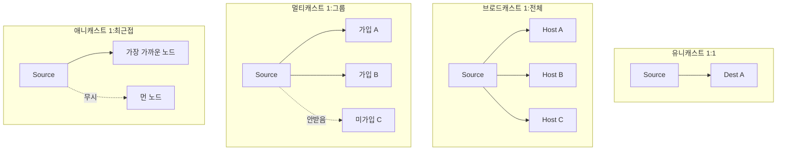
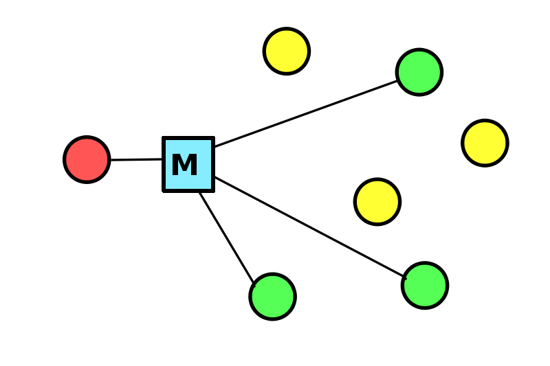
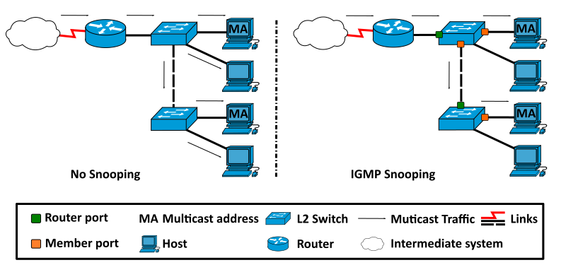
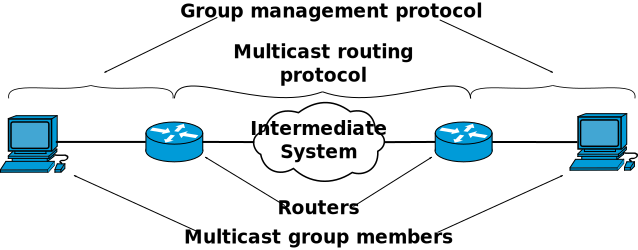
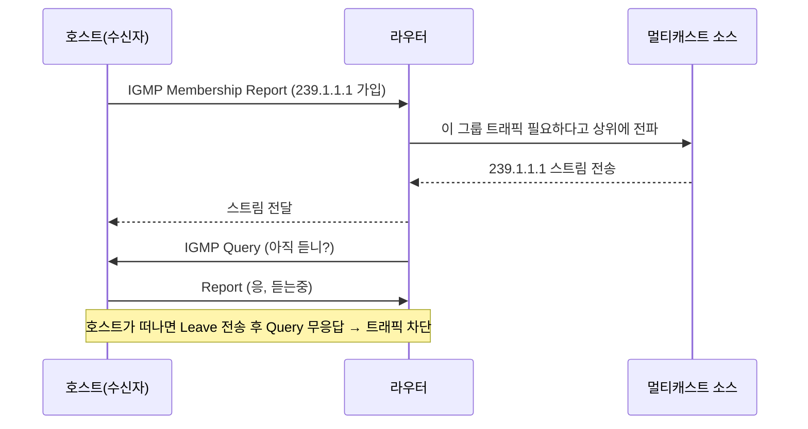
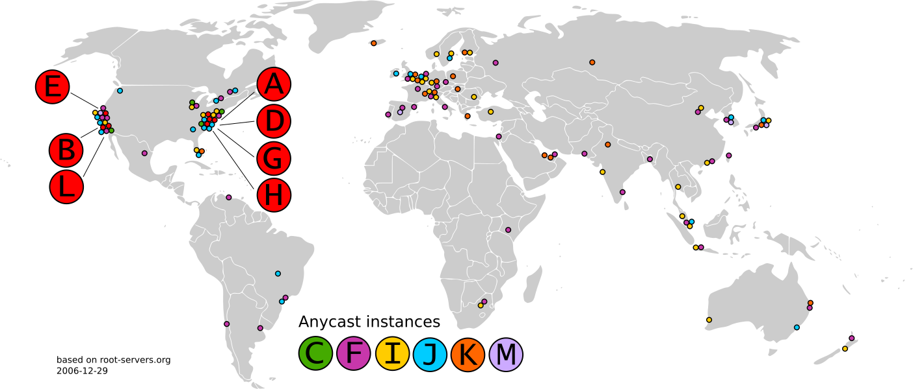
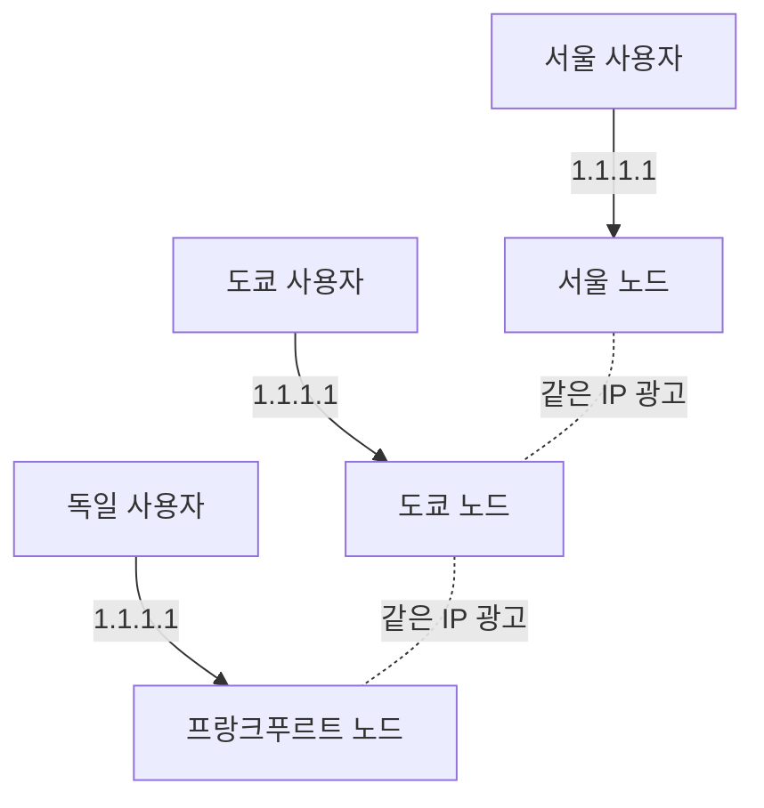

# 멀티캐스트와 애니캐스트 (Multicast & Anycast)

## 들어가며

서버 개발자 입장에서 멀티캐스트와 애니캐스트는 "들어는 봤는데 직접 다룬 적은 없는" 개념에 가깝다. 평소에 짜는 HTTP API, gRPC, DB 커넥션은 전부 유니캐스트라서 굳이 신경 쓸 일이 없다. 그런데 실무에서 의외의 순간에 튀어나온다. 사내에서 IPTV나 화상 회의 인프라를 깔 때 멀티캐스트가 나오고, CDN이나 글로벌 DNS, AWS Global Accelerator의 동작 원리를 따질 때 애니캐스트가 나온다.

이 두 개를 처음 볼 때 헷갈리는 이유는 "하나의 주소로 여러 대상에게 보낸다"는 점이 비슷해 보이기 때문이다. 그런데 실제로는 완전히 다른 동작이다. 멀티캐스트는 한 번 보내서 여러 대가 받는 것이고, 애니캐스트는 여러 대 중 가장 가까운 한 대만 받는 것이다. 이 차이를 정확히 구분하지 못하면 "애니캐스트로 브로드캐스트처럼 전파한다" 같은 잘못된 문장을 쓰게 된다.

먼저 네 가지 전달 방식을 비교한 다음, 각각이 실무에서 어떻게 쓰이는지 본다.

## 네 가지 전달 방식 비교

패킷이 출발지에서 목적지로 갈 때 "몇 명에게, 어떤 식으로 도달하느냐"에 따라 네 가지로 나뉜다.

| 방식 | 수신 대상 | 비유 | 사용 계층 |
|------|-----------|------|-----------|
| 유니캐스트(Unicast) | 정확히 1대 | 1:1 전화 | 일반 TCP/UDP 통신 전부 |
| 브로드캐스트(Broadcast) | 같은 네트워크의 전부 | 동네 확성기 | ARP, DHCP Discover |
| 멀티캐스트(Multicast) | 그룹에 가입한 다수 | 구독한 사람만 받는 방송 | IPTV, 라우팅 프로토콜 |
| 애니캐스트(Anycast) | 여러 대 중 가장 가까운 1대 | 가장 가까운 지점으로 안내 | DNS 루트, CDN, GA |

핵심 구분점은 "받는 쪽 개수"와 "선택 주체"다.

- 브로드캐스트는 네트워크에 있는 전부가 강제로 받는다. 받기 싫어도 NIC가 인터럽트를 걸고 CPU가 패킷을 까본 다음 버린다. 그래서 브로드캐스트가 많으면 모든 호스트의 CPU를 갉아먹는다. 같은 네트워크(L2 브로드캐스트 도메인)를 벗어나지 못한다. 이 부분은 [BroadCast IP주소](IP/BroadCast%20IP주소.md)에 자세히 정리돼 있다.
- 멀티캐스트는 "받겠다고 가입한" 호스트만 받는다. 가입하지 않은 호스트의 NIC는 아예 그 프레임을 거른다. 그래서 1만 명이 IPTV를 봐도 송신은 한 줄기만 나간다.
- 애니캐스트는 여러 대가 같은 IP를 광고하고, 라우터가 그중 "라우팅상 가장 가까운" 한 대로만 패킷을 보낸다. 수신자는 결국 1대다.

IPv4에서 멀티캐스트는 클래스 D 대역인 224.0.0.0 ~ 239.255.255.255를 쓴다. 브로드캐스트와 달리 별도 주소 대역이 통째로 멀티캐스트용으로 예약돼 있다. IPv6는 브로드캐스트 개념 자체를 없애고 멀티캐스트로 대체했다(ff00::/8). 이 부분은 IPv6 문서에서 다룬다.

## 멀티캐스트

### 멀티캐스트 그룹이라는 개념

멀티캐스트의 출발점은 "그룹 주소"다. 송신자는 특정 멀티캐스트 IP(예: 239.1.1.1)로 한 번만 패킷을 쏜다. 이 주소는 어느 물리 호스트의 주소도 아니다. 그냥 "이 채널"을 가리키는 논리적 식별자다.

수신자는 "나는 239.1.1.1 채널을 듣겠다"고 자기 네트워크 장비에 알린다. 이 가입 신호를 받은 라우터와 스위치가 트래픽을 그쪽으로만 흘려보낸다. TV 채널과 똑같다. 방송국은 채널 7번으로 한 번 송출하고, 그 채널을 튼 집만 화면이 나온다.

송신자는 자기 채널에 누가 가입했는지 전혀 모른다. 수신자 목록을 관리하지 않는다. 이게 유니캐스트와 결정적으로 다른 점이다. 유니캐스트로 1만 명에게 영상을 보내려면 서버가 1만 개의 스트림을 각각 만들어 보내야 한다. 멀티캐스트는 서버가 하나만 보내고 복제는 네트워크 장비가 알아서 한다.

### IGMP — 가입과 탈퇴를 처리하는 프로토콜

수신자가 "이 그룹 들을래"라고 신청하는 절차를 처리하는 게 IGMP(Internet Group Management Protocol)다. IPv4에서 호스트와 라우터 사이에서 동작한다. IPv6에서는 같은 역할을 MLD(Multicast Listener Discovery)가 한다.

동작은 두 방향이다.

- 호스트가 그룹에 들어갈 때 IGMP Membership Report를 보낸다("나 239.1.1.1 받을게").
- 라우터는 주기적으로 IGMP Query를 뿌린다("이 그룹 아직 듣는 사람 있어?"). 아무도 응답 안 하면 라우터는 그 그룹 트래픽을 끊는다.

IGMP 버전은 v2가 오래 쓰였고 v3가 표준이다. v3는 "어떤 소스에서 오는 것만 받겠다"는 소스 필터링(SSM, Source-Specific Multicast)을 지원한다. IPTV처럼 송신 서버가 정해진 경우 SSM을 쓰면 엉뚱한 소스가 같은 그룹 주소로 쏘는 트래픽을 거를 수 있다.

### 스위치 레벨의 IGMP Snooping

여기서 실무에서 자주 터지는 함정이 하나 있다. IGMP는 원래 호스트와 L3 라우터 사이의 프로토콜이다. 그런데 그 사이에 있는 L2 스위치는 IGMP를 모른다. 스위치가 멀티캐스트 프레임을 처리하는 기본 동작은 "모르는 목적지니까 모든 포트로 뿌린다(flooding)"이다. 결국 멀티캐스트가 그 세그먼트에서는 브로드캐스트처럼 퍼진다.

가입 안 한 서버까지 IPTV 트래픽이 쏟아져 들어와서 NIC가 패킷을 까보다가 CPU를 먹는 상황이 실제로 생긴다. 이걸 막으려고 스위치에 IGMP Snooping을 켠다. 스위치가 오가는 IGMP 메시지를 엿들어서(snoop) "이 포트 뒤에 있는 호스트가 이 그룹을 들었구나" 하고 기억한 다음, 해당 포트로만 멀티캐스트를 흘려보낸다.

멀티캐스트를 쓰는 환경에서 "특정 서버 CPU가 이유 없이 높다", "관계없는 서버에 모르는 멀티캐스트 트래픽이 들어온다" 같은 증상이 보이면 스위치 IGMP Snooping 설정부터 확인해야 한다.

### 멀티캐스트가 인터넷에서 안 쓰이는 이유

멀티캐스트는 한 통신사 내부망이나 사내망에서는 잘 돈다. 그런데 공용 인터넷 전체로는 거의 안 쓰인다. 이유가 몇 가지 있다.

라우터마다 그룹 멤버십 상태를 들고 있어야 하고, 멀티캐스트 라우팅 프로토콜(PIM 등)이 도메인 경계를 넘어 협의돼야 한다. ISP들이 서로 멀티캐스트를 받아주도록 합의하는 게 정치적으로도 기술적으로도 어렵다. 과금 모델도 애매하다. 그래서 유튜브 라이브나 넷플릭스 같은 인터넷 동영상은 멀티캐스트가 아니라, 뒤에 나올 애니캐스트 기반 CDN과 유니캐스트 스트리밍을 섞어서 푼다.

정리하면 멀티캐스트는 "닫힌 네트워크 안에서 같은 데이터를 여러 명에게 동시 송출"할 때 쓰는 도구다. 통신사 IPTV, 증권사 시세 배포, 사내 화상 시스템 같은 게 전형적인 예다.

## 애니캐스트

### 같은 IP를 여러 곳에서 광고한다

애니캐스트는 발상이 다르다. 멀티캐스트가 "한 번 보내 여러 명이 받는다"라면, 애니캐스트는 "여러 곳에 똑같은 주소를 심어두고, 사용자는 가장 가까운 한 곳에 닿는다"이다.

예를 들어 1.1.1.1이라는 IP를 서울, 도쿄, 프랑크푸르트, 버지니아 데이터센터에 전부 똑같이 띄운다. 각 데이터센터의 라우터는 BGP로 "1.1.1.1로 가는 길은 나한테 있어"라고 인터넷에 광고한다. 서울 사용자가 1.1.1.1로 패킷을 보내면, 그 사용자에게 가장 가까운 경로의 데이터센터(서울)로 라우팅된다. 도쿄 사용자는 도쿄로 간다.

같은 목적지 IP인데도 출발지 위치에 따라 도착하는 물리 서버가 달라진다. 이게 애니캐스트의 전부다. 추가 프로토콜도, 특수 IP 대역도 필요 없다. 평범한 유니캐스트 IP를 그냥 여러 곳에서 동시에 광고하는 것뿐이다. 받는 입장에서는 일반 유니캐스트와 구분이 안 된다.

### BGP가 "가장 가까운"을 결정한다

애니캐스트의 길 찾기는 [BGP](BGP.md)가 담당한다. 여러 데이터센터가 같은 프리픽스(예: 1.1.1.0/24)를 BGP로 광고하면, 인터넷의 각 라우터는 BGP 경로 선택 규칙에 따라 그중 하나를 고른다.

여기서 흔한 오해가 "가장 가까운 = 지리적으로 가까운"이라는 생각이다. 정확히는 BGP가 보는 가까움이다. AS 경로 길이가 짧은 쪽, 로컬 프리퍼런스가 높은 쪽 같은 라우팅 메트릭으로 결정된다. 물리적 거리와 대체로 일치하지만 항상은 아니다. 회선 계약이나 피어링 상태에 따라, 지리적으로는 도쿄가 가까운데 트래픽이 싱가포르로 빠지는 일이 생긴다. 애니캐스트 서비스를 운영하면서 "왜 이 지역 사용자가 엉뚱한 노드로 가지?"를 디버깅할 때는 결국 BGP 광고와 AS 경로를 봐야 한다.

### 애니캐스트가 TCP에서 위험하지 않은 이유

처음 애니캐스트를 접하면 이런 걱정이 든다. "패킷마다 라우팅이 바뀌면, TCP 세션 중간에 다른 노드로 가버려서 연결이 깨지는 거 아닌가?"

이론적으로는 가능하지만 실무에서는 거의 안 생긴다. BGP 경로는 초 단위로 휙휙 바뀌는 게 아니라 보통 수 분에서 수 시간 단위로 안정적이다. 그래서 한 TCP 세션이 사는 동안에는 같은 노드로 계속 간다. 그래도 BGP 경로 수렴(convergence)이 일어나는 순간에는 세션이 다른 노드로 튀어 끊길 수 있다. 그래서 애니캐스트는 원래 UDP 기반이고 요청-응답이 짧은 DNS에 가장 잘 맞았다. DNS 질의는 패킷 한두 개로 끝나서 경로가 바뀌어도 영향이 거의 없다.

요즘은 TCP나 QUIC 기반 애니캐스트도 흔하다. CDN 사업자들은 경로 변동 시 세션이 끊겨도 클라이언트가 재연결하면 되도록 설계하고, 경로를 일부러 안정적으로 유지한다.

### CDN — 애니캐스트의 대표 사용처

CDN의 엣지 노드 분산이 애니캐스트의 가장 큰 무대다. 클라우드플레어가 대표적이다. 전 세계 수백 개 도시에 엣지 서버를 두고 전부 같은 애니캐스트 IP를 광고한다. 사용자는 1.1.1.1이나 특정 CDN IP에 접속하면 자동으로 가장 가까운 엣지로 붙는다. 별도의 지역 판별 로직이 서버 쪽에 없어도 라우팅이 알아서 분산한다.

이 방식의 장점은 DDoS 분산이 공짜로 따라온다는 점이다. 한 IP로 공격이 쏟아져도, 그 트래픽이 전 세계 수백 노드로 자연히 흩어진다. 한 노드가 처리할 양만 받게 되니 한 곳에 부하가 몰리지 않는다. 클라우드플레어 같은 곳이 대규모 DDoS를 버티는 기반이 이 애니캐스트 구조다.

### DNS 루트 서버 — 13개가 사실은 수백 대

DNS 루트 서버가 a부터 m까지 13개라고 알려져 있다. 그런데 실제 물리 서버는 13대가 아니라 전 세계 수천 대다. 각 루트 서버 운영 주체가 자기 IP를 세계 곳곳에서 애니캐스트로 광고하기 때문이다.

예를 들어 k.root-servers.net이라는 하나의 IP를 런던, 도쿄, 상파울루 등 수백 곳에서 동시에 띄운다. 한국 사용자의 DNS 질의는 한국이나 일본 쪽 루트 인스턴스로 가고, 유럽 사용자는 유럽 인스턴스로 간다. 13개라는 숫자는 IP(논리적 식별자) 개수일 뿐 물리 서버 개수가 아니다. 이게 가능한 게 애니캐스트 덕분이다. 루트 서버처럼 전 세계에서 동시에 두드려대는 인프라를 단일 물리 서버로 감당하는 건 애초에 불가능하다.

### AWS Global Accelerator — 클라우드의 애니캐스트

AWS Global Accelerator(GA)는 애니캐스트를 매니지드 서비스로 파는 물건이다. GA를 만들면 고정 애니캐스트 IP 두 개를 준다. 이 IP는 AWS의 전 세계 엣지 로케이션에서 애니캐스트로 광고된다.

사용자가 이 IP로 접속하면 가장 가까운 AWS 엣지로 들어오고, 거기서부터는 공용 인터넷이 아니라 AWS 백본망을 타고 실제 백엔드(특정 리전의 ALB, EC2 등)로 간다. 사용자에서 엣지까지 짧게 끊고, 나머지 먼 거리는 품질 좋은 AWS 내부망으로 옮기는 구조다. 일반 인터넷 경로보다 지연과 패킷 손실이 줄어든다.

여기서 GA와 GSLB/Route 53의 차이를 짚어야 한다. 둘 다 "글로벌하게 가까운 곳으로 보낸다"는 목적은 같은데 동작 계층이 다르다.

- Route 53 지연 기반 라우팅이나 GSLB는 DNS 응답 단계에서 리전마다 다른 IP를 돌려준다. 사용자마다 받는 IP가 다르다. DNS 레벨(L7 가까운 쪽) 분산이다. 이 방식은 [GSLB](../GSLB.md) 문서에서 다룬다.
- GA는 모든 사용자에게 같은 애니캐스트 IP를 주고, 분산은 BGP 라우팅(L3)에서 일어난다.

DNS 기반은 클라이언트가 DNS 캐시를 들고 있으면 장애 전환이 TTL만큼 늦어지는 약점이 있다. 애니캐스트 기반은 IP가 고정이라 클라이언트 입장에서 바뀌는 게 없고, 노드 장애 시 BGP 광고를 빼면 트래픽이 다른 노드로 빠르게 넘어간다. 고정 IP가 필요한 경우(방화벽 화이트리스트, 게임 클라이언트 등)에는 GA처럼 애니캐스트 IP를 주는 방식이 맞다.

## 멀티캐스트 vs 애니캐스트 — 끝으로 정리

이름이 비슷해서 묶이지만 푸는 문제가 다르다.

| 구분 | 멀티캐스트 | 애니캐스트 |
|------|-----------|-----------|
| 받는 대상 | 그룹 가입자 다수 | 가장 가까운 1대 |
| 푸는 문제 | 같은 데이터를 여러 명에게 동시 송출 | 사용자를 가까운 서버로 분산 |
| 주소 | 전용 대역(224.0.0.0/4) | 평범한 유니캐스트 IP |
| 핵심 기술 | IGMP, IGMP Snooping, PIM | BGP 경로 광고 |
| 주 무대 | 닫힌 망(IPTV, 시세, 사내 회의) | 공용 인터넷(CDN, DNS, GA) |
| 인터넷 확장성 | 사실상 안 됨 | 잘 됨 |

서버 개발자가 코드를 짤 때 직접 이 둘을 구현할 일은 드물다. 그래도 "왜 같은 도메인인데 지역마다 다른 데이터센터로 붙지", "왜 CDN IP 하나로 전 세계가 다 가까운 노드를 잡지", "사내 IPTV가 왜 특정 서버 CPU를 잡아먹지" 같은 문제 앞에서 이 구분을 알고 있으면 원인을 한 번에 찍는다. 관련해서 같은 네트워크 안의 전체 전송은 [BroadCast IP주소](IP/BroadCast%20IP주소.md), DNS 기반 글로벌 분산은 [GSLB](../GSLB.md), 애니캐스트 라우팅의 바탕은 [BGP](BGP.md) 문서를 같이 보면 된다.

