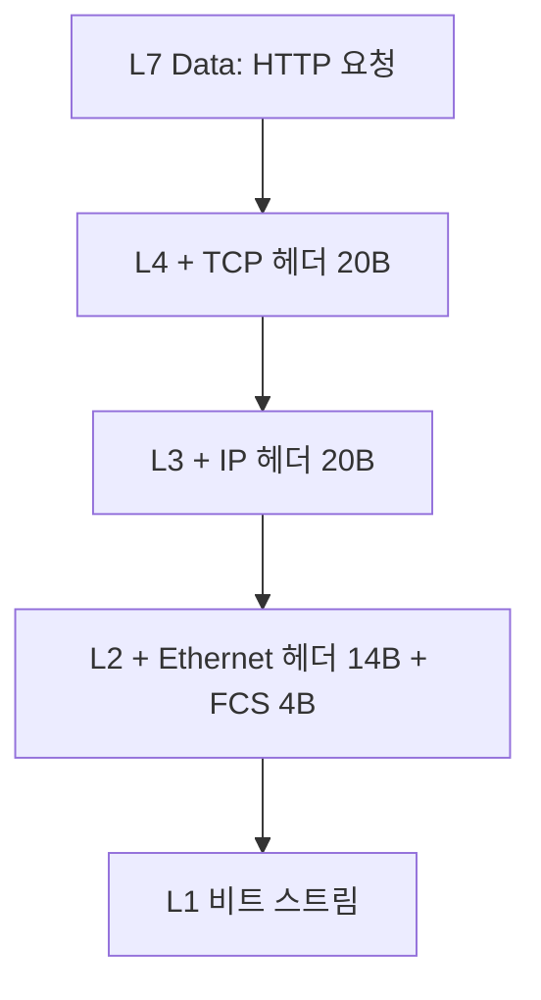

# OSI 7 계층 모델

## 개요

OSI(Open Systems Interconnection) 모델은 ISO가 1984년에 표준화한 통신 시스템 참조 모델이다. ISO/IEC 7498-1로 등록되어 있으며, 서로 다른 벤더의 네트워크 장비와 운영체제가 통신할 수 있도록 통신 과정을 7개 계층으로 추상화했다.

1980년대 초반에는 IBM의 SNA, DEC의 DECnet, Xerox의 XNS처럼 벤더마다 독자 프로토콜을 사용했다. 같은 회사 장비끼리만 통신이 가능했고, 다른 벤더 장비를 도입하면 게이트웨이를 별도로 구축해야 했다. ISO는 이 종속성을 해결하기 위해 OSI 모델을 만들었다. 결과적으로 OSI 프로토콜 스택 자체는 시장에서 외면받았지만, 7개 계층으로 통신을 분해하는 사고방식은 표준이 되었다.

실무에서 OSI 모델을 직접 구현할 일은 없다. 하지만 장애 분석, 보안 정책 설계, 로드밸런서 선택, 방화벽 룰 작성 같은 작업은 전부 "이 문제가 어느 계층에서 발생하느냐"로 귀결된다. 5년차 정도 되면 동료가 "L7 문제야, L4 문제야?"라고 묻는 상황이 매주 발생한다.

---

## 7개 계층 상세

응용 계층부터 물리 계층 순서로 본다. 데이터를 송신할 때는 이 순서대로 내려가면서 헤더가 붙고(캡슐화), 수신할 때는 반대로 올라가면서 헤더가 벗겨진다(디캡슐화).

### L7 - 응용 계층 (Application Layer)

사용자가 직접 사용하는 서비스가 동작하는 계층이다. 브라우저, 메일 클라이언트, SSH 클라이언트가 여기서 동작한다.

- PDU: Data 또는 Message
- 주요 프로토콜: HTTP/HTTPS, FTP, SMTP, IMAP, POP3, DNS, SSH, Telnet, gRPC
- 장비: WAF, API Gateway, L7 로드밸런서, 프록시 서버

실무에서 가장 자주 만지는 계층이다. HTTP 헤더 조작, 인증 토큰 검증, URL 라우팅이 모두 여기서 일어난다.

### L6 - 표현 계층 (Presentation Layer)

데이터의 표현 방식을 다룬다. 인코딩, 암호화, 압축이 이 계층의 책임이다.

- PDU: Data
- 주요 기술: TLS/SSL, JPEG, MPEG, ASCII, EBCDIC, MIME, gzip
- 장비: 거의 없음 (소프트웨어 라이브러리로 구현)

실제 구현에서는 응용 계층과 분리되지 않는 경우가 많다. TLS는 OSI 모델상 표현 계층이지만, 실제로는 TCP 위에 직접 얹는 형태(L4와 L7 사이)로 구현된다. 이런 부분이 "OSI 모델은 이론에 가깝다"는 평가를 받는 이유다.

### L5 - 세션 계층 (Session Layer)

통신하는 양 끝단의 세션을 관리한다. 세션 수립, 유지, 종료, 동기화가 여기서 일어난다.

- PDU: Data
- 주요 프로토콜: NetBIOS, RPC, SMB, SOCKS, PPTP
- 장비: 없음

실무에서 세션 계층은 거의 의식하지 않는다. HTTP 세션이라고 부르는 것도 사실은 응용 계층의 쿠키/토큰으로 구현된 가상 개념이다.

### L4 - 전송 계층 (Transport Layer)

종단 간(end-to-end) 데이터 전송을 책임진다. 포트 번호로 프로세스를 구분하고, 신뢰성과 흐름 제어를 담당한다.

- PDU: Segment (TCP) / Datagram (UDP)
- 주요 프로토콜: TCP, UDP, QUIC, SCTP
- 장비: L4 스위치, L4 로드밸런서, 방화벽

TCP는 3-way handshake로 연결을 수립하고, 시퀀스 번호와 ACK로 신뢰성을 보장한다. UDP는 연결 없이 데이터그램을 던진다. 포트 번호가 0~65535 범위에서 관리되는 것이 이 계층의 특징이다.

### L3 - 네트워크 계층 (Network Layer)

서로 다른 네트워크 간의 경로 결정과 전달을 담당한다. IP 주소가 등장하는 계층이다.

- PDU: Packet
- 주요 프로토콜: IPv4, IPv6, ICMP, IGMP, OSPF, BGP, ARP는 L2/L3 경계
- 장비: 라우터, L3 스위치

라우팅 테이블, 서브넷 마스크, NAT, VPN 터널링이 이 계층의 영역이다. `traceroute`로 추적하는 hop이 L3 라우터들이다.

### L2 - 데이터 링크 계층 (Data Link Layer)

같은 네트워크 세그먼트 안에서의 노드 간 전송을 담당한다. MAC 주소를 사용한다.

- PDU: Frame
- 주요 프로토콜: Ethernet, Wi-Fi(802.11), PPP, HDLC, VLAN(802.1Q), STP
- 장비: 스위치, 브리지, 무선 AP

MAC 주소는 NIC(네트워크 카드)에 하드코딩된 48비트 주소다. 같은 LAN에서는 IP가 아닌 MAC으로 직접 통신한다. ARP는 IP를 MAC으로 변환하는 프로토콜이며, L2와 L3의 경계에 걸쳐 있다.

### L1 - 물리 계층 (Physical Layer)

비트를 전기 신호, 광 신호, 무선 신호로 변환해서 전송 매체로 보낸다.

- PDU: Bit
- 주요 규격: RJ-45, 광섬유, 동축케이블, RS-232, USB, Bluetooth 무선
- 장비: 케이블, 허브, 리피터, 트랜시버

링크 LED가 안 들어오는 문제, 케이블 단선, SFP 모듈 불량 같은 것이 L1 문제다. 데이터센터에서 회선 교체 작업이 L1 작업이다.

---

## 캡슐화와 디캡슐화

송신측은 응용 계층에서 만든 데이터를 아래로 내려보내면서 각 계층의 헤더를 붙인다. 수신측은 반대로 올라가면서 헤더를 벗긴다. 실제 패킷의 바이트 구조를 보면 어느 계층의 헤더가 어디서부터 시작하는지 명확해진다.



HTTP GET 요청을 예시로 보자. `GET / HTTP/1.1\r\nHost: example.com\r\n\r\n`은 약 38바이트의 페이로드다. 여기에 헤더가 차례로 붙는다.

```
[Ethernet 헤더 14B][IP 헤더 20B][TCP 헤더 20B][HTTP 페이로드 38B][FCS 4B]
0                  14            34            54                  92  96바이트
```

각 헤더의 주요 필드를 바이트 단위로 보면 이렇다.

```
Ethernet 헤더 (14 bytes)
  Destination MAC: 6 bytes  (예: 00:1a:2b:3c:4d:5e)
  Source MAC:      6 bytes
  EtherType:       2 bytes  (0x0800 = IPv4, 0x86DD = IPv6, 0x0806 = ARP)

IPv4 헤더 (20 bytes, 옵션 없을 때)
  Version+IHL:     1 byte
  TOS:             1 byte
  Total Length:    2 bytes
  Identification:  2 bytes
  Flags+Fragment:  2 bytes
  TTL:             1 byte
  Protocol:        1 byte   (6=TCP, 17=UDP, 1=ICMP)
  Header Checksum: 2 bytes
  Source IP:       4 bytes
  Destination IP:  4 bytes

TCP 헤더 (20 bytes, 옵션 없을 때)
  Source Port:      2 bytes
  Destination Port: 2 bytes
  Sequence Number:  4 bytes
  ACK Number:       4 bytes
  Data Offset+Flags: 2 bytes (SYN, ACK, FIN, RST 등의 플래그 포함)
  Window Size:      2 bytes
  Checksum:         2 bytes
  Urgent Pointer:   2 bytes
```

수신측 NIC는 와이어에서 비트 스트림을 받아 프레임 단위로 읽고, EtherType이 0x0800이면 IP 모듈에 전달한다. IP 모듈은 Protocol 필드가 6이면 TCP 스택에 넘기고, TCP는 Destination Port를 보고 해당 포트를 listen 중인 프로세스에게 페이로드를 전달한다. 이 흐름을 머릿속에 그리고 있어야 패킷 캡처를 읽을 수 있다.

---

## tcpdump로 각 계층 헤더 분석

운영 서버에서 가장 자주 쓰는 도구가 tcpdump다. 옵션을 어떻게 주느냐에 따라 어느 계층까지 보여줄지 결정된다.

```bash
# L2부터 전부 16진수로 출력 (-e: Ethernet 헤더 포함, -X: hex+ascii)
sudo tcpdump -i eth0 -e -X -c 1 'tcp port 80'

# 출력 예시
10:23:45.123456 00:1a:2b:3c:4d:5e > 00:50:56:c0:00:08, ethertype IPv4 (0x0800), length 74:
192.168.1.10.54321 > 93.184.216.34.80: Flags [S], seq 1234567890, win 64240, length 0
        0x0000:  4500 003c 1c46 4000 4006 b1e6 c0a8 010a  E..<.F@.@.......
        0x0010:  5db8 d822 d431 0050 4996 02d2 0000 0000  ]..".1.PI.......
        0x0020:  a002 faf0 91e0 0000 0204 05b4 0402 080a  ................
```

이 출력을 직접 디코드해보자. `4500 003c`의 첫 바이트 `45`는 IP 버전 4(`4`)와 헤더 길이 5×4=20바이트(`5`)를 의미한다. `4006`의 `06`이 Protocol=6, 즉 TCP라는 뜻이다. `c0a8 010a`는 Source IP 192.168.1.10이다. 16진수 c0=192, a8=168, 01=1, 0a=10.

```bash
# TCP 핸드셰이크만 잡기
sudo tcpdump -i eth0 -nn 'tcp[tcpflags] & (tcp-syn|tcp-ack) != 0'

# DNS 쿼리만
sudo tcpdump -i eth0 -nn 'udp port 53'

# 특정 호스트의 HTTP 요청 페이로드 ASCII로
sudo tcpdump -i eth0 -A -s 0 'tcp port 80 and host example.com'

# pcap 파일로 저장 후 Wireshark로 분석
sudo tcpdump -i eth0 -w capture.pcap 'host 10.0.0.5'
```

Wireshark는 같은 pcap을 GUI로 열어서 계층별로 트리 구조로 보여준다. Frame → Ethernet II → Internet Protocol Version 4 → Transmission Control Protocol → Hypertext Transfer Protocol 식으로 펼쳐진다. 각 노드를 클릭하면 hex dump에서 해당 바이트 범위가 하이라이트된다. 신입에게 OSI 모델을 가르칠 때 이 화면 한 번 보여주는 게 이론 설명 1시간보다 낫다.

---

## Python raw socket으로 패킷 캡처

직접 NIC에서 바이트를 읽어서 헤더를 파싱하는 코드다. Linux에서 root 권한으로 실행해야 한다.

```python
import socket
import struct

# AF_PACKET은 Linux 전용. ETH_P_ALL=0x0003은 모든 EtherType
ETH_P_ALL = 0x0003
sock = socket.socket(socket.AF_PACKET, socket.SOCK_RAW, socket.htons(ETH_P_ALL))

def parse_ethernet(data):
    dest, src, ether_type = struct.unpack('!6s6sH', data[:14])
    return {
        'dest_mac': ':'.join(f'{b:02x}' for b in dest),
        'src_mac': ':'.join(f'{b:02x}' for b in src),
        'ether_type': hex(ether_type),
    }, data[14:]

def parse_ipv4(data):
    version_ihl = data[0]
    ihl = (version_ihl & 0x0F) * 4
    ttl, protocol = data[8], data[9]
    src_ip = socket.inet_ntoa(data[12:16])
    dst_ip = socket.inet_ntoa(data[16:20])
    return {
        'src_ip': src_ip,
        'dst_ip': dst_ip,
        'ttl': ttl,
        'protocol': protocol,  # 6=TCP, 17=UDP, 1=ICMP
    }, data[ihl:]

def parse_tcp(data):
    src_port, dst_port, seq, ack, offset_flags = struct.unpack('!HHIIH', data[:14])
    data_offset = (offset_flags >> 12) * 4
    flags = offset_flags & 0x01FF
    return {
        'src_port': src_port,
        'dst_port': dst_port,
        'seq': seq,
        'ack': ack,
        'flags': {
            'SYN': bool(flags & 0x02),
            'ACK': bool(flags & 0x10),
            'FIN': bool(flags & 0x01),
            'RST': bool(flags & 0x04),
            'PSH': bool(flags & 0x08),
        },
    }, data[data_offset:]

while True:
    raw_data, _ = sock.recvfrom(65535)
    eth, payload = parse_ethernet(raw_data)
    print(f"L2: {eth['src_mac']} -> {eth['dest_mac']} ({eth['ether_type']})")

    if eth['ether_type'] != '0x800':
        continue

    ip, payload = parse_ipv4(payload)
    print(f"L3: {ip['src_ip']} -> {ip['dst_ip']} TTL={ip['ttl']} Proto={ip['protocol']}")

    if ip['protocol'] != 6:
        continue

    tcp, app_data = parse_tcp(payload)
    print(f"L4: :{tcp['src_port']} -> :{tcp['dst_port']} flags={tcp['flags']}")

    if app_data:
        print(f"L7 payload (first 80B): {app_data[:80]}")
    print('-' * 60)
```

이 코드를 한 번 돌려보면 캡슐화 구조가 머릿속에 박힌다. struct.unpack의 포맷 문자열(`!6s6sH`, `!HHIIH`)이 헤더 필드 길이를 그대로 반영한다. 권한이 없으면 `PermissionError: [Errno 1] Operation not permitted`가 나오는데, `setcap cap_net_raw=eip $(which python3)`로 권한을 부여하면 일반 사용자로도 실행할 수 있다.

macOS는 AF_PACKET이 없어서 BPF 디바이스(`/dev/bpf*`)를 직접 열거나 scapy를 써야 한다. 운영 서버는 대부분 Linux라 위 코드가 그대로 동작한다.

---

## OSI 7 계층 vs TCP/IP 4 계층

실무에서 진짜 쓰이는 모델은 TCP/IP 4 계층이다. RFC 1122에서 정의한 인터넷 표준 모델이다. OSI는 너무 이론적이라 실제 구현이 잘 맞지 않는다.

| OSI 7 계층 | TCP/IP 4 계층 | 주요 프로토콜 |
|-----------|--------------|--------------|
| L7 응용 | 응용 (Application) | HTTP, FTP, DNS, SSH |
| L6 표현 | 응용 | TLS, MIME |
| L5 세션 | 응용 | (응용 계층 내부에서 처리) |
| L4 전송 | 전송 (Transport) | TCP, UDP |
| L3 네트워크 | 인터넷 (Internet) | IP, ICMP |
| L2 데이터 링크 | 네트워크 액세스 (Link) | Ethernet, Wi-Fi |
| L1 물리 | 네트워크 액세스 | 케이블, 광섬유 |

TCP/IP가 실무를 지배하게 된 이유는 단순하다. 1) ARPANET에서 실전 검증을 거쳤다. 2) BSD Unix에 socket API로 구현되어 무료로 배포됐다. 3) OSI 표준화 작업이 진행되는 동안 TCP/IP는 이미 동작하고 있었다. 표준을 기다리느니 동작하는 걸 쓰자는 흐름이 됐다.

지금도 면접에서는 OSI 7계층을 묻지만 코드는 TCP/IP로 짠다. 둘 다 알고 있어야 한다.

---

## L4 vs L7 로드밸런서

로드밸런서가 어느 계층에서 동작하느냐는 운영 비용과 기능을 가른다.

L4 로드밸런서는 IP 주소와 포트만 보고 분산한다. 패킷 페이로드를 들여다보지 않는다. TCP 연결을 그대로 백엔드에 전달하거나(DSR), 종단 처리한다.

L7 로드밸런서는 HTTP 헤더, URL, 쿠키, JWT 클레임까지 본다. 그래서 URL 경로 기반 라우팅, 쿠키 기반 sticky session, gRPC 메서드별 분산이 가능하다. 단점은 TLS 종단 처리와 헤더 파싱 비용 때문에 L4보다 처리량이 낮고 지연이 크다는 점이다.

HAProxy로 두 모드를 비교하면 차이가 명확하다.

```haproxy
# L4 모드 (TCP)
frontend mysql_front
    bind *:3306
    mode tcp
    default_backend mysql_back

backend mysql_back
    mode tcp
    balance roundrobin
    server db1 10.0.0.10:3306 check
    server db2 10.0.0.11:3306 check
```

```haproxy
# L7 모드 (HTTP)
frontend api_front
    bind *:443 ssl crt /etc/ssl/api.pem
    mode http
    # URL 경로로 백엔드 분기
    use_backend users_back if { path_beg /api/users }
    use_backend orders_back if { path_beg /api/orders }
    default_backend default_back

backend users_back
    mode http
    balance leastconn
    # 쿠키 기반 sticky session
    cookie SRV insert indirect nocache
    server u1 10.0.1.10:8080 check cookie u1
    server u2 10.0.1.11:8080 check cookie u2
```

nginx도 비슷한 패턴이다.

```nginx
# L7 (http 블록)
upstream api_users {
    least_conn;
    server 10.0.1.10:8080;
    server 10.0.1.11:8080;
}

server {
    listen 443 ssl;
    ssl_certificate /etc/ssl/api.crt;

    location /api/users {
        proxy_pass http://api_users;
        proxy_set_header X-Real-IP $remote_addr;
        proxy_set_header Host $host;
    }
}
```

```nginx
# L4 (stream 블록, nginx 1.9 이상)
stream {
    upstream mysql_cluster {
        server 10.0.0.10:3306;
        server 10.0.0.11:3306;
    }

    server {
        listen 3306;
        proxy_pass mysql_cluster;
    }
}
```

DB나 Redis처럼 텍스트 프로토콜이 아닌 경우는 L4를 쓴다. HTTP API는 L7을 쓴다. gRPC는 HTTP/2 위에서 동작하므로 L7이지만 nginx의 기본 HTTP 프록시가 HTTP/2 백엔드를 잘 처리하지 못해 Envoy를 쓰는 경우가 많다.

---

## 계층별 트러블슈팅 시나리오

장애가 났을 때 가장 먼저 하는 일은 "어느 계층 문제냐"를 좁히는 것이다. 위에서 아래로 내려가는 게 빠를 때도 있고, 아래에서 위로 올라가는 게 빠를 때도 있다.

### L1 - 케이블 단선, SFP 불량

증상: 인터페이스가 down 상태. 핑이 자기 자신만 가고 게이트웨이에 안 간다.

```bash
# 인터페이스 상태 확인
ip link show eth0
# state UP / state DOWN을 확인

# 링크 속도와 협상 상태
ethtool eth0
# Link detected: yes / no가 핵심

# 자기 자신은 가지만 게이트웨이는 안 가는 상황
ping -c 3 127.0.0.1   # OK
ping -c 3 192.168.1.1 # 100% packet loss
```

데이터센터에서는 SFP 광 모듈의 송수신 강도까지 본다. `ethtool -m eth0`로 광 레벨을 확인할 수 있다.

### L2 - ARP 충돌, VLAN 미스매치

증상: 같은 IP가 두 호스트에 있어 통신이 간헐적으로 끊긴다. 또는 다른 VLAN에 있어 같은 서브넷인데도 통신이 안 된다.

```bash
# ARP 테이블 확인
arp -a
ip neigh show

# 비정상 출력 예시: 같은 IP가 두 MAC에 매핑
# 192.168.1.100 dev eth0 lladdr 00:1a:2b:3c:4d:5e REACHABLE
# 192.168.1.100 dev eth0 lladdr 00:50:56:c0:00:08 STALE

# VLAN 태그 확인 (스위치 포트가 VLAN 10에 속하는지)
ip -d link show eth0.10

# 의심되는 호스트의 MAC을 강제로 갱신
sudo arp -d 192.168.1.100
ping 192.168.1.100
arp -a | grep 192.168.1.100
```

### L3 - 라우팅 루프, 잘못된 게이트웨이

증상: 핑은 가는데 응답이 늦거나, traceroute에서 같은 hop이 반복된다.

```bash
# 라우팅 테이블
ip route show
# default via 192.168.1.1 dev eth0 가 있는지

# hop 추적 - 라우팅 루프가 있으면 같은 IP가 반복됨
traceroute -n 8.8.8.8
# 1  192.168.1.1
# 2  10.0.0.1
# 3  10.0.0.5
# 4  10.0.0.1   <-- 루프
# 5  10.0.0.5

# TTL 변화 보기 (루프면 TTL이 0이 되어 ICMP TTL exceeded 반환)
ping -c 1 -t 5 8.8.8.8
```

라우팅 루프는 보통 OSPF/BGP 컨버전스가 안 된 상태에서 발생한다. 임시 조치로 정적 라우트를 추가하기도 한다.

### L4 - 포트 차단, 방화벽 룰

증상: 호스트는 핑이 가는데 특정 포트로 접속이 안 된다.

```bash
# 포트가 listen 중인지
ss -tlnp | grep :8080
netstat -tlnp | grep :8080

# 원격 포트 접속 테스트
nc -zv 10.0.0.5 8080
# Connection to 10.0.0.5 port 8080 [tcp/*] succeeded!  <-- OK
# nc: connect to 10.0.0.5 port 8080 (tcp) failed: Connection refused  <-- 프로세스 down
# nc: connect to 10.0.0.5 port 8080 (tcp) failed: Connection timed out <-- 방화벽

# iptables 룰 확인
sudo iptables -L -n -v --line-numbers
sudo iptables -L INPUT -n -v | grep 8080

# Security Group이나 클라우드 방화벽도 의심
# AWS면 aws ec2 describe-security-groups
```

`Connection refused`와 `Connection timed out`은 원인이 다르다. refused는 호스트에는 도달했는데 그 포트에 listen 중인 프로세스가 없다는 뜻이고, timed out은 방화벽이 SYN을 drop했거나 호스트 자체에 도달하지 못했다는 뜻이다.

### L7 - HTTP 5xx, 인증 실패

증상: 네트워크는 정상인데 응답이 500/502/503/504로 돌아온다.

```bash
# 헤더와 상태 코드 확인
curl -v https://api.example.com/users
# > GET /users HTTP/2
# > Host: api.example.com
# > Authorization: Bearer xxx
# < HTTP/2 502
# < server: nginx
# < x-upstream: backend-3

# 백엔드 응답 시간 측정
curl -w "DNS: %{time_namelookup}s\nConnect: %{time_connect}s\nTLS: %{time_appconnect}s\nTTFB: %{time_starttransfer}s\nTotal: %{time_total}s\n" \
     -o /dev/null -s https://api.example.com/

# nginx upstream 에러 로그
tail -f /var/log/nginx/error.log
# 2026/04/29 10:23:45 [error] upstream timed out (110: Connection timed out)
# while connecting to upstream, client: 1.2.3.4, server: api.example.com,
# request: "GET /users HTTP/2.0", upstream: "http://10.0.1.10:8080/users"
```

502는 업스트림 응답이 잘못된 경우, 504는 업스트림이 타임아웃 안에 응답하지 못한 경우다. 503은 업스트림이 의도적으로 거부한 경우(rate limit, maintenance)가 많다.

---

## 방화벽, IDS, 프록시의 동작 계층

같은 보안 장비라도 어느 계층에서 동작하느냐에 따라 기능과 한계가 결정된다.

| 장비/기능 | 동작 계층 | 판단 기준 |
|----------|----------|----------|
| 패킷 필터 방화벽 | L3-L4 | IP, 포트, 프로토콜 |
| Stateful 방화벽 | L4 | TCP 연결 상태 추적 |
| WAF (Web Application Firewall) | L7 | HTTP 메서드, 헤더, 페이로드 |
| Next-Gen Firewall (NGFW) | L3-L7 | DPI로 응용 식별 |
| 시그니처 IDS (Snort, Suricata) | L3-L7 | 패킷 페이로드 패턴 매칭 |
| 포워드 프록시 (Squid) | L7 | URL, HTTP 헤더 |
| 리버스 프록시 (nginx) | L7 | URL, Host 헤더 |
| SOCKS 프록시 | L5 | 포트와 호스트만 |

L3-L4에서 동작하는 패킷 필터 방화벽은 빠르지만 SQL injection 같은 응용 계층 공격을 막지 못한다. 그래서 L7에서 동작하는 WAF를 같이 쓴다. WAF는 페이로드를 파싱하므로 처리 비용이 크고, 정규식 룰이 잘못 작성되면 정상 트래픽까지 차단한다.

TLS 트래픽은 L7 장비가 페이로드를 못 본다. 그래서 SSL termination(TLS를 풀어서 평문으로 만든 뒤 검사)을 하거나, 해시 기반의 SNI/JA3 핑거프린트로만 판단한다. 이 부분이 보안 정책 설계에서 자주 나오는 트레이드오프다.

---

## MTU, MSS, Fragmentation

L2(Ethernet)의 페이로드 최대 크기가 MTU(Maximum Transmission Unit)다. 표준 Ethernet은 1500바이트다. 점보 프레임을 활성화하면 9000바이트까지 가능하다.

L4(TCP)에서 한 세그먼트에 담을 수 있는 페이로드 최대 크기가 MSS(Maximum Segment Size)다. 기본값은 `MTU - IP헤더(20) - TCP헤더(20) = 1460`바이트다. TCP 핸드셰이크의 SYN 패킷에서 양 끝단이 서로의 MSS를 광고하고 작은 쪽으로 맞춘다.

```bash
# MTU 확인
ip link show eth0 | grep mtu
# mtu 1500

# MTU 변경
sudo ip link set eth0 mtu 9000

# MSS는 tcpdump의 SYN 패킷에서 mss 1460 식으로 표시됨
sudo tcpdump -i eth0 -nn 'tcp[tcpflags] & tcp-syn != 0' -v
```

Fragmentation은 L3(IP) 계층에서 발생한다. IP 패킷이 다음 hop의 MTU보다 크면 라우터가 잘게 쪼갠다. 쪼개진 조각은 수신측 IP 계층에서 재조립한다. TCP는 fragmentation을 피하기 위해 PMTUD(Path MTU Discovery)로 경로 전체의 최소 MTU를 찾는다.

실무에서 자주 만나는 문제는 PMTUD가 깨지는 경우다. ICMP "Fragmentation Needed" 메시지가 방화벽에서 차단되면 송신측은 MTU가 작은 구간이 있다는 사실을 모르고 큰 패킷을 계속 보낸다. 결과적으로 작은 요청은 가는데 큰 응답이 안 오는 증상이 나타난다. 해결책은 MSS clamping이다.

```bash
# 모든 SYN의 MSS를 PMTU에 맞게 강제로 깎음
sudo iptables -t mangle -A FORWARD -p tcp --tcp-flags SYN,RST SYN \
    -j TCPMSS --clamp-mss-to-pmtu
```

VPN 터널에서는 추가 헤더 때문에 실효 MTU가 1500보다 작아진다. IPsec이면 1438 정도, WireGuard면 1420 정도가 보통이다. VPN 도입 후 일부 사이트만 안 열린다는 신고가 들어오면 90% MTU 문제다.

---

## 계층 독립성의 실무적 의미

OSI 모델의 핵심 사상은 각 계층이 독립적이라는 점이다. 한 계층의 구현이 바뀌어도 다른 계층은 영향을 받지 않는다.

구체적인 예시:

L1을 구리선에서 광섬유로 바꿔도 IP나 TCP는 그대로 동작한다. 회선만 교체하면 끝난다.

L2를 Ethernet에서 Wi-Fi로 바꿔도 HTTP 요청은 동일하게 처리된다. 노트북에서 유선/무선 전환 시 IP가 바뀔 뿐 응용은 무관하다.

L3를 IPv4에서 IPv6로 바꿔도 nginx 설정은 `listen 80`만 `listen [::]:80`으로 바꾸면 된다. HTTP 자체는 변경 없다.

L4를 TCP에서 QUIC로 바꿔도 HTTP/3로 동작한다. 응용 코드는 거의 그대로다.

L7만 HTTP에서 gRPC로 바꿔도 IP, TCP, Ethernet은 영향을 받지 않는다.

이 독립성 덕분에 각 팀이 자기 계층에만 집중할 수 있다. 인프라 팀은 L1-L3, 시스템 엔지니어는 L3-L4, 백엔드 개발자는 L7을 본다. 장애가 발생했을 때도 "이건 우리 계층 문제가 아니다"라고 빠르게 판단할 수 있어야 회의가 길어지지 않는다.

다만 추상화는 새는 곳이 있다. TCP 위에서 동작하는 HTTP라도 TCP slow start나 Nagle 알고리즘 때문에 짧은 요청이 느려지는 경우가 있다. TLS는 L6이지만 TCP 위에 직접 얹혀서 계층 경계가 모호하다. QUIC는 UDP 위에서 신뢰성과 흐름 제어를 직접 구현하므로 L4 계층을 응용 계층 라이브러리에서 다시 만든 셈이다. 모델은 모델일 뿐, 실제 구현은 실용성 때문에 종종 경계를 넘는다.

5년 정도 일하다 보면 이 모델을 외우는 게 아니라 패킷 캡처를 보면서 자연스럽게 계층을 분해하게 된다. tcpdump 출력을 보고 "이 SYN이 안 가니까 L4 이하 문제고, ARP 테이블이 정상이니까 L2는 정상이다, 그럼 L3 라우팅이나 방화벽이다"라는 추론이 자동으로 나오면 OSI 모델을 제대로 익힌 것이다.
