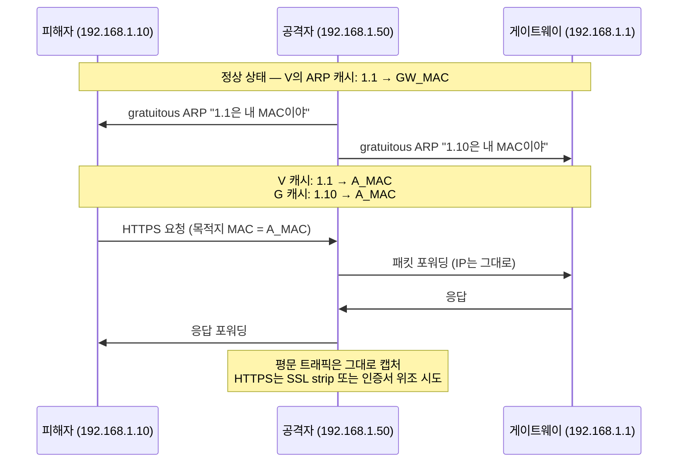

# MAC 주소 (Media Access Control Address)

## 개요

MAC 주소는 네트워크 인터페이스 카드(NIC)에 박혀 있는 48비트 식별자다. OSI 모델로 보면 데이터링크 계층(L2)에서 동작하고, 이더넷 프레임의 출발지·목적지 필드에 들어간다. IP가 "어느 동네"라면 MAC은 그 동네 안에서 "정확히 그 집"을 지목하는 역할이다.

같은 서브넷 안에서 호스트 A가 호스트 B로 패킷을 보내려면 B의 IP만으로는 부족하다. NIC는 이더넷 프레임을 만들어 보내야 하고, 그 프레임에는 B의 MAC이 반드시 들어가야 한다. 그래서 ARP가 IP를 MAC으로 변환해 주고, 이게 캐시되지 않으면 한 줄짜리 통신도 안 된다. 라우터를 넘어가는 순간 목적지 MAC은 다음 홉의 MAC으로 갈아끼워지지만 IP는 끝까지 살아남는다는 점이 핵심이다.

## MAC 주소 구조

48비트를 16진수 12자리로 표기한다. 표기법은 OS마다 약간씩 다르다.

```
콜론:    AA:BB:CC:DD:EE:FF        (Linux, macOS)
하이픈:  AA-BB-CC-DD-EE-FF        (Windows ipconfig)
점:      AABB.CCDD.EEFF           (Cisco IOS)
```

앞 24비트가 OUI(Organizationally Unique Identifier)로 IEEE에서 제조사에 할당한 값이고, 뒤 24비트는 제조사가 자체적으로 채우는 시리얼이다. 예를 들어 `00:50:56`은 VMware, `00:1A:11`은 Google이다. OUI를 보면 어느 회사 칩인지 대충 짐작할 수 있어서 트러블슈팅할 때 의외로 자주 쓴다.

### I/G 비트와 U/L 비트

첫 바이트의 하위 2비트가 의미를 갖는다. 이 두 비트는 MAC 주소를 해석하는 방식을 바꾸기 때문에 알고 있으면 좋다.

| 위치 | 이름 | 0일 때 | 1일 때 |
|------|------|--------|--------|
| 첫 바이트 bit 0 | I/G (Individual/Group) | 유니캐스트 | 멀티캐스트/브로드캐스트 |
| 첫 바이트 bit 1 | U/L (Universal/Local) | UAA (전역 고유) | LAA (로컬 관리) |

`02:00:00:00:00:01` 같은 주소를 보면 첫 바이트가 `0x02`로 U/L 비트가 1이다. 이건 운영자가 임의로 설정한 LAA(Locally Administered Address)라는 뜻이다. 반대로 NIC에 굽혀 나오는 주소는 거의 대부분 UAA(Universally Administered Address)로, IEEE OUI 기반이다.

가상화 환경에서 자동 생성되는 MAC이 보통 `02:` 또는 `06:`로 시작하는 이유가 이 U/L 비트 때문이다. KVM의 기본 MAC 생성기, Docker 브리지의 `52:54:00:` 또는 `02:42:` 같은 prefix가 다 LAA다.

### 유니캐스트 / 멀티캐스트 / 브로드캐스트

I/G 비트로 결정된다.

- **유니캐스트**: I/G = 0. 한 NIC를 지목한다. 첫 바이트가 짝수면 유니캐스트라고 보면 된다.
- **멀티캐스트**: I/G = 1. 그룹에 속한 NIC들이 받는다. IPv4 멀티캐스트(`224.0.0.0/4`)는 `01:00:5E:`로 시작하는 MAC에 매핑되고, IPv6 멀티캐스트는 `33:33:`로 시작한다. STP BPDU는 `01:80:C2:00:00:00`을 쓴다.
- **브로드캐스트**: 모든 비트가 1, 즉 `FF:FF:FF:FF:FF:FF`. ARP 요청, DHCP DISCOVER가 대표적이다. 같은 브로드캐스트 도메인 안의 모든 NIC가 받아서 처리한다.

브로드캐스트 도메인이 너무 크면 ARP 한 번에 수백 대가 인터럽트를 받기 때문에 VLAN으로 잘라야 한다는 게 여기서 나오는 얘기다.

## 스위치 CAM 테이블 동작

L2 스위치는 MAC 주소 테이블(벤더에 따라 CAM 테이블이라고 부른다)에 "어느 포트 뒤에 어느 MAC이 붙어 있는지"를 학습해서 저장한다. 동작은 단순하다.

1. 프레임이 들어오면 출발지 MAC과 들어온 포트를 묶어서 테이블에 기록한다.
2. 목적지 MAC이 테이블에 있으면 그 포트로만 보낸다 (forwarding).
3. 목적지 MAC이 테이블에 없거나 브로드캐스트면 들어온 포트를 제외한 모든 포트로 뿌린다 (flooding).
4. 일정 시간(보통 300초) 동안 해당 MAC에서 프레임이 안 오면 항목을 지운다 (aging).

이 단순한 학습 메커니즘이 보안 취약점이 된다. CAM 테이블은 ASIC 메모리라서 용량이 정해져 있다 — Cisco 2960이 8K~16K 엔트리 정도다.

### MAC Flooding 공격

공격자가 출발지 MAC을 무작위로 바꿔가며 프레임을 쏟아내면 CAM 테이블이 위조 엔트리로 가득 찬다. 정상 호스트의 MAC을 학습할 자리가 없으니 스위치는 fail-open 모드로 빠져, 모든 프레임을 모든 포트로 flooding하기 시작한다. 결국 스위치가 허브처럼 동작하고, 같은 VLAN 안의 모든 트래픽을 공격자가 sniffing할 수 있게 된다.

`macof` 같은 도구가 초당 수만 개의 가짜 프레임을 만들어내는 게 이 시나리오다. 방어는 포트 보안(port-security)으로 한다.

```
! Cisco IOS 예시 — 포트당 학습 가능한 MAC을 2개로 제한
interface GigabitEthernet0/1
 switchport mode access
 switchport port-security
 switchport port-security maximum 2
 switchport port-security violation restrict
 switchport port-security mac-address sticky
```

`violation restrict`는 위반 시 프레임을 drop하고 SNMP trap을 쏘고, `shutdown`은 포트 자체를 err-disable로 내린다. 운영 환경에서는 보통 `restrict`로 두고 모니터링한다 — `shutdown`으로 두면 단말 한 대 잘못 꽂혔다고 포트가 죽어서 새벽에 전화 받게 된다.

## ARP Spoofing과 중간자 공격

ARP는 인증이 없다. "192.168.1.1의 MAC이 뭐냐"고 브로드캐스트로 물어보면 누가 답해도 그냥 믿는다. 심지어 묻지도 않았는데 "192.168.1.1은 내 MAC이야"라고 보내는 gratuitous ARP도 받아서 캐시에 넣는다. 이게 ARP Spoofing의 출발점이다.

전형적인 중간자(MITM) 공격 흐름은 이렇다.



공격자는 양방향 ARP 캐시를 오염시킨 뒤 IP forwarding을 켜서 트래픽을 그대로 통과시킨다. 피해자는 패킷이 평소대로 흘러가니까 눈치채기 어렵다. 평문 프로토콜(HTTP, FTP, Telnet)은 그대로 노출되고, HTTPS도 sslstrip이나 위조 인증서 같은 추가 공격 벡터가 따라붙는다.

탐지는 ARP 테이블에서 동일 MAC이 여러 IP에 매핑되어 있는지 보면 된다.

```bash
# 동일 MAC이 여러 IP에 잡혀 있으면 의심
arp -a | awk '{print $2, $4}' | sort -k2 | uniq -f1 -d

# arpwatch 같은 데몬으로 MAC 변경 알림 받기
sudo apt install arpwatch
sudo arpwatch -i eth0
```

방어는 게이트웨이를 정적 ARP로 못 박거나, 스위치 단에서 Dynamic ARP Inspection(DAI)을 켜는 것이다. DAI는 DHCP Snooping 바인딩 테이블을 기준으로 ARP 응답이 진짜인지 검증한다.

## MAC Randomization

iOS 14 이후, Android 10 이후, Windows 10 이후 OS들은 Wi-Fi에 연결할 때 SSID마다 랜덤 MAC을 만들어서 쓴다. 개인정보 보호 목적이다 — 같은 노트북이 카페·공항·집에서 다른 MAC으로 보이니까 트래킹이 어려워진다.

문제는 이게 기존 운영 관행을 무력화시킨다는 거다.

- **MAC 필터링**: 회사 Wi-Fi에 직원 단말 MAC을 등록해 두는 방식이 더 이상 안 먹는다. 직원이 OS를 업데이트하거나 SSID를 잊었다 다시 붙이면 새 MAC으로 보인다.
- **DHCP 고정 IP 예약**: `mac-address` 기반 reservation이 깨진다. 매번 새 IP를 받으니 내부 DNS·접근제어 정책이 흔들린다.
- **NAC/802.1X**: MAC 기반 인증(MAB)이 무용지물이다. 인증서 기반 또는 사용자 자격증명 기반으로 가야 한다.

iOS는 설정에서 SSID별로 "프라이빗 Wi-Fi 주소" 토글이 있고, Android는 "랜덤 MAC 사용 안 함"으로 바꿀 수 있다. 회사 SSID 가이드 문서에 이 토글을 끄는 절차를 넣어 두지 않으면 헬프데스크 티켓이 끝없이 들어온다. 더 깔끔한 해결은 EAP-TLS 기반 802.1X로 넘어가는 거다.

## VLAN 환경에서의 MAC 학습

스위치 CAM 테이블은 단순히 `MAC → 포트`가 아니라 `(VLAN, MAC) → 포트`로 학습한다. 같은 MAC이 VLAN 10과 VLAN 20에 동시에 존재해도 별개 엔트리로 관리한다 — 가상화 환경에서 같은 MAC의 VM이 여러 VLAN에 떠 있을 때 이 동작 덕에 충돌 없이 돌아간다.

802.1Q 트렁크 포트로 들어온 프레임은 4바이트 태그(TPID `0x8100` + VLAN ID 12비트 + PCP 3비트 + DEI 1비트)가 붙어 있다. 스위치는 이 태그의 VLAN ID를 봐서 어느 VLAN의 CAM 테이블에 학습할지 결정한다. 액세스 포트로 들어오는 프레임은 태그가 없으니 포트 설정에 박힌 VLAN ID를 그대로 쓴다.

native VLAN 설정은 자주 사고 나는 부분이다. 트렁크의 native VLAN으로 들어오는 프레임은 태그가 안 붙는다. 양쪽 스위치의 native VLAN이 다르면 VLAN hopping 취약점이 되고, 정상 트래픽도 엉뚱한 VLAN에 학습된다. 트렁크 양단의 native VLAN은 반드시 일치시켜야 하고, 가급적 사용하지 않는 VLAN ID(예: 999)로 박아두는 게 안전하다.

## Wake-on-LAN과 매직 패킷

전원이 꺼진 상태(정확히는 ATX의 5V standby 상태)에서도 NIC는 살아있다. 그래서 특정 패턴의 프레임이 들어오면 메인보드를 깨운다 — 이게 Wake-on-LAN(WoL)이다.

매직 패킷의 페이로드 구조는 명확하다.

```
6바이트 0xFF (= FF FF FF FF FF FF)
+ 대상 MAC을 16번 반복 (6 × 16 = 96바이트)
= 102바이트 페이로드
```

보통 UDP 9번 포트로 브로드캐스트(`255.255.255.255`)나 디렉티드 브로드캐스트(`192.168.1.255`)로 쏜다. L3를 넘어가야 하는 경우 라우터에서 디렉티드 브로드캐스트를 허용해야 하는데, 이건 smurf 공격 벡터라서 기본적으로 막혀 있다. VPN이나 별도 WoL 프록시 서버를 두는 게 일반적이다.

```python
import socket

def wol(mac: str, broadcast: str = "192.168.1.255"):
    mac_bytes = bytes.fromhex(mac.replace(":", "").replace("-", ""))
    packet = b"\xff" * 6 + mac_bytes * 16
    with socket.socket(socket.AF_INET, socket.SOCK_DGRAM) as s:
        s.setsockopt(socket.SOL_SOCKET, socket.SO_BROADCAST, 1)
        s.sendto(packet, (broadcast, 9))

wol("AA:BB:CC:DD:EE:FF")
```

WoL이 안 깨어날 때 의심할 곳은 BIOS의 "Wake on LAN" 옵션, NIC 드라이버의 "Magic Packet으로만 깨우기" 설정, 그리고 Windows의 빠른 시작(Fast Startup) 기능이다. 빠른 시작이 켜져 있으면 hibernate 상태로 들어가서 NIC가 매직 패킷을 못 받는 경우가 있다.

## 가상화 환경의 MAC 할당

하이퍼바이저는 자체 OUI를 갖고 있어서 가상 NIC에 MAC을 자동 부여한다.

| 플랫폼 | OUI | 비고 |
|--------|-----|------|
| VMware ESXi (자동) | `00:50:56` | vCenter 관리 범위는 `00:50:56:00:00:00 ~ 00:50:56:3F:FF:FF` |
| VMware Workstation | `00:0C:29` | 호스트 단위 자동 |
| VirtualBox | `08:00:27` | |
| Hyper-V | `00:15:5D` | 호스트 MAC의 일부를 차용 |
| Xen / XCP-ng | `00:16:3E` | |
| KVM/libvirt | `52:54:00` | QEMU 기본 |
| Docker bridge | `02:42:AC:11:xx:xx` | 컨테이너 IP의 옥텟이 일부 반영 |
| Parallels | `00:1C:42` | |

이 prefix를 외워둘 필요는 없지만, 이상한 MAC이 ARP 테이블에 보일 때 OUI만 봐도 출처를 짐작할 수 있다. 예를 들어 운영망에서 `00:50:56`이 잡히면 어딘가에 신고 안 된 ESXi가 있는 거고, `02:42:`가 외부 네트워크로 빠져나가면 컨테이너의 NAT 설정이 잘못된 거다.

### 자주 만나는 충돌 사례

VMware에서 VM을 클론할 때 "Keep" 옵션을 잘못 골라 두 VM이 같은 MAC을 갖는 경우가 있다. 같은 포트그룹에 두 VM이 떠 있으면 스위치 CAM이 두 포트 사이에서 같은 MAC을 왔다 갔다 학습하면서 (`%MAC_FLAP`) 통신이 끊겼다 붙었다 한다. 해결은 한 쪽 VM의 vNIC에서 "Generate"를 다시 눌러 새 MAC을 받는 것이다.

KVM에서는 `virsh edit` 후 MAC을 수동으로 지정할 때 U/L 비트를 안 맞춰서 NIC가 안 올라오는 경우가 있다. `52:54:00:` 같은 LAA prefix를 쓰거나, 임의로 정할 때 첫 바이트를 짝수로 두고 U/L 비트를 1로 세팅하는 게 안전하다.

Docker에서 `--mac-address` 옵션으로 고정 MAC을 줬는데 이게 호스트 NIC의 MAC과 같은 OUI 영역에 부딪히면 일부 스위치의 storm-control이 발동해 컨테이너 트래픽이 drop되는 경우도 본 적 있다.

## ARP·MAC 트러블슈팅 사례

### 사례 1 — 동일 IP에 두 MAC이 잡히는 ARP 충돌

증상: `192.168.10.50`이 5분에 한 번씩 ping이 끊긴다. `arp -a`로 보면 시간에 따라 MAC이 두 개 사이를 왔다 갔다 한다.

원인 추적 순서.

```bash
# 1. 어느 두 MAC이 충돌하는지 확인
ip neighbor show | grep 192.168.10.50
# 192.168.10.50 dev eth0 lladdr 00:1a:2b:3c:4d:5e REACHABLE
# (5분 후)
# 192.168.10.50 dev eth0 lladdr aa:bb:cc:dd:ee:ff REACHABLE

# 2. 두 MAC의 OUI 조회
# 00:1a:2b → 정상 서버 NIC 제조사
# aa:bb:cc → ??? — 위조이거나 잘못 설정된 다른 장비

# 3. 스위치에서 두 MAC이 어느 포트에 학습되었는지 확인
# (Cisco) show mac address-table address 0050.5601.xxxx
# (Arista) show mac address-table | include xxxx

# 4. dmesg에서 IP 충돌 로그 확인
dmesg | grep -i "duplicate"
# IPv4: 192.168.10.50 has duplicate IP address with 00:1a:2b:3c:4d:5e and aa:bb:cc:dd:ee:ff
```

흔한 원인은 (a) 누군가 같은 정적 IP를 다른 장비에 박았거나, (b) DHCP 서버 두 대가 다른 풀로 같은 IP를 발급하거나, (c) HSRP/VRRP 가상 IP 설정 오류, (d) ARP Spoofing 공격이다. 스위치 CAM 테이블에서 두 MAC이 다른 포트에 잡혀 있다면 물리적으로 두 장비가 존재한다는 뜻이고, 같은 포트에 두 MAC이 잡혀 있다면 한 호스트가 IP를 두 번 들고 있거나 가상화 환경에서 vNIC 충돌이다.

### 사례 2 — 스위치 포트별 MAC 학습 개수 제한

증상: 한 액세스 포트에 책상마다 작은 미니 스위치를 달아놓는 사용자가 늘어나면서, 한 포트 뒤에 PC·IP폰·프린터·노트북 4~5개가 붙어 있다. 보안팀이 "포트당 단말 1대 원칙"을 요구한다.

설정.

```
interface GigabitEthernet0/24
 switchport mode access
 switchport access vlan 30
 switchport port-security
 switchport port-security maximum 1
 switchport port-security aging time 10
 switchport port-security aging type inactivity
 switchport port-security violation restrict
 switchport port-security mac-address sticky
```

`maximum 1`로 잡으면 첫 번째 학습된 MAC만 통과시키고 두 번째 MAC이 등장하면 위반으로 처리한다. `aging type inactivity`는 10분 동안 통신이 없으면 sticky 엔트리를 비워서, 자리 이동이 잦은 환경에서 운영 부담을 줄여준다.

IP폰 + PC가 한 포트에 붙는 정상 케이스에서는 voice VLAN을 별도로 학습하므로 `maximum 2`로 둔다. 이때도 voice VLAN과 access VLAN의 MAC이 각각 1개씩 잡혀야 정상이고, 두 MAC이 같은 VLAN에 잡히면 미니스위치가 끼어 있다는 신호다.

위반이 발생하면 `show port-security interface Gi0/24`로 last violation의 MAC을 확인하고, OUI로 어떤 장비인지 판단한 뒤 사용자에게 회수 요청을 보낸다. `shutdown` 모드로 두면 자동으로 포트가 죽어버려 헬프데스크에 부담이 가지만, `restrict`는 로깅만 하므로 보안팀 분석에 시간을 벌어준다.

### 사례 3 — 클라우드 환경에서 MAC이 자꾸 바뀐다

AWS EC2 인스턴스를 stop/start 하면 ENI의 MAC은 유지된다. 하지만 EBS 스냅샷에서 새 인스턴스를 띄우면 새 MAC을 받고, 기존에 NIC MAC 기반으로 라이선스를 거는 소프트웨어(예: 일부 상용 DBMS, 게임 클라이언트)가 깨진다.

해결은 ENI를 별도 리소스로 만들어두고 인스턴스에 attach·detach만 하는 것이다. ENI 자체를 유지하면 MAC도 유지된다. Terraform으로 작업할 때 `aws_network_interface`를 별도 리소스로 분리하고 `aws_instance`의 `network_interface` 블록에서 attach만 하면 된다.

## 관련 프로토콜 정리

ARP는 같은 서브넷 안에서 IP를 MAC으로 바꿔주는 프로토콜이고, RARP(거의 안 씀)와 IPv6의 NDP(Neighbor Discovery Protocol)가 비슷한 역할을 한다. NDP는 ICMPv6 위에서 동작하고 인증 옵션(SEND, RFC 3971)이 있어서 ARP보다 보안적으로는 낫지만 실제 배포는 드물다.

DHCP는 클라이언트 식별자로 MAC을 쓴다. `chaddr` 필드에 들어간 MAC을 보고 reservation을 매칭하는데, 앞서 말한 MAC Randomization 때문에 이 매칭이 깨지고 있는 게 요즘 트렌드다. DHCPv6는 DUID(DHCP Unique Identifier)라는 별도 식별자를 쓰므로 영향이 다르다.

802.1X(NAC)에서는 MAC을 username처럼 쓰는 MAB(MAC Authentication Bypass)이 있는데, 이건 EAP를 지원하지 않는 프린터·IP카메라 같은 레거시 단말을 위한 폴백이다. 보안적으로는 약하므로 가능하면 인증서 기반 EAP-TLS로 가야 한다.

## 인터페이스에서 MAC 다루기

```bash
# Linux — 임시 MAC 변경 (재부팅 시 원복)
sudo ip link set dev eth0 down
sudo ip link set dev eth0 address 02:11:22:33:44:55
sudo ip link set dev eth0 up

# macOS — 동일 (단, en0 Wi-Fi는 SIP 영향 받을 수 있음)
sudo ifconfig en0 ether 02:11:22:33:44:55

# Windows — 레지스트리 또는 NIC 속성에서
# HKLM\SYSTEM\CurrentControlSet\Control\Class\{4d36e972-...}\xxxx
# NetworkAddress 값에 MAC 입력 후 NIC 비활성화→활성화
```

LAA로 바꿀 때는 첫 바이트의 U/L 비트를 1로 세팅하는 게 관례다 (`02:`, `06:`, `0A:`, `0E:` 같은 prefix). 안 그러면 다른 제조사 OUI를 흉내내는 셈이라 추적당할 때 책임 소재가 모호해진다.

```javascript
// Node.js에서 NIC 정보 조회
const os = require('os');

for (const [name, addrs] of Object.entries(os.networkInterfaces())) {
    for (const addr of addrs) {
        if (addr.internal || addr.family !== 'IPv4') continue;
        console.log(`${name.padEnd(8)} ${addr.mac}  ${addr.address}`);
    }
}
// en0      aa:bb:cc:dd:ee:ff  192.168.1.100
// utun0    00:00:00:00:00:00  10.0.0.5
```

`utun`이나 `tun0` 같은 가상 인터페이스는 MAC이 `00:00:00:00:00:00`으로 나오는 경우가 많다. 이건 L3 터널이라 L2 헤더가 없기 때문이지 버그가 아니다. 코드에서 MAC이 0인 인터페이스를 분기 처리하지 않으면 종종 NullPointerException 같은 류의 사고가 난다.

## 보안적 관점 정리

MAC은 hop 단위 식별자이므로 패킷이 라우터를 넘어가는 순간 의미가 없어진다. 따라서 인터넷 너머의 출처 추적이나 식별에는 못 쓴다. 동시에 같은 L2 도메인 안에서는 위조가 너무 쉽다 — 누구나 인터페이스 MAC을 한 줄로 바꿀 수 있다. 그래서 MAC 기반 보안은 본질적으로 약한 수준의 통제이고, 802.1X·인증서·세션 기반 인증의 보조 수단으로만 봐야 한다.

운영 관점에서 MAC은 자산 관리·트러블슈팅·VLAN 분리·CAM 가시성 같은 곳에서 일상적으로 쓰이는 식별자다. 이 도구를 잘 다루려면 OUI 해석, CAM 테이블 동작, ARP 흐름 세 가지를 손에 익혀두는 것으로 충분하다.
