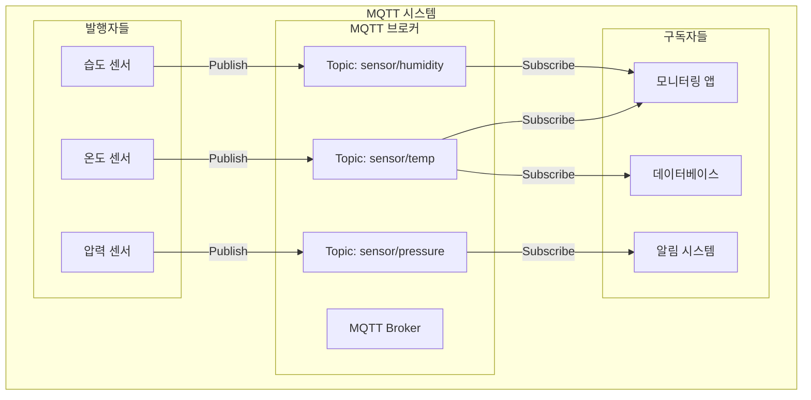
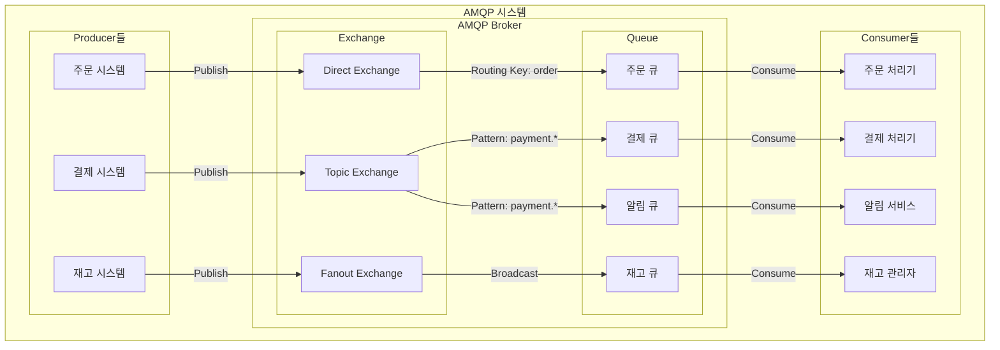
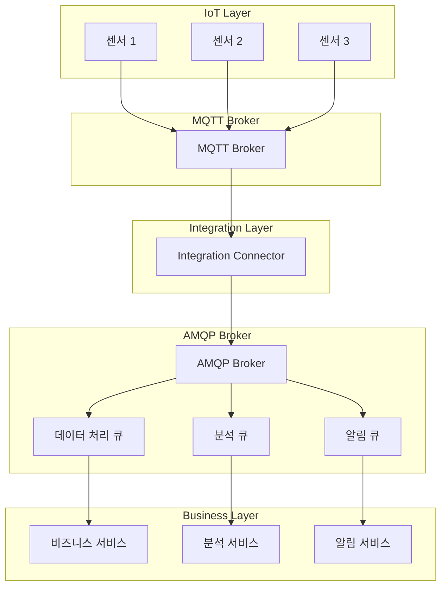

# AMQP vs MQTT 비교 분석

## 📋 목차
- [기본 개념 이해](#-기본-개념-이해)
- [MQTT 상세 분석](#-mqtt-상세-분석)
- [AMQP 상세 분석](#-amqp-상세-분석)
- [아키텍처 비교](#-아키텍처-비교)
- [성능 및 특성 비교](#-성능-및-특성-비교)
- [실제 구현 예시](#-실제-구현-예시)
- [사용 사례별 선택](#-사용-사례별-선택)
- [통합 시나리오](#-통합-시나리오)
- [트러블슈팅](#-트러블슈팅)
- [미래 전망](#-미래-전망)

---

## 🎯 기본 개념 이해

### 📮 메시지 브로커 시스템이란?

**메시지 브로커**는 분산 시스템에서 **중앙 집중식 메시지 허브** 역할을 하는 소프트웨어입니다.

#### 🔄 메시지 브로커의 핵심 역할

메시지 브로커는 단순히 메시지를 전달하는 것 이상의 역할을 합니다:

**1. 메시지 중계 (Message Relay)**
- 발신자와 수신자 사이에서 메시지를 받아 전달하는 중간 계층 역할
- 직접 통신이 아닌 간접 통신으로 시스템 간 결합도를 낮춤
- 예: A 서비스가 B 서비스의 IP나 포트를 몰라도 브로커를 통해 통신 가능

**2. 비동기 통신 (Asynchronous Communication)**
- **동기 방식의 문제점**: 요청한 쪽이 응답을 받을 때까지 대기(blocking)해야 함
- **비동기 방식의 장점**: 메시지를 보내고 즉시 다른 작업 수행 가능
- 발신자와 수신자가 동시에 온라인 상태일 필요가 없음
- 예: 주문 시스템이 결제 시스템의 응답을 기다리지 않고 다음 주문을 받을 수 있음

**3. 메시지 버퍼링 (Message Buffering)**
- 수신자가 처리할 수 있는 속도보다 빠르게 메시지가 들어올 때 임시 저장
- **백프레셔(Backpressure) 해결**: 시스템 과부하 방지
- **메시지 손실 방지**: 네트워크 장애나 수신자 장애 시에도 메시지 보존
- 예: 1초에 1000개의 주문이 들어와도 처리 시스템이 초당 100개씩만 처리 가능한 경우, 나머지 900개를 버퍼에 저장

**4. 라우팅 (Routing)**
- 메시지의 목적지를 결정하고 적절한 수신자에게 전달
- 단순한 1:1 전달부터 복잡한 조건부 라우팅까지 지원
- 하나의 메시지를 여러 수신자에게 동시 전달 가능 (멀티캐스트)
- 예: "주문 생성" 메시지를 재고 시스템, 결제 시스템, 배송 시스템에 동시 전달

#### 🏠 우체국으로 이해하는 메시지 브로커

메시지 브로커를 우체국에 비유하면 이해가 쉽습니다:

**전통적인 직접 통신 (Without Broker)**
```
A가 B의 집 주소를 알고 있어야 함 → A가 직접 B의 집에 방문 → B가 집에 없으면 실패
```

**메시지 브로커를 통한 통신 (With Broker)**
```
A가 우체국에 편지를 맡김 → 우체국이 편지를 보관 → B가 편지함을 확인할 때 전달
```

이 방식의 장점:
- **발신자**: 편지를 보내는 사람 (Publisher/Producer)
  - 수신자의 정확한 주소나 상태를 몰라도 됨
  - 우체국에 맡기면 자신의 일은 끝
  
- **우체국**: 편지를 중계하는 곳 (Message Broker)
  - 편지를 안전하게 보관
  - 올바른 주소로 배달
  - 수취인이 부재중이면 보관 후 재배달
  
- **수신자**: 편지를 받는 사람 (Subscriber/Consumer)
  - 자신이 원하는 시간에 편지 수령
  - 발신자가 누구인지 몰라도 됨
  
- **주소**: 편지의 목적지 (Topic/Routing Key)
  - 어떤 종류의 편지인지 분류
  - 같은 주소의 편지를 구독하는 모든 사람에게 배달 가능

#### 🎭 디커플링(Decoupling)의 중요성

메시지 브로커가 제공하는 가장 큰 가치는 **디커플링**입니다:

**1. 시간적 디커플링 (Temporal Decoupling)**
- 발신자와 수신자가 같은 시간에 동작할 필요 없음
- 수신자가 오프라인이어도 메시지 전송 가능
- 나중에 수신자가 온라인 상태가 되면 메시지 수신

**2. 공간적 디커플링 (Spatial Decoupling)**
- 발신자가 수신자의 위치(IP, 포트)를 알 필요 없음
- 수신자의 개수를 발신자가 알 필요 없음
- 수신자를 추가하거나 제거해도 발신자 코드 변경 불필요

**3. 동기화 디커플링 (Synchronization Decoupling)**
- 발신자가 수신자의 응답을 기다리지 않음
- 발신자는 메시지를 보내고 즉시 다른 작업 수행 가능
- 시스템 전체의 처리량(throughput) 향상

### 📦 메시지 큐잉의 핵심 개념

#### 1. **비동기 통신 (Asynchronous Communication)**

**동기 통신의 작동 방식**
```
클라이언트 → 요청 전송 → [대기...] → 서버 처리 → 응답 수신 → 다음 작업
```
- 전화 통화와 같음: 상대방이 받을 때까지 기다려야 함
- **문제점**:
  - 응답이 올 때까지 다른 작업을 할 수 없음 (blocking)
  - 서버가 느리면 클라이언트도 느려짐
  - 서버가 다운되면 클라이언트도 멈춤
  - 동시에 많은 요청을 처리하기 어려움

**비동기 통신의 작동 방식**
```
클라이언트 → 메시지 전송 → 즉시 다음 작업 → ... → (나중에) 응답 처리
```
- 이메일과 같음: 보내고 바로 다른 일을 할 수 있음
- **장점**:
  - 메시지를 보낸 후 즉시 다른 작업 가능 (non-blocking)
  - 서버의 처리 속도와 무관하게 동작
  - 서버가 일시적으로 다운되어도 메시지는 브로커에 보관
  - 대량의 요청을 순차적으로 처리 가능

**실제 예시: 주문 처리 시스템**
```
동기 방식:
주문 접수(3초) → 재고 확인(2초) → 결제 처리(5초) → 배송 등록(3초) = 총 13초 소요
각 단계가 끝날 때까지 대기해야 함

비동기 방식:
주문 접수(3초) → 메시지 큐에 전달 → 즉시 다음 주문 접수 가능
백그라운드에서 재고, 결제, 배송이 독립적으로 처리됨
사용자는 3초 만에 응답 받음
```

#### 2. **메시지 지속성 (Message Persistence)**

메시지를 어디에 저장하느냐에 따라 성능과 안정성이 달라집니다.

**메모리 기반 (In-Memory)**
```
[메시지] → RAM에 저장 → 빠른 읽기/쓰기 → 전원 꺼지면 사라짐
```
- **장점**:
  - 매우 빠른 처리 속도 (나노초 단위)
  - 디스크 I/O 없어서 시스템 부하 적음
  - 실시간 처리에 유리
  
- **단점**:
  - 브로커 재시작 시 모든 메시지 손실
  - 전원 장애 시 데이터 유실
  - RAM 용량에 제한됨
  
- **적합한 사용 사례**:
  - 실시간 센서 데이터 (최신 값만 중요)
  - 로그 수집 (일부 손실 허용)
  - 실시간 게임 상태 동기화

**디스크 기반 (Persistent)**
```
[메시지] → 먼저 디스크에 저장 → 메모리에 캐시 → 느린 쓰기, 안전함
```
- **장점**:
  - 브로커 재시작 후에도 메시지 보존
  - 전원 장애에도 안전
  - 대용량 메시지 저장 가능
  
- **단점**:
  - 디스크 I/O로 인한 성능 저하 (밀리초 단위)
  - 디스크 공간 관리 필요
  - 쓰기 작업이 상대적으로 느림
  
- **적합한 사용 사례**:
  - 금융 거래 (절대 손실 불가)
  - 주문 처리 (중요한 비즈니스 데이터)
  - 이벤트 소싱 (모든 이벤트 기록 필요)

**하이브리드 방식**
```
[메시지] → RAM에 먼저 저장 → 비동기로 디스크에 쓰기 → 성능과 안정성 균형
```
- 쓰기는 빠르게 메모리에
- 백그라운드에서 디스크에 저장
- 일정 시간마다 또는 일정 개수마다 플러시(flush)
- **트레이드오프**: 장애 시 마지막 몇 초의 메시지만 손실 가능

#### 3. **확장성 (Scalability)**

시스템 부하가 증가할 때 대처하는 두 가지 방법:

**수평 확장 (Scale-Out) - 브로커 클러스터링**
```
단일 브로커:
[모든 트래픽] → [Broker] → 부하 집중

클러스터링:
[트래픽 분산] → [Broker 1] → [Broker 2] → [Broker 3] → 부하 분산
```
- **작동 원리**:
  - 여러 브로커 서버를 연결하여 하나처럼 동작
  - 메시지와 큐를 여러 노드에 분산
  - 하나의 노드가 죽어도 다른 노드가 서비스 계속
  
- **장점**:
  - 무한대로 확장 가능 (노드를 계속 추가)
  - 고가용성 (High Availability) 확보
  - 장애 대응 능력 향상
  - 비용 효율적 (일반 서버 여러 대 사용)
  
- **단점**:
  - 네트워크 통신 오버헤드
  - 노드 간 동기화 복잡도
  - 관리 포인트 증가

**수직 확장 (Scale-Up) - 단일 서버 성능 향상**
```
기존: [4 Core, 8GB RAM] → 제한된 성능
업그레이드: [32 Core, 128GB RAM] → 성능 향상
```
- **작동 원리**:
  - 더 강력한 CPU로 교체
  - RAM 용량 증설
  - 더 빠른 SSD 설치
  - 네트워크 대역폭 증가
  
- **장점**:
  - 구현이 간단 (하드웨어만 업그레이드)
  - 네트워크 오버헤드 없음
  - 관리 포인트가 하나
  
- **단점**:
  - 하드웨어 한계 존재 (물리적 한계)
  - 비용이 기하급수적으로 증가
  - 단일 장애점 (Single Point of Failure)
  - 업그레이드 시 서비스 중단 필요

**실제 시나리오**
```
초기 단계 (일일 사용자 1천명):
→ 단일 브로커로 충분, 수직 확장 고려

성장 단계 (일일 사용자 10만명):
→ 3-5개 노드 클러스터로 수평 확장

대규모 단계 (일일 사용자 100만명):
→ 10개 이상 노드 클러스터 + 각 노드 수직 확장
```

### 🔧 프로토콜의 중요성

프로토콜은 **컴퓨터 간 통신의 언어**입니다:

#### 📋 프로토콜의 3가지 핵심 요소
1. **구문 (Syntax)**: 메시지 형식과 구조
2. **의미론 (Semantics)**: 메시지의 의미와 해석
3. **타이밍 (Timing)**: 언제, 얼마나 빠르게 전송할지

#### 🌐 표준화의 중요성
- **상호 운용성**: 서로 다른 시스템 간 통신 가능
- **확장성**: 새로운 시스템 추가가 쉬움
- **유지보수성**: 표준을 따르므로 관리가 용이

## 🚀 MQTT 상세 분석

### 📖 MQTT란 무엇인가?

**MQTT (Message Queuing Telemetry Transport)**는 **IoT 환경에 특화된 경량 메시지 전송 프로토콜**입니다.

#### 🎯 MQTT의 설계 철학
- **경량성**: 최소한의 오버헤드로 제한된 리소스 환경에서 동작
- **실시간성**: 즉시 메시지 전달로 빠른 응답 보장
- **저전력**: 배터리 수명이 중요한 IoT 기기에 최적화
- **안정성**: 불안정한 네트워크 환경에서도 신뢰성 있는 통신

#### 📡 Telemetry의 의미
**Telemetry**는 **원격 측정**을 의미하는 용어로:
- **Tele**: 멀리 (그리스어)
- **Metry**: 측정 (그리스어)
- **목적**: 멀리 떨어진 곳에서 데이터를 수집하고 전송
- **IoT 활용**: 센서 데이터 수집 및 전송에 최적화

### 📊 MQTT 버전별 특징

| 버전 | 발표년도 | 주요 특징 | 사용 현황 |
|------|----------|-----------|-----------|
| **MQTT 3.1** | 2010년 | 초기 버전, 기본 기능 | 구형 시스템 |
| **MQTT 3.1.1** | 2014년 | OASIS 표준, 안정성 향상 | **가장 널리 사용** |
| **MQTT 5.0** | 2019년 | 향상된 기능, 성능 개선 | 신규 프로젝트 |

#### 🔄 MQTT 5.0의 주요 개선사항
- **세션 만료**: 클라이언트 세션 자동 만료
- **서버 재시작 알림**: 브로커 재시작 시 클라이언트에 알림
- **사용자 속성**: 커스텀 메타데이터 지원
- **응답 주제**: 요청-응답 패턴 지원
- **공유 구독**: 로드 밸런싱 지원

### MQTT의 핵심 구성 요소

#### 1. Broker (브로커)
- 메시지의 중앙 허브 역할
- 모든 메시지가 거쳐가는 중간 지점
- 마치 우체국과 같은 역할
- 클라이언트들이 연결하는 서버

#### 2. Publisher (발행자)
- 메시지를 보내는 쪽
- 센서, 앱, 기기 등이 될 수 있음
- 특정 주제(topic)로 메시지를 발행

#### 3. Subscriber (구독자)
- 메시지를 받는 쪽
- 특정 주제의 메시지를 구독하여 받음
- 여러 주제를 동시에 구독 가능

#### 4. Topic (토픽)
- 메시지의 주제/카테고리
- 계층 구조로 구성 (예: `home/livingroom/temperature`)
- 와일드카드 사용 가능 (`home/+/temperature`)

### QoS (Quality of Service) 레벨

MQTT는 메시지 전달의 신뢰성을 3단계로 나누어 제공합니다. 각 레벨은 성능과 신뢰성 사이의 트레이드오프를 나타냅니다.

#### QoS 0 - 최대 한 번 전달 (At most once) - "Fire and Forget"

**작동 방식**
```
Publisher → [PUBLISH 메시지] → Broker → [PUBLISH 메시지] → Subscriber
           (확인 응답 없음)           (확인 응답 없음)
```

**상세 동작 과정**
1. Publisher가 메시지를 브로커에 전송
2. 브로커는 즉시 Subscriber에게 전송
3. **어떤 확인(ACK)도 없음**
4. 메시지 전송 후 Publisher는 바로 다음 작업 진행

**특징**
- TCP/IP의 기본 전송만 의존 (MQTT 레벨의 보장 없음)
- 네트워크 장애 시 메시지 손실 가능
- 브로커나 Subscriber가 다운되면 메시지 유실
- 메시지 저장하지 않음 (메모리 사용 최소)

**장점**
- **최고의 성능**: 오버헤드가 거의 없음
- **최소 대역폭 사용**: 확인 패킷이 없어 네트워크 트래픽 최소
- **최소 리소스 사용**: 메모리와 CPU 사용량 최소

**단점**
- 메시지 손실 가능
- 전달 여부를 알 수 없음
- 신뢰성이 필요한 경우 부적합

**적합한 사용 사례**
```
1. 실시간 센서 데이터
   - 온도: 23.5°C → 23.6°C (하나 유실되어도 다음 값이 곧 옴)
   - GPS 위치: 현재 위치가 중요, 과거 위치는 덜 중요
   
2. 실시간 게임
   - 플레이어 위치 업데이트 (0.1초마다 전송)
   - 하나 유실되어도 다음 위치 정보가 곧 도착
   
3. 로그 수집
   - 일부 로그 유실 허용 가능한 경우
   - 대량의 로그를 빠르게 전송해야 하는 경우
```

#### QoS 1 - 최소 한 번 전달 (At least once)

**작동 방식**
```
Publisher → [PUBLISH, msg_id=123] → Broker
           ← [PUBACK, msg_id=123] ←
           
Broker → [PUBLISH, msg_id=123] → Subscriber
       ← [PUBACK, msg_id=123] ←
```

**상세 동작 과정**
1. Publisher가 메시지와 **메시지 ID**를 브로커에 전송
2. Publisher는 메시지를 메모리에 임시 저장
3. 브로커는 PUBACK(Publish Acknowledgement)으로 응답
4. Publisher는 PUBACK을 받으면 저장된 메시지 삭제
5. **PUBACK을 못 받으면** 일정 시간 후 재전송
6. 브로커 → Subscriber 간에도 동일한 과정 반복

**메시지 중복 발생 시나리오**
```
시나리오 1: ACK 손실
Publisher → [PUBLISH, msg_id=123] → Broker (메시지 잘 받음)
           ← [PUBACK] 손실됨! ← (네트워크 문제)
Publisher → [PUBLISH, msg_id=123] → Broker (재전송, 중복!)

시나리오 2: 타임아웃
Publisher → [PUBLISH] → Broker (처리 중...)
Publisher: "응답이 너무 늦네? 재전송!" → Broker (중복!)
           ← [PUBACK] ← (뒤늦게 도착)
```

**특징**
- 메시지가 **최소 1번은 반드시** 전달됨
- 같은 메시지가 **여러 번** 전달될 수 있음 (중복)
- 발신자가 확인을 받을 때까지 메시지 보관
- 재전송 메커니즘으로 신뢰성 확보

**장점**
- 메시지 손실 없음
- 성능과 신뢰성의 적절한 균형
- 대부분의 상황에서 충분한 신뢰성

**단점**
- 메시지 중복 가능
- 수신자가 중복 처리 로직 필요 (멱등성)
- QoS 0보다 오버헤드 증가

**적합한 사용 사례**
```
1. 알림 시스템
   - 푸시 알림 (중복 전송되어도 사용자가 무시 가능)
   - 이메일 알림 (중복은 괜찮지만 누락은 안 됨)

2. 로깅 시스템
   - 중요 이벤트 로그 (중복은 필터링 가능, 누락은 안 됨)
   - 감사 로그 (Audit Log)

3. 상태 업데이트
   - 기기 상태 변경 (ON → OFF)
   - 여러 번 전달되어도 최종 상태만 중요

4. 데이터 수집
   - 분석용 데이터 (중복은 나중에 제거 가능)
   - 메트릭 수집
```

**중복 처리 방법**
```javascript
// 멱등성(Idempotency) 구현 예시
const processedMessages = new Set();

function handleMessage(message) {
  if (processedMessages.has(message.id)) {
    console.log('중복 메시지 무시:', message.id);
    return; // 이미 처리한 메시지는 무시
  }
  
  processedMessages.add(message.id);
  // 실제 비즈니스 로직 처리
  processBusinessLogic(message);
}
```

#### QoS 2 - 정확히 한 번 전달 (Exactly once)

**작동 방식 - 4단계 핸드셰이크**
```
Publisher → [PUBLISH, msg_id=123] → Broker
           ← [PUBREC, msg_id=123] ← (메시지 수신 확인)
           → [PUBREL, msg_id=123] → (메시지 해제 요청)
           ← [PUBCOMP, msg_id=123] ← (완료)

Broker → [PUBLISH, msg_id=123] → Subscriber
       ← [PUBREC, msg_id=123] ←
       → [PUBREL, msg_id=123] →
       ← [PUBCOMP, msg_id=123] ←
```

**각 단계의 의미**
1. **PUBLISH**: "메시지를 보냈어"
2. **PUBREC (Publish Received)**: "메시지 받았어. 보관 중이야"
3. **PUBREL (Publish Release)**: "이제 이 메시지를 처리해도 돼"
4. **PUBCOMP (Publish Complete)**: "처리 완료했어. 이제 삭제해도 돼"

**중복 방지 메커니즘**
```
상황 1: PUBREC 손실
Publisher → [PUBLISH, msg_id=123] → Broker (받음, 저장)
           ← [PUBREC] 손실! ←
Publisher → [PUBLISH, msg_id=123] → Broker (재전송)
Broker: "이 ID는 이미 받았어!" → [PUBREC] → (중복 차단)

상황 2: PUBREL 손실
Publisher → [PUBREL, msg_id=123] → Broker (메시지 해제 실패)
           ← [PUBCOMP] 손실! ←
Publisher → [PUBREL, msg_id=123] → Broker (재전송)
Broker: "이미 해제했어!" → [PUBCOMP] → (중복 처리 방지)
```

**상태 관리**
```
Publisher의 상태:
[전송 전] → [PUBLISH 전송] → [PUBREC 대기] → [PUBREL 전송] → [PUBCOMP 대기] → [완료]

Broker의 상태:
[대기] → [메시지 수신] → [메시지 저장] → [해제 대기] → [처리] → [완료]

각 단계마다 상태를 디스크에 저장하여 장애 시 복구 가능
```

**특징**
- 메시지가 **정확히 1번만** 전달됨 (중복 없음, 손실 없음)
- 4단계 핸드셰이크로 완벽한 신뢰성 확보
- 각 단계마다 상태 저장 (디스크 I/O 증가)
- 가장 무거운 오버헤드

**장점**
- 완벽한 메시지 신뢰성
- 중복 처리 로직 불필요
- 금융, 결제 등 중요한 데이터에 적합

**단점**
- 가장 느린 성능 (QoS 0의 약 4배 느림)
- 많은 메모리와 디스크 사용
- 네트워크 트래픽 증가 (4배의 패킷)
- 브로커와 클라이언트 모두 상태 관리 필요

**적합한 사용 사례**
```
1. 금융 거래
   - 계좌 이체 (중복 이체 절대 안 됨)
   - 결제 처리 (한 번만 결제되어야 함)

2. 주문 처리
   - 전자상거래 주문 생성
   - 재고 차감 (정확히 1번만)

3. 제어 명령
   - 산업 장비 제어 (정확히 1번만 실행)
   - 도어락 개폐 (한 번만 열려야 함)

4. 의료 시스템
   - 약품 투여 기록
   - 환자 상태 변경
```

**성능 비교**
```
처리 시간 (상대적):
QoS 0: 1ms (기준)
QoS 1: 2-3ms (약 2배)
QoS 2: 4-6ms (약 4배)

네트워크 패킷 수:
QoS 0: 1개 (PUBLISH만)
QoS 1: 2개 (PUBLISH + PUBACK)
QoS 2: 4개 (PUBLISH + PUBREC + PUBREL + PUBCOMP)

메모리 사용:
QoS 0: 최소 (전송 후 즉시 삭제)
QoS 1: 보통 (ACK 받을 때까지 보관)
QoS 2: 최대 (4단계 완료까지 상태 저장)
```

**QoS 레벨 선택 기준**
```
QoS 0을 선택하는 경우:
✓ 성능이 최우선
✓ 일부 데이터 손실 허용
✓ 데이터가 자주 업데이트됨
✓ 실시간성이 중요

QoS 1을 선택하는 경우:
✓ 데이터 손실은 안 되지만 중복은 허용
✓ 중복 처리 로직 구현 가능
✓ 성능과 신뢰성의 균형 필요
✓ 대부분의 일반적인 사용 사례

QoS 2를 선택하는 경우:
✓ 데이터 손실과 중복 모두 불가
✓ 성능보다 정확성이 중요
✓ 금융, 결제, 제어 시스템
✓ 법적 책임이 있는 데이터
```

### MQTT의 특징

#### 장점
- **매우 가벼움**: 헤더가 2바이트로 최소
- **빠른 전송**: 낮은 오버헤드로 빠른 메시지 전달
- **배터리 효율적**: IoT 기기에 최적화
- **간단한 구현**: 복잡하지 않은 구조

#### 단점
- **제한된 메시지 크기**: 큰 데이터 전송에 부적합
- **기본적인 라우팅**: 복잡한 메시지 라우팅 불가
- **제한된 보안**: 기본적인 보안 기능만 제공

### MQTT 사용 사례
- **스마트 홈**: 온도 센서, 조명 제어
- **차량 통신**: 실시간 차량 상태 모니터링
- **산업 IoT**: 공장 센서 데이터 수집
- **모바일 앱**: 푸시 알림

---

## AMQP (Advanced Message Queuing Protocol)

### AMQP란?

AMQP는 기업 환경을 위한 고급 메시지 큐잉 프로토콜입니다. 복잡한 분산 시스템에서 안정적이고 안전한 메시지 전달이 필요한 경우에 사용됩니다.

**Advanced의 의미**
- 고급 기능들을 제공한다는 의미
- 복잡한 라우팅, 트랜잭션, 보안 기능 등 포함
- 기업 환경의 복잡한 요구사항을 충족

### AMQP의 핵심 구성 요소

#### 1. Exchange (교환소)
- 메시지 라우팅을 담당
- 메시지를 적절한 큐로 전달하는 역할
- 여러 종류의 라우팅 규칙 제공
- 메시지의 목적지를 결정하는 중간 처리소

#### 2. Queue (큐)
- 메시지 저장소
- 메시지가 실제로 저장되는 곳
- 소비자가 메시지를 가져가는 곳
- FIFO(First In, First Out) 방식으로 처리

#### 3. Binding (바인딩)
- Exchange와 Queue 간의 연결 규칙
- 어떤 메시지가 어떤 큐로 가야 하는지 정의
- 라우팅 키나 패턴으로 연결

#### 4. Channel (채널)
- 논리적 연결
- 하나의 연결에서 여러 개의 논리적 통신 경로
- 메모리 효율성을 위해 사용

### Exchange 타입

AMQP의 Exchange는 메시지 라우팅의 핵심입니다. 각 Exchange 타입은 서로 다른 라우팅 알고리즘을 사용합니다.

#### Direct Exchange - 정확한 매칭

**작동 원리**
```
Producer → [routing_key: "order.created"] → Direct Exchange
                                                    ↓ (정확히 일치 검사)
                                              routing_key == binding_key?
                                                    ↓ (일치함)
                                              [Queue: order_queue]
```

**상세 동작**
1. Producer가 메시지와 함께 **정확한 라우팅 키** 전송
2. Exchange는 각 Queue의 **바인딩 키**와 **완전히 일치**하는지 확인
3. 일치하는 Queue에만 메시지 전달
4. 일치하는 Queue가 없으면 메시지 폐기 (또는 alternate exchange로 전달)

**바인딩 설정 예시**
```
Queue 1 (order_processing):
  - binding_key: "order.created"
  
Queue 2 (payment_processing):
  - binding_key: "payment.completed"
  
Queue 3 (order_notification):
  - binding_key: "order.created"
```

**메시지 라우팅 결과**
```
routing_key: "order.created"
→ Queue 1 (order_processing) ✓ 전달됨
→ Queue 2 (payment_processing) ✗ 전달 안 됨
→ Queue 3 (order_notification) ✓ 전달됨

routing_key: "payment.completed"
→ Queue 1 (order_processing) ✗ 전달 안 됨
→ Queue 2 (payment_processing) ✓ 전달됨
→ Queue 3 (order_notification) ✗ 전달 안 됨

routing_key: "order.updated"
→ 어디에도 매칭 안 됨 → 메시지 폐기
```

**특징**
- **O(1) 시간 복잡도**: 해시 테이블을 사용하여 빠른 매칭
- **명확한 라우팅**: 오류 가능성 낮음
- **다중 바인딩**: 여러 Queue가 같은 키를 바인딩 가능
- **로드 밸런싱**: 같은 키에 여러 Consumer 연결 시 라운드로빈

**적합한 사용 사례**
```
1. 작업 큐 (Task Queue)
   routing_key: "task.image.resize" → 이미지 처리 워커
   routing_key: "task.video.encode" → 비디오 인코딩 워커

2. 우선순위 큐
   routing_key: "priority.high" → 고우선순위 큐
   routing_key: "priority.low" → 저우선순위 큐

3. 로그 라우팅
   routing_key: "log.error" → 에러 로그 큐
   routing_key: "log.info" → 일반 로그 큐
```

#### Topic Exchange - 패턴 매칭

**작동 원리**
```
Producer → [routing_key: "user.123.email.sent"] → Topic Exchange
                                                        ↓ (패턴 매칭)
                                              "user.*.email.*" 패턴과 일치?
                                                        ↓ (일치함)
                                                  [Queue: email_logs]
```

**와일드카드 규칙**
- `*` (별표): **정확히 한 개의 단어**를 대체
- `#` (해시): **0개 이상의 단어**를 대체
- 단어는 `.`(점)으로 구분
- 라우팅 키는 최대 255바이트

**패턴 매칭 예시**
```
Binding 패턴: "user.*.notification"
✓ "user.123.notification" (매칭)
✓ "user.abc.notification" (매칭)
✗ "user.123.email.notification" (단어가 3개가 아님)
✗ "user.notification" (단어가 2개)

Binding 패턴: "log.#"
✓ "log.error" (매칭)
✓ "log.error.database" (매칭)
✓ "log.info.user.login" (매칭)
✓ "log" (매칭, #은 0개도 가능)
✗ "error.log" (log로 시작하지 않음)

Binding 패턴: "#.error"
✓ "error" (매칭)
✓ "database.error" (매칭)
✓ "system.database.connection.error" (매칭)
✗ "error.critical" (error로 끝나지 않음)

Binding 패턴: "*.*.critical"
✓ "system.database.critical" (매칭, 정확히 3단어)
✗ "system.critical" (2단어)
✗ "app.system.database.critical" (4단어)
```

**복잡한 라우팅 시나리오**
```
Queue 설정:
Queue A: "user.#.email" → 모든 사용자의 이메일 이벤트
Queue B: "user.*.created" → 사용자 생성 이벤트만
Queue C: "#.error" → 모든 에러 이벤트
Queue D: "user.*.#" → 모든 사용자 이벤트

메시지 라우팅:
routing_key: "user.123.email"
→ Queue A ✓ (user.#.email 매칭)
→ Queue B ✗ (created가 아님)
→ Queue C ✗ (error로 끝나지 않음)
→ Queue D ✓ (user.*.# 매칭)

routing_key: "user.456.created"
→ Queue A ✗ (email로 끝나지 않음)
→ Queue B ✓ (user.*.created 매칭)
→ Queue C ✗ (error로 끝나지 않음)
→ Queue D ✓ (user.*.# 매칭)

routing_key: "system.database.connection.error"
→ Queue A ✗ (user로 시작하지 않음)
→ Queue B ✗ (user로 시작하지 않음)
→ Queue C ✓ (#.error 매칭)
→ Queue D ✗ (user로 시작하지 않음)
```

**특징**
- **유연한 라우팅**: 복잡한 패턴 구성 가능
- **계층적 구조**: 도메인 기반 메시징에 적합
- **다중 매칭**: 하나의 메시지가 여러 Queue에 전달 가능
- **O(n) 시간 복잡도**: 모든 바인딩 패턴을 검사해야 함

**적합한 사용 사례**
```
1. 로그 수집 시스템
   "app.frontend.error" → 프론트엔드 에러 수집
   "app.backend.#" → 백엔드의 모든 로그
   "*.*.critical" → 모든 앱의 크리티컬 로그

2. 지역별 알림
   "notification.kr.seoul" → 서울 사용자 알림
   "notification.kr.#" → 한국의 모든 지역
   "notification.*.promotion" → 모든 지역의 프로모션

3. 센서 데이터
   "sensor.temperature.#" → 모든 온도 센서
   "sensor.*.warehouse.1" → 1번 창고의 모든 센서
```

#### Fanout Exchange - 브로드캐스트

**작동 원리**
```
Producer → [routing_key 무시] → Fanout Exchange
                                      ↓ (모든 바인딩된 Queue에)
                        ↙             ↓             ↘
                  [Queue 1]      [Queue 2]      [Queue 3]
```

**상세 동작**
1. Producer가 메시지를 Exchange에 전송
2. **라우팅 키는 완전히 무시됨**
3. 바인딩된 **모든 Queue**에 메시지 복사 전달
4. Queue가 없으면 메시지 폐기

**실제 동작 예시**
```
설정:
Fanout Exchange "system_events"
  ↓ binding (라우팅 키 불필요)
  ├─ Queue: audit_log
  ├─ Queue: monitoring_system
  ├─ Queue: analytics_db
  └─ Queue: notification_service

메시지 전송:
Producer → "system_events" (routing_key: "shutdown" 또는 아무거나)
→ audit_log로 복사 전달 ✓
→ monitoring_system으로 복사 전달 ✓
→ analytics_db로 복사 전달 ✓
→ notification_service로 복사 전달 ✓
```

**특징**
- **O(1) 시간 복잡도**: 라우팅 로직 없음
- **가장 빠른 성능**: 조건 검사 없이 바로 전달
- **완전 복제**: 모든 Queue가 동일한 메시지 수신
- **라우팅 키 불필요**: 설정하더라도 무시됨

**적합한 사용 사례**
```
1. 시스템 전체 알림
   시스템 종료 → 모든 서비스에 알림
   긴급 업데이트 → 모든 노드에 전파

2. 실시간 데이터 배포
   주식 가격 변경 → 모든 대시보드에 업데이트
   스포츠 경기 점수 → 모든 클라이언트에 전달

3. 캐시 무효화
   데이터 변경 → 모든 캐시 서버에 무효화 신호

4. 복제 및 백업
   중요 이벤트 → 여러 저장소에 동시 저장
```

#### Headers Exchange - 속성 기반 라우팅

**작동 원리**
```
Producer → [headers: {format:"pdf", priority:"high"}] → Headers Exchange
                                                              ↓ (헤더 매칭)
                                                    조건: format=pdf AND priority=high?
                                                              ↓ (일치함)
                                                        [Queue: pdf_processor]
```

**매칭 방식**
```
x-match: "all" (AND 연산)
→ 모든 헤더가 일치해야 함

x-match: "any" (OR 연산)
→ 하나라도 일치하면 됨
```

**바인딩 설정 예시**
```javascript
Queue 1 바인딩:
{
  "x-match": "all",  // AND 연산
  "format": "pdf",
  "priority": "high"
}
→ format이 pdf이고 priority가 high인 메시지만

Queue 2 바인딩:
{
  "x-match": "any",  // OR 연산
  "format": "pdf",
  "format": "docx"
}
→ format이 pdf이거나 docx인 메시지

Queue 3 바인딩:
{
  "x-match": "all",
  "region": "asia",
  "language": "ko",
  "urgent": "true"
}
→ 세 조건을 모두 만족하는 메시지만
```

**복잡한 매칭 시나리오**
```
메시지 헤더: {format:"pdf", priority:"high", size:"large"}

Queue A 조건: {x-match:"all", format:"pdf", priority:"high"}
→ 매칭 성공 ✓ (format과 priority 모두 일치)

Queue B 조건: {x-match:"all", format:"pdf", size:"small"}
→ 매칭 실패 ✗ (size가 다름)

Queue C 조건: {x-match:"any", format:"docx", size:"large"}
→ 매칭 성공 ✓ (size가 일치)

Queue D 조건: {x-match:"any", format:"xml", language:"en"}
→ 매칭 실패 ✗ (어느 것도 일치하지 않음)
```

**특징**
- **가장 유연함**: 복잡한 조건 구성 가능
- **라우팅 키 무시**: 헤더만 사용
- **O(n×m) 시간 복잡도**: 모든 바인딩의 모든 헤더 검사
- **성능 저하**: 복잡한 조건일수록 느림

**적합한 사용 사례**
```
1. 파일 처리 시스템
   {type:"image", format:"png", size:"large"} → 이미지 리사이징
   {type:"document", format:"pdf", ocr:"needed"} → OCR 처리

2. 다중 조건 필터링
   {region:"asia", language:"ko", age:"20-30"} → 타겟 마케팅
   {risk:"high", amount:">1000000", country:"US"} → 거래 모니터링

3. 메타데이터 기반 라우팅
   {content-type:"application/json", version:"2.0"} → v2 프로세서
   {priority:"critical", department:"security"} → 보안팀 알림
```

**Exchange 타입 선택 기준**
```
Direct Exchange:
✓ 명확한 라우팅 규칙
✓ 간단한 1:1 또는 1:N 매칭
✓ 최고의 성능 필요
✓ 작업 큐, 로그 레벨 분류

Topic Exchange:
✓ 계층적 데이터 구조
✓ 유연한 구독 패턴 필요
✓ 와일드카드 매칭 필요
✓ 로그 수집, 이벤트 라우팅

Fanout Exchange:
✓ 모든 수신자에게 전달
✓ 라우팅 로직 불필요
✓ 최고 성능 필요
✓ 브로드캐스트, 캐시 무효화

Headers Exchange:
✓ 복잡한 다중 조건 필요
✓ 라우팅 키로 표현 불가능
✓ 메타데이터 기반 라우팅
✓ 고급 필터링, 컨텐츠 기반 라우팅
```

### AMQP의 특징

#### 장점
- **고급 라우팅**: 복잡한 메시지 라우팅 가능
- **강력한 보안**: TLS, SASL 등 고급 보안 기능
- **메시지 지속성**: 메시지 손실 방지
- **트랜잭션 지원**: 안전한 메시지 처리

#### 단점
- **높은 오버헤드**: 복잡한 구조로 인한 성능 저하
- **복잡한 구현**: 설정과 관리가 복잡
- **리소스 사용량**: 더 많은 메모리와 CPU 사용

### AMQP 사용 사례
- **금융 시스템**: 주식 거래, 결제 처리
- **엔터프라이즈**: 대규모 시스템 통합
- **마이크로서비스**: 서비스 간 통신
- **데이터 파이프라인**: 대용량 데이터 처리

---

## 🏗️ 아키텍처 비교

### 📊 MQTT 아키텍처



### 🏢 AMQP 아키텍처



### 🔄 아키텍처 차이점 분석

| 구분 | **MQTT** | **AMQP** |
|------|----------|----------|
| **메시지 흐름** | Publisher → Topic → Subscriber | Producer → Exchange → Queue → Consumer |
| **라우팅 방식** | Topic 기반 (단순) | Exchange 타입별 복잡한 라우팅 |
| **메시지 저장** | 브로커 메모리 (일시적) | 큐에 지속적 저장 |
| **확장성** | 브로커 클러스터링 | 큐별 독립적 확장 |
| **복잡도** | 단순한 구조 | 복잡한 구조 |

---

## ⚖️ 성능 및 특성 비교

### 📊 상세 비교표

| 특성 | **MQTT** | **AMQP** | **승자** |
|------|----------|----------|----------|
| **헤더 크기** | 2바이트 (최소) | 8바이트 (최소) | 🏆 MQTT |
| **메시지 크기** | 256MB (이론적) | 2GB+ | 🏆 AMQP |
| **처리량** | 초당 수만~수십만 | 초당 수백만 | 🏆 AMQP |
| **지연시간** | 밀리초 단위 | 밀리초~초 단위 | 🏆 MQTT |
| **메모리 사용량** | 매우 낮음 | 높음 | 🏆 MQTT |
| **CPU 사용량** | 낮음 | 높음 | 🏆 MQTT |
| **배터리 효율** | 매우 좋음 | 보통 | 🏆 MQTT |
| **네트워크 대역폭** | 낮음 | 높음 | 🏆 MQTT |
| **설정 복잡도** | 간단 | 복잡 | 🏆 MQTT |
| **학습 곡선** | 완만 | 가파름 | 🏆 MQTT |

### 🎯 성능 벤치마크 (참고용)

#### MQTT 성능 특성
- **동시 연결**: 10,000~100,000개
- **메시지 처리량**: 초당 50,000~500,000개
- **메모리 사용량**: 연결당 1~2KB
- **지연시간**: 1~10ms

#### AMQP 성능 특성
- **동시 연결**: 1,000~10,000개
- **메시지 처리량**: 초당 100,000~1,000,000개
- **메모리 사용량**: 연결당 10~50KB
- **지연시간**: 5~100ms

---

## 💻 실제 구현 예시

### 🔧 MQTT 구현 예시

#### JavaScript (Node.js) - MQTT 클라이언트
```javascript
const mqtt = require('mqtt');

// MQTT 클라이언트 연결
const client = mqtt.connect('mqtt://localhost:1883', {
  clientId: 'sensor_client_001',
  clean: true,
  keepalive: 60
});

// 연결 성공 시
client.on('connect', () => {
  console.log('MQTT 클라이언트 연결됨');
  
  // 주제 구독
  client.subscribe('sensor/temperature', { qos: 1 });
  client.subscribe('sensor/humidity', { qos: 1 });
  
  // 메시지 발행
  setInterval(() => {
    const temperature = Math.random() * 30 + 10; // 10-40도
    client.publish('sensor/temperature', temperature.toString(), { qos: 1 });
  }, 5000);
});

// 메시지 수신 시
client.on('message', (topic, message) => {
  console.log(`받은 메시지 - 주제: ${topic}, 내용: ${message.toString()}`);
});

// 오류 처리
client.on('error', (error) => {
  console.error('MQTT 오류:', error);
});
```

#### Python - MQTT 클라이언트
```python
import paho.mqtt.client as mqtt
import json
import time

class MQTTSensor:
    def __init__(self, broker_host, broker_port=1883):
        self.client = mqtt.Client()
        self.client.on_connect = self.on_connect
        self.client.on_message = self.on_message
        self.client.connect(broker_host, broker_port, 60)
    
    def on_connect(self, client, userdata, flags, rc):
        print(f"연결 결과: {rc}")
        if rc == 0:
            # 주제 구독
            client.subscribe("sensor/+/data")
            client.subscribe("control/+/command")
    
    def on_message(self, client, userdata, msg):
        topic = msg.topic
        payload = msg.payload.decode()
        print(f"받은 메시지 - 주제: {topic}, 내용: {payload}")
    
    def publish_sensor_data(self, sensor_id, data):
        topic = f"sensor/{sensor_id}/data"
        payload = json.dumps({
            "timestamp": time.time(),
            "value": data,
            "unit": "celsius"
        })
        self.client.publish(topic, payload, qos=1)
    
    def start(self):
        self.client.loop_start()
        
        # 센서 데이터 주기적 발행
        while True:
            temperature = 20 + (time.time() % 20)  # 20-40도 변동
            self.publish_sensor_data("temp_001", temperature)
            time.sleep(5)

# 사용 예시
if __name__ == "__main__":
    sensor = MQTTSensor("localhost")
    sensor.start()
```

### 🏢 AMQP 구현 예시

#### JavaScript (Node.js) - AMQP 클라이언트
```javascript
const amqp = require('amqplib');

class AMQPProducer {
  constructor(connectionString) {
    this.connectionString = connectionString;
    this.connection = null;
    this.channel = null;
  }

  async connect() {
    try {
      this.connection = await amqp.connect(this.connectionString);
      this.channel = await this.connection.createChannel();
      
      // Exchange 선언
      await this.channel.assertExchange('orders', 'direct', { durable: true });
      await this.channel.assertExchange('notifications', 'fanout', { durable: true });
      
      console.log('AMQP 연결 성공');
    } catch (error) {
      console.error('AMQP 연결 실패:', error);
    }
  }

  async publishOrder(orderData) {
    const queue = 'order_processing';
    await this.channel.assertQueue(queue, { durable: true });
    await this.channel.bindQueue(queue, 'orders', 'order.created');
    
    const message = JSON.stringify({
      orderId: orderData.id,
      customerId: orderData.customerId,
      items: orderData.items,
      total: orderData.total,
      timestamp: new Date().toISOString()
    });
    
    this.channel.publish('orders', 'order.created', Buffer.from(message), {
      persistent: true,
      messageId: orderData.id
    });
    
    console.log(`주문 발행됨: ${orderData.id}`);
  }

  async publishNotification(notification) {
    const message = JSON.stringify(notification);
    this.channel.publish('notifications', '', Buffer.from(message), {
      persistent: true
    });
    
    console.log('알림 발행됨');
  }
}

class AMQPConsumer {
  constructor(connectionString) {
    this.connectionString = connectionString;
    this.connection = null;
    this.channel = null;
  }

  async connect() {
    try {
      this.connection = await amqp.connect(this.connectionString);
      this.channel = await this.connection.createChannel();
      
      // Exchange 선언
      await this.channel.assertExchange('orders', 'direct', { durable: true });
      
      console.log('AMQP Consumer 연결 성공');
    } catch (error) {
      console.error('AMQP Consumer 연결 실패:', error);
    }
  }

  async consumeOrders() {
    const queue = 'order_processing';
    await this.channel.assertQueue(queue, { durable: true });
    await this.channel.bindQueue(queue, 'orders', 'order.created');
    
    this.channel.consume(queue, (msg) => {
      if (msg) {
        const orderData = JSON.parse(msg.content.toString());
        console.log('주문 처리 중:', orderData.orderId);
        
        // 주문 처리 로직
        this.processOrder(orderData);
        
        // 메시지 확인
        this.channel.ack(msg);
      }
    });
  }

  processOrder(orderData) {
    // 실제 주문 처리 로직
    console.log(`주문 ${orderData.orderId} 처리 완료`);
  }
}

// 사용 예시
async function main() {
  const producer = new AMQPProducer('amqp://localhost');
  const consumer = new AMQPConsumer('amqp://localhost');
  
  await producer.connect();
  await consumer.connect();
  
  // 주문 발행
  await producer.publishOrder({
    id: 'ORD-001',
    customerId: 'CUST-123',
    items: [{ name: '상품A', quantity: 2, price: 10000 }],
    total: 20000
  });
  
  // 주문 소비
  await consumer.consumeOrders();
}

main().catch(console.error);
```

#### Python - AMQP 클라이언트
```python
import pika
import json
import time

class AMQPProducer:
    def __init__(self, connection_params):
        self.connection_params = connection_params
        self.connection = None
        self.channel = None
    
    def connect(self):
        self.connection = pika.BlockingConnection(
            pika.ConnectionParameters(**self.connection_params)
        )
        self.channel = self.connection.channel()
        
        # Exchange 선언
        self.channel.exchange_declare(exchange='orders', exchange_type='direct', durable=True)
        self.channel.exchange_declare(exchange='notifications', exchange_type='fanout', durable=True)
        
        print("AMQP Producer 연결됨")
    
    def publish_order(self, order_data):
        queue = 'order_processing'
        self.channel.queue_declare(queue=queue, durable=True)
        self.channel.queue_bind(exchange='orders', queue=queue, routing_key='order.created')
        
        message = json.dumps({
            'orderId': order_data['id'],
            'customerId': order_data['customerId'],
            'items': order_data['items'],
            'total': order_data['total'],
            'timestamp': time.time()
        })
        
        self.channel.basic_publish(
            exchange='orders',
            routing_key='order.created',
            body=message,
            properties=pika.BasicProperties(
                delivery_mode=2,  # 메시지 지속성
                message_id=order_data['id']
            )
        )
        
        print(f"주문 발행됨: {order_data['id']}")
    
    def close(self):
        if self.connection:
            self.connection.close()

class AMQPConsumer:
    def __init__(self, connection_params):
        self.connection_params = connection_params
        self.connection = None
        self.channel = None
    
    def connect(self):
        self.connection = pika.BlockingConnection(
            pika.ConnectionParameters(**self.connection_params)
        )
        self.channel = self.connection.channel()
        
        # Exchange 선언
        self.channel.exchange_declare(exchange='orders', exchange_type='direct', durable=True)
        
        print("AMQP Consumer 연결됨")
    
    def consume_orders(self):
        queue = 'order_processing'
        self.channel.queue_declare(queue=queue, durable=True)
        self.channel.queue_bind(exchange='orders', queue=queue, routing_key='order.created')
        
        def callback(ch, method, properties, body):
            order_data = json.loads(body)
            print(f"주문 처리 중: {order_data['orderId']}")
            
            # 주문 처리 로직
            self.process_order(order_data)
            
            # 메시지 확인
            ch.basic_ack(delivery_tag=method.delivery_tag)
        
        self.channel.basic_consume(queue=queue, on_message_callback=callback)
        print("주문 소비 시작...")
        self.channel.start_consuming()
    
    def process_order(self, order_data):
        # 실제 주문 처리 로직
        print(f"주문 {order_data['orderId']} 처리 완료")
    
    def close(self):
        if self.connection:
            self.connection.close()

# 사용 예시
if __name__ == "__main__":
    connection_params = {
        'host': 'localhost',
        'port': 5672,
        'virtual_host': '/',
        'credentials': pika.PlainCredentials('guest', 'guest')
    }
    
    producer = AMQPProducer(connection_params)
    consumer = AMQPConsumer(connection_params)
    
    try:
        producer.connect()
        consumer.connect()
        
        # 주문 발행
        producer.publish_order({
            'id': 'ORD-001',
            'customerId': 'CUST-123',
            'items': [{'name': '상품A', 'quantity': 2, 'price': 10000}],
            'total': 20000
        })
        
        # 주문 소비
        consumer.consume_orders()
        
    except KeyboardInterrupt:
        print("프로그램 종료")
    finally:
        producer.close()
        consumer.close()
```

---

## 🎯 사용 사례별 선택

### 🏠 MQTT를 선택해야 할 때

#### 1. **IoT 및 센서 네트워크**
- **스마트 홈**: 조명, 온도 조절기, 보안 시스템
- **산업 IoT**: 공장 센서, 장비 모니터링
- **환경 모니터링**: 대기질, 소음, 온도 측정
- **농업 IoT**: 토양 센서, 관수 시스템

#### 2. **제한된 리소스 환경**
- **배터리 기기**: 배터리 수명이 중요한 센서
- **저전력 마이크로컨트롤러**: ESP32, Arduino 등
- **제한된 메모리**: 8KB~64KB 메모리 환경
- **낮은 CPU 성능**: 마이크로컨트롤러 기반 기기

#### 3. **실시간 통신 요구사항**
- **즉시 반응**: 실시간 제어가 필요한 시스템
- **낮은 지연시간**: 밀리초 단위 응답 요구
- **이벤트 기반**: 상태 변화 시 즉시 알림

#### 4. **간단한 구현 요구사항**
- **빠른 프로토타이핑**: 빠른 개발이 필요한 경우
- **단순한 메시징**: 복잡한 라우팅이 불필요한 경우
- **낮은 운영 복잡성**: 간단한 관리가 필요한 경우

### 🏢 AMQP를 선택해야 할 때

#### 1. **기업 환경의 복잡한 시스템**
- **금융 시스템**: 주식 거래, 결제 처리
- **전자상거래**: 주문 처리, 재고 관리
- **엔터프라이즈**: 대규모 시스템 통합
- **마이크로서비스**: 서비스 간 복잡한 통신

#### 2. **고급 메시지 라우팅 요구사항**
- **복잡한 라우팅**: 다양한 조건에 따른 메시지 분배
- **메시지 변환**: 메시지 형식 변환이 필요한 경우
- **트랜잭션**: 원자적 메시지 처리 요구
- **메시지 순서**: 메시지 순서 보장이 중요한 경우

#### 3. **대용량 데이터 처리**
- **빅데이터**: 대용량 데이터 스트리밍
- **데이터 파이프라인**: ETL 프로세스
- **실시간 분석**: 스트림 처리 및 분석
- **배치 처리**: 대량 메시지 일괄 처리

#### 4. **강력한 보안 요구사항**
- **기업 보안**: 높은 보안 수준 요구
- **규정 준수**: 금융, 의료 등 규제 산업
- **감사 추적**: 메시지 추적 및 로깅
- **접근 제어**: 세밀한 권한 관리

### 🔄 하이브리드 접근법

#### **MQTT + AMQP 통합 아키텍처**


#### **통합 시나리오 예시**
1. **IoT 데이터 수집**: MQTT로 센서 데이터 수집
2. **데이터 변환**: Integration Connector에서 데이터 변환
3. **비즈니스 처리**: AMQP로 복잡한 비즈니스 로직 처리
4. **결과 전달**: MQTT로 IoT 기기에 결과 전달

---

## 🔧 통합 시나리오

### 🌐 실제 통합 사례

#### 1. **스마트 팩토리 시스템**
```
IoT 센서 → MQTT → 데이터 수집 서버 → AMQP → 분석 엔진 → MQTT → 제어 시스템
```

**구현 예시**:
```javascript
// MQTT에서 AMQP로 데이터 전달
const mqtt = require('mqtt');
const amqp = require('amqplib');

class FactoryIntegration {
  constructor() {
    this.mqttClient = null;
    this.amqpConnection = null;
    this.amqpChannel = null;
  }

  async initialize() {
    // MQTT 연결
    this.mqttClient = mqtt.connect('mqtt://factory-broker:1883');
    
    // AMQP 연결
    this.amqpConnection = await amqp.connect('amqp://business-broker:5672');
    this.amqpChannel = await this.amqpConnection.createChannel();
    
    // Exchange 선언
    await this.amqpChannel.assertExchange('factory_data', 'topic', { durable: true });
  }

  async startDataFlow() {
    // MQTT 메시지 수신
    this.mqttClient.on('message', async (topic, message) => {
      const sensorData = JSON.parse(message.toString());
      
      // 데이터 변환 및 강화
      const enrichedData = {
        ...sensorData,
        timestamp: new Date().toISOString(),
        factoryId: 'FACTORY_001',
        processed: true
      };
      
      // AMQP로 전달
      await this.amqpChannel.publish(
        'factory_data',
        `sensor.${sensorData.type}`,
        Buffer.from(JSON.stringify(enrichedData)),
        { persistent: true }
      );
    });
    
    // 센서 데이터 구독
    this.mqttClient.subscribe('factory/sensor/+');
  }
}
```

#### 2. **스마트 시티 플랫폼**
```
도시 센서 → MQTT → 시티 허브 → AMQP → 시티 서비스 → MQTT → 시민 앱
```

#### 3. **의료 IoT 시스템**
```
의료기기 → MQTT → 병원 서버 → AMQP → 의료 분석 → MQTT → 의료진 알림
```

---

## 🚨 트러블슈팅

### 🔍 MQTT 일반적인 문제와 해결방법

#### 1. **연결 문제**
```bash
# 문제: MQTT 클라이언트 연결 실패
# 원인: 브로커 서비스 중단, 네트워크 문제, 인증 실패

# 해결방법:
# 1. 브로커 상태 확인
systemctl status mosquitto

# 2. 포트 확인
netstat -tlnp | grep 1883

# 3. 방화벽 확인
ufw status | grep 1883

# 4. 연결 테스트
mosquitto_pub -h localhost -t "test" -m "hello" -d
```

#### 2. **메시지 손실**
```javascript
// 문제: 메시지가 전달되지 않음
// 해결방법: QoS 레벨 조정

// QoS 0: 빠르지만 손실 가능
client.publish('sensor/temp', '25.5', { qos: 0 });

// QoS 1: 안정적이지만 중복 가능
client.publish('sensor/temp', '25.5', { qos: 1 });

// QoS 2: 가장 안전하지만 느림
client.publish('sensor/temp', '25.5', { qos: 2 });
```

#### 3. **성능 문제**
```bash
# Mosquitto 성능 튜닝
# mosquitto.conf 설정
max_connections 10000
max_inflight_messages 100
max_queued_messages 1000
persistence true
autosave_interval 1800
```

### 🔧 AMQP 일반적인 문제와 해결방법

#### 1. **메모리 사용량 증가**
```bash
# 문제: RabbitMQ 메모리 사용량 급증
# 해결방법: 메모리 임계값 설정

# rabbitmq.conf
vm_memory_high_watermark.relative = 0.6
vm_memory_high_watermark_paging_ratio = 0.5
```

#### 2. **큐 백로그**
```bash
# 문제: 큐에 메시지가 쌓임
# 해결방법: Consumer 수 증가 또는 처리 속도 향상

# Consumer 수 증가
rabbitmqctl set_policy오늘은 2025 11월 1일인데
설명이 좀 부족한거 같은데 자세하게 추가해줘
절대로, 가이드 완전가이드 같은 AI 스러운 것들은 사용하지마 자연스럽게 하도록 해 

코드도 좋지만 개념이 자세해야돼  ha-all ".*" '{"ha-mode":"all"}'
```

#### 3. **클러스터 문제**
```bash
# 문제: 클러스터 노드 간 동기화 실패
# 해결방법: 클러스터 상태 확인 및 복구

# 클러스터 상태 확인
rabbitmqctl cluster_status

# 노드 재시작
rabbitmqctl stop_app
rabbitmqctl start_app
```

### 📊 모니터링 및 진단

#### MQTT 모니터링
```bash
# Mosquitto 로그 확인
tail -f /var/log/mosquitto/mosquitto.log

# 연결 상태 확인
mosquitto_sub -h localhost -t '$SYS/broker/clients/connected' -C 1

# 메시지 통계
mosquitto_sub -h localhost -t '$SYS/broker/messages/sent' -C 1
```

#### AMQP 모니터링
```bash
# RabbitMQ 관리 플러그인 활성화
rabbitmq-plugins enable rabbitmq_management

# 큐 상태 확인
rabbitmqctl list_queues name messages consumers

# 연결 상태 확인
rabbitmqctl list_connections
```

---

## 🚀 미래 전망

### 🌟 기술 발전 방향

#### 1. **MQTT의 발전**
- **MQTT 6.0**: 더욱 향상된 성능과 기능
- **5G 통합**: 초고속, 초저지연 통신과의 결합
- **엣지 컴퓨팅**: 분산 처리 환경에서의 활용
- **AI/ML 통합**: 실시간 데이터 분석과의 연동

#### 2. **AMQP의 발전**
- **클라우드 네이티브**: Kubernetes 환경 최적화
- **서버리스 통합**: AWS Lambda, Azure Functions 연동
- **스트리밍 강화**: 실시간 스트림 처리 기능 향상
- **보안 강화**: 양자 암호화 등 차세대 보안 기술

### 🔮 통합 트렌드

#### 1. **하이브리드 아키텍처**
- **IoT + 엔터프라이즈**: MQTT와 AMQP의 완벽한 통합
- **엣지 + 클라우드**: 분산 환경에서의 메시징
- **실시간 + 배치**: 스트리밍과 배치 처리의 결합

#### 2. **표준화 발전**
- **통합 표준**: MQTT와 AMQP 간 호환성 향상
- **국제 표준**: ISO/IEC 표준으로의 발전
- **오픈소스**: 더 많은 오픈소스 구현체 등장

### 📈 시장 전망

#### 1. **IoT 시장 성장**
- **2025년 예상**: 전 세계 IoT 기기 750억 개
- **MQTT 수요**: IoT 기기 증가에 따른 MQTT 사용량 급증
- **새로운 용도**: 자율주행차, 스마트시티, 의료 IoT

#### 2. **엔터프라이즈 메시징**
- **마이크로서비스**: 서비스 간 통신의 핵심 기술
- **클라우드 마이그레이션**: 클라우드 환경에서의 메시징
- **디지털 전환**: 전통 기업의 디지털 전환 가속화

---

## 🎯 결론

### 🌟 핵심 요약

**MQTT**와 **AMQP**는 각각 다른 목적과 환경에 최적화된 메시징 프로토콜입니다:

#### **MQTT의 강점**
- **IoT 특화**: 센서와 IoT 기기에 최적화
- **경량성**: 제한된 리소스 환경에서 효율적
- **실시간성**: 즉시 반응이 필요한 시스템에 적합
- **간단함**: 빠른 구현과 배포 가능

#### **AMQP의 강점**
- **엔터프라이즈급**: 복잡한 비즈니스 로직 처리
- **고급 기능**: 강력한 라우팅과 트랜잭션 지원
- **확장성**: 대규모 시스템 구축 가능
- **신뢰성**: 높은 메시지 전달 보장

### 🎯 선택 가이드

| 요구사항 | **MQTT** | **AMQP** |
|----------|----------|----------|
| **IoT 기기 통신** | ✅ 최적 | ❌ 부적합 |
| **실시간 센서 데이터** | ✅ 최적 | ❌ 부적합 |
| **저전력 환경** | ✅ 최적 | ❌ 부적합 |
| **복잡한 비즈니스 로직** | ❌ 부적합 | ✅ 최적 |
| **대용량 데이터 처리** | ❌ 부적합 | ✅ 최적 |
| **고급 라우팅** | ❌ 부적합 | ✅ 최적 |
| **빠른 프로토타이핑** | ✅ 최적 | ❌ 부적합 |
| **엔터프라이즈 환경** | ❌ 부적합 | ✅ 최적 |

---

##  추가 학습 자료

### 공식 문서
- [MQTT.org 공식 사이트](https://mqtt.org/)
- [AMQP.org 공식 사이트](https://www.amqp.org/)
- [OASIS MQTT 표준](https://docs.oasis-open.org/mqtt/mqtt/v5.0/mqtt-v5.0.html)
- [RabbitMQ 공식 문서](https://www.rabbitmq.com/documentation.html)

### 개발 도구
- **MQTT Explorer**: GUI 기반 MQTT 클라이언트
- **RabbitMQ Management**: AMQP 브로커 관리 도구
- **MQTT.fx**: 데스크톱 MQTT 클라이언트
- **Apache ActiveMQ**: AMQP 브로커 구현체

### 온라인 리소스
- [MQTT GitHub](https://github.com/mqtt/mqtt.github.io)
- [RabbitMQ GitHub](https://github.com/rabbitmq)
- [Eclipse Mosquitto](https://mosquitto.org/)
- [AMQP 1.0 표준](https://www.amqp.org/specification/1.0/amqp-org-download)