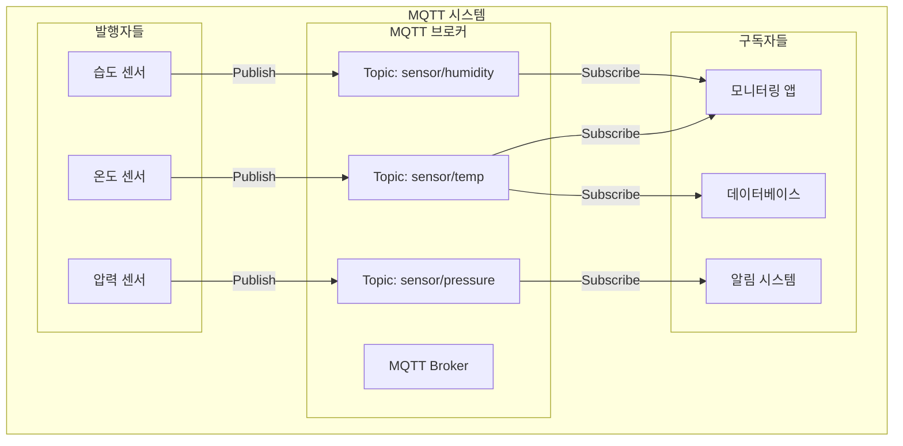
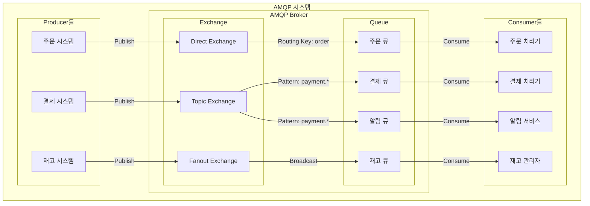
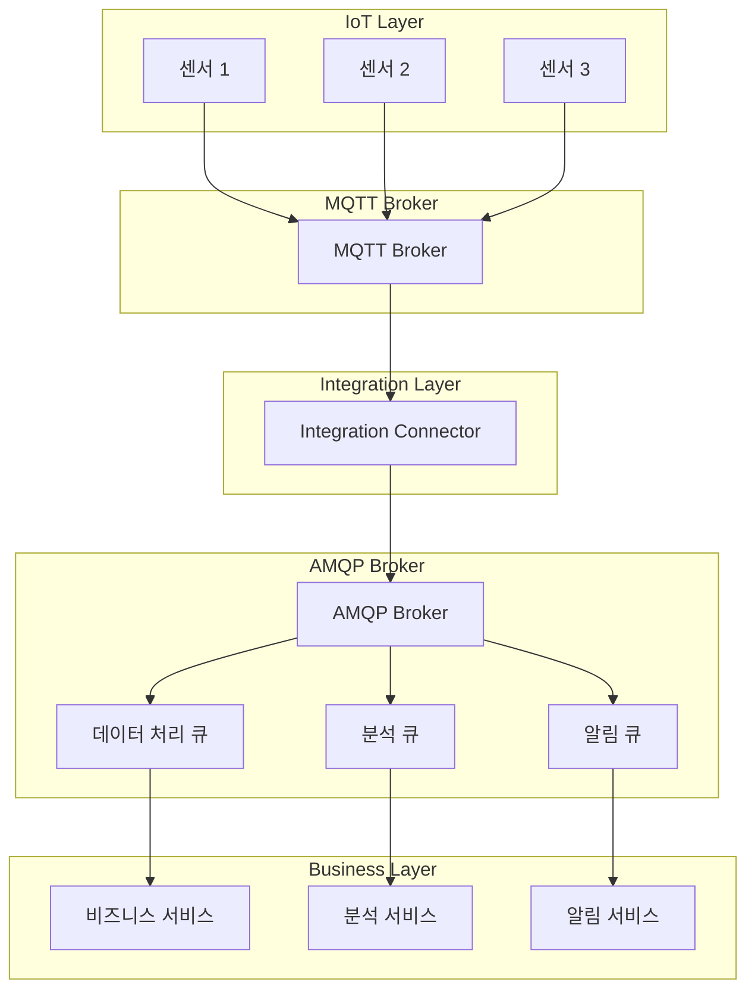

# AMQP vs MQTT 완전 비교 가이드

## 📋 목차
- [기본 개념 이해](#-기본-개념-이해)
- [MQTT 상세 분석](#-mqtt-상세-분석)
- [AMQP 상세 분석](#-amqp-상세-분석)
- [아키텍처 비교](#-아키텍처-비교)
- [성능 및 특성 비교](#-성능-및-특성-비교)
- [실제 구현 예시](#-실제-구현-예시)
- [사용 사례별 선택 가이드](#-사용-사례별-선택-가이드)
- [통합 시나리오](#-통합-시나리오)
- [트러블슈팅 가이드](#-트러블슈팅-가이드)
- [미래 전망](#-미래-전망)

---

## 🎯 기본 개념 이해

### 📮 메시지 브로커 시스템이란?

**메시지 브로커**는 분산 시스템에서 **중앙 집중식 메시지 허브** 역할을 하는 소프트웨어입니다.

#### 🔄 메시지 브로커의 핵심 역할
- **메시지 중계**: 발신자와 수신자 간의 메시지 전달
- **비동기 통신**: 발신자와 수신자가 동시에 온라인에 있지 않아도 통신 가능
- **메시지 버퍼링**: 일시적으로 메시지를 저장하여 안정적인 전달 보장
- **라우팅**: 메시지를 적절한 수신자에게 전달

#### 🏠 우체국과 같은 개념
메시지 브로커는 **우체국**과 비슷한 역할을 합니다:
- **발신자**: 편지를 보내는 사람 (Publisher/Producer)
- **우체국**: 편지를 중계하는 곳 (Message Broker)
- **수신자**: 편지를 받는 사람 (Subscriber/Consumer)
- **주소**: 편지의 목적지 (Topic/Routing Key)

### 📦 메시지 큐잉의 핵심 개념

#### 1. **비동기 통신 (Asynchronous Communication)**
- **동기 통신**: 요청 → 대기 → 응답 (전화 통화와 같음)
- **비동기 통신**: 요청 → 즉시 반환 → 나중에 응답 (이메일과 같음)

#### 2. **메시지 지속성 (Message Persistence)**
- **메모리 기반**: 빠르지만 브로커 재시작 시 메시지 손실
- **디스크 기반**: 느리지만 브로커 재시작 후에도 메시지 보존

#### 3. **확장성 (Scalability)**
- **수평 확장**: 브로커 클러스터링으로 처리량 증가
- **수직 확장**: 단일 브로커의 성능 향상

### 🔧 프로토콜의 중요성

프로토콜은 **컴퓨터 간 통신의 언어**입니다:

#### 📋 프로토콜의 3가지 핵심 요소
1. **구문 (Syntax)**: 메시지 형식과 구조
2. **의미론 (Semantics)**: 메시지의 의미와 해석
3. **타이밍 (Timing)**: 언제, 얼마나 빠르게 전송할지

#### 🌐 표준화의 중요성
- **상호 운용성**: 서로 다른 시스템 간 통신 가능
- **확장성**: 새로운 시스템 추가가 쉬움
- **유지보수성**: 표준을 따르므로 관리가 용이

## 🚀 MQTT 상세 분석

### 📖 MQTT란 무엇인가?

**MQTT (Message Queuing Telemetry Transport)**는 **IoT 환경에 특화된 경량 메시지 전송 프로토콜**입니다.

#### 🎯 MQTT의 설계 철학
- **경량성**: 최소한의 오버헤드로 제한된 리소스 환경에서 동작
- **실시간성**: 즉시 메시지 전달로 빠른 응답 보장
- **저전력**: 배터리 수명이 중요한 IoT 기기에 최적화
- **안정성**: 불안정한 네트워크 환경에서도 신뢰성 있는 통신

#### 📡 Telemetry의 의미
**Telemetry**는 **원격 측정**을 의미하는 용어로:
- **Tele**: 멀리 (그리스어)
- **Metry**: 측정 (그리스어)
- **목적**: 멀리 떨어진 곳에서 데이터를 수집하고 전송
- **IoT 활용**: 센서 데이터 수집 및 전송에 최적화

### 📊 MQTT 버전별 특징

| 버전 | 발표년도 | 주요 특징 | 사용 현황 |
|------|----------|-----------|-----------|
| **MQTT 3.1** | 2010년 | 초기 버전, 기본 기능 | 구형 시스템 |
| **MQTT 3.1.1** | 2014년 | OASIS 표준, 안정성 향상 | **가장 널리 사용** |
| **MQTT 5.0** | 2019년 | 향상된 기능, 성능 개선 | 신규 프로젝트 |

#### 🔄 MQTT 5.0의 주요 개선사항
- **세션 만료**: 클라이언트 세션 자동 만료
- **서버 재시작 알림**: 브로커 재시작 시 클라이언트에 알림
- **사용자 속성**: 커스텀 메타데이터 지원
- **응답 주제**: 요청-응답 패턴 지원
- **공유 구독**: 로드 밸런싱 지원

### MQTT의 핵심 구성 요소

#### 1. Broker (브로커)
- 메시지의 중앙 허브 역할
- 모든 메시지가 거쳐가는 중간 지점
- 마치 우체국과 같은 역할
- 클라이언트들이 연결하는 서버

#### 2. Publisher (발행자)
- 메시지를 보내는 쪽
- 센서, 앱, 기기 등이 될 수 있음
- 특정 주제(topic)로 메시지를 발행

#### 3. Subscriber (구독자)
- 메시지를 받는 쪽
- 특정 주제의 메시지를 구독하여 받음
- 여러 주제를 동시에 구독 가능

#### 4. Topic (토픽)
- 메시지의 주제/카테고리
- 계층 구조로 구성 (예: `home/livingroom/temperature`)
- 와일드카드 사용 가능 (`home/+/temperature`)

### QoS (Quality of Service) 레벨

MQTT는 메시지 전달의 신뢰성을 3단계로 나누어 제공합니다:

#### QoS 0 - 최대 한 번 전달 (At most once)
- 가장 빠르지만 메시지 손실 가능성 있음
- 실시간 게임, 스트리밍 등에 적합
- 확인 응답 없이 한 번만 전송

#### QoS 1 - 최소 한 번 전달 (At least once)
- 메시지가 최소 한 번은 도착함을 보장
- 중복 전달 가능성 있음
- 발신자가 확인 응답을 받을 때까지 재전송

#### QoS 2 - 정확히 한 번 전달 (Exactly once)
- 가장 안전하지만 느림
- 중요한 데이터 전송에 사용
- 4단계 핸드셰이크로 중복 방지

### MQTT의 특징

#### 장점
- **매우 가벼움**: 헤더가 2바이트로 최소
- **빠른 전송**: 낮은 오버헤드로 빠른 메시지 전달
- **배터리 효율적**: IoT 기기에 최적화
- **간단한 구현**: 복잡하지 않은 구조

#### 단점
- **제한된 메시지 크기**: 큰 데이터 전송에 부적합
- **기본적인 라우팅**: 복잡한 메시지 라우팅 불가
- **제한된 보안**: 기본적인 보안 기능만 제공

### MQTT 사용 사례
- **스마트 홈**: 온도 센서, 조명 제어
- **차량 통신**: 실시간 차량 상태 모니터링
- **산업 IoT**: 공장 센서 데이터 수집
- **모바일 앱**: 푸시 알림

---

## AMQP (Advanced Message Queuing Protocol)

### AMQP란?

AMQP는 기업 환경을 위한 고급 메시지 큐잉 프로토콜입니다. 복잡한 분산 시스템에서 안정적이고 안전한 메시지 전달이 필요한 경우에 사용됩니다.

**Advanced의 의미**
- 고급 기능들을 제공한다는 의미
- 복잡한 라우팅, 트랜잭션, 보안 기능 등 포함
- 기업 환경의 복잡한 요구사항을 충족

### AMQP의 핵심 구성 요소

#### 1. Exchange (교환소)
- 메시지 라우팅을 담당
- 메시지를 적절한 큐로 전달하는 역할
- 여러 종류의 라우팅 규칙 제공
- 메시지의 목적지를 결정하는 중간 처리소

#### 2. Queue (큐)
- 메시지 저장소
- 메시지가 실제로 저장되는 곳
- 소비자가 메시지를 가져가는 곳
- FIFO(First In, First Out) 방식으로 처리

#### 3. Binding (바인딩)
- Exchange와 Queue 간의 연결 규칙
- 어떤 메시지가 어떤 큐로 가야 하는지 정의
- 라우팅 키나 패턴으로 연결

#### 4. Channel (채널)
- 논리적 연결
- 하나의 연결에서 여러 개의 논리적 통신 경로
- 메모리 효율성을 위해 사용

### Exchange 타입

AMQP는 다양한 라우팅 방식을 제공합니다:

#### Direct Exchange
- 정확한 라우팅 키와 매칭되는 큐로 전달
- 예: `order.created` → 주문 큐
- 가장 단순한 라우팅 방식

#### Topic Exchange
- 패턴 기반 라우팅
- 와일드카드 사용 가능 (`*`, `#`)
- 예: `user.*.notification` → 모든 사용자 알림

#### Fanout Exchange
- 모든 바인딩된 큐에 브로드캐스트
- 라우팅 키 무시
- 예: 시스템 공지사항

#### Headers Exchange
- 메시지 속성 기반 라우팅
- 복잡한 조건부 라우팅에 사용
- 헤더 값으로 라우팅 결정

### AMQP의 특징

#### 장점
- **고급 라우팅**: 복잡한 메시지 라우팅 가능
- **강력한 보안**: TLS, SASL 등 고급 보안 기능
- **메시지 지속성**: 메시지 손실 방지
- **트랜잭션 지원**: 안전한 메시지 처리

#### 단점
- **높은 오버헤드**: 복잡한 구조로 인한 성능 저하
- **복잡한 구현**: 설정과 관리가 복잡
- **리소스 사용량**: 더 많은 메모리와 CPU 사용

### AMQP 사용 사례
- **금융 시스템**: 주식 거래, 결제 처리
- **엔터프라이즈**: 대규모 시스템 통합
- **마이크로서비스**: 서비스 간 통신
- **데이터 파이프라인**: 대용량 데이터 처리

---

## 🏗️ 아키텍처 비교

### 📊 MQTT 아키텍처



### 🏢 AMQP 아키텍처



### 🔄 아키텍처 차이점 분석

| 구분 | **MQTT** | **AMQP** |
|------|----------|----------|
| **메시지 흐름** | Publisher → Topic → Subscriber | Producer → Exchange → Queue → Consumer |
| **라우팅 방식** | Topic 기반 (단순) | Exchange 타입별 복잡한 라우팅 |
| **메시지 저장** | 브로커 메모리 (일시적) | 큐에 지속적 저장 |
| **확장성** | 브로커 클러스터링 | 큐별 독립적 확장 |
| **복잡도** | 단순한 구조 | 복잡한 구조 |

---

## ⚖️ 성능 및 특성 비교

### 📊 상세 비교표

| 특성 | **MQTT** | **AMQP** | **승자** |
|------|----------|----------|----------|
| **헤더 크기** | 2바이트 (최소) | 8바이트 (최소) | 🏆 MQTT |
| **메시지 크기** | 256MB (이론적) | 2GB+ | 🏆 AMQP |
| **처리량** | 초당 수만~수십만 | 초당 수백만 | 🏆 AMQP |
| **지연시간** | 밀리초 단위 | 밀리초~초 단위 | 🏆 MQTT |
| **메모리 사용량** | 매우 낮음 | 높음 | 🏆 MQTT |
| **CPU 사용량** | 낮음 | 높음 | 🏆 MQTT |
| **배터리 효율** | 매우 좋음 | 보통 | 🏆 MQTT |
| **네트워크 대역폭** | 낮음 | 높음 | 🏆 MQTT |
| **설정 복잡도** | 간단 | 복잡 | 🏆 MQTT |
| **학습 곡선** | 완만 | 가파름 | 🏆 MQTT |

### 🎯 성능 벤치마크 (참고용)

#### MQTT 성능 특성
- **동시 연결**: 10,000~100,000개
- **메시지 처리량**: 초당 50,000~500,000개
- **메모리 사용량**: 연결당 1~2KB
- **지연시간**: 1~10ms

#### AMQP 성능 특성
- **동시 연결**: 1,000~10,000개
- **메시지 처리량**: 초당 100,000~1,000,000개
- **메모리 사용량**: 연결당 10~50KB
- **지연시간**: 5~100ms

---

## 💻 실제 구현 예시

### 🔧 MQTT 구현 예시

#### JavaScript (Node.js) - MQTT 클라이언트
```javascript
const mqtt = require('mqtt');

// MQTT 클라이언트 연결
const client = mqtt.connect('mqtt://localhost:1883', {
  clientId: 'sensor_client_001',
  clean: true,
  keepalive: 60
});

// 연결 성공 시
client.on('connect', () => {
  console.log('MQTT 클라이언트 연결됨');
  
  // 주제 구독
  client.subscribe('sensor/temperature', { qos: 1 });
  client.subscribe('sensor/humidity', { qos: 1 });
  
  // 메시지 발행
  setInterval(() => {
    const temperature = Math.random() * 30 + 10; // 10-40도
    client.publish('sensor/temperature', temperature.toString(), { qos: 1 });
  }, 5000);
});

// 메시지 수신 시
client.on('message', (topic, message) => {
  console.log(`받은 메시지 - 주제: ${topic}, 내용: ${message.toString()}`);
});

// 오류 처리
client.on('error', (error) => {
  console.error('MQTT 오류:', error);
});
```

#### Python - MQTT 클라이언트
```python
import paho.mqtt.client as mqtt
import json
import time

class MQTTSensor:
    def __init__(self, broker_host, broker_port=1883):
        self.client = mqtt.Client()
        self.client.on_connect = self.on_connect
        self.client.on_message = self.on_message
        self.client.connect(broker_host, broker_port, 60)
    
    def on_connect(self, client, userdata, flags, rc):
        print(f"연결 결과: {rc}")
        if rc == 0:
            # 주제 구독
            client.subscribe("sensor/+/data")
            client.subscribe("control/+/command")
    
    def on_message(self, client, userdata, msg):
        topic = msg.topic
        payload = msg.payload.decode()
        print(f"받은 메시지 - 주제: {topic}, 내용: {payload}")
    
    def publish_sensor_data(self, sensor_id, data):
        topic = f"sensor/{sensor_id}/data"
        payload = json.dumps({
            "timestamp": time.time(),
            "value": data,
            "unit": "celsius"
        })
        self.client.publish(topic, payload, qos=1)
    
    def start(self):
        self.client.loop_start()
        
        # 센서 데이터 주기적 발행
        while True:
            temperature = 20 + (time.time() % 20)  # 20-40도 변동
            self.publish_sensor_data("temp_001", temperature)
            time.sleep(5)

# 사용 예시
if __name__ == "__main__":
    sensor = MQTTSensor("localhost")
    sensor.start()
```

### 🏢 AMQP 구현 예시

#### JavaScript (Node.js) - AMQP 클라이언트
```javascript
const amqp = require('amqplib');

class AMQPProducer {
  constructor(connectionString) {
    this.connectionString = connectionString;
    this.connection = null;
    this.channel = null;
  }

  async connect() {
    try {
      this.connection = await amqp.connect(this.connectionString);
      this.channel = await this.connection.createChannel();
      
      // Exchange 선언
      await this.channel.assertExchange('orders', 'direct', { durable: true });
      await this.channel.assertExchange('notifications', 'fanout', { durable: true });
      
      console.log('AMQP 연결 성공');
    } catch (error) {
      console.error('AMQP 연결 실패:', error);
    }
  }

  async publishOrder(orderData) {
    const queue = 'order_processing';
    await this.channel.assertQueue(queue, { durable: true });
    await this.channel.bindQueue(queue, 'orders', 'order.created');
    
    const message = JSON.stringify({
      orderId: orderData.id,
      customerId: orderData.customerId,
      items: orderData.items,
      total: orderData.total,
      timestamp: new Date().toISOString()
    });
    
    this.channel.publish('orders', 'order.created', Buffer.from(message), {
      persistent: true,
      messageId: orderData.id
    });
    
    console.log(`주문 발행됨: ${orderData.id}`);
  }

  async publishNotification(notification) {
    const message = JSON.stringify(notification);
    this.channel.publish('notifications', '', Buffer.from(message), {
      persistent: true
    });
    
    console.log('알림 발행됨');
  }
}

class AMQPConsumer {
  constructor(connectionString) {
    this.connectionString = connectionString;
    this.connection = null;
    this.channel = null;
  }

  async connect() {
    try {
      this.connection = await amqp.connect(this.connectionString);
      this.channel = await this.connection.createChannel();
      
      // Exchange 선언
      await this.channel.assertExchange('orders', 'direct', { durable: true });
      
      console.log('AMQP Consumer 연결 성공');
    } catch (error) {
      console.error('AMQP Consumer 연결 실패:', error);
    }
  }

  async consumeOrders() {
    const queue = 'order_processing';
    await this.channel.assertQueue(queue, { durable: true });
    await this.channel.bindQueue(queue, 'orders', 'order.created');
    
    this.channel.consume(queue, (msg) => {
      if (msg) {
        const orderData = JSON.parse(msg.content.toString());
        console.log('주문 처리 중:', orderData.orderId);
        
        // 주문 처리 로직
        this.processOrder(orderData);
        
        // 메시지 확인
        this.channel.ack(msg);
      }
    });
  }

  processOrder(orderData) {
    // 실제 주문 처리 로직
    console.log(`주문 ${orderData.orderId} 처리 완료`);
  }
}

// 사용 예시
async function main() {
  const producer = new AMQPProducer('amqp://localhost');
  const consumer = new AMQPConsumer('amqp://localhost');
  
  await producer.connect();
  await consumer.connect();
  
  // 주문 발행
  await producer.publishOrder({
    id: 'ORD-001',
    customerId: 'CUST-123',
    items: [{ name: '상품A', quantity: 2, price: 10000 }],
    total: 20000
  });
  
  // 주문 소비
  await consumer.consumeOrders();
}

main().catch(console.error);
```

#### Python - AMQP 클라이언트
```python
import pika
import json
import time

class AMQPProducer:
    def __init__(self, connection_params):
        self.connection_params = connection_params
        self.connection = None
        self.channel = None
    
    def connect(self):
        self.connection = pika.BlockingConnection(
            pika.ConnectionParameters(**self.connection_params)
        )
        self.channel = self.connection.channel()
        
        # Exchange 선언
        self.channel.exchange_declare(exchange='orders', exchange_type='direct', durable=True)
        self.channel.exchange_declare(exchange='notifications', exchange_type='fanout', durable=True)
        
        print("AMQP Producer 연결됨")
    
    def publish_order(self, order_data):
        queue = 'order_processing'
        self.channel.queue_declare(queue=queue, durable=True)
        self.channel.queue_bind(exchange='orders', queue=queue, routing_key='order.created')
        
        message = json.dumps({
            'orderId': order_data['id'],
            'customerId': order_data['customerId'],
            'items': order_data['items'],
            'total': order_data['total'],
            'timestamp': time.time()
        })
        
        self.channel.basic_publish(
            exchange='orders',
            routing_key='order.created',
            body=message,
            properties=pika.BasicProperties(
                delivery_mode=2,  # 메시지 지속성
                message_id=order_data['id']
            )
        )
        
        print(f"주문 발행됨: {order_data['id']}")
    
    def close(self):
        if self.connection:
            self.connection.close()

class AMQPConsumer:
    def __init__(self, connection_params):
        self.connection_params = connection_params
        self.connection = None
        self.channel = None
    
    def connect(self):
        self.connection = pika.BlockingConnection(
            pika.ConnectionParameters(**self.connection_params)
        )
        self.channel = self.connection.channel()
        
        # Exchange 선언
        self.channel.exchange_declare(exchange='orders', exchange_type='direct', durable=True)
        
        print("AMQP Consumer 연결됨")
    
    def consume_orders(self):
        queue = 'order_processing'
        self.channel.queue_declare(queue=queue, durable=True)
        self.channel.queue_bind(exchange='orders', queue=queue, routing_key='order.created')
        
        def callback(ch, method, properties, body):
            order_data = json.loads(body)
            print(f"주문 처리 중: {order_data['orderId']}")
            
            # 주문 처리 로직
            self.process_order(order_data)
            
            # 메시지 확인
            ch.basic_ack(delivery_tag=method.delivery_tag)
        
        self.channel.basic_consume(queue=queue, on_message_callback=callback)
        print("주문 소비 시작...")
        self.channel.start_consuming()
    
    def process_order(self, order_data):
        # 실제 주문 처리 로직
        print(f"주문 {order_data['orderId']} 처리 완료")
    
    def close(self):
        if self.connection:
            self.connection.close()

# 사용 예시
if __name__ == "__main__":
    connection_params = {
        'host': 'localhost',
        'port': 5672,
        'virtual_host': '/',
        'credentials': pika.PlainCredentials('guest', 'guest')
    }
    
    producer = AMQPProducer(connection_params)
    consumer = AMQPConsumer(connection_params)
    
    try:
        producer.connect()
        consumer.connect()
        
        # 주문 발행
        producer.publish_order({
            'id': 'ORD-001',
            'customerId': 'CUST-123',
            'items': [{'name': '상품A', 'quantity': 2, 'price': 10000}],
            'total': 20000
        })
        
        # 주문 소비
        consumer.consume_orders()
        
    except KeyboardInterrupt:
        print("프로그램 종료")
    finally:
        producer.close()
        consumer.close()
```

---

## 🎯 사용 사례별 선택 가이드

### 🏠 MQTT를 선택해야 할 때

#### 1. **IoT 및 센서 네트워크**
- **스마트 홈**: 조명, 온도 조절기, 보안 시스템
- **산업 IoT**: 공장 센서, 장비 모니터링
- **환경 모니터링**: 대기질, 소음, 온도 측정
- **농업 IoT**: 토양 센서, 관수 시스템

#### 2. **제한된 리소스 환경**
- **배터리 기기**: 배터리 수명이 중요한 센서
- **저전력 마이크로컨트롤러**: ESP32, Arduino 등
- **제한된 메모리**: 8KB~64KB 메모리 환경
- **낮은 CPU 성능**: 마이크로컨트롤러 기반 기기

#### 3. **실시간 통신 요구사항**
- **즉시 반응**: 실시간 제어가 필요한 시스템
- **낮은 지연시간**: 밀리초 단위 응답 요구
- **이벤트 기반**: 상태 변화 시 즉시 알림

#### 4. **간단한 구현 요구사항**
- **빠른 프로토타이핑**: 빠른 개발이 필요한 경우
- **단순한 메시징**: 복잡한 라우팅이 불필요한 경우
- **낮은 운영 복잡성**: 간단한 관리가 필요한 경우

### 🏢 AMQP를 선택해야 할 때

#### 1. **기업 환경의 복잡한 시스템**
- **금융 시스템**: 주식 거래, 결제 처리
- **전자상거래**: 주문 처리, 재고 관리
- **엔터프라이즈**: 대규모 시스템 통합
- **마이크로서비스**: 서비스 간 복잡한 통신

#### 2. **고급 메시지 라우팅 요구사항**
- **복잡한 라우팅**: 다양한 조건에 따른 메시지 분배
- **메시지 변환**: 메시지 형식 변환이 필요한 경우
- **트랜잭션**: 원자적 메시지 처리 요구
- **메시지 순서**: 메시지 순서 보장이 중요한 경우

#### 3. **대용량 데이터 처리**
- **빅데이터**: 대용량 데이터 스트리밍
- **데이터 파이프라인**: ETL 프로세스
- **실시간 분석**: 스트림 처리 및 분석
- **배치 처리**: 대량 메시지 일괄 처리

#### 4. **강력한 보안 요구사항**
- **기업 보안**: 높은 보안 수준 요구
- **규정 준수**: 금융, 의료 등 규제 산업
- **감사 추적**: 메시지 추적 및 로깅
- **접근 제어**: 세밀한 권한 관리

### 🔄 하이브리드 접근법

#### **MQTT + AMQP 통합 아키텍처**


#### **통합 시나리오 예시**
1. **IoT 데이터 수집**: MQTT로 센서 데이터 수집
2. **데이터 변환**: Integration Connector에서 데이터 변환
3. **비즈니스 처리**: AMQP로 복잡한 비즈니스 로직 처리
4. **결과 전달**: MQTT로 IoT 기기에 결과 전달

---

## 🔧 통합 시나리오

### 🌐 실제 통합 사례

#### 1. **스마트 팩토리 시스템**
```
IoT 센서 → MQTT → 데이터 수집 서버 → AMQP → 분석 엔진 → MQTT → 제어 시스템
```

**구현 예시**:
```javascript
// MQTT에서 AMQP로 데이터 전달
const mqtt = require('mqtt');
const amqp = require('amqplib');

class FactoryIntegration {
  constructor() {
    this.mqttClient = null;
    this.amqpConnection = null;
    this.amqpChannel = null;
  }

  async initialize() {
    // MQTT 연결
    this.mqttClient = mqtt.connect('mqtt://factory-broker:1883');
    
    // AMQP 연결
    this.amqpConnection = await amqp.connect('amqp://business-broker:5672');
    this.amqpChannel = await this.amqpConnection.createChannel();
    
    // Exchange 선언
    await this.amqpChannel.assertExchange('factory_data', 'topic', { durable: true });
  }

  async startDataFlow() {
    // MQTT 메시지 수신
    this.mqttClient.on('message', async (topic, message) => {
      const sensorData = JSON.parse(message.toString());
      
      // 데이터 변환 및 강화
      const enrichedData = {
        ...sensorData,
        timestamp: new Date().toISOString(),
        factoryId: 'FACTORY_001',
        processed: true
      };
      
      // AMQP로 전달
      await this.amqpChannel.publish(
        'factory_data',
        `sensor.${sensorData.type}`,
        Buffer.from(JSON.stringify(enrichedData)),
        { persistent: true }
      );
    });
    
    // 센서 데이터 구독
    this.mqttClient.subscribe('factory/sensor/+');
  }
}
```

#### 2. **스마트 시티 플랫폼**
```
도시 센서 → MQTT → 시티 허브 → AMQP → 시티 서비스 → MQTT → 시민 앱
```

#### 3. **의료 IoT 시스템**
```
의료기기 → MQTT → 병원 서버 → AMQP → 의료 분석 → MQTT → 의료진 알림
```

---

## 🚨 트러블슈팅 가이드

### 🔍 MQTT 일반적인 문제와 해결방법

#### 1. **연결 문제**
```bash
# 문제: MQTT 클라이언트 연결 실패
# 원인: 브로커 서비스 중단, 네트워크 문제, 인증 실패

# 해결방법:
# 1. 브로커 상태 확인
systemctl status mosquitto

# 2. 포트 확인
netstat -tlnp | grep 1883

# 3. 방화벽 확인
ufw status | grep 1883

# 4. 연결 테스트
mosquitto_pub -h localhost -t "test" -m "hello" -d
```

#### 2. **메시지 손실**
```javascript
// 문제: 메시지가 전달되지 않음
// 해결방법: QoS 레벨 조정

// QoS 0: 빠르지만 손실 가능
client.publish('sensor/temp', '25.5', { qos: 0 });

// QoS 1: 안정적이지만 중복 가능
client.publish('sensor/temp', '25.5', { qos: 1 });

// QoS 2: 가장 안전하지만 느림
client.publish('sensor/temp', '25.5', { qos: 2 });
```

#### 3. **성능 문제**
```bash
# Mosquitto 성능 튜닝
# mosquitto.conf 설정
max_connections 10000
max_inflight_messages 100
max_queued_messages 1000
persistence true
autosave_interval 1800
```

### 🔧 AMQP 일반적인 문제와 해결방법

#### 1. **메모리 사용량 증가**
```bash
# 문제: RabbitMQ 메모리 사용량 급증
# 해결방법: 메모리 임계값 설정

# rabbitmq.conf
vm_memory_high_watermark.relative = 0.6
vm_memory_high_watermark_paging_ratio = 0.5
```

#### 2. **큐 백로그**
```bash
# 문제: 큐에 메시지가 쌓임
# 해결방법: Consumer 수 증가 또는 처리 속도 향상

# Consumer 수 증가
rabbitmqctl set_policy ha-all ".*" '{"ha-mode":"all"}'
```

#### 3. **클러스터 문제**
```bash
# 문제: 클러스터 노드 간 동기화 실패
# 해결방법: 클러스터 상태 확인 및 복구

# 클러스터 상태 확인
rabbitmqctl cluster_status

# 노드 재시작
rabbitmqctl stop_app
rabbitmqctl start_app
```

### 📊 모니터링 및 진단

#### MQTT 모니터링
```bash
# Mosquitto 로그 확인
tail -f /var/log/mosquitto/mosquitto.log

# 연결 상태 확인
mosquitto_sub -h localhost -t '$SYS/broker/clients/connected' -C 1

# 메시지 통계
mosquitto_sub -h localhost -t '$SYS/broker/messages/sent' -C 1
```

#### AMQP 모니터링
```bash
# RabbitMQ 관리 플러그인 활성화
rabbitmq-plugins enable rabbitmq_management

# 큐 상태 확인
rabbitmqctl list_queues name messages consumers

# 연결 상태 확인
rabbitmqctl list_connections
```

---

## 🚀 미래 전망

### 🌟 기술 발전 방향

#### 1. **MQTT의 발전**
- **MQTT 6.0**: 더욱 향상된 성능과 기능
- **5G 통합**: 초고속, 초저지연 통신과의 결합
- **엣지 컴퓨팅**: 분산 처리 환경에서의 활용
- **AI/ML 통합**: 실시간 데이터 분석과의 연동

#### 2. **AMQP의 발전**
- **클라우드 네이티브**: Kubernetes 환경 최적화
- **서버리스 통합**: AWS Lambda, Azure Functions 연동
- **스트리밍 강화**: 실시간 스트림 처리 기능 향상
- **보안 강화**: 양자 암호화 등 차세대 보안 기술

### 🔮 통합 트렌드

#### 1. **하이브리드 아키텍처**
- **IoT + 엔터프라이즈**: MQTT와 AMQP의 완벽한 통합
- **엣지 + 클라우드**: 분산 환경에서의 메시징
- **실시간 + 배치**: 스트리밍과 배치 처리의 결합

#### 2. **표준화 발전**
- **통합 표준**: MQTT와 AMQP 간 호환성 향상
- **국제 표준**: ISO/IEC 표준으로의 발전
- **오픈소스**: 더 많은 오픈소스 구현체 등장

### 📈 시장 전망

#### 1. **IoT 시장 성장**
- **2025년 예상**: 전 세계 IoT 기기 750억 개
- **MQTT 수요**: IoT 기기 증가에 따른 MQTT 사용량 급증
- **새로운 용도**: 자율주행차, 스마트시티, 의료 IoT

#### 2. **엔터프라이즈 메시징**
- **마이크로서비스**: 서비스 간 통신의 핵심 기술
- **클라우드 마이그레이션**: 클라우드 환경에서의 메시징
- **디지털 전환**: 전통 기업의 디지털 전환 가속화

---

## 🎯 결론

### 🌟 핵심 요약

**MQTT**와 **AMQP**는 각각 다른 목적과 환경에 최적화된 메시징 프로토콜입니다:

#### **MQTT의 강점**
- **IoT 특화**: 센서와 IoT 기기에 최적화
- **경량성**: 제한된 리소스 환경에서 효율적
- **실시간성**: 즉시 반응이 필요한 시스템에 적합
- **간단함**: 빠른 구현과 배포 가능

#### **AMQP의 강점**
- **엔터프라이즈급**: 복잡한 비즈니스 로직 처리
- **고급 기능**: 강력한 라우팅과 트랜잭션 지원
- **확장성**: 대규모 시스템 구축 가능
- **신뢰성**: 높은 메시지 전달 보장

### 🎯 선택 가이드

| 요구사항 | **MQTT** | **AMQP** |
|----------|----------|----------|
| **IoT 기기 통신** | ✅ 최적 | ❌ 부적합 |
| **실시간 센서 데이터** | ✅ 최적 | ❌ 부적합 |
| **저전력 환경** | ✅ 최적 | ❌ 부적합 |
| **복잡한 비즈니스 로직** | ❌ 부적합 | ✅ 최적 |
| **대용량 데이터 처리** | ❌ 부적합 | ✅ 최적 |
| **고급 라우팅** | ❌ 부적합 | ✅ 최적 |
| **빠른 프로토타이핑** | ✅ 최적 | ❌ 부적합 |
| **엔터프라이즈 환경** | ❌ 부적합 | ✅ 최적 |

---

##  추가 학습 자료

### 공식 문서
- [MQTT.org 공식 사이트](https://mqtt.org/)
- [AMQP.org 공식 사이트](https://www.amqp.org/)
- [OASIS MQTT 표준](https://docs.oasis-open.org/mqtt/mqtt/v5.0/mqtt-v5.0.html)
- [RabbitMQ 공식 문서](https://www.rabbitmq.com/documentation.html)

### 개발 도구
- **MQTT Explorer**: GUI 기반 MQTT 클라이언트
- **RabbitMQ Management**: AMQP 브로커 관리 도구
- **MQTT.fx**: 데스크톱 MQTT 클라이언트
- **Apache ActiveMQ**: AMQP 브로커 구현체

### 온라인 리소스
- [MQTT GitHub](https://github.com/mqtt/mqtt.github.io)
- [RabbitMQ GitHub](https://github.com/rabbitmq)
- [Eclipse Mosquitto](https://mosquitto.org/)
- [AMQP 1.0 표준](https://www.amqp.org/specification/1.0/amqp-org-download)